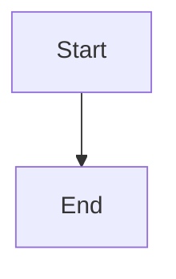
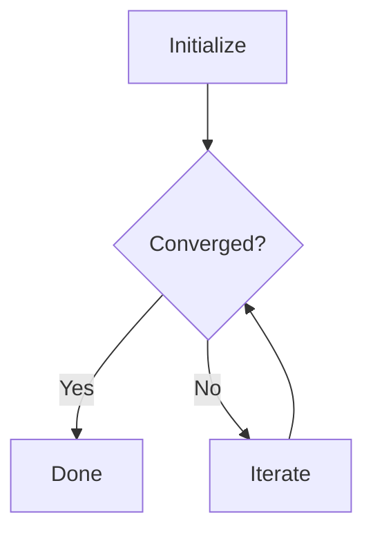
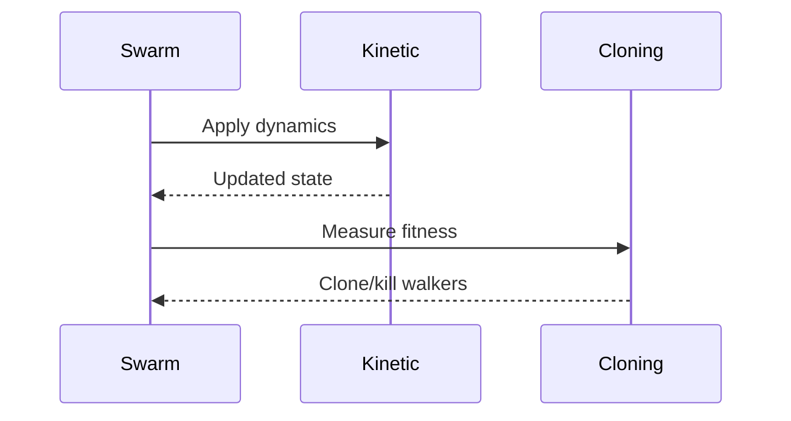
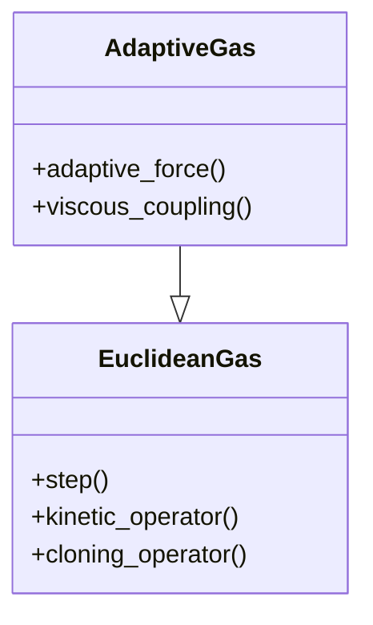
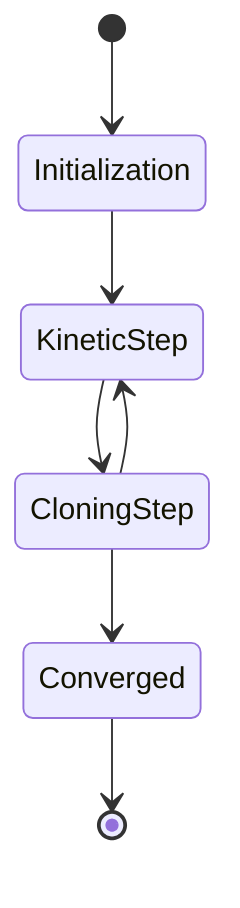

# Mermaid Diagram Support

This document explains how mermaid diagrams are handled in the Fragile documentation.

## Overview

The Fragile project uses a **hybrid approach** for mermaid diagrams that allows:

1. **Editing**: Use standard GitHub-flavored markdown (````mermaid`) when writing/editing
2. **Rendering**: Automatically converts to Jupyter Book MyST directives (`:::mermaid`) at build time

This approach provides the best of both worlds:
- VSCode markdown preview works correctly (shows diagrams)
- GitHub renders diagrams correctly when viewing markdown files
- Jupyter Book renders diagrams correctly in the final documentation

## How It Works

### Writing Mermaid Diagrams

When writing documentation, use the standard markdown syntax:

````markdown

````

This syntax:
- ✅ Renders in VSCode preview
- ✅ Renders on GitHub
- ✅ Works with most markdown tools
- ✅ Is familiar to developers

### Build-Time Conversion

When you run `make build-docs`, the following happens:

1. **Pre-processing**: `convert_mermaid_blocks.py` runs automatically
2. **Conversion**: All ````mermaid` blocks → `:::mermaid` directive blocks
3. **Build**: Jupyter Book processes the converted files
4. **Output**: HTML documentation with rendered diagrams

The conversion is configured in `pyproject.toml`:

```toml
[tool.hatch.envs.docs.scripts]
build = [
    "python src/tools/convert_mermaid_blocks.py docs/source --in-place",
    "jupyter-book build docs/",
    "uv pip freeze > docs/requirements.txt",
]
```

### Source Files Remain Unchanged

**Important**: The conversion modifies files **in-place** just before building, but this is safe because:

1. The original ````mermaid` syntax still works for editing
2. Git tracks the original files (not the converted versions)
3. Next build re-converts everything consistently
4. You can always restore from git if needed

## Manual Conversion

If you need to manually convert files (rare):

```bash
# Convert a single file
python src/tools/convert_mermaid_blocks.py input.md output.md

# Convert all files in docs/source/ in-place
python src/tools/convert_mermaid_blocks.py docs/source --in-place
```

## Supported Diagram Types

Mermaid supports many diagram types. Here are the most useful for Fragile documentation:

### Flowcharts


### Sequence Diagrams


### Class Diagrams


### State Diagrams


## Troubleshooting

### Diagrams Not Rendering in Jupyter Book

If diagrams don't render after building:

1. Check that `sphinxcontrib-mermaid` is installed (it's in `pyproject.toml`)
2. Verify the conversion ran: look for `:::mermaid` in `docs/source/` files
3. Check Jupyter Book build output for mermaid-related errors
4. Try cleaning and rebuilding: `make clean-docs && make build-docs`

### VSCode Preview Not Showing Diagrams

VSCode should show mermaid diagrams with the standard ````mermaid` syntax. If not:

1. Install the "Markdown Preview Mermaid Support" extension
2. Or use the "Markdown Preview Enhanced" extension
3. Restart VSCode after installing extensions

### Git Showing Unexpected Changes

If git shows `::: mermaid` changes:

1. The conversion script modified files in-place
2. This is expected during/after building docs
3. Options:
   - **Recommended**: Commit the converted format (it still works for editing)
   - **Or**: `git checkout -- docs/source/` to revert to original ````mermaid` syntax
   - **Or**: Add `docs/source/**/*.md` to `.gitignore` (not recommended)

## Best Practices

1. **Write** documentation using ````mermaid` syntax (standard markdown)
2. **Don't worry** about the `:::mermaid` conversion - it's automatic
3. **Commit** either format - both work (````mermaid` is more portable)
4. **Run** `make clean-docs && make build-docs` if diagrams don't render
5. **Use** mermaid's live editor (https://mermaid.live) to prototype complex diagrams

## References

- [Mermaid Documentation](https://mermaid.js.org/)
- [Mermaid Live Editor](https://mermaid.live)
- [Jupyter Book Mermaid Support](https://jupyterbook.org/en/stable/content/figures.html#mermaid)
- [sphinxcontrib-mermaid](https://github.com/mgaitan/sphinxcontrib-mermaid)
