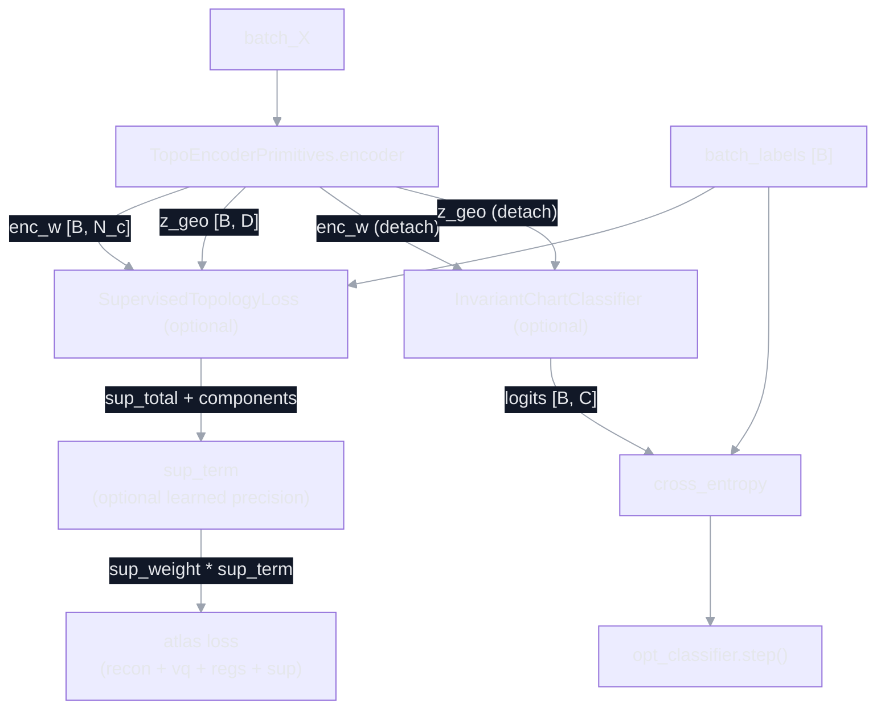

# TopoEncoder Architecture Diagrams (Current Implementation)

This document mirrors the current implementation in:
- `src/fragile/core/layers/atlas.py` (PrimitiveAttentiveAtlasEncoder + PrimitiveTopologicalDecoder)
- `src/experiments/topoencoder_2d.py` (TopoEncoderPrimitives wiring and config)

The diagrams include the covariant chart routing upgrades:
1) Wilson-line transport (Cayley transform of a learned skew matrix)
2) Metric-aware temperature `tau(z)` from conformal factor
3) Geodesic query terms (linear + quadratic in `z`) with **two tensorization options**

Implementation toggles wired in `src/experiments/topoencoder_2d.py`:
- `covariant_attn`: CovariantChartRouter vs dot-product (encoder) / latent_router (decoder).
- `vision_preproc`: CovariantRetina replaces the MLP feature extractor.
- `soft_equiv_metric`: per-chart SoftEquivariantLayer metric on codebook distances (+ optional L1 regularizer).

---

## CovariantChartRouter (Standalone)

---

## Full TopoEncoder (Encoder + Decoder)

---

## Decoder Detail (Inverse Atlas, Router External)

---

## Experiment Wiring (Supervised + Classifier Readout)

Supervised topology loss and the invariant classifier readout are optional in
`src/experiments/topoencoder_2d.py`. The classifier head is detached from atlas
gradients and trained with its own optimizer.

Metric-only logging:
- `sup_acc` is computed from `enc_w @ p_y_given_k` and does not backpropagate.
