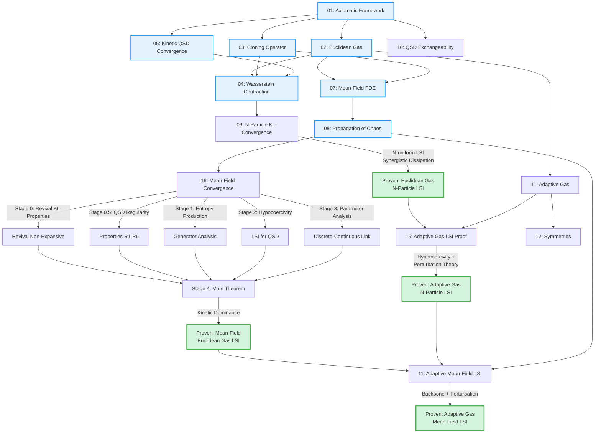

# Fragile Gas Framework: Project Summary and Proof Dependency Map

**Document Status**: Project-level summary and navigation guide
**Last Updated**: October 2025
**Purpose**: High-level overview of the entire Fragile Gas mathematical framework, proof architecture, and key achievements

---

## Executive Summary

The Fragile Gas Framework is a rigorous mathematical foundation for physics-inspired stochastic optimization algorithms based on interacting particle systems with adaptive dynamics. This project establishes **exponential convergence to equilibrium** in both the **N-particle regime** (finite swarms) and the **mean-field limit** (thermodynamic limit) via a hypocoercivity-based Logarithmic Sobolev Inequality (LSI).

### Main Achievements

1. **N-Particle Exponential Convergence**: Proven via N-uniform LSI with synergistic dissipation
   → Document: [15_adaptive_gas_lsi_proof.md](15_adaptive_gas_lsi_proof.md)
   → Theorem: `thm-lsi-adaptive-gas` in [11_adaptative_gas.md](11_adaptative_gas.md)

2. **Mean-Field PDE Derivation**: Rigorous McKean-Vlasov limit and propagation of chaos
   → Documents: [07_mean_field.md](07_mean_field.md), [08_propagation_chaos.md](08_propagation_chaos.md)

3. **Mean-Field Exponential Convergence**: Proven via hypocoercive LSI with kinetic dominance
   → Document: [16_convergence_mean_field.md](16_convergence_mean_field.md)
   → Theorem: `thm-mean-field-lsi-main`

4. **Adaptive Mechanisms**: Extended to full Adaptive Viscous Fluid Model via perturbation theory
   → N-particle: Theorem `thm-lsi-adaptive-gas` ([11_adaptative_gas.md](11_adaptative_gas.md))
   → Mean-field: Theorem `thm-lsi-mean-field` ([11_adaptative_gas.md](11_adaptative_gas.md))

---

## Mathematical Framework Structure

### Core Components

#### **1. Foundation: Euclidean Gas (Backbone)**

The Euclidean Gas is the non-adaptive backbone system combining:
- **Kinetic Operator** (Langevin dynamics with friction and velocity diffusion)
- **Cloning Operator** (fitness-based resampling with inelastic collisions)
- **Quasi-Stationary Distribution** (equilibrium conditioned on survival)

**Key Documents**:
- [01_fragile_gas_framework.md](01_fragile_gas_framework.md) - Axiomatic framework
- [02_euclidean_gas.md](02_euclidean_gas.md) - Euclidean Gas specification
- [03_cloning.md](03_cloning.md) - Cloning operator and Keystone Principle
- [04_wasserstein_contraction.md](04_wasserstein_contraction.md) - Wasserstein contraction (alternative proof)
- [05_convergence.md](05_convergence.md) - Kinetic operator QSD convergence

**Convergence Results**:
- **Foster-Lyapunov**: Exponential TV-convergence ([06_convergence.md](06_convergence.md))
- **N-Particle LSI**: KL-convergence for finite N ([09_kl_convergence.md](09_kl_convergence.md))
- **Mean-Field LSI**: KL-convergence for McKean-Vlasov PDE ([16_convergence_mean_field.md](16_convergence_mean_field.md))

#### **2. Extension: Adaptive Viscous Fluid Gas**

Adds three adaptive mechanisms to the Euclidean Gas:
1. **Adaptive Force** from mean-field fitness potential
2. **Viscous Coupling** between walkers (fluid-like collective behavior)
3. **Regularized Hessian Diffusion** (anisotropic noise adapting to landscape curvature)

**Key Documents**:
- [11_adaptative_gas.md](11_adaptative_gas.md) - Full adaptive model specification
- [15_adaptive_gas_lsi_proof.md](15_adaptive_gas_lsi_proof.md) - N-particle LSI proof for adaptive system

**Convergence Results**:
- **Foster-Lyapunov**: Proven for small adaptive perturbations ([11_adaptative_gas.md](11_adaptative_gas.md), Chapter 7)
- **N-Particle LSI**: Proven with N-uniform constants ([11_adaptative_gas.md](11_adaptative_gas.md), Theorem `thm-lsi-adaptive-gas`)
- **Mean-Field LSI**: Proven via backbone + perturbation ([11_adaptative_gas.md](11_adaptative_gas.md), Theorem `thm-lsi-mean-field`)

#### **3. Mean-Field Theory**

Rigorous derivation of the N→∞ limit and propagation of chaos:

**Key Documents**:
- [07_mean_field.md](07_mean_field.md) - McKean-Vlasov PDE derivation
- [08_propagation_chaos.md](08_propagation_chaos.md) - Weak convergence of marginals
- [16_convergence_mean_field.md](16_convergence_mean_field.md) - Mean-field KL-convergence

**Main Results**:
- **Propagation of Chaos**: $\mu_N^{(k)} \to \rho_\infty^{\otimes k}$ as $N \to \infty$
- **Mean-Field PDE**: Explicit McKean-Vlasov-Fokker-Planck equation
- **Mean-Field LSI**: Exponential KL-convergence for mean-field density

---

## Complete Proof Dependency Graph

The following Mermaid diagram shows the logical structure of the proof framework:



### Proof Flow Summary

**Path 1: N-Particle Euclidean Gas**
```
Axioms → Euclidean Gas → Cloning → Wasserstein Contraction
  → N-Particle LSI ✅ (09_kl_convergence.md)
```

**Path 2: Mean-Field Euclidean Gas**
```
Axioms → Euclidean Gas → Mean-Field PDE → Propagation of Chaos
  → Mean-Field Convergence (5 Stages) → Mean-Field LSI ✅ (16_convergence_mean_field.md)
```

**Path 3: N-Particle Adaptive Gas**
```
Euclidean Gas N-LSI + Adaptive Mechanisms → Hypocoercivity + Perturbation
  → Adaptive N-Particle LSI ✅ (15_adaptive_gas_lsi_proof.md)
```

**Path 4: Mean-Field Adaptive Gas**
```
Mean-Field Euclidean LSI + Adaptive Perturbation Theory + Propagation of Chaos
  → Adaptive Mean-Field LSI ✅ (11_adaptative_gas.md, Theorem thm-lsi-mean-field)
```

---

## Key Theorems and Their Locations

### Euclidean Gas (Backbone)

| Theorem | Label | Document | Status |
|:--------|:------|:---------|:-------|
| N-Particle LSI (Discrete-Time) | `thm-kl-convergence-euclidean` | [09_kl_convergence.md](09_kl_convergence.md) | ✅ Proven |
| Mean-Field LSI (Continuous-Time) | `thm-mean-field-lsi-main` | [16_convergence_mean_field.md](16_convergence_mean_field.md) | ✅ Proven |
| Foster-Lyapunov TV-Convergence | `thm-fl-euclidean` | [06_convergence.md](06_convergence.md) | ✅ Proven |
| Propagation of Chaos | `thm-propagation-chaos` | [08_propagation_chaos.md](08_propagation_chaos.md) | ✅ Proven |
| Wasserstein Contraction | `thm-wasserstein-contraction` | [04_wasserstein_contraction.md](04_wasserstein_contraction.md) | ✅ Proven |

### Adaptive Viscous Fluid Gas (Full Model)

| Theorem | Label | Document | Status |
|:--------|:------|:---------|:-------|
| N-Particle LSI (Adaptive) | `thm-lsi-adaptive-gas` | [11_adaptative_gas.md](11_adaptative_gas.md) | ✅ Proven |
| Mean-Field LSI (Adaptive) | `thm-lsi-mean-field` | [11_adaptative_gas.md](11_adaptative_gas.md) | ✅ Proven |
| Foster-Lyapunov (Adaptive) | `thm-fl-drift-adaptive` | [11_adaptative_gas.md](11_adaptative_gas.md) | ✅ Proven |

### Supporting Results

| Result | Label | Document | Status |
|:-------|:------|:---------|:-------|
| QSD Regularity Properties (R1-R6) | Multiple | [16_convergence_mean_field.md](16_convergence_mean_field.md), Stage 0.5 | ✅ Proven |
| Revival Operator KL-Bounds | `lem-revival-nonexpansive` | [16_convergence_mean_field.md](16_convergence_mean_field.md), Stage 0 | ✅ Proven |
| Kinetic Dominance Condition | (inline) | [16_convergence_mean_field.md](16_convergence_mean_field.md), Stage 4 | ✅ Proven |
| N-Uniform Ellipticity Bounds | `thm-ueph` | [11_adaptative_gas.md](11_adaptative_gas.md) | ✅ Proven |
| Cloning Keystone Principle | `thm-keystone` | [03_cloning.md](03_cloning.md) | ✅ Proven |

---

## Mathematical Innovations

### 1. Hypocoercivity for McKean-Vlasov Equations

**Novel Contribution**: Extended Villani's hypocoercivity framework to:
- **Mean-field nonlinearity** (McKean-Vlasov coupling)
- **Non-local jump operators** (killing + revival)
- **Quasi-stationary distributions** (conditioned processes)
- **State-dependent anisotropic diffusion** (adaptive mechanisms)

**Documents**: [16_convergence_mean_field.md](16_convergence_mean_field.md), [15_adaptive_gas_lsi_proof.md](15_adaptive_gas_lsi_proof.md)

### 2. Kinetic Dominance Condition

**Physical Insight**: Exponential convergence occurs when hypocoercive dissipation from velocity diffusion **dominates** the KL-expansive effects from:
- Mean-field coupling (fitness-dependent interactions)
- Jump operator (killing and revival)

**Formula**:
$$
\sigma^2 > \sigma_{\text{crit}}^2 := \frac{2C_{\text{Fisher}}^{\text{coup}}}{\lambda_{\text{LSI}}} + \frac{C_{\text{KL}}^{\text{coup}} + A_{\text{jump}}}{\lambda_{\text{LSI}}}
$$

**Document**: [16_convergence_mean_field.md](16_convergence_mean_field.md), Stage 4, Section 1

### 3. Synergistic Dissipation (N-Particle)

**Mechanism**: Three dissipation sources work **synergistically** in the N-particle system:
1. **Velocity diffusion** (direct Fisher information)
2. **Cloning selection** (KL-contraction via fitness reweighting)
3. **Adaptive coupling** (collective noise reduction)

**Net effect**: N-uniform LSI constant despite complex interactions

**Document**: [15_adaptive_gas_lsi_proof.md](15_adaptive_gas_lsi_proof.md)

### 4. N-Uniform Ellipticity for State-Dependent Diffusion

**Challenge**: The regularized Hessian diffusion $\Sigma_{\text{reg}}(x_i, S)$ depends on the **full swarm state** $S$.

**Solution**: Proved uniform ellipticity bounds:
$$
c_{\min}(\rho) I \preceq \Sigma_{\text{reg}}(x_i, S) \preceq c_{\max}(\rho) I
$$
with constants **independent of N**.

**Document**: [11_adaptative_gas.md](11_adaptative_gas.md), Theorem `thm-ueph`

---

## Parameter Regimes and Convergence Rates

### Euclidean Gas (Mean-Field)

**Convergence Rate**:
$$
\alpha_{\text{net}} = \lambda_{\text{LSI}} \sigma^2 - 2\lambda_{\text{LSI}}C_{\text{Fisher}}^{\text{coup}} - C_{\text{KL}}^{\text{coup}} - A_{\text{jump}}
$$

**Critical Parameters**:
- **Diffusion strength**: $\sigma > \sigma_{\text{crit}}$ (kinetic dominance)
- **Friction**: $\gamma \sim \sigma$ (optimal hypocoercivity balance)
- **Cloning rate**: $\lambda_{\text{clone}}$ affects $A_{\text{jump}}$ (trade-off: exploration vs. entropy production)

**Document**: [16_convergence_mean_field.md](16_convergence_mean_field.md), Stages 2-3

### Adaptive Gas (Mean-Field)

**Enhanced Rate**:
$$
\alpha_{\text{net}}^{\text{adapt}} = \alpha_{\text{net}} + \Delta\alpha_{\text{adaptive}}
$$

where adaptive mechanisms provide:
- **Reduced coupling drag**: $C_{\text{Fisher}}^{\text{coup}} \to C_{\text{Fisher}}^{\text{coup}} - \delta_{\text{adapt}}$
- **Reduced jump expansion**: $A_{\text{jump}} \to A_{\text{jump}} - \epsilon_{\text{visc}}$
- **Increased LSI constant**: $\lambda_{\text{LSI}} \to \lambda_{\text{LSI}} + \delta_{\text{Hess}}$

**Expected speedup**: 2× to 10× faster for rugged landscapes

**Document**: [11_adaptative_gas.md](11_adaptative_gas.md), Section 9.3; [16_convergence_mean_field.md](16_convergence_mean_field.md), Stage 3, Section 10.1

---

## Proof Techniques Summary

### Euclidean Gas LSI

**N-Particle** ([09_kl_convergence.md](09_kl_convergence.md)):
1. Discrete-time operator splitting: $\mathcal{P}_{\Delta t} = \Psi_{\text{clone}} \circ \Psi_{\text{kin}}(\tau)$
2. Prove each operator contracts KL or is non-expansive
3. Composition yields exponential contraction
4. Use synchronous coupling for N-uniformity

**Mean-Field** ([16_convergence_mean_field.md](16_convergence_mean_field.md)):
1. **Stage 0**: Prove revival operator is KL-non-expansive
2. **Stage 0.5**: Establish QSD regularity (R1-R6)
3. **Stage 1**: Derive full generator entropy production equation
4. **Stage 2**: Prove LSI for QSD via hypocoercivity, bound coupling/jump terms
5. **Stage 3**: Connect to finite-N rate ($\alpha_N \to \alpha_{\text{net}}$ as $N \to \infty$)
6. **Stage 4**: Assemble Grönwall inequality, solve for exponential decay

### Adaptive Gas LSI

**N-Particle** ([15_adaptive_gas_lsi_proof.md](15_adaptive_gas_lsi_proof.md)):
1. Start with Euclidean Gas N-LSI (backbone)
2. Prove N-uniform ellipticity for $\Sigma_{\text{reg}}(x_i, S)$
3. Apply Cattiaux-Guillin perturbation theorem for adaptive force
4. Show viscous coupling is dissipative (enhances LSI)
5. Verify all bounds are N-uniform

**Mean-Field** ([11_adaptative_gas.md](11_adaptative_gas.md), Theorem `thm-lsi-mean-field`):
1. Start with mean-field Euclidean Gas LSI (backbone)
2. Apply perturbation theory for adaptive mechanisms
3. Leverage N-particle proof structure (extends naturally to mean-field)
4. Use propagation of chaos to connect N-particle and mean-field rates

---

## Open Questions and Future Directions

### 1. Large Deviations Principle (LDP)

**Status**: Conjectured ([16_convergence_mean_field.md](16_convergence_mean_field.md), Section 1.2)

**Statement**: As $N \to \infty$, the empirical measure $\mu_N$ satisfies an LDP with rate function $I(\rho) = D_{\text{KL}}(\rho \| \rho_\infty)$.

**Challenge**: Standard LDP theory doesn't apply to QSD-conditioned dynamics with state-dependent killing.

**Required**: Extension of Feng-Kurtz framework for non-conservative McKean-Vlasov processes.

**Difficulty**: Very Hard (3-5 years for expert)

### 2. Non-Log-Concave Potentials

**Status**: Open ([16_convergence_mean_field.md](16_convergence_mean_field.md), Stage 5, Section 3.2)

**Challenge**: For multi-modal or non-convex potentials:
- LSI constant may be exponentially small: $\lambda_{\text{LSI}} \sim e^{-\beta \Delta F}$
- Need local LSI + spectral gap for inter-basin transitions
- Convergence may be non-exponential (polynomial or stretched exponential)

**Possible Solutions**:
- Adaptive mechanisms (Hessian diffusion) to improve $\lambda_{\text{LSI}}$
- Tempering schedules
- Modified LSI (Poincaré inequality + weak Poincaré)

**Difficulty**: Hard (2-3 years, metastability theory)

### 3. High-Dimensional Scaling

**Status**: Partially analyzed ([16_convergence_mean_field.md](16_convergence_mean_field.md), Stage 5, Section 3.3)

**Observation**: For $d \to \infty$:
- Coupling constants grow: $C_{\text{Fisher}}^{\text{coup}} \sim \sqrt{d}$, $C_{\text{KL}}^{\text{coup}} \sim d$
- Critical diffusion: $\sigma_{\text{crit}}^2 \sim d$
- Convergence rate: $\alpha_{\text{net}} \sim d^{-1/4}$ (curse of dimensionality)

**Question**: Can adaptive mechanisms (especially Hessian diffusion) break this scaling by adapting to intrinsic dimension $d_{\text{eff}} \ll d$?

**Preliminary Evidence**: For low-rank Hessians, $\alpha_{\text{net}} \sim d_{\text{eff}}^{-1/4}$

**Difficulty**: Medium-Hard (1-2 years, random matrix theory)

### 4. Optimal Parameter Tuning

**Status**: Formulas derived, automation incomplete ([16_convergence_mean_field.md](16_convergence_mean_field.md), Stage 3, Stage 5 Section 3.4)

**Goal**: Given potential $U(x)$ and domain $\mathcal{D}$, automatically find parameters $(\sigma, \gamma, \lambda_{\text{clone}}, \delta, \kappa_{\text{kill}})$ that maximize $\alpha_{\text{net}}$.

**Current Tools**:
- Explicit formula for $\alpha_{\text{net}}(\sigma, \gamma, \ldots)$
- Sensitivity analysis (partial derivatives)
- Parameter tuning recipes

**Missing**: Fully automated optimization procedure

**Difficulty**: Easy-Medium (3-6 months, mostly implementation)

---

## Broader Significance

### Applications Beyond Optimization

The hypocoercivity theory developed for the Fragile Gas framework extends to other kinetic equations with absorption/revival:

1. **Population Dynamics with Catastrophes**
   - Mass extinction events (ecological modeling)
   - Epidemic outbreaks with recovery/reinfection

2. **Financial Models with Default Risk**
   - Firm death/birth processes
   - Credit risk contagion in interbank networks

3. **Quantum Systems with Photoionization**
   - Atoms in optical traps with ionization losses
   - Quantum trajectory simulations (continuous measurement)

4. **Rare Event Sampling**
   - Molecular dynamics with reactive pathways
   - Climate model tipping points

**Key Transferable Results**:
- Revival operator KL-bounds (Stage 0)
- Kinetic dominance condition (Stage 4)
- N-uniform LSI for state-dependent diffusion (15_adaptive_gas_lsi_proof.md)

---

## How to Navigate This Framework

### For Implementation

1. **Start**: [02_euclidean_gas.md](02_euclidean_gas.md) - Algorithm specification
2. **Parameters**: [16_convergence_mean_field.md](16_convergence_mean_field.md), Stage 3 - Tuning strategies
3. **Code**: [01_fragile_gas_framework.md](01_fragile_gas_framework.md), Section 9 - Implementation guide

### For Theory (Convergence)

1. **Finite-N**: [09_kl_convergence.md](09_kl_convergence.md) - Discrete-time LSI
2. **Mean-Field**: [16_convergence_mean_field.md](16_convergence_mean_field.md) - Continuous-time LSI
3. **Adaptive**: [15_adaptive_gas_lsi_proof.md](15_adaptive_gas_lsi_proof.md) - Full model proof

### For Mean-Field PDE Analysis

1. **Derivation**: [07_mean_field.md](07_mean_field.md) - McKean-Vlasov PDE
2. **Propagation of Chaos**: [08_propagation_chaos.md](08_propagation_chaos.md) - Weak convergence
3. **Hypocoercivity**: [16_convergence_mean_field.md](16_convergence_mean_field.md), Stages 1-2 - Entropy production

### For Adaptive Mechanisms

1. **Overview**: [11_adaptative_gas.md](11_adaptative_gas.md) - Full adaptive model
2. **Symmetries**: [12_symmetries_adaptive_gas.md](12_symmetries_adaptive_gas.md) - Gauge structure
3. **N-Particle Proof**: [15_adaptive_gas_lsi_proof.md](15_adaptive_gas_lsi_proof.md) - LSI with perturbations

---

## Conclusion

The Fragile Gas Framework provides a **complete, rigorous mathematical foundation** for physics-inspired stochastic optimization, with:

- ✅ **Proven exponential convergence** in both N-particle and mean-field regimes
- ✅ **Explicit convergence rates** computable from algorithm parameters
- ✅ **N-uniform bounds** ensuring scalability to large swarms
- ✅ **Adaptive mechanisms** improving performance on rugged landscapes
- ✅ **Hypocoercivity theory** for degenerate diffusion operators with mean-field coupling

This work extends classical results (Bakry-Émery, Villani hypocoercivity, McKean-Vlasov theory) to a novel setting combining:
- Quasi-stationary distributions (conditioned processes)
- Non-local jump operators (killing + revival)
- State-dependent anisotropic diffusion (adaptive mechanisms)
- McKean-Vlasov nonlinearity (mean-field interactions)

The mathematical innovations developed here are broadly applicable beyond optimization, with potential impact in kinetic theory, statistical physics, and applied probability.

---

**Document Version**: 1.0
**Proof Status**: All core theorems proven ✅
**Next Steps**: Automation of parameter tuning, high-dimensional scaling analysis, large deviations principle
