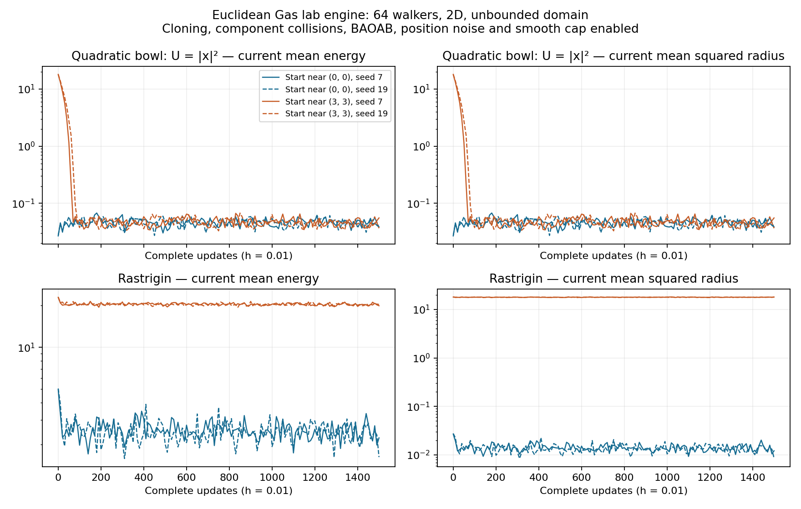

# Fractal Gas landscape analysis and structural complexity: research programme

**Recorded:** 27 September 2026.
**Purpose:** preserve the convergence, landscape tomography, analytical field-theory,
and structural-complexity proposals developed in the discussion, with explicit
proof obligations.
**Status:** research roadmap outside the published book TOC. This document does
not upgrade conjectures to theorems or modify the implemented algorithm.

**Reading map:** Sections 1–3 specify the objects and convergence programme;
Sections 4–5 develop statistical and fully analytical tomography; Section 6
connects the programme to presentation-relative computational bounds; Section 7
records implementation, publication placement, experiments and references.

(sec-landscape-program-contract)=
## 1. Object, probe and scope of the programme

:::{div} feynman-prose
Imagine a landscape with several valleys. A gas placed in one valley may remain there for a long time; a gas placed elsewhere may settle into another. That observation raises several different questions. Does either population escape to infinity? How quickly does it relax inside its valley? Can a walker discover another valley, and can cloning amplify that discovery? Must the populations eventually have the same law? Each question needs its own argument. Confinement does not mean convergence to one minimum, and slow communication does not by itself mean several stationary laws.

The function defining the landscape exists independently of this experiment. The fixed Fractal Gas is our probe. Its parameters determine how it responds to the function, while the purpose of the analysis is to recover mathematical information about the object being probed. Changing the strength of the probe does not change the mountains.

There are three levels to keep distinct. A finite simulation gives observations. An infinite-population limit, when justified, gives an analytical evolution of probability laws. A suitably rescaled fluctuation limit may supply fields and correlations from which a QFT description can be constructed. The analytical theory need not wait for walkers to visit every region in a computer experiment: it can be defined on the whole space, provided its existence, support and tails are controlled.

The ambition is to connect that theory's spectral scales, correlations and interactions to confinement, bottlenecks and functional inequalities. The further ambition is to connect those descriptors to structural complexity: what can any method discover under a specified information interface and resource budget? That last step requires a theorem relating gas descriptors to the entire admissible computational class. It cannot follow from the gas's own relaxation rate alone. This roadmap records the proposed connections and the proof obligations needed to make them useful.
:::

### 1.1. The intended analytical construction

**Research objective.** Given a function or reward landscape and a fixed,
fully specified Fractal Gas, construct analytical descriptors that can be used
to prove properties of the landscape, its associated probability laws, and the
complexity of tasks defined on it:

$$
(f,\theta,\mathcal T)
\longmapsto \text{population dynamics and fluctuation theory}
\longmapsto \mathfrak C_\theta[f]
\longmapsto \text{functional and computational bounds}.
$$

Here $f$ is the function being studied, $\theta$ contains algorithm parameters,
and $\mathcal T$ specifies an information interface and a task when computational
claims are made. The function exists independently of the simulation. The gas
is a probe; simulation approximates the response of that probe. The analytical
response can be defined and investigated without empirical sampling.

The expression **“standard model constants of a function”** records the proposed
family $\mathfrak C_\theta[f]$: spectral scales, correlation functions, interaction
coefficients, response coefficients and scaling data, once their mathematical
construction is proved. It does not presently assert a unique finite fingerprint,
a correspondence with physical Standard Model constants, or an established QFT
limit. A complete spectrum alone need not identify a function uniquely.

**Required distinction.** Properties of $f$, properties of an associated law,
properties of the probe dynamics, and numerical estimates of those properties
must be recorded separately. Algorithm parameters may change the probe response
without changing $f$. Theorems must specify how response quantities imply facts
about the independently defined object.

### 1.2. Notation and normalization contract

| Symbol | Object and required specification |
|---|---|
| $U(x)$ | Energy/error to minimize; specify domain and regularity |
| $R(x)$ | Positive reward used by selection; specify the transformation from $U$ |
| $\theta$ | Fitness/diversity parameters, companion laws, cloning, jitter, collisions, friction, noises, velocity cap, boundary rules and timestep |
| $S_n^N$ | Complete $N$-walker state, including velocities, alive/dead marks and any required history |
| $P_{N,h}$ | Full conservative one-step kernel, when the configuration is conservative |
| $Q_{N,h}$ | Full killed kernel, when extinction/termination is part of the configuration |
| $\pi_N$ | Invariant law satisfying $\pi_NP_{N,h}=\pi_N$ |
| $\nu_N,\alpha_N$ | QSD and survival eigenvalue: $\nu_NQ_{N,h}=\alpha_N\nu_N$ |
| $L_N$ | Empirical measure of complete walker states |
| $\mathcal F_h$ | Actual fixed-step nonlinear population map: $\mu_{n+1}=\mathcal F_h(\mu_n)$ |
| $\mu_*,\rho_*$ | Stationary complete population law and an explicitly identified position/alive marginal |
| $\Lambda_N$ | Law of the empirical measure under a stationary or quasi-stationary swarm law |
| $\mathcal E$ | Declared energy/Dirichlet form, with carrier, domain and normalization |
| $\mathfrak C_\theta[f]$ | Proposed analytical descriptor family of the function under the probe |

Use $n$ for complete updates and $t=nh$ only with an explicit physical-time
conversion. Decay rates per update and per physical time differ. Standard gradient
Poincaré/LSI constants have units of length squared when observables are
dimensionless. Rates based on a generator include its time normalization.
Structural budgets may be ordered resource vectors rather than scalar times.

**Algorithm contract.** Keep the algorithm fixed. Account for the entire update,
including sampled fitness, accepted donor edges, connected-component collisions,
shared randomness, kinetic splitting, position diffusion, cap and boundary
classification. A local replicator equation or a Langevin diffusion can be a
reference model, but requires a separate approximation theorem before its
properties are transferred to the actual gas. Dead coordinates cannot be
replaced by a scalar reservoir if they affect revival or collisions.

### 1.3. Evidence and logical status

Use these statuses throughout subsequent work:

- **Existing result:** a theorem stated in the current manuscript/book, with its
  hypotheses retained; not a claim of a new complete proof audit here.
- **Direct calculation:** an identity or implication justified in this document.
- **Conditional target:** a proposed conclusion with additional hypotheses that
  remain to be established for the actual gas.
- **Research construction:** an object or connecting theorem still to develop.
- **Empirical observation:** a finite-run result with no automatic asymptotic claim.

The current book states fixed-$N$ conditioned geometric total-variation convergence
for the canonical quadratic-force terminal-box gas with positive OU and final
position noise, smooth cap and $h\ne2$. Its constants depend on $N$.
Chapters 8–9 develop the actual fixed-step population map and finite-horizon chaos
under their stated hypotheses. Chapter 9 explicitly retains global attraction as
an unresolved hypothesis in its stationary-chaos theorem. These do not together
prove general unbounded-landscape mixing or an exchange of $N\to\infty$ and
$n\to\infty$. See [Chapter 8](../source/2_fractal_gas/convergence_program/08_mean_field.md)
and [Chapter 9](../source/2_fractal_gas/convergence_program/09_propagation_chaos.md).

(sec-landscape-program-convergence)=
## 2. Landscape-dependent confinement and long-time population behaviour

:::{div} feynman-prose
Picture two clocks running on the same landscape. One measures how quickly walkers settle inside a valley; the other measures how long the population takes to communicate with another valley. They can disagree by many orders of magnitude. Before asking for a convergence rate, we must specify which clock and which distribution we mean. This section separates those questions and identifies what must keep the entire population from drifting away while local relaxation and rare discoveries take place.
:::

### 2.1. Separate the convergence questions

**Required outputs.** A convergence statement should identify which of the
following it proves, for which law and topology:

1. Finite-horizon approximation of the particle population by $\mathcal F_h$.
2. Uniform-in-time confinement, including control of the population centre.
3. Relaxation within a basin or a conditioned region.
4. Communication and redistribution between basins.
5. Fixed-$N$ invariant/QSD existence, uniqueness and convergence.
6. Stationary population existence, attraction, concentration or phase mixtures.
7. Uniform-in-$N$ estimates permitting an interchange of limits.

A single minimum does not alone guarantee rapid global convergence: flat regions,
weak tails and algorithmic instabilities can still obstruct it. Strong convexity
is a useful sufficient hypothesis, not a synonym for a unique minimum.
Multiple minima do not alone imply multiple invariant laws. A noisy irreducible
finite system may have one invariant law and extremely long metastable residence.
A nonlinear population limit may have several stationary phases, or other
invariant dynamics, which require separate analysis.

At positive noise, convergence concerns distributions rather than exact arrival
and permanent residence at a minimizer. An equilibrium law permits uphill moves.
A best-so-far archive may improve monotonically while current swarm error does
not. “Consistent behaviour” should mean a specified law, phase-conditioned law,
metastable transition model or controlled invariant family.

### 2.2. Quantitative self-confinement

**Conditional target C1: full-update drift.** Construct a coercive observable
$W_N$ controlling absolute position, velocity and required marks such that

$$
P_{N,h}W_N\le rW_N+b,\qquad 0<r<1.
$$

Then, by iterating the inequality,

$$
\mathbb E W_N(S_n^N)
\le r^n\mathbb EW_N(S_0^N)+\frac{b}{1-r}.
$$

For population tightness, require $W_N\ge N^{-1}\sum_i\psi(x_i)$ with $\psi$
coercive and constants uniform in $N$. Control of pairwise distances alone does
not control translation of the whole swarm. If all other state coordinates are
compact or also controlled, this gives the corresponding state tightness.
Conditioned killed dynamics require their own survival/normalization estimates;
an unconditioned drift inequality must not be silently reused after conditioning.

**Landscape hypotheses to investigate:** coercive energy envelopes, radial drift,
bounded nonconvex perturbations, controlled gradient/Hessian growth and local
nondegeneracy, with inequalities verified through every stage of the gas.

**Interpretation.** Confinement is uniform probabilistic control, not a promise
that every infinite sample path remains in a fixed ball. Even a stationary
Gaussian process can make arbitrarily large excursions over infinite time.
A landscape decreasing towards infinity can favour outward motion. A purely
periodic potential on all of $\mathbb R^d$ does not define a normalizable ordinary
Gibbs position density. These examples motivate tail hypotheses; they do not
replace analysis of the actual interacting update, which may itself have other
collective effects.

**Direct entropy-to-tightness calculation.** If $\pi$ is a fixed probability,
$H(\rho\mid\pi)\le M$, $p=\pi(A)\in(0,1)$ and $q=\rho(A)$, data processing to
$\{A,A^c\}$ gives

$$
M\ge q\log(1/p)-\log2,
\qquad
q\le\frac{M+\log2}{\log(1/p)}.
$$

Apply this to complements of compact sets to obtain uniform tightness of a
bounded-entropy family. This gives neither a specified moment bound nor a
Poincaré/LSI constant. In particular, $H(\pi\mid\pi)=0$ even for heavy-tailed
$\pi$ with no standard Poincaré inequality.

### 2.3. Several basins and stationary mixtures

**Direct entropy decomposition.** For a measurable partition $(B_j)$, let
$w_j=\rho(B_j)$, $p_j=\pi(B_j)$ and $\rho_j,\pi_j$ be normalized restrictions.
Under absolute continuity and well-defined entropies,

$$
H(\rho\mid\pi)
=H(w\mid p)+\sum_jw_jH(\rho_j\mid\pi_j).
$$

This separates redistribution between basins from local relaxation. Zero-mass
terms use the usual limiting convention; countable partitions require appropriate
integrability. Finite partitions with an exterior cell are a practical starting
point.

**Conditional target C2: phase-resolved long-time limit.** Prove tightness and
identify invariant laws on the space of population measures. If the limiting
stationary empirical law is supported on stationary phases $\mu_a$, then

$$
\nu_N^{(\ell)}\Rightarrow
\int\mu_a^{\otimes\ell}\,\Xi(da).
$$

This is conditional independence within a phase, not unconditional chaos toward
one deterministic law. First prove support on fixed points: invariance under
$\mathcal F_h$ alone also permits cycles or other invariant sets. Determine when
initialization selects a phase, when finite-$N$ randomness causes switching, and
how transition times scale with $N$ and the landscape.

For a single attracting phase, the existing stationary-chaos strategy becomes
available after its other hypotheses hold. For multiple phases, preserve the
mixture rather than forcing a false uniqueness assertion. A deterministic
initial population limit does not retain arbitrary finite-$N$ random phase
selection without a justified long-time/fluctuation regime.

**Limits and metrics.** Specify the order of $N\to\infty$, $n\to\infty$,
$h\to0$, domain exhaustion and any zero-noise limit. Do not infer uniform-time
chaos from finite-horizon chaos. Weak convergence of empirical measures is not
TV convergence: an atomic empirical measure and a diffuse law are mutually
singular. TV may instead apply to particle marginals, full finite-state laws or
smoothed densities, after the appropriate theorem.

### 2.4. Scout discovery, establishment and cloning amplification

**Mechanism to model.** One successful walker can seed a new region and cloning
can redistribute population towards it. Separate:

1. discovering the region;
2. surviving there long enough to become a donor;
3. gaining a selection advantage under reward and diversity;
4. transferring descendants without losing them to jitter or kinetics.

For a frozen pre-cloning state, let $b_{ij}$ be the probability that walker $i$
is actually replaced by donor $j$, with at most one replacement per recipient.
For a region $A$, before displacement/jitter,

$$
\mathbb E[\Delta N_A\mid S]
=\sum_{i\notin A,j\in A}b_{ij}
-\sum_{i\in A,j\notin A}b_{ij}.
$$

This follows by summing changes of the membership indicators. The actual update
adds migration, jitter and survival contributions. Establishment requires a
positive net mechanism; discovery does not automatically imply takeover.
Diversity pressure can favour a rare region, but its effect must be calculated
from the actual fitness normalization and companion law.

**Conditional target C3.** Bound discovery, establishment and spread separately,
then derive a combined transition-time law or bounds. Compare with a matched
kinetic-only process under the same total computational budget. Classical
Eyring–Kramers estimates can guide the analysis but cannot be assigned unchanged
to shared collisions and population-dependent cloning.

(sec-landscape-program-functional)=
## 3. Reward-density laws and structural certificates for functional inequalities

:::{div} feynman-prose
A functional inequality puts a price on an uneven distribution: how much variation or entropy can remain for a given amount of energy? To use that question here, we first need the law produced by the full gas and the energy form against which variation is measured. We can then investigate whether local relaxation, communication between regions and confinement together pay that price. This section records the proposed certificates and keeps their constants attached to the landscape and parameter choices that determine them.
:::

### 3.1. Identify the law defined by the full algorithm

**Research hypothesis.** The gas adapts population density to reward through its
full selection/diversity/kinetic dynamics. Derive that law from the algorithm
rather than imposing an unrelated Langevin target.

Required identities are $\mathcal F_h(\mu_*)=\mu_*$ for a population fixed point,
$\pi_NP_{N,h}=\pi_N$ for a conservative finite swarm, or
$\nu_NQ_{N,h}=\alpha_N\nu_N$ for a QSD. Position marginals do not determine the
complete phase-space law. A representation $\rho_*=Z^{-1}e^{-V_{\mathrm{eff}}}$
is possible for positive densities, but only a derived expression for
$V_{\mathrm{eff}}$ and its relation to reward gives predictive content.
Detailed balance is sufficient for invariance, not necessary.

**Direct calculation for the local reference model.** For the stated model

$$
\partial_t\rho=(V[\rho]-\bar V[\rho])\rho,
\quad V[\rho]=a\rho^{-p}R^\alpha,
\quad a>0,\quad p>0,
\quad g=Z^{-1}R^{\alpha/p},
$$

assume $Z<\infty$, positive normalized densities and enough integrability and
regularity to differentiate. With $c=aZ^p$,

$$
\frac d{dt}H(g\mid\rho)
=c\int(\rho-g)\big[(g/\rho)^p-1\big]dx\le0.
$$

Indeed differentiation gives $\int(\rho-g)V[\rho]$, and subtracting the constant
$c$ changes nothing since both densities integrate to one. The integrand is
nonpositive, with equality only at equal positive densities. This is a
reverse-KL dissipation calculation for the reference equation. Quantitative
convergence needs coercivity or a compactness argument. Transfer to the actual
nonlocal fixed-step gas requires a separate error/control theorem.

### 3.2. Parametric constants and examples

Fix the standard gradient convention

$$
\operatorname{Var}_\pi(g)\le C_P\int|\nabla g|^2d\pi,
\qquad
\operatorname{Ent}_\pi(g^2)\le2C_{\mathrm{LSI}}\int|\nabla g|^2d\pi.
$$

For a specified reference $\pi_T\propto e^{-U/T}$ with $T>0$:

| Landscape/reference | Available conclusion in this convention |
|---|---|
| $U=\kappa|x|^2/2$ | Optimal $C_P=C_{\mathrm{LSI}}=T/\kappa$ |
| $\nabla^2U\succeq\kappa I$ | $C_P,C_{\mathrm{LSI}}\le T/\kappa$ |
| $U=U_0+B$, $\nabla^2U_0\succeq\kappa I$, bounded $B$ | Both constants at most $(T/\kappa)e^{\operatorname{osc}(B)/T}$ |
| Standard separable Rastrigin, $U=\sum_j[x_j^2+10(1-\cos(2\pi x_j))]$ | Coordinate comparison and product tensorization give both constants at most $(T/2)e^{20/T}$ |

These are reference-law estimates, not an identification of the gas's invariant
law or kinetic convergence rate. Chapter 15 contains the corresponding curvature,
bounded-perturbation and tensorization tools. Interactions or nonproduct metrics
can remove the dimension-free tensorized bound.

For Rastrigin, independently,

$$
0\le U-|x|^2\le20d,
\qquad x\cdot\nabla U\ge |x|^2-100\pi^2d.
$$

The second inequality follows by bounding the sinusoidal derivative and applying
$20\pi|x_j|\le x_j^2+100\pi^2$. These are useful ingredients for confinement,
but full-update drift remains to prove.

**Tail counterexamples.** For one-dimensional densities proportional to
$e^{-|x|^q}$, with $q>0$ and the standard gradient form, the usual thresholds are:
$0<q<1$ has no Poincaré inequality; $1\le q<2$ has Poincaré but no LSI;
$q\ge2$ has both. Cauchy-type polynomial tails fail standard Poincaré. Behaviour
near the origin can be smoothly regularized without changing these tail regimes.
These examples separate normalizability, confinement, PI and LSI; weighted or
weak inequalities are different assertions.

**Existing explicit Lyapunov route in Chapter 15.** For the normalized reference
$\pi\propto e^{-V}$, suppose $V\in C^2$, $\nabla^2V\succeq-KI$ and a smooth
positive $W$ satisfies, for $\mathscr L=\Delta-\nabla V\cdot\nabla$,

$$
\frac{\mathscr LW}{W}\le-c|x|^2+b,\qquad c,b>0.
$$

Choose $R$ so $\ell=cR^2-b>0$, and a local Poincaré constant $C_{\rm loc}$
for the conditional law on $B_R$. The chapter constructs

$$
C_P=\left(1+\frac b\ell\right)C_{\rm loc}+\frac1\ell,
\qquad A_0=\frac1{2c},\qquad B_0=\frac{4b}{c},
$$

and, for $\varepsilon>0$,

$$
A_1=\sqrt{A_0}+\varepsilon+\frac K2A_0,
\qquad B_1=\frac{B_0}{4\varepsilon}+\frac K2B_0,
\qquad
C_{\rm LSI}\le\frac{4A_1+(B_1+2)C_P}{2}.
$$

This records an explicit target for landscape-dependent constants, with the
chapter's normalized coordinates and generator. One must still derive $V$, $W$
and the constants for the relevant law, and restore physical units when changing
normalization. Kinetic friction, mobility and cloning parameters enter through
law identification and dynamical comparison, not by silently inserting them into
this static formula.

### 3.3. “No narrow corridors” as an analytical certificate

**Conditional target C4.** Find structural descriptors giving quantitative
control of local relaxation, communication between regions and tails, then prove

$$
\operatorname{Ent}_{\mu_{f,\theta}}(g^2)
\le2\Phi(\text{local constants, communication, tails},\theta)
\,\mathcal E_{f,\theta}(g,g).
$$

The displayed bound is a theorem template, not an established formula for
$\Phi$. State whether it is gradient LSI, a jump-form LSI, modified LSI or a
hypocoercive entropy bound. A comparison theorem is needed to move between forms.

**Structural conditions to develop:** controlled within-region PI/LSI, capacity
or conductance bounds with the necessary mass dependence, and a Lyapunov/tail
condition strong enough for the desired inequality. An ordinary spectral gap
or a single Cheeger bound does not automatically give LSI. Narrowness is measured
relative to the law and allowed transitions: low density or low mobility can
create a bottleneck without a narrow geometric passage. Finite narrow corridors
may yield poor but finite constants. Absence of visible corridors does not
exclude a tail obstruction.

**Analytical-to-algorithmic transfer.** If a law and form are identified, derive
entropy production for the complete gas. Static LSI does not alone prove decay
for kinetic, nonreversible, killed or nonlinear dynamics. Account for normalization,
cloning and splitting errors. A target discrete estimate is

$$
H(\mu_{n+1}\mid\mu_*)\le qH(\mu_n\mid\mu_*)+\varepsilon_h,
\qquad q<1.
$$

An exact target with $\varepsilon_h=0$ gives geometric entropy decay. Otherwise
iteration only yields a residual floor $\varepsilon_h/(1-q)$ in addition to the
transient. Under absolute continuity, Pinsker converts entropy to TV with the
usual convention $\|\mu-\pi\|_{\mathrm{TV}}\le\sqrt{H(\mu\mid\pi)/2}$.

(sec-landscape-program-statistical)=
## 4. Probabilistic global tomography and harmonic analysis

:::{div} feynman-prose
Suppose a run has found three valleys. The interesting question is how much a fourth, still unseen valley could change the answer. A useful statistical description must retain that possibility and constrain it using explicit assumptions about discovery, size and residence time. This section develops that accounting alongside a series description of the observed dynamics. The coefficients tell us what the current resolution captures; error bounds must explain what omitted regions and modes could still contribute.
:::

### 4.1. Detection statements with explicit coverage assumptions

**Direct conditional-hazard bound.** Let $T_A$ be first discovery of $A$. If,
conditional on every history with no discovery yet, the probability of discovery
in the next block is at least $p$, then

$$
\Pr(T_A>k\text{ blocks})\le(1-p)^k\le e^{-pk}.
$$

Proof: apply the conditional failure bound iteratively. Independence of blocks
or walkers is not required. If the hazard bound only holds on a confinement event,
include the probability of its failure. For nonconstant lower bounds, retain the
appropriate product or cumulative-hazard estimate.

A conditional Gaussian landing step $Y=m+sZ$, $Z\sim N(0,I_d)$, has the bound

$$
\Pr\{Y\in B(y,r)\}
\ge |B(0,r)|(2\pi s^2)^{-d/2}
\exp\!\left[-\frac{(D+r)^2}{2s^2}\right]
$$

when $|m-y|\le D$. Use it only at an actual independent Gaussian stage and
account for later rejection, killing or displacement. The distance condition
must hold for the conditional means under consideration.

**Proposed global statement.** If a better basin existed within a specified
region, with at least a specified size and reward advantage and satisfying the
regularity/detection assumptions, it would be discovered by the stated budget
with probability at least $1-\delta$. Failure to discover it can reject that
class of alternatives at level $\delta$. This is not, without a prior, a posterior
probability that no better basin exists. Uniform guarantees over many candidate
basins or adaptive stopping need simultaneous/anytime error control.

Uniform iid initialization on a ball supplies known initial sampling probabilities:
for $A\subset B$, no initial hit has probability $(1-|A|/|B|)^N$. Subsequent
cloning destroys iid sampling. Uniform initialization is useful but is not a
prerequisite for stochastic calculus. For the actual fixed-step algorithm, start
with conditional expectation and martingale identities; introduce an SDE only
under a proved continuous-time limit.

### 4.2. Basins, bottlenecks and tails as jointly uncertain quantities

**Research construction S1.** Build a confidence set $\mathcal C(D)$ of full
operators/laws compatible with observed trajectories, analytic landscape
constraints, genealogical dependence and approximation errors, such that

$$
\Pr\{K_{\mathrm{true}}\in\mathcal C(D)\}\ge1-\delta.
$$

For any well-defined global quantity $J$, report

$$
\inf_{K\in\mathcal C(D)}J(K)
\le J(K_{\mathrm{true}})\le
\sup_{K\in\mathcal C(D)}J(K)
$$

on that event. This is a construction target; producing a useful confidence set
is part of the research. It must represent unobserved states, unresolved modes
and tails, not only the empirical transition matrix.

For a bottleneck, measure or bound occupancy, entrances, successful crossings,
returns and residence times. A small region can have tiny mass and extremely
long residence, controlling the slowest global mode. A low discovery probability
by itself does not bound that contribution. If unresolved alternatives allow an
arbitrarily deep trap, the certified lower spectral-gap bound may remain zero.
Structural envelopes are what can make such bounds informative.

### 4.3. Spectral reconstruction and spatial harmonic analysis

**Research construction S2.** Use basis functions or basin indicators to estimate
matrix elements of the actual transition operator, with separate error terms for
sampling, finite $N$, basis truncation, state closure and domain truncation.

For a reversible operator with energy $\mathcal E$, a restricted Rayleigh search

$$
\widehat\lambda_m
=\inf_{g\in V_m,\ \operatorname{Var}_\pi(g)>0}
\frac{\mathcal E(g,g)}{\operatorname{Var}_\pi(g)}
$$

is an upper bound on the true gap when the matrix elements are exact. An omitted
slow mode can make apparent mixing too fast. A lower bound needs a complement,
residual, coercivity or other certified error argument. Nonreversible analysis
may require singular values, resolvent or pseudospectral bounds and hypocoercivity;
eigenvalues alone need not bound transient behaviour. LSI is not determined by
spectral values alone.

**Spatial series versus dynamical modes.** On a bounded smooth connected region,
Neumann Laplacian eigenfunctions give, for $g\in H^1$ and coefficients $c_k$,

$$
\sum_{\lambda_k>\Lambda}|c_k|^2
\le\Lambda^{-1}\int|\nabla g|^2dx.
$$

This follows from the quadratic-form expansion. It relates spatial regularity to
resolution in a specified basis; it is not automatically a bound on gas relaxation.
Transfer-operator eigenfunctions describe dynamical persistence and generally
differ from spatial Fourier modes. A weighted basis must use its matching measure
and energy. Global analysis on an unbounded space also needs an exhaustion/tail
argument or a direct global operator construction.

**Intended output.** A hierarchy of basin, transport and fluctuation modes with
confidence intervals and explicit unresolved contributions. Active exploration
can target the uncertainty that dominates a desired prediction. Any claim of
improved efficiency must compare matched computational resources and accuracy.

(sec-landscape-program-qft)=
## 5. Fully analytical gas/QFT descriptors of functions

:::{div} feynman-prose
Now consider defining the response of the probe directly, without running it. The infinite-population evolution would assign analytical objects to the function, and an appropriately rescaled fluctuation theory could describe how collective disturbances interact. We would then ask which properties of the original landscape those objects reveal. This section preserves that stronger ambition: spectra, correlations and interaction coefficients are candidates for a mathematical language of functions. Their construction and their interpretation each require a proof.
:::

### 5.1. Infinite population is an analytical limit

**Research construction A1.** Define the full-domain map $\mathcal F_{h,f,\theta}$
and its admissible population laws. Prove well-posedness, moments, continuity
and whatever support/irreducibility properties are needed. “Infinite walkers
cover the whole space” is interpreted through full-support measures and global
operators, not through pointwise empirical visitation. An infinite iid sample
from a compactly supported initialization still has that initial support.

A continuous-time equation

$$
\partial_t\mu=\mathcal F_{f,\theta}[\mu]
$$

is available only after its scaling and generator limit are proved. At fixed
$h$, linearize the actual map at a stationary phase:

$$
\delta\mu_{n+1}=D\mathcal F_h(\mu_*)\,\delta\mu_n
+\text{higher-order terms}.
$$

Specify tangent spaces, topology and differentiability. Linear stability is local;
it does not itself establish global attraction. Nontrivial multipliers inside the
unit circle give candidate relaxation rates $-h^{-1}\log|\zeta|$ when spectral
analysis and the time convention justify this interpretation.

### 5.2. Fluctuation fields, correlations and interactions

**Research construction A2.** Establish a fluctuation limit for

$$
\eta_n^N=\sqrt N\,(L_N-\mu_n)
$$

in an appropriate distribution space, or determine the correct alternative
scaling near criticality. Identify the covariance and noise contributed by
cloning ancestry and shared collision components. The deterministic population
limit can discard fluctuations that survive under this rescaling.

A field-theory construction must then specify its fields, observables, action or
path law, regularization, normalization and limits. Derivatives of the population
evolution are candidate nonlinear interaction coefficients; identifying them with
vertices in an action requires a derivation. A large-deviation action may provide
another route, but is not interchangeable with a central-limit theory.

**Proposed descriptor family.**

$$
\mathfrak C_\theta[f]=
\{\text{phase data},\text{relaxation scales},\text{mode functions},
\text{connected correlations},\text{interaction coefficients},
\text{responses},\text{scaling data}\}.
$$

“Mass” requires a specified decay law or propagator and normalization. A temporal
relaxation rate and an inverse spatial correlation length need not coincide.
Track dependence on phase, domain, $h$, noise, population scaling, basis and
regularization. Connected higher-order observables can carry information absent
from one-walker marginals.

### 5.3. Analytical dictionary and intended capabilities

**Conditional target A3.** Derive implications from selected descriptor bounds to
confinement, bottleneck estimates, PI/LSI, transport, mixing or regularity for an
explicitly identified function-associated law and form. It is permissible for the
law to be the one derived from the gas's reward-density relation. Simulation does
not define or alter that law's analytical properties.

An external Gibbs reference is optional, useful for comparison, and not a required
replacement for the algorithm-defined law. If a descriptor concerns the probe
but the conclusion concerns another law or the original function's geometry,
provide the comparison theorem and its constants.

Potential capabilities, conditional on these constructions:

- Perturbation theory for $f+\varepsilon g$ and parameter response.
- Multiscale decompositions with controlled truncation error.
- Classification of functions by dynamical phases and scaling behaviour.
- Reduced models reproducing declared observables and horizons.
- Analytical certificates for functional inequalities and complexity profiles.
- Numerical estimation of the same descriptors when closed expressions are unavailable.

A finite collection of constants is not presumed complete. State invariances
under coordinate changes, reward rescaling or equivalent task presentations and
separate probe-dependent response from intrinsic landscape properties.

(sec-landscape-program-structural)=
## 6. Structural decomposition and universal computational bounds

:::{div} feynman-prose
Knowing how our gas crosses a landscape is one achievement. Bounding what every affordable method can discover asks for a comparison across an entire class of computations. The supplied structural-complexity manuscript provides the task interfaces and resource accounting for that comparison. The work here is to connect the two theories: show that gas-derived analytical quantities constrain the structural access available to every represented strategy. Only then can a property extracted through this probe become a universal bound within the declared class.
:::

### 6.1. The supplied structural-complexity manuscript

**Source record.** Guillem Duran Ballester, *Presentation-Relative Structural
Complexity*, supplied as `task_space_structural_complexity (9).tex`; attachment
filename `1-task_space_structural_complexity-9-.tex`. SHA-256:
`30643ce1c1de6461813b358ca1d0319f753ad973f868fe6ea3fcc342e00f335f`.
The discussion reviewed selected definitions and accountability proofs, not all
64,189 source lines. The labels below identify the version-independent logical
locations; the line numbers identify this attachment. The attachment itself is
not copied into this roadmap.

| Manuscript component | Label / source line | Role in the joint programme |
|---|---|---|
| Task-space signature | `def-task-space-signature`, 710 onward | Fixes states, observations, relations and terminal interface independently of the solver |
| Budget-compatible envelope | `def-resource-envelope`, 4538 | Charges initialization, memory, queries, learned records and total parallel work |
| Complete transcript representation | `prop-full-configuration-lift-complete`, 4812 | Represents adaptive computations with their required inputs and costs |
| Channel exhaustiveness | `the-exhaustiveness-theorem`, 5173 | Geometric, directed, quotient, lifted, boundary and residual accounting |
| Prospective selector accountability | `thm-prospective-selector-accountability`, 17502 | Bounds gains from information available before target contact |
| Saturated success profile | `def-uniform-saturated-success-profile`, 18772 | Takes the supremum over the declared computational class |
| Universal accounting bound | `thm-universal-saturated-profile-accountability`, 18879 | Converts saturated visibility bounds to success bounds |
| Functional output selection | `thm-controlled-functional-profile-selection`, near 34778 | Requires matching carrier, units and output quantity; avoids double counting |

The manuscript's decomposition and resource filtration already supply the
information-access/resource layer required for a universal claim. The research
question is how the analytical gas descriptors evaluate or bound that layer.
This is not a proposal to replace it with a new unspecified oracle model.

**Structural decomposition to retain.** In its declared finite/lifted setting,
the manuscript's component-exhaustiveness theorem gives

$$
L=L^{\rm Geom}+L^{\rm Caus}+L^{\rm Abs}
  +L^{\rm Lift}+L^{\rm Bdry}+L^{\rm Res}.
$$

These are projections in the specified direct-sum operator Hilbert space. The
associated squared-norm accounting is in that Hilbert norm, not the induced
operator norm; it does not assert that every projected component is separately a
positive Markov generator. A component is an affordable structural source only
when its subspace, projection and output have the required charged representation.

| Channel | Candidate relationship to the gas; identification remains to prove |
|---|---|
| Geom | Spatial accessibility, reversible transport and capacity structure |
| Caus | Declared directed reward/fitness bias and its accountable advantage |
| Abs | Represented partitions, basin summaries and exact quotient information |
| Lift | Population state, genealogy, velocities, memory and collective variables |
| Bdry | Target/termination readouts, killing, survival and boundary conditions |
| Res | Contributions not certified by the other represented structural sources |

A gas operation can contribute to several channels. Cloning is not automatically
an exact quotient, nor does a learned basin partition automatically satisfy
lumpability. The manuscript also uses a five-family provenance decomposition of
quotient information; that is distinct from these six operator components.
Likewise, spatial Fourier modes, gas fluctuation modes and task-source channels
are different decompositions. Their relationship is a proof target rather than
an identification by terminology.

### 6.2. Exact destination for the connecting theorem

The supplied manuscript defines

$$
\operatorname{Succ}_{\mathfrak M,n}(B)
=\sup_{\mathcal A\in\mathsf{Alg}_{n,\le B}}
\mathfrak M_n\bigl(I\mapsto\alpha_I(\mathcal A)\bigr)
$$

and states, under its declared framework and finite time capacity,

$$
\operatorname{Succ}_{\mathfrak M,n}(B)
\le eH_B(n)\,
 m_{\mathfrak M,n}^{\mathrm{sat}}\bigl(\Psi(B,n)\bigr).
$$

Here $n$ denotes instance size, not a gas iteration; $H_B$ and $\Psi$ are the
horizon and enlarged resource ceiling derived from its ledger. The profile
$m^{\mathrm{sat}}$ is an accounting profile. This result does not by itself give
a small numerical bound: its right side must be evaluated or bounded.

**Conditional target U1: structural domination by gas descriptors.** For the
specified instance family and resource class, prove a bound of the form

$$
m_{\mathfrak M,n}^{\mathrm{sat}}\bigl(\Psi(B,n)\bigr)
\le\Phi_{\mathfrak M,n,B}
\bigl(\{\mathfrak C_\theta[f_I]\}_{I\in\mathfrak I_n}\bigr).
$$

Composition gives a bound on all admissible represented computations. The family
functional, uniformity and parameter selection must be retained; a measurement
of one chosen gas is not automatically a bound on that supremum.

The prospective route in the manuscript gives

$$
\Pr\{\tau\le H\}
=\operatorname{Enum}_\nu(\mathcal A,H)
+\sum_{t=0}^{H-1}\operatorname{Adv}_t(K_t;\nu_t).
$$

If every affordable, temporally admissible selector has advantage at most
$\delta_n$, it follows that

$$
\Pr\{\tau\le H\}
\le\operatorname{Enum}_\nu(\mathcal A,H)+H\delta_n.
$$

**Conditional target U2.** Bound that entire selector class using the structural
and field-theoretic descriptors, together with a bound on enumeration when a
uniform success ceiling is desired. A target label constructed after discovery
cannot explain the transitions before discovery. The manuscript explicitly
separates this prospective argument from retrospective first-hit accounting;
preserve the distinction in every proposed proof.

### 6.3. What must be proved across the two theories

1. **Object alignment:** encode the landscape task, reward relation and target
   criteria in the declared task presentation.
2. **Operational alignment:** represent the gas's information access and full
   update in the charged grammar, including population size, genealogy,
   normalization, collisions and parallel work.
3. **Channel alignment:** identify which gas/QFT observables constrain geometric,
   directed, quotient, lifted and boundary channels; include any residual term.
4. **Uniformity:** establish the bound over all affordable represented strategies,
   not just variations of the gas or a chosen basis of observables.
5. **Prospective provenance:** ensure any claimed exploitable structure is available
   before the operation whose advantage it is used to bound.
6. **Output conversion:** translate spectral, entropy or capacity certificates
   into the common success/arrival quantity with the correct direction and units.
7. **Limit compatibility:** derive finite-resource consequences of analytical
   infinite-population limits without treating infinitely many walkers as free work.

A stationary density alone does not determine every algorithm's speed. Replacing
$L$ by $aL$ preserves its invariant measure and rescales time; the charged resource
framework fixes the meaningful comparison. LSI commonly supplies a sufficient
entropy-decay rate for a compatible process. An impossibility bound across
algorithms needs U1/U2 or another established comparison theorem.

**Optimality is an additional target.** A universal ceiling and a matching
achievable gas bound would establish optimality in the stated class, up to their
comparison factors. Universal Bayesianization in the structural manuscript does
not by itself identify this particular Fractal Gas with the optimal construction.

**Scope of the ambition.** The joint programme aims to derive limits on computation
from analytical structure of the presented function. The function remains fixed;
its presentation determines what information algorithms may obtain and at what
cost. Claims are universal within that declared class, not invariant under adding
an unrestricted solver oracle or free nonlocal knowledge.

(sec-landscape-program-workplan)=
## 7. Proof queue, book placement, experiments and references

**Implementation update, 28 September 2026:** The proof extension is in
[Structural landscape estimates and quantitative convergence](../source/2_fractal_gas/convergence_program/06a_structural_landscape_convergence.md).
The primary organizing data are reward geometry: declared basin regions, tails,
narrow passages and population mixture regions, together with regional reward
bands, reward moments, companion distances, donor coverage and regional force profiles,
interface defects, donor availability and full-update transition probabilities.
The quantitative finite-horizon mean-field and finite-$k$ estimates compare each
swarm with the evolution from its own initial law. Named landscapes provide
checks of the formulas; they do not define the scope of the structural programme.

The full-update confinement estimates now retain the exact selection flux,
adverse copying, jitter and kinetic motion, with explicit defects for failure of
the donor/fitness conditions. They do not require a radial restoring force.
The extension to a general coercive tail observable $\psi$ uses a displayed
Gaussian increment envelope and its regional remainder, so a quadratic moment
is not the definition of confinement. Regional force moduli $\Omega_R$ charge
interface defects and intermediate Gaussian excursions. Passage and mixture
bounds retain width, volume, displacement, population-count and residence
profiles. Each resulting certificate is conditional on the displayed structural
inequalities and on control of the accumulated defects; recovery from
populations with inadequate donor coverage remains an obligation where that
control does not close. Full-law attraction, uniform-time approximation and
stationary exchange have an evaluated zero-selection case. The chapter also
provides a full-law, successive-increment TV criterion for a single nonlinear
trajectory with active cloning; **its phase-specific dissipation hypotheses are
not universally evaluated for active-cloning landscapes**. Different initial
laws may follow different trajectories or approach different phases while
obeying the same mean-field evolution law.

**Reward-first confinement and optional assistance.** The
[regional reward-geometry construction](../source/2_fractal_gas/convergence_program/06a_structural_landscape_convergence.md#sec-slc-reward-geometry)
derives fitness and gate intervals from regional reward bounds and moments,
then uses companion weights and region masses to bound inward selection and
outward leakage. Their difference supplies the copying-moment coefficient
$\chi$; it is not assumed to come from an external restoring force. These bounds
must hold on the asserted population class, including its tail and coverage data.
If they are too weak, the result is an unresolved certificate rather than proof
that the reward cannot confine the gas.

An [optional auxiliary trap](../source/2_fractal_gas/convergence_program/06a_structural_landscape_convergence.md#sec-slco-optional-trap)
has coefficient $\lambda\ge0$ in
$F_\lambda=F_{\mathrm{geom}}-\lambda x$, with the reward and fitness still fixed.
Each value specifies one configured probe; $\lambda=0$ preserves the original
force. For $|F_{\mathrm{geom}}(x)|\le g_0+g_1|x|$, the derived sufficient drift
test is

$$
(1-\chi)\bigl(|1-\eta\lambda|+\eta g_1\bigr)^2<1,
\qquad \eta=(h/2)^2(1+e^{-\gamma h}).
$$

The interval theorem solves this inequality, including the zero-trap case and
the upper restriction caused by discrete-step overshoot. Two-sided regional
radial profiles can sharpen it. Selection bounds must be uniform over candidate
parameter classes or recalculated separately: changing the force changes the
reachable populations. Failure of the test does not prove that a trap is
necessary, nor does successful moment drift alone prove full-law convergence.

**Phase-local full-law convergence.** The
[successive-law TV construction](../source/2_fractal_gas/convergence_program/06a_structural_landscape_convergence.md#sec-slcpd-phase-decision)
uses $r_n=\|\mu_{n+1}-\mu_n\|_{\mathrm{TV}}$ for
$\mu_{n+1}=\mathcal F_h\mu_n$. Summable increments make this trajectory Cauchy
in TV. Under the stated continuity and moment hypotheses its limit is a fixed
point, with distance bounded by the remaining increment sum. In the declared
nondegenerate kinetic regime, exact pre-cap densities and truncated rooted
component integrals give upper and lower residual bounds with explicit component
truncation and integration errors. A proved phase-local residual dissipation
inequality can then supply a summable envelope. This compares successive laws
along one trajectory; it does not require two differently initialized populations
to contract towards one another. A persistent nonzero bound on dissipation
defects only bounds finite-window motion and residual increments. It does not
prove convergence to a stationary error floor.

**Finite-resolution decisions.** The
[decision bounds](../source/2_fractal_gas/convergence_program/06a_structural_landscape_convergence.md#slcd-decision-bounds)
combine within-cell resolution, mass intervals, charged exterior tails and the
certified trajectory error in the bounded transport metric. Separated-region
witnesses give lower bounds. For a declared time, tolerance and confidence, the
outcome is one of three: the upper bound certifies the requested accuracy; the
lower bound certifies failure to reach it; or the interval is inconclusive.
The target must itself be specified, and calling it a phase requires its fixed-
point identity. Finite cell counts give TV lower bounds, but TV upper bounds also
need control of the conditional distributions within cells. Indicator comparisons
retain boundary-layer errors. A finite list of resolved windows is distinct from
an asymptotic proof; summable confidence budgets, Cauchy envelopes or explicit
non-tightness and persistent-witness obstructions state what is needed for the
corresponding infinite-horizon conclusions.

**Stationary and joint long-time limits.** The
[joint population-limit construction](../source/2_fractal_gas/convergence_program/06a_structural_landscape_convergence.md#sec-slcm-joint-population-limits)
uses time-averaged distributions of empirical population laws,
$Q_{N,T}=T^{-1}\sum_{n<T}\operatorname{Law}(L_N(S_n))$. Uniform moment
budgets and one-step consistency give the quantitative invariance residual

$$
\mathcal W_d(Q_{N,T},(\mathcal F_h)_\#Q_{N,T})\le a_N+T^{-1},
\qquad a_N\longrightarrow0.
$$

At finite-particle stationarity the endpoint term disappears. Tightness and the
proved continuity on controlled moment sublevels therefore give genuine invariant
population-law limits along arbitrary joint sequences $N,T\to\infty$, and along
stationary finite-particle subsequences. This is a law on the space of population
laws. Invariance alone permits cycles or other invariant population behavior;
it does not identify every component as a stationary phase. The uniform moment
budget must be proved through the geometry-derived copying coefficient, kinetic
parameters and controlled defects, or another evaluated bound. The active-cloning
resonance calculation already supplies stationary-invariance examples; setting
fitness or cloning to zero is not required for that conclusion.

**When the invariant limit is a phase mixture.** A uniform phase-local
successive-law dissipation bound and the explicit continuity modulus construct a
bounded total-path-length functional with decrement
$d(\nu,\mathcal F_h\nu)$. Its quantitative occupation and stationary estimates
show support on fixed points when the phase-class failure probabilities and all
displayed errors vanish. Under exchangeability, the limiting $k$-row law is then
$\int\nu^{\otimes k}\,Q(d\nu)$, with the finite sampling-without-replacement
error at most $k(k-1)/(2N)$. This is generally different from the product of the
averaged one-row law. Phase weights require their own selection/transition
analysis. Basin profiles alone do not establish the uniform dissipation or the
required phase-class coverage.

**Instantaneous times require a separate bound.** The
[block-restart estimates](../source/2_fractal_gas/convergence_program/06a_structural_landscape_convergence.md#slclt-longtime-blocks)
restart a finite-window comparison from the actual empirical law at time $n-b$.
They bound distance at time $n$ to a declared stationary phase set by a window
error, a uniform phase-attraction term and the failure probability of belonging
to the certified restart classes. Moment-localized versions add $M_8/H$ and the
remaining coverage error at cutoff $H$; a uniform expected moment does not assert
an almost-sure empirical moment cap. Once those attraction and coverage bounds
are checked, choosing a fixed cutoff, then a fixed block length, then increasing
$N$ proves convergence along every instantaneous diagonal $n_N\to\infty$.
For several phases this establishes distance to their set, not a prescribed
phase weight. A single-phase target and the matching deterministic attraction
bound can additionally yield uniform-in-time mean-field approximation from its
own initialization.

:::{div} feynman-prose
[Section 14](../source/2_fractal_gas/convergence_program/06a_structural_landscape_convergence.md#sec-slcn-N-independent)
now separates the population mechanism from its finite-particle error. Complete
geometric coverage gives Keystone pressure
$k_{\rm key}W^{5+4d}-E_{\max}/N^2$, with an explicit coefficient independent
of $N$ and no fixed error threshold. Repeating the coverage argument directly
for population masses gives the corresponding population bound. Exact signed
donor and kinetic variance identities then show what that pressure does after
all transfers, center shifts and noise contributions are included. The
rooted-forest consistency estimate, combined with explicit fourth-moment tails,
bounds the difference of the complete quadratic drifts by a constant times
$N^{-1/4}$. This compares the actual full updates without assuming independent
output walkers.

The full error-budget theorem goes further when uniform phase attraction,
moment confinement and coverage bounds have been verified: it separates a time
rate independent of $N$ from an explicit particle error tending to zero.
Convergence of a quadratic observable alone does not supply that full-law
attraction hypothesis. Nor does relaxation within a phase determine how quickly
the swarm changes phases. The crossing obstruction gives a mixing-time lower
bound from the actual exit probability and stationary mass elsewhere. Physical
noise can maintain a stationary distribution of positive width while the
finite-particle approximation error vanishes; these are different quantities.
:::

:::{prf:remark} Closed active-cloning regime
:label: rem-roadmap-closed-active

[Section 15](../source/2_fractal_gas/convergence_program/06a_structural_landscape_convergence.md#sec-slcc-closed-active)
derives the population contraction coefficient
$q_2=1-\epsilon_2+2L_R+L_R^2$ from actual kinetic mixing and the
complete marked-component selection perturbation. The explicit conditions
$2c_*<1$ and $2L_R+L_R^2<\epsilon_2$ give full-law TV relaxation.
A displayed positive selection interval guarantees these inequalities
while retaining component collisions. Bounded configured raw reward and a
finite discrete kinetic-center profile are hypotheses; no reward clipping
or added force is implicit.

The corresponding finite-population theorem gives
$\mathbb E\mathsf d(L_N(S_n),\pi)\le
q_2^{\lfloor n/2\rfloor}+\epsilon_N$ with explicit
$\epsilon_N\to0$, uniform-time initialized trajectory approximation,
stationary finite-row chaos, and agreement of both iterated limits and all
joint diagonals. Its constants use the proved rooted-forest consistency
and uniform output moment bounds. It therefore discharges the previously
separate attraction input within this parameter regime. Section 16 extends this closed regime to unbounded quadratic-growth raw
reward with weighted total variation and explicit moment budgets. Section 17
separately proves reward-selection entropy confinement without the bounded
kinetic-center condition, including a zero-trap criterion, normalized joint
entropy and geometric tails. Entropy attraction to a stationary phase retains
the exact transported-reference production; distinct stationary phases and
regimes where the computed sufficient inequalities fail keep their separate
structural obligations.
:::

**Order of limits can be a proved obstruction.** If the actual nonlinear map has
two distinct fixed laws while every finite-$N$ kernel is ergodic with one common
stationary law for the two initializations, population-first limits retain their
different phases and time-first limits lose that initialization dependence.
The theorem quantifies the incompatibility by half the distance between the
two fixed laws. It does not infer multiple nonlinear phases from multiple spatial
wells. The programme must therefore distinguish invariant occupation limits,
stationary phase mixtures, instantaneous distance to a phase set, and uniform
tracking of one initialized trajectory; they cannot be replaced by a single
unqualified exchange-of-limits claim.

:::{div} feynman-prose
A research programme becomes easier to work on when each proposed result has a clear job. Confinement estimates support long-time analysis; identifying the stationary law gives functional inequalities an object; the field-theory dictionary gives structural bounds something to use. This section turns those dependencies into a proof queue and records where the results would enter the book. Experiments belong alongside that queue as tests of specific claims, with their configurations preserved so that a later argument can be checked against the same examples.
:::

### 7.1. Proof queue and completion criteria

| ID | Deliverable | Dependencies and completion criterion |
|---|---|---|
| P0 | Landscape and parameter contract | Specify the actual kernel, reward transform, state, boundary, units and admissible landscape family |
| P1 | Full-update confinement | Prove C1, including absolute position; identify dependence on $N,h,\theta$ and any conditioning |
| P2 | Reward-density identification | Derive full stationary equations and solve or characterize their laws/phases; quantify any reference-model error |
| P3 | Functional inequalities | Prove C4 for the identified law/form; retain local, communication and tail constants |
| P4 | Long-time population theorem | Establish attraction or phase support/concentration; justify stationary chaos/mixtures and any exchanged limits |
| P5 | Discovery and amplification | Prove C3 and conditional hazard bounds for the full gas, including establishment and dependence |
| P6 | Certified statistical tomography | Construct S1/S2 with simultaneous coverage and unresolved-region error |
| P7 | Analytical fields | Establish A1/A2, including differentiated map, fluctuation scaling and field/action correspondence |
| P8 | Analytical property dictionary | Establish A3: descriptor bounds imply function/law properties with explicit constants |
| P9 | Structural universality | Prove U1 and/or U2 under the manuscript's charged grammar and prospective conditions |
| P10 | Achievability and comparison | Compare gas cost against the universal bound and competing methods under the same resource ledger |

**Current proof queue:** The regional force/reward assembly, including
$\Omega_R$ and Gaussian excursion terms, now supplies structural inputs to the
[finite-horizon trajectory estimates](../source/2_fractal_gas/convergence_program/06a_structural_landscape_convergence.md#slct-quantitative-trajectories).
For P1, the
[selection-flux and coercive-envelope estimates](../source/2_fractal_gas/convergence_program/06a_structural_landscape_convergence.md#sec-slcr-selection-confinement)
reduce confinement to explicit inward and adverse flux, Gaussian increments and
accumulated failure defects. The remaining task in an uncertified regime is to
control those defects or prove recovery over several updates; the general
$\psi$ envelope also requires its displayed integral and regional remainder
bounds. For P5, the
[passage and mixture network](../source/2_fractal_gas/convergence_program/06a_structural_landscape_convergence.md#sec-slcpn-structural-passages)
composes full-update landing bounds with width, volume, displacement and count
profiles. Improving conservative collective-transfer bounds requires additional
selection-establishment and residence estimates, while repeated attempts retain
their tail-exit budget.

For P4, the
[evaluated zero-selection case](../source/2_fractal_gas/convergence_program/06a_structural_landscape_convergence.md#sec-slc-explicit-full-law-base)
provides a full-law check. The new successive-law TV criterion supplies another
sufficient route without inter-population contraction. The remaining active-cloning
task is to evaluate phase-specific residual dissipation and its tail/integration
errors, or another sufficient long-time population estimate derived from these
structural quantities. A spatial basin alone does not establish a
population attraction region. The new joint occupation theorem establishes
invariant population dynamics once uniform moments and one-step errors are
controlled. Fixed-point support adds uniform phase-local dissipation and coverage;
instantaneous arbitrary diagonals add the block-restart attraction/coverage
estimates. A favorable selection drift alone does not establish these additional
phase conclusions. In a proved multiphase ergodic configuration, the order-of-
limits obstruction is itself a valid outcome rather than a gap to remove.

For P6, finite-resolution upper/lower decision bounds now specify how to combine
trajectory error, mass intervals, geometric resolution, witnesses and tails.
Their application still requires certified target information and the stated
simultaneous error budgets. Sharpening an inconclusive interval is a concrete
refinement task; it is not a reason to replace an unknown quantity with a fitted
global constant.

P1–P4 address the original convergence gap. P5–P6 implement the statistical
programme. P7–P9 preserve the stronger fully analytical programme; they are not
reduced to an empirical estimation project. Dependencies need not impose a single
linear work order: local analytical lemmas and numerical falsification can proceed
while global identification remains open.

**For every proposed theorem record:** hypotheses, object, conclusion, topology,
constant dependencies, source lemmas, proof steps, failure examples and downstream
claims. An unresolved hypothesis must remain visible in every dependent theorem.

### 7.2. Earliest useful insertion points in Volume 2

| Location | Proposed addition |
|---|---|
| [Chapter 2: canonical gas](../source/2_fractal_gas/convergence_program/02_euclidean_gas.md) | First introduce landscape envelopes, reward transform and parameter-dependent response immediately alongside algorithm/landscape assumptions |
| [Chapter 5: kinetics](../source/2_fractal_gas/convergence_program/05_kinetic_contraction.md) | Translate confinement/regularity assumptions into actual kinetic-stage inequalities |
| [Chapter 6: convergence](../source/2_fractal_gas/convergence_program/06_convergence.md) | First major payoff: complete absolute-position drift and landscape-dependent mixing criteria |
| [Chapter 7: reward/QSD analysis](../source/2_fractal_gas/convergence_program/07_discrete_qsd.md) | Separate local reward-density reference identities from full-update stationary identification |
| [Chapters 8–9: population limit](../source/2_fractal_gas/convergence_program/09_propagation_chaos.md) | Add uniform-time control, phase-resolved stationary limits and explicit noncommuting-limit discussion |
| [Chapters 10 and 15: entropy](../source/2_fractal_gas/convergence_program/15_kl_convergence.md) | Prove parametric PI/LSI, local/global decomposition and full-generator/discrete entropy transfer |
| [Fractal Set/QFT](../source/2_fractal_gas/2_fractal_set/03_lattice_qft.md) | Establish the analytical descriptor dictionary and its limits before interpreting fitted quantities as global invariants |
| A later structural-complexity interface | Connect proven descriptors to the supplied manuscript's saturated profiles and prospective selectors |

Do not defer the landscape hypotheses until QFT chapters: Chapters 2, 5 and 6
need them first. Repair any stale references to removed continuum results when
integrating the corresponding proved material. This roadmap itself is not added
to the publication TOC.

### 7.3. Preserved experiment and future lab improvements

**Empirical observation.** The conversation ran the compiled CPU/WASM Euclidean
Gas lab engine, not a replacement optimiser. The preset used 64 walkers in 2D,
1,500 full updates, $h=0.01$, an unbounded boundary, seeds 7 and 19, and initial
coordinates uniform in $[c-0.2,c+0.2]$ for $c=0$ or $3$. Cloning, jitter,
component collisions, BAOAB, final position noise and cap were retained. This
initialization is a square; the proposed uniform-ball analytical setup is separate.
The objective and its gradient were both supplied.

Late means average observations at updates 1010–1500, sampled every 10 updates:

| Landscape | Initial coordinate centre | Late mean energy, seeds 7 / 19 | Late mean squared radius, seeds 7 / 19 |
|---|---:|---:|---:|
| Sphere $U=|x|^2$ | 0 | 0.0468 / 0.0454 | 0.0468 / 0.0454 |
| Sphere $U=|x|^2$ | 3 | 0.0469 / 0.0441 | 0.0469 / 0.0441 |
| Rastrigin | 0 | 2.4732 / 2.4566 | 0.0138 / 0.0137 |
| Rastrigin | 3 | 20.3507 / 20.4289 | 17.8439 / 17.8209 |

The runs illustrate confinement over the observed horizon and different long-lived
Rastrigin regions. They do not establish distinct invariant laws, permanent
trapping, exact Gibbs stationarity or uniform-in-time bounds. Current population
mean energy increased in 71–79 of the 150 observation intervals across the runs;
this is compatible with noisy exploration. There are only two seeds per setup,
and correlated time samples were not treated as independent replicates.

**Durable records:** [full report](landscape_review/report.md),
[configurations and observations](landscape_review/results.json),
[run script](landscape_review/run.mjs), and
[summary/plot script](landscape_review/summarize.py).
Reproduce from the repository root with
`node docs/research/landscape_review/run.mjs` once its compiled engine and preset
are available. Reproduction overwrites the adjacent results; copy the directory
first when preserving this snapshot. The stored data retain the exact configs.

**Proposed lab additions; not implemented by this document:**

- A matched suite: quadratic bowls, separated wells, Rastrigin, narrow channels,
  weak/heavy tails, periodic unconfined and outward-favouring examples.
- Independent runs across initialization, population size, timestep, noise,
  diversity and cloning parameters, with cost-normalized kinetic-only comparisons.
- Absolute centre/spread, tails, alive mass, basin occupancy and genealogy records.
- Separate first discovery, establishment, takeover, escape and return times.
- Current-population and best-so-far objectives shown separately.
- Full-update stationarity residuals on declared test observables and increasing $N$.
- Local versus global relaxation estimates, uncertainty and unresolved-mode flags.
- Coverage/anytime confidence procedures appropriate for interacting adaptive data.
- Functional outputs with explicit law, form, time scale and provenance.

Small stationarity residuals on a finite test family do not prove invariance;
nonzero limiting residuals can falsify a proposed target. Numerical studies should
prioritize falsifiable claims and expose dependence on parameters and observation
horizon rather than merely fit an exponential to a late-time trace.

### 7.4. Literature map and proposed contribution

These sources supply methods for their own processes and hypotheses. Applying
them to the complete Fractal Gas requires verification or a comparison theorem.

| Source | Relevance and scope |
|---|---|
| [Hairer, convergence notes](https://www.hairer.org/notes/Convergence.pdf) | Lyapunov/minorization route to Harris-type convergence |
| [Cattiaux, Guillin, Wang and Wu](https://arxiv.org/abs/0712.0235) | Lyapunov criteria for stronger functional inequalities and tail control |
| [Eberle, Guillin and Zimmer](https://arxiv.org/abs/1703.01617) | Coupling tools for nonconvex Langevin dynamics; not automatic cloning estimates |
| [Menz and Schlichting](https://arxiv.org/abs/1202.1510) | PI/LSI by decomposition of an energy landscape; local relaxation and inter-well barriers |
| [Berglund](https://arxiv.org/abs/1106.5799) | Kramers-law methods and their process-dependent scope |
| [Jerrum, Son, Tetali and Vigoda](https://arxiv.org/abs/math/0503537) | Global PI/LSI from restrictions and projections of decomposable Markov chains |
| [Pillaud-Vivien, Bach, Lelièvre, Rudi and Stoltz](https://proceedings.mlr.press/v108/pillaud-vivien20a.html) | Statistical estimation of global Poincaré constants from iid law samples; statistical error and regularization bias are separate, with additional compactness assumptions for consistency |
| [Hsu and collaborators](https://www.cs.columbia.edu/~djhsu/misc/relaxest.pdf) | Empirical gap/mixing confidence intervals from a trajectory of a finite reversible chain with known state set |
| [Wolfer and Kontorovich](https://proceedings.mlr.press/v99/wolfer19a.html) | Finite nonreversible-chain mixing estimation via pseudo-spectral gaps |
| [Coifman and Maggioni](https://doi.org/10.1016/j.acha.2006.04.004) | Diffusion wavelets and multiscale operator representations |
| [Noé and Nüske](https://arxiv.org/abs/1211.7103), [Wu and Noé](https://arxiv.org/abs/1707.04659) | Variational spectral approximation and VAMP; approximation does not remove unresolved-state error |
| [Aristoff and Zuckerman](https://arxiv.org/abs/1806.00860) | Weighted-ensemble sampling and allocation; relevant to rare-event population methods, not an identity with fitness cloning |
| [Colbrook and Townsend](https://arxiv.org/abs/2111.14889), [Colbrook and collaborators](https://arxiv.org/abs/2308.10697) | Residual DMD and stochastic spectral verification; operator approximation and sampling assumptions remain essential |
| [Galatolo, Monge, Nisoli and Poloni](https://arxiv.org/abs/2212.05017) | Validated invariant-density computations with approximation control; a deterministic computational route rather than purely statistical inference |

**Novelty position.** Neither spectral landscape exploration nor statistical
estimation of global constants is new by itself. Potential contributions are
(1) proofs for the actual interacting/cloning gas, (2) an analytical field-theory
dictionary for function properties, (3) certified unresolved-basin/tail accounting,
and (4) a connecting theorem to the manuscript's resource-saturated structural
bounds. No claim that this complete synthesis is unprecedented has been proved by
the literature search recorded here.

**Preservation contract.** The user’s central proposal is fully analytical:
functions have properties independent of simulations; an infinite-population gas
and its justified field theory may encode those properties; structural decomposition
may turn that encoding into universal bounds within a declared computational
class. Finite simulations are a tool for approximation and falsification within
that programme, not its definition or its ultimate scope.

## Full-kernel feedback audit

[Section 18](../source/2_fractal_gas/convergence_program/06a_structural_landscape_convergence.md#sec-slcfu-audit)
proves rootwise selection drift and local Gaussian minorization for the actual
frozen-environment kernel, yielding weighted Harris contraction under the stated
structural bounds. A separate weighted estimate controls sensitivity to the
population environment. It retains the complete component collisions and uses
sigmoid saturation to bound reward-normalization sensitivity uniformly in the
root position, under the displayed raw-reward growth and moment assumptions.
These estimates do not require a bounded force-center profile.

Their unsigned combination does **not** close nonlinear attraction by this
selection-drift route: the derived coefficient exceeds $1+3a_*$, so its
contraction test has no admissible active-selection parameters. This algebraic
obstruction concerns the estimate, not the dynamics. A useful replacement must
retain the favorable sign of nonlinear selection rather than charge its entire
sensitivity as an adverse perturbation.

The same section gives explicit finite-population control: strict margins in
the declared population class yield a one-step exit bound of order $N^{-1/3}$,
with its higher-moment coefficients retained. An unrestricted moment recursion
also gives a quantified residence window proportional to $\log N$ from the
stated initialization bounds. These finite windows do not imply indefinite
phase retention. If the nonlinear map has distinct stationary phases while each
finite-particle kernel has one attracting invariant law, uniform-time tracking
of every initial phase cannot hold simultaneously. General zero-trap
stationary attraction remains unfinished: it needs signed nonlinear dissipation
and phase-set or phase-weight conclusions compatible with that obstruction.

[Section 18.5](../source/2_fractal_gas/convergence_program/06a_structural_landscape_convergence.md#sec-slcgt-growing-trajectory)
adds a proved mean-field trajectory limit on explicitly growing time intervals,
without a bounded force-center profile or an attraction assumption. With the
stated global force/reward regularity, fixed algorithm parameters and initial
24th-moment and approximation bounds, its moment recurrence, weak continuity
modulus and finite-cell consistency estimate give simultaneous error
probabilities through a diverging horizon. Independent uniform-ball
initialization has explicit constants, and fixed-row chaos holds uniformly on
that horizon. A geometrically weighted product metric also gives convergence
of the entire population-measure path to the deterministic mean-field path.
This infinite-path conclusion does not assert a supremum error bound over all
times or exchange stationary limits; its later-time weights tend to zero.

## Survival-conditioned mean-field progress

The extinction obstruction concerns the unconditioned swarm law. Conditioning
on survival addresses the intended alive-population question without changing
the algorithm. The [uniform alive-fraction theorem](../source/2_fractal_gas/convergence_program/09_propagation_chaos.md#thm-chaos-survival-uniform-floor)
uses the proved update floor to give
$\eta_n(G_N^c)\le\delta_N$ at every observation time, where
$\delta_N$ is explicitly exponentially small in $N$. No inverse probability
of surviving the entire history enters this bound. The
[controlled-fraction corollary](../source/2_fractal_gas/convergence_program/09_propagation_chaos.md#cor-chaos-good-fraction-conditioning)
separately treats conditioning on the current fraction and on its whole history.

The [quantitative conditional equation](../source/2_fractal_gas/convergence_program/09_propagation_chaos.md#thm-chaos-conditioned-quantitative-map)
has actual population-map defect $\varepsilon_N+2\delta_N$, uniformly
in time, with $\varepsilon_N=O(N^{-1/2})$. Normalizing the alive law
introduces the explicit factor $a_0^{-1}$; its evolution still uses the full
marked population map.

The [general box QSD theorem](../source/2_fractal_gas/convergence_program/09_propagation_chaos.md#thm-chaos-general-box-qsd-existence)
proves existence and uniform conditional moments from the existing canonical
force bounds, without a quadratic objective or phase-space invertibility.
The [stationary defect bound](../source/2_fractal_gas/convergence_program/09_propagation_chaos.md#cor-chaos-conditioned-stationary-defect)
then identifies subsequential stationary population limits as invariant laws
of the mean-field map, with exchangeable row limits given by their product
mixtures. This quantitatively resolves stationary identification under survival.
Support on fixed-point phases, their attraction, and their selected weights do
not follow from survival alone.
