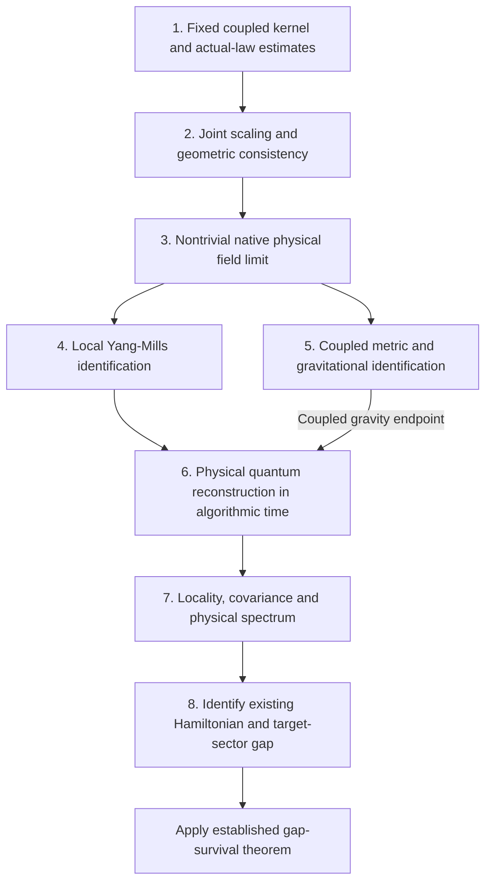

# Volume 2: remaining steps from the Fractal Gas to quantum fields and a Yang–Mills mass gap

**Research roadmap — source snapshot: 2 October 2026.**

This document describes the current working-tree version of Volume 2. In particular,
the structural landscape chapter and several source revisions are concurrent,
uncommitted work. A commit containing this roadmap does not publish those concurrent
source changes. The source register below identifies the chapters and theorem labels
on which this account depends.

The programme starts with one interacting stochastic system. Fitness, selection,
cloning, kinetic motion, viscosity, recorded history and emergent geometry share its
transition law. The field algebra, adaptive graph and geometric observables are read
from that law. This shared origin is the strategy's principal organizing idea: it
allows their responses, correlations and errors to be controlled together. The
remaining task is to identify the physical continuum theory generated by this
system while retaining that joint control.

We use **three spatial coordinates and algorithmic physical time** throughout:

$$
x\in\mathbb R^3,\qquad \tau_n=nh,\qquad
G=-c^2d\tau^2+g_\tau.
$$

Here $h$ has units of physical algorithmic time after calibration, and $c$ has units
of spatial distance per unit time. A four-coordinate Euclidean representation,
when used for reconstruction, must be obtained from this physical-time theory by
a specified construction. It must not silently replace $\tau$ by a fourth walker
position coordinate. Several existing reflection tests in Volume 2 concern a
position coordinate $x^0$ in a four-dimensional position configuration; their scope
is stated explicitly below.

The statements called **established** below are the results in the cited chapters,
with their displayed hypotheses. The statements called **remaining deliverables**
are proposed proof tasks, not additional proved theorems. The distinction keeps the
roadmap usable as a dependency list.

### Current discharge, without changing the algorithm

The following additions state their configured gas variant explicitly.
The dense viscous reference, conservative nonviscous instances and passive
observations have separate hypotheses. They do not replace the metric-feedback,
Boris, adaptive-noise or historical-donor variants by a simpler kernel.
No unverified premise is counted as a completed proof.

| Discharged point | Main-chapter proof | Exact scope |
|---|---|---|
| Complete color/geometry recording and analytic transfer | `def-variant-recorded-color-geometry`, `thm-variant-passive-record-transfer` in [Gas variants](../source/2_fractal_gas/1_the_algorithm/04_gas_variants.md) | Existing three-spatial-coordinate viscous transition; geometry is a passive instrument using existing pipeline configurations |
| Valid B2 color and full-slot spatial general position | `thm-variant-b2-color-nondegeneracy` | Fresh positive OU noise; complete positive Gaussian force; no assertion that a resting initial B1 force is nonzero |
| Uncapped coupled-kick moments and terminal survival | `thm-cgd-kinetic-moments`, `cor-cgd-boundary-comparison` in [Coupled finite-population discharge](../source/2_fractal_gas/convergence_program/18_coupled_gas_discharge.md) | Both force evaluation stages retained; no maximum-over-population replacement and no truncation of Gaussian draws |
| Finite-population QSD, mixing and full-step entropy | `thm-cgd-finite-n-qsd`, `thm-cgd-discrete-entropy` | Actual killed quadratic/capped/terminal-box gas; reference preset's numerical coercivity margins are verified; constants are not asserted uniform in population size |
| Primitive QSD eigenfunction ratio, conditioned rates and analytic-force extensions | `thm-cgd-analytic-force-qsd`, `thm-cgd-primitive-eigenfunction`, `cor-cgd-primitive-reference` | Unchanged reference force and both existing normalizations; configured real-analytic forces with finite global derivative profiles and the displayed B2/first-drift margins; positive clone jitter for the quantitative ratio when $N>1$; original Gaussian noise remains unbounded |
| Population-uniform complete Keystone estimates | `thm-ku-complete-signed-update`, `lem-ku-polynomial-row-defect`, `thm-ku-cubic-uniform-moments`, `thm-ku-uniform-alive-inverse-moments` in [Population-uniform Keystone estimates](../source/2_fractal_gas/convergence_program/18a_keystone_uniform_coupled.md) | Actual measurements, gates, donors, mandatory revival and component Haar rotations; signed pressure with its $N^{-2}$ correction; both dense viscous kicks, uncapped Gaussian stage moments and row defects without an assumed degree floor; quadratic, native Rastrigin and Styblinski–Tang force budgets; energy-based extinction and current-time inverse alive mass; original alive-centered pressure; exact regional jitter moments and an evaluated regional coefficient; phase occupation, centroid, crossing and killing flux retained. Uniform regional coefficients do not identify inequivalent phase weights or remove their crossing scale. |
| Population-independent QSD marginal tails and survival floor | `thm-cgd-uniform-marginal-qsd-tails`, `cor-cgd-reference-uniform-tails` | Both existing normalizations; Gaussian retained-position tails, all marginal moments and expected alive fraction; no joint concentration or uniform mixing assertion |
| Exact population-uniform alive-law mixing | `lem-slcw-finite-preparation`, `thm-slcw-finite-uniform-law`, `cor-slcw-finite-positive-exponents` in [Structural landscape convergence](../source/2_fractal_gas/convergence_program/06a_structural_landscape_convergence.md) | Conservative current-frame nonviscous canonical gas with bounded raw reward, bounded completed force center and explicit positive weak-selection interval. Exact finite-swarm invariant target; alive-sampled TV and Wasserstein relaxation rates independent of $N$, with no particle floor. Actual sampled global normalizers, finite accepted components, shared Haar and all noises retained. |
| Unbounded-reward population-uniform alive Wasserstein law | `thm-slcw-alive-uniform-law`, `cor-slcw-alive-stationary-comparison`, `cor-slcw-concrete-alive-profile`, `cor-slcw-rastrigin-uniform-law` | Same conservative nonviscous schedule with quadratic-growth raw reward, including a single potential for reward and force; explicit weighted feedback gap. Random alive empirical law and its average converge to the population stationary law with an $N$-independent time term and a proved vanishing particle floor. Quadratic and standard Rastrigin profiles have complete primitive parameter proofs. |
| Positive count-viscosity harmonic alive-law relaxation | `thm-ku-count-small-viscosity-contraction`, `cor-ku-count-kinetic-invariant-law`, `cor-ku-original-step-positive-count` in Chapter 18a | Cloning and death disabled; both actual dense kicks, unbounded innovations and smooth cap retained. Original harmonic force and timestep, an explicit strictly positive viscosity interval, exact finite-swarm invariant target, uniform individual moments and both alive Wasserstein rates. The interval does not certify the original viscosity $\nu=0.3$. |
| Exact active law at the original nonresonant harmonic timestep | `lem-kuhw-mixed-finite-preparation`, `lem-kuhw-combined-finite-preparation`, `thm-kuhw-active-exact-uniform-law`, `cor-kuhw-original-step-active-profile` | Actual conservative nonviscous gas, bounded configured reward, original $F=-x$ and $h=0.04$, primitive positive selection interval. A local-plus-global weighted coupling, incoming donor moment drift and one-update Gaussian minorization give exact finite-swarm invariant alive-sampled TV and both alive Wasserstein rates, uniformly in $N$, with no particle floor or force-center reset assumption. |
| Active count-viscous population attraction | `thm-pvb-viscous-feedback`, `thm-pvb-active-population-convergence`, `cor-pvb-original-step-active-viscosity` in Chapter 18a | Conservative harmonic force at the original nonresonant timestep, bounded configured reward, eighth-moment confinement and explicit strictly positive selection and count-viscosity intervals. Actual correlated density scores and frozen root Harris contraction give a unique population stationary law and physical Wasserstein relaxation. |
| Raw quadratic active count-viscous population attraction | `lem-rqf-logistic-tail`, `thm-rqf-preparation-feedback`, `lem-rqf-preparation-bv`, `cor-rqf-active-population` | The same unbounded potential supplies F=-x and raw R=-|x|²/2. Logistic derivative decay and exact full weighted-variation moment changes close preparation provider feedback and population spatial BV; the positive-viscosity stationary law and relaxation theorem then apply. The separate raw-reward particle modulus and uniform-time transfer are now proved in `lem-rqpt-population-modulus`, `thm-rqpt-uniform-time` and `cor-rqpt-alive-w2`: arbitrary initial averaged eighth-moment budget, physical alive empirical-law/sampled Wasserstein relaxation, and a vanishing particle floor. Killed conditioning remains separate. |
| Actual active count-viscous uniform-time particle transfer | `thm-vupt-conditional-consistency`, `lem-vupt-population-modulus`, `thm-vupt-uniform-time`, `cor-vupt-alive-w2` | Same conservative positive-viscosity regime, arbitrary entering arrays with a uniform averaged eighth-moment budget. Preparation-only conditional bias/variance, both actual count kicks, their joint noisy provider and final Gaussian give an explicit weak one-step error; a moment-local Hölder restart gives a vanishing error uniformly over all times. Random empirical-law and alive-sampled Wasserstein rates are independent of N, toward the population law with a particle floor. Exact dense finite-array invariant mixing and survivor conditioning remain separate. |
| Large-box active count-viscous marked population attraction | `prop-kpf-marked-preparation-feedback`, `thm-kpf-large-box-population-convergence`, `cor-kpf-current-alive-relaxation`, `cor-kpf-original-step-marked-regime` | Exact marked population update with mandatory dead revival, actual alive conditional donor normalizers, both kicks and terminal box. Boundary traces and full marked feedback give explicit positive selection/viscosity intervals and one fixed sufficiently large box, a unique stationary revival population law, global moment burn-in, and current alive TV/W2 relaxation. This does not identify that law with a finite-swarm QSD or certify the default box/viscosity. |
| Actual surviving count-viscous N-uniform alive observation laws | `lem-spt-actual-survival`, `lem-spt-marked-consistency`, `thm-spt-uniform-surviving-law`, `cor-spt-alive-w2` | Exact finite killed chain conditioned on its own survival through the current observation time. Fixed sufficiently large box, positive weak selection and positive count viscosity. Actual safe-return domination, conditional moments, marked weak consistency and final-Gaussian boundary coupling give an N-independent rate and a vanishing particle floor uniformly over all times. Alive empirical-law and both sampled-law conventions are explicit. Arbitrary retained dead coordinates are allowed; target is the marked population law's alive restriction, with no finite-QSD identification or original ν=0.3/L=2 certification. |
| Raw same-potential actual surviving N-uniform alive law | `lem-rkpf-raw-interfaces`, `def-rkpf-positive-endpoints`, `thm-rkpf-large-box-population`, `cor-rqk-surviving-alive-law` | Unchanged F=-x and raw R=-|x|²/2, both active count-viscous kicks and mandatory revival. Raw conditional-alive normalization and boundary BV close population feedback with all endpoint constants fixed before the sufficiently large terminal box. The actual finite swarm conditioned on its own survival then satisfies optimal current-alive empirical-law/sampled W2 relaxation with N-independent time rate and an explicit vanishing particle floor. Default ν=0.3/L=2 and exact finite-QSD mixing remain outside this sufficient certificate. |
| Active harmonic confinement at the original viscosity | `lem-ku-count-active-harmonic-drift` | Actual finite current-frame sampled fitness, incoming donor columns, copying, jitter and component Haar; $h=0.04$, count $\nu=0.3$ and a primitive positive weak-selection interval. Population-uniform fourth-moment drift is proved; active-law contraction remains a separate obligation. |
| Joint active count smoothing and whole-horizon normalization | `thm-kv-active-joint-bv`, `thm-kv-count-joint-density`, `lem-kv-weighted-ou-score`, `thm-ku-finite-future-survival-ratio`, `cor-ku-future-conditioned-alive-law` | Joint-array spatial BV and actual dense-kick density are proved in the stated conservative center-balanced regime, including raw quadratic reward. Future survival weights and sharp alive-law tilt bounds are proved conditional on the actual full-array block comparison; neither absolute BV nor a finite-$N$ QSD certificate is taken to prove that comparison. |
| Fixed-step coupled kinetic population consistency | `thm-cg-mf-kinetic-limit`, `thm-cg-mf-row-kinetic-limit`, `cor-cg-mf-full-update` in [Viscous population limit](../source/2_fractal_gas/convergence_program/19_color_geometry_mean_field.md) | Both existing normalizations, unchanged reference landscape and original selection inputs; exact self-exclusion and local row degrees derived from moments, not assumed; finite horizons, not stationary attraction |
| Conditional variance through the coupled B2 stage | `thm-cg-mf-kinetic-variance` | Explicit kinetic-stage budget given the entire cloned array; cloning fluctuations are not silently omitted from a purported full-update bound |
| Ground space, parity and spectral gap of the existing edge Hamiltonian | `thm-lqft-edge-filled-ground-gap`, `thm-lqft-edge-parity-ground-gap` in [Lattice QFT](../source/2_fractal_gas/2_fractal_set/03_lattice_qft.md) | Exact finite directed-edge operator, filled negative modes and all zero modes; the Hamiltonian is not reconstructed anew |
| Finite gauge-sector spectral and excitation tests | `thm-ym-edge-gauge-spectral-certificate`, `cor-ym-edge-filled-gauge-closure` in [Yang–Mills](../source/2_fractal_gas/2_fractal_set/05_yang_mills_noether.md) | Actual same-operator invariant modes discharge commutation identically; no inferred local Yang–Mills action or uniform random-record gap |

The primitive-parameter minorization, QSD eigenfunction ratio and conditioned
mixing/entropy rates are now explicit in `thm-cgd-primitive-eigenfunction`.
The unchanged reference instance passes the force and noise margins for both
normalizations. The same bounds apply to configured real-analytic forces whose
finite global derivative profiles satisfy those margins. These finite-population
constants can be extremely pessimistic; they do not supply population-uniform
mixing or joint concentration. Zero clone jitter for $N>1$, nonsmooth or infinite
global derivative profiles, and failed force/row first-drift margins remain
outside this quantitative extension. The force and unbounded noise are unchanged.

Chapter 18a Sections 6.10–6.14 now additionally prove default-box alive
coverage and recent-survival normalization, source-box sharpening of the
count particle floor, and the complete positive row-normalized raw-reward
population and actual finite survivor-conditioned alive-law extension.
Its true row degrees and uncapped correlated OU numerator are controlled
separately from count feedback. Actual empirical-measure and both alive
sampling laws have N-independent geometric time rates and explicit particle
errors vanishing uniformly over all times, in the stated small-positive
selection/row-viscosity and fixed sufficiently-large-box regime. Section
5.15 proves reference-viscosity dissipation and frozen-provider mixing,
including a full-root gap at L=2. The nonlinear comparison of each law's
own default nu=.3/L=2 providers remains a separate estimate; these proved
frozen gaps and survivor normalizers do not discharge it.

Sections5.17–5.19 now complete the actual reference velocity burn,
full-tail direct provider feedback, source-weighted first-kick account
and noncommuting whole-cap principal balance at nu=.3. Sections6.15–6.16
prove default count finite consistency and actual empirical-provider
moment control uniformly over current-survivor time, in an explicit
nonempty weak positive fitness interval, with unrestricted dead tails
and no small-dead assumption. These proofs have independent audits.
Their remaining default law obligation is signed absorption of the
actual spatial forces together with preparation/revival/mark feedback;
the new finite interfaces do not supply a stationary attraction theorem.

Section5.20 additionally completes actual own-provider kinetic
absorption on an explicit nonempty source-plan class, including genuine
cloning at fixed positive fitness powers. Section6.17 supplies the
exact signed cap/source/terminal-tail ledger and a sufficient interior
source class for small next dead mass. Section6.18 proves exact finite
N-uniform alive empirical-law and sampled-law transport at the default
count or row profile for one update from separated collapsed tied-fitness
inputs, with each own survival event and no particle floor. None of
these restricted classes is asserted invariant. General shape-changing
couplings, actual preparation/marking feedback and arbitrary-input
source-boundary burn remain the default repeated-law obligations.
Sections5.21–5.24 now prove arbitrary-position kinetic transport on
constant-velocity slices and nonconstant pointwise bands, and compute
the exact signed joint-Gaussian tensor and native-cap loss. An inward
nonconstant-velocity family has squared kinetic factor.99; Section6.21
transfers its prepared kinetic endpoints to actual alive empirical-law
and both sampled-law transport with coefficient249/250, independent of
evenN and no particle floor, at the stated minimum parameter separation.
Neither class is preserved by the subsequent OU-noisy active update.
Sections5.22 and6.20 retain complete full-dead feedback, chronological
marked-law response, preserved shrinking boundary envelopes and exact
source/Haar/count/cap covariance residuals. The loose absolute feedback
does not absorb the default frozen gap, and shrinking boundary regularity
does not imply small dead mass at fixed layer width.5. Section6.19's
local empirical-law non-Lipschitz result only restricts a one-update
proof; it does not refute delayed mixing. The remaining default obligation
is a closed signed delayed estimate through genuinely noisy velocity laws,
actual active preparation and each own survival/alive normalizer.

Sections5.25–5.26 and6.22 now give the exact general first-bilinear,
second-Gaussian and native-cap balance, a conditional cap coercivity
bound through the actual correlated noisy provider, and the original
OU graph trace with nonlinear friction and inward cross flux.
Independent audits70–72 pass. Averaged velocity RMS is used only
where its factorization is proved; arbitrary local velocity/displacement
products and random finite empirical budgets remain mixed.
The primitive cap-energy remainder is below.000041 at entering RMS.56.
These completed interfaces do not supply the still missing general
signed absorption or delayed preparation/marking law gap.
Section5.27 additionally consumes the entire first recipient-jitter
pair and force-square terms, including mismatched copy statuses and
coincident finite environments. Audit75 accepts its exact singular
Gaussian tilt and full joint moments. Its inward-source linear sign
does not remove the positive force square or the remaining second
provider/cap, preparation and survival obligations.
Section5.28 now proves the actual full-Gaussian conditional native-cap
squared-derivative bound159/200 on pre-OU-fixed vectors, through the
own noisy count graph and unbounded prepared root positions. Audit75
checks its twelve rational thresholds, exact finite provider tail and
each own survival restriction with weighted removed moments. The
correlated force and bare cross terms remain in the signed account;
this conditional deficit does not certify the full default law gap.
Section5.29 additionally closes the general first-provider positional
margin at the default viscosity through an exact centered operator
bound. Audit78 accepts its population coefficient<2.76185 and fixed
finite coefficient<2.76792, below the exact force threshold10/3.
The actual positional rates<.999866 and<.999868 retain the velocity
displacement term and precede terminal restriction. They do not yet
contract the full phase or separately surviving alive-law targets.
Section5.30 proves complete population source-plan cap-force consumers
with exact radial cancellation, original full-jitter products, both
own providers and the noncommuting second count term. Audit78 accepts
its position residual<=.000650dX and capped-velocity residual
<=.01787dX+.000344dP under the declared post-burn RMS budget.
The full signed cross terms, preparation and own alive normalizers
remain to be absorbed; population moments are not substituted into
random finite provider products.

Sections5.31–5.32 now prove the actual conditional mean-cap
matrix and a passing signed first-provider/cap auxiliary consumer.
Audits83–84 accept their exact coefficients. The full-jitter
weighted population sector is positive despite the proved failure
of a root-uniform conditional lower. The auxiliary Q(R,DZ_b)
margins are .0000147 for the population and .0000048 for fixed
finite preparations; the entire actual aDF2 remains explicitly
unabsorbed. No endpoint transport map is inferred from this
auxiliary differential. The absolute residual relaxation alone
admits an unstable matrix; that excludes the relaxed certificate,
not actual delayed alive-law mixing.
Section6.23 bounds the mixed extinction and empirical-position
exceptions through actual row return events and exact Gaussian
tilting. Audit82 accepts the own-survivor paired cap deficit41/400
in its explicit N>=Nstar, pathwise entering-RMS<=.56 regime.
The finite Nstar is conservative, and the class is not asserted
invariant. The full second-provider signed response, actual
preparation/revival feedback, terminal marking and two own
alive-law readout normalizers remain the default obligation.

Chapter 18a now uses the original alive-centered Keystone coordinate:
$W=N^{-1}\sum_{I_{11}}|\Delta\delta_{x,i}|^2$.
It keeps centroid motion, within-phase dispersion, between-phase geometry
and actual transition flux distinct. The auxiliary raw fixed-slot
counterexamples do not refute this coordinate: a common translation has
zero centered error. They are diagnostics of a different comparison,
not a reason to replace the existing regional method.

The native Rastrigin calculation integrates unrestricted Gaussian jitter
exactly. Its within-core mean-map coefficient is
$\rho_J^2=.5978840815787646$, with accepted-jitter coordinate variance
at most $.006371638355086486$. Composing the same signed source
pressure and the two actual viscous kicks gives the evaluated
regional bound `thm-kur-evaluated-regional-bound`, with
$\lambda=.7989420407893824$ and conservative floor
$C_{\rm reg}=.20613357968212598$, under its stated source-core and
source-pressure hypotheses. Actual gate feedback and velocity
covariances remain available in the sharper signed formula. No source
fitness gap, noise cutoff or population-dependent Gaussian maximum is
used. Gaussian phase transfers, boundary truncation and actual random
alive/phase denominators account for departures from a core.

The QSD extension uses the existing phase-flux/adjugate method, adding
its exact centered killing correction. Symmetry-related Rastrigin
phases have equal eigenfunction scales and QSD/Doob weights for every
$N$. Inequivalent well orbits retain their own crossing and extinction
coefficients. The weighted adjugate is an identity involving $h_N$;
it cannot supply a primitive oscillation bound by itself. Its path
comparison explicitly requires the separately proved within-phase
bound. The finite-$N$ primitive ratio certificate retains its stated
population dependence. Global communication between distinct phases
is not a requirement of the population-uniform regional estimates.

### Further native proof advances

The following complete proofs are now in the main book. Each uses the
[complete execution record](../source/2_fractal_gas/convergence_program/20_complete_native_parameters.md),
retaining the algorithm, landscape, stage, masks, arithmetic, readout and
calibration parameters. A failed sufficient test remains an unresolved case
unless an actual counterexample proves failure.

| Target | New proved step | Exact residual |
|---|---|---|
| Stationary control | [Count-B2 force/Jacobian bounds and complete-step marked-law entropy](../source/2_fractal_gas/convergence_program/21_native_stationary_control.md), [uniform spatial inequalities and invariant stationary population distributions](../source/2_fractal_gas/convergence_program/26_native_stationary_laws.md), [full marked stationary concentration and entropy/transport bounds](../source/2_fractal_gas/convergence_program/30_native_stationary_concentration.md), and [quantitative stationary chaos with commuting time/population limits](../source/2_fractal_gas/convergence_program/34_native_quantitative_stationary_chaos.md) | The positive active-cloning count regime has an evaluated primitive witness, fixed-label transport rates and a full marked quadratic-transport rate. The unchanged reference fails this sufficient contraction test; its phase concentration and a stationary gradient entropy-production inequality remain. |
| Joint geometry | [Native conditional sampling, finite-time coverage/survival, same-sample density correction, protected cells, local quadrature and retessellation](../source/2_fractal_gas/convergence_program/22_native_joint_geometry.md), [sparse row/metric limits](../source/2_fractal_gas/convergence_program/29_native_sparse_geometry.md), [assembled geometry concentration](../source/2_fractal_gas/convergence_program/31_native_geometry_averaging.md), [same-cell dense-force color marks](../source/2_fractal_gas/convergence_program/32_native_marked_geometry.md) and [quantitative stationary marked geometry](../source/2_fractal_gas/convergence_program/37_native_quantitative_marked_geometry.md) | The reference and exact-reset hard masks are discharged for both normalizations at every threshold. In the proved count phase, preparation/B1 transport, smooth dense fields and bounded same-window observations now have primitive rates; reset hard masks have a derived vanishing band modulus and compact algebraic rates. Numerical payload comparison, other metric/feedback branches, unbounded action tails and full fluctuation-scale rates remain. |
| Gauge fluctuations | [Reference determinant/centroid limits](../source/2_fractal_gas/convergence_program/24_native_determinant_amplitude.md), [complete stationary functional fluctuations](../source/2_fractal_gas/convergence_program/40_native_full_stationary_fluctuations.md), and [actual repeated ray-channel drift/bracket/action](../source/2_fractal_gas/2_fractal_set/22_native_two_face_gauge_time.md) | The full finite-population stationary Poisson and covariance decomposition is proved, including hard masks and unbounded sources. An evaluated active count regime has positive complete retained B2 color covariance. The remaining full population/graph field limit needs its uniform covariance and nondegeneracy; the actual damped ray phase has zero complete additive variance. |
| Local gauge variation | [Native weak source and preparation-posterior identities](../source/2_fractal_gas/2_fractal_set/10_native_connection_variation.md), with [the explicit capped B2 action, preparation-uniform target density, existing ray connection and correlated native face-action limit](../source/2_fractal_gas/2_fractal_set/15_native_conditional_action.md) | An actual unit-weight U(1) face-action regime is proved. [Native projector products determine a non-Abelian connection, noncommuting curvature and weak action response](../source/2_fractal_gas/2_fractal_set/16_native_projector_connection.md). The [existing zero-final-noise spatial regime](../source/2_fractal_gas/2_fractal_set/19_native_spatial_projector_connection.md) now has an actual smooth spatial connection, noncommuting curvature, same-record triangle holonomy and bounded smeared Wilson limit, plus original Gaussian source action and coupled force variations. Its reducible support, literal B1/B2 distinction and remaining SU(3) spacetime/action correspondence are explicit. |
| Dynamical geometry | [Actual ridge/clamp, curvature reward, graph/Boris and selection variations; Gaussian thermal stress and fiber response](../source/2_fractal_gas/3_fitness_manifold/10_native_metric_variation.md) | Integrated interface terms, coupled uniform limits and Einstein correspondence remain; the Einstein–Hilbert preset retains its isotropic thermostat |
| Physical time | [Native transfer and reference tests](../source/2_fractal_gas/2_fractal_set/14_native_transfer_sector.md), [positive centroid reconstruction](../source/2_fractal_gas/2_fractal_set/18_native_color_time_reconstruction.md), and [full actual projector-color history reconstruction](../source/2_fractal_gas/2_fractal_set/23_native_two_walker_color_reconstruction.md) | The dense two-row color sector now has positive transfer, a unique vacuum, an identified Hamiltonian and exact all-phase finite-threshold gaps. The reference clock cycle and common-SU(3) quotient retain their separately proved tests. Other cap/force/population regimes and the target local continuum field correspondence remain. |
| Locality/covariance | [Actual source influence and reference symmetries](../source/2_fractal_gas/2_fractal_set/12_native_locality_covariance.md), [separated-root, regional/alive-normalized and full-state L2 time covariance](../source/2_fractal_gas/convergence_program/39_native_stationary_spacetime_covariance.md) | Actual same-record spatial and finite-history covariance now has explicit count/reset-phase rates, retaining shared calibration errors. Normalized physical spacelike gauge covariance, local quantum algebra and spacetime symmetry correspondence remain. The CAR criterion alone exhibits no actual spacelike violation. |
| Native spectrum | [Implemented finite spectrum and active-block comparison](../source/2_fractal_gas/2_fractal_set/13_native_spectral_gap.md), [uniform positive centroid gap](../source/2_fractal_gas/2_fractal_set/18_native_color_time_reconstruction.md), and [identified full color-history gap](../source/2_fractal_gas/2_fractal_set/23_native_two_walker_color_reconstruction.md) | Native positive physical centroid and color sectors are identified and their Hamiltonian gaps are proved. Arbitrarily small raw reference edge gaps remain accessible. The target local Yang–Mills sector and its uniform physical continuum transfer estimates remain. |

The [complete native time-scaling theorem](../source/2_fractal_gas/convergence_program/27_native_time_generator.md)
now constructs the full finite-population jump diffusion, its exact drift
and bracket, and the actual B2 projector process in a specified existing
acceptance/cap/unbounded-boundary family. Its nonzero rank-four gauge
diffusion is derived from the configured force and noise. The literal
fixed-cap and fixed-acceptance small-step families are characterized
separately; terminal revival is not omitted from a claimed reference limit.

The reflection-positive edge correlations use the existing Hamiltonian and
its filled ground. The source-coordinate traceless matrices represent actual
color derivatives. Neither construction is asserted to complete its remaining
physical correspondence merely by being available.

The [complete stationary fluctuation chapter](../source/2_fractal_gas/convergence_program/40_native_full_stationary_fluctuations.md)
now gives the full-record Poisson decomposition, complete bracket,
Green--Kubo covariance and functional native-time CLT, including hard masks
and unbounded square-integrable original sources. An evaluated active count
regime has strictly positive complete covariance for an actually retained B2
projector, proved on an original clone-jitter/OU/terminal-noise fiber.
The empirical Lipschitz state channel additionally has a primitive
population-uniform temporal covariance bound. Instantaneous population
Gaussianity and the continuum gauge/geometry channel remain distinct tasks.

The [joint population/native-time theorem](../source/2_fractal_gas/convergence_program/41_native_joint_population_time_limit.md)
now removes the exponential population cost in the full-record
characteristic estimate by stopping the actual complete bracket.
For existing Lipschitz empirical state observations, including recorded
mean capped velocity, it gives tight joint path laws and Brownian limits
along every actual covariance cluster subsequence. The original update
schedule $n_N/N^9\to\infty$ is a proved sufficient regime; the complete
once-survival-conditioned history has the same limit with its
horizon-independent native Doob comparison. No limiting mean-field
centering or positive covariance is assumed.

The [actual repeated two-face ray channel](../source/2_fractal_gas/2_fractal_set/22_native_two_face_gauge_time.md)
has a complete Gaussian path action, source score and quantitative
growing-time/small-noise limit. Its damped stationary phase has zero complete
additive variance despite a positive innovation bracket. The existing
independently configured zero-friction diffusion tag instead gives
unit-action matching on every finite time window.
The [full two-walker B1 projector-color history](../source/2_fractal_gas/2_fractal_set/23_native_two_walker_color_reconstruction.md)
now has reflection positivity, positive transfer, a unique vacuum and its
identified Hamiltonian: the exact gap is $2\gamma/t_*$ at zero phase and
$\gamma/t_*$ at every allowed nonzero phase, at every finite threshold.
This is the real-coordinate dense row regime $t\nu=1,\lambda=0$;
its stationary velocity factor is proved, and its complete position process
has no invariant probability. Python's empty two-walker graph, rounded
arithmetic and the local continuum Yang--Mills sector retain their actual
separate scopes.

The [arbitrary-population harmonic color reconstruction](../source/2_fractal_gas/2_fractal_set/24_native_population_color_reconstruction.md)
also identifies a FULL stationary confining state law and the configured
B1 recorded-potential color history at every finite population. The
existing zero-selection, zero-viscosity, cap-`None` harmonic branch has
positive actual transfer at evaluated original recording resonances.
Its complete raw and ray color sectors have exact gap
$\gamma/(2t_*)$, uniform in population, at every finite positive configured
phase and finite threshold when terminal position noise is zero.
Positive terminal noise retains the derived covariance and primitive
positive phase intervals. The full harmonic recording-stride positivity
classification is proved. The default viscous source at zero viscosity
is unavailable; this result consumes the explicit existing
`ColorSource::RecordedField` potential-force option.

The [original harmonic population color limit](../source/2_fractal_gas/convergence_program/43_native_harmonic_population_color_limit.md)
now gives the instantaneous and complete finite-history Gaussian population
law with the original hard threshold. Its exact Green–Kubo covariance is
population independent and strictly positive for an explicit original
projector test. Joint population/time Brownian path limits hold along every
$N\to\infty$, $n_N\to\infty$ schedule in this proved branch, and both ordered
limits agree. Disjoint native regional available-color counts give an actual
noncommuting example for the book's covariance-based CAR assignment. Their
identification with physical spacelike regions remains a separate obligation.

The [complete population color fluctuation chapter](../source/2_fractal_gas/convergence_program/42_native_population_color_fluctuations.md)
derives $C/N$ stationary variance, $\sqrt N$ tightness and population-uniform
FULL time covariance for smooth bounded weighted tests of the actual
matched B2 projector with its original clone-deletion/final-alive masks.
It therefore supplies joint population/native-time Brownian path limits
on the evaluated schedule above, with each complete covariance cluster
matrix retained. The unweighted hard color has its own primitive
finite-$N$ variance/boundary profile, without an assumed linear boundary
density or an instantaneous Gaussian population law.

The [complete interacting instantaneous linearization](../source/2_fractal_gas/convergence_program/44_native_stationary_population_linearization.md)
now derives an exponential tail for the actual accepted collision components
in a primitive subcritical gate regime. It computes the full influence of
both kicks, jitter, OU and terminal alive status, with a uniform vanishing
$\sqrt N$ remainder. The stationary instantaneous law is its tight compact
preparation fluctuation plus an independent Gaussian with the identified
complete downstream covariance. The remaining conditional center is stated
explicitly.

The [original stationary preparation brackets](../source/2_fractal_gas/convergence_program/46_native_stationary_preparation_bracket.md)
now also derive the actual sampled-normalizer and whole-component Haar
brackets, the complete two-copy clone bracket, and their full nonlinear
postmeasurement Gaussian law. The original active-count witness satisfies
the primitive two-copy component tests. Its full diagonal-projector
covariance has a strictly positive derived trace contribution. What remains
in the instantaneous law is the measured conditional center and entering
stationary feedback; neither is replaced by a presumed Gaussian source.

The [complete measured response](../source/2_fractal_gas/convergence_program/47_native_measured_preparation_response.md)
also closes the original sampled global normalizer and its shared-donor
influence through the nonlinear color center. All innovations after the
entering state have a derived joint Gaussian population law, with the
measured, clone, Haar and complete downstream brackets retained.
The original final spatial noise and squashed-feature Jacobian give an
explicit finite limiting live-fitness density and linear tie-band bound.
The stationary entering-population conditional mean is the remaining
instantaneous term.

The [same-record stationary harmonic spatial scaling](../source/2_fractal_gas/convergence_program/45_native_harmonic_spatial_scaling.md)
identifies the original positive phase/graph-spacing regimes. Its critical
marked Wilson action retains the full shared-root velocity covariance and
has an explicit three-term Gaussian integral. Smaller phases give the
nonzero reducible radial weighted Yang–Mills field; vanishing-supercritical
and fixed positive phases give a divergent normalized composite action.
An actual phase-calibrated projector observation retains a nonzero complete
Gaussian time law and exact native physical gap along the same family.
The passive exact book Delaunay tag and Rust's rank-tolerant geometry are
distinguished, with an explicit numerical graph discrepancy budget.

The [same-record marked spatial action fluctuations](../source/2_fractal_gas/convergence_program/48_native_marked_action_fluctuations.md)
now have an identified Poisson pair covariance and a primitive strictly
positive variance at every positive critical phase ratio. Their original
velocity-mark innovation has a full finite-history Gaussian law, retaining
repeated row addresses and overlapping faces. Complete native-time
covariance, Green–Kubo limits and Brownian path limits hold on every
diverging population/time schedule. The [complete spatial action
fluctuations](../source/2_fractal_gas/convergence_program/49_native_spatial_position_fluctuations.md)
also close the original position and retessellation center through an
explicit native add-one covariance. The full action has a nondegenerate
Gaussian history and Brownian path limits on every diverging
population/time schedule, with all original shared marks and repeated
position addresses retained.

The [native action/score identification](../source/2_fractal_gas/2_fractal_set/25_native_action_score_identification.md)
now computes the full curvature polynomial, all consumed primitive
limiting variations and strong uncut original mean/amplitude score
limits. Its actual density coefficient is retained. The native connection
has the weighted Yang--Mills first-variation identity. The permitted
zero-phase radial field has nonzero curvature and solves the local
weighted vacuum equation; every nonzero phase has an explicit nonzero
weighted residual and cannot solve that equation on an open available
chart. This classifies the actual local field rather than assigning its
Gaussian source likelihood an unrestricted gauge-field action.

The [positive-viscosity color-only clock test](../source/2_fractal_gas/2_fractal_set/26_native_interacting_color_clock_test.md)
also derives the full stationary law of an actual capped interacting
harmonic phase and exhibits a strictly negative adjacent reflected
diagonal using only its existing matched B1 projector entries.
The theorem covers an evaluated original cap/viscosity interval and
strictly positive spectroscopy thresholds. Its conservative threshold
certificate does not cover the separately clamped lecture instrument.
This is an actual parameter-regime obstruction to that original clock
reflection, alongside the proved positive native color regimes.

The [positive interacting full stationary color reconstruction](../source/2_fractal_gas/2_fractal_set/27_native_interacting_positive_color_reconstruction.md)
now derives the complete stationary position and velocity law of the
existing two-walker dense row-viscosity harmonic family with both kicks
active. Its actual full raw/projector color history has positive transfer,
a unique vacuum and exact gap $\gamma/(2t_*)$ at every finite positive
phase and finite threshold on recording strides divisible by four.
The same trajectory has negative actual color-only reflection diagonals
at the other strides. The complete full-state and color clock
classification is proved; the smaller scalar orbit keeps its separately
identified relative spectrum.

The [actual interacting scalar-orbit physical gap](../source/2_fractal_gas/2_fractal_set/28_native_scalar_orbit_physical_gap.md)
is now identified too: its complete history has exact positive gap
$g_-=\gamma/(2t_*)-\log(\alpha)/(t_*h)$ for every finite threshold
and every positive original phase. The native availability multiplier
and temporal spectral filters prove the positive-threshold cases.
At zero threshold an exact squared-Gram readout retains the first
mode at the unique exceptional primitive phase. The smaller primitive
Gram cyclic spectrum has its separately proved phase-dependent gaps;
it is not substituted for the complete physical history.

The [actual second-kick color channel](../source/2_fractal_gas/2_fractal_set/29_native_b2_color_reconstruction.md)
now has its own complete stationary stage covariance, positive stride-four
history, exact all-phase component and scalar gaps, and failed-stride
classification. Its original preceding-force arm is also identified when
terminal position noise is zero. The implemented once-frozen warm-up
calibration has a derived joint stationary limit and genuine color and
scalar zero-energy modes when that calibration is random. Its exact
positive excitation gap is above the entire ground space; conditioning
the retained successful calibration gives the unique-vacuum fiber.
The Python preceding-B1/current-velocity readout is kept distinct from
these verified Rust stage sources.

The [literal coupled Einstein–Hilbert action](../source/2_fractal_gas/3_fitness_manifold/11_native_coupled_metric_action.md)
now has an exact original clone-pattern/Gaussian position-kernel response,
zero-mass plan derivatives and a complete finite-history bounded-observable
reward-scale derivative. The full-rank action contribution has its proved
$L^p$ range and integrated metric/noise response, including retessellation
and all determinant floors. The actual positive affine-rank cutoff creates
an open rank-one branch with infinite absolute raw-action mean in the
unbounded relative-trace continuous-Gaussian preset; the reference
full-rank component also lacks a second moment. These are properties of
the original metric and graph, with finite-stream/error scope explicit.
The [existing absolute covariance metric](../source/2_fractal_gas/3_fitness_manifold/12_native_absolute_metric_response.md)
now has a global bounded-action proof over every literal rank, deletion,
clamp and floor branch. This closes its uncut original Gaussian, thermal
and finite-history reward-scale responses. An exact dilation of proof
coordinates retains the full terminal spectral interface in the ridge
response, including at the actual origin start. Earlier preparation jumps
keep their exact left and right kernel laws. A native triangle gives a
nonzero action and strictly positive finite Gaussian action variance.
This is the existing absolute-metric parameter regime; the relative preset
retains its separately proved divergent mean.

The [full native absolute-metric history response](../source/2_fractal_gas/3_fitness_manifold/13_native_absolute_metric_history_response.md)
closes the original thermal and Gaussian-source derivatives at the
reference interaction strength through every earlier gate, graph, rank,
metric and error branch. It identifies the recorded likelihood score,
finite Fisher-information budget and full thermal relative-entropy bound.
The chronological ridge/action derivative retains geometric selection,
accepted clones, both fitted Boris stages and curl at every finite
normalized interaction coefficient, including the reference viscosity.
The original viscosity and curl coefficients also have full force-score
action responses with explicit finite Gaussian-polynomial budgets.
The actual stored metric payload has its proved TV ridge discontinuity;
its action variation uses the separately derived material response.

## 1. What is already constructed

### Exact algorithm, records and effective fields

The complete finite-step transition is explicit, including donor selection,
cloning, collisions, Gaussian draws, deterministic maps and stage ordering.
`thm-algorithmic-explicit-transition` and
`thm-algorithmic-field-characteristics` in
[Field equations](../source/2_fractal_gas/3_fitness_manifold/04_field_equations.md)
provide this starting point. The recorded action is obtained from the likelihood
of these actual stages, including their singular deterministic parts, rather than
by prescribing a desired field action afterward
(`thm-ym-recorded-action-emergence`).

Recording does not erase the algorithmic interactions. The Fractal Set supplies
an exact encoding, and `prop-fractal-set-analytic-transfer` in
[The Fractal Set](../source/2_fractal_gas/2_fractal_set/01_fractal_set.md)
transports the specified analytic forms and inequalities. For reduced observables,
`thm-sm-direct-channel-memory` gives the exact contributions of eliminated
variables. `thm-sm-prediction-complete-descriptors` constructs a prediction-complete
descriptor algebra. Thus a reduced field need not be falsely declared Markovian:
its memory can be retained, or its descriptor can be enlarged until prediction
closes.

### Native color structure and the shared geometric action

The complex color contractions include Gram entries, determinant channels and
triangle products. `thm-sm-direct-orbit-isomorphism` proves their common-frame
$SU(3)$ orbit separation, including degenerate ranks;
`thm-sm-direct-measure-isomorphism` transports the observable law and multi-time
correlations. These are stronger statements than a resemblance between formulas.
They identify an invariant observable algebra of the actual color readout.

Geometry and color arise from the same record. With actual likelihood $\mathcal L$
relative to reference law $R$, joint descriptor $(G,D)$, and conditional densities

$$
b(g,d)=\mathbb E_R[\mathcal L\mid G=g,D=d],\qquad
a(g)=\mathbb E_R[\mathcal L\mid G=g],
$$

`thm-ym-native-geometry-fiber-action` gives

$$
S^{\mathrm{joint}}=-\log b
=S^{\mathrm{geom}}+S^{\mathrm{fiber}},\qquad
S^{\mathrm{geom}}=-\log a,\qquad
S^{\mathrm{fiber}}=-\log(b/a).
$$

The field law conditional on geometry and the geometry marginal therefore have a
common probabilistic foundation. `thm-ym-continuum-source-action` and
`thm-ym-native-fiber-continuum` already supply a common subsequential continuum
construction for the retained descriptors and native source responses, under their
uniform bounds. The $C^\infty_{\mathrm{loc}}$ convergence there is convergence in
**source parameters**; it is not an assertion that the spatial metric is smooth.

### Confinement, mean field and entropy tools

The new
[Structural landscape chapter](../source/2_fractal_gas/convergence_program/06a_structural_landscape_convergence.md)
derives signed cloning balances, confinement estimates and quantitative
finite-population consistency from the configured update. In its explicitly
closed active-cloning regime, `thm-slcc-active-contraction` establishes a unique
stationary nonlinear population law and a particle-number-independent contraction.
`cor-slcf-stationary-limits` gives full-sequence stationary chaos and commuting
population/time limits for empirical laws and fixed-row marginals.
Section 16.3 upgrades the actual unbounded-reward empirical and alive-sampled
laws to physical Wasserstein distance, retaining the finite-particle error.
Section 16.4 separately proves exact finite-swarm alive-law mixing with a
population-independent rate and no approximation floor in its bounded-reward
weak-selection regime. Its finite-forest and two-update bridge arguments
establish the margin rather than inserting it as a hypothesis. The conservative
nonviscous hypotheses remain explicit; this result does not discharge the dense
viscous reference's survival-conditioned mixing target. Other results,
including `thm-slcgt-growing-trajectory` and
`cor-slcgt-infinite-population-path`, give a growing observation window and an
infinite product-topology population-law path limit without assuming stationary
attraction. That last topology must not be replaced by uniform convergence over
all times.

[KL convergence](../source/2_fractal_gas/convergence_program/15_kl_convergence.md)
contains the full-gradient logarithmic Sobolev inequality (LSI), its Poincaré
consequence, tensorization, bounded perturbation, joint curvature and stochastic
flow-contraction routes. These provide concentration, moment bounds and estimates
for empirical observables. The frozen alignment result
`prop-kl-frozen-ou-lsi` controls a conditional Gaussian velocity law uniformly in
$N$ and viscosity under its degree comparison. It supplies a useful reference;
it is not by itself an LSI for the moving, cloning, metric-dependent swarm.

### Fluctuations, geometry and the final gap theorem

`thm-ym-spacetime-fluctuation-compactness` turns a stationary, uniform joint-law LSI
into tight distribution-valued empirical fluctuations and convergence of every
finite-order joint moment along a common subsequence. It uses one-time LSI and
stationarity, without requiring a path-space LSI. Its initial fields live on
algorithmic phase space. `cor-ym-paired-momentum-fluctuations` proves a positive
variance lower bound for momentum fluctuations in the specified conservative
Euclidean paired model. It is an actual nondegeneracy result, with a stated model
scope.

`thm-laplacian-convergence` and `prop-density-corrected-limit` establish conditional
graph-operator consistency. The causal-set chapter gives a calibrated curvature
route (`thm-fractal-gas-ricci`). The field chapter already derives the exact
stochastic metric increments, their conditional covariance, mechanical source and
stress balances, and the coupled system
(`thm-algorithmic-coupled-field-system`). CAR and Clifford structures are available
through the record/Fock construction and `thm-dirac-structure-lqft`.

Finally, `thm-mass-gap-rg-fixed-point` proves that a uniform self-adjoint gap survives
the specified Hilbert-space and strong semigroup limit. The theorem passing the
gap to the limit is already present. Its physical inputs are the last deliverable
of this programme.

## 2. Stage 1 — specify and control the actual coupled model

The model specification and finite-population/finite-horizon theorem register
are now explicit for the recorded Viscous Euclidean instance above. The remaining
analytic deliverable is population-uniform long-time control for the required
physical law, and corresponding verification for any other existing variant
actually used downstream. Retain the implemented donor/history convention, cloning gate,
collision law, kinetic splitting, viscous kernel and normalization, any Boris
rotation, metric provider, cap, graph reconstruction and observable readout.
Write its complete kernel as $P_{N,h}$, retaining the marks needed to make it a
well-defined Markov process.

For a variant that actually consumes geometry the physical dependence is a
feedback chain. For example,

$$
g\longrightarrow K_{ij}(g)\longrightarrow
F_i^{\mathrm{visc}}=\nu\sum_jK_{ij}(g)(v_j-v_i)
\longrightarrow c_i\longrightarrow\text{color channels},
$$

while fitness and cloning change the population from which the next metric and
force are computed. Metric-dependent viscosity changes the direction of the
color-generating force even when the instantaneous velocities are fixed.
Normalizing its magnitude does not remove this effect.
The recorded Viscous Euclidean instance instead uses the existing physical-distance
Gaussian kernel; its geometry instrument does not feed that kernel. Neither
description may be substituted for the other.

Specify which probability law is used at each stage: a conservative invariant law
$\Pi_N$, a killed-chain QSD $\nu_N$, a survival-selected history law, or the invariant
law of a Doob transform. These laws have different likelihoods and entropy
identities. A Gibbs kinetic comparison law is another distinct object. Also
specify the physical observable algebra: complete lossless recordability does not
require every recorded algorithmic coordinate to be a physical observable.

The analytic task is to prove the chosen law's moment/tail, dependence,
minorization or contraction, and full-gradient entropy estimates. The source
scope matters here: `def-slc-parameter-register` explicitly excludes viscosity,
donor history and population-dependent force from its canonical parameter record.
[Gas variants](../source/2_fractal_gas/1_the_algorithm/04_gas_variants.md), §4.2,
now points to the discharged coupled-kick and finite-law estimates. The canonical
results supply the unchanged selection machinery; Chapters 18 and 19 prove the
new kinetic estimates rather than silently transferring row-independent proofs.
The [proved active count phase](../source/2_fractal_gas/convergence_program/34_native_quantitative_stationary_chaos.md)
now has quantitative marked stationary attraction and commuting limits;
[native full-state block entropy and L2 estimates](../source/2_fractal_gas/convergence_program/39_native_stationary_spacetime_covariance.md)
control its discrete statuses as well. The unchanged reference phase,
any required per-update full-gradient inequality, and other geometry-feedback
variants retain their separate estimates.

The intended LSI convention is

$$
\operatorname{Ent}_{\Pi_N}(f^2)
\le 2C_*\int|\nabla f|^2\,d\Pi_N,
\qquad
\operatorname{Var}_{\Pi_N}(f)
\le C_*\int|\nabla f|^2\,d\Pi_N.
$$

The gradient here is the full gradient used by the fluctuation estimates. The
kinetic noise carré du champ acts only in velocity; hypocoercivity links transport
to that dissipation. Neither should be substituted for the displayed inequality
without the relevant theorem. The force, reward and algorithm are fixed data:
derive the needed constants from them. A proved included parameter regime
has its stated scope; it does not certify a different unchanged configuration
merely because both are members of the same algorithm family.

## 3. Stage 2 — one joint continuum scaling

State one sequence of configurations, for example

$$
(N,h,r_{\mathrm{graph}},\ell_{\mathrm{int}},\epsilon_g,
V_{\mathrm{phys}},T_{\mathrm{obs}})_k,
$$

and declare which entries change. The graph reconstruction bandwidth
$r_{\mathrm{graph}}$ and the microscopic interaction range $\ell_{\mathrm{int}}$
are different parameters. Sending the first to zero does not automatically change
the transition law; sending the second to zero does.

The required estimates must hold jointly over this sequence. Track confinement
and tails on unbounded spaces, observation-time growth, density lower bounds on
regular local regions, estimator errors, and metric regularization. Use the
proved envelope or Safe Harbor estimates to control discarded regions rather
than imposing compact support on the swarm.

The actual graph is sampled from an interacting recorded population. Verify its
conditional sampling and covariance hypotheses. A kernel graph limit generally
contains a density drift:

$$
L_{r}\varphi\longrightarrow
\frac{m_2}{2}
\bigl(\rho\Delta_g\varphi+2\nabla\rho\cdot\nabla\varphi\bigr).
$$

The density-corrected construction removes this term under its estimator
conditions. The chapter gives, among its sufficient regimes, an LSI-based
variance scaling requiring $Nr^{d+4}\to\infty$, with $d=3$ for the spatial route.
Every error must be evaluated for the recorded graph and its actual law, including
distance, volume and retessellation errors.

If $h\to0$ is part of the programme, derive the complete-update generator limit.
An order-one cloning probability per update does not automatically become a
finite-rate jump mechanism per unit physical time. It may require a specified
rate scaling, a fast-selection limit or another identified limiting regime. A
fixed-$h$ construction instead needs an explicit physical-time interpolation and
its own continuum identification.

Singular Hessian branches need a declared limit notion. Establish metric and
curvature convergence on regular regions, control their complement, and specify
weak/distributional geometric observables where smooth convergence fails.
Allowing singularities does not mean calling every Hessian degeneracy a black
hole: the physical characterization also uses the emergent causal geometry.

## 4. Stage 3 — identify a nontrivial physical gauge fluctuation law

The compactness theorem already provides convergent subsequences. The remaining
task is to identify their physical fields and evolution. Choose gauge observables
supported on the emergent spacetime, give their centering and scaling, and retain
the metric, field and source coordinates on one common subsequence.

Derive their actual drift and quadratic variation from the complete update. At
finite step the fluctuation equation has the form

$$
\mathcal Z_{n+1}(\varphi)-\mathcal Z_n(\varphi)
=b_{N,h}(\varphi;S_n)+\eta_{n+1}(\varphi),\qquad
\mathbb E[\eta_{n+1}\mid S_n]=0.
$$

`prop-ym-complete-fluctuation-equations` supplies this framework with all changed
rows retained. Prove convergence of the drift, bracket and remainder, including
cloning thresholds and law derivatives. Check the difference between centering
at the finite stationary law and centering at its limiting mean field. Identify a
unique limiting martingale problem or describe the retained phase and its
selection. LSI gives compactness and upper bounds; it does not select Gaussianity
or a unique covariance on its own.

Prove a gauge-sector nondegeneracy estimate. The existing paired momentum lower
bound demonstrates a concrete method, but momentum variance is not automatically
nonzero gauge curvature variance for the coupled metric/Boris kernel. The desired
deliverable is a nonvacuum physical gauge observable with a controlled positive
limiting two-point quantity.

For a flat infinite-volume endpoint, also choose a suitable local intensive or
centered field normalization. `prop-ym-normalized-physical-translation-test` proves
that a globally normalized nonnegative readout of uniformly bounded total mass
cannot have a nonzero law invariant under all flat-space translations. Its stated
version concerns $\mathbb R^4$ position space; the same finite-measure argument
applies to spatial translations in $\mathbb R^3$. This identifies a readout scaling
to change, not a failure of the population construction. A fluctuating curved
geometry has a different symmetry target.

The full native-time fluctuation decomposition is now discharged in
`thm-nfs-full-decomposition`, `thm-nfs-green-kubo` and
`thm-nfs-functional-time-clt`. It retains every original source and stage;
`thm-nfs-l2-full-record` extends it to original unbounded sources.
`thm-nfs-complete-color-positive` proves strict complete covariance of an
actually retained matched B2 projector in the evaluated count regime.
The population-uniform Green--Kubo bound
`thm-nfs-uniform-green-kubo` applies to the specified Lipschitz empirical
state channel. These results remove the complete finite-population
stationary time decomposition from the residual list; uniform gauge
nondegeneracy and the joint population/graph field limit still need their
own estimates.

The executed ray instrument also has the full repeated-update limit
`thm-ntfg-finite-window-process`, its exact likelihood/source
`thm-ntfg-path-action` and actual growing-time law
`thm-ntfg-growing-window`. Its full phase covariance is explicitly known.
In the damped stationary branch the complete phase sum telescopes, so its
long-time variance is zero. This concrete native channel cannot inherit
positive additive variance from its positive one-step innovation bracket.

## 5. Stage 4 — identify the native local Yang–Mills dynamics

The common-frame $SU(3)$ orbit algebra and its native law are established. The next
deliverable identifies a local connection and its physical dynamics from those
data. Give compatible color fibers, frame transformations and parallel transport
over the emergent spacetime. Show how the actual viscous/metric dynamics generate
the connection, its curvature and local gauge response. The color-line phase
connection computed in `prop-sm-recorded-color-connection-curvature` is a useful
native construction; its $U(1)$ curvature must not silently be relabeled as an
independent non-Abelian $SU(3)$ link field.

The native source calculus supplies the precise comparison. On a fixed geometry
fiber, let $s_f$ be the conditional score of an actual force perturbation and $X_f$
the proposed connection variation. The remaining weak identity is

$$
\int X_fO\,d\mu^g=\int O s_f\,d\mu^g.
$$

`prop-ym-native-connection-variation-identity` formulates it. Where
$d\mu^g=e^{-S}d\lambda^g$ has a differentiable chart, the identity becomes

$$
s_f=X_fS-\operatorname{div}_{\lambda^g}X_f.
$$

The reference-volume divergence is part of the calculation. It prevents an
incorrect identification of a likelihood derivative with a coordinate action
derivative.

Prove that the limiting native action/response gives the Yang–Mills functional
and its first variations, with any matter terms explicitly identified:

$$
S_{\mathrm{YM}}[A;G]
=\frac{1}{4g_{\mathrm{YM}}^2}
\int\operatorname{tr}(F_{\mu\nu}F^{\mu\nu})\,d\operatorname{vol}_G,
\qquad D_\mu F^{\mu\nu}=J^\nu.
$$

The Euclidean sign convention is used for a Euclidean action; the real-time
functional requires its stated Lorentzian convention. The smooth Wilson expansion
and stationary link variation already appear in `thm-continuum-limit-ym` and
`thm-yang-mills-eom`. Their hypotheses must be discharged for the **native law**,
including accumulated face errors and first-variation errors. A Taylor expansion
of a Wilson observable alone does not identify the probability action. For a
pure Yang–Mills target, establish the required ultraviolet scaling and
renormalized gauge observables rather than only a smooth classical limit.

The spatial part now has a complete positive result on its included strict
chart: `thm-nswt-uncut-face-limit` controls the original full CSR face action
without an analysis cutoff and proves its $L^2$ limit and moments.
`thm-nswt-isotropic-curvature-action` identifies its native isotropic
curvature energy with the derived sampling factor $p^{-1/3}$.
`thm-nswt-common-source-variation` proves its exact original common-source
first variation. The zero-threshold full-field instrument has a proved
origin divergence; the Rust positive-threshold clamp retains its different
branch. The literal archive ray faces are separately characterized in
`thm-nsav-two-face-action` and `thm-nsav-face-density-source`, including an
existing positive action/source matching regime and finite-cap mismatch.
The remaining correspondence concerns the complete probability action,
spacetime dynamics and physical local algebra for the declared target.

## 6. Stage 5 — identify the coupled gravitational extension

The coupled geometric theory keeps the geometry law rather than treating it as
an externally prescribed background. Its discrete dynamics are already explicit:
for a metric observable $A$,

$$
\Delta A=b_A(S_n)+\eta_{n+1},\qquad
b_A=P_{N,h}A-A,\qquad
\Gamma_A=P_{N,h}(AA^{\mathsf T})-(P_{N,h}A)(P_{N,h}A)^{\mathsf T}.
$$

`thm-algorithmic-observable-increment` and the coupled field system give the
mechanical stress, clone sources and stage correlations entering this law. The
remaining continuum calculation should start with these terms.

There are two geometric routes to retain. The Riemannian route reconstructs
$g_\tau$, the density-corrected Laplace–Beltrami operator, transport and curvature
from the spatial graph. The causal route uses history order, proper-time
neighborhoods and volume, with the chapter's moment calibration and curvature
estimator. Its localized operator is not identical to a standard retarded
Benincasa–Dowker operator; `rem-cst-bd-comparison` states the comparison needed.
Either route requires the actual correlated-episode estimates and action
quadrature/tail control. Retaining both allows their curvature readouts to be
compared on a common law.

Identify the continuum metric evolution or native variational identity and its
stress tensor. If the target is

$$
\operatorname{Ein}(G)_{\mu\nu}+\Lambda G_{\mu\nu}
=8\pi G_{\mathrm N}T_{\mu\nu},
$$

derive its coefficients, constraint equations, conservation identity and any
additional stochastic, memory or constitutive terms. Curvature-action convergence
and its first variations are separate estimates. The curvature chapter's
`rem-gravity-optimization` explicitly identifies this dynamical step.

The fitness Hessian, a Fisher information metric and the Einstein tensor are
different constructions: respectively a configured local metric provider, a
score-covariance geometry, and a curvature expression of a spacetime metric. Their
relationship can be proved for an identified thermodynamic family, but equality
is a theorem to establish. The chapter's `thm-einstein-relation` is a
transport/diffusion relation, not the gravitational field equation. This stage
should also specify the weak extension across singular regions and the quantum
status of the coupled geometry.

## 7. Stages 6 and 7 — physical quantum reconstruction, locality and covariance

### Stage 6: construct the positive-energy representation

The exact record law, its generating functional and its CAR/Clifford lift provide
ingredients for reconstruction. A physical quantum representation is the next
deliverable. Volume 2 proves a precise reason to change one literal choice:
`lem-ym-pullback-translation-spectrum` shows that recorded $L^2$ pullback
translations commute with complex conjugation $J$, and consequently

$$
JE(B)J=E(-B).
$$

Their spectrum is symmetric under energy-momentum reversal. Requiring this same
representation to have forward-cone spectrum forces translations to act
trivially; requiring a unique invariant vacuum then forces a one-dimensional
space. The specified existing even exterior lift inherits that conclusion.
This is a theorem about these implementations of translations, not a theorem
excluding reconstruction from the underlying algorithm.

Choose a physical reconstruction route and prove its assumptions. An
Osterwalder–Schrader route constructs Euclidean correlations from the three-space
plus physical-$\tau$ dynamics, verifies reflection positivity and the remaining
reconstruction conditions, then takes the physical Hilbert quotient. A direct
real-time route constructs a positive state and local quantum algebra with a
positive-energy dynamics. In both cases, the physical quantum time remains the
algorithmic time after the declared reconstruction and calibration.

The existing reflection matrices and source identities make positivity a
calculable task. Their complete likelihoods, masks, color channels and geometry
must be retained. Existing $x^0$-position reflection tests, including
`prop-ym-translated-qsd-reflection-test`, must not be presented as results about
reflection of the proposed physical $\tau$ without deriving that correspondence.
An LSI does not replace reflection positivity.

### Stage 7: prove physical locality and the target symmetries

The squashed kinetic-position rule already has a metric light-cone support
statement (`cor-ym-squashed-kinetic-support`). The native operational no-signaling
criterion is also explicit: for an allowed source $L_\lambda$ and receiving
descriptor $D_B$, unchanged receiver law is expressed by

$$
\mathbb E[L_\lambda\mid D_B]=1,
$$

with the appropriate selected-law normalization. Use these existing causal tools
to identify the spacetime causal relation and permitted interventions.

Then prove spacelike commutation of the reconstructed physical observable
algebras, and graded locality where appropriate for fermion fields. Multiplication
of classical record observables commutes, but this alone does not give a local
quantum net. `thm-ym-quantum-regional-commutation-test` diagnoses the existing
covariance-based CAR assignment: in its stated nondegenerate dimensions, regional
commutation requires orthogonality of centered descriptor spaces, hence
statistical independence of the corresponding descriptor sigma algebras.
Interacting quantum fields can have correlated states while their spacelike
observable algebras commute. The physical reconstruction must therefore identify
the correct local algebra/representation rather than demand physical independence
as the meaning of locality.

Prove the relevant covariance and spectrum in that same representation. A flat
pure Yang–Mills endpoint needs Poincaré covariance and forward-cone spectrum.
The coupled curved-space endpoint instead needs its specified geometric
covariance and causal formulation. Passive coordinate/frame covariance of the
readout and active invariance of a physical law are separate assertions.

## 8. Stage 8 — identify and pass the physical mass gap

The finite directed-edge Hamiltonian is already constructed, self-adjoint, and
now has an exact occupation-spectrum proof. For its actual matrix
$h=i(K-K^{\mathsf T})$, the filled-ground shift has gap
$\delta_{\rm edge}=\min_{\lambda_j(h)\ne0}|\lambda_j(h)|$ above its complete
ground space. Zero modes determine ground degeneracy; the original empty Fock
vacuum is not the ground when negative modes occur. Its physical energy unit is
$\hbar_{\rm eff}\delta_{\rm edge}$. Parity and gauge restriction must use the
explicit tests above, including whether an excited gauge vector exists.

No new spatial cutoff or cutoff family is required for these finite native
statements. The remaining task is to establish the target physical-sector
identification and the uniform gap relevant to the endpoint actually claimed.
If a continuum or infinite-volume endpoint is claimed through an already
specified family, retain that family's existing parameters (call them $a$) and
prove

$$
\|e^{-tH_a}(I-P_{\Omega_a})\|\le e^{-\lambda_*t},
\qquad\lambda_*>0,
$$

uniformly in that declared family, together with the strong semigroup convergence

$$
J_ae^{-tH_a}J_a^*\longrightarrow e^{-tH},\qquad
J_aJ_a^*\longrightarrow I,\qquad J_a\Omega_a\longrightarrow\Omega.
$$

These are precisely the inputs of the already proved
`thm-mass-gap-rg-fixed-point`. Its conclusion gives a unique vacuum and
$\operatorname{spec}(H)\subset\{0\}\cup[\lambda_*,\infty)$, with physical energy
gap $\hbar_{\mathrm{eff}}\lambda_*$ at fixed calibrated action unit. A
hypocoercive rate for a non-self-adjoint sampling generator is valuable analytic
control; its identification with this physical energy gap needs the reconstructed
transfer theory. Pointwise Laplacian consistency also needs strengthening to the
required semigroup/form convergence.

Keep two endpoints explicit. The coupled geometry/gauge theory has fluctuating
geometry and its own physical target. The Clay endpoint concerns nontrivial
four-dimensional pure Yang–Mills theory with the stated quantum-field properties
and a positive mass gap; the full challenge asks for every compact simple gauge
group. See the primary
[Jaffe–Witten problem statement](https://www.claymath.org/wp-content/uploads/2022/06/yangmills.pdf).
Algorithmic cloning, fitness and other auxiliary mechanisms can remain in a
construction of that endpoint when their resulting physical sector is identified
with pure Yang–Mills. Their usefulness for control does not require them all to
survive as additional physical matter fields.

## 9. Dependency diagram and completion checklist

The same dependency order in plain text is: fixed kernel and analytic estimates
→ joint scaling → native field limit → local gauge and, for the coupled endpoint,
gravitational identification → physical quantum reconstruction → locality and
covariance → physical transfer/gap convergence → the existing gap theorem.

| Remaining deliverable | Inputs to retain | Evidence that completes it |
|---|---|---|
| Population-uniform stationary analytic theorem | Actual marks, viscosity, any actually consumed metric, cloning and chosen law | Quantitative chaos, dependence, full-state block entropy/L2 and commuting limits are proved in the active count phase. Complete the unchanged reference-phase or other consumed-regime estimates, and any per-update coercive inequality specifically required downstream. |
| Joint continuum theorem | One parameter schedule and correlated graph law | Common metric, volume, causal and operator convergence with quantified local/tail errors |
| Physical gauge fluctuation theorem | Exact drift/bracket and joint source hierarchy | Identified limiting dynamics, phase/uniqueness statement and gauge nondegeneracy |
| Native local Yang–Mills theorem | Actual fiber action and force-source score | Local connection, weak variation identity, limiting action/first variations and required UV identification |
| Coupled gravitational theorem | Exact metric increments, stress and both curvature routes | Controlled metric evolution/variation, coefficients, constraints and specified singular-region extension |
| Quantum reconstruction theorem | Native physical-time correlations and positivity test | Nontrivial positive-energy physical Hilbert representation and physical observables |
| Physical locality/covariance theorem | Reconstructed algebra and emergent causal geometry | Spacelike commutation, target covariance, spectrum and vacuum properties in one representation |
| Target physical gap theorem | Existing native Hamiltonian and identified physical sector | Target-family uniform gap and semigroup/Hilbert-space convergence only when that endpoint calls for a limit |

### Remaining proof difficulty, accounting for the current discharge

These ratings assess the residual proof steps using the constructions and
estimates already available in Volume 2. They are mathematical judgments, not
time estimates. **Moderate** means quantitative completion of an existing proof
route; **moderate–hard** means closing coupled errors or verifying uniform
hypotheses with that route; **hard** means an unresolved physical correspondence,
representation choice, or uniform coercive estimate. The numbering follows the
dependency register, rather than a strict difficulty ranking.

| Residual task | Current difficulty | Reason for the assessment |
|---|---|---|
| Quantitative certificate extensions | **Moderate for quantitative regional estimates; moderate–hard for remaining phase identification** | Finite-$N$ primitive eigenfunction/rate bounds and population-uniform centered Keystone, row, force, survivor and inverse-alive estimates are proved. The derived active count phase now also has a primitive population-uniform QSD eigenfunction ratio, exponentially vanishing Doob tilt and horizon-independent stationary Doob/survivor history comparison. Native Rastrigin regional composition is explicitly evaluated. Actual crossings, killing and inequivalent phase weights retain their landscape dependence; the separate regional phase comparison still needs its within-phase oscillation outside this proved contraction regime. Zero-jitter or nonsmooth extensions retain their own scope. |
| Stationary control for the viscous variant | **Moderate–hard for the remaining reference-phase and per-update coercive estimates** | Uniform spatial inequalities and invariant empirical-law limits are proved for the actual reference. The derived active count phase now has quantitative full marked stationary chaos, C/N full-swarm variance, unconditional entropy/transport estimates, primitive uniform Doob transfer, full-state native block entropy contraction and commuting time/population limits. Its full-state L2 block spectral radius and asymptotic entropy rate are uniform over population size; an initial exponential-decay prefactor is not claimed uniform. In three dimensions the empirical and full marked quadratic-transport rates are N^-4/35 and N^-1/35. The unchanged reference lies outside the sufficient phase test. Its phase control, and any per-update coercive inequality required by a dependent endpoint, retain their own estimates. |
| Same-record geometry on one scaling schedule | **Moderate for remaining native quantitative extensions; moderate–hard for the coupled dynamical field limits** | Interacting sampling, finite-time survival, same-sample full-kernel correction, protected cells and retessellation are proved. Sparse Delaunay row moments, local Poisson laws, literal metric-floor limits, assembled metric/color laws and quantitative hard-mask bounds are derived. The included strict spatial chart has an uncut full CSR Wilson-action L2 limit, all root moments, isotropic curvature energy and exact common-source variation. The derived full harmonic stationary law now also identifies critical phase/graph scaling with every shared-root mark, subcritical nonzero radial energy and supercritical/fixed-phase action divergence on the exact book geometry tag. Its zero-threshold origin divergence is also characterized. The same critical marked spatial action also has strictly positive derived velocity-mark variance, complete same-record Gaussian time covariance and every-schedule joint population/time Brownian limits. The native position/retessellation center is now also closed through derived add-one covariance, giving the complete action Gaussian history and every-schedule Brownian limit. Numerical/other metric and feedback branches and unbounded interfaces outside the proved chart remain. |
| Identification of the limiting gauge evolution | **Moderate for native-time extensions; moderate–hard for the remaining interacting preparation and graph field limit** | Complete finite-population drift, bracket, Green–Kubo covariance and native-time functional limits are proved for the full original record. The actual matched B2 smooth weighted projector has population-uniform stationary and full temporal covariance, and joint population/time path limits on a primitive schedule. Both correlated kicks and all downstream noises have a uniform instantaneous linearization and an identified Gaussian covariance. The actual sampled global normalizers, same-donor measured center, complete donor components and shared Haar now have derived Gaussian brackets, closing every original innovation after the entering state with strictly positive covariance trace. Original terminal spatial noise also supplies a primitive linear limiting fitness tie-band bound. The critical same-record graph action has its identified nondegenerate complete Gaussian history, including the native position/retessellation center, and every-schedule joint Brownian limits. The harmonic recorded-potential color branch has its full hard-threshold instantaneous Gaussian law, strictly positive population-independent covariance and joint time limits on every diverging schedule. The stationary entering feedback and physical graph-field correspondence remain. |
| Native local Yang–Mills correspondence | **Moderate for native first-variation extensions; hard for the SU(3) spacetime/probability-action correspondence** | The local non-Abelian projector connection, uncut full-face spatial action, complete curvature polynomial, native weighted first variation and strong original mean/amplitude score limits are derived. In the proved spatial chart the actual zero-phase radial field has nonzero curvature and solves the weighted vacuum equation; every nonzero phase has an explicit nonzero residual on each open chart. Actual repeated archive ray loops have their separately derived likelihood/unit-action regime. The coupled spacetime probability action and physical local Yang–Mills correspondence remain. |
| Coupled gravitational correspondence | **Moderate for native metric-regime response extensions; hard for Einstein spacetime correspondence** | Native metric, curvature, graph/Boris variation and same-record laws are proved. The literal EH preset now has complete clone-pattern/Gaussian kernel response, full finite-history reward-scale response, and integrated full-rank action/noise variations with its actual floors and retessellation. Its positive rank-tolerance relative-trace branch has a proved infinite absolute raw-action mean; the reference full-rank contribution has no second moment. That moment obligation is resolved as a failure in this actual continuous-Gaussian regime, rather than left as a missing estimate. The existing absolute clipped metric now has bounded nontrivial action, complete uncut source/thermal/reward response and a ridge pullback retaining the terminal spectral interface. Earlier preparation jumps keep their actual kernels. Complete thermal/source history responses at reference interaction strength and chronological ridge/action responses with geometric selection, both actual Boris stages and fitted curl are proved throughout the finite normalized interaction register. Full original viscosity/curl force-score responses have explicit finite budgets. The specified Einstein spacetime correspondence retains its own obligations. |
| Physical-time reconstruction | **Moderate for extending proved native color regimes; hard for the target local spacetime correspondence** | Positive full-history native color reconstruction, unique vacuum and exact physical gaps are proved. The full confining harmonic state and its recorded-potential color history are constructed at arbitrary population, with gap $\gamma/(2t_*)$ uniform in population in the displayed recording/phase/noise regimes. The original positive interacting two-walker harmonic family now has a full stationary confining state law, positive full color-history reconstruction and exact all-phase gap $\gamma/(2t_*)$; its full recording-clock classification is proved. An actual positive-viscosity capped full stationary phase now has a negative color-only adjacent reflection form in an evaluated original cap/threshold regime; this is an algorithmic example, not an invented representation. Its alternative strides and other parameter regimes require their own actual test. The actual two-walker common-frame scalar orbit now also has a completely identified positive full-history sector and exact all-phase relative gap. The actual matched B2 and preceding-force readouts have their own derived positive stage clocks and exact gaps. Once-frozen random warm-up calibration has an identified zero-energy sector; a unique vacuum holds after conditioning on a realized calibration, while its positive excitation gap is retained before conditioning. The target local spacetime sector retains its correspondence obligations. |
| Physical locality and covariance | **Moderate for native covariance extensions; hard for spacetime correspondence** | Native spatial influence, symmetries, separated-root and regional covariance, full-record time covariance and survivor transfer are proved. An actual harmonic color regime now exhibits noncommutation for the book’s covariance-based CAR assignment to disjoint native regional available-color counts, at every population. This tests the existing assignment; those regions have not been identified with physical spacelike regions. The physical causal correspondence, local algebra and target covariance remain. |
| Physical gap and its limit | **Moderate for extending identified native sectors; hard for the continuum target-sector correspondence and uniform coercivity** | Finite spectral calculation, active-block comparison and gap passage are discharged. The full confining harmonic recorded-potential color sector has positive transfer, a unique vacuum and an exact gap uniform over every finite population; its complete nonzero covariance and joint population/time laws are identified. The actual positive interacting two-walker harmonic color history has a full stationary confining state, positive transfer and exact all-phase component gap $\gamma/(2t_*)$, and its actual scalar-orbit history has its exact all-phase relative gap. The matched B2 and preceding-force channels have identified stage spectra; actual frozen random calibration produces an explicitly characterized ground space with the excitation gap above that space preserved. The raw reference permits arbitrarily small positive gaps. What remains is the target local Yang–Mills physical sector and its uniform transfer/strong physical limit, rather than reconstruction or gap calculation from scratch. |

The proof status supporting each assessment is as follows.

1. **Quantitative certificate extensions.** Chapter 18 already proves the
   coupled-kick moments, terminal survival, finite-population QSD and entropy
   estimates, and population-independent marginal QSD tails. It now also bounds
   the QSD eigenfunction ratio and conditioned TV/entropy rates from primitive
   parameters in `thm-cgd-primitive-eigenfunction`, and extends the finite-QSD
   proof to configured real-analytic forces with finite global derivative
   profiles in `thm-cgd-analytic-force-qsd`. The unchanged reference passes the
   displayed margins for both normalizations (`cor-cgd-primitive-reference`).
   [Population-uniform Keystone estimates](../source/2_fractal_gas/convergence_program/18a_keystone_uniform_coupled.md)
   now computes the complete sampled-fitness, source, revival and component-Haar
   balance, its signed $N^{-2}$ pressure correction, both viscous kicks and the
   original cap and terminal marks (`thm-ku-complete-signed-update`). It derives
   row defects without an assumed degree floor, including explicit polynomial
   estimates and native Styblinski–Tang cubic-force stage moments under either
   positive-viscosity normalization (`lem-ku-polynomial-row-defect`,
   `thm-ku-cubic-uniform-moments`). Binomial survival, inverse alive-mass and
   current-time survivor/QSD moments have population-independent constants
   (`thm-ku-uniform-alive-inverse-moments`). The original centered
   pressure and signed phase refinement are now explicit in
   `prop-kulp-keystone-phase-split`, `thm-kuan-centered-preparation`,
   and `cor-kuan-original-pressure`. The native Rastrigin regional
   bound `thm-kur-evaluated-regional-bound` integrates unrestricted
   jitter, retains the actual source pressure and gives a numerical
   population-independent coefficient and floor. The full signed
   alternative retains the sharper measured covariances. Actual
   within/between variance, phase flux and random survivor denominators
   are computed rather than replaced by expected-count ratios.
   `thm-klq-killed-phase-balance` extends the existing phase matrix
   method with the exact killing correction;
   `thm-klq-rastrigin-symmetry-orbits` identifies symmetry-related
   weights at every population size. Inequivalent well orbits retain
   their crossing scale and their own weights. The optional primitive
   path ratio requires its independent within-phase oscillation
   hypothesis; the h-weighted adjugate is not a way to prove that
   hypothesis. Raw fixed-slot counterexamples do not invalidate the
   alive-centered Keystone theorem or require a new strategy.
   The complete Gaussian-box energy certificate now gives actual
   Rastrigin alive-count Laplace bounds with certified coefficients
   $2\cdot10^{-6}$ (count) and $7\cdot10^{-11}$ (row), for every
   gate pattern and every population (`thm-kurc-actual-global-survival`,
   `lem-kurc-certified-reference`). The exact rejected/surviving entropy
   chain gives an $N$-uniform physical conditioning cost
   (`thm-kue-direct-entropy-transfer`). This closes the conditioning
   transfer, not a positive entropy-production inequality.
   The native Rastrigin force now explicitly verifies the existing
   dense population proof's hypotheses: fixed-horizon physical and
   survivor mean-field limits and stationary QSD population-map
   invariance hold for both normalizations
   (`thm-kurp-rastrigin-physical-mean-field`,
   `thm-kurp-rastrigin-qsd-population-invariance`). These results allow
   distinct attainable phase orbits and require no right-eigenfunction
   comparison. The Doob reweighting in (15.40)--(15.41) separately
   requires a uniform global eigenfunction ratio and a proved uniform
   inequality for its own invariant law; neither follows from regional
   Keystone variance alone.
   Actual singleton renewals now control the global eigenfunction minimum
   (`thm-kuer-singleton-first-hit`) and retain the precise discounted
   return comparison (`lem-kuer-discounted-return-comparison`). Native
   central-source count kinetics has a certified velocity coefficient
   below $.934$, independent of population
   (`lem-kuer-rastrigin-central-count-velocity`). The existing reward-aware
   seed method gives positive native one-update central-source growth,
   including complete spatial gain above $1.0387K$ on its declared
   narrow entering class (`thm-kuns-band-complete-update`). That class is
   not silently assumed to persist after noise. A global central-discovery
   bound now closes the actual discounted discovery clock at every population,
   with a fixed primitive small-population budget and a bound of two above
   explicit thresholds (`thm-kuac-all-population-discovery-clock`), and
   the original seed has a complete lower offspring law
   (`prop-kupc-seed-pgf`). The exact native joint-energy calculation retains
   OU-position covariance, B2 graph work and cap dissipation
   (`thm-kuje-complete-energy`); none of those terms is replaced by harmonic
   energy conservation. The positive-volume central donor band produces
   a quantified joint-core fraction with arbitrary retained capped velocities
   (`cor-kupc-positive-volume-donor-band`). The complete realized normalizers
   also give mean native fitness at most $1.614$, with no independence
   or fitness-gap assumption; the signed Gaussian incoming/outgoing balance
   then supplies an explicit source-pressure margin plus exact dead revival
   (`prop-kusp-native-mean-fitness`,
   `prop-kusp-signed-native-source-pressure`). The unchanged native
   single-seed input now has a quantified two-complete-update basin
   amplification, including finite population fields and both actually
   sampled normalizers (`thm-kufn-finite-native-two-update-source`). Its
   sufficient population threshold is $10^{50}$; this conservative
   analytic certificate is not a practical simulation size. The exact
   component-Haar potential response also retains the signed orbital
   cosine and every row-death/extinction outcome
   (`lem-kuln-exact-component-haar-price`). Global ratio closure is now
   reduced to full-state reached-phase oscillation
   (`thm-kuac-regional-eigenfunction-reduction`); its repeated source/phase
   producers and retained velocity information must still be controlled.
   The finite-density extension retains its restrictions on positive
   clone jitter, smoothness and displayed drift margins. Neither
   route changes the force/noise or excludes equal and near-equal
   fitness values.
   `thm-nue-uniform-eigenfunction` now derives a population-uniform
   right-eigenfunction ratio in the existing active count phase, through
   a full joint two-update TV bridge and stopped high-alive coupling.
   `thm-nue-doob-comparison` transfers the actual stationary, update and
   complete attached-history laws; the stationary Doob/survivor history
   error is independent of the horizon. Small populations use the
   existing primitive finite-QSD formula. This does not assert the same
   uniform conclusion for the unchanged large-cap reference or every
   regional landscape phase.

2. **Stationary control for the chosen variant.** Population-independent
   nonlinear attraction and full-sequence stationary chaos are already proved
   in the closed canonical active-cloning regime by
   `thm-slcc-active-contraction` and `cor-slcf-stationary-limits` in
   [Structural landscape convergence](../source/2_fractal_gas/convergence_program/06a_structural_landscape_convergence.md).
   Chapter 19 also proves fixed-horizon consistency for the coupled viscous
   update. The residual is the viscous extension with its signed feedback and
   within-cell errors, explicitly recorded as `conj-cg-mf-stationary-control`,
   plus the population-uniform functional inequality required downstream.
   `thm-native-stationary-reference-b2-budget` now supplies actual count-B2
   force/Jacobian bounds independent of $N$;
   `thm-native-stationary-discrete-mlsi` proves a complete-step Doob-law jump
   form including statuses. Its coefficient remains population dependent.
   Stationary chaos is not a wholly unproved part of the programme.
   The actual positive-viscosity count regime is now closed quantitatively
   by `thm-nqc-one-step`, `thm-nqc-stationary-rate` and
   `cor-nqc-fixed-label-chaos`. The estimates retain the entire sampled
   preparation and both force kicks. `thm-nqc-survivor-evolution` and
   `thm-nqc-finite-relaxation` prove uniform survivor evolution, full
   labelled-swarm relaxation with an exponentially small defect, and
   every joint limit N→∞, n_N→∞ at the configured timestep.
   `cor-nqc-quadratic-transport` supplies the full marked W2 rate needed
   for coordinate geometry transfer. These are proved parameter regimes;
   the unchanged reference still needs its own phase estimate.
   `thm-nje-polynomial-joint-bridge` sums the actual pattern/BV scores
   before bounding, giving polynomial full-array smoothing.
   `thm-nje-native-entropy` proves exact full-state block KL contraction
   and nonlinear survivor entropy decay, including alive/dead status.
   `cor-nje-all-population-rate` derives a primitive uniform asymptotic
   native entropy rate and bounded-observable quotient spectral-radius
   bound. These concern the physical (x,v,status) array; a growing
   archive is retained as a record rather than treated as a mixing
   coordinate. They do not assert a uniform initial prefactor or a
   per-update gradient/Dirichlet inequality.

3. **Geometric estimates on one physical scaling schedule.**
   `thm-ym-same-record-metric-field` already bounds metric, inverse covariance,
   volume-weight, retessellation, correlation and fluctuation reconstruction
   errors on the actual common record. `thm-laplacian-convergence` and
   `prop-density-corrected-limit` supply graph consistency under explicit
   sampling conditions. Native conditional sampling and finite-time
   coverage/survival now verify the existing full-kernel density-corrected
   readout directly in `thm-native-jg-density-correction`. Protected native
   cells, the fixed absolute-ridge metric, local quadrature and retessellation
   also have complete proofs. The residual in the full geometric application
   no longer includes the sparse graph's actual differential row moments:
   `thm-nsg-sparse-kernel-moments` derives their finite Poisson-star limits,
   including the literal weight floors and the potentially nonzero first
   moment. `thm-nsg-covariance-ridge-limits` and
   `cor-nsg-relative-metric-weights` retain adjacent-cell metric correlations.
   `thm-nga-empirical-law` gives assembled geometry concentration;
   `thm-nmg-joint-color-geometry` and `thm-nmg-assembled-law` give the
   original dense B2 colors on those same cells. Both normalizations have
   derived null hard-mask boundaries in the reference and exact-reset
   regimes (`lem-nmg-full-threshold-boundary`,
   `lem-nmg-reset-threshold-boundary`). Numerical payload comparison,
   other metric/feedback branches, unbounded action tails and
   fluctuation-scale errors retain their separate obligations.

4. **Identification of the limiting gauge evolution.** The common native source
   and geometry-fiber limits are proved in `thm-ym-continuum-source-action`
   and `thm-ym-native-fiber-continuum`. The full color-invariant hierarchy is
   constructed in `thm-ym-native-physical-gauge-hierarchy`; fluctuation
   compactness, complete finite-update drift/bracket identities and paired
   momentum nondegeneracy are also present. The residual is the gauge-specific
   complete limiting-channel variance and identification of the drift,
   bracket, centering error and selected phase for the chosen dynamics.
   `thm-ngf-centroid-determinant-covariance` and
   `thm-ngf-terminal-geometry-centroid` now identify an exact B2 determinant
   phase component and its configured conditional covariance, including
   one-step terminal survival. `thm-uda-uniform-selected-amplitude` now
   derives a population-independent determinant amplitude from the actual
   QSD, mandatory revival and unbounded Gaussian stages; the unchanged
   reference passes its configured $10^{-12}$ threshold for both normalizations.
   `cor-uda-uniform-scaled-determinant` gives a positive uniform scaled
   variance component for raw B2 and the one-step terminal-alive selected law.
   The constant is explicit but extremely small. This closes (NGF.11) in
   that scope. `thm-uda-native-centroid-innovation-limit` now proves nonzero
   subsequential Gaussian-mixture limits for the exactly conditionally
   centered centroid innovation, with all fixed moments converging and an
   explicit $L^p$ error. The full fixed-tag determinant is exchangeable with
   zero mean, and its $\sqrt N$ scaling is non-tight by
   `prop-uda-fixed-tag-centering-nontightness`. Thus its centered phase
   component and an empirical/graph channel fluctuation require their actual
   distinct centerings and scales. B1 readers, clone-exclusion masks,
   normalized graph averages and curvature do not inherit the amplitude or
   limiting component merely by sharing a channel name.
   Existence of the common subsequential hierarchy is already discharged.

   Complete finite-population stationary native-time fluctuations are now
   also discharged in `thm-nfs-functional-time-clt` and
   `thm-nfs-l2-full-record`, with full brackets and covariances.
   `cor-nfs-color-fiber-witness` proves a positive complete time covariance
   for the literal retained B2 projector in its evaluated active count phase.
   The actual repeated ray gauge channel has a full path-action/source law
   and growing-time limit in `thm-ntfg-path-action` and
   `thm-ntfg-growing-window`. Population-uniform full gauge fluctuation
   and continuum physical graph dynamics remain.

5. **Native local Yang–Mills correspondence.** Recorded interaction connections,
   the native action, source scores, geometry-fiber responses, executed-update
   tangents, Wilson variations and quantitative curvature remainders already
   have proofs in
   [Yang–Mills and Noether](../source/2_fractal_gas/2_fractal_set/05_yang_mills_noether.md).
   The residual is to identify the local non-Abelian connection and verify the
   spacetime version of the fixed-geometry weak identity (YM.Z69), including
   geometry conditioning and branch-boundary contributions.
   `thm-native-ym-conditional-weak-variation` proves that identity in the
   actual conditional innovation chart at fixed preparation/terminal geometry;
   `thm-native-ym-preparation-posterior-response` calculates the coarser
   geometry-fiber correction. The limiting
   native probability action and its first variations must then be identified
   with the claimed Yang–Mills theory. `thm-continuum-limit-ym` already proves
   the smooth Wilson consistency implication; its native quadrature and
   remainder hypotheses, and any claimed quantum ultraviolet identification,
   remain to be discharged.

   The strict spatial projector chart now discharges the uncut native
   face-action tails, curvature-energy quadrature and original common-source
   variation in `thm-nswt-uncut-face-limit`,
   `thm-nswt-isotropic-curvature-action` and
   `thm-nswt-common-source-variation`. The literal ray action and
   its actual density/source limit are separately proved in
   `thm-nsav-face-density-source`. The residual is the target
   probability-action/spacetime identification, rather than these completed
   spatial consistency and tail estimates.

6. **Physical quantum representation in algorithmic time.** Record/Fock
   reconstruction, faithful fermionic word algebra, completely positive CAR
   evolution, multiplication-net locality, and explicit reflected matrices
   are already constructed. The existing filled-ground edge operator now
   also supplies positive-energy and reflection-positive even correlations
   on $\tau=nh$ in `thm-native-pt-edge-reflection`. The residual is the
   native transfer/field identification, with locality and covariance in that
   physical representation. Existing position-reflection calculations need
   their correspondence with algorithmic time. The pullback-spectrum and
   regional-CAR theorems give precise representation-specific tests. The CAR
   modes and channel are constructed from the actual stationary record law and
   complete transition. Assigning every mode in
   $L^2_0(\sigma(q_O),\pi)$ to the physical algebra of region $O$ is the
   additional identification whose locality is tested. The commutation
   criterion does not itself exhibit a violating actual spacelike pair.
   Similarly, the pullback-spectrum obstruction applies when the specified
   same-law coordinate pullbacks are identified with physical translation
   implementers. It does not exclude the stochastic algorithm, its valid CAR
   channel, or the filled-ground edge Hamiltonian. Those physical identifications
   require their own correspondence; the existing reconstruction and locality
   calculations remain proved.

   `thm-ntc-color-reconstruction` now reconstructs the FULL actual joint
   B1 projector-color history in the existing real dense two-row swap regime.
   Its positive transfer, unique vacuum, physical Hamiltonian and all-phase
   gap are derived from the proved stationary velocity factor.
   `thm-ntc-zero-phase-gap` and `thm-ntc-all-phase-gap` give
   $2\gamma/t_*$ and $\gamma/t_*$, respectively, at every finite original
   threshold. This positive native color correspondence is achieved; its
   population/spacetime/local Yang--Mills extension retains its own scope.

7. **Application of the existing gap theorem to the physical target.** The
   native edge Hamiltonian, its filled ground space, parity restrictions and
   finite gauge-sector spectral/excitation certificates are proved. The
   passage of a uniform self-adjoint gap to a strong semigroup limit is also
   proved in `thm-mass-gap-rg-fixed-point`. For an endpoint requiring that
   limit, the residual is to identify the physical transfer Hamiltonian and
   sector, establish the uniform bound (YM.33), and verify the Hilbert-space
   and semigroup convergence (YM.34), including the theorem's unique-vacuum
   requirement. The gap-passage argument is not a new proof task. The hard
   residual is a uniform coercive estimate for the identified physical family;
   its finite-record counterpart is already evaluated exactly.
   `thm-native-gap-fitness-spectrum` now reduces the implemented fitness-ratio
   matrix to its actual rank-two spectrum. Native noise/diversity dispersion
   events and active-block semigroup error bounds are proved. The same raw
   reference readout has essential infimum zero by
   `prop-native-gap-accessible-small`; this concrete scope result does not
   identify or exclude the required physical transfer sector.

   The full two-row color-history sector now supplies a second achieved
   physical correspondence in `thm-ntc-color-reconstruction`, with the
   exact parameterized gaps just given. Its finite threshold and nonzero
   phase do not require a guessed physical projection. The remaining
   uniform-coercivity task concerns the claimed continuum target family.

The gravitational extension likewise starts from proved stochastic metric
increments, covariance and stress balances in
`thm-algorithmic-coupled-field-system`. Its remaining Einstein/action and
first-variation identification is a separate branch for the coupled endpoint,
assessed as **hard for the native Einstein correspondence**, with
**moderate–hard geometric error completion** using the existing metric and
curvature estimates. Native covariance/ridge, reward, graph/Boris, gate and
thermal likelihood variations are now explicit in the
[Native metric variation chapter](../source/2_fractal_gas/3_fitness_manifold/10_native_metric_variation.md).
Integrated interface terms and the Einstein correspondence remain. This branch
is not required for the finite native Hamiltonian theorem.

Thus quantitative certificate completion is the lowest-difficulty residual
class; the coupled stationary, geometric and fluctuation extensions occupy the
middle class. The local field correspondence, physical transfer identification
and target-family coercivity remain the hard class. Any still-required per-update
full-gradient inequality belongs to that hard class as well; the proved native
full-state block entropy and L2 inequalities already supply a discrete
alternative in their explicit count regime. The representation-specific tests constrain
particular physical identifications of the proved algorithmic constructions;
they do not establish that the algorithm's representation must be discarded or
that its physical identification is the most difficult residual. The ordering
between that task, native Yang–Mills identification and uniform physical
coercivity depends on the declared endpoint and family. These ratings credit
the existing proofs without treating their unresolved hypotheses as discharged.

## Source register

The labels below refer to the current source snapshot. Relative links open the
source chapters; the labels identify the formal result to locate within each file.

1. [Gas variants](../source/2_fractal_gas/1_the_algorithm/04_gas_variants.md):
   §4.2 coupled-viscosity discharge, §4.3–4.5 exact passive color/geometry,
   and the distinct configured variants.
2. [Structural landscape convergence](../source/2_fractal_gas/convergence_program/06a_structural_landscape_convergence.md):
   `def-slc-parameter-register`, `thm-slcc-active-contraction`,
   `cor-slcf-stationary-limits`, `thm-slcgt-growing-trajectory`,
   `cor-slcgt-infinite-population-path`.
3. [Mean field](../source/2_fractal_gas/convergence_program/08_mean_field.md):
   `thm-mean-field-one-step-consistency`, `rem-mean-field-structural-refinement`,
   `rem-mean-field-long-time-audit`.
4. [KL convergence](../source/2_fractal_gas/convergence_program/15_kl_convergence.md):
   `def-kl-finite-particle-laws`, `cor-n-uniform-lsi`,
   `thm-kl-contractive-diffusion-lsi`, `prop-kl-frozen-ou-lsi`.
5. [Continuum discharge](../source/2_fractal_gas/convergence_program/16_continuum_discharge.md):
   actual geometric, density, derivative and schedule hypotheses; QSD/Doob
   sampling distinctions.
6. [The Fractal Set](../source/2_fractal_gas/2_fractal_set/01_fractal_set.md):
   complete-record encoding and `prop-fractal-set-analytic-transfer`.
7. [Causal set theory](../source/2_fractal_gas/2_fractal_set/02_causal_set_theory.md):
   `rem-cst-bd-comparison`, `assm-cst-curvature-calibration`,
   `thm-fractal-gas-ricci`.
8. [Lattice QFT](../source/2_fractal_gas/2_fractal_set/03_lattice_qft.md):
   `thm-lqft-record-fock-reconstruction`, `thm-dirac-structure-lqft`,
   `thm-laplacian-convergence`, `prop-density-corrected-limit`.
9. [Standard Model](../source/2_fractal_gas/2_fractal_set/04_standard_model.md):
   `thm-sm-direct-orbit-isomorphism`, `thm-sm-direct-measure-isomorphism`,
   `thm-sm-direct-channel-memory`, `thm-sm-prediction-complete-descriptors`,
   `prop-sm-recorded-color-connection-curvature`.
10. [Yang–Mills and Noether](../source/2_fractal_gas/2_fractal_set/05_yang_mills_noether.md):
    native action/source/fiber results, fluctuation compactness and nondegeneracy,
    `lem-ym-pullback-translation-spectrum`, physical reflection/locality tests,
    `thm-mass-gap-rg-fixed-point`, `rem-ym-proof-dependency-order`.
11. [Curvature and gravity](../source/2_fractal_gas/3_fitness_manifold/03_curvature_gravity.md):
    Hessian curvature, Lorentzian geometric hypotheses and
    `rem-gravity-optimization`.
12. [Field equations](../source/2_fractal_gas/3_fitness_manifold/04_field_equations.md):
    `thm-algorithmic-explicit-transition`, `thm-algorithmic-observable-increment`,
    `thm-algorithmic-coupled-field-system`, `thm-einstein-relation`.
13. [Holography and information geometry](../source/2_fractal_gas/3_fitness_manifold/05_holography.md):
    native response/Fisher constructions and the distinction between fitness,
    stationary, transition and path geometries.
14. [Coupled finite-population discharge](../source/2_fractal_gas/convergence_program/18_coupled_gas_discharge.md):
    `def-cgd-minorization-certificate`, `thm-cgd-phase-smoothing`,
    `thm-cgd-finite-n-qsd`, `thm-cgd-discrete-entropy`,
    `def-cgd-analytic-force-profile`, `thm-cgd-analytic-force-qsd`,
    `lem-cgd-two-update-density`, `thm-cgd-primitive-eigenfunction`,
    `cor-cgd-primitive-reference`, `rem-cgd-primitive-limitations`,
    `thm-cgd-uniform-marginal-qsd-tails`, `prop-cgd-lsi-scope`.
15. [Viscous population limit](../source/2_fractal_gas/convergence_program/19_color_geometry_mean_field.md):
    `lem-cg-viscous-force-stability`, `lem-cg-mf-moments`,
    `thm-cg-mf-kinetic-variance`, `thm-cg-mf-kinetic-limit`,
    `lem-cg-mf-row-local-normalization`, `thm-cg-mf-row-kinetic-limit`,
    `cor-cg-mf-full-update`, `conj-cg-mf-stationary-control`,
    `conj-cg-mf-geometry-consistency`.
16. [Population-uniform Keystone estimates](../source/2_fractal_gas/convergence_program/18a_keystone_uniform_coupled.md):
    `thm-ku-complete-signed-update`, `lem-ku-polynomial-row-defect`,
    `thm-ku-cubic-uniform-moments`, `thm-ku-uniform-alive-inverse-moments`,
    `thm-ku-block-eigenfunction-comparison`, `prop-kulp-keystone-phase-split`,
    `thm-ku-finite-future-survival-ratio`, `lem-ku-sharp-positive-reweighting`,
    `thm-kurc-actual-global-survival`, `lem-kurc-certified-reference`,
    `thm-kue-direct-entropy-transfer`, `prop-kue-phase-entropy-flow`,
    `thm-kurp-rastrigin-physical-mean-field`,
    `thm-kurp-rastrigin-qsd-population-invariance`,
    `thm-kuer-singleton-first-hit`,
    `lem-kuer-rastrigin-central-count-velocity`,
    `lem-kuer-discounted-return-comparison`,
    `prop-kuns-exact-single-seed`, `thm-kuns-band-complete-update`,
    `thm-kupc-global-central-discovery`, `thm-kupc-discounted-discovery`,
    `prop-kupc-seed-pgf`, `thm-kupc-protected-principal-rate`,
    `thm-kuje-complete-energy`,
    `cor-ku-future-conditioned-alive-law`,
    `thm-ku-count-small-viscosity-contraction`,
    `cor-ku-count-kinetic-invariant-law`, `lem-ku-count-active-harmonic-drift`,
    `thm-kv-active-joint-bv`, `thm-kv-count-joint-density`,
    `lem-kv-weighted-ou-score`,
    `lem-kuhw-mixed-finite-preparation`, `lem-kuhw-combined-finite-preparation`,
    `thm-kuhw-active-exact-uniform-law`, `cor-kuhw-original-step-active-profile`,
    `thm-kuan-centered-preparation`, `thm-kul-centered-regional-attraction`,
    `thm-kur-evaluated-regional-bound`, `thm-klq-killed-phase-balance`,
    `thm-klq-rastrigin-symmetry-orbits`, `rem-ku-evaluator-and-obligation`.
17. [Complete native parameters](../source/2_fractal_gas/convergence_program/20_complete_native_parameters.md):
    `def-native-complete-execution-record`, the recursive configuration,
    provider, initial-law, arithmetic, instrument and calibration contract.
18. [Native stationary control](../source/2_fractal_gas/convergence_program/21_native_stationary_control.md):
    `thm-native-stationary-reference-b2-budget`,
    `thm-native-stationary-discrete-mlsi`, `rem-native-stationary-residual`.
19. [Native joint geometry](../source/2_fractal_gas/convergence_program/22_native_joint_geometry.md):
    `cor-native-jg-coverage-schedule`, `thm-native-jg-density-correction`,
    `thm-native-jg-cell-quadrature`, `thm-native-jg-source-action`.
20. [Native gauge fluctuations](../source/2_fractal_gas/convergence_program/23_native_gauge_fluctuations.md):
    `thm-ngf-centroid-determinant-covariance`,
    `thm-ngf-terminal-geometry-centroid`, `prop-ngf-discharge-register`.
21. [Uniform native determinant amplitude](../source/2_fractal_gas/convergence_program/24_native_determinant_amplitude.md):
    `thm-uda-uniform-selected-amplitude`, `cor-uda-uniform-scaled-determinant`,
    `prop-uda-fixed-tag-centering-nontightness`,
    `thm-uda-native-centroid-innovation-limit`.
22. [Native connection variation](../source/2_fractal_gas/2_fractal_set/10_native_connection_variation.md):
    `thm-native-ym-conditional-weak-variation`,
    `thm-native-ym-preparation-posterior-response`,
    `prop-native-ym-color-minimal-su3-direction`.
23. [Native metric variation](../source/2_fractal_gas/3_fitness_manifold/10_native_metric_variation.md):
    `thm-ng-native-graph-kick-tangent`, `thm-ng-geometric-selection-score`,
    `thm-ng-native-thermal-metric-score`, `rem-ng-native-gravity-residual`.
24. [Native physical time](../source/2_fractal_gas/2_fractal_set/11_native_physical_time.md):
    `thm-native-pt-edge-reflection`, `thm-native-pt-transfer-error`,
    `prop-native-pt-history-cut`.
25. [Native locality and covariance](../source/2_fractal_gas/2_fractal_set/12_native_locality_covariance.md):
    `thm-native-lc-b2-integrated-force`, `thm-native-lc-clock-transport`,
    `thm-native-lc-terminal-covariance`, `thm-native-lc-reference-covariance`.
26. [Native spectral gap](../source/2_fractal_gas/2_fractal_set/13_native_spectral_gap.md):
    `thm-native-gap-fitness-spectrum`, `thm-native-gap-noise-diversity`,
    `thm-native-gap-active-block`, `prop-native-gap-accessible-small`.

27. [Native gauge process](../source/2_fractal_gas/convergence_program/25_native_gauge_process.md):
    `lem-ngp-causal-reordering`, `thm-ngp-exact-martingale-bracket`,
    `thm-ngp-native-process-limit`, `cor-ngp-selected-process-limit`.
28. [Native stationary laws](../source/2_fractal_gas/convergence_program/26_native_stationary_laws.md):
    `thm-native-stationary-closure-spatial-poincare`,
    `thm-native-stationary-closure-full-law-defect`,
    `thm-native-stationary-closure-population-invariance`.
29. [Native conditional action](../source/2_fractal_gas/2_fractal_set/15_native_conditional_action.md):
    `thm-nyc-uniform-target-inverse`, `thm-nyc-explicit-capped-action`,
    `thm-nyc-local-ray-connection`, `thm-nyc-joint-native-face-action`,
    `cor-nyc-wilson-matching-regime`, `thm-nyc-shrinking-edge-curvature`.
30. [Native transfer sector](../source/2_fractal_gas/2_fractal_set/14_native_transfer_sector.md):
    `thm-npt-minorization-l2`, `thm-npt-attached-two-step-decay`,
    `thm-npt-native-gauge-sector`, `thm-npt-reference-consensus-cycle`,
    `cor-npt-reference-full-record-clock-reflection`,
    `thm-npt-native-brownian-hamiltonian`.
31. [Native projector connection](../source/2_fractal_gas/2_fractal_set/16_native_projector_connection.md):
    `thm-npc-native-direct-rotation`, `thm-npc-projected-connection-curvature`,
    `thm-npc-native-curvature-nondegeneracy`, `cor-npc-native-projector-bracket`,
    `thm-npc-native-connection-action-response`, `thm-npc-finite-action-boundary`.
32. [Native gauge sectors](../source/2_fractal_gas/2_fractal_set/17_native_gauge_sectors.md):
    `thm-npg-ray-kinetic-inverse`, `thm-npg-reference-projector-cycle`,
    `thm-npg-projector-positive-transfer-defect`,
    `thm-npg-descriptor-transfer-budget`, `thm-npg-su3-hidden-centroid`,
    `thm-npg-color-prediction-leakage`.
33. [Native time generator](../source/2_fractal_gas/convergence_program/27_native_time_generator.md):
    `thm-ntg-complete-generator`, `thm-ntg-full-process-limit`,
    `thm-ntg-native-projector-process`, `thm-ntg-fixed-reference-noninfinitesimal`.
34. [Native phase concentration](../source/2_fractal_gas/convergence_program/28_native_phase_concentration.md):
    `thm-native-phase-contraction`, `thm-native-phase-reset-regime`,
    `thm-native-phase-stationary-chaos`, `cor-native-phase-positive-witness`.

35. [Native sparse geometry](../source/2_fractal_gas/convergence_program/29_native_sparse_geometry.md):
    `thm-nsg-native-star-limit`, `cor-nsg-reference-schedule`,
    `thm-nsg-local-spatial-action`, `thm-nsg-covariance-ridge-limits`,
    `thm-nsg-sparse-kernel-moments`, `cor-nsg-relative-metric-weights`,
    `thm-nsg-qsd-transfer`.

36. [Native geometry averaging](../source/2_fractal_gas/convergence_program/31_native_geometry_averaging.md):
    `lem-nga-two-root`, `thm-nga-empirical-law`,
    `thm-nga-native-curvature`, `rem-nga-scope`.

37. [Native stationary concentration](../source/2_fractal_gas/convergence_program/30_native_stationary_concentration.md):
    `thm-native-concentration-finite-contraction`,
    `thm-native-concentration-one-step-variance`,
    `thm-native-concentration-stationary-variance`,
    `thm-native-concentration-entropy-transport`,
    `cor-native-concentration-positive-witness`.

38. [Native color-time reconstruction](../source/2_fractal_gas/2_fractal_set/18_native_color_time_reconstruction.md):
    `thm-nct-full-native-invariant`, `thm-nct-native-centroid-sector`,
    `thm-nct-clock-reflection-defect`, `thm-nct-centroid-history-classification`,
    `thm-nct-positive-centroid-reconstruction`, `cor-nct-positive-stride-three`.
39. [Native marked geometry](../source/2_fractal_gas/convergence_program/32_native_marked_geometry.md):
    `lem-nmg-exact-posterior`, `thm-nmg-marked-poisson`,
    `lem-nmg-local-count-force`, `lem-nmg-local-row-force`,
    `lem-nmg-full-threshold-boundary`, `lem-nmg-reset-threshold-boundary`,
    `thm-nmg-joint-color-geometry`, `lem-nmg-terminal-color-density`,
    `thm-nmg-consensus-color-regime`, `lem-nmg-primitive-availability`,
    `thm-nmg-stationary-projector-variation`,
    `thm-nmg-stationary-neighbor-energy`.
40. [Native smeared color fluctuations](../source/2_fractal_gas/convergence_program/33_native_smeared_color_fluctuations.md):
    `lem-ncf-finite-availability`, `thm-ncf-native-influence`,
    `thm-ncf-joint-gaussian-limit`, `cor-ncf-survival-limit`.

41. [Native quantitative stationary chaos](../source/2_fractal_gas/convergence_program/34_native_quantitative_stationary_chaos.md):
    `lem-nqc-preparation`, `lem-nqc-kinetic-consistency`,
    `thm-nqc-one-step`, `thm-nqc-stationary-rate`,
    `cor-nqc-fixed-label-chaos`, `thm-nqc-survivor-evolution`,
    `thm-nqc-finite-relaxation`, `cor-nqc-quadratic-transport`.

42. [Native stationary color innovations](../source/2_fractal_gas/convergence_program/36_native_stationary_color_innovations.md):
    `thm-nsi-exact-bracket`, `lem-nsi-preterminal-consistency`,
    `thm-nsi-stationary-process`, `thm-nsi-positive-bracket`,
    `cor-nsi-positive-threshold`, `lem-nsi-b1-availability`.

43. [Native uniform QSD eigenfunction](../source/2_fractal_gas/convergence_program/35_native_uniform_qsd_eigenfunction.md):
    `lem-nue-killing-score`, `lem-nue-refreshed-instrument`,
    `thm-nue-two-update-tv`, `thm-nue-uniform-eigenfunction`,
    `cor-nue-all-populations`, `thm-nue-doob-comparison`,
    `cor-nue-doob-concentration-mixing`.

44. [Native joint bridge and entropy](../source/2_fractal_gas/convergence_program/38_native_joint_bridge_entropy.md):
    `lem-nje-aggregated-source`, `thm-nje-polynomial-joint-bridge`,
    `thm-nje-improved-eigenfunction`, `lem-nje-hockey-stick`,
    `lem-nje-entropy-tilt`, `thm-nje-native-entropy`,
    `thm-nje-asymptotic-rate`, `cor-nje-all-population-rate`.

45. [Native quantitative marked geometry](../source/2_fractal_gas/convergence_program/37_native_quantitative_marked_geometry.md):
    `thm-nqg-preparation-rate`, `thm-nqg-dense-fields`,
    `thm-nqg-marked-window`, `lem-nqg-compact-threshold-band`,
    `thm-nqg-smooth-observation`, `cor-nqg-hard-observation`.

46. [Native spatial projector connection](../source/2_fractal_gas/2_fractal_set/19_native_spatial_projector_connection.md):
    `thm-nspc-native-force-interpolant`, `thm-nspc-spatial-projector-field`,
    `thm-nspc-local-spatial-transport`, `thm-nspc-noncommuting-curvature`,
    `thm-nspc-native-triangle-curvature`, `cor-nspc-bounded-face-readouts`,
    `thm-nspc-native-spatial-action`.

47. [Native spatial Wilson tails](../source/2_fractal_gas/2_fractal_set/20_native_spatial_wilson_tails.md):
    `lem-nswt-star-moments`, `lem-nswt-smooth-event`,
    `thm-nswt-uncut-face-limit`, `thm-nswt-zero-threshold-origin`,
    `thm-nswt-isotropic-curvature-action`, `thm-nswt-common-source-variation`.

48. [Native stationary spatial and time covariance](../source/2_fractal_gas/convergence_program/39_native_stationary_spacetime_covariance.md):
    `lem-nsc-two-root-posterior`, `thm-nsc-spatial-covariance`,
    `cor-nsc-hard-color`, `cor-nsc-calibration-error`,
    `thm-nsc-assembled-l2`, `thm-nsc-alive-normalization`,
    `thm-nsc-native-l2-block`, `thm-nsc-recorded-time-covariance`,
    `cor-nsc-survivor-l2-covariance`.

49. [Executed ray-face action and native source variation](../source/2_fractal_gas/2_fractal_set/21_native_spatial_action_variation.md):
    `thm-nsav-consensus-ray-support`, `cor-nsav-shifted-consensus-face`,
    `thm-nsav-native-source-variation`, `thm-nsav-two-face-action`,
    `cor-nsav-literal-unit-action`, `cor-nsav-positive-finite-action`,
    `thm-nsav-face-density-source`, `thm-nsav-finite-phase-action`,
    `cor-nsav-finite-action-comparison`.

50. [Complete native stationary fluctuations](../source/2_fractal_gas/convergence_program/40_native_full_stationary_fluctuations.md):
    `thm-nfs-full-decomposition`, `lem-nfs-stage-brackets`,
    `thm-nfs-functional-time-clt`, `thm-nfs-green-kubo`,
    `thm-nfs-uniform-green-kubo`, `thm-nfs-full-source-response`,
    `thm-nfs-complete-color-positive`, `cor-nfs-color-fiber-witness`,
    `thm-nfs-l2-full-record`, `cor-nfs-unbounded-gaussian-record`.

51. [Actual repeated two-face temporal gauge law](../source/2_fractal_gas/2_fractal_set/22_native_two_face_gauge_time.md):
    `thm-ntfg-finite-window-process`, `thm-ntfg-path-action`,
    `thm-ntfg-stationary-phase-law`, `thm-ntfg-growing-window`.

52. [Full two-walker native color reconstruction](../source/2_fractal_gas/2_fractal_set/23_native_two_walker_color_reconstruction.md):
    `thm-ntc-native-factor`, `thm-ntc-mehler`,
    `thm-ntc-color-reconstruction`, `thm-ntc-zero-phase-gap`,
    `thm-ntc-small-phase-gap`, `thm-ntc-all-phase-gap`,
    `cor-ntc-positive-family`, `rem-ntc-dictionary-gaps`.

53. [Joint population/native-time limits](../source/2_fractal_gas/convergence_program/41_native_joint_population_time_limit.md):
    `thm-njt-characteristic`, `thm-njt-joint-functional`,
    `cor-njt-state-schedule`, `rem-njt-centering-scope`.

54. [Full stationary color reconstruction at arbitrary population](../source/2_fractal_gas/2_fractal_set/24_native_population_color_reconstruction.md):
    `thm-nhr-full-positive-transfer`, `thm-nhr-color-reconstruction`,
    `thm-nhr-projector-gap`, `thm-nhr-raw-gap`,
    `thm-nhr-stride-classification`, `cor-nhr-positive-family`.

55. [Actual population color fluctuations](../source/2_fractal_gas/convergence_program/42_native_population_color_fluctuations.md):
    `thm-npf-one-step-variance`, `thm-npf-stationary-tightness`,
    `thm-npf-complete-green-kubo`, `cor-npf-joint-time-limit`,
    `thm-npf-hard-color-profile`, `cor-npf-positive-witness`.

56. [Native curvature action and original source identification](../source/2_fractal_gas/2_fractal_set/25_native_action_score_identification.md):
    `thm-nasi-explicit-native-energy`, `thm-nasi-primitive-action-variation`,
    `thm-nasi-native-gaussian-score`, `thm-nasi-correspondence-regimes`,
    `thm-nasi-native-weighted-yang-mills`.

57. [Nondegenerate original harmonic population color history](../source/2_fractal_gas/convergence_program/43_native_harmonic_population_color_limit.md):
    `thm-nhf-population-color`, `thm-nhf-color-green-kubo`,
    `thm-nhf-joint-time-limit`, `thm-nhf-native-regional-car`,
    `cor-nhf-positive-witness`, `rem-nhf-interacting-scope`.

58. [Actual positive-viscosity color-only clock reflection test](../source/2_fractal_gas/2_fractal_set/26_native_interacting_color_clock_test.md):
    `thm-nic-full-stationarity`, `thm-nic-color-clock`,
    `thm-nic-positive-threshold`, `thm-nic-color-only-reflection`,
    `ex-nic-witness`, `rem-nic-scope`.

59. [Complete interacting stationary population linearization](../source/2_fractal_gas/convergence_program/44_native_stationary_population_linearization.md):
    `thm-npl-component-exponential`, `cor-npl-component-witness`,
    `lem-npl-first-variation`, `thm-npl-downstream-linearization`,
    `thm-npl-downstream-clt`, `cor-npl-stationary-convolution`.

60. [Positive interacting full stationary viscous-color reconstruction](../source/2_fractal_gas/2_fractal_set/27_native_interacting_positive_color_reconstruction.md):
    `thm-nir-full-stationarity`, `thm-nir-positive-transfer`,
    `thm-nir-full-color-reconstruction`, `thm-nir-clock-classification`,
    `rem-nir-nonresonant-parameters`, `rem-nir-dictionary-regimes`,
    `ex-nir-positive-witness`.

61. [Same-record stationary color/geometry scaling and nonzero process](../source/2_fractal_gas/convergence_program/45_native_harmonic_spatial_scaling.md):
    `lem-nhs-endpoint-expansion`, `lem-nhs-root-moments`,
    `thm-nhs-critical-action`, `cor-nhs-radial-field`,
    `thm-nhs-supercritical-action`, `thm-nhs-calibrated-process`,
    `rem-nhs-scope`.

62. [Complete interacting scalar-orbit physical sector](../source/2_fractal_gas/2_fractal_set/28_native_scalar_orbit_physical_gap.md):
    `thm-nso-full-history-gap`, `lem-nso-laguerre-connections`,
    `thm-nso-positive-threshold-mode`, `lem-nso-first-coefficient`,
    `lem-nso-squared-gram`, `thm-nso-primitive-cyclic-gap`,
    `rem-nso-zero-phase-and-scope`.

63. [Literal coupled Einstein–Hilbert response and moment regimes](../source/2_fractal_gas/3_fitness_manifold/11_native_coupled_metric_action.md):
    `thm-ncma-coupled-position-response`, `cor-ncma-reward-scale-feedback`,
    `thm-ncma-finite-history-feedback`, `lem-ncma-fullrank-action-moments`,
    `thm-ncma-integrated-action-response`,
    `thm-ncma-literal-rank-action-divergence`,
    `prop-ncma-fullrank-second-moment`, `thm-ncma-material-action-response`,
    `prop-ncma-native-action-signs`, `prop-ncma-original-score-action-distinction`.

64. [Original stationary preparation brackets and positive covariance](../source/2_fractal_gas/convergence_program/46_native_stationary_preparation_bracket.md):
    `thm-npb-positive-downstream`, `thm-npb-normalizer-clt`,
    `thm-npb-fitness-clt`, `thm-npb-haar-clt`,
    `lem-npb-two-copy-component`, `thm-npb-clone-clt`,
    `thm-npb-joint-clone-haar`, `thm-npb-nonlinear-preparation`,
    `cor-npb-postmeasurement-clt`, `cor-npb-two-copy-witness`.

65. [Uncut original absolute-metric action response](../source/2_fractal_gas/3_fitness_manifold/12_native_absolute_metric_response.md):
    `thm-namr-global-action-bound`, `thm-namr-full-uncut-response`,
    `lem-namr-ridge-pullback`, `thm-namr-uncut-ridge-response`,
    `prop-namr-preparation-jump`, `prop-namr-nonzero-action`.

66. [Complete actual sampled-measurement and conditional-entering color law](../source/2_fractal_gas/convergence_program/47_native_measured_preparation_response.md):
    `lem-nmr-path`, `thm-nmr-mixed`, `thm-nmr-frozen-clt`,
    `thm-nmr-normalizer-response`, `thm-nmr-measured-clt`,
    `thm-nmr-full-measured-linearization`,
    `thm-nmr-complete-innovation-clt`, `thm-nmr-fitness-density`,
    `cor-nmr-fitness-density-witness`.

67. [Same-record marked spatial action fluctuations and joint time limits](../source/2_fractal_gas/convergence_program/48_native_marked_action_fluctuations.md):
    `lem-nmaf-localization`, `thm-nmaf-variance`, `lem-nmaf-cumulants`,
    `thm-nmaf-history`, `thm-nmaf-green-kubo`,
    `lem-nmaf-poisson`, `thm-nmaf-joint-time`.

68. [Full-history original absolute-metric source/action response](../source/2_fractal_gas/3_fitness_manifold/13_native_absolute_metric_history_response.md):
    `thm-namhr-full-temperature`, `cor-namhr-uncut-temperature`,
    `prop-namhr-full-source`, `cor-namhr-record-likelihood`,
    `lem-namhr-chronological-pullback`, `thm-namhr-full-ridge`,
    `prop-namhr-native-metric-tv`, `lem-namhr-full-position-history`,
    `lem-namhr-native-boris-profile`, `thm-namhr-full-force-ridge`,
    `cor-namhr-native-force-response`.

69. [Actual B2 color clock, alignments and frozen-calibration spectrum](../source/2_fractal_gas/2_fractal_set/29_native_b2_color_reconstruction.md):
    `thm-nkr-stage-law`, `thm-nkr-positive-color-history`,
    `cor-nkr-scalar-gap`, `thm-nkr-frozen-stationary-limit`,
    `thm-nkr-frozen-color-zero-modes`, `prop-nkr-frozen-witness`,
    `thm-nkr-preceding-force`, `cor-nkr-frozen-scalar-ground`.

70. [Full same-record spatial action and native retessellation fluctuations](../source/2_fractal_gas/convergence_program/49_native_spatial_position_fluctuations.md):
    `lem-nspf-cavity`, `lem-nspf-bracket`,
    `thm-nspf-position-history`, `thm-nspf-full-action`,
    `thm-nspf-full-joint-time`.
