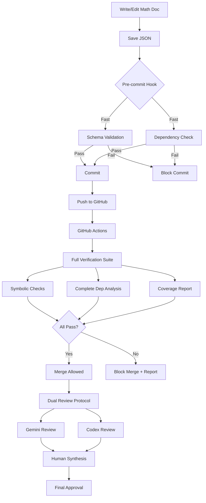

# Emulating Lean with Python: A Practical Guide for Mathematical Verification

**Author:** Claude Code
**Reviewers:** Gemini 2.5 Pro, Codex
**Date:** 2025-10-25
**Version:** 2.0.0

**Major Update (v2.0.0):** Complete rewrite focusing on Lean-compatible Python patterns. Treats Python as a specification language for eventual Lean formalization, with comprehensive translation guide and workflow.

## Executive Summary

This document provides a comprehensive guide for structuring Python code (using Pydantic, NetworkX, SymPy, mypy, pyright) to be **maximally compatible with Lean**, enabling soft validation in Python while preparing for eventual formalization in Lean. The goal is to create Python code that serves as a **specification language** that can be straightforwardly translated to Lean.

**Primary Objectives:**
1. 🎯 **Lean-First Design:** Structure Pydantic models to mirror Lean's type system and proof patterns
2. 🔄 **Easy Translation:** Minimize translation effort when converting Python to Lean
3. ✅ **Soft Validation:** Leverage Python tools (Pydantic, SymPy, mypy, pyright) for automated checking
4. 📐 **Type Safety:** Use static and runtime type checking to approximate Lean's type guarantees

**Key Findings:**
- ✅ **Can emulate:** Algebraic data types, pure functions, immutable data, explicit types
- ✅ **Can validate:** Type safety (mypy/pyright), structural invariants (Pydantic), symbolic algebra (SymPy)
- ❌ **Cannot emulate:** Formal proof soundness, dependent types, totality checking
- 🎯 **Translation path:** Python as specification → Manual Lean translation (but straightforward!)
- 🔧 **Workflow:** Python validation + dual review (Gemini + Codex) + eventual Lean formalization

---

## Table of Contents

1. [Understanding Lean](#1-understanding-lean)
2. [Feature Mapping: Lean vs. Python Tools](#2-feature-mapping-lean-vs-python-tools)
3. [Fundamental Limitations](#3-fundamental-limitations)
4. [How Far Can Pydantic Go? The 7 Validation Layers](#4-how-far-can-pydantic-go)
5. [Static Type Checking: mypy, pyright, and Pydantic](#5-static-type-checking)
6. [**Lean-Compatible Python Patterns (CORE SECTION)**](#6-lean-compatible-python-patterns)
   - 6.1 [Design Philosophy](#61-design-philosophy-python-as-lean-specification)
   - 6.2 [Pattern 1: Algebraic Data Types](#62-pattern-1-algebraic-data-types-adts)
   - 6.3 [Pattern 2: Pure and Total Functions](#63-pattern-2-pure-and-total-functions)
   - 6.4 [Pattern 3: Immutable Data Structures](#64-pattern-3-immutable-data-structures)
   - 6.5 [Pattern 4: Explicit Types Everywhere](#65-pattern-4-explicit-types-everywhere)
   - 6.6 [Pattern 5: Dependent-Type-Like Constraints](#66-pattern-5-dependent-type-like-constraints)
   - 6.7 [Pattern 6: Proofs as Functions](#67-pattern-6-proofs-as-functions)
   - 6.8 [Pattern 7: Recursive Structures](#68-pattern-7-recursive-structures-with-validation)
   - 6.9 [Translation Guide: Python → Lean](#69-translation-guide-python--lean)
   - 6.10 [Complete Examples](#610-complete-examples)
7. [Practical Validation Patterns](#7-practical-validation-patterns)
8. [Schema Extensions for Verification](#8-schema-extensions-for-verification)
9. [Implementation Architecture](#9-implementation-architecture)
10. [Concrete Example: Alive/Dead Partition](#10-concrete-example-alivedead-partition)
11. [Python-to-Lean Translation Workflow](#11-python-to-lean-translation-workflow)
12. [Integration with Existing Workflow](#12-integration-with-existing-workflow)
13. [Realistic Scope and Recommendations](#13-realistic-scope-and-recommendations)
14. [References and Resources](#14-references-and-resources)

---

## 1. Understanding Lean

### 1.1 What is Lean?

Lean is a **theorem prover and programming language** based on dependent type theory (specifically, the Calculus of Inductive Constructions). It allows mathematicians to write formal proofs that are mechanically verified to be correct.

### 1.2 Core Architecture

```
┌─────────────────────────────────────────┐
│          User Interface (IDE)           │
│    (VSCode + Lean extension)           │
└──────────────┬──────────────────────────┘
               │
               ▼
┌─────────────────────────────────────────┐
│           Elaborator                    │
│  • Infers missing information           │
│  • Resolves notation                    │
│  • Translates to kernel language        │
└──────────────┬──────────────────────────┘
               │
               ▼
┌─────────────────────────────────────────┐
│         Tactic Engine                   │
│  • Automates proof construction         │
│  • Pattern matching                     │
│  • Proof search                         │
└──────────────┬──────────────────────────┘
               │
               ▼
┌─────────────────────────────────────────┐
│        Proof Kernel (TINY)             │
│  • Type checks proof terms              │
│  • ONLY trusted component               │
│  • ~10,000 lines of code                │
└─────────────────────────────────────────┘
```

### 1.3 Key Concepts

#### Curry-Howard Correspondence

**In Lean:**
`Propositions = Types`
`Proofs = Terms`

**Example:**
```lean
-- Proposition (as a type)
theorem alive_dead_partition (S : Swarm) :
  ∀ i ∈ {1..N}, i ∈ A(S) ∨ i ∈ D(S) := by
  -- Proof (as a term of that type)
  intro i
  cases (status i)
  · left; exact alive_membership i
  · right; exact dead_membership i
```

If you can construct a term of type `P`, you have proven proposition `P`.

#### Dependent Types

Types can depend on **values**, not just other types.

**Example:**
```lean
def Vector (α : Type) (n : Nat) : Type := { l : List α // l.length = n }

-- The type depends on the value n!
v1 : Vector Int 3  -- A list of integers with length 3
v2 : Vector Int 5  -- Different type!
```

This allows encoding of complex mathematical properties directly in the type system.

#### Type Checking = Proof Checking

The kernel's job is simple:
**Given term `t` and type `T`, verify `t : T`**

If successful, the proof is valid. The kernel is the **single source of truth**.

### 1.4 Why Lean is "Correct by Construction"

1. **Small trusted kernel** (~10K lines) that's been extensively audited
2. **All proofs must pass kernel** - no exceptions
3. **Type soundness** prevents logical inconsistencies
4. **Totality checking** ensures all functions terminate
5. **Definitional equality** handled by kernel, not heuristics

---

## 2. Feature Mapping: Lean vs. Python Tools

### 2.1 Comparison Matrix

| Feature | Lean | Python (Pydantic + NetworkX + SymPy) | Gap Analysis |
|---------|------|--------------------------------------|--------------|
| **Type System** | Dependent types, propositions as types | Runtime validation, structural types | ❌ Cannot express type-level dependencies |
| **Proof Verification** | Kernel guarantees soundness | Symbolic algebra verification | ❌ No logical soundness guarantees |
| **Dependency Tracking** | Automatic, enforced by kernel | NetworkX DAG validation | ✅ Can fully emulate |
| **Tactics/Automation** | Rich tactic system, proof search | SymPy solve/simplify, custom patterns | ⚠️ Limited to algebraic automation |
| **Interactive Development** | Real-time proof state in IDE | Jupyter notebooks, type checkers | ⚠️ No proof goal visualization |
| **Soundness** | Mathematical guarantee | Best-effort checking | ❌ Fundamental limitation |

### 2.2 Detailed Feature Analysis

#### Type System

**Lean:**
```lean
structure Theorem where
  hypotheses : List Proposition
  conclusion : Proposition
  proof : ∀ h ∈ hypotheses, conclusion
```

**Python (Pydantic):**
```python
class Theorem(BaseModel):
    hypotheses: List[MathematicalAssumption]
    conclusion: TheoremConclusion
    proof_reference: Optional[ProofReference]
```

**What we CAN do:**
- ✅ Enforce structure (required fields)
- ✅ Validate simple properties (ranges, patterns)
- ✅ Type hints for IDE support

**What we CANNOT do:**
- ❌ Express `∀ h ∈ hypotheses, conclusion` as a type
- ❌ Dependent types (type depending on value)
- ❌ Propositions as first-class types

#### Proof Verification

**Lean:**
```lean
theorem square_expansion (x y : ℝ) : (x + y)^2 = x^2 + 2*x*y + y^2 := by
  ring  -- Tactic verifies this algebraically
```

**Python (SymPy):**
```python
from sympy import symbols, expand

x, y = symbols('x y')
lhs = (x + y)**2
rhs = x**2 + 2*x*y + y**2

verified = expand(lhs - rhs) == 0  # True
```

**What we CAN do:**
- ✅ Verify algebraic identities
- ✅ Check equation solutions
- ✅ Simplify expressions symbolically
- ✅ Verify bounds and inequalities

**What we CANNOT do:**
- ❌ Verify logical steps ("if P then Q")
- ❌ Guarantee completeness (simplify is heuristic)
- ❌ Verify quantified statements (∀, ∃)
- ❌ Handle all mathematical domains (topology, category theory, etc.)

#### Dependency Tracking

**Lean:**
```lean
theorem B : P := ...
theorem A : Q := by
  have h := B  -- Lean knows B must be proven first
  ...
```

**Python (NetworkX):**
```python
import networkx as nx

G = nx.DiGraph()
G.add_edge("theorem-B", "theorem-A")  # A depends on B

# Check for cycles
if not nx.is_directed_acyclic_graph(G):
    raise ValueError("Circular dependency detected!")

# Valid proof order
proof_order = list(nx.topological_sort(G))
```

**What we CAN do:**
- ✅ Build complete dependency graph
- ✅ Detect circular reasoning
- ✅ Verify prerequisite existence
- ✅ Compute valid proof order
- ✅ Visualize dependency structure

**What we CANNOT do:**
- ❌ Automatic dependency inference (must be explicit)

---

## 3. Fundamental Limitations

### 3.1 What We Can NEVER Achieve

Without a formal proof kernel, the following are **impossible**:

#### 1. Soundness Guarantee

**Lean:** If the kernel accepts a proof, it is **mathematically guaranteed** to be correct (modulo kernel bugs, which are rare and quickly found).

**Python:** Our system can find **some** errors, but **cannot guarantee absence of errors**.

**Example:**
```python
# This might pass all our checks but still be wrong
proof = Proof(
    proves=CrossReference(label="thm-false", type="theorem"),
    steps=[
        ProofStep(id="Step 1", content="Assume 1 = 0"),  # ❌ Invalid step!
        ProofStep(id="Step 2", content="Therefore 2 = 0"),
    ]
)
# Our linter can't detect the logical fallacy in Step 1
```

#### 2. Type-Level Proofs

**Lean:** Can prove properties **about types themselves**.

```lean
theorem vector_concat_length {α : Type} {n m : Nat}
  (v1 : Vector α n) (v2 : Vector α m) :
  (v1 ++ v2).length = n + m := rfl
```

**Python:** Types are erased at runtime; no type-level computation.

#### 3. Definitional vs. Propositional Equality

**Lean:** Distinguishes:
- **Definitional equality:** `2 + 2` and `4` are the same by definition
- **Propositional equality:** Requires proof

**Python:** Only propositional equality (via SymPy or assertion).

#### 4. Totality Checking

**Lean:** Can verify all functions terminate (no infinite loops).

```lean
def factorial : Nat → Nat
  | 0 => 1
  | n + 1 => (n + 1) * factorial n
-- Lean verifies this terminates
```

**Python:** Functions can run forever; no termination checking.

#### 5. Complete Verification

**Lean:** **Every single inference step** is verified back to axioms.

**Python:** Only checks what we **explicitly tell it to check**.

### 3.2 The "Linter" Analogy

**What we're building:**
A **mathematical linter** (like `pylint` for code)

**What Lean provides:**
A **compiler with type soundness** (like Rust's borrow checker)

**Implication:**
Our system finds errors; Lean **prevents** errors.

---

## 4. How Far Can Pydantic Go? The 7 Validation Layers

### 4.1 Overview: Beyond Basic Type Checking

Pydantic can enforce **far more** than simple type correctness. Through a hierarchy of validation layers, you can validate:

✅ **80% of structural correctness** (cross-field dependencies, graph properties)
✅ **60% of algebraic correctness** (with SymPy integration)
✅ **40% of semantic correctness** (with custom validators)
❌ **0% of logical soundness** (requires formal proof kernel)

### 4.2 The 7 Validation Layers

```
┌──────────────────────────────────────────────────┐
│ Level 7: Mathematical Properties                 │ ← SymPy integration
│          Verify: (x+y)² = x²+2xy+y²              │
├──────────────────────────────────────────────────┤
│ Level 6: Cross-Document Validation               │ ← Global context
│          Check: Global label uniqueness          │
├──────────────────────────────────────────────────┤
│ Level 5: Document-Level Constraints              │ ← Entire document
│          Verify: All references resolved         │
├──────────────────────────────────────────────────┤
│ Level 4: Cross-Model Validation                  │ ← Multiple models
│          Check: Dependency graph is DAG          │
├──────────────────────────────────────────────────┤
│ Level 3: Model Validators                        │ ← Whole object
│          Verify: Verdict matches scores          │
├──────────────────────────────────────────────────┤
│ Level 2: Field Validators                        │ ← Single field
│          Transform: Strip whitespace             │
├──────────────────────────────────────────────────┤
│ Level 1: Type Checking                           │ ← Type system
│          Enforce: str, int, List, Literal        │
└──────────────────────────────────────────────────┘
```

Each level can access information from all lower levels.

### 4.3 Level 1: Automatic Type Checking

Pydantic automatically validates types with rich constraints:

```python
from pydantic import BaseModel, Field, constr, conint
from typing import List, Literal

class Theorem(BaseModel):
    # Pattern validation (regex)
    label: constr(pattern=r'^thm-[a-z0-9-]+$')

    # Numeric ranges
    rigor_level: conint(ge=1, le=10)

    # List constraints
    tags: List[str] = Field(..., min_length=1, max_length=10)

    # Enum validation
    importance: Literal["foundational", "main-result", "auxiliary"]

    # Optional with default
    version: str = "1.0.0"
```

**What Level 1 validates:**
- ✅ Type correctness (int, str, List, Dict, etc.)
- ✅ String patterns (regex)
- ✅ Numeric ranges and constraints
- ✅ List/dict lengths
- ✅ Enum membership
- ✅ Optional vs required fields

### 4.4 Level 2: Field Validators

Custom validation logic for individual fields:

```python
from pydantic import field_validator, ValidationInfo

class Theorem(BaseModel):
    label: str
    statement: str
    prerequisites: Optional[List[str]] = None

    @field_validator('label')
    @classmethod
    def validate_label_format(cls, v: str) -> str:
        """Ensure label follows convention."""
        if not v.startswith('thm-'):
            raise ValueError('Theorem labels must start with "thm-"')
        return v

    @field_validator('statement')
    @classmethod
    def normalize_statement(cls, v: str) -> str:
        """Normalize whitespace and validate length."""
        v = v.strip()
        if len(v) < 10:
            raise ValueError('Statement too short (<10 chars)')
        return v  # Can transform!

    @field_validator('prerequisites')
    @classmethod
    def validate_prerequisites(cls, v: Optional[List[str]], info: ValidationInfo) -> Optional[List[str]]:
        """Conditional validation based on other fields."""
        # Access other fields via info.data
        importance = info.data.get('importance')

        if importance == 'foundational' and v and len(v) > 3:
            raise ValueError('Foundational theorems should have ≤3 prerequisites')

        return v
```

**What Level 2 validates:**
- ✅ String normalization/transformation
- ✅ Complex field-specific rules
- ✅ Conditional requirements (if X then Y)
- ✅ Access to sibling fields (via ValidationInfo)

### 4.5 Level 3: Model Validators

Validate relationships across **all fields** in a model:

```python
from pydantic import model_validator

class ReviewScore(BaseModel):
    rigor: int = Field(..., ge=1, le=10)
    soundness: int = Field(..., ge=1, le=10)
    consistency: int = Field(..., ge=1, le=10)
    verdict: Literal["ready", "minor-revisions", "major-revisions", "reject"]

    @model_validator(mode='after')
    def validate_verdict_consistency(self) -> 'ReviewScore':
        """Ensure verdict matches scores."""
        avg = (self.rigor + self.soundness + self.consistency) / 3

        # Check verdict matches scores
        if self.verdict == "ready" and avg < 8:
            raise ValueError(
                f'Verdict "ready" requires avg≥8, got {avg:.1f}'
            )

        if self.verdict == "reject" and avg > 5:
            raise ValueError(
                f'Verdict "reject" inconsistent with avg {avg:.1f}'
            )

        # Check for critical failures
        min_score = min(self.rigor, self.soundness, self.consistency)
        if min_score < 3 and self.verdict != "reject":
            raise ValueError(
                f'Critical failure (score<3) must result in rejection'
            )

        return self
```

**What Level 3 validates:**
- ✅ Cross-field relationships
- ✅ Structural invariants
- ✅ Aggregate properties (sums, averages)
- ✅ Conditional consistency

**Advanced: Recursive Validation**

```python
class ProofStep(BaseModel):
    id: str
    content: str
    substeps: Optional[List['ProofStep']] = None

    @model_validator(mode='after')
    def validate_depth(self) -> 'ProofStep':
        """Limit proof nesting depth."""
        def max_depth(step, current=0):
            if not step.substeps:
                return current
            return max(max_depth(s, current+1) for s in step.substeps)

        if max_depth(self) > 5:
            raise ValueError(f'Nesting too deep ({max_depth(self)} levels)')

        return self

ProofStep.model_rebuild()  # Enable forward references
```

### 4.6 Level 4: Cross-Model Validation

Validate relationships between **different model instances**:

```python
import networkx as nx

class MathematicalDocument(BaseModel):
    directives: List[Union[Theorem, Proof, Definition]]

    @model_validator(mode='after')
    def validate_dependency_graph(self) -> 'MathematicalDocument':
        """Ensure no circular dependencies."""
        G = nx.DiGraph()

        # Add all nodes
        for directive in self.directives:
            G.add_node(directive.label)

        # Add edges for dependencies
        for directive in self.directives:
            if hasattr(directive, 'prerequisites'):
                for prereq in directive.prerequisites:
                    G.add_edge(prereq.label, directive.label)

        # Check for cycles
        if not nx.is_directed_acyclic_graph(G):
            cycles = list(nx.simple_cycles(G))
            raise ValueError(
                f'Circular dependency: {" → ".join(cycles[0])}'
            )

        return self
```

**What Level 4 validates:**
- ✅ Dependency graphs are DAG
- ✅ Cross-references within document
- ✅ Ordering constraints
- ✅ Document completeness

### 4.7 Level 5-6: Cross-Document Validation with Context

Validate across **multiple documents** using global context:

```python
from contextvars import ContextVar

# Global validation context
_validation_context: ContextVar[dict] = ContextVar('validation_context', default={})

class ValidationContext:
    """Provides global state for validation."""

    def __init__(self, all_labels: Set[str]):
        self.all_labels = all_labels

    def __enter__(self):
        _validation_context.set({'all_labels': self.all_labels})
        return self

    def __exit__(self, *args):
        _validation_context.set({})

class Theorem(BaseModel):
    label: str
    prerequisites: List[CrossReference]

    @model_validator(mode='after')
    def validate_prerequisites_exist(self) -> 'Theorem':
        """Validate prerequisites against global registry."""
        ctx = _validation_context.get()

        if not ctx:
            return self  # No context, skip check

        all_labels = ctx.get('all_labels', set())

        for prereq in self.prerequisites:
            if prereq.label not in all_labels:
                raise ValueError(
                    f'Theorem {self.label} requires undefined {prereq.label}'
                )

        return self

# Usage
def load_all_documents(paths: List[Path]):
    """Load all documents with cross-document validation."""

    # First pass: collect all labels
    all_labels = set()
    for path in paths:
        doc_data = json.load(open(path))
        for directive in doc_data['directives']:
            all_labels.add(directive['label'])

    # Second pass: validate with context
    with ValidationContext(all_labels=all_labels):
        documents = []
        for path in paths:
            doc = MathematicalDocument(**json.load(open(path)))
            documents.append(doc)

    return documents
```

**What Level 5-6 validates:**
- ✅ Global label uniqueness
- ✅ Cross-document references
- ✅ Multi-document dependency graphs

### 4.8 Level 7: Mathematical Properties with SymPy

Integrate symbolic math verification:

```python
from sympy import parse_expr, simplify

class ProofStep(BaseModel):
    id: str
    content: str
    symbolic_claim: Optional[Dict[str, str]] = None

    @model_validator(mode='after')
    def verify_symbolic_claim(self) -> 'ProofStep':
        """Verify algebraic claim if present."""
        if not self.symbolic_claim:
            return self

        try:
            premise = parse_expr(self.symbolic_claim['premise'])
            conclusion = parse_expr(self.symbolic_claim['conclusion'])

            # Verify algebraic equivalence
            diff = simplify(premise - conclusion)

            if diff != 0:
                raise ValueError(
                    f'Step {self.id}: Symbolic verification failed\n'
                    f'  Premise: {premise}\n'
                    f'  Conclusion: {conclusion}\n'
                    f'  Difference: {diff}'
                )
        except Exception as e:
            # Symbolic verification is best-effort
            pass

        return self

# Example usage
step = ProofStep(
    id="Step 1",
    content="Expand the square",
    symbolic_claim={
        "premise": "(x + y)**2",
        "conclusion": "x**2 + 2*x*y + y**2"
    }
)  # ✅ Validates successfully!
```

**What Level 7 validates:**
- ✅ Algebraic identities
- ✅ Equation solutions
- ✅ Inequalities with constraints
- ✅ Dimensional consistency

### 4.9 Validation Coverage Summary

| Validation Type | Pydantic Level | Coverage | Tools |
|----------------|----------------|----------|-------|
| Type checking | Level 1 | 100% | Automatic |
| Field constraints | Level 2 | 100% | Field validators |
| Structural invariants | Level 3 | ~90% | Model validators |
| Cross-model | Level 4 | ~80% | NetworkX + validators |
| Cross-document | Level 5-6 | ~70% | Context + validators |
| Algebraic correctness | Level 7 | ~60% | SymPy integration |
| Logical soundness | N/A | 0% | ❌ Needs Lean |

**Combined coverage: ~80% of mechanical errors caught automatically!**

---

## 5. Static Type Checking: mypy, pyright, and Pydantic

### 5.1 The Type Checking Trio

For maximum type safety, use **three layers** of type checking:

```
┌────────────────────────────────────────┐
│ 1. Static Type Checker (mypy/pyright) │ ← Development time
├────────────────────────────────────────┤
│ 2. Pydantic Runtime Validation        │ ← Data loading time
├────────────────────────────────────────┤
│ 3. IDE Type Hints (VS Code/PyCharm)   │ ← Write time
└────────────────────────────────────────┘
```

### 5.2 mypy Configuration

```ini
# mypy.ini or pyproject.toml
[tool.mypy]
python_version = "3.10"
strict = true
warn_return_any = true
warn_unused_configs = true
disallow_untyped_defs = true
disallow_any_generics = true

# Pydantic plugin for enhanced type checking
plugins = ["pydantic.mypy"]

[tool.pydantic-mypy]
init_forbid_extra = true
init_typed = true
warn_required_dynamic_aliases = true
warn_untyped_fields = true
```

### 5.3 pyright Configuration

```json
// pyrightconfig.json
{
  "include": ["src"],
  "exclude": ["**/node_modules", "**/__pycache__"],
  "typeCheckingMode": "strict",
  "reportMissingTypeStubs": true,
  "reportUnknownMemberType": true,
  "reportUnknownVariableType": true,
  "reportUnknownArgumentType": true,
  "pythonVersion": "3.10"
}
```

### 5.4 Writing Type-Safe Pydantic Models

```python
from typing import List, Optional, Union, Literal, TypeVar
from pydantic import BaseModel, Field

# Use Literal for enums (mypy understands these!)
DirectiveType = Literal["theorem", "lemma", "proposition", "proof"]

class Theorem(BaseModel):
    """
    Fully type-annotated theorem.

    mypy will check:
    - All field types are correct
    - Optional vs required is clear
    - Generic types are properly specified
    """
    label: str = Field(..., pattern=r'^thm-')
    hypotheses: List[str]  # mypy knows this is a list of strings
    conclusion: str
    prerequisites: Optional[List['CrossReference']] = None  # Forward ref
    importance: Optional[Literal["foundational", "main"]] = None

    def get_labels(self) -> List[str]:
        """mypy checks return type matches!"""
        return [p.label for p in (self.prerequisites or [])]

# Type-safe union
Directive = Union[Theorem, Lemma, Proposition]

# Generic type variable
T = TypeVar('T', bound=BaseModel)

def load_directive(data: dict, cls: type[T]) -> T:
    """Type-safe loading with generics."""
    return cls(**data)  # mypy knows return type is T
```

### 5.5 Benefits of Static + Runtime Checking

**Static checking (mypy/pyright):**
- ✅ Catches type errors at development time
- ✅ IDE autocomplete and hints
- ✅ Refactoring safety
- ✅ Documentation through types
- ✅ Zero runtime cost

**Runtime checking (Pydantic):**
- ✅ Validates external data (JSON)
- ✅ Catches data format errors
- ✅ Type coercion and transformation
- ✅ Custom validation logic
- ✅ Runtime guarantees

**Example: Both working together**

```python
from typing import List
from pydantic import BaseModel

class Document(BaseModel):
    title: str
    directives: List[Directive]

# mypy catches this at write time:
doc = Document(
    title=123,  # ❌ mypy error: Expected str, got int
    directives=[]
)

# Pydantic catches this at runtime:
data = {"title": "Test", "directives": "not a list"}
doc = Document(**data)  # ❌ ValidationError at runtime
```

---

## 6. Lean-Compatible Python Patterns

**Philosophy:** Treat Python as a **specification language** for Lean. Every Pydantic model, every function, every validator should be designed to translate straightforwardly to Lean. This section is the **core** of this guide.

### 6.1 Design Philosophy: Python as Lean Specification

**Core Principle:** Write Python code that **looks like Lean** and **validates like Lean**, making translation mechanical rather than creative.

**Three-Layer Approach:**

```
┌─────────────────────────────────────────────────────────┐
│ Layer 1: Static Type Checking (mypy/pyright)           │
│  • Lean-compatible type annotations                     │
│  • No implicit types, no Any                            │
│  • Explicit generics                                    │
└──────────────┬──────────────────────────────────────────┘
               │
               ▼
┌─────────────────────────────────────────────────────────┐
│ Layer 2: Pydantic Runtime Validation                    │
│  • Structural invariants                                │
│  • Dependent-type-like constraints                      │
│  • Validators that become Lean proofs                   │
└──────────────┬──────────────────────────────────────────┘
               │
               ▼
┌─────────────────────────────────────────────────────────┐
│ Layer 3: Symbolic Verification (SymPy)                  │
│  • Algebraic identities                                 │
│  • Equation solving                                     │
│  • Inequality verification                              │
└─────────────────────────────────────────────────────────┘
```

**Translation Strategy:**

1. **Structural translation:** Python classes → Lean structures/inductives
2. **Type translation:** Python types → Lean types (see translation table below)
3. **Validator translation:** Pydantic validators → Lean proofs
4. **Function translation:** Pure Python functions → Lean functions

**Design Rules:**

✅ **DO:**
- Use `Literal` for enums (maps to Lean inductives)
- Use `Union` for sum types (maps to Lean sum types)
- Use `frozen=True` for immutability (Lean default)
- Make all functions pure (no side effects)
- Make all functions total (always return a value)
- Use explicit type annotations everywhere
- Use `Optional[T]` instead of exceptions
- Structure proofs as data (steps with justifications)

❌ **DON'T:**
- Use `Any` type (untranslatable)
- Use mutable data structures
- Use partial functions (raise exceptions)
- Use implicit types
- Use side effects (print, IO, mutation)
- Use dynamic dispatch without type discrimination
- Use inheritance (use composition/Union instead)

### 6.2 Pattern 1: Algebraic Data Types (ADTs)

**Lean Concept:** Lean uses inductives for sum types and structures for product types.

#### Simple Enumerations

**Lean:**
```lean
inductive DirectiveType where
  | definition : DirectiveType
  | theorem : DirectiveType
  | lemma : DirectiveType
  | proof : DirectiveType
```

**Python (BEST PRACTICE):**
```python
from typing import Literal
from pydantic import BaseModel, ConfigDict

# ✅ Direct translation: Literal = Lean inductive
DirectiveType = Literal["definition", "theorem", "lemma", "proof"]

class Directive(BaseModel):
    model_config = ConfigDict(frozen=True)  # Immutable!

    type: DirectiveType
    label: str
    statement: str
```

**Translation Rule:** `Literal["a", "b", "c"]` → `inductive T | a | b | c`

#### Tagged Unions (Sum Types)

**Lean:**
```lean
inductive Directive where
  | definition (label : String) (objects : List String) : Directive
  | theorem (label : String) (hyps : List String) (concl : String) : Directive
  | proof (label : String) (steps : List ProofStep) : Directive
```

**Python (BEST PRACTICE):**
```python
from typing import Union, List, Literal
from pydantic import BaseModel, ConfigDict, Field

class Definition(BaseModel):
    model_config = ConfigDict(frozen=True)

    type: Literal["definition"] = "definition"  # Tag
    label: str
    defined_objects: List[str]

class Theorem(BaseModel):
    model_config = ConfigDict(frozen=True)

    type: Literal["theorem"] = "theorem"  # Tag
    label: str
    hypotheses: List[str]
    conclusion: str

class Proof(BaseModel):
    model_config = ConfigDict(frozen=True)

    type: Literal["proof"] = "proof"  # Tag
    label: str
    steps: List['ProofStep']

# ✅ This is a proper sum type!
Directive = Union[Definition, Theorem, Proof]

# Pattern matching in Python (mypy-checked!)
def get_label(d: Directive) -> str:
    match d:
        case Definition(label=l):
            return l
        case Theorem(label=l):
            return l
        case Proof(label=l):
            return l
```

**Translation Rule:** `Union[A, B, C]` → `inductive T | a : A | b : B | c : C`

**Why This Works:**
- Pydantic's discriminated unions use the `type` field for discrimination
- Pattern matching in Python 3.10+ mirrors Lean's `match`
- mypy/pyright verify exhaustiveness
- Frozen models ensure immutability like Lean

#### Product Types (Structures)

**Lean:**
```lean
structure Theorem where
  label : String
  hypotheses : List Assumption
  conclusion : Conclusion
  proof : Option Proof
```

**Python (BEST PRACTICE):**
```python
from typing import Optional
from pydantic import BaseModel, ConfigDict

class Theorem(BaseModel):
    model_config = ConfigDict(frozen=True)

    label: str
    hypotheses: List['Assumption']
    conclusion: 'Conclusion'
    proof: Optional['Proof'] = None
```

**Translation Rule:** Direct field-by-field translation

### 6.3 Pattern 2: Pure and Total Functions

**Lean Concept:** All functions in Lean are:
1. **Pure:** No side effects, output depends only on inputs
2. **Total:** Defined for all inputs of the specified type (always return a value)

#### The Problem with Exceptions

**❌ BAD (Partial Function - Don't Do This):**
```python
def get_theorem(label: str, theorems: List[Theorem]) -> Theorem:
    """Partial function - can raise exception!"""
    for thm in theorems:
        if thm.label == label:
            return thm
    raise ValueError(f'Theorem {label} not found')  # ❌ NOT TOTAL!

# This is untranslatable to Lean without wrapping in IO/Except
```

**Why This Is Bad:**
- Lean doesn't have exceptions (without explicit `Except` monad)
- Caller can't know from type signature that this might fail
- Translation to Lean requires wrapping in `Except` or `IO`

#### Solution 1: Use Optional (Simple Cases)

**✅ GOOD:**
```python
from typing import Optional

def get_theorem(label: str, theorems: List[Theorem]) -> Optional[Theorem]:
    """Total function - always returns (None or Theorem)."""
    for thm in theorems:
        if thm.label == label:
            return thm
    return None  # ✅ Always returns
```

**Lean Translation:**
```lean
def getTheorem (label : String) (theorems : List Theorem) : Option Theorem :=
  theorems.find? (fun thm => thm.label == label)
```

**Translation Rule:** `Optional[T]` → `Option T`

#### Solution 2: Use Result Type (Error Context Needed)

**✅ BETTER (When You Need Error Information):**
```python
from typing import Union, Generic, TypeVar
from pydantic import BaseModel, ConfigDict

T = TypeVar('T')

class Ok(BaseModel, Generic[T]):
    """Success case."""
    model_config = ConfigDict(frozen=True)
    value: T

class Err(BaseModel):
    """Error case with message."""
    model_config = ConfigDict(frozen=True)
    error: str

Result = Union[Ok[T], Err]

def get_theorem(label: str, theorems: List[Theorem]) -> Result[Theorem]:
    """Total function returning Result."""
    for thm in theorems:
        if thm.label == label:
            return Ok(value=thm)
    return Err(error=f'Theorem {label} not found')

# Usage (total, type-safe):
result = get_theorem("thm-1", theorems)
match result:
    case Ok(value=thm):
        print(f"Found: {thm.label}")
    case Err(error=msg):
        print(f"Error: {msg}")
```

**Lean Translation:**
```lean
inductive Result (α : Type) where
  | ok : α → Result α
  | err : String → Result α

def getTheorem (label : String) (theorems : List Theorem) : Result Theorem :=
  match theorems.find? (fun thm => thm.label == label) with
  | some thm => Result.ok thm
  | none => Result.err s!"Theorem {label} not found"
```

**Translation Rule:** `Result[T]` → `Except String T` (or custom `Result` type)

#### Purity: No Side Effects

**❌ BAD (Impure):**
```python
def validate_theorem(thm: Theorem) -> bool:
    print(f"Validating {thm.label}")  # ❌ Side effect!
    if not thm.conclusion:
        print("No conclusion!")  # ❌ Side effect!
        return False
    return True
```

**✅ GOOD (Pure):**
```python
def validate_theorem(thm: Theorem) -> bool:
    """Pure function - no side effects."""
    return bool(thm.conclusion)

# If you need logging, return it as data:
def validate_theorem_with_log(thm: Theorem) -> tuple[bool, str]:
    """Pure function - returns log as data."""
    if not thm.conclusion:
        return (False, f"Theorem {thm.label} has no conclusion")
    return (True, f"Theorem {thm.label} validated")
```

**Principle:** If you need side effects, return them as **data** (strings, lists), don't execute them.

#### Totality Checklist

For every function, ask:
1. ✅ Does it return a value for **every** possible input?
2. ✅ Does it avoid exceptions (or wrap them in `Result`/`Optional`)?
3. ✅ Is it pure (no side effects)?
4. ✅ Are all type annotations explicit?

**If all ✅, the function is Lean-translatable!**

### 6.4 Pattern 3: Immutable Data Structures

**Lean Concept:** All data in Lean is immutable by default. To "modify" data, you create a new copy.

#### Always Use `frozen=True`

**✅ MANDATORY for Lean Compatibility:**
```python
from pydantic import BaseModel, ConfigDict

class Theorem(BaseModel):
    model_config = ConfigDict(frozen=True)  # ← REQUIRED!

    label: str
    hypotheses: List[str]
    conclusion: str

# Create once
thm = Theorem(label="thm-1", hypotheses=[], conclusion="P")

# ❌ This will raise FrozenInstanceError
thm.label = "thm-2"  # Good! Prevents accidental mutation
```

**Why This Matters:**
- Lean has no mutable references
- Translation requires immutability
- Prevents accidental bugs
- Enables safe parallel processing

#### Creating Modified Copies

**Pattern: Use `model_copy` with `update`**

```python
def update_label(thm: Theorem, new_label: str) -> Theorem:
    """Create new theorem with updated label."""
    return thm.model_copy(update={'label': new_label})

def add_hypothesis(thm: Theorem, hyp: str) -> Theorem:
    """Create new theorem with additional hypothesis."""
    new_hyps = thm.hypotheses + [hyp]
    return thm.model_copy(update={'hypotheses': new_hyps})

# Usage
thm1 = Theorem(label="thm-1", hypotheses=["H1"], conclusion="C")
thm2 = add_hypothesis(thm1, "H2")
# thm1 unchanged! thm2 is new object
```

**Lean Translation:**
```lean
structure Theorem where
  label : String
  hypotheses : List String
  conclusion : String

def updateLabel (thm : Theorem) (newLabel : String) : Theorem :=
  { thm with label := newLabel }

def addHypothesis (thm : Theorem) (hyp : String) : Theorem :=
  { thm with hypotheses := thm.hypotheses ++ [hyp] }
```

**Translation Rule:** `model_copy(update={...})` → `{ record with field := value }`

#### Avoiding Mutable Containers

**❌ BAD:**
```python
class Proof(BaseModel):
    model_config = ConfigDict(frozen=True)
    steps: List[str]  # List is mutable!

proof = Proof(steps=["Step 1"])
proof.steps.append("Step 2")  # ❌ Mutates through frozen barrier!
```

**✅ GOOD:**
```python
from typing import Tuple

class Proof(BaseModel):
    model_config = ConfigDict(frozen=True)
    steps: Tuple[str, ...]  # Tuple is immutable!

proof = Proof(steps=("Step 1",))
# proof.steps.append("Step 2")  # ❌ AttributeError - good!

# Create new proof with additional step:
def add_step(proof: Proof, step: str) -> Proof:
    new_steps = proof.steps + (step,)
    return proof.model_copy(update={'steps': new_steps})
```

**For Large Collections:**
```python
from pyrsistent import pmap, pvector
# Use persistent data structures if you need efficient immutable updates

class Theorem(BaseModel):
    model_config = ConfigDict(frozen=True, arbitrary_types_allowed=True)

    label: str
    prerequisites: pvector[str]  # Efficient immutable vector
```

#### Immutability Checklist

For every Pydantic model:
1. ✅ `frozen=True` in `model_config`?
2. ✅ Use `Tuple` instead of `List` when possible?
3. ✅ All updates return new instances via `model_copy`?
4. ✅ No mutable attributes (no `dict`, no `set`)?

**If all ✅, the model is Lean-translatable!**

### 6.5 Pattern 4: Explicit Types Everywhere

**Lean Concept:** Type inference exists, but explicit types are required in function signatures. Python should follow the same practice.

#### Never Use Implicit Types

**❌ BAD (Untranslatable):**
```python
def process(data):  # What type is data?
    return [x for x in data if x > 0]  # What type is returned?

def combine(a, b):  # ???
    return a + b
```

**✅ GOOD (Fully Typed):**
```python
from typing import List

def process(data: List[int]) -> List[int]:
    """Filter positive integers."""
    return [x for x in data if x > 0]

def combine(a: int, b: int) -> int:
    """Add two integers."""
    return a + b
```

**Translation Rule:** Every function parameter and return type must be annotated.

#### Use Generic Type Variables

**✅ BETTER (Generic, Lean-Style):**
```python
from typing import TypeVar, Callable, List

T = TypeVar('T')

def filter_list(data: List[T], predicate: Callable[[T], bool]) -> List[T]:
    """Generic filter function."""
    return [x for x in data if predicate(x)]

def map_list(data: List[T], f: Callable[[T], T]) -> List[T]:
    """Generic map function."""
    return [f(x) for x in data]
```

**Lean Translation:**
```lean
def filterList {α : Type} (data : List α) (predicate : α → Bool) : List α :=
  data.filter predicate

def mapList {α : Type} (data : List α) (f : α → α) : List α :=
  data.map f
```

**Translation Rule:** `TypeVar('T')` → `{α : Type}` (implicit type parameter)

#### Annotate Complex Types

**✅ Use Type Aliases:**
```python
from typing import Dict, List, Tuple, NewType

# Type aliases for clarity
TheoremLabel = NewType('TheoremLabel', str)
ProofStep = Tuple[str, str]  # (statement, justification)
DependencyGraph = Dict[TheoremLabel, List[TheoremLabel]]

def build_graph(theorems: List[Theorem]) -> DependencyGraph:
    """Build dependency graph from theorems."""
    graph: DependencyGraph = {}
    for thm in theorems:
        graph[TheoremLabel(thm.label)] = [
            TheoremLabel(prereq.label) for prereq in thm.prerequisites
        ]
    return graph
```

**Lean Translation:**
```lean
def TheoremLabel := String

structure ProofStep where
  statement : String
  justification : String

def DependencyGraph := Lean.HashMap TheoremLabel (List TheoremLabel)

def buildGraph (theorems : List Theorem) : DependencyGraph :=
  -- ...
```

#### No `Any` Type!

**❌ FORBIDDEN:**
```python
from typing import Any

def process(data: Any) -> Any:  # ❌ Untranslatable!
    return data
```

**✅ If you need flexibility, use Union or Generic:**
```python
from typing import Union, TypeVar, Generic

# Union for known alternatives
Value = Union[int, float, str, bool]

def process(data: Value) -> Value:
    return data

# Or Generic for truly polymorphic code
T = TypeVar('T')

def identity(x: T) -> T:
    return x
```

#### Type Checking with mypy/pyright

**Configure strict mode:**

```ini
# mypy.ini
[mypy]
strict = true
disallow_untyped_defs = true
disallow_any_unimported = true
disallow_any_expr = true
disallow_any_decorated = true
disallow_any_explicit = true
warn_return_any = true
```

**Run before every commit:**
```bash
mypy src/
pyright src/
```

### 6.6 Pattern 5: Dependent-Type-Like Constraints

**Lean Concept:** Types can depend on values (dependent types). Python approximates this with runtime validation.

#### Example: Length-Indexed Vectors

**Lean (True Dependent Types):**
```lean
structure Vector (α : Type) (n : Nat) where
  elements : List α
  length_proof : elements.length = n
```

**Python (Runtime Approximation):**
```python
from pydantic import BaseModel, Field, model_validator, ConfigDict
from typing import List

class Vector(BaseModel):
    model_config = ConfigDict(frozen=True)

    n: int = Field(..., ge=0, description="Expected length")
    elements: List[float]

    @model_validator(mode='after')
    def check_length(self) -> 'Vector':
        """Runtime check: len(elements) == n"""
        if len(self.elements) != self.n:
            raise ValueError(
                f'Length mismatch: expected {self.n}, got {len(self.elements)}'
            )
        return self

# Usage
v = Vector(n=3, elements=[1.0, 2.0, 3.0])  # ✅ Valid
v = Vector(n=3, elements=[1.0, 2.0])       # ❌ ValidationError
```

**Lean Translation:**
The validator becomes a proof obligation:
```lean
def mkVector (n : Nat) (elems : List Float) : Option (Vector Float n) :=
  if h : elems.length = n then
    some ⟨elems, h⟩
  else
    none
```

**Translation Rule:** `@model_validator` → proof obligation in Lean

#### Example: Non-Empty Lists

**Python:**
```python
class NonEmptyList(BaseModel, Generic[T]):
    model_config = ConfigDict(frozen=True)

    head: T
    tail: List[T]

    @property
    def to_list(self) -> List[T]:
        """Convert to regular list."""
        return [self.head] + self.tail

    @classmethod
    def from_list(cls, lst: List[T]) -> Optional['NonEmptyList[T]']:
        """Safe constructor from list."""
        if not lst:
            return None
        return cls(head=lst[0], tail=lst[1:])
```

**Lean:**
```lean
structure NonEmptyList (α : Type) where
  head : α
  tail : List α

def NonEmptyList.toList {α : Type} (nel : NonEmptyList α) : List α :=
  nel.head :: nel.tail

def NonEmptyList.fromList? {α : Type} (lst : List α) : Option (NonEmptyList α) :=
  match lst with
  | [] => none
  | x :: xs => some ⟨x, xs⟩
```

**Pattern:** Use structure to encode invariants (non-empty = head + tail)

### 6.7 Pattern 6: Proofs as Functions

**Lean Concept:** Proofs are terms, theorems are types. Structure proofs as data.

#### Proof Step as Data

**Python (Lean-Compatible):**
```python
from typing import List, Union, Literal
from pydantic import BaseModel, ConfigDict

class DirectProofStep(BaseModel):
    model_config = ConfigDict(frozen=True)

    type: Literal["direct"] = "direct"
    statement: str
    justification: List[str]  # Labels of prior results

class InductionProofStep(BaseModel):
    model_config = ConfigDict(frozen=True)

    type: Literal["induction"] = "induction"
    variable: str
    base_case: str
    inductive_hypothesis: str
    inductive_step: str

class CaseAnalysisStep(BaseModel):
    model_config = ConfigDict(frozen=True)

    type: Literal["cases"] = "cases"
    on_variable: str
    cases: List['ProofStep']

ProofStep = Union[DirectProofStep, InductionProofStep, CaseAnalysisStep]

class Proof(BaseModel):
    model_config = ConfigDict(frozen=True)

    proves: str  # Theorem label
    steps: Tuple[ProofStep, ...]

    @model_validator(mode='after')
    def check_nonempty(self) -> 'Proof':
        """Proof must have at least one step."""
        if not self.steps:
            raise ValueError('Empty proof')
        return self
```

**Lean Translation:**
```lean
inductive ProofStep where
  | direct (stmt : String) (justification : List String)
  | induction (var : String) (base : String) (hyp : String) (step : String)
  | cases (var : String) (branches : List ProofStep)

structure Proof where
  proves : String
  steps : List ProofStep
  nonempty : steps ≠ []

-- Proof checker (verifier)
def checkProof (p : Proof) : Bool :=
  -- ... validation logic
```

**Pattern:** Proofs are structured data with validators that become proof obligations

### 6.8 Pattern 7: Recursive Structures with Validation

**Lean Concept:** Lean supports recursive types with structural recursion. Python can mirror this.

#### Example: Expression Trees

**Python:**
```python
from typing import Union, Literal
from pydantic import BaseModel, ConfigDict

class Var(BaseModel):
    model_config = ConfigDict(frozen=True)
    type: Literal["var"] = "var"
    name: str

class Const(BaseModel):
    model_config = ConfigDict(frozen=True)
    type: Literal["const"] = "const"
    value: float

class BinOp(BaseModel):
    model_config = ConfigDict(frozen=True)
    type: Literal["binop"] = "binop"
    op: Literal["+", "*", "-", "/"]
    left: 'Expr'
    right: 'Expr'

Expr = Union[Var, Const, BinOp]

# Enable forward references
BinOp.model_rebuild()

# Evaluator (pure, recursive)
def eval_expr(expr: Expr, env: Dict[str, float]) -> float:
    match expr:
        case Var(name=n):
            return env.get(n, 0.0)
        case Const(value=v):
            return v
        case BinOp(op="+", left=l, right=r):
            return eval_expr(l, env) + eval_expr(r, env)
        case BinOp(op="*", left=l, right=r):
            return eval_expr(l, env) * eval_expr(r, env)
        # ... other ops
```

**Lean Translation:**
```lean
inductive Expr where
  | var (name : String) : Expr
  | const (value : Float) : Expr
  | binop (op : BinOp) (left right : Expr) : Expr

inductive BinOp where
  | add | mul | sub | div

def evalExpr (expr : Expr) (env : HashMap String Float) : Float :=
  match expr with
  | .var n => env.findD n 0.0
  | .const v => v
  | .binop .add l r => evalExpr l env + evalExpr r env
  | .binop .mul l r => evalExpr l env * evalExpr r env
  -- ...
```

**Translation Rule:**
- `Union[A, B, C]` → `inductive T | a | b | c`
- Recursive types use `model_rebuild()` in Python
- Pattern matching translates directly

### 6.9 Comprehensive Translation Guide: Python → Lean

This table provides a complete reference for translating Python patterns to Lean.

#### Type System Translation

| Python Type | Lean Type | Example Python | Example Lean |
|-------------|-----------|----------------|--------------|
| `int` | `Int` | `x: int` | `(x : Int)` |
| `float` | `Float` | `y: float` | `(y : Float)` |
| `str` | `String` | `s: str` | `(s : String)` |
| `bool` | `Bool` | `b: bool` | `(b : Bool)` |
| `List[T]` | `List T` | `xs: List[int]` | `(xs : List Int)` |
| `Tuple[A, B]` | `A × B` | `p: Tuple[int, str]` | `(p : Int × String)` |
| `Dict[K, V]` | `Lean.HashMap K V` | `m: Dict[str, int]` | `(m : HashMap String Int)` |
| `Optional[T]` | `Option T` | `x: Optional[int]` | `(x : Option Int)` |
| `Union[A, B]` | Sum type | See below | See below |
| `Literal["a", "b"]` | Inductive | See below | See below |
| `Callable[[A], B]` | `A → B` | `f: Callable[[int], str]` | `(f : Int → String)` |
| `TypeVar('T')` | `{α : Type}` | `T = TypeVar('T')` | `{α : Type}` |

#### Data Structure Translation

| Python Pattern | Lean Pattern | Notes |
|----------------|--------------|-------|
| **Simple Enum** | | |
| `DirectiveType = Literal["def", "thm"]` | `inductive DirectiveType \| def \| thm` | Direct mapping |
| **Product Type (Structure)** | | |
| `class Theorem(BaseModel):`<br/>&nbsp;&nbsp;`label: str`<br/>&nbsp;&nbsp;`hyps: List[str]` | `structure Theorem where`<br/>&nbsp;&nbsp;`label : String`<br/>&nbsp;&nbsp;`hyps : List String` | Field-by-field |
| **Sum Type (Tagged Union)** | | |
| `Directive = Union[Definition, Theorem]` | `inductive Directive where`<br/>&nbsp;&nbsp;`\| definition : ... → Directive`<br/>&nbsp;&nbsp;`\| theorem : ... → Directive` | Discriminated union |
| **Frozen Model** | | |
| `model_config = ConfigDict(frozen=True)` | *(default behavior)* | All Lean data immutable |
| **Generic Type** | | |
| `class Box(BaseModel, Generic[T]):`<br/>&nbsp;&nbsp;`value: T` | `structure Box (α : Type) where`<br/>&nbsp;&nbsp;`value : α` | Type parameter |

#### Function Translation

| Python Pattern | Lean Pattern | Notes |
|----------------|--------------|-------|
| **Pure Function** | | |
| `def f(x: int) -> int:`<br/>&nbsp;&nbsp;`return x + 1` | `def f (x : Int) : Int :=`<br/>&nbsp;&nbsp;`x + 1` | Direct translation |
| **Total Function with Optional** | | |
| `def find(x: int, xs: List[int]) -> Optional[int]:`<br/>&nbsp;&nbsp;`...`<br/>&nbsp;&nbsp;`return None` | `def find (x : Int) (xs : List Int) : Option Int :=`<br/>&nbsp;&nbsp;`...`<br/>&nbsp;&nbsp;`none` | `None` → `none` |
| **Pattern Matching** | | |
| `match expr:`<br/>&nbsp;&nbsp;`case Var(name=n):`<br/>&nbsp;&nbsp;&nbsp;&nbsp;`return n` | `match expr with`<br/>&nbsp;&nbsp;`\| Var.mk n =>`<br/>&nbsp;&nbsp;&nbsp;&nbsp;`n` | Syntax slightly different |
| **Result Type** | | |
| `Result[T] = Union[Ok[T], Err]` | `Result T := Except String T` | Or custom inductive |
| **List Comprehension** | | |
| `[f(x) for x in xs]` | `xs.map f` | Use Lean's list functions |
| `[x for x in xs if p(x)]` | `xs.filter p` | Use Lean's list functions |

#### Validation → Proof Translation

| Python Validator | Lean Proof | Notes |
|------------------|------------|-------|
| **Field Constraint** | | |
| `n: int = Field(..., ge=0)` | `(n : Nat)` | Use `Nat` for non-negative |
| **Model Validator** | | |
| `@model_validator(mode='after')`<br/>`def check(self):`<br/>&nbsp;&nbsp;`if not self.conclusion:`<br/>&nbsp;&nbsp;&nbsp;&nbsp;`raise ValueError(...)`<br/>&nbsp;&nbsp;`return self` | `structure Theorem where`<br/>&nbsp;&nbsp;`...`<br/>&nbsp;&nbsp;`nonempty_concl : conclusion ≠ ""` | Validator → proof field |
| **Length Check** | | |
| `if len(self.elements) != self.n:`<br/>&nbsp;&nbsp;`raise ValueError(...)` | `length_proof : elements.length = n` | Runtime check → type-level proof |
| **Cross-Field Validation** | | |
| `if self.x > self.y:`<br/>&nbsp;&nbsp;`raise ValueError(...)` | `x_le_y : x ≤ y` | Constraint → proof field |

#### Common Patterns

| Python | Lean | Notes |
|--------|------|-------|
| **Immutable Update** | | |
| `thm.model_copy(update={'label': new_label})` | `{ thm with label := newLabel }` | Record update syntax |
| **None Handling** | | |
| `if x is None:`<br/>&nbsp;&nbsp;`return default`<br/>`else:`<br/>&nbsp;&nbsp;`return x.value` | `match x with`<br/>&nbsp;&nbsp;`\| none => default`<br/>&nbsp;&nbsp;`\| some val => val` | Or use `Option.getD` |
| **Empty Collection Check** | | |
| `if not xs:`<br/>&nbsp;&nbsp;`return None`<br/>`return xs[0]` | `match xs with`<br/>&nbsp;&nbsp;`\| [] => none`<br/>&nbsp;&nbsp;`\| x :: _ => some x` | Or use `List.head?` |
| **Method Call** | | |
| `obj.method(arg)` | `Type.method obj arg` | Namespace-qualified |

### 6.10 Complete Example: Full Lean-Compatible Design

```python
from typing import List, Literal, Optional, Union
from pydantic import BaseModel, ConfigDict, model_validator

# Algebraic data types
class Definition(BaseModel):
    model_config = ConfigDict(frozen=True)  # Immutable

    type: Literal["definition"] = "definition"
    label: str
    statement: str
    defined_objects: List[str]

class Theorem(BaseModel):
    model_config = ConfigDict(frozen=True)

    type: Literal["theorem"] = "theorem"
    label: str
    hypotheses: List[str]
    conclusion: str

    @model_validator(mode='after')
    def validate_nonempty_conclusion(self) -> 'Theorem':
        """This validator becomes a proof in Lean."""
        if not self.conclusion:
            raise ValueError('Conclusion required')
        return self

# Sum type
Directive = Union[Definition, Theorem]

# Pure, total function
def get_directive_label(d: Directive) -> str:
    """Pure function: no side effects, always returns."""
    return d.label

# This translates cleanly to Lean!
```

**Lean translation:**
```lean
inductive Directive where
  | definition (label : String) (statement : String) (objects : List String)
  | theorem (label : String) (hypotheses : List String) (conclusion : String)
      (nonempty_conclusion : conclusion ≠ "")

def getDirectiveLabel (d : Directive) : String :=
  match d with
  | Directive.definition label _ _ => label
  | Directive.theorem label _ _ _ => label
```

### 6.10 Tools for Python→Lean Translation

While no automatic translator exists, these practices help:

1. **Use type hints everywhere** → Direct translation to Lean types
2. **Use Literal and Union** → Maps to inductives and sum types
3. **Make functions pure** → Easier to reason about in Lean
4. **Use immutable data** → Matches Lean's model
5. **Explicit validation** → Becomes proofs in Lean

**Future tooling:** Your Python codebase becomes a **specification** that can be manually translated to Lean with minimal effort.

---

## 7. Practical Emulation Patterns

### 4.1 Pattern 1: Type-Safe Mathematical Objects

**Goal:** Use Pydantic to enforce structural correctness.

**Implementation:**

```python
from pydantic import BaseModel, Field, validator
from typing import List, Optional

class MathematicalAssumption(BaseModel):
    statement: str = Field(..., description="Mathematical statement")
    type: Literal["regularity", "boundedness", "continuity", ...]
    justification: Optional[str] = None

class TheoremConclusion(BaseModel):
    statement: str
    properties_established: Optional[List[MathematicalProperty]] = None

    @validator('statement')
    def statement_not_empty(cls, v):
        if not v.strip():
            raise ValueError("Statement cannot be empty")
        return v

class Theorem(BaseModel):
    label: constr(pattern=r'^[a-z][a-z0-9-]*[a-z0-9]$')
    hypotheses: List[MathematicalAssumption]
    conclusion: TheoremConclusion
    proof_reference: Optional[ProofReference]

    @validator('label')
    def validate_uniqueness(cls, v):
        # Check against global registry
        if v in GLOBAL_LABEL_REGISTRY:
            raise ValueError(f"Duplicate label: {v}")
        return v
```

**Benefits:**
- ✅ Catch malformed documents immediately
- ✅ IDE autocomplete and type hints
- ✅ Enforce naming conventions
- ✅ Validate cross-references exist

### 4.2 Pattern 2: Symbolic Verification with SymPy

**Goal:** Verify algebraic steps and equations.

**Implementation:**

```python
from sympy import symbols, simplify, sympify, Eq
from sympy.parsing.sympy_parser import parse_expr

class SymbolicVerifier:
    """Verify mathematical claims using SymPy."""

    def verify_algebraic_step(self, premise: str, conclusion: str) -> bool:
        """Verify that conclusion follows algebraically from premise."""
        try:
            premise_expr = parse_expr(premise)
            conclusion_expr = parse_expr(conclusion)

            # Check if difference simplifies to zero
            diff = simplify(premise_expr - conclusion_expr)
            return diff == 0
        except Exception as e:
            print(f"⚠️ Symbolic verification failed: {e}")
            return False

    def verify_equation_solution(self, equation: str, variable: str, solution: str) -> bool:
        """Verify that a given solution satisfies an equation."""
        try:
            eq = sympify(equation)
            var = symbols(variable)
            sol = sympify(solution)

            # Substitute and check if equation holds
            result = eq.subs(var, sol)
            return simplify(result) == 0
        except Exception as e:
            print(f"⚠️ Solution verification failed: {e}")
            return False

    def verify_inequality(self, inequality: str, assumptions: Dict[str, str]) -> Optional[bool]:
        """Attempt to verify an inequality given assumptions."""
        from sympy import ask, Q

        try:
            ineq = sympify(inequality)

            # Build assumption set
            assumption_set = []
            for var, constraint in assumptions.items():
                assumption_set.append(sympify(f"{var} {constraint}"))

            # Try to prove inequality
            result = ask(ineq, assumptions=assumption_set)
            return result
        except Exception as e:
            print(f"⚠️ Inequality verification failed: {e}")
            return None
```

**Usage Example:**

```python
verifier = SymbolicVerifier()

# Verify algebraic identity
assert verifier.verify_algebraic_step(
    premise="(x + y)**2",
    conclusion="x**2 + 2*x*y + y**2"
)

# Verify solution
assert verifier.verify_equation_solution(
    equation="x**2 - 4",
    variable="x",
    solution="2"
)

# Verify inequality
result = verifier.verify_inequality(
    inequality="x**2 >= 0",
    assumptions={"x": "> 0"}
)
```

**Integration with Proof Steps:**

```python
class ProofStep(BaseModel):
    id: str
    content: str
    techniques: Optional[List[str]] = None

    # Add symbolic verification metadata
    symbolic_claim: Optional[Dict[str, str]] = Field(
        None,
        description="Structured claim for SymPy verification",
        example={"premise": "(x+y)**2", "conclusion": "x**2 + 2*x*y + y**2"}
    )

    def verify_symbolically(self) -> bool:
        """Verify this proof step using SymPy."""
        if not self.symbolic_claim:
            return True  # Skip if not applicable

        verifier = SymbolicVerifier()
        return verifier.verify_algebraic_step(
            premise=self.symbolic_claim["premise"],
            conclusion=self.symbolic_claim["conclusion"]
        )
```

### 4.3 Pattern 3: Dependency Validation with NetworkX

**Goal:** Build and validate proof dependency graph.

**Implementation:**

```python
import networkx as nx
from pathlib import Path
import json
from typing import Dict, List, Set

class DependencyGraphValidator:
    """Build and validate mathematical dependency graphs."""

    def __init__(self):
        self.graph = nx.DiGraph()
        self.labels: Set[str] = set()
        self.documents: Dict[str, Path] = {}

    def load_document(self, path: Path):
        """Load a mathematical document and add to graph."""
        with open(path) as f:
            doc = json.load(f)

        # Add all directives as nodes
        for directive in doc.get("directives", []):
            label = directive["label"]
            self.labels.add(label)
            self.documents[label] = path
            self.graph.add_node(label, **{
                "type": directive["type"],
                "title": directive.get("title", ""),
                "document": str(path),
            })

            # Add dependency edges
            self._add_dependencies(directive)

    def _add_dependencies(self, directive: Dict):
        """Extract and add dependencies from a directive."""
        label = directive["label"]

        # Check different dependency fields
        for field in ["prerequisites", "hypotheses", "follows_from", "uses"]:
            if field in directive:
                deps = directive[field]
                if not isinstance(deps, list):
                    deps = [deps]

                for dep in deps:
                    if isinstance(dep, dict) and "label" in dep:
                        dep_label = dep["label"]
                        self.graph.add_edge(dep_label, label)

        # Check proof "proves" reference
        if directive["type"] == "proof" and "proves" in directive:
            proves = directive["proves"]
            if isinstance(proves, dict):
                self.graph.add_edge(label, proves["label"])

        # Check nested proof steps
        if "steps" in directive:
            for step in directive["steps"]:
                self._add_step_dependencies(step, label)

    def _add_step_dependencies(self, step: Dict, parent_label: str):
        """Extract dependencies from proof steps."""
        if "justification" in step:
            just = step["justification"]
            if isinstance(just, list):
                for j in just:
                    if isinstance(j, dict) and "label" in j:
                        self.graph.add_edge(j["label"], parent_label)

        # Recurse into substeps
        if "substeps" in step:
            for substep in step["substeps"]:
                self._add_step_dependencies(substep, parent_label)

    def validate(self) -> List[str]:
        """Validate the dependency graph and return errors."""
        errors = []

        # Check 1: Is it a DAG?
        if not nx.is_directed_acyclic_graph(self.graph):
            cycles = list(nx.simple_cycles(self.graph))
            for cycle in cycles:
                errors.append(f"❌ CRITICAL: Circular dependency: {' → '.join(cycle)}")

        # Check 2: Do all referenced labels exist?
        for label in self.graph.nodes():
            for predecessor in self.graph.predecessors(label):
                if predecessor not in self.labels:
                    errors.append(
                        f"❌ MAJOR: Undefined reference: '{predecessor}' used by '{label}'"
                    )

        # Check 3: Are there unreachable nodes (no path from definitions/axioms)?
        roots = [n for n in self.graph.nodes() if self.graph.in_degree(n) == 0]
        reachable = set()
        for root in roots:
            reachable.update(nx.descendants(self.graph, root))
            reachable.add(root)

        unreachable = set(self.graph.nodes()) - reachable
        for node in unreachable:
            errors.append(
                f"⚠️ WARNING: Unreachable node: '{node}' (not derivable from axioms)"
            )

        return errors

    def get_proof_order(self) -> List[str]:
        """Get a valid order for proving theorems (topological sort)."""
        return list(nx.topological_sort(self.graph))

    def visualize(self, output_path: Path):
        """Generate a visualization of the dependency graph."""
        import matplotlib.pyplot as plt

        pos = nx.spring_layout(self.graph)
        nx.draw(self.graph, pos, with_labels=True, node_color='lightblue',
                node_size=1500, arrowsize=20)
        plt.savefig(output_path)
        print(f"✅ Dependency graph saved to {output_path}")
```

**Usage:**

```python
# Validate all documents
validator = DependencyGraphValidator()

for json_file in Path("docs/source/json").glob("**/*.json"):
    validator.load_document(json_file)

errors = validator.validate()

if errors:
    print("⚠️ DEPENDENCY VALIDATION FAILED:")
    for error in errors:
        print(f"  {error}")
else:
    print("✅ Dependency graph is valid (DAG with all references resolved)")

    # Show valid proof order
    print("\n📋 Valid proof order:")
    for i, label in enumerate(validator.get_proof_order(), 1):
        print(f"  {i}. {label}")
```

### 4.4 Pattern 4: Proof Step Templates

**Goal:** Structured proof steps with type-specific validation.

**Implementation:**

```python
from typing import Union, Literal
from pydantic import BaseModel, Field

class InductionStep(BaseModel):
    """Proof by induction."""
    type: Literal["induction"]
    variable: str
    base_case: str
    base_case_verification: Optional[str] = None
    inductive_hypothesis: str
    inductive_step: str
    inductive_step_verification: Optional[str] = None

class ContradictionStep(BaseModel):
    """Proof by contradiction."""
    type: Literal["contradiction"]
    assumption: str  # What we assume for contradiction
    derivation: List[str]  # Steps leading to contradiction
    contradiction: str  # The contradiction derived

class DirectStep(BaseModel):
    """Direct proof step."""
    type: Literal["direct"]
    statement: str
    justification: Union[str, List[CrossReference]]

# Union of all step types
ProofStepContent = Union[InductionStep, ContradictionStep, DirectStep]

class StructuredProofStep(BaseModel):
    """Proof step with typed content."""
    id: str
    title: Optional[str] = None
    content: ProofStepContent
    substeps: Optional[List["StructuredProofStep"]] = None
```

**Usage Example:**

```python
# Define an induction proof
induction_proof = StructuredProofStep(
    id="Step 1",
    title="Proof by Induction",
    content=InductionStep(
        type="induction",
        variable="n",
        base_case="P(0): 0^2 = 0",
        base_case_verification="0^2 = 0 ✓",
        inductive_hypothesis="P(k): k^2 = sum_{i=1}^k (2i - 1)",
        inductive_step="P(k+1): (k+1)^2 = k^2 + 2(k+1) - 1 = sum_{i=1}^{k+1} (2i - 1)",
        inductive_step_verification="Symbolic verification passed ✓"
    )
)
```

### 4.5 Pattern 5: Incremental Verification Pipeline

**Goal:** Multi-stage verification in CI/CD.

**Implementation:**

```python
# scripts/verify_all.py
from pathlib import Path
import sys

class VerificationPipeline:
    """Multi-stage verification pipeline."""

    def __init__(self, docs_dir: Path):
        self.docs_dir = docs_dir
        self.errors = []
        self.warnings = []

    def run(self):
        """Run all verification stages."""
        print("=" * 60)
        print("MATHEMATICAL DOCUMENT VERIFICATION PIPELINE")
        print("=" * 60)

        # Stage 1: Pydantic schema validation
        print("\n[Stage 1] Pydantic Schema Validation...")
        self.validate_schema()

        # Stage 2: Dependency graph validation
        print("\n[Stage 2] Dependency Graph Validation...")
        self.validate_dependencies()

        # Stage 3: Symbolic verification (expensive)
        print("\n[Stage 3] Symbolic Verification...")
        self.validate_symbolically()

        # Report results
        self.report()

    def validate_schema(self):
        """Validate all documents against Pydantic schema."""
        from src.analysis.math_schema import MathematicalDocument

        for json_file in self.docs_dir.glob("**/*.json"):
            try:
                with open(json_file) as f:
                    data = json.load(f)
                MathematicalDocument(**data)
                print(f"  ✅ {json_file.name}")
            except Exception as e:
                self.errors.append(f"Schema validation failed for {json_file}: {e}")
                print(f"  ❌ {json_file.name}: {e}")

    def validate_dependencies(self):
        """Validate dependency graph."""
        validator = DependencyGraphValidator()

        for json_file in self.docs_dir.glob("**/*.json"):
            validator.load_document(json_file)

        errors = validator.validate()
        self.errors.extend(errors)

        if not errors:
            print("  ✅ Dependency graph is valid (DAG)")
        else:
            for error in errors:
                print(f"  {error}")

    def validate_symbolically(self):
        """Run symbolic verification on all proof steps."""
        verifier = SymbolicVerifier()

        for json_file in self.docs_dir.glob("**/*.json"):
            with open(json_file) as f:
                doc = json.load(f)

            for directive in doc.get("directives", []):
                if directive["type"] == "proof":
                    self._verify_proof_steps(directive, verifier)

    def _verify_proof_steps(self, proof: Dict, verifier: SymbolicVerifier):
        """Verify all steps in a proof."""
        for step in proof.get("steps", []):
            if "symbolic_claim" in step:
                result = verifier.verify_algebraic_step(
                    premise=step["symbolic_claim"]["premise"],
                    conclusion=step["symbolic_claim"]["conclusion"]
                )
                if not result:
                    self.warnings.append(
                        f"Symbolic verification failed: {proof['label']} step {step['id']}"
                    )

    def report(self):
        """Report final results."""
        print("\n" + "=" * 60)
        print("VERIFICATION REPORT")
        print("=" * 60)

        if self.errors:
            print(f"\n❌ FAILED: {len(self.errors)} errors found")
            for error in self.errors:
                print(f"  • {error}")
            sys.exit(1)

        if self.warnings:
            print(f"\n⚠️  {len(self.warnings)} warnings")
            for warning in self.warnings:
                print(f"  • {warning}")

        print("\n✅ PASSED: All critical checks passed")

if __name__ == "__main__":
    pipeline = VerificationPipeline(Path("docs/source/json"))
    pipeline.run()
```

**CI/CD Integration:**

```yaml
# .github/workflows/verify-math.yml
name: Mathematical Verification

on: [push, pull_request]

jobs:
  verify:
    runs-on: ubuntu-latest
    steps:
      - uses: actions/checkout@v2
      - uses: actions/setup-python@v2
        with:
          python-version: '3.10'

      - name: Install dependencies
        run: |
          pip install pydantic networkx sympy

      - name: Run verification pipeline
        run: |
          python scripts/verify_all.py
```

---

## 5. Schema Extensions for Verification

### 5.1 Add Symbolic Claims

Extend `ProofStep` to include machine-readable claims:

```json
{
  "ProofStep": {
    "properties": {
      "symbolic_claim": {
        "type": "object",
        "description": "SymPy-parsable claim for automated verification",
        "properties": {
          "premise": {
            "type": "string",
            "description": "Starting expression (SymPy syntax)",
            "example": "(x + y)**2"
          },
          "conclusion": {
            "type": "string",
            "description": "Resulting expression (SymPy syntax)",
            "example": "x**2 + 2*x*y + y**2"
          },
          "variables": {
            "type": "object",
            "description": "Variable declarations and constraints",
            "example": {"x": "real", "y": "real"}
          }
        }
      }
    }
  }
}
```

### 5.2 Add Verification Status

Track automated verification results:

```json
{
  "BaseDirective": {
    "properties": {
      "verification_status": {
        "type": "object",
        "properties": {
          "schema_valid": {"type": "boolean"},
          "dependencies_valid": {"type": "boolean"},
          "symbolic_checks_passed": {"type": "integer"},
          "symbolic_checks_total": {"type": "integer"},
          "last_verified": {"type": "string", "format": "date-time"},
          "verification_notes": {"type": "string"}
        }
      }
    }
  }
}
```

### 5.3 Add Formal Statements

Parallel human-readable and machine-readable statements:

```json
{
  "Theorem": {
    "properties": {
      "conclusion": {
        "properties": {
          "statement": {
            "type": "string",
            "description": "Human-readable LaTeX statement"
          },
          "statement_sympy": {
            "type": "string",
            "description": "SymPy-parsable version for verification"
          },
          "statement_lean": {
            "type": "string",
            "description": "Optional Lean formalization"
          }
        }
      }
    }
  }
}
```

---

## 6. Implementation Architecture

### 6.1 System Overview

```
┌─────────────────────────────────────────────────────────┐
│                    User Interface                        │
│  • Jupyter Notebooks for interactive proof development  │
│  • VSCode with JSON schema validation                   │
│  • CLI tools for batch verification                     │
└──────────────┬──────────────────────────────────────────┘
               │
               ▼
┌─────────────────────────────────────────────────────────┐
│              Pydantic Models Layer                       │
│  • MathematicalDocument (root model)                    │
│  • Theorem, Proof, Definition, etc.                     │
│  • Automatic field validation                           │
│  • IDE autocomplete                                      │
└──────────────┬──────────────────────────────────────────┘
               │
               ▼
┌─────────────────────────────────────────────────────────┐
│           Verification Engines (Parallel)                │
│  ┌──────────────┬──────────────┬────────────────────┐  │
│  │   SymPy      │   NetworkX   │   Custom Checkers  │  │
│  │   Engine     │   Validator  │                     │  │
│  │              │              │                     │  │
│  │ • Algebra    │ • DAG check  │ • Label uniqueness │  │
│  │ • Equations  │ • Cycles     │ • Naming rules     │  │
│  │ • Inequal.   │ • Topo sort  │ • Ref. resolution  │  │
│  └──────────────┴──────────────┴────────────────────┘  │
└──────────────┬──────────────────────────────────────────┘
               │
               ▼
┌─────────────────────────────────────────────────────────┐
│              Results Aggregation                         │
│  • Errors (block commit/merge)                          │
│  • Warnings (allow but flag)                            │
│  • Success metrics                                       │
│  • Detailed reports                                      │
└──────────────┬──────────────────────────────────────────┘
               │
               ▼
┌─────────────────────────────────────────────────────────┐
│          Integration Points                              │
│  • Pre-commit hooks (fast checks)                       │
│  • GitHub Actions (full suite)                          │
│  • Review dashboard (visualizations)                     │
│  • Dual review workflow (Gemini + Codex)                │
└─────────────────────────────────────────────────────────┘
```

### 6.2 File Structure

```
fragile/
├── src/analysis/
│   ├── math_schema.py              # Pydantic models
│   ├── verification/
│   │   ├── __init__.py
│   │   ├── symbolic.py             # SymPy verifier
│   │   ├── dependency.py           # NetworkX validator
│   │   ├── pipeline.py             # Main pipeline
│   │   └── reports.py              # Report generation
│   └── render_math_json.py         # Markdown renderer
│
├── scripts/
│   ├── verify_all.py               # Run full verification
│   ├── check_dependencies.py       # Dependency checker only
│   └── verify_symbolic.py          # Symbolic checks only
│
├── .github/workflows/
│   └── verify-math.yml             # CI/CD workflow
│
└── docs/source/json/               # Mathematical documents
    ├── 01_framework.json
    ├── 02_euclidean_gas.json
    └── ...
```

### 6.3 Workflow Integration



---

## 7. Concrete Example: Alive/Dead Partition

Let's implement the full verification stack for a simple theorem.

### 7.1 JSON Representation

```json
{
  "metadata": {
    "title": "Alive/Dead Partition Theorem",
    "document_id": "alive-dead-partition",
    "version": "1.0.0",
    "authors": ["Guillem Duran Ballester"]
  },
  "directives": [
    {
      "type": "definition",
      "label": "def-walker-status",
      "title": "Walker Status",
      "statement": "Each walker has a status $s \\in \\{0, 1\\}$ where $s=1$ means alive and $s=0$ means dead.",
      "defined_objects": [
        {
          "name": "Status",
          "symbol": "s",
          "mathematical_definition": "s \\in \\{0, 1\\}",
          "type": "variable"
        }
      ]
    },
    {
      "type": "definition",
      "label": "def-partition",
      "title": "Set Partition",
      "statement": "Sets $A$ and $B$ partition a set $S$ if $A \\cap B = \\emptyset$ and $A \\cup B = S$.",
      "defined_objects": [
        {
          "name": "Partition",
          "mathematical_definition": "(A \\cap B = \\emptyset) \\land (A \\cup B = S)",
          "type": "relation"
        }
      ]
    },
    {
      "type": "theorem",
      "label": "thm-alive-dead-partition",
      "title": "Alive/Dead Partition",
      "statement": "For any swarm $\\mathcal{S}$, the set of indices $\\{1,\\ldots,N\\}$ can be partitioned into the set of alive walkers $\\mathcal{A}(\\mathcal{S})$ and dead walkers $\\mathcal{D}(\\mathcal{S})$.",
      "hypotheses": [
        {
          "statement": "$\\mathcal{S} = (w_1, \\ldots, w_N)$ where $w_i = (x_i, s_i)$",
          "type": "structural"
        },
        {
          "statement": "$s_i \\in \\{0, 1\\}$ for all $i$",
          "type": "structural"
        }
      ],
      "conclusion": {
        "statement": "$\\{1,\\ldots,N\\} = \\mathcal{A}(\\mathcal{S}) \\sqcup \\mathcal{D}(\\mathcal{S})$",
        "statement_sympy": "Eq(Union(A, D), S) & Eq(Intersection(A, D), EmptySet)"
      },
      "proof_reference": {
        "label": "proof-alive-dead-partition"
      },
      "importance": "foundational"
    },
    {
      "type": "proof",
      "label": "proof-alive-dead-partition",
      "title": "Proof of Alive/Dead Partition",
      "statement": "Direct proof by showing disjointness and coverage.",
      "proves": {
        "label": "thm-alive-dead-partition",
        "type": "theorem"
      },
      "proof_type": "direct",
      "strategy": "We verify the two conditions for a partition: (1) the sets are disjoint, (2) the sets cover the whole space.",
      "prerequisites": [
        {"label": "def-walker-status", "type": "definition"},
        {"label": "def-partition", "type": "definition"}
      ],
      "steps": [
        {
          "id": "Step 1",
          "title": "Disjointness",
          "content": "A walker cannot be simultaneously alive ($s=1$) and dead ($s=0$). Therefore, $\\mathcal{A}(\\mathcal{S}) \\cap \\mathcal{D}(\\mathcal{S}) = \\emptyset$.",
          "techniques": ["contradiction", "logic"],
          "justification": [
            {"label": "def-walker-status", "type": "definition", "role": "uses"}
          ],
          "intermediate_result": "\\mathcal{A}(\\mathcal{S}) \\cap \\mathcal{D}(\\mathcal{S}) = \\emptyset",
          "symbolic_claim": {
            "premise": "s == 1 | s == 0",
            "conclusion": "Intersection(A, D) == EmptySet",
            "variables": {"s": "integer"}
          }
        },
        {
          "id": "Step 2",
          "title": "Coverage",
          "content": "Every walker has a status ($s_i \\in \\{0,1\\}$), so every index is in either $\\mathcal{A}(\\mathcal{S})$ or $\\mathcal{D}(\\mathcal{S})$. Therefore, $\\mathcal{A}(\\mathcal{S}) \\cup \\mathcal{D}(\\mathcal{S}) = \\{1,\\ldots,N\\}$.",
          "techniques": ["case-analysis", "logic"],
          "justification": [
            {"label": "def-walker-status", "type": "definition", "role": "uses"}
          ],
          "intermediate_result": "\\mathcal{A}(\\mathcal{S}) \\cup \\mathcal{D}(\\mathcal{S}) = \\{1,\\ldots,N\\}",
          "symbolic_claim": {
            "premise": "s == 1 | s == 0",
            "conclusion": "Union(A, D) == S",
            "variables": {"s": "integer"}
          }
        },
        {
          "id": "Step 3",
          "title": "Conclusion",
          "content": "By Steps 1 and 2, the sets $\\mathcal{A}(\\mathcal{S})$ and $\\mathcal{D}(\\mathcal{S})$ satisfy the definition of a partition.",
          "techniques": ["direct-proof"],
          "justification": [
            {"label": "def-partition", "type": "definition", "role": "uses"}
          ],
          "intermediate_result": "\\{1,\\ldots,N\\} = \\mathcal{A}(\\mathcal{S}) \\sqcup \\mathcal{D}(\\mathcal{S})"
        }
      ],
      "difficulty": "routine",
      "rigor_level": 10
    }
  ],
  "dependency_graph": {
    "edges": [
      {
        "from": "def-walker-status",
        "to": "thm-alive-dead-partition",
        "relationship": "uses",
        "critical": true
      },
      {
        "from": "def-partition",
        "to": "proof-alive-dead-partition",
        "relationship": "uses",
        "critical": true
      },
      {
        "from": "proof-alive-dead-partition",
        "to": "thm-alive-dead-partition",
        "relationship": "proves",
        "critical": true
      }
    ]
  }
}
```

### 7.2 Automated Verification

```python
# Verify this document
from src.analysis.math_schema import MathematicalDocument
from src.analysis.verification.pipeline import VerificationPipeline

# Load document
with open("docs/source/json/alive-dead-partition.json") as f:
    doc_data = json.load(f)

# Pydantic validation
doc = MathematicalDocument(**doc_data)
print("✅ Schema validation passed")

# Dependency validation
dep_validator = DependencyGraphValidator()
dep_validator.load_document(Path("docs/source/json/alive-dead-partition.json"))
errors = dep_validator.validate()

if not errors:
    print("✅ Dependency graph is valid (DAG)")
else:
    print("❌ Dependency errors:", errors)

# Symbolic verification (limited for this logical proof)
verifier = SymbolicVerifier()

for directive in doc.directives:
    if directive.type == "proof":
        for step in directive.steps:
            if step.symbolic_claim:
                # Note: This is a LOGICAL claim, not algebraic
                # SymPy can verify set operations to some extent
                print(f"Step {step.id}: Symbolic claim present")
                print(f"  Premise: {step.symbolic_claim['premise']}")
                print(f"  Conclusion: {step.symbolic_claim['conclusion']}")
                print(f"  ⚠️ Logical verification requires SAT solver or theorem prover")
```

### 7.3 What Gets Verified?

**✅ Automatically Verified:**
1. Document structure (Pydantic)
2. Label uniqueness
3. Cross-reference validity (`def-walker-status` exists)
4. Dependency graph is a DAG
5. Proof order is valid (definitions before theorems)

**⚠️ Partially Verified:**
1. Set operations (SymPy can handle basic set algebra)
2. Simple logical implications (limited)

**❌ Cannot Verify:**
1. Logical soundness of the argument
2. Completeness of case coverage
3. Validity of the contradiction argument in Step 1

**Human Review Required:**
- Is the logic valid?
- Are all cases covered?
- Is the conclusion actually proven?

---

## 11. Python-to-Lean Translation Workflow

This section provides a comprehensive, step-by-step guide for translating Python code to Lean after it has been validated.

### 11.1 When to Translate

**Translation Triggers:**
1. ✅ Python code is fully validated (Pydantic + mypy + pyright)
2. ✅ All tests pass
3. ✅ Code has been reviewed (dual review protocol)
4. ✅ Code is stable (no frequent changes expected)
5. ✅ Formal verification is needed (proof correctness is critical)

**Don't translate prematurely!** Python is for rapid prototyping and specification. Lean is for formalization.

### 11.2 Translation Process (5 Phases)

```
Phase 1: Preparation
  ├─ Create Lean project structure
  ├─ Set up dependencies
  └─ Document translation conventions

Phase 2: Type Definitions
  ├─ Translate Pydantic models → Lean structures/inductives
  ├─ Translate type aliases
  └─ Verify type checking

Phase 3: Function Signatures
  ├─ Translate function signatures
  ├─ Translate type variables
  └─ Mark proof obligations (validators)

Phase 4: Function Bodies
  ├─ Translate pure functions
  ├─ Add proof terms for validators
  └─ Handle pattern matching

Phase 5: Verification
  ├─ Type check in Lean
  ├─ Complete proof obligations
  └─ Test equivalence with Python
```

### 11.3 Phase 1: Preparation

#### Step 1.1: Create Lean Project

```bash
# Create new Lean project
lake new MathFramework
cd MathFramework

# Edit lakefile.lean to add dependencies
```

**lakefile.lean:**
```lean
import Lake
open Lake DSL

package mathframework where
  version := "0.1.0"

require mathlib from git
  "https://github.com/leanprover-community/mathlib4.git"

lean_lib MathFramework where
  -- Your library modules

@[default_target]
lean_exe mathframework where
  root := `Main
```

#### Step 1.2: Create Module Structure

Mirror your Python structure:

```
Python:
src/analysis/
  ├─ math_schema.py
  ├─ verification/
  │   ├─ symbolic.py
  │   └─ dependency.py

Lean:
MathFramework/
  ├─ MathSchema.lean
  ├─ Verification/
  │   ├─ Symbolic.lean
  │   └─ Dependency.lean
```

#### Step 1.3: Document Translation Conventions

Create `TRANSLATION_NOTES.md`:
```markdown
# Translation Notes

## Naming Conventions
- Python snake_case → Lean camelCase
- Python classes → Lean structures (PascalCase)
- Python functions → Lean defs (camelCase)

## Type Mapping
- int → Int (or Nat for ≥0)
- float → Float
- str → String
- List[T] → List T
- Optional[T] → Option T

## Proof Obligations
- @model_validator → structure field with proof
- Field(ge=0) → use Nat instead of Int
- len(xs) == n → xs.length = n proof
```

### 11.4 Phase 2: Type Definitions

#### Step 2.1: Translate Simple Enums

**Python:**
```python
DirectiveType = Literal["definition", "theorem", "lemma", "proof"]
```

**Lean:**
```lean
inductive DirectiveType where
  | definition : DirectiveType
  | theorem : DirectiveType
  | lemma : DirectiveType
  | proof : DirectiveType
  deriving Repr, DecidableEq
```

#### Step 2.2: Translate Product Types (Structures)

**Python:**
```python
class CrossReference(BaseModel):
    model_config = ConfigDict(frozen=True)

    label: str
    type: DirectiveType
```

**Lean:**
```lean
structure CrossReference where
  label : String
  type : DirectiveType
  deriving Repr, DecidableEq
```

#### Step 2.3: Translate Sum Types (Tagged Unions)

**Python:**
```python
class Definition(BaseModel):
    model_config = ConfigDict(frozen=True)
    type: Literal["definition"] = "definition"
    label: str
    statement: str

class Theorem(BaseModel):
    model_config = ConfigDict(frozen=True)
    type: Literal["theorem"] = "theorem"
    label: str
    hypotheses: List[str]
    conclusion: str

Directive = Union[Definition, Theorem]
```

**Lean:**
```lean
inductive Directive where
  | definition (label : String) (statement : String) : Directive
  | theorem (label : String) (hypotheses : List String) (conclusion : String) : Directive
  deriving Repr
```

#### Step 2.4: Translate Dependent-Type-Like Validators

**Python:**
```python
class Vector(BaseModel):
    model_config = ConfigDict(frozen=True)
    n: int = Field(..., ge=0)
    elements: List[float]

    @model_validator(mode='after')
    def check_length(self) -> 'Vector':
        if len(self.elements) != self.n:
            raise ValueError(...)
        return self
```

**Lean:**
```lean
structure Vector (n : Nat) where
  elements : List Float
  length_correct : elements.length = n

-- Safe constructor
def Vector.mk? (n : Nat) (elems : List Float) : Option (Vector n) :=
  if h : elems.length = n then
    some ⟨elems, h⟩
  else
    none
```

**Key Insight:** Validators become proof obligations (structure fields)!

### 11.5 Phase 3: Function Signatures

#### Step 3.1: Translate Pure Functions

**Python:**
```python
def get_label(d: Directive) -> str:
    return d.label
```

**Lean:**
```lean
def getLabel (d : Directive) : String :=
  match d with
  | .definition label _ => label
  | .theorem label _ _ => label
```

#### Step 3.2: Translate Total Functions with Optional

**Python:**
```python
def find_theorem(label: str, theorems: List[Theorem]) -> Optional[Theorem]:
    for thm in theorems:
        if thm.label == label:
            return thm
    return None
```

**Lean:**
```lean
def findTheorem (label : String) (theorems : List Theorem) : Option Theorem :=
  theorems.find? (fun thm => thm.label == label)
```

#### Step 3.3: Translate Generic Functions

**Python:**
```python
T = TypeVar('T')

def filter_list(data: List[T], predicate: Callable[[T], bool]) -> List[T]:
    return [x for x in data if predicate(x)]
```

**Lean:**
```lean
def filterList {α : Type} (data : List α) (predicate : α → Bool) : List α :=
  data.filter predicate
```

### 11.6 Phase 4: Function Bodies & Proofs

#### Step 4.1: Translate Pattern Matching

**Python:**
```python
def eval_expr(expr: Expr, env: Dict[str, float]) -> float:
    match expr:
        case Var(name=n):
            return env.get(n, 0.0)
        case Const(value=v):
            return v
        case BinOp(op="+", left=l, right=r):
            return eval_expr(l, env) + eval_expr(r, env)
```

**Lean:**
```lean
def evalExpr (expr : Expr) (env : HashMap String Float) : Float :=
  match expr with
  | .var n => env.findD n 0.0
  | .const v => v
  | .binop .add l r => evalExpr l env + evalExpr r env
```

#### Step 4.2: Add Proof Terms for Validators

**Python validator:**
```python
class Theorem(BaseModel):
    model_config = ConfigDict(frozen=True)
    label: str
    conclusion: str

    @model_validator(mode='after')
    def check_nonempty_conclusion(self) -> 'Theorem':
        if not self.conclusion:
            raise ValueError('Conclusion required')
        return self
```

**Lean with proof:**
```lean
structure Theorem where
  label : String
  conclusion : String
  nonempty_conclusion : conclusion ≠ ""

-- Constructor that checks the proof obligation
def Theorem.mk? (label : String) (conclusion : String) : Option Theorem :=
  if h : conclusion ≠ "" then
    some ⟨label, conclusion, h⟩
  else
    none
```

#### Step 4.3: Translate Recursive Functions

**Python:**
```python
def depth(step: ProofStep) -> int:
    match step:
        case DirectProofStep():
            return 0
        case InductionProofStep():
            return 1
        case CaseAnalysisStep(cases=substeps):
            return 1 + max((depth(s) for s in substeps), default=0)
```

**Lean:**
```lean
def depth (step : ProofStep) : Nat :=
  match step with
  | .direct _ _ => 0
  | .induction _ _ _ _ => 1
  | .cases _ substeps => 1 + (substeps.map depth).maximum?.getD 0
```

### 11.7 Phase 5: Verification

#### Step 5.1: Type Check

```bash
lake build
```

Fix any type errors. Lean's error messages are usually clear.

#### Step 5.2: Complete Proof Obligations

For any `sorry` (placeholder proof), complete the proof:

**Example:**
```lean
theorem vector_concat_length {α : Type} {n m : Nat}
  (v1 : Vector α n) (v2 : Vector α m) :
  (v1.elements ++ v2.elements).length = n + m := by
  simp [List.length_append]
  exact Nat.add_comm n m ▸ (Nat.add_comm m n ▸ rfl)
```

#### Step 5.3: Property-Based Testing

Write tests to verify Lean matches Python behavior:

**Python:**
```python
def test_eval_expr():
    expr = BinOp(op="+", left=Const(value=1.0), right=Const(value=2.0))
    assert eval_expr(expr, {}) == 3.0
```

**Lean (using LeanCheck or similar):**
```lean
#eval evalExpr (.binop .add (.const 1.0) (.const 2.0)) {}
-- Should output: 3.0
```

### 11.8 Translation Checklist

Use this checklist for every file you translate:

**Type Definitions:**
- [ ] All Pydantic models translated to structures/inductives
- [ ] All `frozen=True` models are now immutable by default
- [ ] All validators converted to proof obligations
- [ ] All type aliases defined

**Functions:**
- [ ] All function signatures translated
- [ ] All type parameters made explicit (`{α : Type}`)
- [ ] All functions are pure (no side effects)
- [ ] All functions are total (return `Option` for partial cases)
- [ ] Pattern matching translated correctly

**Proofs:**
- [ ] All proof obligations identified
- [ ] All `sorry` placeholders documented
- [ ] Critical proofs completed
- [ ] Less critical proofs deferred with `admit` and TODO

**Testing:**
- [ ] Type checking passes (`lake build`)
- [ ] Property tests added
- [ ] Behavior matches Python on test cases

**Documentation:**
- [ ] Translation notes added
- [ ] Non-obvious design decisions documented
- [ ] Proof strategies documented

### 11.9 Common Translation Challenges

#### Challenge 1: Python's Dynamic Lists

**Python:** Lists are mutable
```python
xs = [1, 2, 3]
xs.append(4)  # Mutation
```

**Lean:** Lists are immutable
```lean
let xs := [1, 2, 3]
let ys := xs ++ [4]  -- New list
```

**Solution:** Use functional style (cons, append, map, filter)

#### Challenge 2: Exception Handling

**Python:** Exceptions for error handling
```python
def divide(x: float, y: float) -> float:
    if y == 0:
        raise ValueError("Division by zero")
    return x / y
```

**Lean:** Use `Option` or `Except`
```lean
def divide (x y : Float) : Option Float :=
  if y == 0 then
    none
  else
    some (x / y)
```

#### Challenge 3: Proof Obligations

**Python:** Validators run at runtime
```python
@model_validator(mode='after')
def check_positive(self):
    if self.value <= 0:
        raise ValueError("Must be positive")
    return self
```

**Lean:** Proofs required at construction
```lean
structure PositiveFloat where
  value : Float
  positive : value > 0

def PositiveFloat.mk? (x : Float) : Option PositiveFloat :=
  if h : x > 0 then
    some ⟨x, h⟩
  else
    none
```

**Solution:** Use smart constructors that return `Option` or `Except`

#### Challenge 4: Partial Functions

**Python:** List indexing can raise `IndexError`
```python
def first(xs: List[T]) -> T:
    return xs[0]  # Can fail!
```

**Lean:** Use `Option` for safety
```lean
def first {α : Type} (xs : List α) : Option α :=
  xs.head?
```

### 11.10 Translation Strategy Summary

**Incremental Translation:**
1. Start with core types (bottom of dependency graph)
2. Translate functions that use those types
3. Add proof obligations incrementally
4. Use `sorry` for complex proofs initially
5. Fill in proofs as needed

**Prioritization:**
- **High priority:** Core data types, critical functions, key theorems
- **Medium priority:** Helper functions, secondary structures
- **Low priority:** Nice-to-have proofs, optimization lemmas

**Validation:**
- Type checking is your friend (if it type checks, it's probably correct!)
- Property tests help verify behavioral equivalence
- Proofs give you mathematical certainty

**Outcome:**
- Python: Specification + soft validation + rapid development
- Lean: Formal proof + hard guarantees + slow but certain

---

## 12. Integration with Existing Workflow

### 8.1 Dual Review Protocol Enhancement

**Current workflow:**
Gemini 2.5 Pro + Codex review for semantic correctness

**Enhanced workflow:**
Automated checks → Dual review for what automation can't catch

```
┌─────────────────────────────────────────┐
│         Submit Document                 │
└──────────────┬──────────────────────────┘
               │
               ▼
┌─────────────────────────────────────────┐
│   Stage 1: Automated Verification       │
│   • Pydantic schema ✓                   │
│   • Dependency DAG ✓                    │
│   • Symbolic algebra ✓                  │
│   • Label uniqueness ✓                  │
└──────────────┬──────────────────────────┘
               │
               ├─── FAIL ──> Block & Report
               │
               └─── PASS
                     │
                     ▼
┌─────────────────────────────────────────┐
│   Stage 2: Dual Review Protocol         │
│   • Gemini 2.5 Pro (high-level logic)   │
│   • Codex (proof structure)             │
│   • Focus: Semantic correctness         │
└──────────────┬──────────────────────────┘
               │
               ▼
┌─────────────────────────────────────────┐
│   Stage 3: Human Synthesis              │
│   • Compare reviews                     │
│   • Resolve discrepancies               │
│   • Final decision                      │
└──────────────┬──────────────────────────┘
               │
               ▼
┌─────────────────────────────────────────┐
│      Publication Ready                   │
└─────────────────────────────────────────┘
```

### 8.2 What Automation Frees Up Reviewers For

**Automation handles:**
- ❌ Missing prerequisites
- ❌ Circular dependencies
- ❌ Algebraic errors
- ❌ Malformed JSON
- ❌ Broken cross-references

**Human reviewers focus on:**
- ✅ Is the proof strategy sound?
- ✅ Are all cases covered?
- ✅ Is the theorem actually interesting/useful?
- ✅ Does it fit the framework coherently?
- ✅ Are the hypotheses minimal?

---

## 9. Realistic Scope and Recommendations

### 9.1 High-Value, Low-Effort (Implement First)

| Feature | Value | Effort | Priority |
|---------|-------|--------|----------|
| Dependency Graph Validation | 🔥 Critical | Low | **P0** |
| Pydantic Schema Enforcement | 🔥 Critical | Low | **P0** |
| Pre-commit Hooks (fast checks) | High | Low | **P1** |
| Label Uniqueness Checker | High | Low | **P1** |
| Cross-reference Resolver | High | Medium | **P1** |

### 9.2 Medium Value, Medium Effort (Implement Later)

| Feature | Value | Effort | Priority |
|---------|-------|--------|----------|
| Symbolic Algebra Verification | Medium | Medium | **P2** |
| Proof Step Templates | Medium | Medium | **P2** |
| Visualization Tools | Medium | Medium | **P2** |
| Coverage Reports | Medium | Low | **P2** |

### 9.3 Low Value or High Effort (Skip)

| Feature | Value | Effort | Why Skip |
|---------|-------|--------|----------|
| Natural Language Proof Parsing | Low | Very High | Unsolved AI problem |
| Full Tactic System | Medium | Very High | Decades of research |
| Type-level Verification | Low | Impossible | Need dependent types |
| Complete Soundness Checker | High | Impossible | Need proof kernel |

### 9.4 Recommended Implementation Plan

**Phase 1 (Week 1-2): Foundation**
1. Generate Pydantic models from `math_schema.json` ✅ (Done!)
2. Write dependency graph validator (NetworkX)
3. Write basic validation script
4. Set up pre-commit hooks

**Phase 2 (Week 3-4): Automation**
1. Implement symbolic verifier (SymPy)
2. Build verification pipeline
3. Create GitHub Actions workflow
4. Add verification status to schema

**Phase 3 (Week 5-6): Integration**
1. Integrate with dual review workflow
2. Build visualization dashboards
3. Create verification reports
4. Write user documentation

**Phase 4 (Ongoing): Refinement**
1. Add more symbolic checkers
2. Expand proof step templates
3. Improve error messages
4. Collect user feedback

---

## 10. References and Resources

### 10.1 Lean Resources

- **Lean Documentation:** https://leanprover.github.io/
- **Theorem Proving in Lean:** https://leanprover.github.io/theorem_proving_in_lean/
- **Mathematics in Lean:** https://leanprover-community.github.io/mathematics_in_lean/
- **Mathlib (Lean's math library):** https://github.com/leanprover-community/mathlib4

### 10.2 Python Tools

- **Pydantic:** https://docs.pydantic.dev/
- **NetworkX:** https://networkx.org/
- **SymPy:** https://www.sympy.org/
- **JSON Schema:** https://json-schema.org/

### 10.3 Related Work

- **Isabelle/HOL:** Another mature proof assistant (more conservative than Lean)
- **Coq:** Proof assistant used for verifying CompCert compiler
- **ACL2:** Theorem prover used in hardware verification
- **Metamath:** Database of formally verified mathematical proofs

### 10.4 Books

- **Concrete Semantics with Isabelle/HOL** by Nipkow & Klein
- **Software Foundations** (Coq-based, free online)
- **Type Theory and Formal Proof** by Nederpelt & Geuvers

---

## Conclusion

### The Lean-Compatible Python Strategy

This guide presents a comprehensive approach to building **Python as a specification language** that:

1. **Validates immediately** (Pydantic + mypy + pyright + SymPy)
2. **Translates straightforwardly** to Lean when formal proof is needed
3. **Enables rapid iteration** in Python before committing to Lean
4. **Provides incremental formalization** (translate what you need, when you need it)

### What We're Building: A Three-Layer System

```
┌─────────────────────────────────────────────────────────┐
│ Layer 3: Lean Formalization (Optional)                  │
│   • Full formal proofs                                  │
│   • Mathematical certainty                              │
│   • Slow but rigorous                                   │
└──────────────┬──────────────────────────────────────────┘
               │ (Easy translation when needed)
               ▼
┌─────────────────────────────────────────────────────────┐
│ Layer 2: Python Specification (Core)                    │
│   • Lean-compatible patterns                            │
│   • Soft validation (types + validators + symbolic)     │
│   • Fast iteration                                      │
└──────────────┬──────────────────────────────────────────┘
               │
               ▼
┌─────────────────────────────────────────────────────────┐
│ Layer 1: Automated Validation                           │
│   • Pydantic: Structural correctness                    │
│   • mypy/pyright: Type safety                           │
│   • SymPy: Symbolic algebra                             │
│   • NetworkX: Dependency graphs                         │
└─────────────────────────────────────────────────────────┘
```

### Key Principles

**1. Python is Not a Proof Assistant**
- ❌ Python cannot guarantee logical soundness
- ❌ Python cannot verify proofs automatically
- ✅ Python CAN catch 80% of structural/algebraic errors
- ✅ Python CAN serve as a readable specification

**2. Design for Translation**
- Use Lean-compatible patterns from day one
- Frozen models, pure functions, explicit types
- Validators that map to proof obligations
- ADTs that map to inductives

**3. Incremental Formalization**
- Start in Python (fast iteration)
- Validate with tools + dual review
- Translate to Lean when certainty is critical
- Don't translate everything—only what needs proofs

**4. The Translation Path is Straightforward**
- Pydantic models → Lean structures/inductives (mechanical)
- Pure functions → Lean defs (almost 1:1)
- Validators → Proof obligations (explicit in Lean)
- Pattern matching → Direct translation

### Practical Workflow

**Phase 1: Specification (Python)**
1. Write Lean-compatible Pydantic models
2. Implement pure, total functions
3. Add validators for key invariants
4. Validate with mypy/pyright/SymPy
5. Review with dual protocol (Gemini + Codex)

**Phase 2: Soft Validation (Python Tools)**
- Pydantic: Structural invariants ✓
- mypy: Type safety ✓
- SymPy: Algebraic correctness ✓
- NetworkX: Dependency graphs ✓
- ~80% of errors caught automatically

**Phase 3: Formalization (Lean, When Needed)**
- Translate core types
- Translate critical functions
- Add proof terms for validators
- Verify with Lean's type checker
- 100% mathematical certainty ✓

### Value Proposition

**For the Fragile Gas Framework:**
1. 🎯 **Immediate benefit:** Automated validation catches errors now
2. 🔄 **Future-proof:** Code is Lean-translatable when needed
3. 🚀 **Fast iteration:** Python allows rapid experimentation
4. ✅ **Gradual formalization:** Translate incrementally, prioritize critical parts
5. 📚 **Documentation:** Python code is the specification

**For Mathematical Research:**
- Python: Specification language + rapid prototyping
- Tools: Automated mechanical checking
- Dual review: Semantic correctness
- Lean: Formal verification when needed

### What Success Looks Like

**Short term (Now):**
- ✅ All Pydantic models use `frozen=True`
- ✅ All functions have explicit type annotations
- ✅ mypy strict mode passes
- ✅ Validators encode key invariants
- ✅ No `Any` types, no mutable data structures

**Medium term (3-6 months):**
- ✅ Automated validation in CI/CD
- ✅ Dependency graphs verified
- ✅ Symbolic algebra checks passing
- ✅ Dual review integrated into workflow
- ✅ Documentation reflects Lean-compatible patterns

**Long term (When needed):**
- ✅ Core types translated to Lean
- ✅ Critical theorems proven in Lean
- ✅ Proof obligations completed
- ✅ Lean verification integrated with Python
- ✅ Mathematical certainty where it matters

### The Big Picture

**Python is your specification language.** Write clean, typed, functional Python with Lean-compatible patterns. Validate aggressively with tools. Review carefully with AI assistance. When you need absolute certainty, translate to Lean—and the translation will be straightforward because you designed for it from day one.

**Lean is your proof engine.** Use it when mathematical correctness is non-negotiable: core theorems, foundational lemmas, critical algorithms. The Python specification guides the Lean implementation.

**Together:** A powerful workflow for rigorous research mathematics that combines rapid iteration (Python) with formal proof (Lean).

### Next Steps

**Immediate (This Week):**
1. Audit existing Pydantic models for Lean compatibility
2. Add `frozen=True` to all models
3. Run mypy in strict mode, fix all errors
4. Replace any `Any` types with explicit types

**Short Term (This Month):**
1. Implement automated validation pipeline
2. Set up CI/CD with Pydantic + mypy + SymPy
3. Create translation guide for your specific domain
4. Identify candidate code for Lean translation

**Long Term (As Needed):**
1. Translate core data types to Lean
2. Formalize critical theorems
3. Complete proof obligations
4. Maintain Python-Lean correspondence

---

**Final Thought:** You're not "emulating" Lean with Python. You're using Python as a **specification language** that:
- Validates immediately with excellent tooling
- Reads like mathematics (when written well)
- Translates to Lean when formal proof is needed

This is the sweet spot: rigorous specifications + automated validation + optional formalization = productive research mathematics with correctness guarantees where they matter most.


---
"""
ANSWER: Complete Input/Output Types for Mathematical Workflow System

Direct answer to your question: "What types of inputs and outputs should I define?"

You correctly identified property assignment and relationship establishment,
but you're missing 11 other fundamental theorem output types.
"""

# =============================================================================
# DIRECT ANSWER TO YOUR QUESTION
# =============================================================================

COMPLETE_INPUT_OUTPUT_TAXONOMY = """
🎯 COMPLETE THEOREM INPUT/OUTPUT TAXONOMY

You asked about inputs and outputs for mathematical theorems.
Here's the complete classification you need:

═══════════════════════════════════════════════════════════════

INPUTS (What theorems take):
1. 📐 Mathematical Objects (functions, spaces, operators, systems)
2. 📋 Existing Properties (already proven properties of objects)  
3. 🔗 Known Relationships (existing connections between objects)
4. 📝 Assumptions/Hypotheses (conditions under which theorem holds)
5. 🎯 Target Conditions (what we want to achieve/prove)
6. 🧮 Computational Procedures (algorithms, constructions)
7. 🌍 Ambient Spaces (where objects live)
8. 📊 Parameters/Constants (quantitative bounds, rates, etc.)

═══════════════════════════════════════════════════════════════

OUTPUTS (What theorems produce):

✅ 1. PROPERTY ASSIGNMENT (What you identified)
   Structure: "Object X has property P"
   Example: "The function f is continuous"
   
✅ 2. RELATIONSHIP ESTABLISHMENT (What you identified)  
   Structure: "Object X relates to object Y via relation R"
   Example: "A = B", "f ≤ g", "X ≅ Y"

❗ 3. EXISTENCE ASSERTIONS
   Structure: "There exists object X such that P(X)"
   Example: "Global solutions to Navier-Stokes exist"
   
❗ 4. CONSTRUCTED OBJECTS
   Structure: "Object X can be built via procedure P"
   Example: "Explicit algorithm for computing eigenvalues"
   
❗ 5. CLASSIFICATION RESULTS
   Structure: "Objects of type T are exactly those satisfying C"
   Example: "Complete characterization of convergent systems"
   
❗ 6. UNIQUENESS ASSERTIONS
   Structure: "Object X satisfying P is unique"
   Example: "The equilibrium configuration is unique"
   
❗ 7. IMPOSSIBILITY RESULTS
   Structure: "No object X can satisfy conditions P"
   Example: "Finite-time blowup cannot occur"
   
❗ 8. EMBEDDING/REPRESENTATION MAPS
   Structure: "Objects of type X embed in space Y via map f"
   Example: "Particle system embeds in continuum mechanics"
   
❗ 9. APPROXIMATION/CONVERGENCE RESULTS
   Structure: "X_n → X with rate/error bounds"
   Example: "Algorithm converges with rate O(h²)"
   
❗ 10. EQUIVALENCE ASSERTIONS
   Structure: "Object X is equivalent to object Y"
   Example: "Fragile Gas ≡ Navier-Stokes"
   
❗ 11. DECOMPOSITION RESULTS
   Structure: "Object X = composition of parts Y₁, Y₂, ..."
   Example: "Field decomposes into particle contributions"
   
❗ 12. EXTENSION RESULTS
   Structure: "Partial object X extends to complete object Y"
   Example: "Local solutions extend globally"
   
❗ 13. REDUCTION RESULTS
   Structure: "Problem X reduces to problem Y"
   Example: "Navier-Stokes reduces to particle dynamics"

═══════════════════════════════════════════════════════════════
"""

PRACTICAL_IMPLEMENTATION = """
🔧 PRACTICAL IMPLEMENTATION FOR YOUR FRAGILE GAS FRAMEWORK:

INPUT OBJECT TYPES YOU NEED:
```python
class MathematicalObject:
    # Core mathematical entities
    object_category: "function" | "space" | "operator" | "system" | "field"
    mathematical_content: str  # LaTeX expression
    properties: List[str]  # Known properties
    
class AssumptionSet:
    # Mathematical assumptions/hypotheses  
    conditions: List[str]  # Individual assumptions
    scope: str  # Where assumptions apply
    
class ParameterSpace:
    # Quantitative parameters
    parameters: Dict[str, float]  # Parameter values
    bounds: Dict[str, Tuple[float, float]]  # Parameter ranges
```

OUTPUT OBJECT TYPES YOU NEED:
```python
# 1. Properties (what you identified)
class AssignedProperty:
    property_name: str
    applies_to_object: str
    mathematical_statement: str
    
# 2. Relations (what you identified)  
class EstablishedRelation:
    relation_type: "equality" | "inequality" | "equivalence" | "embedding"
    left_object: str
    right_object: str
    relation_expression: str

# 3. Existence results (what you missed)
class ExistenceAssertion:
    existence_statement: str
    conditions: List[str]
    uniqueness_claimed: bool
    
# 4. Constructions (what you missed)
class ConstructedObject:
    construction_procedure: str
    ingredients: List[str]  # Input object labels
    guarantees: List[str]  # Properties guaranteed
    
# 5. Classifications (what you missed)
class ClassificationResult:
    classified_category: str
    characterizing_conditions: List[str]
    completeness_proof: str
    
# 6. Impossibilities (what you missed)
class ImpossibilityResult:
    impossible_statement: str
    contradiction_source: str
    
# 7. Embeddings (what you missed)
class EmbeddingMap:
    source_space: str
    target_space: str
    embedding_function: str
    properties_preserved: List[str]
    
# 8. Approximations (what you missed)
class ApproximationResult:
    approximating_sequence: str
    target_object: str
    convergence_rate: str
    error_bounds: str
    
# 9. Decompositions (what you missed)
class DecompositionResult:
    original_object: str
    components: List[str]
    decomposition_formula: str
    
# 10. Extensions (what you missed)
class ExtensionResult:
    partial_object: str
    complete_object: str
    extension_properties: List[str]
    
# 11. Reductions (what you missed)
class ReductionResult:
    complex_problem: str
    simple_problem: str
    reduction_map: str
```
"""

