# Computational Considerations

(rb-engineering-tradeoffs)=
:::{admonition} Researcher Bridge: Engineering Tradeoffs, Made Explicit
:class: tip
This section is the compute budget view: which checks are cheap enough for online use and which must be amortized. It matches the practical reality of RL systems where full safety is too expensive to evaluate every step.
:::

This section provides an order-of-growth and engineering-cost view of the regulation framework, enabling practitioners to choose an appropriate tier of coverage under compute and implementation constraints.

(sec-interface-cost-summary)=
### Interface Cost Summary

| Tier          | Interfaces                                                                       | Relative Cost | Failure Modes Covered |
|---------------|----------------------------------------------------------------------------------|---------------|-----------------------|
| **Essential** | CostBoundCheck, ZenoCheck, CompactCheck, ErgoCheck, ComplexCheck, StiffnessCheck | Low           | 6/14                  |
| **Important** | ScaleCheck, GeomCheck, OscillateCheck, ParamCheck                                | Medium        | 9/14                  |
| **Advanced**  | TopoCheck, TameCheck, BifurcateCheck, AlignCheck                                 | High          | 13/14                 |

(sec-barrier-cost-summary)=
## Barrier Cost Summary

| Tier              | Barriers                                           | Implementation       | Notes                           |
|-------------------|----------------------------------------------------|----------------------|---------------------------------|
| **Architectural** | BarrierSat, BarrierVariety                         | Built-in (tanh, dim) | Zero runtime cost               |
| **Standard RL**   | BarrierMix, BarrierCausal, BarrierScat, BarrierEpi | Standard losses      | Already in most implementations |
| **Specialized**   | BarrierTypeII, BarrierOmin, BarrierGap             | Medium cost          | Requires auxiliary computation  |
| **Infeasible**    | BarrierBode, BarrierFreq, BarrierVac               | See {ref}`Section 8 <sec-infeasible-implementation-replacements>`        | Need replacements               |

(sec-synchronization-loss-costs)=
## Synchronization Loss Costs

| Sync Pair           | Formula                                                         | Time Complexity               | Implementation                       |
|---------------------|-----------------------------------------------------------------|-------------------------------|--------------------------------------|
| **Shutter ↔ WM**    | $\mathrm{CE}(K_{t+1},\hat{p}_\phi(K_{t+1}\mid K_t,A_t))$        | $O(B\lvert\mathcal{K}\rvert)$ | Easy - closure cross-entropy         |
| **Critic ↔ Policy** | TD-Error + $\Delta A = \lvert A^\pi - A^{\text{Buffer}} \rvert$ | $O(B)$                        | Easy - track advantage gap           |
| **WM ↔ Policy**     | $\mathbb{E}_{z \sim \pi}[\mathcal{L}_{\text{pred}}(z)]$         | $O(HBZ)$                      | Medium - requires on-policy rollouts |

(sec-implementation-tiers)=
## Implementation Tiers

(sec-tier-core-fragile-agent)=
### Tier 1: Core Fragile Agent (Minimal)
For production systems with tight compute budgets.

**Loss Function:**

$$
\mathcal{L}_{\text{Fragile}}^{\text{core}} = \mathcal{L}_{\text{task}} + \lambda_{\text{shutter}} \mathcal{L}_{\text{shutter}} + \lambda_{\text{ent}} (-H(\pi)) + \lambda_{\text{zeno}} D_{\mathrm{KL}}(\pi_t \Vert \pi_{t-1}) + \lambda_{\text{stiff}} \max(0, \epsilon - \Vert \nabla V \Vert)^2
$$
**Coverage:** Prevents Mode C.E (Blow-up), C.C (Zeno), C.D (Collapse), D.C (Ungrounded inference), T.D (Freeze), S.D (Blindness)

**Implementation:**
```python
def compute_fragile_core_loss(
    task_loss: torch.Tensor,
    shutter_loss: torch.Tensor,
    policy_logits: torch.Tensor,
    prev_policy_logits: torch.Tensor,
    critic_values: torch.Tensor,
    states: torch.Tensor,
    lambda_shutter: float = 1.0,
    lambda_ent: float = 0.01,
    lambda_zeno: float = 0.1,
    lambda_stiff: float = 0.01,
    stiff_eps: float = 0.1,
) -> torch.Tensor:
    """Core Fragile Agent loss (minimal tier)."""

    # CompactCheck + ComplexCheck: shutter regularization (macro code + micro nuisance)
    rep_loss = shutter_loss.mean()

    # ErgoCheck + SymCheck: Policy entropy
    policy_dist = torch.distributions.Categorical(logits=policy_logits)
    entropy_loss = -policy_dist.entropy().mean()

    # ZenoCheck: Policy smoothness
    prev_dist = torch.distributions.Categorical(logits=prev_policy_logits.detach())
    zeno_loss = torch.distributions.kl_divergence(policy_dist, prev_dist).mean()

    # StiffnessCheck: Gradient penalty on critic
    states.requires_grad_(True)
    v = critic_values if critic_values.requires_grad else critic_values.detach()
    grad_v = torch.autograd.grad(
        v.sum(), states, create_graph=True, retain_graph=True
    )[0]
    grad_norm = grad_v.norm(dim=-1)
    stiff_loss = torch.relu(stiff_eps - grad_norm).pow(2).mean()

    total = (
        task_loss
        + lambda_shutter * rep_loss
        + lambda_ent * entropy_loss
        + lambda_zeno * zeno_loss
        + lambda_stiff * stiff_loss
    )
    return total
```

(sec-tier-standard-fragile-agent)=
### Tier 2: Standard Fragile Agent (Diagnostics + Synchronization)
For research and safety-conscious applications.

**Additional Terms:**

$$
\mathcal{L}_{\text{Fragile}}^{\text{std}} = \mathcal{L}_{\text{Fragile}}^{\text{core}} + \lambda_{\text{scale}} \max(0, \beta - \alpha) + \lambda_{\text{sync}}\,\mathcal{L}_{\text{Sync}_{K-W}} + \lambda_{\text{osc}} \Vert z_t - z_{t-2} \Vert
$$
**Additional Implementation (Diagnostics Only):**
```python
class ScalingExponentTracker:
    """
    Track α (curvature proxy) and β (policy-change proxy) for diagnostics.

    Note: this estimates parameter-space proxies for monitoring training health.
    It is not the state-space metric G; compute G via compute_state_space_fisher()
    in state space ({ref}`Section 2.6 <sec-the-metric-hierarchy-fixing-the-category-error>`).
    """
    def __init__(self, ema_decay: float = 0.99):
        self.alpha_ema = 2.0  # Default quadratic
        self.beta_ema = 2.0
        self.ema_decay = ema_decay
        self.log_losses = []
        self.log_param_norms = []

    def update(self, loss: float, model: nn.Module, grad_norm: float = None):
        # α estimation: log-linear regression of loss vs param norm
        param_norm = sum(p.pow(2).sum() for p in model.parameters()).sqrt().item()

        if loss > 0 and param_norm > 0:
            self.log_losses.append(np.log(loss))
            self.log_param_norms.append(np.log(param_norm))

        if len(self.log_losses) >= 20:
            # Fit α via least squares
            x = np.array(self.log_param_norms[-100:])
            y = np.array(self.log_losses[-100:])
            alpha_raw = np.polyfit(x - x.mean(), y - y.mean(), 1)[0]
            self.alpha_ema = self.ema_decay * self.alpha_ema + (1 - self.ema_decay) * alpha_raw

            # β from gradient scaling (if provided)
            if grad_norm is not None and grad_norm > 0:
                beta_raw = 2.0  # Approximate, could refine
                self.beta_ema = self.ema_decay * self.beta_ema + (1 - self.ema_decay) * beta_raw

        return self.alpha_ema, self.beta_ema

    def get_barrier_loss(self) -> float:
        """BarrierTypeII: max(0, β - α)"""
        return max(0.0, self.beta_ema - self.alpha_ema)


def compute_shutter_wm_sync_loss(
    K_next: torch.Tensor,          # shutter(x_{t+1}) → LongTensor macro code
    K_next_logits: torch.Tensor,   # WM(K_t, a_t) → logits over codes
) -> torch.Tensor:
    """Shutter ↔ WM synchronization loss (macro closure)."""
    return F.cross_entropy(K_next_logits, K_next)


def compute_oscillation_loss(
    z_t: torch.Tensor,
    z_history: List[torch.Tensor],  # [z_{t-1}, z_{t-2}, ...]
) -> torch.Tensor:
    """OscillateCheck: Period-2 oscillation penalty."""
    if len(z_history) < 2:
        return torch.tensor(0.0, device=z_t.device)
    z_t_minus_2 = z_history[-2]
    return (z_t - z_t_minus_2).pow(2).mean()
```

(sec-tier-full-fragile-agent)=
### Tier 3: Full Fragile Agent (High-Assurance)
For safety-critical applications with verification requirements.

**Additional Terms:**

$$
\mathcal{L}_{\text{Fragile}}^{\text{full}} = \mathcal{L}_{\text{Fragile}}^{\text{std}} + \lambda_{\text{lip}} \mathcal{L}_{\text{Lipschitz}} + \lambda_{\text{geo}} \mathcal{L}_{\text{InfoNCE}} + \lambda_{\text{gain}} \mathcal{L}_{\text{gain}}
$$
See {ref}`Section 8 <sec-infeasible-implementation-replacements>` for efficient implementations of the expensive terms.

(sec-tier-riemannian-fragile-agent)=
### Tier 4: Riemannian Fragile Agent (Covariant Updates)

This tier implements a **Riemannian / information-geometric** view, replacing Euclidean losses with geometry-aware equivalents. This approach is inspired by Natural Gradient methods {cite}`amari1998natural,martens2015kfac,martens2020natural` and Safe RL literature {cite}`chow2018lyapunov,kolter2019safe`.

**Key Insight (State-Space Fisher):** The Covariant Regulator uses the **State-Space Fisher Information** to scale the Lie Derivative. This measures how sensitively the policy responds to changes in the latent state $z$—NOT how the parameters $\theta$ affect the policy (which is what TRPO/PPO use). See {ref}`Section 2.6 <sec-the-metric-hierarchy-fixing-the-category-error>` for the critical distinction between these geometries.

**A. compute_natural_gradient_loss(): Geometry-Aware Value Decrease**

```python
def compute_natural_gradient_loss(
    regulator: HypostructureRegulator,  # Agent with policy and critic
    state: torch.Tensor,                # z_t (latent state)
    policy_action: torch.Tensor,        # a_t from Policy(z_t)
    next_state: torch.Tensor,           # z_{t+1}
    epsilon: float = 1e-6
) -> torch.Tensor:
    """
    Computes a geometry-aware value-decrease objective connecting Policy and Value.

    EUCLIDEAN (Standard RL):
        L = -log_prob * advantage  # Ignores geometry entirely

    RIEMANNIAN (This function):
        L = -<grad_V, velocity>_G  # Inner product under sensitivity metric

    The key difference: geometry-aware updates scale by the inverse local
    sensitivity/conditioning. In high-sensitivity regions (large G), steps shrink;
    in low-sensitivity regions, steps can be larger.

    Important: the metric G here is a state-space sensitivity metric (∂log π/∂z),
    not the parameter-space Fisher (∂log π/∂θ). See {ref}`Section 2.6 <sec-the-metric-hierarchy-fixing-the-category-error>` for the distinction.
    """
    # 1. Compute State-Space Fisher Metric G (Diagonal Approximation)
    # G_ii = E[(∂log π/∂z_i)²] — measures control authority at each state dim
    fisher_diag = compute_state_space_fisher(regulator, state, include_value_hessian=False)
    metric_inv = 1.0 / (fisher_diag + epsilon)  # G^{-1}

    # 2. Compute the Value Gradient (nabla_z V)
    state_grad = state.detach().clone().requires_grad_(True)
    value_est = regulator.critic(state_grad)
    grad_v = torch.autograd.grad(
        outputs=value_est.sum(),
        inputs=state_grad,
        create_graph=True,
    )[0]  # [Batch, Latent_Dim]

    # 3. Compute State Velocity (z_dot)
    state_velocity = next_state - state  # [Batch, Latent_Dim]

    # 4. Compute the Natural Inner Product (Covariant Derivative)
    # EUCLIDEAN would be: (grad_v * state_velocity).sum()
    # RIEMANNIAN: weight by inverse metric
    natural_decrease = (grad_v * state_velocity * metric_inv).sum(dim=-1)

    # 5. The Loss: maximize value decrease (make V decrease fast)
    return -natural_decrease.mean()
```

**B. compute_control_theory_loss(): Neural Lyapunov with Sensitivity Metric**

```python
def compute_control_theory_loss(
    regulator: HypostructureRegulator,  # Agent with policy and critic
    states: torch.Tensor,               # z_t (latent state)
    next_states: torch.Tensor,          # z_{t+1}
    lambda_lyapunov: float = 1.0,
    target_decay: float = 0.1,          # alpha in Lyapunov constraint
    metric_mode: str = "state_fisher",  # Sensitivity metric (Fisher + optional value Hessian)
) -> torch.Tensor:
    """
    Implements Neural Lyapunov Control with a state-space sensitivity metric.

    Combines two constraints:
    1. Geometry-aware value decrease: policy loss scaled by geometry
    2. Lyapunov stability: critic enforces V_dot <= -alpha * V

    Important: the metric G is computed in state space (∂log π/∂z), not
    parameter space. See {ref}`Section 2.6 <sec-the-metric-hierarchy-fixing-the-category-error>` for the distinction.
    """
    # 1. Compute state-space metric G (Fisher + optional value Hessian)
    if metric_mode == "state_fisher":
        g_metric = compute_state_space_fisher(regulator, states, include_value_hessian=True)
    else:
        g_metric = compute_state_space_fisher(regulator, states, include_value_hessian=False)
    metric_inv = 1.0 / (g_metric + 1e-6)

    # 2. Compute Time-Derivative of Value (V_dot)
    states_grad = states.detach().clone().requires_grad_(True)
    critic_values = regulator.critic(states_grad)
    grad_v = torch.autograd.grad(
        critic_values.sum(), states_grad, create_graph=True
    )[0]

    # 3. Geometry-aware value decrease (Policy Loss)
    # EUCLIDEAN: value_change = (grad_v * dynamics).sum()
    # RIEMANNIAN: scale by inverse metric
    dynamics = next_states - states
    value_change_geo = (grad_v * dynamics * metric_inv).sum(dim=-1)
    loss_policy = -value_change_geo.mean()

    # 4. Lyapunov Constraint (Critic Loss)
    # Ensure V_dot <= -alpha * V (Exponential Stability)
    # Penalize violations: ReLU(V_dot + alpha * V)^2
    v_dot = (grad_v * dynamics).sum(dim=-1)
    violation = torch.relu(v_dot + target_decay * critic_values.squeeze())
    loss_critic_lyapunov = violation.pow(2).mean()

    return loss_policy + lambda_lyapunov * loss_critic_lyapunov
```

**C. GeometryAwareLearner: Complete Training Loop**

```python
class GeometryAwareLearner:
    """
    Complete training loop implementing geometry-aware control updates.

    Three-phase update:
    1. Critic update: learn the value / Lyapunov landscape
    2. Metric estimate: compute state-space Fisher sensitivity
    3. Actor update: maximize value decrease under the metric

    Difference from Standard RL:
    - Standard: Maximize Q(s,a) (scalar value)
    - Geometry-aware: Maximize value decrease <grad_V, velocity>_G (metric-weighted dot product)

    Important: the metric G is computed in state space (∂log π/∂z), not
    parameter space. See {ref}`Section 2.6 <sec-the-metric-hierarchy-fixing-the-category-error>` for the distinction.
    """

    def __init__(self, actor, critic, world_model, config):
        self.actor = actor
        self.critic = critic
        self.world_model = world_model

        self.actor_opt = torch.optim.Adam(actor.parameters(), lr=config.lr_actor)
        self.critic_opt = torch.optim.Adam(critic.parameters(), lr=config.lr_critic)

        self.gamma = config.gamma
        self.device = config.device

    def train_step(self, batch):
        """
        Performs one Cybernetic Update step.
        Batch: (state, action, reward, next_state, done)
        """
        s, a, r, s_next, d = [x.to(self.device) for x in batch]

        # Phase 1: Critic update (learn cost/value)
        # Convert reward to cost (we minimize risk/cost)
        cost = -r

        # TD-Learning (Bellman Update)
        with torch.no_grad():
            target_v = cost + self.gamma * self.critic(s_next) * (1 - d)

        current_v = self.critic(s)
        critic_loss = nn.MSELoss()(current_v, target_v)

        self.critic_opt.zero_grad()
        critic_loss.backward()
        self.critic_opt.step()

        # Phase 2: Metric estimation (state-space Fisher sensitivity)
        metric_g = self._compute_state_fisher(s)

        # Phase 3: Actor update (geometry-aware)
        # Goal: maximize value decrease under the metric

        for p in self.critic.parameters():
            p.requires_grad = False

        s.requires_grad_(True)
        val = self.critic(s)
        grad_v = torch.autograd.grad(val.sum(), s, create_graph=True)[0]

        pred_action = self.actor(s)
        s_velocity = self.world_model(s, pred_action) - s

        # Geometry-aware: value change = <Grad_V, Velocity>_G (weighted by sensitivity)
        # EUCLIDEAN would be: value_change = (grad_v * s_velocity).sum()
        value_change_geo = (grad_v * s_velocity / (metric_g + 1e-6)).sum(dim=-1)

        actor_loss = -value_change_geo.mean()

        self.actor_opt.zero_grad()
        actor_loss.backward()
        self.actor_opt.step()

        for p in self.critic.parameters():
            p.requires_grad = True

        return {"critic_loss": critic_loss.item(), "actor_loss": actor_loss.item()}

    def _compute_state_fisher(self, state):
        """
        Computes the State-Space Fisher Information G.

        G_ii = E[(∂log π/∂z_i)²]

        Important: this is the state-space Fisher (how the policy changes with state),
        not the parameter-space Fisher (how the policy changes with weights).
        See {ref}`Section 2.6 <sec-the-metric-hierarchy-fixing-the-category-error>` for the distinction.
        """
        state_grad = state.detach().clone().requires_grad_(True)
        action_mean = self.actor(state_grad)
        # Assuming Gaussian policy with fixed std
        action_std = torch.ones_like(action_mean) * 0.5
        dist = torch.distributions.Normal(action_mean, action_std)
        action = dist.rsample()
        log_prob = dist.log_prob(action).sum(dim=-1)
        grad_z = torch.autograd.grad(log_prob.sum(), state_grad, create_graph=False)[0]
        fisher_diag = grad_z.pow(2).mean(dim=0)
        return fisher_diag + 1e-6
```

**D. RiemannianFragileAgent (Algorithm 3): The Complete Specification**

```python
class RiemannianFragileAgent(nn.Module):
    """
    Algorithm 3: The Riemannian Fragile Agent

	    Notation:
	    - Z: Latent state space (statistical manifold)
	    - G: State-space sensitivity metric (Fisher + optional value Hessian)
	    - z_macro: Macro (predictive) coordinates (code embedding)
	    - z_nuis: Structured nuisance residual (pose/basis/disturbance)
	    - z_tex: Texture residual (reconstruction-only; excluded from closure/control)
	    - Ω: Regime indicator (from monitors)

    This algorithm combines macro/micro separation ({ref}`Section 2.2b <sec-the-shutter-as-a-vq-vae>`), the Sieve
    monitors (Sections 3–6), and Lyapunov-constrained control in a single loop.

    Key differences from standard RL:
    1. Explicit objectives: auxiliary terms are tied to measurable constraints/regularizers
    2. Metric-aware step control: update magnitudes can be scaled by a state-space metric
    3. Grounding checks: boundary-coupling and enclosure monitors limit ungrounded rollouts
    4. Geometry-aware representation: latent space may be treated as a manifold

    Important: the metric G here is a state-space sensitivity metric (e.g. Fisher/Hessian in z),
    not the parameter-space Fisher in θ. See {ref}`Section 2.6 <sec-the-metric-hierarchy-fixing-the-category-error>` for the distinction.
    """

    def train_step(self, batch, trackers):
        # === PHASE I: SIEVE (Pre-Computation) ===
        # Before any gradient update, diagnose the regime

        # 1. Compute Levin Complexity (The Horizon)
        # K_L(τ) = -log P(τ | U) where U is universal machine
        # If K_L > C_observer (observer compute budget): stop / fallback
        regime = self.sieve.diagnose_regime(batch.trace)
        if regime == "UNDECIDABLE":
            return "STOP"
        if regime == "NOISE":
            return "REJECT"

        # === PHASE II: METRIC EXTRACTION ===
        # Compute state-space Fisher information (not optimizer statistics)
        # G_inv acts as a trust-region / step-size limit for the update
        with torch.no_grad():
            fisher_diag = compute_state_space_fisher(self, batch.obs)
            G_inv = 1.0 / (fisher_diag + 1e-8)

        # === PHASE III: SHUTTER UPDATE (VQ-VAE) ===
	        # Enforce Causal Enclosure: discrete macro K carries the predictive signal.
	        # Structured nuisance is typed; texture is reconstruction-only.
	        K_t, z_macro, z_nuis, z_tex = self.shutter(batch.obs)  # z_macro := e_{K_t}

        # SYMBOLIC: Closure is cross-entropy / conditional entropy on the macro symbols.
        # (See {ref}`Section 2.8 <sec-conditional-independence-and-sufficiency>`: I(K_{t+1}; Z_t | K_t, A_t)=0 and H(K_{t+1}|K_t,A_t) small.)
	        closure_loss = self._compute_closure_loss(K_t, z_nuis, z_tex)
	        self.shutter_opt.step(self.shutter_loss + closure_loss)

        # Phase IV: Lyapunov update (critic)
        # Enforce Exponential Stability constraint on V
        V = self.critic(z_macro)
        V_next = self.critic(z_macro_next)
        V_dot = V_next - V

        # RIEMANNIAN: Lyapunov constraint: V_dot <= -zeta * V
        # EUCLIDEAN would just minimize TD error
        lyap_loss = torch.relu(V_dot + self.zeta * V).pow(2).mean()
        self.critic_opt.step(self.td_loss + lyap_loss)

        # === PHASE V: COVARIANT UPDATE (Policy) ===
        # Check Scaling Hierarchy (BarrierTypeII)
        alpha = trackers.get_scale('critic')  # Curvature scale (critic)
        beta = trackers.get_scale('actor')    # Exploration/update scale (actor)

        if alpha > beta:  # Critic is steeper than policy update scale
            # Calculate Natural Gradient Direction
            grad_V = torch.autograd.grad(V, z_macro)[0]
            velocity = self.world_model(z_macro, self.policy(z_macro)) - z_macro

            # Geometry-aware: value decrease weighted by sensitivity
            # EUCLIDEAN would be: L = -(grad_V * velocity).mean()
            L_nat = -torch.mean((grad_V * velocity) * G_inv)

            # Geodesic Stiffness (Zeno Constraint)
            L_zeno = self._geodesic_dist(self.policy_new, self.policy_old, G_inv)

            self.actor_opt.step(L_nat + L_zeno)
        else:
            # Policy updates too aggressive relative to critic certainty:
            # pause adaptation to let estimation catch up (wait state)
            pass

	    def _compute_closure_loss(self, K_t, z_nuis, z_tex):
	        """
	        Causal Enclosure (symbolic form).

	        With a discrete macro register K∈𝒦, enclosure is the pair of conditions:
	        1) Predictability: H(K_{t+1} | K_t, a_t) is small (law-like macro dynamics).
	        2) No leak: I(K_{t+1}; Z_tex,t | K_t, a_t)=0 (texture does not inform the law).
	           (Optionally also I(K_{t+1}; Z_n,t | K_t, a_t)=0 once action is accounted for.)

        Implementation sketch:
        - (1) is a cross-entropy loss over code indices (a Shannon quantity).
        - (2) is a conditional-independence penalty (HSIC/adversary/MINE), treated as
          a proxy for conditional mutual information.
        """
        logits_next = self.world_model.predict_code_logits(K_t, self.action)  # [B, |𝒦|]
        K_next = self.shutter.encode_code(self.next_obs)                      # [B]

        predict_loss = nn.CrossEntropyLoss()(logits_next, K_next)

	        # Choose one MI proxy for the independence term:
	        #   - HSIC(z_tex, one_hot(K_next))
	        #   - adversary with gradient reversal predicting K_next from z_tex / z_nuis
	        #   - variational estimator of I(K_next; z_tex | K_t, a_t) and I(K_next; z_nuis | K_t, a_t)
	        # In the strictest form, penalize both nuisance and texture leakage; texture is non-negotiable.
	        independence_loss = (
	            estimate_conditional_mi(K_next, z_tex, K_t, self.action)
	            + estimate_conditional_mi(K_next, z_nuis, K_t, self.action)
	        )

        return predict_loss + self.lambda_ind * independence_loss

    def _geodesic_dist(self, policy_new, policy_old, G_inv):
        """
        Geodesic distance under the sensitivity metric.

        EUCLIDEAN: ||π_new - π_old||²
        RIEMANNIAN: ||π_new - π_old||²_G = (π_new - π_old)ᵀ G⁻¹ (π_new - π_old)
        """
        diff = policy_new - policy_old
        return (diff * diff * G_inv).sum(dim=-1).mean()
```

(sec-cost-benefit-decision-matrix)=
## Cost-Benefit Decision Matrix

| Compute Budget | Recommended Tier | Key Trade-offs |
|----------------|------------------|----------------|
| **Tight (online-only)** | Tier 1 | Covers basic stability; may miss scaling issues |
| **Moderate (online + extra monitors)** | Tier 2 | Good coverage; catches most failure modes |
| **Generous (online + heavy checks)** | Tier 3 | Near-complete coverage; suitable for safety-critical |
| **Offline (post-hoc)** | Full + verification | Enables expensive verification and audit passes |

(sec-defect-functional-costs)=
## Defect Functional Costs (from metalearning.md)

For training-time defect minimization:

| Defect | Formula | Per-Sample Cost | Batched Cost |
|--------|---------|-----------------|--------------|
| $K_C$ (Compatibility) | $\Vert S_t(u(z)) - u(z_t) \Vert$ | $O(Z)$ | $O(BZ)$ |
| $K_D$ (Value Decrease) | $\int \max(0, \partial_s \Phi + \mathfrak{D}) ds$ | $O(TZ)$ | $O(TBZ)$ |
| $K_{SC}$ (Symmetry) | $\sup_g d(g \cdot u(t), S_t(g \cdot u(0)))$ | $O(\lvert G \rvert TZ)$ | Often intractable |
| $K_{Cap}$ (Capacity) | $\int \lvert \text{cap}(\{u\}) - \mathfrak{D}(u) \rvert ds$ | $O(T)$ | $O(TB)$ |
| $K_{LS}$ (Local Structure) | Metric/norm deviations | $O(Z^2)$ | $O(BZ^2)$ |
| $K_{TB}$ (Information Bounds) | DPI violations | $O(B^2)$ | Quadratic in batch |

**Recommendation:** Use expected defect $\mathcal{R}_A(\theta) = \mathbb{E}[K_A^{(\theta)}(u)]$ with Monte Carlo sampling for tractability.

(sec-tier-atlas-based-fragile-agent)=
## Tier 5: Atlas-Based Fragile Agent (Multi-Chart Architecture)

This tier introduces **manifold atlas** architecture—a principled approach for handling topologically complex latent spaces that cannot be covered by a single coordinate chart.

(sec-manifold-atlas-theory-why-single-charts-fail)=
### Manifold Atlas Theory: Why Single Charts Fail

**The Fundamental Problem:**
A single neural network encoder defines a single coordinate chart on the latent manifold. However, many manifolds **cannot** be covered by a single chart {cite}`whitney1936differentiable,lee2012smooth`:

| Manifold | Minimum Charts | Why |
|----------|----------------|-----|
| **Sphere $S^2$** | 2 | No global flat coordinates (Hairy Ball Theorem) |
| **Torus $T^2$** | 4 | Non-trivial first homology |
| **Klein Bottle** | ∞ | Non-orientable |
| **Swiss Roll** | 1 | Topologically trivial but geometrically challenging |

**Symptoms of Single-Chart Failure:**
- Representation collapse (everything maps to one region)
- Discontinuities at chart boundaries
- Poor generalization to unseen topology
- Gradient instabilities near singularities

**The Atlas Solution:**
An **atlas** $\mathcal{A} = \{(U_i, \phi_i)\}_{i=1}^K$ is a collection of charts where:
- Each $U_i \subset M$ is an open set (region of the manifold)
- Each $\phi_i: U_i \to \mathbb{R}^d$ is a homeomorphism (local embedding)
- $\bigcup_i U_i = M$ (charts cover the entire manifold)
- Transition functions $\tau_{ij} = \phi_j \circ \phi_i^{-1}$ are smooth

**Neural Atlas Architecture:**
Replace a single encoder with a **Mixture of Experts** structure {cite}`jacobs1991adaptive`:
- **Router** (Atlas Topology): Learns which chart covers each input
- **Experts** (Local Charts): Each expert is a local encoder $\phi_i$
- **Blending** (Transition Functions): Soft mixing via router weights

(sec-orthonormal-constraints-for-atlas-charts)=
### Orthonormal Constraints for Atlas Charts

To ensure each chart preserves local geometric structure, we enforce an **orthogonality/isometry constraint** via semi-orthogonal weight regularization.

**OrthogonalLinear Layer Implementation:**

```python
import torch
import torch.nn as nn

class OrthogonalLinear(nn.Module):
    """Linear layer with an orthogonality (approximate isometry) regularizer.

    Constraint: W^T W ≈ I (semi-orthogonality for rectangular W).
    Effect: Better conditioning and approximate distance preservation in the chart.
    """
    def __init__(self, in_features: int, out_features: int):
        super().__init__()
        self.linear = nn.Linear(in_features, out_features)

    def forward(self, x: torch.Tensor) -> torch.Tensor:
        return self.linear(x)

    def orth_defect(self) -> torch.Tensor:
        """Compute the orthogonality defect.

        Returns ||W^T W - I||²_F where W is the weight matrix.
        This encourages W to be orthogonal (or semi-orthogonal).
        """
        W = self.linear.weight  # [out_features, in_features]

        # Handle rectangular matrices: use smaller dimension
        if W.shape[0] >= W.shape[1]:
            gram = torch.matmul(W.t(), W)  # [in, in]
            target = torch.eye(W.shape[1], device=W.device)
        else:
            gram = torch.matmul(W, W.t())  # [out, out]
            target = torch.eye(W.shape[0], device=W.device)

        return torch.norm(gram - target) ** 2
```

**Why Orthogonality?**

| Property | Orthogonal $W$ | Arbitrary $W$ |
|----------|----------------|---------------|
| **Singular values** | All = 1 | Can be 0 or ∞ |
| **Gradient flow** | Preserved | Explodes or vanishes |
| **Distance preservation** | $\lVert Wx\rVert = \lVert x\rVert$ | $\lVert Wx\rVert \neq \lVert x\rVert$ |
| **Inverse stability** | $W^{-1} = W^T$ | May not exist |
| **Information loss** | None | Possible |

(sec-vicreg-geometric-collapse-prevention)=
### VICReg: Geometric Collapse Prevention

Each chart must produce non-degenerate embeddings. We enforce this via **VICReg** {cite}`bardes2022vicreg`.

```python
def compute_vicreg_loss(
    z: torch.Tensor,       # [B, Z] - embeddings from chart
    z_prime: torch.Tensor, # [B, Z] - embeddings from augmented view
    lambda_inv: float = 25.0,
    lambda_var: float = 25.0,
    lambda_cov: float = 1.0,
    gamma: float = 1.0,    # Target standard deviation
    eps: float = 1e-4,
) -> tuple[torch.Tensor, dict]:
    """VICReg loss: Variance-Invariance-Covariance Regularization.

    Prevents representation collapse without negative samples.

    Components:
    - Invariance: Embeddings stable under perturbations
    - Variance: Each dimension has sufficient spread
    - Covariance: Dimensions are decorrelated

    Args:
        z: Embeddings from original input
        z_prime: Embeddings from augmented input
        lambda_inv, lambda_var, lambda_cov: Loss weights
        gamma: Target standard deviation per dimension
        eps: Numerical stability

    Returns:
        Total loss and dict of component losses
    """
    B, Z = z.shape

    # 1. Invariance Loss: z ≈ z' (metric stability)
    loss_inv = nn.functional.mse_loss(z, z_prime)

    # 2. Variance Loss: std(z_d) >= gamma (non-collapse)
    # Compute std per dimension, penalize if below gamma
    std_z = torch.sqrt(z.var(dim=0) + eps)  # [Z]
    std_z_prime = torch.sqrt(z_prime.var(dim=0) + eps)
    loss_var = torch.mean(nn.functional.relu(gamma - std_z)) + \
               torch.mean(nn.functional.relu(gamma - std_z_prime))

    # 3. Covariance Loss: Cov(z_i, z_j) → 0 for i ≠ j (decorrelation)
    z_centered = z - z.mean(dim=0)
    z_prime_centered = z_prime - z_prime.mean(dim=0)

    cov_z = (z_centered.T @ z_centered) / (B - 1)  # [Z, Z]
    cov_z_prime = (z_prime_centered.T @ z_prime_centered) / (B - 1)

    # Extract off-diagonal elements
    def off_diagonal(x):
        n = x.shape[0]
        return x.flatten()[:-1].view(n - 1, n + 1)[:, 1:].flatten()

    loss_cov = off_diagonal(cov_z).pow(2).sum() / Z + \
               off_diagonal(cov_z_prime).pow(2).sum() / Z

    # Combined loss
    total = lambda_inv * loss_inv + lambda_var * loss_var + lambda_cov * loss_cov

    return total, {
        'invariance': loss_inv.item(),
        'variance': loss_var.item(),
        'covariance': loss_cov.item()
    }
```

(sec-the-universal-loss-functional)=
### The Universal Loss Functional

The **Universal Loss** combines four components, each with a geometric interpretation:

$$
\mathcal{L}_{\text{universal}} = \mathcal{L}_{\text{vicreg}} + \mathcal{L}_{\text{topology}} + \mathcal{L}_{\text{separation}} + \mathcal{L}_{\text{orth}}
$$
**Component Breakdown:**

| Component | Formula | Interpretation | Coefficient |
|-----------|---------|------------------|-------------|
| **VICReg** | $\mathcal{L}_{\text{inv}} + \mathcal{L}_{\text{var}} + \mathcal{L}_{\text{cov}}$ | Data manifold structure | 25 / 25 / 1 |
| **Entropy** | $-\mathbb{E}[\sum w_i \log w_i]$ | Sharp chart boundaries | 2.0 |
| **Balance** | $\lVert\text{usage} - 1/K\rVert^2$ | Atlas completeness | 100.0 |
| **Separation** | $\sum_{i<j} \text{ReLU}(m - \lVert c_i - c_j\rVert)$ | Chart separation | 10.0 |
| **Orthogonality** | $\sum_l \lVert W_l^T W_l - I\rVert^2$ | Approx. isometry / conditioning | 0.01 |

::::{admonition} Connection to RL #28: Self-Supervised RL as Degenerate VICReg
:class: note
:name: conn-rl-28
**The General Law (Fragile Agent):**
Each chart enforces **VICReg** constraints to prevent representation collapse:

$$
\mathcal{L}_{\text{VICReg}} = \lambda \mathcal{L}_{\text{inv}} + \mu \mathcal{L}_{\text{var}} + \nu \mathcal{L}_{\text{cov}}
$$
where $\mathcal{L}_{\text{inv}}$ enforces augmentation invariance, $\mathcal{L}_{\text{var}}$ maintains variance above a floor, and $\mathcal{L}_{\text{cov}}$ decorrelates embedding dimensions.

**The Degenerate Limit:**
Use contrastive loss (InfoNCE) instead of geometric constraints. Remove atlas structure (single encoder).

**The Special Case (Standard RL):**

$$
\mathcal{L}_{\text{CURL}} = -\log \frac{\exp(\text{sim}(z_t, z^+_t)/\tau)}{\sum_j \exp(\text{sim}(z_t, z^-_j)/\tau)}
$$
This recovers **CURL** {cite}`laskin2020curl`, **DrQ** {cite}`kostrikov2020drq`, and **SPR** {cite}`schwarzer2021spr`—contrastive self-supervised RL methods.

**What the generalization offers:**
- **No negatives required**: VICReg uses variance/covariance constraints, avoiding hard negative mining
- **Atlas structure**: Each chart has its own VICReg loss, preventing *local* collapse while allowing *global* specialization
- **Orthonormal projections**: $W^T W \approx I$ preserves approximate isometry through the encoder
- **Per-chart failure isolation**: Collapse in one chart doesn't propagate to others
::::

**Topology Loss (Atlas Structure):**
```python
def compute_topology_loss(
    weights: torch.Tensor,  # [B, K] - router weights (softmax output)
    num_charts: int,
) -> tuple[torch.Tensor, torch.Tensor]:
    """Topology loss: Enforces atlas structure via information constraints.

    Two components:
    1. Entropy: Low entropy → sharp chart assignments
    2. Balance: Equal usage → all charts contribute

    Args:
        weights: Router output probabilities [B, K]
        num_charts: Number of charts K

    Returns:
        (entropy_loss, balance_loss)
    """
    # 1. Entropy loss: Encourage sharp assignments (low entropy)
    # H(w) = -Σ w_i log w_i → want this small
    entropy = -torch.sum(weights * torch.log(weights + 1e-6), dim=1)
    loss_entropy = entropy.mean()

    # 2. Balance loss: All charts should be used equally
    # usage_i = E[w_i] → want this close to 1/K
    mean_usage = weights.mean(dim=0)  # [K]
    target_usage = torch.ones(num_charts, device=weights.device) / num_charts
    loss_balance = torch.norm(mean_usage - target_usage) ** 2

    return loss_entropy, loss_balance
```

**Separation Loss (Chart separation):**
```python
def compute_separation_loss(
    chart_outputs: list[torch.Tensor],  # List of [B, Z] per chart
    weights: torch.Tensor,               # [B, K] router weights
    margin: float = 4.0,
) -> torch.Tensor:
    """Separation loss: Force chart centers apart.

    This enforces a margin between chart centers to encourage distinct regions
    covered by different charts.

    Args:
        chart_outputs: List of embeddings from each expert
        weights: Router attention weights
        margin: Minimum distance between chart centers

    Returns:
        Scalar loss penalizing overlapping charts
    """
    # Compute weighted center for each chart
    centers = []
    for i, z_i in enumerate(chart_outputs):
        w_i = weights[:, i:i+1]  # [B, 1]
        if w_i.sum() > 0:
            # Weighted mean of this chart's embeddings
            center = (z_i * w_i).sum(dim=0) / (w_i.sum() + 1e-6)  # [Z]
            centers.append(center)

    # Penalize charts that are too close
    loss_sep = torch.tensor(0.0, device=weights.device)
    if len(centers) > 1:
        for i in range(len(centers)):
            for j in range(i + 1, len(centers)):
                dist = torch.norm(centers[i] - centers[j])
                # Hinge loss: penalize if dist < margin
                loss_sep = loss_sep + torch.relu(margin - dist)

    return loss_sep
```

(sec-hypouniversal-complete-atlas-architecture)=
### HypoUniversal: Complete Atlas Architecture

```python
class HypoUniversal(nn.Module):
    """Universal Hypostructure Network with Atlas Architecture.

    This implements a multi-chart latent space where:
    - Router (Axiom TB): Learns chart assignments via soft attention
    - Experts (Axiom LS): Each chart is an orthogonality-constrained encoder
    - Output: Weighted blend of chart embeddings

    Theoretical Foundation:
    - Manifold Atlas: Complex manifolds need multiple charts
    - Orthonormal constraints: Each chart is well-conditioned / approximately isometric
    - VICReg: Prevents collapse within each chart
    - Separation: Forces charts to cover different regions

    Example:
        model = HypoUniversal(input_dim=3, latent_dim=2, num_charts=4)
        z, weights, chart_outputs = model(x)
        loss = universal_loss(z, x, weights, chart_outputs, model)
    """

    def __init__(self, input_dim: int, latent_dim: int, num_charts: int = 3):
        super().__init__()
        self.num_charts = num_charts

        # A. The Router (Topology / Axiom TB)
        # Learns which chart covers each input region
        # Standard layers (no orthogonality needed—cuts don't need isometry)
        self.router = nn.Sequential(
            nn.Linear(input_dim, 128),
            nn.ReLU(),
            nn.Linear(128, 64),
            nn.ReLU(),
            nn.Linear(64, num_charts),
            nn.Softmax(dim=1)
        )

        # B. The Experts (Geometry / Axiom LS)
        # Each chart uses orthogonality-regularized layers for conditioning
        self.charts = nn.ModuleList()
        for _ in range(num_charts):
            expert = nn.Sequential(
                OrthogonalLinear(input_dim, 128),
                nn.ReLU(),
                OrthogonalLinear(128, 128),
                nn.ReLU(),
                OrthogonalLinear(128, latent_dim)
            )
            self.charts.append(expert)

    def forward(self, x: torch.Tensor) -> tuple[torch.Tensor, torch.Tensor, list]:
        """Forward pass through atlas architecture.

        Args:
            x: Input tensor [B, input_dim]

        Returns:
            z: Blended latent embedding [B, latent_dim]
            weights: Router attention [B, num_charts]
            chart_outputs: List of per-chart embeddings [B, latent_dim]
        """
        # Get chart selection weights
        weights = self.router(x)  # [B, num_charts]

        # Compute each chart's embedding
        chart_outputs = []
        z = torch.zeros(x.size(0), self.charts[0][-1].linear.out_features,
                       device=x.device)

        for i in range(self.num_charts):
            z_i = self.charts[i](x)  # [B, latent_dim]
            chart_outputs.append(z_i)
            # Weighted contribution
            z = z + weights[:, i:i+1] * z_i

        return z, weights, chart_outputs

    def compute_orth_loss(self) -> torch.Tensor:
        """Compute total orthogonality defect across all charts."""
        total_defect = torch.tensor(0.0)
        for chart in self.charts:
            for layer in chart:
                if isinstance(layer, OrthogonalLinear):
                    total_defect = total_defect + layer.orth_defect()
        return total_defect


def universal_loss(
    z: torch.Tensor,
    x: torch.Tensor,
    weights: torch.Tensor,
    chart_outputs: list[torch.Tensor],
    model: HypoUniversal,
    # VICReg weights
    lambda_inv: float = 25.0,
    lambda_var: float = 25.0,
    lambda_cov: float = 1.0,
    # Topology weights
    lambda_entropy: float = 2.0,
    lambda_balance: float = 100.0,
    # Separation
    lambda_sep: float = 10.0,
    margin: float = 4.0,
    # Orthogonality
    lambda_orth: float = 0.01,
) -> torch.Tensor:
    """Unified loss for atlas-based latent representations.

    Combines four loss families:
    1. VICReg: Data manifold structure (no collapse)
    2. Topology: Atlas structure (sharp, balanced charts)
    3. Separation: chart separation (distinct regions)
    4. Orthogonality: Conditioning / approximate isometry

    Args:
        z: Blended output [B, Z]
        x: Original input [B, D]
        weights: Router weights [B, K]
        chart_outputs: Per-chart embeddings
        model: The HypoUniversal model
        lambda_*: Loss component weights
        margin: Chart separation margin

    Returns:
        Total scalar loss
    """
    # 1. VICReg (Data Manifold)
    # Create augmented view via small noise
    x_aug = x + torch.randn_like(x) * 0.05
    z_prime, _, _ = model(x_aug)
    loss_vicreg, _ = compute_vicreg_loss(z, z_prime, lambda_inv, lambda_var, lambda_cov)

    # 2. Topology (Router Constraints)
    loss_entropy, loss_balance = compute_topology_loss(weights, model.num_charts)

    # 3. Separation (Chart Surgery)
    loss_sep = compute_separation_loss(chart_outputs, weights, margin)

    # 4. Orthogonality (Internal Conditioning)
    loss_orth = model.compute_orth_loss()

    # Combine all components
    return (loss_vicreg +
            lambda_entropy * loss_entropy +
            lambda_balance * loss_balance +
            lambda_sep * loss_sep +
            lambda_orth * loss_orth)
```

(sec-training-the-atlas-based-fragile-agent)=
### Training the Atlas-Based Fragile Agent

```python
def train_atlas_model(
    model: HypoUniversal,
    data: torch.Tensor,
    epochs: int = 8000,
    lr: float = 1e-3,
) -> HypoUniversal:
    """Train the atlas-based model.

    Example usage:
        model = HypoUniversal(input_dim=3, latent_dim=2, num_charts=4)
        model = train_atlas_model(model, X, epochs=8000)
    """
    optimizer = torch.optim.Adam(model.parameters(), lr=lr)

    for epoch in range(epochs):
        optimizer.zero_grad()

        z, weights, chart_outputs = model(data)
        loss = universal_loss(z, data, weights, chart_outputs, model)

        loss.backward()
        optimizer.step()

        if epoch % 1000 == 0:
            usage = weights.mean(dim=0).detach().cpu().numpy()
            print(f"Epoch {epoch}: Loss={loss.item():.4f} | "
                  f"Chart Usage={usage}")

    return model
```

**Expected Behavior:**
- Charts should specialize to different topological regions
- Usage should be roughly balanced (near-uniform over charts when no chart is privileged)
- Orthogonality defect should decrease over training
- Separation should increase to margin value

(sec-tier-the-attentive-atlas)=
## Tier 6: The Attentive Atlas (Permutation-Invariant Routing)

The Atlas architecture described in {ref}`Section 7.7 <sec-tier-atlas-based-fragile-agent>` uses a fixed MLP router to assign input regions to charts. While functional, this approach is **permutation sensitive**: the network assigns fixed semantics to output indices. This breaks the **Symbol-Permutation Symmetry** ($S_{|\mathcal{K}|}$) requirement of Section 1.1.4, which posits that the identity of a manifold chart should not depend on its memory index.

To resolve this, we introduce the **Attentive Atlas**. By replacing the MLP router with a **Cross-Attention / Slot-Based** mechanism, we treat charts as an *unordered set of learnable prototypes*.

(sec-theoretical-motivation-charts-as-query-vectors)=
### Theoretical Motivation: Charts as Query Vectors

We reframe the routing problem as a **Query-Key Matching** problem.
1.  **Charts as Queries ($Q$):** Each chart $k \in \{1, \dots, N_c\}$ is represented by a learnable vector $q_k \in \mathbb{R}^d$. This vector represents the centroid of the manifold region (e.g., sphere chart vs. torus chart).
2.  **Observation as Key ($K_{\text{dat}}$):** The observation $x$ is projected into a key vector $k(x)$.
3.  **Routing as Attention:** The probability of assigning observation $x$ to chart $i$ is determined by the alignment between the data key and the chart query.

:::{prf:definition} Attentive Routing Law
:label: def-attentive-routing-law

$$
w_i(x) := \frac{\exp\left(\frac{\langle q_i, k(x) \rangle}{\sqrt{d}}\right)}{\sum_{j=1}^{N_c} \exp\left(\frac{\langle q_j, k(x) \rangle}{\sqrt{d}}\right)}
$$
This mechanism is **permutation invariant**: shuffling the memory order of the queries $\{q_i\}$ merely shuffles the output indices without changing the underlying topology or geometry.

:::
(sec-the-hierarchical-state-tuple)=
### The Hierarchical State Tuple

In this architecture, the macro-state $K_t$ decomposes into a two-level hierarchy:

$$
K_t = (K_{\text{chart}}, K_{\text{code}})
$$
1.  **$K_{\text{chart}} \in \{1, \dots, N_c\}$:** The Topological ID (Which manifold are we on?). Determined by the **Slot Attention** (Router).
2.  **$K_{\text{code}} \in \{1, \dots, N_v\}$:** The Geometric ID (Where are we locally?). Determined by the **Local VQ** of the active chart.

The full latent state is:

$$
Z_t = (\underbrace{K_{\text{chart}}, K_{\text{code}}}_{\text{Macro}}, \underbrace{z_{n}}_{\text{Structured Local Coords}}, \underbrace{z_{\text{tex}}}_{\text{Texture}})
$$
We enforce a recursive residual decomposition in chart space:

$$
V(x) = e_{K} + z_n + z_{\text{tex}},
$$
where $z_n$ is a filtered residual (structured, predictable) and $z_{\text{tex}}$ is the residual of that residual (stochastic detail).

(sec-architecture-specification)=
### Architecture Specification: `AttentiveAtlasEncoder`

This module replaces the MLP router used in the Tier 5 atlas ({ref}`Section 7.7.5 <sec-hypouniversal-complete-atlas-architecture>`) for high-end implementations.

```python
import math
import torch
import torch.nn as nn
import torch.nn.functional as F

class AttentiveAtlasEncoder(nn.Module):
    """Attentive Atlas encoder with cross-attention routing.

    Architecture:
    - Feature extractor: x -> features [B, H]
    - Key/Value projections: features -> k(x), v(x)
    - Chart Query Bank: learnable q_i [N_c, H]
    - Cross-attention router: softmax(k @ q.T / sqrt(H)) -> w_i(x)
    - Local VQ codebooks: per-chart quantization
    - Recursive decomposition: delta -> (z_n, z_tex)
    """

    def __init__(
        self,
        input_dim: int = 2,
        hidden_dim: int = 32,
        latent_dim: int = 2,
        num_charts: int = 3,
        codes_per_chart: int = 21,
    ):
        super().__init__()
        self.num_charts = num_charts
        self.latent_dim = latent_dim
        self.codes_per_chart = codes_per_chart

        # --- Shared Backbone (Feature Extractor) ---
        self.feature_extractor = nn.Sequential(
            nn.Linear(input_dim, hidden_dim),
            nn.LayerNorm(hidden_dim),
            nn.ReLU(),
            nn.Linear(hidden_dim, hidden_dim),
            nn.ReLU(),
        )

        # --- Routing (Topology) ---
        self.key_proj = nn.Linear(hidden_dim, hidden_dim)
        self.chart_queries = nn.Parameter(torch.randn(num_charts, hidden_dim))
        self.scale = math.sqrt(hidden_dim)

        # --- Value (Geometry) ---
        self.val_proj = nn.Linear(hidden_dim, latent_dim)

        # --- Local VQ Codebooks (one per chart) ---
        self.codebooks = nn.ModuleList([
            nn.Embedding(codes_per_chart, latent_dim)
            for _ in range(num_charts)
        ])
        for cb in self.codebooks:
            cb.weight.data.uniform_(-1.0 / codes_per_chart, 1.0 / codes_per_chart)

        # --- Recursive Decomposition ---
        self.structure_filter = nn.Sequential(
            nn.Linear(latent_dim, latent_dim // 2 if latent_dim > 2 else latent_dim),
            nn.ReLU(),
            nn.Linear(latent_dim // 2 if latent_dim > 2 else latent_dim, latent_dim),
        )

    def forward(self, x: torch.Tensor):
        B = x.shape[0]
        device = x.device

        # 1. Feature extraction
        features = self.feature_extractor(x)  # [B, hidden_dim]

        # 2. Cross-attention routing
        k = self.key_proj(features)  # [B, hidden_dim]
        scores = torch.matmul(k, self.chart_queries.T) / self.scale  # [B, N_c]
        router_weights = F.softmax(scores, dim=-1)  # [B, N_c]
        K_chart = torch.argmax(router_weights, dim=1)  # [B]

        # 3. Value projection
        v = self.val_proj(features)  # [B, latent_dim]

        # 4. Local VQ per chart
        z_q_list = []
        indices_list = []
        vq_loss = torch.tensor(0.0, device=device)

        for i in range(self.num_charts):
            codebook_i = self.codebooks[i]
            dists = torch.cdist(v, codebook_i.weight)  # [B, codes_per_chart]
            inds = torch.argmin(dists, dim=1)  # [B]
            z_q_local = codebook_i(inds)  # [B, latent_dim]

            z_q_list.append(z_q_local)
            indices_list.append(inds)

            w = router_weights[:, i].unsqueeze(1).detach()  # [B, 1]
            commitment = ((v - z_q_local.detach()) ** 2 * w).mean()
            codebook = ((z_q_local - v.detach()) ** 2 * w).mean()
            vq_loss = vq_loss + codebook + 0.25 * commitment

        z_stack = torch.stack(z_q_list, dim=1)  # [B, N_c, latent_dim]
        indices_stack = torch.stack(indices_list, dim=1)  # [B, N_c]

        # 5. Soft blending for differentiability
        z_q_blended = (z_stack * router_weights.unsqueeze(-1)).sum(dim=1)  # [B, D]

        # Get hard K_code from selected chart
        K_code = indices_stack[torch.arange(B, device=device), K_chart]  # [B]

        # 6. Recursive decomposition
        delta_total = v - z_q_blended.detach()
        z_n = self.structure_filter(delta_total)
        z_tex = delta_total - z_n

        # 7. Geometric latent for decoder
        z_q_st = v + (z_q_blended - v).detach()
        z_geo = z_q_st + z_n

        return K_chart, K_code, z_n, z_tex, router_weights, z_geo, vq_loss, indices_stack
```

**Training constraints for the residual split:**
- **Structured nuisance $z_n$:** encourage predictability (e.g., world-model prediction loss or low-rank bottleneck) so it captures coherent geometry rather than noise.
- **Texture $z_{\text{tex}}$:** regularize toward a high-entropy prior, e.g. $D_{\mathrm{KL}}(q(z_{\text{tex}})\Vert \mathcal{N}(0,I))$, to prevent leakage of structured information.

(sec-geometric-interpretation-and-diagnostics)=
### Geometric Interpretation and Diagnostics

The Attentive Atlas offers unique geometric diagnostics unavailable to standard VQ-VAEs or MLP Routers.

1.  **Manifold Centroids:** The parameter `self.chart_queries` ($N_c \times D$) encodes the relative positions of the manifolds. By applying PCA/t-SNE to these query vectors, one can visualize the topological structure of the agent's world model.
2.  **Attention Entropy (Node 3 Upgrade):**

    $$
    H_{\text{route}}(x) = - \sum_i w_i(x) \log w_i(x)
    $$
    *   **Low Entropy:** The state lies within a single chart (e.g., inside a room).
    *   **High Entropy:** The state lies in a **Transition Zone** or near a **Singularity** (e.g., a doorway, or the pole of a sphere). This is a direct detector for topological boundaries.

(sec-comparison-with-tier)=
### Comparison with Tier 5 (MLP Atlas)

| Feature | Tier 5 (Standard Atlas) | Tier 6 (Attentive Atlas) |
| :--- | :--- | :--- |
| **Routing Mechanism** | MLP ($x \to$ Logits) | Cross-Attention ($x \leftrightarrow Q_{\text{chart}}$) |
| **Symmetry** | Fixed Index (Permutation Sensitive) | **Gauge Invariant** (Permutation Invariant) |
| **Parameters** | Weights per chart index | Learnable Query Vectors |
| **Capacity Scaling** | Fixed output head size | Can dynamically add new Query Vectors |
| **Interpretability** | Opaque weights | Query vectors represent manifold centroids |

(sec-integration-with-jump-operators)=
### Integration with Jump Operators

In the Attentive Atlas, a **Jump** ({ref}`Section 7.13 <sec-factorized-jump-operators-efficient-chart-transitions>`) corresponds to a switch in the attention winner:
1.  At $t$, $K_{\text{chart}}^t = i$.
2.  At $t+1$, the attention weight for chart $j$ exceeds chart $i$.
3.  The transition triggers the application of the Jump Operator $L_{i \to j}$ (learned affine transform) to the local coordinates, handling the gauge transformation between the two charts.


(sec-elastic-atlas-dynamic-chart-count)=
### Elastic Atlas: Dynamic Chart Count (Implementation Note)

Attentive routing treats charts as a query bank, so the number of charts can be a runtime variable rather than a fixed hyperparameter. This is the implementation counterpart of the Ontological Heartbeat ({ref}`Section 30.14 <sec-summary-the-topological-heartbeat>`): fission adds a query, fusion removes one.

**Design principle:** avoid fixed-size routing heads. Maintain a query bank $Q \in \mathbb{R}^{N_c(t) \times d}$ and compute routing by dot-product attention ({ref}`Section 7.8.1 <sec-theoretical-motivation-charts-as-query-vectors>`). Adding a chart appends a new query; removing a chart deletes or masks one.

**Buffer and mask pattern (stable optimizer state):**
1. Pre-allocate a maximum capacity `max_charts`.
2. Keep a boolean `active_mask` for which queries are live.
3. Mask inactive logits to a large negative value before softmax.

```python
logits = k_x @ Q.T                      # [B, max_charts]
logits = logits.masked_fill(~active_mask, -1e9)
w = softmax(logits, dim=-1)
```

**Elastic loop (metabolic interval):** every $N$ steps, run fission and fusion.
- **Fission trigger (chart stress):**

  $$
  \mathcal{L}_k = \mathbb{E}_{x \sim \text{Chart}_k}\left[\|x - \hat{x}\|^2\right], \quad
  \mathcal{L}_k > \tau_{\text{expand}}
  $$
  Spawn a child query $q_{\text{new}} = q_k + \epsilon$, duplicate its local codebook, and reset its usage stats.
- **Fusion trigger (redundancy or death):**

  $$
  P(k) = \frac{1}{T} \sum_t w_k(x_t), \quad P(k) < \epsilon_{\text{dead}}
  $$
  or $\Upsilon_{ij} > \Upsilon_{\text{crit}}$ ({ref}`Section 30.8 <sec-ontological-fusion-concept-consolidation>`). Merge $q_i, q_j$ or deactivate the redundant chart.

**Symbol metabolism:** dynamic $N_v$ per chart uses the intra-symbol fission/fusion rules in {ref}`Section 30.12 <sec-symbolic-metabolism-intra-chart-fission-and-fusion>` (same buffer-and-mask pattern).

**Stability notes:** use hysteresis ($\tau_{\text{expand}} > \tau_{\text{merge}}$), cooldown windows, and a minimum chart count to avoid churn. The Universal Governor ({ref}`Section 26 <sec-theory-of-meta-stability-the-universal-governor-as-homeostatic-controller>`) can schedule thresholds.

:::{admonition} Worth It? When to Use Elastic Charts
:class: note
Elastic charts are worth it when environment complexity is unknown or non-stationary: capacity adapts to data and stays aligned with fission/fusion theory. The tradeoffs are extra monitoring, hysteresis logic, and the risk of churn if thresholds are poorly tuned. For static domains with stable complexity, a fixed $N_c$ is simpler and often sufficient.
:::

From this point onward, atlas references assume the Attentive Atlas (Tier 6) unless explicitly labeled Tier 5.


(sec-encoder-architecture-overview-attentive-atlas-latent-hierarchy)=
## Encoder Architecture Overview: Attentive Atlas Latent Hierarchy

The diagram below summarizes the encoder-side hierarchy that constructs the latent state
$Z_t = (K_{\text{chart}}, K_{\text{code}}, z_n, z_{\text{tex}})$ under the Attentive Atlas routing.

```mermaid
%%{init: {"themeVariables": {"edgeLabelBackground":"#ffffff","textColor":"#1a1a1a","lineColor":"#666666"}}}%%
flowchart TD
    subgraph ENC["Embedding block (encoder)"]
        Input["nn.Identity (input)"] -- "x_t [B, D_in]" --> FE["Feature extractor (nn.Sequential)"]

        FE -- "features [B, H]" --> Kproj["Key projection (nn.Linear)"]
        FE -- "features [B, H]" --> Vproj["Value projection (nn.Linear)"]

        Qbank["Chart query bank (nn.Parameter)"] -- "q_i [N_c, H]" --> Router["Cross-attention router (module)"]
        Kproj -- "k(x) [B, H]" --> Router

        Vproj -- "v(x) [B, D]" --> VQ["Local VQ codebooks (nn.ModuleList)"]
        Router -- "w_i(x) [B, N_c]" --> VQ

        subgraph RDEC["Recursive Decomposition (modules)"]
            Vproj -- "v(x) [B, D]" --> Sub1["Residual subtract (module)"]
        VQ -- "z_q_blended [B, D]" --> Sub1
            Sub1 -- "delta_total [B, D]" --> Filter["Structure filter (nn.Sequential)"]
            Sub1 -- "delta_total [B, D]" --> Sub2["Residual subtract (module)"]
            Filter -- "z_n [B, D]" --> Sub2
            Sub2 -- "z_tex [B, D]" --> Pack["Latent tuple pack (module)"]
            Filter -- "z_n [B, D]" --> Pack
        end

        Router -- "K_chart [B]" --> Pack
        VQ -- "K_code [B]" --> Pack
    end

    Pack -- "Z_t = (K_chart [B], K_code [B], z_n [B, D], z_tex [B, D])" --> Output["Latent state (nn.Identity)"]

    classDef encoder fill:#e6f2ff,stroke:#1f4e79,stroke-width:1px,color:#1a1a1a;
    classDef router fill:#fff2cc,stroke:#7f6000,stroke-width:1px,color:#1a1a1a;
    classDef vq fill:#e2f0d9,stroke:#38761d,stroke-width:1px,color:#1a1a1a;
    classDef residual fill:#fce5cd,stroke:#b45f06,stroke-width:1px,color:#1a1a1a;
    classDef io fill:#f3f3f3,stroke:#666666,stroke-width:1px,color:#1a1a1a;

    class Input,FE,Kproj,Vproj encoder;
    class Qbank,Router router;
    class VQ vq;
    class Sub1,Sub2,Filter,Pack residual;
    class Output io;

    style ENC fill:#eef5ff,stroke:#1f4e79,stroke-width:1px,color:#1a1a1a;
    style RDEC fill:#fff7e6,stroke:#b45f06,stroke-width:1px,color:#1a1a1a;
```



(sec-literature-parallels-and-distinctions)=
### Literature Parallels and Distinctions

Related work suggests three nearby lineages, with clear differences in intent:
- Slot-attention and object-centric VQ models use cross-attention to produce object slots, while this design uses slot-like queries to represent manifold charts and keeps an explicit structured residual.
- VQ-MoE and Switch-style routing use MLP gating for load balancing, while this design uses similarity-based cross-attention for permutation-invariant chart selection and routing entropy diagnostics.
- Residual VQ stacks quantizers over successive residuals, while this design stops quantization after the macro code and keeps $z_n$ continuous, separating $z_{\text{tex}}$ as the residual of the residual.

Expected qualitative outcomes from this synthesis:
- Stronger codebook utilization via chart partitioning before quantization.
- Better OOD awareness via routing entropy (high entropy indicates novelty or transitions).
- Higher reconstruction fidelity by preserving continuous geometric residuals in $z_n$.

(sec-decoder-architecture-overview-topological-decoder)=
## Decoder Architecture Overview: Topological Decoder (Inverse Atlas)

To preserve chart structure on the way back to observations, the decoder mirrors the atlas by using
chart-specific projectors and a shared renderer. The decoder is **autonomous**: it can route itself
from geometry alone during dreaming, or accept a discrete chart index during planning.


(sec-topological-decoder-module)=
### Topological Decoder Module

```python
class TopologicalDecoder(nn.Module):
    """
    The inverse atlas.
    Decodes chart-local geometry back to the global observation space.
    Can infer routing from geometry when chart indices are absent.
    """
    def __init__(self, latent_dim: int, num_charts: int, output_dim: int):
        super().__init__()
        self.num_charts = num_charts

        # Chart-specific projectors (one per chart)
        self.chart_projectors = nn.ModuleList([
            nn.Linear(latent_dim, latent_dim)
            for _ in range(num_charts)
        ])

        # Inverse router (dreaming mode)
        self.latent_router = nn.Linear(latent_dim, num_charts)

        # Texture projector (global)
        self.tex_projector = nn.Linear(latent_dim, latent_dim)

        # Shared renderer
        self.renderer = nn.Sequential(
            nn.LayerNorm(latent_dim),
            nn.ReLU(),
            nn.Linear(latent_dim, output_dim)
        )

    def forward(
        self,
        z_geo: torch.Tensor,
        z_tex: torch.Tensor,
        chart_index: torch.Tensor | None = None,
    ) -> torch.Tensor:
        """
        Args:
            z_geo: [B, D] geometric content (e_k + z_n)
            z_tex: [B, D] texture residual
            chart_index: [B] optional chart IDs (hard routing)
        """
        if chart_index is not None:
            router_weights = F.one_hot(chart_index, num_classes=self.num_charts).float()
        else:
            logits = self.latent_router(z_geo)
            router_weights = F.softmax(logits, dim=-1)

        projected = []
        for proj in self.chart_projectors:
            projected.append(proj(z_geo))

        h_stack = torch.stack(projected, dim=1)  # [B, N_c, D]
        h_global = (h_stack * router_weights.unsqueeze(-1)).sum(dim=1)  # [B, D]

        h_tex = self.tex_projector(z_tex)
        h_total = h_global + h_tex

        return self.renderer(h_total)
```

**Routing modes:**
- **Discrete planning:** provide `chart_index`, use one-hot hard routing.
- **Continuous generation:** omit `chart_index`, infer weights from `z_geo` via the inverse router.

**Consistency constraint (optional):**

$$
\mathcal{L}_{\text{consistency}} = D_{\mathrm{KL}}\!\left(w_{\text{enc}}(x)\ \Vert\ w_{\text{dec}}(z_{\text{geo}})\right)
$$
This keeps the inverse router aligned with the encoder routing.


(sec-the-geometry-of-the-latent-space-a-hyperbolic-hierarchy)=
## The Geometry of the Latent Space: A Hyperbolic Hierarchy

:::{admonition} Researcher Bridge: Hyperbolic Hierarchy = Tree-Like Abstraction
:class: info
:name: rb-hyperbolic-hierarchy
Hyperbolic embeddings are a standard tool for hierarchical representation learning. Here the macro codebook forms the tree, the nuisance coordinates are local Euclidean fibers, and texture lives at the boundary. This is the geometric version of hierarchical state abstraction.
:::

The hierarchical decomposition of the latent state $Z_t = (K_t, z_n, z_{\mathrm{tex}})$ is not merely an engineering convenience; it implies a specific geometric structure. We argue that this hierarchy realizes a **discretized hyperbolic space** where the discrete macro-symbols form a tree-like structure (the bulk), the structured nuisance $z_n$ constitutes the local smooth manifold (tangent space), and the texture $z_{\mathrm{tex}}$ represents the asymptotic behavior at the ideal boundary (infinity).

(sec-the-latent-tree-as-a-hyperbolic-space)=
### The Latent Tree as a $\delta$-Hyperbolic Space

We begin by treating the discrete components of the state as nodes in a hierarchical graph.

:::{prf:definition} The Macro-State Tree
:label: def-the-macro-state-tree

Let $\mathcal{T}$ be a rooted tree representing the hierarchical partition of the state space.

1. The **root** represents the entire observation space $\mathcal{X}$.
2. **Level 1 nodes** correspond to charts $K_{\text{chart}} \in \{1, \dots, N_c\}$.
3. **Level 2 nodes** correspond to codes $K_{\text{code}} \in \{1, \dots, N_v\}$ within a chart.
4. Edges represent the containment relationship (refinement of the partition).

Equip the vertex set $V(\mathcal{T})$ with the graph metric $d_{\mathcal{T}}$ (shortest path length).

:::
:::{prf:lemma} Gromov Hyperbolicity
:label: lem-gromov-hyperbolicity

The tree metric space $(\mathcal{T}, d_{\mathcal{T}})$ is $0$-hyperbolic in the sense of Gromov. That is, for any geodesic triangle, each side is contained in the $0$-neighborhood of the union of the other two sides.
*Proof.* Standard result for simplicial trees. $\square$

:::
:::{prf:corollary} The Hyperbolic Embedding
:label: cor-the-hyperbolic-embedding

There exists a quasi-isometric embedding $\iota: V(\mathcal{T}) \hookrightarrow \mathbb{H}^n$ into $n$-dimensional hyperbolic space such that the depth in the tree correlates with the hyperbolic distance from a basepoint. In the upper half-space model $\mathbb{H}^n = \{(x, y) : y > 0\}$ with metric $ds^2 = (dx^2 + dy^2)/y^2$, tree depth $\ell$ maps to $\log(1/y)$; equivalently, in the Poincare ball model, depth maps to $\tanh^{-1}(r)$ where $r \in [0,1)$ is the radial coordinate.

This identifies the **discrete macro-register** $K_t = (K_{\text{chart}}, K_{\text{code}})$ as the bulk of a hyperbolic geometry. Navigating from the root to a leaf corresponds to moving from the interior of $\mathbb{H}^n$ toward the ideal boundary $\partial_\infty \mathbb{H}^n$, increasing information resolution at each step.

:::
(sec-the-bulk-boundary-decomposition)=
### The Bulk-Boundary Decomposition (Holographic Latents)

We now rigorously situate the continuous components $(z_n, z_{\mathrm{tex}})$ relative to this structure.

:::{prf:definition} The Local Fibre Structure
:label: def-the-local-fibre-structure

We model the latent space $\mathcal{Z}$ as a disjoint union of fibres over the discrete index set $\mathcal{K}$:

$$
\mathcal{Z} = \bigsqcup_{k \in \mathcal{K}} \mathcal{Z}_n^{(k)}, \qquad \mathcal{Z}_n^{(k)} \cong \mathbb{R}^{d_n}.
$$
For each macro-symbol $k \in \mathcal{K}$, the fibre $\mathcal{Z}_n^{(k)}$ represents the **structured nuisance** space (local pose/basis coordinates).

The interpolation of this discrete structure into a continuous manifold is achieved by the Attentive Atlas ({ref}`Section 7.8 <sec-tier-the-attentive-atlas>`), which provides soft transition functions (partitions of unity) $\{w_i(x)\}$ that interpolate between fibres in overlap regions.

:::
:::{prf:proposition} Texture as the Ideal Boundary
:label: prop-texture-as-the-ideal-boundary

Let $\mathcal{M}$ be the Riemannian manifold constructed above. The **texture residual** $z_{\mathrm{tex}}$ corresponds to the behavior of the state at the **conformal boundary at infinity**, $\partial_\infty \mathbb{H}^n$.

*Proof (Construction).*

1. Consider a sequence of refining codes $(K_{\text{chart}}^{(n)}, K_{\text{code}}^{(n)})$ representing a path $\gamma$ in the tree $\mathcal{T}$ extending to infinite depth.
2. As the depth $n \to \infty$, the volume of the region covered by code $K^{(n)}$ in the observation space $\mathcal{X}$ shrinks to zero (assuming a non-degenerate shutter).
3. In the hyperbolic metric of the latent space, the distance from the basepoint $d(o, \gamma(n)) \to \infty$.
4. The residual $z_{\mathrm{tex}}$ is defined as the information remaining after finite truncation at level $n$. Specifically, $z_{\mathrm{tex}} = \Delta_{\text{total}} - z_n$.
5. If we interpret the encoding process as a flow toward the boundary of $\mathbb{H}^n$, then $z_{\mathrm{tex}}$ represents the **transverse coordinates** at the cutoff surface $\Sigma_\epsilon$.
6. Taking the limit $\epsilon \to 0$, $z_{\mathrm{tex}}$ maps to the **limit set** $\Lambda \subset \partial_\infty \mathbb{H}^n$. The mathematical structure parallels the AdS/CFT bulk-boundary correspondence: the fields $(K, z_n)$ reconstruct $(x)$ up to a cutoff; $z_{\mathrm{tex}}$ is the UV (high-frequency) data living strictly at the conformal boundary. $\square$

**Operational Implication:**
This formalizes why $z_{\mathrm{tex}}$ must be excluded from dynamics ($S_t$) and control ($\pi_\theta$). The dynamics $S_t$ operate on the **bulk** (finite-energy excitations inside the hyperbolic volume). The texture $z_{\mathrm{tex}}$ lives at the **boundary at infinity** (infinite energy / zero scale). Coupling the bulk dynamics to the boundary fluctuations violates the separation of scales and leads to the Labyrinthine failure mode (Mode T.C).

:::
(sec-the-induced-riemannian-geometry)=
### The Induced Riemannian Geometry

The separation of nuisance and texture implies a specific structure for the Riemannian metric $G$ ({ref}`Section 2.5 <sec-second-order-sensitivity-value-defines-a-local-metric>`) on the global latent manifold.

:::{prf:definition} The Latent Metric Tensor
:label: def-the-latent-metric-tensor

Working in the upper half-space model where depth $\rho \in [0, \infty)$ corresponds to $y = e^{-\rho}$, the metric $ds^2$ on the global latent space $\mathcal{Z}$ takes the form:

$$
ds^2 = d\rho^2 + d\sigma_{\mathcal{K}}^2 + e^{-2\rho} \|dz_n\|^2
$$
where:

* $\rho$ is the resolution depth (hierarchy level), with $\rho = 0$ at the root and $\rho \to \infty$ at the boundary.
* $d\sigma_{\mathcal{K}}^2$ is the (discrete) metric on tree branches at fixed depth—operationally, it counts the number of chart/code transitions.
* $\|dz_n\|^2$ is the Euclidean metric on the structured nuisance $z_n$.
* The factor $e^{-2\rho}$ indicates that as resolution increases (deeper in the tree), the effective magnitude of nuisance variations shrinks exponentially relative to the macroscopic decision branches.

**Rigorous Interpretation of $z_n$:**
The structured nuisance $z_n$ is not stochastic noise; it is the **tangent space coordinate** on the horosphere (surface of constant depth $\rho$) determined by the active macro-symbol $K$. Horospheres in hyperbolic space are intrinsically flat (zero curvature), which is why local linear control theory (LTI approximations) applies within a single chart, even though the global geometry is hyperbolic.

:::
(sec-summary-the-manifold-construction)=
### Summary: The Manifold Construction

The Attentive Atlas ({ref}`Section 7.8 <sec-tier-the-attentive-atlas>`) and the Disentangled VQ-VAE ({ref}`Section 9 <sec-the-disentangled-variational-architecture-hierarchical-latent-separation>`) jointly construct a latent manifold $\mathcal{Z}$ with the following geometric properties:

1. **Global Topology:** A tubular neighborhood of a simplicial tree.
2. **Global Geometry:** Coarsely hyperbolic ($0$-hyperbolic at the discrete level), corresponding to hierarchical information structure.
3. **Local Geometry:** Euclidean fibres $\mathbb{R}^{d_n}$ (the nuisance $z_n$), enabling local linear control.
4. **Ideal Boundary:** The texture $z_{\mathrm{tex}}$ lives at $\partial_\infty \mathcal{Z}$—the residual at infinite resolution that cannot be resolved into the bulk structure without infinite capacity.

This geometric picture justifies the **Sieve architecture**:

* **Gate Nodes** monitor the bulk (checking $K$ and $z_n$).
* **Boundary checks** monitor the flux from $z_{\mathrm{tex}}$ into the bulk.
* **Texture is residual:** We do not control infinity; we only observe it.


(sec-stacked-topoencoders-deep-renormalization-group-flow)=
## Stacked TopoEncoders: Deep Renormalization Group Flow

We extend the single-block Attentive Atlas into a deep, hierarchical architecture by stacking TopoEncoder blocks. Crucially, we depart from the standard ResNet paradigm: we do **not** use skip connections to carry the input forward. Instead, we pass only the **rescaled texture** (the unexplained residual) to the next block.

:::{admonition} Researcher Bridge: Renormalization Group vs. ResNets
:class: info
:name: rb-renormalization-resnets
Standard Deep RL uses ResNets/Skip-connections to prevent vanishing gradients, but this allows information to bypass layers without processing. Stacked TopoEncoders use a strict **Renormalization Group (RG)** flow. Each layer must explain as much variance as possible and pass only the **rescaled residual (texture)** to the next block. This guarantees a true semantic hierarchy where Block 0 captures coarse structure and Block $L$ contains irreducible noise.
:::

This design forces each block to remove a layer of structure from the signal at each scale. Mathematically, this implements a discrete **Renormalization Group (RG) flow** {cite}`mehta2014exact`, where each layer acts as a coarse-graining operator that integrates out specific degrees of freedom.

(sec-the-recursive-filtering-architecture)=
### The Recursive Filtering Architecture

Let $\mathcal{E}^{(\ell)}$ denote the $\ell$-th TopoEncoder block. The forward pass is defined recursively. Let $x^{(0)} := x$ be the raw observation.

:::{prf:definition} The Peeling Step
:label: def-the-peeling-step

At layer $\ell$, the input signal $x^{(\ell)}$ is decomposed into a structural component (the **Effective Theory** at scale $\ell$) and a residual component (the **High-Frequency Fluctuations**).

1. **Analysis (Encoding):** The block identifies the macro-symbol $K^{(\ell)}$ and structured nuisance $z_n^{(\ell)}$ that best approximate $x^{(\ell)}$:

$$
(K^{(\ell)}, z_n^{(\ell)}) = \mathcal{E}^{(\ell)}(x^{(\ell)})
$$
2. **Synthesis (Effective Reconstruction):** The block generates the signal explained by this structure:

$$
\hat{x}^{(\ell)} = \mathcal{D}^{(\ell)}(K^{(\ell)}, z_n^{(\ell)})
$$
3. **Residual Computation (Texture Extraction):** The unexplained signal is isolated:

$$
z_{\mathrm{tex}}^{(\ell)} = x^{(\ell)} - \hat{x}^{(\ell)}
$$
:::
:::{prf:definition} The Rescaling Operator / Renormalization
:label: def-the-rescaling-operator-renormalization

To prevent signal decay (vanishing activations) without using skip connections, we explicitly renormalize the residual to unit variance before passing it to the next scale:

$$
x^{(\ell+1)} = \frac{z_{\mathrm{tex}}^{(\ell)}}{\sigma^{(\ell)} + \epsilon}, \qquad \sigma^{(\ell)} = \sqrt{\mathrm{Var}(z_{\mathrm{tex}}^{(\ell)}) + \epsilon}
$$
The scalar $\sigma^{(\ell)}$ is stored as a state variable (the **scale factor**) for the decoding pass.

:::
:::{prf:definition} Total Reconstruction
:label: def-total-reconstruction

The original signal is reconstructed by summing the contributions of all scales, modulated by their respective scale factors. Define $\Pi^{(\ell)} := \prod_{j=0}^{\ell-1} \sigma^{(j)}$ with the convention $\Pi^{(0)} = 1$ (empty product). Then:

$$
\hat{x} = \sum_{\ell=0}^{L-1} \Pi^{(\ell)} \cdot \hat{x}^{(\ell)} + \Pi^{(L)} \cdot x^{(L)}
$$
:::
(sec-dynamical-isometry-why-gradients-do-not-vanish)=
### Dynamical Isometry: Why Gradients Do Not Vanish

Standard deep learning uses skip connections ($y = f(x) + x$) to allow gradients to flow through identity paths, avoiding the vanishing gradient problem. However, skip connections allow information to bypass a layer without processing, violating our requirement for a strict hierarchy (interpretability).

We achieve **Dynamical Isometry**—the condition that the input-output Jacobian has singular values concentrated near unity {cite}`saxe2014exact,pennington2017resurrecting`—through three complementary mechanisms already defined in the framework:

(sec-mechanism-orthogonality-regularization)=
#### Mechanism 1: Orthogonality Regularization ({ref}`Section 7.7.2 <sec-orthonormal-constraints-for-atlas-charts>`)

The **OrthogonalLinear** layers enforce approximate isometry via the loss:

$$
\mathcal{L}_{\text{orth}} = \sum_{\ell} \|W_\ell^T W_\ell - I\|_F^2
$$
:::{prf:proposition} Gradient Preservation via Orthogonality
:label: prop-gradient-preservation-via-orthogonality

Let $W$ be a weight matrix satisfying $W^T W = I$ (semi-orthogonality). Then:
1. All singular values of $W$ equal 1.
2. The backward gradient $\nabla_x \mathcal{L} = W^T \nabla_y \mathcal{L}$ satisfies $\|\nabla_x \mathcal{L}\| = \|\nabla_y \mathcal{L}\|$.
3. Neither explosion nor vanishing occurs across the layer.

*Proof.* For semi-orthogonal $W$, the singular values are exactly 1. The Jacobian $\partial y / \partial x = W$ has $\|W\|_2 = 1$. By the chain rule, gradient norms are preserved. $\square$

This is why the gradient flow table ({ref}`Section 7.7.2 <sec-orthonormal-constraints-for-atlas-charts>`) shows Preserved for orthogonal $W$ versus Explodes or vanishes for arbitrary $W$.

:::
(sec-mechanism-variance-rescaling)=
#### Mechanism 2: Variance Rescaling (The Renormalization Step)

The rescaling $x^{(\ell+1)} = z_{\mathrm{tex}}^{(\ell)} / \sigma^{(\ell)}$ ensures unit variance at each layer input.

:::{prf:proposition} Forward Activation Stability
:label: prop-forward-activation-stability

With variance rescaling:
1. $\mathrm{Var}(x^{(\ell)}) = 1$ for all $\ell$ (by construction).
2. Non-linearities (ReLU, GELU) operate in their active region, avoiding saturation.
3. The backward gradient is scaled by $1/\sigma^{(\ell)}$, amplifying gradients for fine-scale layers.

**Gradient Amplification Analysis:** Let the loss $\mathcal{L}$ depend on the output of block $\ell$. The gradient flowing back to block $\ell-1$ includes the factor:

$$
\frac{\partial x^{(\ell)}}{\partial z_{\mathrm{tex}}^{(\ell-1)}} = \frac{1}{\sigma^{(\ell-1)}}
$$
Since each block successfully explains part of the signal, the residual standard deviation $\sigma^{(\ell)} < 1$ (the texture has less variance than the unit-normalized input). This implies:
- **Without rescaling:** inputs to deeper layers decay exponentially ($\|x^{(\ell)}\| \to 0$), killing activations.
- **With rescaling:** inputs $x^{(\ell)}$ remain $O(1)$ (unit variance), keeping non-linearities in their active region.
- **Gradient amplification:** the backward gradient includes the factor $1/\sigma^{(\ell-1)} > 1$, counteracting the natural decay of fine-scale influence on the global loss.

This prevents the **Spectral Bias** where neural networks preferentially learn low frequencies and ignore high-frequency structure.

:::
(sec-mechanism-spectral-normalization)=
#### Mechanism 3: Spectral Normalization ({ref}`Section 3.4 <sec-joint-optimization>`, Node 20)

For additional stability, each layer can use **spectral normalization** {cite}`miyato2018spectral` to bound the operator norm:

$$
W_{\text{SN}} = \frac{W}{\sigma_{\max}(W)}
$$
This ensures $\|W_{\text{SN}}\|_2 = 1$, making each layer 1-Lipschitz. Combined with 1-Lipschitz activations (e.g., ReLU), this bounds the network Lipschitz constant by the product of per-layer spectral norms.

The framework's **LipschitzCheck** (Node 20) monitors $\max_\ell \sigma(W_\ell)$ at runtime, and the spectral (Lipschitz) barrier ({ref}`Section 3.3 <sec-defect-functionals-implementing-regulation>`, Table; {cite}`miyato2018spectral`) enforces:

$$
\mathcal{L}_{\text{Lip}} = \sum_\ell \max(0, \sigma_{\max}(W_\ell) - K)^2
$$
(sec-combined-effect-the-isometry-triangle)=
#### Combined Effect: The Isometry Triangle

| Mechanism                                     | Forward Effect                     | Backward Effect                       | Framework Reference                                              |
|-----------------------------------------------|------------------------------------|---------------------------------------|------------------------------------------------------------------|
| **Orthogonality** $\mathcal{L}_{\text{orth}}$ | $\lVert Wx\rVert = \lVert x\rVert$ | $\lVert W^T g\rVert = \lVert g\rVert$ | {ref}`Section 7.7.2 <sec-orthonormal-constraints-for-atlas-charts>`                                                    |
| **Variance Rescaling**                        | $\mathrm{Var}(x^{(\ell)}) = 1$     | Gradient amplified by $1/\sigma$      | Definition {prf:ref}`def-the-rescaling-operator-renormalization` |
| **Spectral Norm**                             | $\lVert W\rVert_2 \leq K$          | Bounded gradient explosion            | {ref}`Section 3.4 <sec-joint-optimization>`, Node 20                                             |

:::{prf:theorem} Dynamical Isometry without Skip Connections
:label: thm-dynamical-isometry-without-skip-connections

A stacked TopoEncoder with:
1. OrthogonalLinear layers satisfying $\|W^T W - I\|_F < \epsilon_{\text{orth}}$,
2. Variance rescaling at each scale transition,
3. Spectral normalization with $\sigma_{\max}(W_\ell) \leq K$,

achieves approximate dynamical isometry: the singular values of the input-output Jacobian $J = \partial \hat{x} / \partial x$ satisfy $\sigma_i(J) \in [1/\kappa, \kappa]$ for a condition number $\kappa = O(K^L \cdot \prod_\ell (1 + \epsilon_{\text{orth}}))$.

*Proof sketch.* Each layer contributes a factor with singular values in $[1-\epsilon, 1+\epsilon]$ (orthogonality) or $[0, K]$ (spectral norm). The variance rescaling ensures activations remain $O(1)$, preventing saturation. The product of $L$ such factors yields the stated bound. $\square$

:::
(sec-rigorous-interpretation-renormalization-group-flow)=
### Rigorous Interpretation: Renormalization Group (RG) Flow

This architecture is a direct algorithmic implementation of Kadanoff's block-spin transformation or Wilsonian RG flow {cite}`mehta2014exact`.

| RG Concept | TopoEncoder Implementation |
|------------|---------------------------|
| **Hamiltonian $H[\phi]$** | The input distribution $p(x^{(\ell)})$ at layer $\ell$. |
| **Coarse-Graining** | The Encoder $\mathcal{E}^{(\ell)}$ mapping continuous $x^{(\ell)}$ to discrete $K^{(\ell)}$. |
| **Effective Action** | The Decoder $\mathcal{D}^{(\ell)}$ predicting the mean field $\hat{x}^{(\ell)}$. |
| **Integrating Out** | Subtracting the mean field: $z_{\mathrm{tex}}^{(\ell)} = x^{(\ell)} - \hat{x}^{(\ell)}$. |
| **Rescaling** | Mapping $z_{\mathrm{tex}}^{(\ell)} \mapsto x^{(\ell+1)}$ to restore the energy scale. |
| **Relevant Operators** | The macro-symbols $K^{(\ell)}$ (grow/stay constant under flow). |
| **Irrelevant Operators** | The texture $z_{\mathrm{tex}}^{(\ell)}$ (suppressed/pushed to next scale). |
| **Fixed Point** | The texture distribution $p(x^{(L)})$ at the deepest layer. |

**The Hierarchy of Scales:**

- **Block 0 (IR / Infrared):** Captures the global topology (e.g., the Swiss Roll manifold). $K^{(0)}$ is the coarse manifold structure.
- **Block 1:** Captures large deformations of the coarse structure.
- **Block $L-1$ (UV / Ultraviolet):** Captures the finest irreducible noise.

By strictly passing the *residual* and not the *original signal*, we enforce **Causal Separability of Scales**:

> Information captured at layer $\ell$ is removed. Layer $\ell+1$ *only* sees what layer $\ell$ could not explain.

This prevents a deep layer from learning global features that should have been captured by a shallow layer, ensuring the semantic hierarchy corresponds to the scale hierarchy.

(sec-implementation-stacked-topoencoder-module)=
### Implementation: Stacked TopoEncoder Module

```python
import torch
import torch.nn as nn
from typing import List, Tuple

class StackedTopoEncoder(nn.Module):
    """Deep TopoEncoder stack implementing RG flow.

    Each block strips a layer of structure, passing only the
    rescaled residual (texture) to the next block.
    No skip connections—strict hierarchical decomposition.
    """

    def __init__(
        self,
        input_dim: int,
        hidden_dim: int,
        latent_dim: int,
        num_charts: int,
        codes_per_chart: int,
        num_blocks: int = 3,
        eps: float = 1e-6,
    ):
        super().__init__()
        self.num_blocks = num_blocks
        self.eps = eps

        # Each block is an AttentiveAtlasEncoder ({ref}`Section 7.8 <sec-tier-the-attentive-atlas>`)
        self.encoders = nn.ModuleList([
            AttentiveAtlasEncoder(
                input_dim=input_dim if i == 0 else latent_dim,
                hidden_dim=hidden_dim,
                latent_dim=latent_dim,
                num_charts=num_charts,
                codes_per_chart=codes_per_chart,
            )
            for i in range(num_blocks)
        ])

        # Corresponding decoders ({ref}`Section 7.10 <sec-decoder-architecture-overview-topological-decoder>`)
        self.decoders = nn.ModuleList([
            TopologicalDecoder(
                latent_dim=latent_dim,
                num_charts=num_charts,
                output_dim=input_dim if i == 0 else latent_dim,
            )
            for i in range(num_blocks)
        ])

    def forward(
        self, x: torch.Tensor
    ) -> Tuple[List[dict], torch.Tensor, List[float]]:
        """
        Args:
            x: [B, D] input observation

        Returns:
            block_outputs: List of dicts with K_chart, K_code, z_n per block
            x_final: [B, D'] final residual (deepest texture)
            sigmas: List of scale factors for reconstruction
        """
        block_outputs = []
        sigmas = []
        x_current = x

        for ell in range(self.num_blocks):
            # 1. Encode: extract structure at this scale
            K_chart, K_code, z_n, z_tex, router_weights, z_geo, vq_loss, _ = \
                self.encoders[ell](x_current)

            # 2. Decode: reconstruct explained signal
            x_hat = self.decoders[ell](z_geo, z_tex, K_chart)

            # 3. Compute residual (texture at this scale)
            residual = x_current - x_hat

            # 4. Rescale to unit variance (renormalization step)
            sigma = torch.sqrt(residual.var() + self.eps)
            x_next = residual / (sigma + self.eps)

            # Store outputs
            block_outputs.append({
                'K_chart': K_chart,
                'K_code': K_code,
                'z_n': z_n,
                'z_tex': z_tex,
                'z_geo': z_geo,
                'x_hat': x_hat,
                'vq_loss': vq_loss,
                'router_weights': router_weights,
            })
            sigmas.append(sigma.item())

            x_current = x_next

        return block_outputs, x_current, sigmas

    def reconstruct(
        self,
        block_outputs: List[dict],
        x_final: torch.Tensor,
        sigmas: List[float],
    ) -> torch.Tensor:
        """Reconstruct input from multi-scale decomposition (Definition 7.12.3).

        x_hat = sum_ell Pi^(ell) * x_hat^(ell) + Pi^(L) * x_final
        where Pi^(ell) = prod_{j=0}^{ell-1} sigma^(j), Pi^(0) = 1.
        """
        x_recon = x_final
        cumulative_sigma = 1.0

        # Accumulate scale factors
        for sigma in sigmas:
            cumulative_sigma *= sigma

        x_recon = cumulative_sigma * x_final

        # Add contributions from each scale (reverse order)
        scale_product = cumulative_sigma
        for ell in reversed(range(self.num_blocks)):
            scale_product /= sigmas[ell]
            x_recon = x_recon + scale_product * block_outputs[ell]['x_hat']

        return x_recon

    def orthogonality_loss(self, device: torch.device = None) -> torch.Tensor:
        """Total orthogonality defect across all blocks ({ref}`Section 7.7.2 <sec-orthonormal-constraints-for-atlas-charts>`)."""
        if device is None:
            device = next(self.parameters()).device
        total = torch.tensor(0.0, device=device)
        for encoder in self.encoders:
            total = total + encoder.orthogonality_loss()
        for decoder in self.decoders:
            if hasattr(decoder, 'orthogonality_loss'):
                total = total + decoder.orthogonality_loss()
        return total
```

(sec-training-losses-for-scale-separation)=
### Training Losses for Scale Separation

The stacked architecture requires losses that enforce proper scale separation:

$$
\mathcal{L}_{\text{stack}} = \sum_{\ell=0}^{L-1} \left(
    \mathcal{L}_{\text{recon}}^{(\ell)} +
    \lambda_{\text{vq}} \mathcal{L}_{\text{VQ}}^{(\ell)} +
    \lambda_{\text{orth}} \mathcal{L}_{\text{orth}}^{(\ell)}
\right) + \lambda_{\text{decay}} \mathcal{L}_{\text{scale-decay}}
$$
where the **scale decay loss** encourages the residual variance to decrease with depth:

$$
\mathcal{L}_{\text{scale-decay}} = \sum_{\ell=0}^{L-2} \max(0, \sigma^{(\ell+1)} - \sigma^{(\ell)})^2
$$
This ensures that deeper blocks explain progressively less variance—the RG flow moves toward a fixed point.


(sec-factorized-jump-operators-efficient-chart-transitions)=
## Factorized Jump Operators: Efficient Chart Transitions

:::{admonition} Researcher Bridge: Jump Operators as Skill Switches
:class: info
:name: rb-jump-operators
In the options framework, a jump operator corresponds to a transition function between charts. It encodes how to translate state coordinates when the agent changes macro regime, avoiding brittle hand-written state resets.
:::

The atlas structure ({ref}`Section 7.8 <sec-tier-the-attentive-atlas>`) decomposes the latent space into overlapping charts, but has not yet specified how coordinates transform between charts. This section introduces **Jump Operators**—the learnable transition functions $L_{i \to j}: \mathcal{U}_i \to \mathcal{U}_j$ that encode the topological structure of the manifold.

(sec-motivation-from-geometry-to-topology)=
### Motivation: From Geometry to Topology

**The Hessian Measures Geometry, Not Topology.**

The Riemannian Hessian $\nabla^2 f$ captures local curvature—the second-order Taylor expansion of a function on a manifold. Hessian-based methods (e.g., Hessian eigenmaps, spectral embeddings) reveal the *intrinsic geometry* of each chart: how distances and angles behave locally.

However, geometry alone does not determine topology. A cylinder and a plane share the same local geometry (both are flat), yet differ topologically (one has a non-trivial fundamental group). The gluing instructions—how to identify edges—define the topology.

**Jump Operators Define Topology.**

In our atlas-based framework:
- Each chart $U_i$ has its own local coordinates $z_n^{(i)} \in \mathbb{R}^{d_n}$.
- On overlaps $U_i \cap U_j \neq \emptyset$, two coordinate systems describe the same point.
- The **Jump Operator** $L_{i \to j}$ specifies the coordinate change: if $x \in U_i \cap U_j$, then $z_n^{(j)} = L_{i \to j}(z_n^{(i)})$.

These transition functions encode the cocycle conditions that determine the manifold's global structure—its topology, not just its local geometry.

(sec-the-naive-approach-and-its-failure)=
### The Naive Approach and Its Failure

**Naive Parameterization:**

One could learn a separate transition function $L_{i \to j}$ for each ordered pair $(i, j)$:

$$
L_{i \to j} : \mathbb{R}^{d_n} \to \mathbb{R}^{d_n}, \quad \forall i \neq j
$$
**Failure Mode 1: Parameter Explosion.**

For $K$ charts, this requires $K(K-1)$ independent functions. With $K = 64$ charts and $d_n = 16$ nuisance dimensions, a linear parameterization alone requires $64 \times 63 \times 16^2 \approx 10^6$ parameters—just for the jump operators.

**Failure Mode 2: Cycle Inconsistency.**

Without explicit constraints, there is no guarantee that:

$$
L_{j \to k} \circ L_{i \to j} = L_{i \to k} \quad \text{(transitivity)} \\
L_{j \to i} \circ L_{i \to j} = \mathrm{Id} \quad \text{(invertibility)}
$$
Training can easily produce inconsistent atlases where traversing a cycle of overlaps returns to a different coordinate than the starting point.

(sec-the-factorized-approach-global-tangent-space)=
### The Factorized Approach: Global Tangent Space

**Key Insight:** Instead of learning $O(K^2)$ pairwise transitions, we introduce a **Global Tangent Space** $\mathcal{T}_{\text{global}} \cong \mathbb{R}^r$ of dimension $r \leq d_n$ that serves as a universal intermediate representation.

:::{prf:definition} Factorized Jump Operator
:label: def-factorized-jump-operator

For each chart $i$, define:
- An **encoder** $B_i: \mathbb{R}^{d_n} \to \mathbb{R}^r$ that lifts local coordinates to the global tangent space.
- A **decoder** $A_j: \mathbb{R}^r \to \mathbb{R}^{d_n}$ that projects from the global tangent space to chart $j$'s coordinates.
- Bias terms $c_i \in \mathbb{R}^r$ and $d_j \in \mathbb{R}^{d_n}$.

The transition $L_{i \to j}$ is then:

$$
L_{i \to j}(z) = A_j(B_i z + c_i) + d_j
$$
:::
:::{prf:proposition} Parameter Efficiency
:label: prop-parameter-efficiency

The factorized parameterization requires $O(K \cdot r \cdot d_n)$ parameters instead of $O(K^2 \cdot d_n^2)$.

*Proof.* Each chart contributes one encoder $B_i \in \mathbb{R}^{r \times d_n}$, one decoder $A_i \in \mathbb{R}^{d_n \times r}$, and bias vectors $c_i \in \mathbb{R}^r$, $d_i \in \mathbb{R}^{d_n}$. Total: $K(r \cdot d_n + d_n \cdot r + r + d_n) = O(K \cdot r \cdot d_n)$. $\square$

For typical values ($K = 64$, $d_n = 16$, $r = 8$), this yields $64 \times (2 \times 8 \times 16 + 8 + 16) = 17,920$ parameters—approximately a $58\times$ reduction compared to the naive $\sim 10^6$.

:::
(sec-geometric-interpretation)=
### Geometric Interpretation

The factorized structure admits an interpretation *analogous* to constructions in fibre bundle theory ({ref}`Section 7.11 <sec-the-geometry-of-the-latent-space-a-hyperbolic-hierarchy>`). We emphasize this is a structural analogy, not a rigorous identification:

| Component                     | Analogous Geometric Role                                                                           |
|-------------------------------|----------------------------------------------------------------------------------------------------|
| $B_i$                         | **Chart-to-global encoder**: projects the local fibre $F_i$ onto a shared representation space     |
| $A_j$                         | **Global-to-chart decoder**: embeds the shared representation into the target fibre $F_j$          |
| $c_i$                         | **Frame offset**: encodes how chart $i$'s origin relates to the global frame                       |
| $d_j$                         | **Target origin**: the origin of chart $j$ in its own coordinates                                  |
| $\mathcal{T}_{\text{global}}$ | **Shared representation space**: the low-dimensional subspace through which all transitions factor |

When $r < d_n$, the global tangent space acts as a **bottleneck**, forcing the network to learn a low-dimensional representation of the essential transition directions. This is analogous to how a connection on a fibre bundle specifies which directions are horizontal (parallel to the base) versus vertical (within the fibre).

(sec-the-overlap-consistency-loss)=
### The Overlap Consistency Loss

The factorized parameterization does not automatically enforce transitivity. We add a **cycle consistency loss** that penalizes violations of the cocycle condition.

:::{prf:definition} Overlap Consistency Loss
:label: def-overlap-consistency-loss

For a pair of charts $(i, j)$ with non-empty overlap, define the pairwise consistency loss as:

$$
\mathcal{L}_{\text{jump}}^{(i,j)} = \mathbb{E}_{x : w_i(x) > \tau, \, w_j(x) > \tau} \left[ \left\| z_n^{(j)} - L_{i \to j}(z_n^{(i)}) \right\|^2 \right]
$$
where $z_n^{(i)}$ and $z_n^{(j)}$ are the nuisance coordinates computed independently by chart $i$ and chart $j$'s encoders, and $w_i(x), w_j(x)$ are the soft router weights. The total overlap consistency loss sums over all overlapping pairs:

$$
\mathcal{L}_{\text{jump}} = \sum_{i < j} \mathcal{L}_{\text{jump}}^{(i,j)}
$$
**Intuition:** If the encoder correctly identifies that $x$ belongs to both charts, then applying the jump operator to chart $i$'s encoding should yield chart $j$'s encoding. Any discrepancy indicates that the transition functions are inconsistent with the actual data manifold.

**Implementation Details:**

1. **Overlap Detection:** A point $x$ is in the overlap $U_i \cap U_j$ if both router weights exceed a threshold:

   $$
   \mathbf{1}[x \in U_i \cap U_j] \approx \mathbf{1}[w_i(x) > \tau] \cdot \mathbf{1}[w_j(x) > \tau]
   $$
   With soft routers ({ref}`Section 7.8 <sec-tier-the-attentive-atlas>`), we use the product $w_i(x) \cdot w_j(x)$ as a soft indicator.

2. **Sampling Overlaps:** Computing all $K^2$ pairs is expensive. We sample:
   - The top-2 charts per point (from router weights).
   - Random chart pairs with probability proportional to their co-activation frequency.

3. **Symmetry Penalty (Optional):** To encourage approximate invertibility:

   $$
   \mathcal{L}_{\text{inv}} = \mathbb{E}_{x, i, j} \left[ \left\| z_n^{(i)} - L_{j \to i}(L_{i \to j}(z_n^{(i)})) \right\|^2 \right]
   $$
:::
(sec-computational-cost-analysis)=
### Computational Cost Analysis

| Operation                 | Naive $O(K^2)$     | Factorized                | Notes                                             |
|---------------------------|--------------------|---------------------------|---------------------------------------------------|
| **Parameters**            | $K^2 d_n^2$        | $O(K r d_n)$              | $\sim 58\times$ reduction for typical $K, r, d_n$ |
| **Forward (single pair)** | $O(d_n^2)$         | $O(r d_n)$                | One matmul in global space                        |
| **Forward (all pairs)**   | $O(K^2 d_n^2)$     | $O(K r d_n)$              | Batch lift + project                              |
| **Memory**                | $O(K^2 d_n^2)$     | $O(K r d_n)$              | Significant for large $K$                         |
| **Cycle consistency**     | N/A (not enforced) | $O(\lvert S\rvert r d_n)$ | $\lvert S\rvert$ = sampled overlaps               |

**Batch Efficiency:** The factorized form allows computing all transitions from chart $i$ in a single batched operation:
1. Lift: $h = B_i z + c_i$ — one matmul, shape $[B, r]$
2. Project to all targets: $\{A_j h + d_j\}_{j=1}^K$ — one batched matmul, shape $[B, K, d_n]$

(sec-implementation)=
### Implementation

```python
import torch
import torch.nn as nn
from typing import Optional, Tuple

class FactorizedJumpOperator(nn.Module):
    """Learns transition functions between atlas charts.

    Implements L_{i->j}(z) = A_j(B_i z + c_i) + d_j via a global
    tangent space bottleneck of dimension `global_rank`.

    This factorization reduces parameters from O(K^2 d^2) to O(K r d),
    and provides a natural structure for enforcing cycle consistency.
    """

    def __init__(
        self,
        num_charts: int,
        nuisance_dim: int,
        global_rank: Optional[int] = None,
    ):
        """
        Args:
            num_charts: Number of atlas charts (K).
            nuisance_dim: Dimension of nuisance coordinates (d_n).
            global_rank: Dimension of global tangent space (r).
                         Defaults to nuisance_dim // 2.
        """
        super().__init__()
        self.num_charts = num_charts
        self.nuisance_dim = nuisance_dim
        self.rank = global_rank if global_rank is not None else nuisance_dim // 2

        # Encoder: local -> global (per chart)
        # B_i : R^{d_n} -> R^r
        self.B = nn.Parameter(
            torch.randn(num_charts, self.rank, nuisance_dim) * 0.02
        )
        self.c = nn.Parameter(torch.zeros(num_charts, self.rank))

        # Decoder: global -> local (per chart)
        # A_j : R^r -> R^{d_n}
        self.A = nn.Parameter(
            torch.randn(num_charts, nuisance_dim, self.rank) * 0.02
        )
        self.d = nn.Parameter(torch.zeros(num_charts, nuisance_dim))

    def forward(
        self,
        z_n: torch.Tensor,
        source_idx: torch.Tensor,
        target_idx: torch.Tensor,
    ) -> torch.Tensor:
        """Apply transition L_{source -> target}(z_n).

        Args:
            z_n: [B, d_n] nuisance coordinates in source chart
            source_idx: [B] index of source chart per sample
            target_idx: [B] index of target chart per sample

        Returns:
            z_n_target: [B, d_n] nuisance coordinates in target chart
        """
        B_src = self.B[source_idx]      # [B, r, d_n]
        c_src = self.c[source_idx]      # [B, r]
        A_tgt = self.A[target_idx]      # [B, d_n, r]
        d_tgt = self.d[target_idx]      # [B, d_n]

        # Lift to global tangent space
        h = torch.bmm(B_src, z_n.unsqueeze(-1)).squeeze(-1) + c_src  # [B, r]

        # Project to target chart
        z_n_target = torch.bmm(A_tgt, h.unsqueeze(-1)).squeeze(-1) + d_tgt  # [B, d_n]

        return z_n_target

    def lift_to_global(
        self,
        z_n: torch.Tensor,
        chart_idx: torch.Tensor,
    ) -> torch.Tensor:
        """Lift local coordinates to global tangent space.

        Args:
            z_n: [B, d_n] nuisance coordinates
            chart_idx: [B] chart indices

        Returns:
            h: [B, r] global tangent coordinates
        """
        B_chart = self.B[chart_idx]
        c_chart = self.c[chart_idx]
        return torch.bmm(B_chart, z_n.unsqueeze(-1)).squeeze(-1) + c_chart

    def project_from_global(
        self,
        h: torch.Tensor,
        chart_idx: torch.Tensor,
    ) -> torch.Tensor:
        """Project global tangent coordinates to local chart.

        Args:
            h: [B, r] global tangent coordinates
            chart_idx: [B] target chart indices

        Returns:
            z_n: [B, d_n] local nuisance coordinates
        """
        A_chart = self.A[chart_idx]
        d_chart = self.d[chart_idx]
        return torch.bmm(A_chart, h.unsqueeze(-1)).squeeze(-1) + d_chart


def compute_jump_consistency_loss(
    z_n_by_chart: torch.Tensor,
    router_weights: torch.Tensor,
    jump_operator: FactorizedJumpOperator,
    overlap_threshold: float = 0.1,
    max_pairs_per_batch: int = 1024,
) -> Tuple[torch.Tensor, dict]:
    """Compute overlap consistency loss for jump operators.

    For points in chart overlaps, the jump operator should correctly
    map coordinates from one chart to another.

    Args:
        z_n_by_chart: [B, K, d_n] nuisance coords computed by each chart's encoder
        router_weights: [B, K] soft assignment weights (sum to 1)
        jump_operator: The FactorizedJumpOperator module
        overlap_threshold: Minimum weight to consider a point in a chart
        max_pairs_per_batch: Maximum overlap pairs to sample

    Returns:
        loss: Scalar consistency loss
        info: Dict with diagnostics (num_overlaps, mean_error, etc.)
    """
    B, K, d_n = z_n_by_chart.shape
    device = z_n_by_chart.device

    # Find overlaps: points with significant weight in multiple charts
    in_chart = router_weights > overlap_threshold  # [B, K]
    num_charts_per_point = in_chart.sum(dim=1)     # [B]

    # Only consider points in at least 2 charts
    overlap_mask = num_charts_per_point >= 2       # [B]

    if not overlap_mask.any():
        return torch.tensor(0.0, device=device), {'num_overlaps': 0}

    # Get indices of points in overlaps
    overlap_indices = overlap_mask.nonzero(as_tuple=True)[0]

    # For each overlap point, sample chart pairs
    losses = []
    total_pairs = 0

    for b_idx in overlap_indices[:max_pairs_per_batch]:
        b = b_idx.item()
        active_charts = in_chart[b].nonzero(as_tuple=True)[0]

        if len(active_charts) < 2:
            continue

        # Sample pairs from active charts
        for idx_i, chart_i in enumerate(active_charts[:-1]):
            for chart_j in active_charts[idx_i + 1:]:
                i, j = chart_i.item(), chart_j.item()

                # Get coordinates in both charts
                z_i = z_n_by_chart[b, i]  # [d_n]
                z_j = z_n_by_chart[b, j]  # [d_n]

                # Apply jump operator i -> j
                z_i_to_j = jump_operator(
                    z_i.unsqueeze(0),
                    torch.tensor([i], device=device),
                    torch.tensor([j], device=device),
                ).squeeze(0)

                # Consistency loss
                loss_ij = ((z_j - z_i_to_j) ** 2).mean()
                losses.append(loss_ij)
                total_pairs += 1

                if total_pairs >= max_pairs_per_batch:
                    break
            if total_pairs >= max_pairs_per_batch:
                break
        if total_pairs >= max_pairs_per_batch:
            break

    if len(losses) == 0:
        return torch.tensor(0.0, device=device), {'num_overlaps': 0}

    loss = torch.stack(losses).mean()

    info = {
        'num_overlaps': total_pairs,
        'mean_error': loss.item(),
        'points_in_overlap': overlap_mask.sum().item(),
    }

    return loss, info
```

(sec-integration-with-attentiveatlasencoder)=
### Integration with AttentiveAtlasEncoder

The `FactorizedJumpOperator` integrates with the encoder ({ref}`Section 7.8 <sec-tier-the-attentive-atlas>`) as follows:

```python
class AttentiveAtlasEncoderWithJumps(nn.Module):
    """AttentiveAtlasEncoder extended with learnable chart transitions."""

    def __init__(self, ..., global_rank: int = 8):
        super().__init__()
        self.encoder = AttentiveAtlasEncoder(...)
        self.jump_op = FactorizedJumpOperator(
            num_charts=self.encoder.num_charts,
            nuisance_dim=self.encoder.nuisance_dim,
            global_rank=global_rank,
        )

    def forward(self, x):
        # Standard encoding
        K_chart, K_code, z_n, z_tex, router_weights, z_geo, vq_loss, _ = \
            self.encoder(x)

        # Compute per-chart nuisance coordinates for overlap loss
        z_n_by_chart = self.encoder.compute_all_chart_encodings(x)

        return K_chart, K_code, z_n, z_tex, router_weights, z_geo, vq_loss, z_n_by_chart

    def compute_losses(self, x, x_recon, z_n_by_chart, router_weights):
        # ... standard losses ...

        # Jump consistency loss
        jump_loss, jump_info = compute_jump_consistency_loss(
            z_n_by_chart, router_weights, self.jump_op
        )

        return {
            # ... other losses ...
            'jump_consistency': jump_loss,
            'jump_info': jump_info,
        }
```

(sec-training-schedule)=
### Training Schedule

The jump consistency loss should be introduced after the atlas structure has stabilized:

| Phase                 | Epochs | $\lambda_{\text{jump}}$ | Notes                                       |
|-----------------------|--------|-------------------------|---------------------------------------------|
| **Warm-up**           | 0–50   | 0.0                     | Train encoder/decoder only; let charts form |
| **Soft introduction** | 50–100 | 0.01 → 0.1              | Gradually enable jump loss                  |
| **Full training**     | 100+   | 0.1–1.0                 | Joint optimization of all components        |

**Rationale:** Enforcing jump consistency before charts are stable can prevent the atlas from finding the optimal partition. Once charts are stable, the jump operators learn to reconcile their coordinate systems.

(sec-infeasible-implementation-replacements)=
