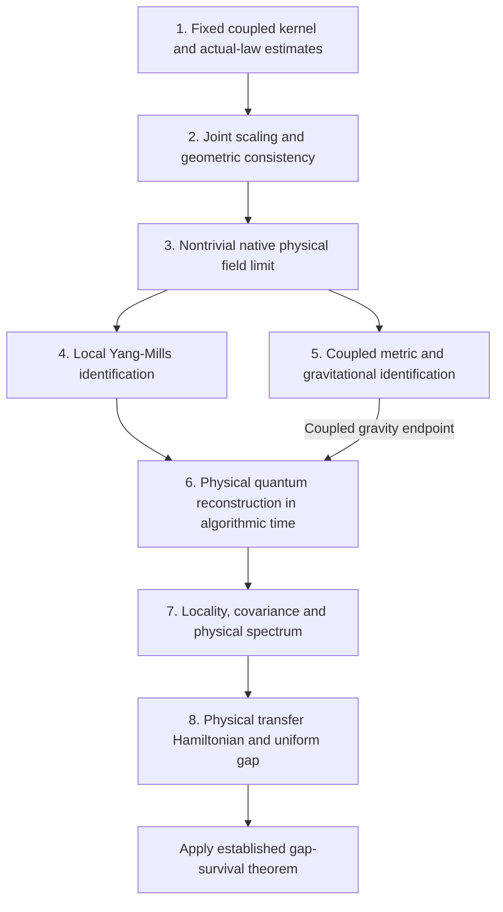

# Volume 2: remaining steps from the Fractal Gas to quantum fields and a Yang–Mills mass gap

**Research roadmap — source snapshot: 2 October 2026.**

This document describes the current working-tree version of Volume 2. In particular,
the structural landscape chapter and several source revisions are concurrent,
uncommitted work. A commit containing this roadmap does not publish those concurrent
source changes. The source register below identifies the chapters and theorem labels
on which this account depends.

The programme starts with one interacting stochastic system. Fitness, selection,
cloning, kinetic motion, viscosity, recorded history and emergent geometry share its
transition law. The field algebra, adaptive graph and geometric observables are read
from that law. This shared origin is the strategy's principal organizing idea: it
allows their responses, correlations and errors to be controlled together. The
remaining task is to identify the physical continuum theory generated by this
system while retaining that joint control.

We use **three spatial coordinates and algorithmic physical time** throughout:

$$
x\in\mathbb R^3,\qquad \tau_n=nh,\qquad
G=-c^2d\tau^2+g_\tau.
$$

Here $h$ has units of physical algorithmic time after calibration, and $c$ has units
of spatial distance per unit time. A four-coordinate Euclidean representation,
when used for reconstruction, must be obtained from this physical-time theory by
a specified construction. It must not silently replace $\tau$ by a fourth walker
position coordinate. Several existing reflection tests in Volume 2 concern a
position coordinate $x^0$ in a four-dimensional position configuration; their scope
is stated explicitly below.

The statements called **established** below are the results in the cited chapters,
with their displayed hypotheses. The statements called **remaining deliverables**
are proposed proof tasks, not additional proved theorems. The distinction keeps the
roadmap usable as a dependency list.

## 1. What is already constructed

### Exact algorithm, records and effective fields

The complete finite-step transition is explicit, including donor selection,
cloning, collisions, Gaussian draws, deterministic maps and stage ordering.
`thm-algorithmic-explicit-transition` and
`thm-algorithmic-field-characteristics` in
[Field equations](../source/2_fractal_gas/3_fitness_manifold/04_field_equations.md)
provide this starting point. The recorded action is obtained from the likelihood
of these actual stages, including their singular deterministic parts, rather than
by prescribing a desired field action afterward
(`thm-ym-recorded-action-emergence`).

Recording does not erase the algorithmic interactions. The Fractal Set supplies
an exact encoding, and `prop-fractal-set-analytic-transfer` in
[The Fractal Set](../source/2_fractal_gas/2_fractal_set/01_fractal_set.md)
transports the specified analytic forms and inequalities. For reduced observables,
`thm-sm-direct-channel-memory` gives the exact contributions of eliminated
variables. `thm-sm-prediction-complete-descriptors` constructs a prediction-complete
descriptor algebra. Thus a reduced field need not be falsely declared Markovian:
its memory can be retained, or its descriptor can be enlarged until prediction
closes.

### Native color structure and the shared geometric action

The complex color contractions include Gram entries, determinant channels and
triangle products. `thm-sm-direct-orbit-isomorphism` proves their common-frame
$SU(3)$ orbit separation, including degenerate ranks;
`thm-sm-direct-measure-isomorphism` transports the observable law and multi-time
correlations. These are stronger statements than a resemblance between formulas.
They identify an invariant observable algebra of the actual color readout.

Geometry and color arise from the same record. With actual likelihood $\mathcal L$
relative to reference law $R$, joint descriptor $(G,D)$, and conditional densities

$$
b(g,d)=\mathbb E_R[\mathcal L\mid G=g,D=d],\qquad
a(g)=\mathbb E_R[\mathcal L\mid G=g],
$$

`thm-ym-native-geometry-fiber-action` gives

$$
S^{\mathrm{joint}}=-\log b
=S^{\mathrm{geom}}+S^{\mathrm{fiber}},\qquad
S^{\mathrm{geom}}=-\log a,\qquad
S^{\mathrm{fiber}}=-\log(b/a).
$$

The field law conditional on geometry and the geometry marginal therefore have a
common probabilistic foundation. `thm-ym-continuum-source-action` and
`thm-ym-native-fiber-continuum` already supply a common subsequential continuum
construction for the retained descriptors and native source responses, under their
uniform bounds. The $C^\infty_{\mathrm{loc}}$ convergence there is convergence in
**source parameters**; it is not an assertion that the spatial metric is smooth.

### Confinement, mean field and entropy tools

The new
[Structural landscape chapter](../source/2_fractal_gas/convergence_program/06a_structural_landscape_convergence.md)
derives signed cloning balances, confinement estimates and quantitative
finite-population consistency from the configured update. In its explicitly
closed active-cloning regime, `thm-slcc-active-contraction` establishes a unique
stationary nonlinear population law and a particle-number-independent contraction.
`cor-slcf-stationary-limits` gives full-sequence stationary chaos and commuting
population/time limits for empirical laws and fixed-row marginals. Other results,
including `thm-slcgt-growing-trajectory` and
`cor-slcgt-infinite-population-path`, give a growing observation window and an
infinite product-topology population-law path limit without assuming stationary
attraction. That last topology must not be replaced by uniform convergence over
all times.

[KL convergence](../source/2_fractal_gas/convergence_program/15_kl_convergence.md)
contains the full-gradient logarithmic Sobolev inequality (LSI), its Poincaré
consequence, tensorization, bounded perturbation, joint curvature and stochastic
flow-contraction routes. These provide concentration, moment bounds and estimates
for empirical observables. The frozen alignment result
`prop-kl-frozen-ou-lsi` controls a conditional Gaussian velocity law uniformly in
$N$ and viscosity under its degree comparison. It supplies a useful reference;
it is not by itself an LSI for the moving, cloning, metric-dependent swarm.

### Fluctuations, geometry and the final gap theorem

`thm-ym-spacetime-fluctuation-compactness` turns a stationary, uniform joint-law LSI
into tight distribution-valued empirical fluctuations and convergence of every
finite-order joint moment along a common subsequence. It uses one-time LSI and
stationarity, without requiring a path-space LSI. Its initial fields live on
algorithmic phase space. `cor-ym-paired-momentum-fluctuations` proves a positive
variance lower bound for momentum fluctuations in the specified conservative
Euclidean paired model. It is an actual nondegeneracy result, with a stated model
scope.

`thm-laplacian-convergence` and `prop-density-corrected-limit` establish conditional
graph-operator consistency. The causal-set chapter gives a calibrated curvature
route (`thm-fractal-gas-ricci`). The field chapter already derives the exact
stochastic metric increments, their conditional covariance, mechanical source and
stress balances, and the coupled system
(`thm-algorithmic-coupled-field-system`). CAR and Clifford structures are available
through the record/Fock construction and `thm-dirac-structure-lqft`.

Finally, `thm-mass-gap-rg-fixed-point` proves that a uniform self-adjoint gap survives
the specified Hilbert-space and strong semigroup limit. The theorem passing the
gap to the limit is already present. Its physical inputs are the last deliverable
of this programme.

## 2. Stage 1 — specify and control the actual coupled model

The first remaining deliverable is a single model specification and a theorem
register for it. Fix the implemented donor/history convention, cloning gate,
collision law, kinetic splitting, viscous kernel and normalization, any Boris
rotation, metric provider, cap, graph reconstruction and observable readout.
Write its complete kernel as $P_{N,h}$, retaining the marks needed to make it a
well-defined Markov process.

The physical dependence is a feedback chain. For example,

$$
g\longrightarrow K_{ij}(g)\longrightarrow
F_i^{\mathrm{visc}}=\nu\sum_jK_{ij}(g)(v_j-v_i)
\longrightarrow c_i\longrightarrow\text{color channels},
$$

while fitness and cloning change the population from which the next metric and
force are computed. Metric-dependent viscosity changes the direction of the
color-generating force even when the instantaneous velocities are fixed.
Normalizing its magnitude does not remove this effect.

Specify which probability law is used at each stage: a conservative invariant law
$\Pi_N$, a killed-chain QSD $\nu_N$, a survival-selected history law, or the invariant
law of a Doob transform. These laws have different likelihoods and entropy
identities. A Gibbs kinetic comparison law is another distinct object. Also
specify the physical observable algebra: complete lossless recordability does not
require every recorded algorithmic coordinate to be a physical observable.

The analytic task is to prove the chosen law's moment/tail, dependence,
minorization or contraction, and full-gradient entropy estimates. The source
scope matters here: `def-slc-parameter-register` explicitly excludes viscosity,
donor history and population-dependent force from its canonical parameter record.
[Gas variants](../source/2_fractal_gas/1_the_algorithm/04_gas_variants.md), §4.2,
also identifies the coupled-kick estimates needed for the viscous variant. The
canonical results are available machinery; applying them to this larger kernel
requires these additional estimates.

The intended LSI convention is

$$
\operatorname{Ent}_{\Pi_N}(f^2)
\le 2C_*\int|\nabla f|^2\,d\Pi_N,
\qquad
\operatorname{Var}_{\Pi_N}(f)
\le C_*\int|\nabla f|^2\,d\Pi_N.
$$

The gradient here is the full gradient used by the fluctuation estimates. The
kinetic noise carré du champ acts only in velocity; hypocoercivity links transport
to that dissipation. Neither should be substituted for the displayed inequality
without the relevant theorem. Choosing strongly convex force/reward data is a
concrete way to strengthen the analytic estimates, but the resulting constants
must concern the complete coupled law and remain adequate along the physical
scaling.

## 3. Stage 2 — one joint continuum scaling

State one sequence of configurations, for example

$$
(N,h,r_{\mathrm{graph}},\ell_{\mathrm{int}},\epsilon_g,
V_{\mathrm{phys}},T_{\mathrm{obs}})_k,
$$

and declare which entries change. The graph reconstruction bandwidth
$r_{\mathrm{graph}}$ and the microscopic interaction range $\ell_{\mathrm{int}}$
are different parameters. Sending the first to zero does not automatically change
the transition law; sending the second to zero does.

The required estimates must hold jointly over this sequence. Track confinement
and tails on unbounded spaces, observation-time growth, density lower bounds on
regular local regions, estimator errors, and metric regularization. Use the
proved envelope or Safe Harbor estimates to control discarded regions rather
than imposing compact support on the swarm.

The actual graph is sampled from an interacting recorded population. Verify its
conditional sampling and covariance hypotheses. A kernel graph limit generally
contains a density drift:

$$
L_{r}\varphi\longrightarrow
\frac{m_2}{2}
\bigl(\rho\Delta_g\varphi+2\nabla\rho\cdot\nabla\varphi\bigr).
$$

The density-corrected construction removes this term under its estimator
conditions. The chapter gives, among its sufficient regimes, an LSI-based
variance scaling requiring $Nr^{d+4}\to\infty$, with $d=3$ for the spatial route.
Every error must be evaluated for the recorded graph and its actual law, including
distance, volume and retessellation errors.

If $h\to0$ is part of the programme, derive the complete-update generator limit.
An order-one cloning probability per update does not automatically become a
finite-rate jump mechanism per unit physical time. It may require a specified
rate scaling, a fast-selection limit or another identified limiting regime. A
fixed-$h$ construction instead needs an explicit physical-time interpolation and
its own continuum identification.

Singular Hessian branches need a declared limit notion. Establish metric and
curvature convergence on regular regions, control their complement, and specify
weak/distributional geometric observables where smooth convergence fails.
Allowing singularities does not mean calling every Hessian degeneracy a black
hole: the physical characterization also uses the emergent causal geometry.

## 4. Stage 3 — identify a nontrivial physical gauge fluctuation law

The compactness theorem already provides convergent subsequences. The remaining
task is to identify their physical fields and evolution. Choose gauge observables
supported on the emergent spacetime, give their centering and scaling, and retain
the metric, field and source coordinates on one common subsequence.

Derive their actual drift and quadratic variation from the complete update. At
finite step the fluctuation equation has the form

$$
\mathcal Z_{n+1}(\varphi)-\mathcal Z_n(\varphi)
=b_{N,h}(\varphi;S_n)+\eta_{n+1}(\varphi),\qquad
\mathbb E[\eta_{n+1}\mid S_n]=0.
$$

`prop-ym-complete-fluctuation-equations` supplies this framework with all changed
rows retained. Prove convergence of the drift, bracket and remainder, including
cloning thresholds and law derivatives. Check the difference between centering
at the finite stationary law and centering at its limiting mean field. Identify a
unique limiting martingale problem or describe the retained phase and its
selection. LSI gives compactness and upper bounds; it does not select Gaussianity
or a unique covariance on its own.

Prove a gauge-sector nondegeneracy estimate. The existing paired momentum lower
bound demonstrates a concrete method, but momentum variance is not automatically
nonzero gauge curvature variance for the coupled metric/Boris kernel. The desired
deliverable is a nonvacuum physical gauge observable with a controlled positive
limiting two-point quantity.

For a flat infinite-volume endpoint, also choose a suitable local intensive or
centered field normalization. `prop-ym-normalized-physical-translation-test` proves
that a globally normalized nonnegative readout of uniformly bounded total mass
cannot have a nonzero law invariant under all flat-space translations. Its stated
version concerns $\mathbb R^4$ position space; the same finite-measure argument
applies to spatial translations in $\mathbb R^3$. This identifies a readout scaling
to change, not a failure of the population construction. A fluctuating curved
geometry has a different symmetry target.

## 5. Stage 4 — identify the native local Yang–Mills dynamics

The common-frame $SU(3)$ orbit algebra and its native law are established. The next
deliverable identifies a local connection and its physical dynamics from those
data. Give compatible color fibers, frame transformations and parallel transport
over the emergent spacetime. Show how the actual viscous/metric dynamics generate
the connection, its curvature and local gauge response. The color-line phase
connection computed in `prop-sm-recorded-color-connection-curvature` is a useful
native construction; its $U(1)$ curvature must not silently be relabeled as an
independent non-Abelian $SU(3)$ link field.

The native source calculus supplies the precise comparison. On a fixed geometry
fiber, let $s_f$ be the conditional score of an actual force perturbation and $X_f$
the proposed connection variation. The remaining weak identity is

$$
\int X_fO\,d\mu^g=\int O s_f\,d\mu^g.
$$

`prop-ym-native-connection-variation-identity` formulates it. Where
$d\mu^g=e^{-S}d\lambda^g$ has a differentiable chart, the identity becomes

$$
s_f=X_fS-\operatorname{div}_{\lambda^g}X_f.
$$

The reference-volume divergence is part of the calculation. It prevents an
incorrect identification of a likelihood derivative with a coordinate action
derivative.

Prove that the limiting native action/response gives the Yang–Mills functional
and its first variations, with any matter terms explicitly identified:

$$
S_{\mathrm{YM}}[A;G]
=\frac{1}{4g_{\mathrm{YM}}^2}
\int\operatorname{tr}(F_{\mu\nu}F^{\mu\nu})\,d\operatorname{vol}_G,
\qquad D_\mu F^{\mu\nu}=J^\nu.
$$

The Euclidean sign convention is used for a Euclidean action; the real-time
functional requires its stated Lorentzian convention. The smooth Wilson expansion
and stationary link variation already appear in `thm-continuum-limit-ym` and
`thm-yang-mills-eom`. Their hypotheses must be discharged for the **native law**,
including accumulated face errors and first-variation errors. A Taylor expansion
of a Wilson observable alone does not identify the probability action. For a
pure Yang–Mills target, establish the required ultraviolet scaling and
renormalized gauge observables rather than only a smooth classical limit.

## 6. Stage 5 — identify the coupled gravitational extension

The coupled geometric theory keeps the geometry law rather than treating it as
an externally prescribed background. Its discrete dynamics are already explicit:
for a metric observable $A$,

$$
\Delta A=b_A(S_n)+\eta_{n+1},\qquad
b_A=P_{N,h}A-A,\qquad
\Gamma_A=P_{N,h}(AA^{\mathsf T})-(P_{N,h}A)(P_{N,h}A)^{\mathsf T}.
$$

`thm-algorithmic-observable-increment` and the coupled field system give the
mechanical stress, clone sources and stage correlations entering this law. The
remaining continuum calculation should start with these terms.

There are two geometric routes to retain. The Riemannian route reconstructs
$g_\tau$, the density-corrected Laplace–Beltrami operator, transport and curvature
from the spatial graph. The causal route uses history order, proper-time
neighborhoods and volume, with the chapter's moment calibration and curvature
estimator. Its localized operator is not identical to a standard retarded
Benincasa–Dowker operator; `rem-cst-bd-comparison` states the comparison needed.
Either route requires the actual correlated-episode estimates and action
quadrature/tail control. Retaining both allows their curvature readouts to be
compared on a common law.

Identify the continuum metric evolution or native variational identity and its
stress tensor. If the target is

$$
\operatorname{Ein}(G)_{\mu\nu}+\Lambda G_{\mu\nu}
=8\pi G_{\mathrm N}T_{\mu\nu},
$$

derive its coefficients, constraint equations, conservation identity and any
additional stochastic, memory or constitutive terms. Curvature-action convergence
and its first variations are separate estimates. The curvature chapter's
`rem-gravity-optimization` explicitly identifies this dynamical step.

The fitness Hessian, a Fisher information metric and the Einstein tensor are
different constructions: respectively a configured local metric provider, a
score-covariance geometry, and a curvature expression of a spacetime metric. Their
relationship can be proved for an identified thermodynamic family, but equality
is a theorem to establish. The chapter's `thm-einstein-relation` is a
transport/diffusion relation, not the gravitational field equation. This stage
should also specify the weak extension across singular regions and the quantum
status of the coupled geometry.

## 7. Stages 6 and 7 — physical quantum reconstruction, locality and covariance

### Stage 6: construct the positive-energy representation

The exact record law, its generating functional and its CAR/Clifford lift provide
ingredients for reconstruction. A physical quantum representation is the next
deliverable. Volume 2 proves a precise reason to change one literal choice:
`lem-ym-pullback-translation-spectrum` shows that recorded $L^2$ pullback
translations commute with complex conjugation $J$, and consequently

$$
JE(B)J=E(-B).
$$

Their spectrum is symmetric under energy-momentum reversal. Requiring this same
representation to have forward-cone spectrum forces translations to act
trivially; requiring a unique invariant vacuum then forces a one-dimensional
space. The specified existing even exterior lift inherits that conclusion.
This is a theorem about these implementations of translations, not a theorem
excluding reconstruction from the underlying algorithm.

Choose a physical reconstruction route and prove its assumptions. An
Osterwalder–Schrader route constructs Euclidean correlations from the three-space
plus physical-$\tau$ dynamics, verifies reflection positivity and the remaining
reconstruction conditions, then takes the physical Hilbert quotient. A direct
real-time route constructs a positive state and local quantum algebra with a
positive-energy dynamics. In both cases, the physical quantum time remains the
algorithmic time after the declared reconstruction and calibration.

The existing reflection matrices and source identities make positivity a
calculable task. Their complete likelihoods, masks, color channels and geometry
must be retained. Existing $x^0$-position reflection tests, including
`prop-ym-translated-qsd-reflection-test`, must not be presented as results about
reflection of the proposed physical $\tau$ without deriving that correspondence.
An LSI does not replace reflection positivity.

### Stage 7: prove physical locality and the target symmetries

The squashed kinetic-position rule already has a metric light-cone support
statement (`cor-ym-squashed-kinetic-support`). The native operational no-signaling
criterion is also explicit: for an allowed source $L_\lambda$ and receiving
descriptor $D_B$, unchanged receiver law is expressed by

$$
\mathbb E[L_\lambda\mid D_B]=1,
$$

with the appropriate selected-law normalization. Use these existing causal tools
to identify the spacetime causal relation and permitted interventions.

Then prove spacelike commutation of the reconstructed physical observable
algebras, and graded locality where appropriate for fermion fields. Multiplication
of classical record observables commutes, but this alone does not give a local
quantum net. `thm-ym-quantum-regional-commutation-test` diagnoses the existing
covariance-based CAR assignment: in its stated nondegenerate dimensions, regional
commutation requires orthogonality of centered descriptor spaces, hence
statistical independence of the corresponding descriptor sigma algebras.
Interacting quantum fields can have correlated states while their spacelike
observable algebras commute. The physical reconstruction must therefore identify
the correct local algebra/representation rather than demand physical independence
as the meaning of locality.

Prove the relevant covariance and spectrum in that same representation. A flat
pure Yang–Mills endpoint needs Poincaré covariance and forward-cone spectrum.
The coupled curved-space endpoint instead needs its specified geometric
covariance and causal formulation. Passive coordinate/frame covariance of the
readout and active invariance of a physical law are separate assertions.

## 8. Stage 8 — identify and pass the physical mass gap

Construct the self-adjoint physical transfer Hamiltonians $H_a$ for the
reconstructed gauge sector. Here $a$ collects the physical cutoffs and volume
parameters, and is not merely particle number. Prove

$$
\|e^{-tH_a}(I-P_{\Omega_a})\|\le e^{-\lambda_*t},
\qquad\lambda_*>0,
$$

uniformly in the required family, and the strong semigroup convergence

$$
J_ae^{-tH_a}J_a^*\longrightarrow e^{-tH},\qquad
J_aJ_a^*\longrightarrow I,\qquad J_a\Omega_a\longrightarrow\Omega.
$$

These are precisely the inputs of the already proved
`thm-mass-gap-rg-fixed-point`. Its conclusion gives a unique vacuum and
$\operatorname{spec}(H)\subset\{0\}\cup[\lambda_*,\infty)$, with physical energy
gap $\hbar_{\mathrm{eff}}\lambda_*$ at fixed calibrated action unit. A
hypocoercive rate for a non-self-adjoint sampling generator is valuable analytic
control; its identification with this physical energy gap needs the reconstructed
transfer theory. Pointwise Laplacian consistency also needs strengthening to the
required semigroup/form convergence.

Keep two endpoints explicit. The coupled geometry/gauge theory has fluctuating
geometry and its own physical target. The Clay endpoint concerns nontrivial
four-dimensional pure Yang–Mills theory with the stated quantum-field properties
and a positive mass gap; the full challenge asks for every compact simple gauge
group. See the primary
[Jaffe–Witten problem statement](https://www.claymath.org/wp-content/uploads/2022/06/yangmills.pdf).
Algorithmic cloning, fitness and other auxiliary mechanisms can remain in a
construction of that endpoint when their resulting physical sector is identified
with pure Yang–Mills. Their usefulness for control does not require them all to
survive as additional physical matter fields.

## 9. Dependency diagram and completion checklist

The same dependency order in plain text is: fixed kernel and analytic estimates
→ joint scaling → native field limit → local gauge and, for the coupled endpoint,
gravitational identification → physical quantum reconstruction → locality and
covariance → physical transfer/gap convergence → the existing gap theorem.

| Remaining deliverable | Inputs to retain | Evidence that completes it |
|---|---|---|
| Coupled-kernel analytic theorem | Actual marks, viscosity, metric feedback, cloning and chosen law | Uniform moments/tails, dependence control and the stated full-gradient LSI/Poincaré or justified alternative |
| Joint continuum theorem | One parameter schedule and correlated graph law | Common metric, volume, causal and operator convergence with quantified local/tail errors |
| Physical gauge fluctuation theorem | Exact drift/bracket and joint source hierarchy | Identified limiting dynamics, phase/uniqueness statement and gauge nondegeneracy |
| Native local Yang–Mills theorem | Actual fiber action and force-source score | Local connection, weak variation identity, limiting action/first variations and required UV identification |
| Coupled gravitational theorem | Exact metric increments, stress and both curvature routes | Controlled metric evolution/variation, coefficients, constraints and specified singular-region extension |
| Quantum reconstruction theorem | Native physical-time correlations and positivity test | Nontrivial positive-energy physical Hilbert representation and physical observables |
| Physical locality/covariance theorem | Reconstructed algebra and emergent causal geometry | Spacelike commutation, target covariance, spectrum and vacuum properties in one representation |
| Uniform physical gap theorem | Identified self-adjoint physical transfer operators | Cutoff/volume-uniform gap and strong semigroup/Hilbert-space convergence |

The analytic discharge uses recognizable tools already developed in Volume 2:
Lyapunov and signed selection estimates, entropy interpolation, LSI/Poincaré,
conditional concentration, martingale compactness, graph consistency and
semigroup convergence. Their application to the chosen coupled kernel can still
require substantial new estimates. The local gauge, gravitational and quantum
identifications are structural theorems: they establish what the controlled law
*is*. The book supplies concrete routes and tests for these tasks. It does not
establish that every one is a routine calculation, and the representation-specific
tests above do not establish a general impossibility of the programme.

## Source register

The labels below refer to the current source snapshot. Relative links open the
source chapters; the labels identify the formal result to locate within each file.

1. [Gas variants](../source/2_fractal_gas/1_the_algorithm/04_gas_variants.md):
   §4.2 coupled-viscosity hypotheses and the distinct configured variants.
2. [Structural landscape convergence](../source/2_fractal_gas/convergence_program/06a_structural_landscape_convergence.md):
   `def-slc-parameter-register`, `thm-slcc-active-contraction`,
   `cor-slcf-stationary-limits`, `thm-slcgt-growing-trajectory`,
   `cor-slcgt-infinite-population-path`.
3. [Mean field](../source/2_fractal_gas/convergence_program/08_mean_field.md):
   `thm-mean-field-one-step-consistency`, `rem-mean-field-structural-refinement`,
   `rem-mean-field-long-time-audit`.
4. [KL convergence](../source/2_fractal_gas/convergence_program/15_kl_convergence.md):
   `def-kl-finite-particle-laws`, `cor-n-uniform-lsi`,
   `thm-kl-contractive-diffusion-lsi`, `prop-kl-frozen-ou-lsi`.
5. [Continuum discharge](../source/2_fractal_gas/convergence_program/16_continuum_discharge.md):
   actual geometric, density, derivative and schedule hypotheses; QSD/Doob
   sampling distinctions.
6. [The Fractal Set](../source/2_fractal_gas/2_fractal_set/01_fractal_set.md):
   complete-record encoding and `prop-fractal-set-analytic-transfer`.
7. [Causal set theory](../source/2_fractal_gas/2_fractal_set/02_causal_set_theory.md):
   `rem-cst-bd-comparison`, `assm-cst-curvature-calibration`,
   `thm-fractal-gas-ricci`.
8. [Lattice QFT](../source/2_fractal_gas/2_fractal_set/03_lattice_qft.md):
   `thm-lqft-record-fock-reconstruction`, `thm-dirac-structure-lqft`,
   `thm-laplacian-convergence`, `prop-density-corrected-limit`.
9. [Standard Model](../source/2_fractal_gas/2_fractal_set/04_standard_model.md):
   `thm-sm-direct-orbit-isomorphism`, `thm-sm-direct-measure-isomorphism`,
   `thm-sm-direct-channel-memory`, `thm-sm-prediction-complete-descriptors`,
   `prop-sm-recorded-color-connection-curvature`.
10. [Yang–Mills and Noether](../source/2_fractal_gas/2_fractal_set/05_yang_mills_noether.md):
    native action/source/fiber results, fluctuation compactness and nondegeneracy,
    `lem-ym-pullback-translation-spectrum`, physical reflection/locality tests,
    `thm-mass-gap-rg-fixed-point`, `rem-ym-proof-dependency-order`.
11. [Curvature and gravity](../source/2_fractal_gas/3_fitness_manifold/03_curvature_gravity.md):
    Hessian curvature, Lorentzian geometric hypotheses and
    `rem-gravity-optimization`.
12. [Field equations](../source/2_fractal_gas/3_fitness_manifold/04_field_equations.md):
    `thm-algorithmic-explicit-transition`, `thm-algorithmic-observable-increment`,
    `thm-algorithmic-coupled-field-system`, `thm-einstein-relation`.
13. [Holography and information geometry](../source/2_fractal_gas/3_fitness_manifold/05_holography.md):
    native response/Fisher constructions and the distinction between fitness,
    stationary, transition and path geometries.
