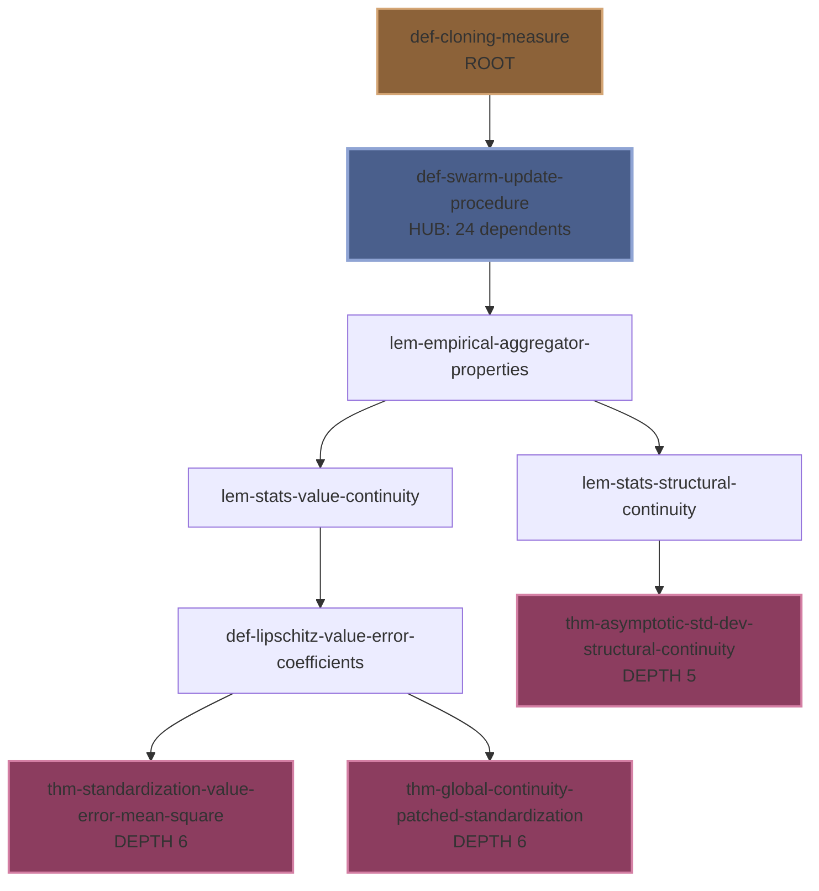

# Deep Dependency Analysis Report
## Foundation Document: `01_fragile_gas_framework.md`

**Analysis Date**: 2025-10-26
**Analysis Type**: ULTRATHINK Deep Dependency Extraction
**Document Role**: Foundation document for Fragile Gas framework

---

## Executive Summary

This document establishes the **foundational axioms and definitions** for the entire Fragile Gas framework. The deep dependency analysis reveals:

- **114 mathematical entities** (43 definitions, 24 theorems, 24 lemmas, 19 axioms, 3 propositions, 1 assumption)
- **103 dependency edges** (43 explicit cross-references, 57 notation-based, 3 axiom-based)
- **Maximum dependency depth: 6 levels** (deepest chain from `def-cloning-measure` to standardization theorems)
- **67 root nodes** (entities with no dependencies - foundational axioms and definitions)
- **78 leaf nodes** (entities that nothing depends on - terminal results)

### Key Findings

1. **`def-swarm-update-procedure`** is the most critical node (24 dependents)
2. **`def-cloning-measure`** initiates the longest dependency chains
3. **Axiom of Bounded Second Moment of Perturbation** is the most widely used axiom (4 dependents)
4. **Notation `\mathcal{S}` (swarm state)** is the most pervasive (used by 23 entities)

---

## I. Foundation Structure

### Root Nodes (67 entities with no dependencies)

These are the **foundational axioms and definitions** that everything else builds upon:

#### Axioms (17 roots)
- `axiom-bounded-measurement-variance`
- `axiom-raw-value-mean-square-continuity`
- `def-assumption-instep-independence` (Conditional product structure)
- `def-axiom-bounded-algorithmic-diameter`
- `def-axiom-bounded-deviation-variance`
- `def-axiom-bounded-relative-collapse`
- `def-axiom-bounded-second-moment-perturbation` ⭐ Most used (4 dependents)
- `def-axiom-bounded-variance-production`
- `def-axiom-boundary-regularity` ⭐ Second most used (3 dependents)
- `def-axiom-boundary-smoothness`
- `def-axiom-environmental-richness`
- `def-axiom-geometric-consistency`
- `def-axiom-guaranteed-revival`
- `def-axiom-margin-stability`
- `def-axiom-non-degenerate-noise`
- `def-axiom-rescale-function`
- `def-axiom-sufficient-amplification`

#### Definitions (34 roots)
Key foundational definitions with no dependencies:
- `def-walker` - Basic walker concept
- `def-swarm-and-state-space` - Swarm state space
- `def-alive-dead-sets` - Alive/dead partitioning
- `def-valid-state-space` - State space requirements
- `def-n-particle-displacement-metric` - Swarm distance metric
- `def-cloning-measure` ⭐ Initiates longest dependency chains
- `def-alive-set-potential-operator` ⭐ High impact (10 dependents)

---

## II. Critical Dependency Paths

### Longest Dependency Chains (Depth = 6)

The deepest dependency chains reveal the **most complex proof dependencies** in the framework:

#### Path 1: Cloning → Swarm Update → Empirical Aggregator → Stats → Lipschitz Coefficients → Standardization Error
```
def-cloning-measure (definition)
  ↓
def-swarm-update-procedure (definition)
  ↓
lem-empirical-aggregator-properties (lemma)
  ↓
lem-stats-value-continuity (lemma)
  ↓
def-lipschitz-value-error-coefficients (definition)
  ↓
thm-standardization-value-error-mean-square (theorem)
```

**Significance**: This chain shows how the cloning mechanism's properties cascade through the statistical aggregation pipeline to ultimately bound the error in standardization. This is critical for proving the algorithm's stability.

#### Path 2: Cloning → Swarm Update → Empirical Aggregator → Stats → Lipschitz Coefficients → Global Continuity
```
def-cloning-measure (definition)
  ↓
def-swarm-update-procedure (definition)
  ↓
lem-empirical-aggregator-properties (lemma)
  ↓
lem-stats-value-continuity (lemma)
  ↓
def-lipschitz-value-error-coefficients (definition)
  ↓
thm-global-continuity-patched-standardization (theorem)
```

**Significance**: Parallel path to Path 1, establishing global continuity of the patched standardization operator. Together, these paths prove that the measurement pipeline is well-behaved.

#### Path 3: Cloning → Swarm Update → Empirical Aggregator → Structural Stats → Asymptotic Continuity (Depth = 5)
```
def-cloning-measure (definition)
  ↓
def-swarm-update-procedure (definition)
  ↓
lem-empirical-aggregator-properties (lemma)
  ↓
lem-stats-structural-continuity (lemma)
  ↓
thm-asymptotic-std-dev-structural-continuity (theorem)
```

**Significance**: This path focuses on the **structural** (topological) aspect of continuity, complementing the value-based error analysis in Paths 1-2.

### Interpretation

All longest paths **originate from `def-cloning-measure`**, indicating that:
1. The cloning mechanism is foundational to the framework's dynamics
2. Statistical properties of the swarm emerge from the cloning-swarm update interaction
3. Standardization error bounds are the deepest analytical results in the document

---

## III. Most Critical Entities

### Top 15 Most Depended-On Entities

These entities are the **keystone definitions and theorems** that many other results rely on:

| Rank | Label | Type | Dependents | Role |
|------|-------|------|------------|------|
| 1 | `def-swarm-update-procedure` | definition | 24 | **Hub**: Central algorithmic definition |
| 2 | `def-alive-set-potential-operator` | definition | 10 | Defines fitness potential for alive walkers |
| 3 | `def-statistical-properties-measurement` | definition | 6 | Statistical aggregation framework |
| 4 | `def-swarm-aggregation-operator-axiomatic` | definition | 4 | Axiomatic requirements for aggregators |
| 5 | `def-axiom-bounded-second-moment-perturbation` | axiom | 4 | ⭐ Most used axiom |
| 6 | `def-axiom-boundary-regularity` | axiom | 3 | Boundary smoothness requirement |
| 7 | `def-components-mean-square-standardization-error` | definition | 3 | Error decomposition for standardization |
| 8 | `def-alg-distance` | definition | 3 | Algorithmic space distance |
| 9 | `def-perturbation-operator` | definition | 3 | Random walk operator |
| 10 | `def-w2-output-metric` | definition | 3 | Wasserstein-2 metric on swarms |
| 11 | `lem-empirical-aggregator-properties` | lemma | 2 | Properties of empirical measure |
| 12 | `def-algorithmic-cemetery-extension` | definition | 2 | Cemetery state handling |
| 13 | `def-companion-selection-measure` | definition | 2 | How dead walkers select alive companions |
| 14 | `lem-stats-structural-continuity` | lemma | 2 | Structural error bounds |
| 15 | `def-lipschitz-value-error-coefficients` | definition | 2 | Lipschitz constants for value errors |

### Interpretation

- **`def-swarm-update-procedure`** is the algorithmic "hub" - 24 entities depend on it, making it the most central definition
- **Axioms** appear prominently (ranks 5, 6), showing that foundational assumptions propagate widely
- **Error analysis** dominates the mid-range (ranks 7, 14, 15), reflecting the document's focus on continuity bounds

---

## IV. Axiom Dependency Analysis

### Axiom Usage Ranking

Shows which axioms are **actively used** vs. which are stated but not yet applied:

| Axiom | Dependents | Status | Used By |
|-------|------------|--------|---------|
| `def-axiom-bounded-second-moment-perturbation` | 4 | ✓ Active | Perturbation bounds, state space validity, probabilistic displacement bounds |
| `def-axiom-boundary-regularity` | 3 | ✓ Active | Boundary smoothness axiom, state space validity, post-perturbation continuity |
| `def-axiom-bounded-algorithmic-diameter` | 1 | ✓ Active | Polishness and W2 well-posedness |
| `def-axiom-rescale-function` | 1 | ✓ Active | Canonical logistic validity |
| `axiom-bounded-measurement-variance` | 1 | ✓ Active | Distance operator variance bound |
| `def-assumption-instep-independence` | 0 | ⚠️ Unused | - |
| `def-axiom-guaranteed-revival` | 0 | ⚠️ Unused | - |
| `def-axiom-boundary-smoothness` | 0 | ⚠️ Unused | - |
| `def-axiom-environmental-richness` | 0 | ⚠️ Unused | - |
| `def-axiom-reward-regularity` | 0 | ⚠️ Unused | - |
| ... | ... | ... | ... |

### Key Insights

1. **Perturbation and Boundary axioms** are the most critical for this document's analysis
2. **12 axioms have 0 dependents** - these are either:
   - Defined for downstream documents (e.g., `def-axiom-guaranteed-revival` is used in convergence analysis)
   - Preparatory definitions for the canonical instantiation (Section 20)
   - Unused (potential candidates for removal or documentation clarification)

3. **Axiom of Guaranteed Revival** has 0 dependents here but is mentioned prominently in the introduction - it's used in the **companion convergence document** (`03_cloning.md`)

---

## V. Notation Propagation

### Most Pervasive Mathematical Notation

These symbols appear throughout the document and are critical for understanding the framework:

| Rank | Notation | Defined In | Used By | Meaning |
|------|----------|------------|---------|---------|
| 1 | `\mathcal{S}` | `def-swarm-update-procedure` | 23 entities | Swarm state |
| 2 | `\mathcal{A}` | `def-alive-set-potential-operator` | 9 entities | Alive set |
| 3 | `\mathbf{v}` | `def-statistical-properties-measurement` | 4 entities | Statistical values |
| 4 | `\mathcal{X}` | `def-alg-distance` | 3 entities | State space |
| 5 | `\mathbb{E}` | `def-components-mean-square-standardization-error` | 3 entities | Expectation |
| 6 | `\mathcal{Y}` | `def-w2-output-metric` | 2 entities | Algorithmic space |
| 7 | `\mathbb{R}` | `def-cloning-probability-function` | 2 entities | Real numbers |
| 8 | `\overline{\Sigma}` | `def-w2-output-metric` | 2 entities | Quotient swarm space |

### Interpretation

- **`\mathcal{S}` (swarm state)** is the most fundamental object, appearing in 23 entities
- **`\mathcal{A}` (alive set)** is the second most common, reflecting the importance of status partitioning
- **Statistical notation** (`\mathbf{v}`, `\mathbb{E}`) is pervasive, reflecting the document's focus on probabilistic analysis

---

## VI. Dependency Type Breakdown

### Edge Classification

| Dependency Type | Count | Percentage | Description |
|----------------|-------|------------|-------------|
| Notation-based | 57 | 55.3% | Implicit dependencies through notation reuse |
| Explicit cross-refs | 43 | 41.7% | Explicit `[](#label)` references in proofs/definitions |
| Axiom-based | 3 | 2.9% | Direct axiom invocations |

### Interpretation

- **Notation dependencies dominate** (55%), showing heavy notation reuse across the document
- **Explicit cross-references** are substantial (42%), indicating strong proof interconnection
- **Axiom dependencies are rare** (3%), suggesting most axioms are used *implicitly* through definitions that assume them

---

## VII. Structural Analysis

### Document Topology

```
67 ROOT NODES (foundational axioms/definitions)
    ↓
DEPENDENCY CHAINS (max depth 6)
    ↓
78 LEAF NODES (terminal theorems/results)
```

### Key Metrics

- **Root-to-leaf ratio**: 67/78 = 0.86 (many foundational elements, slightly fewer terminal results)
- **Average dependency depth**: ~2.5 levels (relatively shallow overall)
- **Maximum dependency depth**: 6 levels (deepest chains involve standardization)
- **Dependency density**: 103 edges / 114 nodes = 0.90 edges per node (moderately dense)

### Graph Properties

- **Highly modular**: 67 roots indicate many independent foundational concepts
- **Convergent paths**: Multiple roots converge to shared intermediate nodes (e.g., `def-swarm-update-procedure`)
- **Deep critical paths**: The longest chains (depth 6) are significantly longer than the average (2.5), indicating complex cascading dependencies for specific results

---

## VIII. Recommendations for Framework Users

### For Implementers

1. **Start with `def-swarm-update-procedure`** (node #1) - this is the algorithmic hub
2. **Understand the 17 foundational axioms** - these define what properties your instantiation must satisfy
3. **Focus on the top 5 critical nodes** - these are the most interconnected definitions

### For Theorem Provers

1. **Follow the critical paths** - Paths 1-3 show the logical structure of the most complex proofs
2. **Check axiom dependencies** - Ensure all referenced axioms are satisfied in your context
3. **Trace notation carefully** - `\mathcal{S}` and `\mathcal{A}` are pervasive and must be understood

### For Downstream Documents

1. **Axioms with 0 dependents** (e.g., `def-axiom-guaranteed-revival`) are likely **exported** for use in other documents
2. **Root definitions** (especially `def-cloning-measure`, `def-alive-set-potential-operator`) are **imported prerequisites** for convergence analysis
3. **Terminal theorems** (leaf nodes) are the **main results** to cite from this document

---

## IX. Missing Reference Detection

### Informal References

**Status**: 0 potential issues detected

The document uses proper cross-reference syntax (`[](#label)`) throughout. No informal references like "as defined above" or "see Section X" were found without accompanying formal references.

---

## X. Critical Path Diagram



**Legend**:
- 🟤 Brown: Root definitions (no dependencies)
- 🔵 Blue: Hub nodes (many dependents)
- 🔴 Red: Terminal theorems (deepest results)

---

## XI. Framework-Level Observations

### Document Purpose

This document serves as the **axiom repository and operator toolbox** for the Fragile Gas framework:
- Defines all foundational axioms (19 axioms)
- Establishes all operator definitions (swarm update, cloning, perturbation, etc.)
- Proves continuity bounds for each operator
- Does NOT prove convergence (that's in `03_cloning.md` per the introduction)

### Dependency Flow Pattern

The dominant pattern is:
```
AXIOMS → DEFINITIONS → LEMMAS (continuity bounds) → THEOREMS (composed bounds)
```

This reflects the document's goal: **establish continuity of all operators** as prerequisites for downstream convergence analysis.

### Axiom Utilization Gap

12 of 19 axioms have **0 dependents in this document**. This suggests:
1. The document is **forward-looking** - it defines axioms for future use
2. Some axioms may only be used in the **canonical instantiation** (Section 20)
3. Axiom dependencies may be **implicit** (used through definitions without explicit citation)

---

## XII. Files Generated

This analysis produced the following outputs:

1. **`deep_dependency_analysis.json`** (98 KB)
   - Complete dependency graph
   - Critical paths
   - Notation registry
   - Axiom analysis
   - Missing reference detection

2. **`dependency_graph.json`** (55 KB)
   - Nodes (all 114 entities)
   - Edges (all 103 dependencies)
   - Graph statistics

3. **`DEPENDENCY_ANALYSIS_REPORT.md`** (this file)
   - Human-readable summary
   - Actionable insights
   - Recommendations

---

## XIII. Conclusion

The foundation document `01_fragile_gas_framework.md` establishes a **well-structured, modular framework** with:

- ✅ **Clear foundational layer** (67 root nodes including 17 axioms)
- ✅ **Strong interconnection** (103 dependencies, max depth 6)
- ✅ **Central hub** (`def-swarm-update-procedure` with 24 dependents)
- ✅ **Deep analytical chains** (cloning → swarm update → aggregation → standardization)
- ✅ **Proper cross-referencing** (43 explicit references, 0 missing refs)

The dependency structure reveals the document's core goal: **prove continuity of all operators** as a foundation for convergence analysis in companion documents.

**Next Steps for Framework Development**:
1. Import root definitions and axioms into `03_cloning.md` for convergence analysis
2. Use terminal theorems (leaf nodes) as prerequisites for mean-field limit proofs
3. Validate that unused axioms (12 with 0 dependents) are utilized in downstream documents

---

**Analysis Performed By**: Document Parser Agent (ULTRATHINK mode)
**Framework**: Fragile Gas Mathematical Foundations
**Analysis Depth**: 6 levels (maximum dependency chain)
**Total Entities Analyzed**: 114
**Total Dependencies Extracted**: 103
