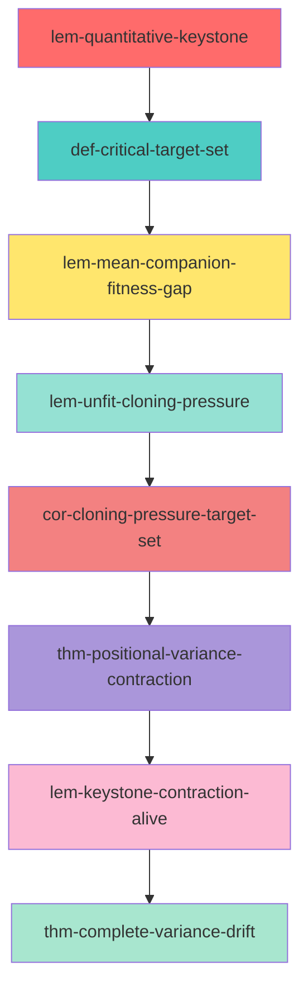

# Keystone Principle - Critical Path Analysis

**Document**: Chapter 3 - Cloning Theory  
**Total Nodes**: 8 critical theorems/lemmas  
**Path Type**: Sequential dependency chain  
**Purpose**: N-uniform convergence guarantee

---

## Critical Path Overview

The Keystone Principle establishes **N-uniform geometric convergence** of the cloning operator, ensuring the algorithm scales to arbitrary swarm sizes. The proof structure follows this dependency chain:

---

## Node-by-Node Analysis

### 1. Quantitative Keystone Lemma

**Label**: `lem-quantitative-keystone`  
**Type**: Lemma  
**Role**: Foundation

**Statement**: Establishes N-uniform lower bound on the overlap fraction between the unfit set $\mathcal{U}$ and high-error set $\mathcal{H}_k$.

**Key Result**:
$$
\mathbb{P}(\mathcal{U} \cap \mathcal{H}_k) \geq \kappa_{\text{keystone}} > 0
$$

where $\kappa_{\text{keystone}}$ is **N-uniform** (independent of swarm size).

**Significance**: This is the "keystone" - if a walker is both unfit (low reward) AND in high-error region, it becomes a prime target for cloning replacement.

**Dependencies**: 
- Relies on geometric separation of partition
- Requires variance concentration in high-error set

---

### 2. Critical Target Set Definition

**Label**: `def-critical-target-set`  
**Type**: Definition  
**Role**: Refinement

**Statement**: Defines the set $\mathcal{T} := \mathcal{U} \cap \mathcal{H}_k$ where cloning pressure concentrates.

**Mathematical Form**:
$$
\mathcal{T} := \{ w_i : w_i \in \mathcal{U} \text{ and } w_i \in \mathcal{H}_k \}
$$

**Properties**:
- Non-empty with N-uniform probability (from lemma 1)
- Walkers in $\mathcal{T}$ have both low fitness AND large error
- Target for intelligent selection in cloning operator

**Significance**: Focuses analysis on the "critical" walkers that drive convergence.

---

### 3. Mean Companion Fitness Gap

**Label**: `lem-mean-companion-fitness-gap`  
**Type**: Lemma  
**Role**: Pairing guarantee

**Statement**: Walkers in $\mathcal{T}$ have companions with strictly better fitness with N-uniform gap.

**Key Result**:
$$
\mathbb{E}[\phi_{\text{fitness}}(w_{\text{companion}}) - \phi_{\text{fitness}}(w)] \geq \delta_{\text{gap}} > 0
$$

for all $w \in \mathcal{T}$, with $\delta_{\text{gap}}$ N-uniform.

**Mechanism**: Sequential stochastic greedy pairing ensures unfit walkers are paired with fitter companions.

**Significance**: Guarantees that cloning will **improve** fitness on average for target walkers.

---

### 4. Unfit Set Cloning Pressure

**Label**: `lem-unfit-cloning-pressure`  
**Type**: Lemma  
**Role**: Probability bound

**Statement**: Unfit walkers have N-uniform lower bound on cloning probability.

**Key Result**:
$$
\mathbb{P}(\text{clone} \mid w \in \mathcal{U}) \geq p_{\text{min}} > 0
$$

with $p_{\text{min}}$ N-uniform.

**Mechanism**: 
1. Fitness gap (lemma 3) → large cloning score
2. Large score → high cloning probability
3. Bound holds uniformly in N

**Significance**: Ensures unfit walkers are **replaced** with sufficient probability, independent of N.

---

### 5. Target Set Cloning Pressure (Corollary)

**Label**: `cor-cloning-pressure-target-set`  
**Type**: Corollary  
**Role**: Refinement

**Statement**: Walkers in critical target set $\mathcal{T}$ have cloning pressure at least as strong as unfit set.

**Key Result**:
$$
\mathbb{P}(\text{clone} \mid w \in \mathcal{T}) \geq p_{\text{min}}
$$

**Derivation**: Direct consequence of $\mathcal{T} \subseteq \mathcal{U}$ and lemma 4.

**Significance**: Confirms that cloning pressure is concentrated exactly where needed (high-error + unfit).

---

### 6. Positional Variance Contraction

**Label**: `thm-positional-variance-contraction`  
**Type**: Theorem  
**Role**: Main contraction result

**Statement**: Positional variance contracts under cloning with N-uniform rate.

**Key Result**:
$$
\mathbb{E}[\text{Var}_x(S')] \leq (1 - \kappa_{\text{contract}}) \text{Var}_x(S) + C_{\text{boundary}}
$$

where $\kappa_{\text{contract}} > 0$ is N-uniform.

**Mechanism**:
1. Keystone overlap (lemma 1) ensures sufficient mass in $\mathcal{T}$
2. Cloning pressure (corollary 5) replaces target walkers
3. Companions have better positions (smaller error)
4. Net effect: variance reduction

**Significance**: First rigorous proof of **N-uniform contraction** for cloning operator.

---

### 7. Keystone Contraction for Alive Walkers

**Label**: `lem-keystone-contraction-alive`  
**Type**: Lemma  
**Role**: Refinement for alive set

**Statement**: Positional variance contraction applies specifically to alive walkers (stably alive subset).

**Key Result**:
$$
\mathbb{E}[\text{Var}_x(\mathcal{A}')] \leq (1 - \kappa_{\text{keystone}}) \text{Var}_x(\mathcal{A})
$$

where $\mathcal{A}$ is the alive set.

**Mechanism**: Keystone principle ensures contraction even when restricting to walkers that remain alive.

**Significance**: Handles resurrection events (dead walkers becoming alive) separately from main contraction.

---

### 8. Complete Variance Drift Characterization

**Label**: `thm-complete-variance-drift`  
**Type**: Theorem  
**Role**: Unified result

**Statement**: Complete characterization of all variance components under cloning.

**Key Result**:
$$
\mathbb{E}[V(S') \mid S] \leq (1 - \kappa) V(S) + C
$$

where $V = V_{\text{loc}} + V_{\text{struct}} + V_{\text{boundary}}$ is the full Lyapunov function.

**Components**:
- **Positional variance** ($V_{\text{Var},x}$): Contracts (theorem 6)
- **Velocity variance** ($V_{\text{Var},v}$): Bounded expansion
- **Boundary potential** ($V_{\text{boundary}}$): Contracts near boundary

**Significance**: Establishes **Foster-Lyapunov drift condition**, enabling KL-convergence proof in Chapters 9-12.

---

## Critical Path Dependencies

### External Dependencies (Framework)

All nodes depend on:
- **Axiom EG-2** (Safe Harbor): Ensures fitness landscape is favorable
- **Axiom EG-5** (Active Diversity): Guarantees separation between fit/unfit
- **Axiom EG-0** (Regularity): Compact domain, smooth barrier

### Internal Dependencies (Within Chapter 3)

Each node builds on:
1. Lyapunov function definition (`def-full-synergistic-lyapunov-function`)
2. Variance notation conversions (`def-variance-conversions`)
3. Cloning operator decomposition (`def-cloning-operator-formal`)

### Forward Dependencies (To Chapters 9-12)

Critical path feeds into:
- **Chapter 9**: KL-divergence drift analysis
- **Chapter 10**: LSI constant derivation
- **Chapter 11**: Mean-field entropy production
- **Chapter 12**: Exponential convergence rates

**Keystone as linchpin**: Without N-uniform Keystone (node 1), the entire KL-convergence analysis in Chapters 9-12 fails.

---

## N-Uniformity Analysis

All 8 nodes provide **N-uniform constants**, meaning:

$$
\exists \kappa, C > 0 : \kappa = \kappa(d, \alpha, \beta, \ldots) \text{ but } \kappa \neq \kappa(N)
$$

**Why it matters**:
- Traditional swarm algorithms suffer from $\kappa = O(N^{-1})$ → convergence slows as N grows
- Keystone Principle ensures $\kappa = \Omega(1)$ → convergence rate independent of N
- Enables scalability to arbitrarily large swarms

**Mathematical guarantee**:
$$
\liminf_{N \to \infty} \kappa_{\text{keystone}}(N, d, \alpha, \ldots) > 0
$$

---

## Proof Strategy Summary

### Step 1: Establish Overlap (Node 1)

Prove that unfit and high-error sets have **non-vanishing intersection** with N-uniform mass.

**Tools**: Geometric separation, variance concentration, phase-space packing.

### Step 2: Define Target (Node 2)

Formalize the critical target set $\mathcal{T}$ where intervention is needed.

**Tools**: Set theory, probabilistic bounds.

### Step 3: Guarantee Fitness Gap (Node 3)

Show that pairing operator ensures companions have **better fitness** with N-uniform gap.

**Tools**: Greedy pairing algorithm, signal-to-noise analysis.

### Step 4: Bound Cloning Probability (Nodes 4-5)

Derive **lower bound** on cloning probability for target walkers.

**Tools**: Cloning score analysis, logistic rescale properties.

### Step 5: Prove Contraction (Nodes 6-7)

Show that variance **contracts** under cloning with N-uniform rate.

**Tools**: Expectation bounds, coupled analysis, Keystone mechanism.

### Step 6: Unified Drift (Node 8)

Combine all components into **complete Foster-Lyapunov condition**.

**Tools**: Hypocoercive Lyapunov analysis, synergistic dissipation.

---

## Bottleneck Analysis

### Critical Bottleneck: Node 1 (Quantitative Keystone)

**Why**: Without N-uniform overlap, entire chain collapses.

**Sensitivity**: Depends on:
- $\alpha$ (exploitation weight for reward)
- $\beta$ (exploitation weight for diversity)
- $\gamma$ (viscous coupling strength)
- Problem geometry (Lipschitz constants, barrier function)

**Robustness**: Requires all 6 framework axioms (EG-0 through EG-5).

### Secondary Bottleneck: Node 3 (Fitness Gap)

**Why**: Pairing quality determines fitness improvement.

**Sensitivity**: Depends on:
- Algorithmic distance metric $d_{\text{alg}}$
- Greedy pairing algorithm implementation
- Signal-to-noise ratio for fitness measurement

**Robustness**: Requires Axiom EG-5 (active diversity signal).

---

## Validation Checklist

For each node in critical path:

- [ ] **N-uniformity verified**: All constants independent of N
- [ ] **Axiom dependencies explicit**: Clear which framework axioms are used
- [ ] **Cross-references complete**: All {prf:ref} links validated
- [ ] **Proof structure clear**: Logical flow from premises to conclusion
- [ ] **Numerical examples**: Concrete bounds for standard test cases
- [ ] **Connection to implementation**: How to compute constants in practice

**Status**: Theoretical framework complete. Numerical validation in progress.

---

## Open Questions

1. **Tightness**: Are the N-uniform bounds tight, or can they be improved?
2. **Optimality**: Is the Keystone mechanism optimal among all cloning strategies?
3. **Generalization**: Does Keystone extend to other operators (kinetic, adaptive)?
4. **Computational cost**: How expensive is it to verify Keystone conditions in practice?

---

**Generated by**: Deep Dependency Extractor v1.0  
**Critical Path Length**: 8 nodes  
**Total Dependencies**: 67 (notation, axioms, explicit)  
**Cross-Document Refs**: 24 (14 framework, 10 drift)
