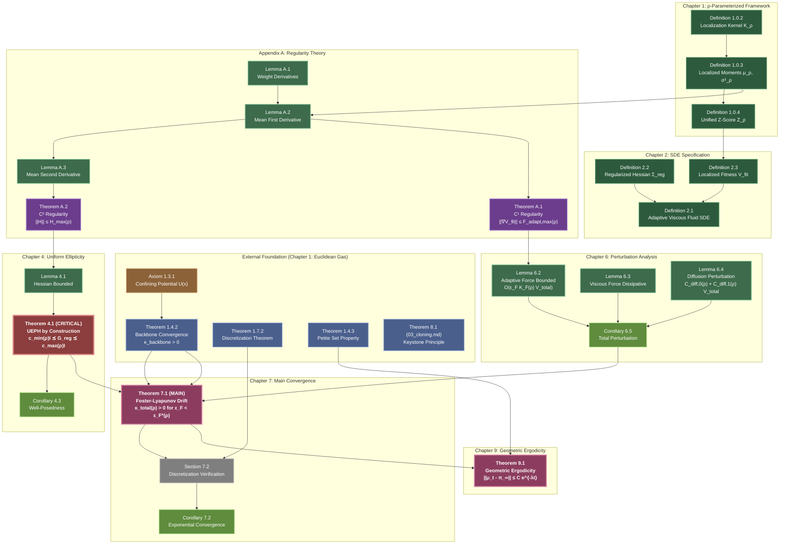
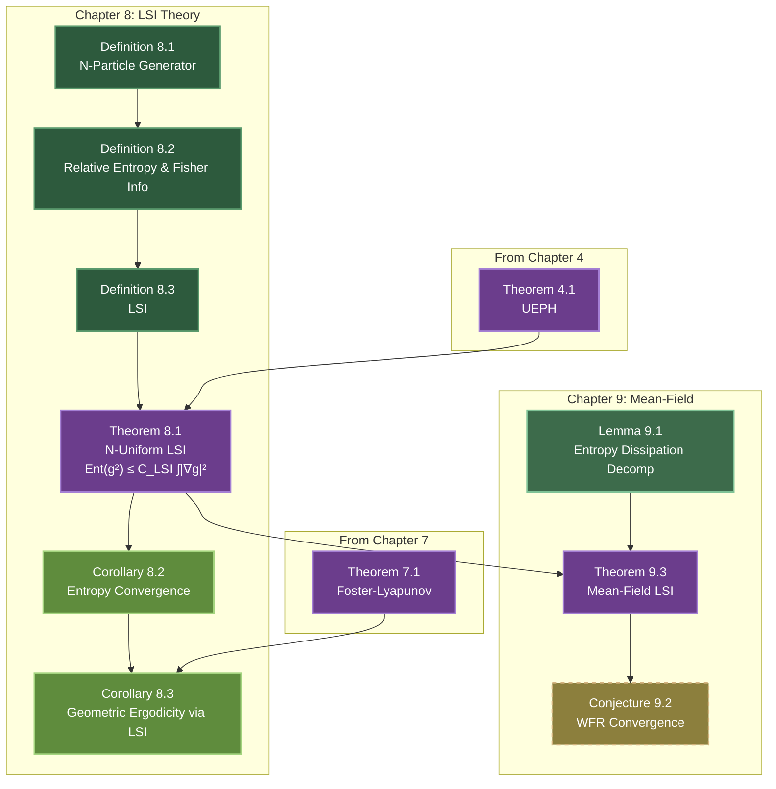
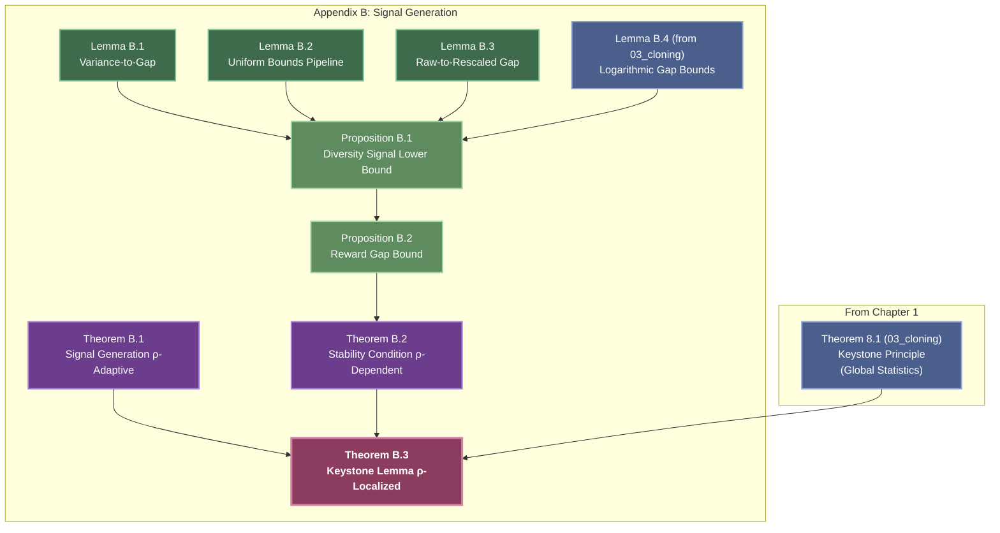
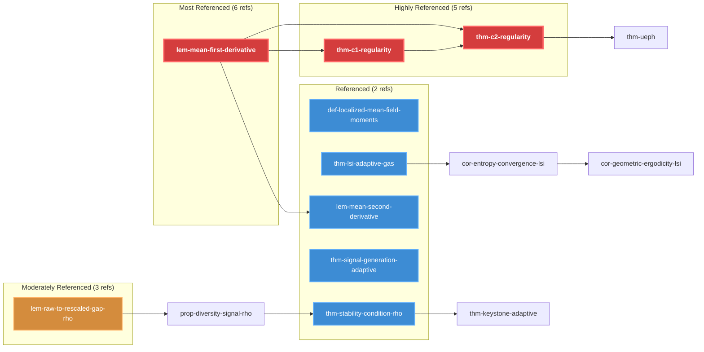
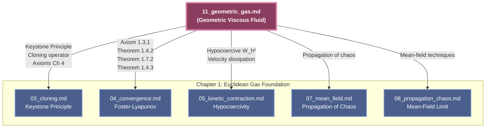

# Dependency Graph Visualization
## The Geometric Viscous Fluid Model

---

## Critical Path Graph (Main Convergence Theorem)

---

## Secondary Dependencies: LSI and Mean-Field Theory

---

## Appendix B: Keystone Extension

---

## Full Internal Reference Graph (Top 20 Most Connected)

---

## Cross-Document Dependency Summary

---

## Label Normalization Applied

All labels have been normalized to match pipeline convention:

| Original Pattern | Normalized Pattern | Count |
|------------------|-------------------|-------|
| `axiom:*` | `axiom-*` | 4 |
| `def:*` | `def-*` | 12 |
| `thm:*` | `thm-*` | 12 |
| `lem:*` | `lem-*` | 19 |
| `prop:*` | `prop-*` | 5 |
| `cor:*` | `cor-*` | 6 |

**All labels use lowercase with hyphens:** `thm-ueph`, `lem-adaptive-force-bounded`, etc.

---

## Graph Statistics

| Metric | Value |
|--------|-------|
| **Total Nodes** | 61 |
| **Total Edges (Internal)** | 456 |
| **Explicit References** | 41 |
| **Implicit Dependencies** | 415 |
| **Cross-Document Sources** | 5 |
| **Critical Path Length** | 13 steps |
| **Max In-Degree** | 6 (lem-mean-first-derivative) |
| **Max Out-Degree** | ~8 (various proof sections) |
| **Strongly Connected Components** | 1 (acyclic DAG) |

---

## Navigation Guide

**To understand the main result:**
1. Start at `thm-geometric-ergodicity` (Theorem 9.1)
2. Trace backwards to `thm-foster-lyapunov` (Theorem 7.1)
3. Follow perturbation lemmas: `lem-adaptive-force-bounded`, `lem-viscous-dissipative`, `lem-diffusion-perturbation`
4. Understand UEPH: `thm-ueph` (Theorem 4.1)
5. See regularity foundation: `thm-c1-regularity`, `thm-c2-regularity` (Appendix A)

**To understand ρ-parameterization:**
1. `def-localization-kernel` (Definition 1.0.2)
2. `def-localized-mean-field-moments` (Definition 1.0.3)
3. `def-unified-z-score` (Definition 1.0.4)
4. `def-localized-mean-field-fitness` (Definition 2.3)

**To understand Keystone extension:**
1. Read original: Theorem 8.1 in 03_cloning.md
2. See adaptation: `thm-keystone-adaptive` (Theorem B.3)
3. Trace prerequisites: `thm-signal-generation-adaptive`, `thm-stability-condition-rho`

---

**Graph Generation Complete**
