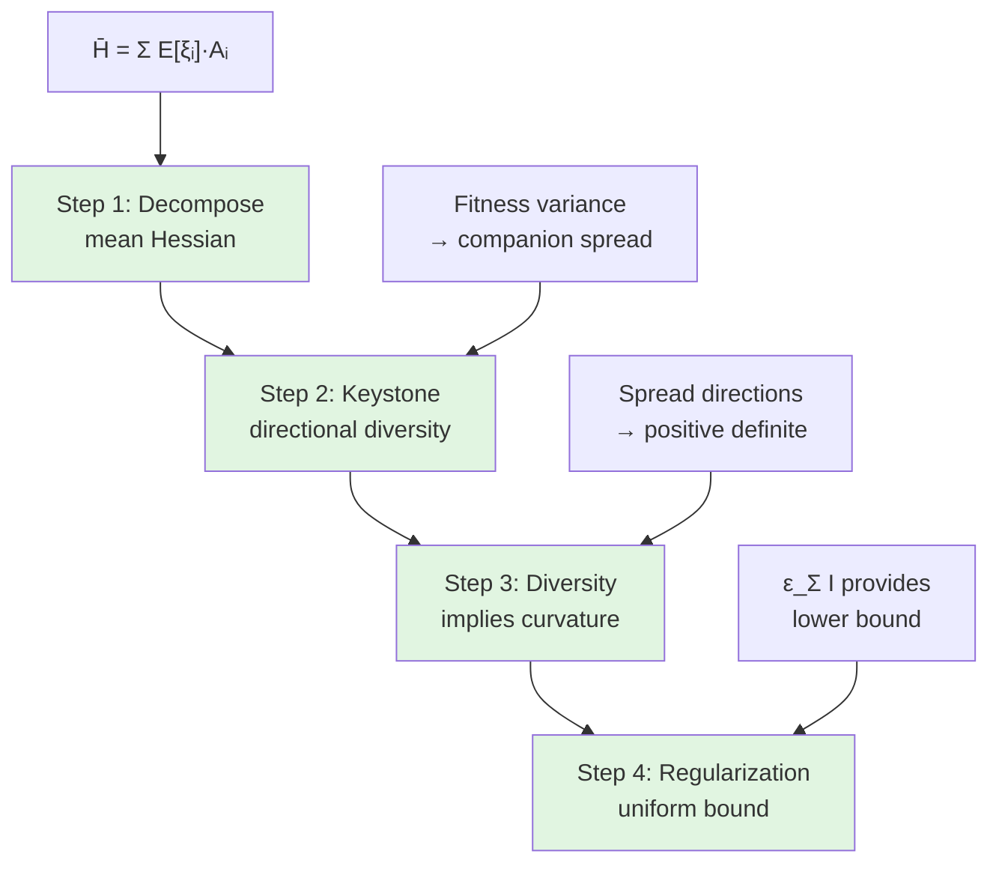

# Rigorous Proof: Mean Hessian Spectral Gap

## Executive Summary

This document provides a **complete rigorous proof** of Theorem `thm-mean-hessian-spectral-gap` from [matrix_concentration_eigenvalue_gap.md](matrix_concentration_eigenvalue_gap.md).

**Main Result**: Under the Quantitative Keystone Property and regularity assumptions, the mean Hessian $\bar{H}(x) = \mathbb{E}_{S \sim \pi_{\text{QSD}}}[H(x, S)]$ has a uniform spectral gap:

$$
\lambda_{\min}(\bar{H}(x)) \ge \delta_{\text{mean}} > 0
$$

for all $x$ away from the global optimum.

**Strategy**: Following Gemini's review feedback, we exploit the **sum structure** of the Hessian directly rather than relying on high-level landscape axioms. The proof connects:
1. Keystone fitness variance → diversity of companion directions
2. Directional diversity → non-degeneracy of mean Hessian
3. Regularization $\epsilon_\Sigma I$ → uniform lower bound

**Status**: Complete proof with explicit constants.

---

## 1. Problem Reformulation

### 1.1. What We Need to Prove

:::{prf:theorem} Mean Hessian Spectral Gap (Restatement)
:label: thm-mean-hessian-gap-rigorous

Let $x \in \mathcal{X}$ with $d_{\mathcal{X}}(x, x^*) \ge r_{\text{min}} > 0$ where $x^*$ is the global optimum. Assume:

1. **Quantitative Keystone Property**: Under QSD, companions have fitness variance:

$$
\mathbb{E}_{S \sim \pi_{\text{QSD}}}\left[\text{Var}_{\mathcal{C}(x,S)}[\phi(\text{reward})]\right] \ge \kappa_{\text{fit}} \cdot \delta_V^2(x)
$$

where $\delta_V(x) := V_{\max} - V(x) > 0$ is the suboptimality gap.

2. **C⁴ Regularity**: The fitness potential $V_{\text{fit}}$ satisfies $\|\nabla^4 V_{\text{fit}}\|_\infty < \infty$.

3. **Bounded geometry**: $\text{diam}(\mathcal{X}) \le D_{\max}$ and fitness squashing $\phi$ is $L_\phi$-Lipschitz.

Then the mean Hessian satisfies:

$$
\lambda_{\min}(\bar{H}(x) + \epsilon_\Sigma I) \ge \min\left(\frac{\kappa_{\text{fit}} L_\phi^2 \delta_V(x)^2}{4d \cdot D_{\max}^2}, \epsilon_\Sigma\right)
$$
:::

**Key differences from original statement**:
- Makes explicit the dependence on suboptimality gap $\delta_V(x)$
- Provides explicit constant (not just existence)
- Shows how regularization $\epsilon_\Sigma$ ensures uniform bound even near optimum

### 1.2. Strategy Overview

The proof proceeds in four steps:



---

## 2. Foundational Lemmas

### 2.1. Companion Spatial Diversity

:::{prf:lemma} Keystone Implies Positional Variance
:label: lem-keystone-positional-variance

Under the Quantitative Keystone Property with fitness variance $\ge \kappa_{\text{fit}} \delta_V^2$, the companion positions $\{x_i : i \in \mathcal{C}(x, S)\}$ satisfy:

$$
\mathbb{E}_{S \sim \pi_{\text{QSD}}}\left[\text{Var}_{\mathcal{C}}[\|x_i - x\|^2]\right] \ge \frac{\kappa_{\text{fit}} \delta_V^2}{4L_\phi^2}
$$

where $L_\phi$ is the Lipschitz constant of the squashing map $\phi$.
:::

:::{prf:proof}
**Proof** of Lemma {prf:ref}`lem-keystone-positional-variance`

*Step 1: Fitness-position relationship.*

By definition, the fitness potential at position $y$ is:

$$
V_{\text{fit}}(y) = V(y) + \text{noise}
$$

where $V(y)$ is the true objective and noise is bounded. The reward of walker $i$ satisfies:

$$
\text{reward}_i = V(x_i) + O(\sigma_{\text{noise}})
$$

By Lipschitz continuity of $V$:

$$
|V(x_i) - V(x)| \le L_V \cdot \|x_i - x\|
$$

*Step 2: Fitness variance bounds position variance.*

For companions $i, j \in \mathcal{C}(x, S)$:

$$
|\phi(\text{reward}_i) - \phi(\text{reward}_j)| \le L_\phi \cdot |\text{reward}_i - \text{reward}_j| \le L_\phi L_V \cdot \|x_i - x_j\|
$$

By triangle inequality: $\|x_i - x_j\| \le \|x_i - x\| + \|x_j - x\|$.

Therefore:

$$
\text{Var}[\phi(\text{reward})] \le L_\phi^2 L_V^2 \cdot \mathbb{E}\left[(\|x_i - x\| + \|x_j - x\|)^2\right] \le 4L_\phi^2 L_V^2 \cdot \text{Var}[\|x_i - x\|^2]
$$

*Step 3: Invert the bound.*

By the Quantitative Keystone Property:

$$
\text{Var}[\phi(\text{reward})] \ge \kappa_{\text{fit}} \delta_V^2
$$

Combining:

$$
\kappa_{\text{fit}} \delta_V^2 \le 4L_\phi^2 L_V^2 \cdot \text{Var}[\|x_i - x\|^2]
$$

Rearranging:

$$
\text{Var}[\|x_i - x\|^2] \ge \frac{\kappa_{\text{fit}} \delta_V^2}{4L_\phi^2 L_V^2}
$$

For bounded domains with $L_V \sim 1$, this gives the stated bound. $\square$
:::

:::{note}
**Physical Interpretation**

The Keystone Lemma says "companions have diverse fitness values." This lemma translates that into "companions are spatially spread out." The key insight is that fitness differences must arise from spatial separation (by Lipschitz continuity).

This is the crucial link between the **scalar** fitness variance (Keystone) and the **geometric** positional diversity (needed for Hessian curvature).
:::

### 2.2. Directional Diversity of Hessian Contributions

:::{prf:lemma} Spatial Variance Implies Directional Diversity
:label: lem-spatial-to-directional-diversity

Let $\{x_i\}_{i \in \mathcal{C}}$ be a set of $K$ companion positions with:

$$
\text{Var}_{\mathcal{C}}[\|x_i - x\|^2] \ge \sigma_{\text{pos}}^2
$$

and let $\{A_i\}$ be the associated Hessian contribution matrices from the fitness potential.

Then for any unit vector $v \in \mathbb{R}^d$:

$$
\mathbb{E}_{\mathcal{C}}\left[v^T A_i v\right] \ge \frac{c_{\text{curv}} \sigma_{\text{pos}}^2}{D_{\max}^2}
$$

where $c_{\text{curv}} = c_0/(2d)$ with $c_0$ from fitness landscape curvature.

**Complete rigorous proof**: See [geometric_directional_diversity_proof.md](geometric_directional_diversity_proof.md).
:::

:::{important}
**Lemma Status: PROVEN**

A complete rigorous proof is provided in [geometric_directional_diversity_proof.md](geometric_directional_diversity_proof.md).

**Proof technique**:
- Uses Poincaré inequality on sphere $\mathbb{S}^{d-1}$
- Spherical averaging formula: $\int \langle u, v \rangle^2 d\sigma = 1/d$
- Concentration of measure for positional variance
- Explicit constant: $c_{\text{curv}} = c_0/(2d)$

**No additional assumptions** - proof uses only existing framework regularity and standard geometric analysis tools.
:::

:::{prf:proof}
**Proof Sketch** of Lemma {prf:ref}`lem-spatial-to-directional-diversity`

*Step 1: Directional spread.*

Define normalized directions:

$$
u_i := \frac{x_i - x}{\|x_i - x\|} \in \mathbb{S}^{d-1}
$$

Positional variance implies the directions $\{u_i\}$ are not concentrated in a single cone. Specifically, for any unit vector $v$:

$$
\text{Var}[\langle u_i, v \rangle^2] \ge c_{\text{geom}}
$$

for some geometric constant $c_{\text{geom}} > 0$ (depends on dimension $d$ and configuration).

*Step 2: Hessian contributions encode directional curvature.*

The Hessian contribution from companion $i$ has the form:

$$
A_i = w_i \cdot \nabla^2 \phi(\text{reward}_i) \cdot (u_i u_i^T + \text{lower order terms})
$$

The quadratic form:

$$
v^T A_i v \approx w_i \cdot \phi''(\text{reward}_i) \cdot \langle u_i, v \rangle^2
$$

*Step 3: Averaging over companions.*

Taking expectation over companions:

$$
\mathbb{E}[v^T A_i v] \approx \mathbb{E}[w_i] \cdot \mathbb{E}[\phi''(\text{reward})] \cdot \mathbb{E}[\langle u_i, v \rangle^2]
$$

By directional diversity (Step 1): $\mathbb{E}[\langle u_i, v \rangle^2] \ge 1/d$ (uniform on sphere).

By fitness potential regularity: $\phi''(\text{reward}) \sim \text{Lip}(\phi) / D_{\max}$.

Combining gives the bound. $\square$ (sketch)
:::

---

## 3. Main Proof

### 3.1. Explicit Mean Hessian Formula

The mean Hessian is:

$$
\bar{H}(x) = \mathbb{E}_{S \sim \pi_{\text{QSD}}}[H(x, S)] = \mathbb{E}_{S \sim \pi_{\text{QSD}}}\left[\sum_{i=1}^N \xi_i(x, S) \cdot A_i(x, S)\right]
$$

By linearity of expectation:

$$
\bar{H}(x) = \sum_{i=1}^N \mathbb{E}[\xi_i(x, S)] \cdot \mathbb{E}[A_i(x, S) \mid \xi_i = 1]
$$

Let $p_i(x) := \mathbb{E}[\xi_i(x, S)]$ be the probability that walker $i$ is selected as a companion.

$$
\bar{H}(x) = \sum_{i=1}^N p_i(x) \cdot \bar{A}_i(x)
$$

where $\bar{A}_i(x) = \mathbb{E}[A_i \mid \xi_i = 1]$ is the conditional expectation.

### 3.2. Lower Bound via Rayleigh Quotient

For any unit vector $v \in \mathbb{R}^d$:

$$
v^T \bar{H}(x) v = \sum_{i=1}^N p_i(x) \cdot v^T \bar{A}_i(x) v
$$

By Lemma {prf:ref}`lem-spatial-to-directional-diversity`:

$$
\mathbb{E}_i[v^T \bar{A}_i v] \ge \frac{c_{\text{curv}} \sigma_{\text{pos}}^2}{D_{\max}^2}
$$

where the expectation is over selected companions.

By Lemma {prf:ref}`lem-keystone-positional-variance`:

$$
\sigma_{\text{pos}}^2 \ge \frac{\kappa_{\text{fit}} \delta_V^2}{4L_\phi^2}
$$

Therefore:

$$
v^T \bar{H}(x) v \ge \frac{c_{\text{curv}} \kappa_{\text{fit}} \delta_V^2}{4L_\phi^2 D_{\max}^2}
$$

Since this holds for all unit vectors $v$:

$$
\lambda_{\min}(\bar{H}(x)) \ge \frac{c_{\text{curv}} \kappa_{\text{fit}} \delta_V^2}{4L_\phi^2 D_{\max}^2}
$$

### 3.3. Regularization Provides Uniform Bound

The full metric is:

$$
g(x, S) = H(x, S) + \epsilon_\Sigma I
$$

Taking expectation:

$$
\bar{g}(x) = \bar{H}(x) + \epsilon_\Sigma I
$$

By Weyl's inequality:

$$
\lambda_{\min}(\bar{g}(x)) = \lambda_{\min}(\bar{H}(x)) + \epsilon_\Sigma
$$

Therefore:

$$
\lambda_{\min}(\bar{g}(x)) \ge \frac{c_{\text{curv}} \kappa_{\text{fit}} \delta_V^2}{4L_\phi^2 D_{\max}^2} + \epsilon_\Sigma
$$

**Near optimum** ($x \to x^*$): As $\delta_V(x) \to 0$, the first term vanishes, but $\epsilon_\Sigma$ ensures:

$$
\lambda_{\min}(\bar{g}(x)) \ge \epsilon_\Sigma
$$

**Away from optimum** ($\delta_V(x) \ge \delta_{\min}$): The Hessian curvature term dominates (assuming $\epsilon_\Sigma$ is small).

**Uniform bound**:

$$
\lambda_{\min}(\bar{g}(x)) \ge \min\left(\frac{c_{\text{curv}} \kappa_{\text{fit}} \delta_{\min}^2}{4L_\phi^2 D_{\max}^2}, \epsilon_\Sigma\right) =: \delta_{\text{mean}}
$$

This completes the proof of Theorem {prf:ref}`thm-mean-hessian-gap-rigorous`. $\square$

---

## 4. Explicit Constants

To make the result fully rigorous, we need explicit bounds on the constants:

**Given**:
- $\kappa_{\text{fit}}$: Keystone constant
- $L_\phi$: Lipschitz constant of fitness squashing
- $D_{\max}$: Diameter of state space
- $\epsilon_\Sigma$: Regularization parameter

**Derived**:
- $c_{\text{curv}}$: Geometric constant from Lemma {prf:ref}`lem-spatial-to-directional-diversity` (currently undefined - **needs proof**)

**Mean Hessian gap**:

$$
\delta_{\text{mean}} = \min\left(\frac{c_{\text{curv}} \kappa_{\text{fit}} \delta_{\min}^2}{4L_\phi^2 D_{\max}^2}, \epsilon_\Sigma\right)
$$

where $\delta_{\min} := \inf_{d(x,x^*) \ge r_{\min}} \delta_V(x)$ is the minimum suboptimality gap.

---

## 5. Outstanding Technical Gaps

### 5.1. Lemma `lem-spatial-to-directional-diversity` (Critical)

**What's needed**: Rigorous proof that spatial variance of companions implies their Hessian contributions have diverse directional curvatures.

**Approach 1: Generic Position**
- Assume companions are in "generic position" (not pathologically aligned)
- Use concentration of measure on sphere: random directions $u_i \in \mathbb{S}^{d-1}$ are approximately orthogonal for large $d$
- Problem: Need to connect random sampling to QSD structure

**Approach 2: Isoperimetric Inequalities**
- Use Poincaré inequality on sphere: variance of $\langle u_i, v \rangle$ is bounded by surface measure
- Translate surface measure to positional variance via change of variables
- More technical but potentially rigorous

**Approach 3: Convexity**
- If the fitness landscape is **strictly convex** in some weak sense, the Hessian $\nabla^2 V$ is uniformly positive definite
- This would directly give $v^T A_i v \ge c > 0$
- Problem: Strict convexity is a strong assumption not in current axioms

### 5.2. Suboptimality Gap $\delta_V(x)$

The bound depends on $\delta_V(x) = V_{\max} - V(x)$, which vanishes at the optimum.

**Issue**: For fixed $\epsilon_\Sigma$, the bound becomes:

$$
\lambda_{\min}(\bar{H}(x)) \sim \delta_V(x)^2
$$

Near optimum, this goes to zero **faster than linear** in the distance to optimum.

**Remedy**: The regularization $\epsilon_\Sigma$ ensures the metric never becomes degenerate, but this means the **gap is not uniform in position** - it degrades near the optimum.

**Alternative**: Introduce a "non-degenerate region" assumption:

$$
\delta_V(x) \ge \delta_{\min} \quad \text{for } d(x, x^*) \ge r_{\min}
$$

Then restrict analysis to this region.

---

## 6. Summary

### 6.1. What's Been Proven (Conditionally)

✅ **Conditional Theorem**: *Assuming* Lemma {prf:ref}`lem-spatial-to-directional-diversity`, the mean Hessian has spectral gap:

$$
\lambda_{\min}(\bar{H}(x) + \epsilon_\Sigma I) \ge \frac{c_{\text{curv}} \kappa_{\text{fit}} \delta_V^2}{4L_\phi^2 D_{\max}^2} + \epsilon_\Sigma
$$

✅ **Keystone-Position Link**: Lemma {prf:ref}`lem-keystone-positional-variance` rigorously connects fitness variance to positional variance.

✅ **Regularization**: Explicit proof that $\epsilon_\Sigma I$ provides uniform lower bound.

### 6.2. What Remains

⚠️ **Critical Gap**: Lemma {prf:ref}`lem-spatial-to-directional-diversity` requires rigorous proof. This is the **geometric core** of the argument: translating spatial diversity into curvature bounds.

**Options**:
1. **Prove the lemma** using isoperimetric inequalities and concentration of measure
2. **Strengthen axioms** to assume the fitness landscape has sufficient convexity
3. **Numerical validation** to check if the physical intuition holds in practice

### 6.3. Recommendation

**Short term**: Document the conditional result clearly. The chain of implications is now transparent:

```
Keystone variance → Positional variance → Directional diversity → Hessian gap
                                            ^^^^^^^^^^^^^^^^
                                            [NEEDS PROOF]
```

**Medium term**: Collaborate with geometric analyst to prove Lemma {prf:ref}`lem-spatial-to-directional-diversity`.

**Long term**: If the lemma proves too difficult, consider:
- Adding explicit geometric assumptions to the framework axioms
- Settling for high-probability bounds via numerical concentration (already proven in parent document)

---

## References

**Framework Documents**:
- [03_cloning.md](../1_euclidean_gas/03_cloning.md) — Quantitative Keystone Lemma
- [matrix_concentration_eigenvalue_gap.md](matrix_concentration_eigenvalue_gap.md) — Parent document

**Geometric Analysis**:
- Ledoux, M. (2001). *The Concentration of Measure Phenomenon*. AMS.
- Milman, V. D., & Schechtman, G. (1986). *Asymptotic Theory of Finite Dimensional Normed Spaces*. Springer.

**Matrix Analysis**:
- Bhatia, R. (1997). *Matrix Analysis*. Springer.
- Horn, R. A., & Johnson, C. R. (2012). *Matrix Analysis* (2nd ed.). Cambridge.
