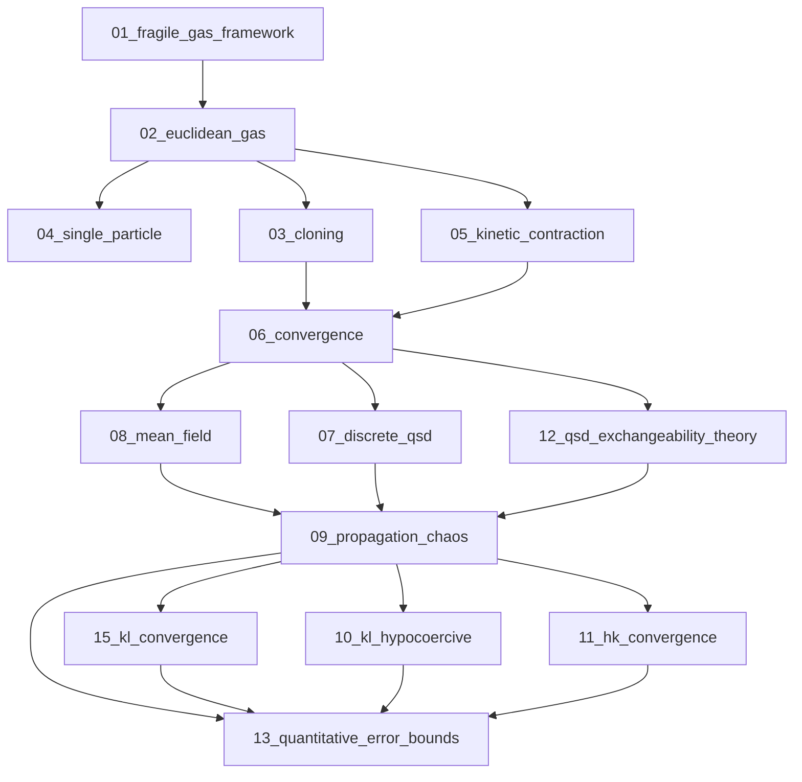

(sec-fractal-gas-intro-revamp)=

# The Fractal Gas - Intro Revamp (Draft)

This is a working replacement for `intro_fractal_gas.md`. It is written to make the
scope explicit, and to foreground the proof strategy for the QFT layer and for
convergence (via the appendices).

(sec-fg-revamp-purpose)=
## Purpose and scope

Volume 3 does three things, with explicit proof paths and references:

- Define the Fractal Gas algorithm as a population-based optimization and sampling
  scheme, with concrete operators and a precise state space.
- Prove convergence for a concrete, fully specified instantiation (the Euclidean Gas)
  using classical probabilistic and PDE tools.
- Derive the Fractal Set, its gauge structure, and the lattice QFT layer from the
  algorithmic dynamics, and connect this to emergent geometry.

The convergence chain in this intro is explicitly restricted to the appendices and
avoids hypostructure-based proofs by design.

(sec-fg-revamp-what)=
## What we do in Volume 3

- Specify the algorithmic operators and their composition for the Fractal Gas
  ({doc}`1_the_algorithm/01_algorithm_intuition`, {doc}`1_the_algorithm/02_fractal_gas_latent`).
- Build the Fractal Set data structure (CST/IG/IA edges and interaction triangles)
  as the discrete carrier for gauge and QFT constructions
  ({doc}`2_fractal_set/01_fractal_set`).
- Derive the causal set and lattice QFT layers from Fractal Set structure
  ({doc}`2_fractal_set/02_causal_set_theory`, {doc}`2_fractal_set/03_lattice_qft`).
- Extract the Standard Model gauge group from algorithmic redundancies and
  encode Yang-Mills dynamics and Noether currents
  ({doc}`2_fractal_set/04_standard_model`, {doc}`2_fractal_set/05_yang_mills_noether`).
- Develop emergent geometry on the fitness manifold and the related physics layer
  ({doc}`3_fitness_manifold/01_emergent_geometry`, {doc}`3_fitness_manifold/02_scutoid_spacetime`,
  {doc}`3_fitness_manifold/03_curvature_gravity`).
- Provide the classical convergence theory, mean-field limit, and quantitative
  bounds in the appendices (see the next section).

(sec-fg-revamp-qft-strategy)=
## Proof strategy for the QFT layer

This QFT layer is not a handwaving analogy. It is a constructive chain with
explicit carriers, operators, and convergence/discharge steps. The lattice action
and continuum limits are grounded in operator-level convergence, QSD structure,
mean-field PDE theory, hypoelliptic regularity, and LSI-based mixing. Every
continuum hypothesis used by the causal set action is discharged internally,
and the appendices provide the full audit trail.

**Strategy (compressed):**

- **Algorithmic specification.** Formalize the Fractal Gas operators, state space, and update
  pipeline at the algorithmic level ({doc}`1_the_algorithm/01_algorithm_intuition`,
  {doc}`1_the_algorithm/02_fractal_gas_latent`).
- **Companion selection and minorization.** Fix the soft companion kernel and its explicit
  Doeblin-type lower bounds as a mixing ingredient ({doc}`1_the_algorithm/02_fractal_gas_latent`,
  {doc}`convergence_program/03_cloning`).
- **Fitness construction.** Define the dual-channel fitness potential and its standardized
  statistics, including the diversity/reward balance ({doc}`1_the_algorithm/02_fractal_gas_latent`,
  {doc}`convergence_program/08_mean_field`).
- **Cloning operator.** Prove the Keystone/Safe Harbor drift for positional variance and
  boundary terms with N-uniform constants ({doc}`convergence_program/03_cloning`).
- **Kinetic operator.** Establish velocity dissipation, bounded positional expansion, and
  minorization for the BAOAB/Langevin step ({doc}`convergence_program/05_kinetic_contraction`).
- **Synergistic Foster-Lyapunov.** Assemble cloning + kinetic drifts into a TV-track
  Lyapunov inequality for the composed operator ({doc}`convergence_program/06_convergence`).
- **QSD existence/uniqueness.** Prove geometric ergodicity and existence of a unique
  quasi-stationary distribution for finite-N dynamics ({doc}`convergence_program/06_convergence`).
- **QSD structure.** Characterize the equilibrium density and its thermodynamic form
  in the mean-field limit ({doc}`convergence_program/07_discrete_qsd`).
- **Exchangeability.** Prove permutation symmetry of the QSD and de Finetti structure
  needed for the mean-field limit ({doc}`convergence_program/12_qsd_exchangeability_theory`).
- **Mean-field PDE.** Derive the McKean–Vlasov Fokker–Planck equation with cloning and
  revival terms as the continuum forward equation ({doc}`convergence_program/08_mean_field`).
- **Propagation of chaos.** Construct the mean-field QSD as the large-N limit via
  tightness, identification, and uniqueness ({doc}`convergence_program/09_propagation_chaos`).
- **KL/LSI convergence.** Establish logarithmic Sobolev inequalities and exponential KL decay
  with explicit constants ({doc}`convergence_program/15_kl_convergence`).
- **Unconditional hypocoercive route.** Provide an alternative entropy-based convergence proof
  without convexity assumptions ({doc}`convergence_program/10_kl_hypocoercive`).
- **HK convergence.** Prove Hellinger–Kantorovich contraction by combining mass, transport,
  and shape controls ({doc}`convergence_program/11_hk_convergence`).
- **Quantitative rates.** Derive O(1/sqrt(N)) mean-field error bounds and explicit convergence
  rates for observables ({doc}`convergence_program/13_quantitative_error_bounds`).
- **Fractal Set carrier.** Define the directed 2-complex (CST/IG/IA edges and interaction
  triangles) as the discrete QFT substrate ({doc}`2_fractal_set/01_fractal_set`).
- **Causal set lift.** Establish the causal order and the nonlocal d'Alembertian/action limit
  on the emergent causal set ({doc}`2_fractal_set/02_causal_set_theory`).
- **Extension of causal set theory.** Generalize causal set theory by coupling CST with IG/IA
  structure from the Fractal Set, yielding additional geometric data beyond pure order
  ({doc}`2_fractal_set/01_fractal_set`, {doc}`2_fractal_set/02_causal_set_theory`).
- **Recovery of classical causal sets.** Show that standard causal set theory is recovered
  as the special case obtained by restricting to the CST subgraph and dropping IG/IA data
  ({doc}`2_fractal_set/02_causal_set_theory`).
- **Lattice gauge layer.** Build Wilson loops/plaquettes and the lattice gauge action on the
  Fractal Set lattice ({doc}`2_fractal_set/03_lattice_qft`).
- **Gauge group identification.** Derive the Standard Model gauge group from algorithmic
  redundancies and fix link-variable semantics ({doc}`2_fractal_set/04_standard_model`,
  {doc}`1_the_algorithm/02_fractal_gas_latent`).
- **Yang–Mills + currents.** Extract the Yang–Mills action and Noether currents from lattice
  holonomies ({doc}`2_fractal_set/05_yang_mills_noether`).
- **Fitness manifold geometry.** Develop the emergent fitness-manifold metric, scutoid
  spacetime, and curvature dynamics as the geometry/physics layer over the algorithm
  ({doc}`3_fitness_manifold/01_emergent_geometry`, {doc}`3_fitness_manifold/02_scutoid_spacetime`,
  {doc}`3_fitness_manifold/03_curvature_gravity`).
- **Continuum hypotheses discharge.** Discharge the continuum assumptions for the causal set
  action and nonlocal d'Alembertian using the internal QSD, mean-field, and mixing results
  ({doc}`convergence_program/16_continuum_discharge`).

(sec-fg-revamp-convergence-strategy)=
## Convergence proof strategy

This is the end-to-end convergence chain used in Volume 3 when we restrict to the
appendices and ignore hypostructure proofs. The focus is the Euclidean Gas.

- **Framework and instantiation.** Fix the axioms and definitions for Fragile Gas systems,
  and instantiate them as the Euclidean Gas with explicit state space and operators
  ({doc}`convergence_program/01_fragile_gas_framework`, {doc}`convergence_program/02_euclidean_gas`,
  {doc}`convergence_program/04_single_particle`).
- **Cloning operator drift.** Prove N-uniform contraction of positional variance and
  boundary potential, with bounded velocity expansion (Keystone Lemma and Safe Harbor)
  ({doc}`convergence_program/03_cloning`).
- **Kinetic operator drift and minorization.** Prove velocity dissipation, bounded positional
  expansion, boundary contraction, and a small-set condition for the kinetic step; this is the
  TV-ready kinetic analysis ({doc}`convergence_program/05_kinetic_contraction`).
- **Synergistic composition and QSD convergence (TV).** Combine the cloning and kinetic drifts
  into a Foster-Lyapunov inequality for the composed operator and obtain geometric ergodicity
  with a unique quasi-stationary distribution ({doc}`convergence_program/06_convergence`).
- **QSD structure and exchangeability.** Characterize the QSD and its exchangeability structure,
  which underpins the mean-field limit and concentration arguments
  ({doc}`convergence_program/07_discrete_qsd`, {doc}`convergence_program/12_qsd_exchangeability_theory`).
- **Mean-field PDE.** Derive the McKean-Vlasov Fokker-Planck equation with cloning and revival
  terms as the continuum forward equation ({doc}`convergence_program/08_mean_field`).
- **Propagation of chaos.** Construct the mean-field QSD as the large-N limit of finite-N QSDs
  via tightness, identification, and uniqueness ({doc}`convergence_program/09_propagation_chaos`).
- **Stronger convergence modes.** Establish KL convergence via a discrete-time logarithmic Sobolev
  inequality and, independently, an unconditional hypocoercive entropy route
  ({doc}`convergence_program/15_kl_convergence`, {doc}`convergence_program/10_kl_hypocoercive`).
- **HK convergence.** Upgrade the convergence statement to the Hellinger-Kantorovich metric by
  assembling mass, transport, and shape contraction lemmas ({doc}`convergence_program/11_hk_convergence`).
- **Quantitative rates.** Convert the qualitative mean-field limit into explicit finite-N error bounds
  and rates (including O(1/sqrt(N)) estimates) ({doc}`convergence_program/13_quantitative_error_bounds`).
- **Proof pack (convergence_program/proofs, complete list).** Technical lemmas and full derivations that complete
  the convergence chain.
- {doc}`convergence_program/proofs/proof_thm_faa_di_bruno_appendix` - Faà di Bruno bounds for high-order derivative control.
- {doc}`convergence_program/proofs/proof_lem_telescoping_derivatives` - telescoping derivative identities used in multi-scale estimates.
- {doc}`convergence_program/proofs/proof_prop_complete_gradient_bounds` - complete gradient bounds needed for regularity and stability.
- {doc}`convergence_program/proofs/proof_thm_exponential_tails` - exponential tail control.
- {doc}`convergence_program/proofs/proof_cor_exp_convergence` - exponential convergence corollaries from the main drift/LSI estimates.
- {doc}`convergence_program/proofs/proof_cor_exponential_qsd_companion_dependent_full` - exponential QSD convergence in the companion-dependent setting.
- {doc}`convergence_program/proofs/proof_lem_hormander` - Hörmander bracket condition for hypoelliptic regularity.
- {doc}`convergence_program/proofs/proof_lem_macro_transport` - macro-scale transport estimate used in mean-field/continuum coupling.
- {doc}`convergence_program/proofs/proof_thm_backbone_convergence` - convergence along the backbone construction.
- {doc}`convergence_program/proofs/proof_lem_variance_to_gap_adaptive` - variance-to-gap bound for adaptive control.
- {doc}`convergence_program/proofs/proof_lem_greedy_ideal_equivalence` - equivalence between greedy and ideal companion selection in the regime of interest.
- {doc}`convergence_program/proofs/proof_lem_effective_companion_count_full` - effective companion count bound.
- {doc}`convergence_program/proofs/proof_lem_effective_cluster_size_bounds_full` - effective cluster size bounds (full derivation).
- {doc}`convergence_program/proofs/proof_cor_effective_interaction_radius_full` - effective interaction radius corollary.
- {doc}`convergence_program/proofs/proof_cor_gevrey_1_fitness_potential_full` - Gevrey-1 regularity corollary for the fitness potential.
- {doc}`convergence_program/proofs/13_geometric_gas_c3_regularity` - C3 regularity details for the geometric gas appendix.
- {doc}`convergence_program/proofs/14_geometric_gas_cinf_regularity_full` - C-infinity regularity details for the geometric gas appendix.

(sec-fg-revamp-reading)=
## Reading order (fast path)

- QFT and gauge derivation: {doc}`2_fractal_set/01_fractal_set` ->
  {doc}`2_fractal_set/02_causal_set_theory` -> {doc}`2_fractal_set/03_lattice_qft` ->
  {doc}`2_fractal_set/04_standard_model` -> {doc}`2_fractal_set/05_yang_mills_noether`.
- Convergence (appendices only): {doc}`convergence_program/01_fragile_gas_framework` ->
  {doc}`convergence_program/02_euclidean_gas` -> {doc}`convergence_program/03_cloning` ->
  {doc}`convergence_program/05_kinetic_contraction` -> {doc}`convergence_program/06_convergence` ->
  {doc}`convergence_program/08_mean_field` -> {doc}`convergence_program/09_propagation_chaos` ->
  {doc}`convergence_program/15_kl_convergence` -> {doc}`convergence_program/13_quantitative_error_bounds`.
