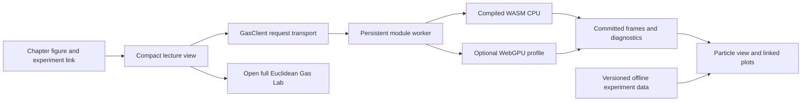

# Interactive experiments for Volume 2, Parts I–IV

Authoring and implementation proposal · 12 September 2026 · scientific review incorporated after the first teaching release

Implementation status: all 42 experiment IDs have browser views, computed plots,
controls, and chapter placements. Fourteen use the Rust/WASM engine, including two
hybrid engine/reference views; 28 use explicitly identified mathematical reference
models. The shared host retains a warm CPU WASM worker. The scientific review
corrections below align the implemented observables, conditioning, reference
formulas, and uncertainty displays with the corresponding lessons.

See the [implementation guide](../../../fractal-gas-web/web/euclidean-gas/lecture/README.md)
for runtime commands and the
[validation record](../../../fractal-gas-web/web/euclidean-gas/lecture/VALIDATION.md)
for numerical checks. **The catalog below is a broader design specification:**
extra tabs, parameter ranges, stage traces, offline studies, and engine hooks
remain proposals unless the implementation guide or the current view identifies
them as available. The table records the current teaching behavior affected by
the review; it does not promote those remaining proposals to implemented features.

| Experiment | Current implementation after scientific review |
|---|---|
| I-03 | Local statistics include the recipient by default, matching the chapter formula; a self-inclusion control makes the alternate convention explicit. |
| I-05 | The lecture and engine use force–drift–OU–drift–force BAOAB. Friction belongs to the OU stage, with innovation variance $T(1-e^{-2\gamma h})$. |
| I-06 | Three seeded populations expose finite-time well occupation and reward/force disagreement. |
| I-08 | An alive-conditioned **post-clone position law** handles persistence, revival, a single survivor, and extinction. Probability atoms and cumulative histogram counts are distinct from the latest 400 scatter samples. Kinetic propagation and a full joint position/velocity law remain extensions. |
| I-10 | Live spreading uses a constant diffusion factor; the spatially varying metric is a prescribed mathematical comparison. |
| II-01 | A central cluster with symmetric outer clusters gives nonempty high/low sets. The view reports the measured fitness gap, overlap, and center-shift correction before interpreting inward drift. |
| II-02 | Independent one-step samples have uncertainty intervals. The Gaussian-jump reference has constant positive drift; an unsupported fitted crossing is not reported as a stationary floor. |
| II-04–II-05 | The variance proxy is an upper envelope rather than a monotonicity statement about exact transport. OU comparisons use finite-time moments and sampling scales. |
| II-07 | The displayed contraction and floor belong to an explicitly constructed affine comparison model. |
| II-08 | The finite killed-chain view separates exact conditional shape from its survivor-limited empirical estimate and reports expected and observed survivor counts. |
| III-02 | Event-rate estimates carry sampling uncertainty; individual jump paths remain distinct from their expectations. |
| III-03 | Actual active-cloning and no-copy ensembles run at four population sizes. Whole-run intervals, final marginal variance, and permutation-calibrated pair histograms distinguish sampling scatter from dependence. |
| III-04 | Current-law expectations and standard errors accompany the generator residuals. A paired operator difference isolates the timestep term. |
| III-05–III-06 | Same-grid relaxation is distinguished from spatial approximation. Spectral resolution comparisons expose the finite-mode remainder in the source-balanced profile. |
| III-07–III-08 | Gaussian variance and repeated-label frequency are compared with finite-replica sampling scales. |
| IV-01 | The chapter's $G$, $\eta$, and rate define the modified entropy and decay envelope. A separate alternate-matrix curve illustrates why positive definiteness alone does not give the same dissipation inequality. |
| IV-02–IV-03 | The reference selector distinguishes reset invariance from killed-kernel quasi-stationarity. Smoothed-atom Hellinger comparisons expose the selected bandwidth. |
| IV-04 | Both Gaussian ratio orientations are displayed. The absorbing example compares ordinary KDE boundary bias with a normalized Dirichlet estimate and reports retained mass. |
| IV-05–IV-06 | Derivative checks include a finite-difference resolution comparison. External queries and fixed self-atom queries have distinct row-sum interpretations. |
| IV-07 | The tested useful Taylor radius is an error-tolerance diagnostic, accompanied by finite-order coefficient information; it is not an analytic convergence-radius certificate. |
| IV-08 | Fixed-order and shuffled-order greedy laws are separately enumerated on the shared derivative fixture. |
| IV-09 | Four independent Metropolis seeds, crossing counts, and start-group separation expose trapping. Metropolis transition counts are not assigned the kinetic engine's friction-dependent decay rate. |
| IV-10–IV-11 | The harmonic comparison distinguishes $O(h^2)$ covariance bias from $O(h^4)$ Gaussian KL bias. Sampled diffusion covariances carry entrywise standard errors for a prescribed Hessian. |
| IV-12 | The weighted-mean and energy ledgers remain direct identities. Gaps below numerical resolution are marked unresolved and accompanied by a Rayleigh upper bound. |
| IV-13–IV-14 | The budget uses stationary sampling variance and an absolute-error coupling bound, with separate empirical-error uncertainty. Timestep comparisons end at the same physical duration. |
| IV-15 | Pointwise feasibility allows $(N-1)p_*\le1$; equality requires uniform donor probabilities. The cloning control is named the saturation denominator, not a probability cap. |
| IV-16 | Four or eight independent replicas per group compare mean observables and sampling intervals. A narrow absorbing box produces measurable losses against a matched-seed unbounded control; the population card compares $N$ with $2N$. |

(sec-v2-demo-overview)=
## Purpose, scope, and reading map

Use the new **Rust Algorithmic Gas engine compiled to WebAssembly** as the common simulation runtime for a sequence of focused lecture experiments. Reuse the existing Euclidean Gas Lab's worker, configuration contracts, rendering primitives, and checkpoints. Each embedded experiment should answer one question at the point where the reader encounters it; the full Lab remains the place for unrestricted exploration.

This document interprets “warm compiled” as **WASM-compiled, with its module initialized before interaction**. Both aspects matter: the build produces the executable WASM asset, and the browser still downloads, compiles/instantiates, and initializes that asset. A warm worker avoids repeating much of that setup while a reader experiments. A GPU-enabled profile can incur additional device and pipeline initialization. No hosted Python process is needed for the proposed default experience.

The proposal contains **42 experiment specifications**, two for each of the 21 chapters in the first four parts. They include moving particle displays, static scientific plots, interactive mathematical diagrams, short controlled experiments, and longer recorded ensemble studies. Each connects a theoretical prediction to something readers can see happening: a shrinking discrepancy, an emerging equilibrium profile, a decaying entropy curve, a stabilizing covariance, or an approximation error that changes with N and the time step. The entries specify placement, controls, measurements, expected observations, and implementation requirements.

### Coverage and the learning sequence

The publication order comes from [the actual Theory table of contents](../../_toc.yml), rather than the numerical prefixes of chapter filenames. In particular, `04_single_particle` belongs to Part I, `07_discrete_qsd` appears in Part III after the mean-field chapters, and the Architecture chapter is a separate interlude.

| Part | Published chapters | Proposed entries | Central visual question |
|---|---:|---:|---|
| [I — Algorithms and Foundations](../2_fractal_gas/parts/01_foundations.md) | 5 | I-01–I-10 | What changes during one gas step, and what information causes the change? |
| [II — Finite-Particle Convergence](../2_fractal_gas/parts/02_convergence.md) | 4 | II-01–II-08 | Which distances and moments contract, under which dynamics and assumptions? |
| [III — Mean-Field Limits and Equilibrium](../2_fractal_gas/parts/03_mean_field.md) | 4 | III-01–III-08 | What changes when we move from one swarm to distributions of swarms and then to limits? |
| [IV — Entropy, Regularity, and Bounds](../2_fractal_gas/parts/04_entropy_regularity.md) | 8 | IV-01–IV-16 | Which quantities diagnose relaxation, smoothing, and approximation error? |

Add a small visual index to each Part landing page: three or four thumbnails linking to its most useful experiments. Give the index a suggested path, such as “inspect one step → change one mechanism → compare repeated runs.” It should reuse the chapter experiments rather than create four additional simulations. Cross-link implementation details to the existing [Architecture of Algorithmic Gas](../2_fractal_gas/architecture/01_algorithmic_gas.md), especially its component, dynamics, and browser-runtime sections.

The same visual vocabulary should carry through all four parts. A point is one walker; a thin directed arrow identifies a sampled donor; an undirected segment identifies a mutual pair; a dashed jump shows copying; a velocity arrow represents transport; shaded density is explicitly an estimate or an analytic density. Use teal for the current population, amber for a comparison population, and patterns/line styles in addition to color. Give position, velocity, algorithmic time, objective evaluations, and wall time distinct labels.

### How to read the priorities and runtime labels

**P0** means part of the first teaching release; **P1** means high educational value after the common instrumentation exists; **P2** means an advanced extension or a more expensive study. Priority describes educational sequencing, not whether a feature is currently implemented.

Use four delivery forms:

| Form | Reader experience | Computation |
|---|---|---|
| Interactive mathematical diagram | Drag points, move a slider, reveal a formula, compare two constructions | Small transparent JS/SVG/Canvas computations; label these as illustrative models |
| Live gas experiment | Reset, step, run briefly, inspect a walker, change a small set of controls | Existing Rust/WASM CPU runtime, with explicitly identified extensions where needed |
| Recorded experiment | Scrub time, choose a preset or a recorded seed, change plot projections | Immutable exported traces generated by the same specified engine/configuration |
| Ensemble or theory study | Explore confidence bands, limit scalings, PDE or spectral reference data | Prefer native Rust batch generation and offline analysis; ship compact data to the book |

Use an interactive diagram when the question is about a definition, a coupling, a limit, or a derivative. Use a live swarm when the question is about the actual algorithm's behavior. Combining both is often effective: a small exact diagram explains a formula next to an empirical plot. The core interaction is **predict → run → compare → change one parameter**. Make the agreement between the predicted behavior and the measured evolution the center of the experience.

This author-facing implementation plan lives under `docs/source/project/`, outside the published lecture TOC. Actual lecture explanation blocks should be added through the Feynman educator workflow in [docs/CLAUDE.md](../../CLAUDE.md). Keep definitions, hypotheses, proofs, and essential scientific captions available in Expert Mode; optional teaching prose and experiments can use the book's `feynman-prose` and `feynman-added` conventions.

(sec-v2-demo-part-i)=
## Part I — Algorithms and Foundations: make one update visible

The first five chapters should teach readers to identify the state, the randomness, and the order of operations before asking whether the population converges. The ten proposals below deliberately reuse one small swarm. A reader should recognize the same walker when it appears in a probability calculation three chapters later.

All numerical ranges below are **proposed teaching presets in nondimensional coordinates**, to be calibrated in the first implementation pass. “Live engine” means the new Rust engine through its Web Worker/WASM bindings, initially WASM CPU; WebGPU is an optional supported execution profile. Small browser mathematics panels can accompany it without changing the engine. A proposed feature is called out where the existing lab does not expose it. Unless an entry says otherwise, changing a configuration starts a clearly labeled new experiment.

### I-01 — Follow one walker through a complete step

**Where and why.** [The Fractal Gas Algorithm Family](../2_fractal_gas/1_the_algorithm/01_algorithm_intuition.md), immediately after “Minimal Pseudocode,” with a return link from `sec-step-operator`. This is the opening experiment: the learner asks, “Which part moved this walker, and which part merely decided what might happen?” It supplies a concrete referent for every later operator symbol.

**Visible display.** A two-dimensional objective contour with position axes, velocity arrows, persistent slot labels, and one selected walker; beside it, a horizontal stage strip: eligibility → distance donors → fitness → cloning donors → clone plan → transformed offspring → kinetics → final eligibility/reward. A compact table separates pre-clone fitness from final raw reward. Color marks the selected walker’s role, while distinct arrow styles identify measurement and cloning donors.

**Controls and experiment.** Use $N=16,32,64$, two dimensions, seed 7, Sphere and Rastrigin, and a “one full step” button. First advance with overlays hidden and predict what happened. Replay the same committed step with donor arrows. Scrub the stage strip and identify copying versus subsequent motion. Repeat from the same checkpoint; then change the seed and compare decisions. Expected behavior is exact same-profile replay, with stochastic choices changing under a new seed; raw objective improvement need not occur at every full step.

**Data and delivery.** **Live engine + recorded replay; P0.** Reuse population, eligibility, donor identities and clone plan in `StepReport`. Add a bounded, opt-in Rust stage trace for intermediate populations and BAOAB substages; the present final snapshot does not imply those states are already recorded. A trace viewer can ship before live tracing by using generated fixtures.

**Theory connection and success criterion.** The abstract step becomes a sequence of observable causes: measurement supplies fitness, copying supplies offspring, and kinetics supplies motion. Success means every displacement is attributable to its recorded operation, pre-clone and final quantities remain aligned with their stages, and replay consumes no new random draws.

### I-02 — Two donor networks, two different questions

**Where and why.** [The Fractal Gas Algorithm Family](../2_fractal_gas/1_the_algorithm/01_algorithm_intuition.md), after `sec-companion-selection`, especially “Types of Companions.” Readers often assume the walker used to measure diversity is automatically the walker copied. This experiment makes their independent roles visible.

**Visible display.** Two synchronized $x_1,x_2$ scatterplots of the same frozen population: distance-donor edges on the left and cloning-donor edges on the right. A third panel plots candidate index against probability for a selected recipient. Show reciprocal edges differently from directed edges and count self assignments, repeated donors, and unmatched capacity.

**Controls and experiment.** Choose independent uniform, independent Gaussian, uniform mutual matching, or sequential Gaussian greedy matching; $N=5,6,16$; distance-donor count $K=1,2,4$; Gaussian width $0.1,0.3,1,3$ times a displayed cloud length scale. Start with a six-walker two-cluster fixture. Repeatedly redraw distance donors while leaving the cloned population untouched. Compare uniform directed sampling with uniform mutual matching, then use five walkers to inspect the configured odd-population rule. Increase $K$: each mutual round is a matching, but their union need not be one globally disjoint matching.

**Data and delivery.** **Browser-only math diagram + live engine; P0.** Existing donor modules already express these alternatives. A non-mutating “sample donor law” inspection endpoint or exact small-$N$ JavaScript evaluator is proposed; expose role-specific widths separately because the current lab form couples several settings. Record the actual candidate masks and odd-population policy.

**Theory connection and success criterion.** The donor definitions predict graph structure and edge frequencies. Success means empirical frequencies approach the selected law, mutual edges are reciprocal within each round, and independently configured donor roles visibly answer their separate questions. The displayed probability floor uses the chosen bounded fixture.

### I-03 — The fitness calculation as an instrument panel

**Where and why.** [Mathematical Foundations of Fragile](../2_fractal_gas/convergence_program/01_fragile_gas_framework.md), after “12. Standardization pipeline,” with links to “9. Rescale Transformation” and “13. Fitness potential operator.” The learner asks why a raw reward can stay fixed while its fitness changes.

**Visible display.** A linked row for each walker shows raw reward, measured diversity distance, alive-only mean, regularized standard deviation, standardized score, positive channel values, and their product. Small plots have raw measurement on the horizontal axis and score or mapped channel on the vertical axis. A final scatterplot places reward-channel value against diversity-channel value, with iso-fitness curves.

**Controls and experiment.** $N=8$ or 16; $\alpha,\beta\in[0,3]$; $\sigma_{\min}\in[10^{-3},1]$ logarithmically; logistic amplitude $A=2$; positivity floor $10^{-4},0.01,0.1$. Start with nearly identical rewards and lower the variance floor. Move one outlier, then mark it ineligible and observe the recalculated statistics. Switch global to local statistics and select one walker to inspect its comparison neighborhood. Finish with $\alpha=0$, then $\beta=0$, predicting which ranking remains.

**Data and delivery.** **Live engine with derived browser plots; P0.** Use report fitness/statistics where available; expose intermediate channel values and standardization inputs through a diagnostic payload if absent. Add author presets for amplitude and positivity floor, which the current form fixes. Show `global_fallback` for empty local neighborhoods.

**Theory connection and success criterion.** The standardization equations predict every row of the instrument panel, including the all-equal limit and the effect of excluding a walker. Success means the displayed values agree with the engine/reference calculation and the learner can explain a fitness change caused entirely by a changed comparison population.

### I-04 — Revival, singleton continuation, and extinction

**Where and why.** [Mathematical Foundations of Fragile](../2_fractal_gas/convergence_program/01_fragile_gas_framework.md), after “17. The Revival State: Dynamics at $k=1$,” with a backward link to “7.4 The Cemetery State Measure.” The question is what “fixed population” means when walkers die.

**Visible display.** Sixteen persistent slots arranged as a ledger beside the spatial cloud. Each slot shows current status, donor used for revival, and the stage at which its status changed. Plot step against alive count $k$, with a separate absorbing-state marker. Keep invalid data, boundary exit, external termination, and truncation distinct wherever the engine records them.

**Controls and experiment.** Use fixtures with $k=16,4,1,0$, absorbing versus periodic box, and clone-jitter standard deviation $0,0.05,0.2$ times domain width. First revive a swarm with four survivors. Then repeat with one survivor: all eligible donor choices collapse to that source, subject to the selected module’s supported singleton policy. Finally use zero survivors and inspect the explicit extinction result. Compare a trajectory that exits and reenters the numerical domain between substages with the engine’s actual intermediate boundary checks.

**Data and delivery.** **Recorded replay first, live engine after fixture loading; P0.** The engine supports singleton self fallback and reports extinction as an error. A lecture adapter must classify that expected model event, retain the last committed state, and show a terminal frame rather than an unexplained crash. Controlled population initialization/replacement needs a validated WASM wrapper.

**Theory connection and success criterion.** The revival rule predicts restoration from available donors and a distinct terminal outcome at extinction. Success means the ledger accounts for every slot. Name the chosen cemetery rule: this framework permits singleton revival, the engine has explicit zero-survivor extinction, and the later convergence chapter studies a $k<2$ stopping convention.

### I-05 — BAOAB under a microscope

**Where and why.** [Euclidean Gas](../2_fractal_gas/convergence_program/02_euclidean_gas.md), after “3.1 Euclidean Gas algorithm (canonical pipeline),” linked from `sec-eg-stage4`. Readers should see why the two force evaluations occur at different positions.

**Visible display.** A phase portrait with $x_1$ horizontally and $v_1$ vertically, a synchronized two-dimensional position view, and five labeled arrows for B–A–O–A–B. Underneath, plot kinetic energy, potential energy, and their sum against substage. Display the force position and the sampled O-stage innovation beside each arrow.

**Controls and experiment.** Start with Sphere, both fitness exponents set to zero on an unbounded all-alive run to remove voluntary cloning, Gaussian isotropic noise, $h=0.005$–$0.1$, $\gamma=0.1$–5, and thermal parameter $T=0.1$–2. Derive the factor supplied to the engine as $L=\sqrt{2\gamma T}I$. Inspect a deterministic step with zero diffusion; switch on the thermostat; then double $h$ at fixed physical duration. The drift stages move position, force stages change velocity, and the thermostat both damps and randomizes velocity. Energy is not conserved once friction/noise act.

**Data and delivery.** **Browser-only exact substep diagram + live engine trace; P0.** The engine already implements BAOAB and recomputes the final gradient. Add substage diagnostics or generate exact reference traces. The lesson’s $x_1,v_1$ view can project a supported two-dimensional browser run; a genuinely one-dimensional engine fixture needs wrapper support.

**Theory connection and success criterion.** The splitting equations predict each arrow in the phase portrait and the thermostat variance. Success means the Gaussian O-step variance matches $T(1-e^{-2\gamma h})$, the final force uses the post-drift position, and the chosen capped or uncapped kinetic specification appears on the experiment card.

### I-06 — Reward attracts copies; potential accelerates motion

**Where and why.** [Euclidean Gas](../2_fractal_gas/convergence_program/02_euclidean_gas.md), after “3.4 Swarm distance and canonical operators.” This experiment addresses the persistent confusion between reward, fitness, and the kinetic potential.

**Visible display.** Three synchronized position panels show raw reward contours, potential $U$ with force arrows, and the resulting walker cloud. Plot time against mean raw reward, mean $U$, position variance, and accepted cloning fraction. Keep reward maximization/minimization visible in the legend.

**Controls and experiment.** Offer aligned quadratic reward/force, a reward peak shifted by one length unit relative to the confining potential, and a smooth multiwell reward inside quadratic confinement. Use $N=128,256$, $\alpha=0,1,2$, $\beta=0,1$, and drift time steps from I-05. First disable selection while retaining the force. Then enable selection at fixed kinetic parameters. Finally displace the reward peak and observe competition between copying toward favorable reward and acceleration under $U$. Compare several seeds instead of interpreting one wandering barycenter as a stable state.

**Data and delivery.** **Live engine after objective/gradient preset extension; P1.** Rust’s reward and gradient provider contracts support distinct objects, but the current browser benchmark builder does not expose arbitrary independent reward and force landscapes. Add named, stateless providers and wrapper presets with stable identities for checkpoints. Existing Sphere/Rastrigin benchmark runs supply the aligned starting case.

**Theory connection and success criterion.** The experiment separates the two mechanisms that guide the swarm and shows their combined behavior under aligned or competing landscapes. Success means force arrows follow the declared potential, copied populations respond to independently evaluated rewards, and measured trajectories show how changing their relative influence changes the population.

### I-07 — A probability field for one selected walker

**Where and why.** [Single Walker Observables and Probability Fields](../2_fractal_gas/convergence_program/04_single_particle.md), after “5. Conditional Cloning Probability Field.” Ask: “Before drawing any random numbers, how likely is this walker to copy each possible companion?”

**Visible display.** A six-walker diagram with a selected recipient, a candidate-index bar chart for cloning-donor probability, a second chart for conditional acceptance, and their product as joint accepted-copy weights. A histogram shows the selected walker’s fitness over diversity assignments. A toggle compares averaging the clipped acceptance with clipping a score constructed from averaged fitness.

**Controls and experiment.** $N=4,5,6$; independent versus sequential greedy diversity sampling; separate diversity and cloning widths $0.2$–2 cloud units; score scale $p_{\max}=0.25,1,4$. Enumerate the small assignment law, then sample repeated decisions from the frozen configuration. Change only the cloning-donor width: the diversity-fitness distribution stays fixed while accepted-copy weights change. Next move a third walker and observe that its contribution to statistics changes the selected pair’s comparison.

**Data and delivery.** **Browser-only math diagram with recorded/live sampling comparison; P0.** Implement exact enumeration only for admitted small fixtures, respecting processing-order probabilities for greedy pairing. A larger swarm uses Monte Carlo with reported draw count and uncertainty. Proposed non-mutating sampling diagnostics must use their own experiment identity rather than advance the lecture run’s streams.

**Theory connection and success criterion.** The chapter’s conditional probability formula predicts the observed donor/acceptance frequencies. Success means accepted-copy weights sum to the total cloning probability, persistence plus copying has total mass one, and the reader can see why averaging through the full nonlinear pipeline produces its particular answer.

### I-08 — Resolve a cloning jump into its mixture components

**Where and why.** [Single Walker Observables and Probability Fields](../2_fractal_gas/convergence_program/04_single_particle.md), after “6. Post-Cloning Position Distribution.” The current view makes the persistence atom and donor-centered position components tangible. A later kinetic extension can also support “7.2. Death Probability Field.”

**Implemented scope.** This view evaluates the frozen, alive-conditioned **post-clone position law**. Boundary eligibility is resolved before donor selection. An eligible recipient can persist or accept a donor; an ineligible recipient is revived from the surviving donor set. The singleton case has its own permitted choices, and zero eligible donors gives extinction. These are position outcomes immediately after cloning, before any kinetic step.

**Visible display.** Probability stems represent persistence and all zero-jitter donor atoms. With positive jitter, donor-centered Gaussian curves show continuous clone components. The histogram accumulates every sampled position; only the accompanying scatter is restricted to the most recent 400 outcomes. Eligible donor identities, component weights, and total probability connect the frozen law to the repeated samples.

**Controls and experiment.** Select a recipient, change clone jitter, and move the boundary across the frozen cloud. Begin with zero jitter and inspect the atomic law. Add jitter and watch only donor components broaden. Shrink the viable set through several survivors, one survivor, and none; compare the recomputed donor weights and the corresponding empirical outcomes. Position mass outside the boundary immediately after cloning is a clone-stage observation, not a prediction of later kinetic death.

**Data and delivery.** **Implemented browser-only exact conditional position mixture with repeated sampling; P1.** The runtime label identifies this mathematical model. A full phase-space law, Gaussian thermostat controls, and a kinetic-pushforward tab remain **proposed extensions**. They require the actual joint position/velocity clone transformation and the engine's boundary-check schedule, including any restitution rule; literal velocity copying cannot substitute for that law.

**Theory connection and success criterion.** The conditional mixture predicts the atom weights and continuous donor components for the current eligible set. Success means that the weights sum to one whenever an outcome exists, repeated position outcomes match those weights, and the view reports extinction when no donor survives. The proposed kinetic extension must additionally compare the correctly transformed phase-space law with final position and exit measurements.

### I-09 — What an inelastic collision really conserves

**Where and why.** [Latent Fractal Gas](../2_fractal_gas/1_the_algorithm/02_fractal_gas_latent.md), after “2.2. What the collision conserves,” within `sec-latent-fractal-gas-cloning`. The question is why reducing relative velocities can preserve total coordinate momentum.

**Visible display.** Two disjoint pairs in velocity space, each with its center-of-mass marker and relative-velocity arrows. Plot restitution $a$ horizontally against total pair momentum and relative kinetic energy. A before/after ledger shows $\sum v_i$, center-of-mass energy, and energy relative to that center. Add an optional recorded illustration of overlapping groups from the Python convention.

**Controls and experiment.** $a=0$–1, two or three disjoint pairs, and drag-to-set velocities in $[-2,2]^2$. Predict the $a=0$ outcome, then scrub toward $a=1$. Relative energy should scale by $a^2$, while each pair’s coordinate momentum stays fixed. Switch to an overlapping directed-donor graph and inspect how its grouping differs from the disjoint-pair experiment.

**Data and delivery.** **Browser-only exact diagram + live engine valid pair preset; P0.** Rust supports explicit pairwise restitution with disjoint alive mutual pairs and rejects overlapping directed donors. Expose a suitable clone-transform preset in the lecture wrapper and show unsupported combinations as an explanatory configuration result. Any legacy overlapping-group replay must identify its separate Python implementation.

**Theory connection and success criterion.** The pair identity predicts preserved coordinate momentum and an $a^2$ relative-energy factor. Success means both are recovered by the valid disjoint-pair engine fixture. The overlapping-group illustration uses its named update convention, while variable-metric momentum belongs to the later geometric interpretation.

### I-10 — A flat chart is only one latent geometry

**Where and why.** [Latent Fractal Gas](../2_fractal_gas/1_the_algorithm/02_fractal_gas_latent.md), after `sec-latent-fractal-gas-kinetics`, immediately before the parameter and analytic-condition sections. This is a bridge from the implemented Euclidean engine to the chapter’s richer latent model.

**Visible display.** Tabs show a flat position grid, the same grid with a prescribed position-dependent metric, and local diffusion ellipses. A side-by-side distance ruler compares Euclidean separation with a displayed metric-dependent calculation. A capability diagram links measurement, force, diffusion, viscosity, rotation, and speed cap to either an implemented module, a custom hook, or a mathematical illustration.

**Controls and experiment.** Use a fixed smooth diagonal metric with eigenvalues between $0.5$ and 2, then a constant anisotropic factor supported by the engine. Move the selected position and watch local ellipses change only in the variable-metric illustration. Compare isotropic and constant anisotropic WASM runs at the same reward objective. Vary the phase-space distance weight independently to show that changing the donor metric and changing kinetic noise are separate choices.

**Data and delivery.** **Browser-only math diagram + live constant-factor engine; P1.** Constant/diagonal/full factors are available; the variable-metric force/diffusion, viscosity, rotation and cap require explicit matching providers/hooks and WASM exposure. The current Rust core has derivative contracts but no automatic-differentiation adapter or built-in Hessian-driven kinetic operator.

**Theory connection and success criterion.** The latent equations organize how distance, force and covariance can respond to geometry. Success means the flat and constant-anisotropy experiments recover their predicted behavior and the variable-metric diagram makes the proposed extension concrete. Each control names the object it changes and whether it uses a live provider or a prescribed mathematical field.

(sec-v2-demo-part-ii)=
## Part II — Finite-Particle Convergence: watch the estimates earn their meaning

The four convergence chapters need experiments about conditional averages, geometric comparisons, and whole-swarm probability laws. The eight additions below connect a visibly shrinking or relaxing cloud to the precise observable in each estimate, so the reader can follow the agreement between the theoretical mechanism and measured behavior.

### II-01 — The Keystone chain as linked evidence

**Where and why.** [The Keystone Principle and the Contractive Nature of Cloning](../2_fractal_gas/convergence_program/03_cloning.md), after `sec-cloning-keystone`, with links back to `sec-cloning-geometry` and `sec-cloning-fitness`. Ask why high geometric error should create corrective copying at all.

**Visible display.** A selected two-cluster population is colored successively by geometric high-error membership, fitness relative to the swarm mean, their intersection, and expected clone contribution. A linked strip shows the measured fraction at each stage. Plot squared radius from the relevant center against fitness, and show expected positional change conditional on each population category.

**Controls and experiment.** $N=64,128,256$; outlier fraction $0.05$–0.4; cluster separation 1–4 cloud units; reward/diversity exponents 0–3; two prescribed reward landscapes, one aligned with the intended corrective geometry and one deliberately misleading. Freeze positions, redraw diversity and clone decisions, then compare conditional averages. In the favorable fixture, seek overlap between high-error and unfit populations and inward expected replacement. Move the reward peak toward the outliers and inspect how that causal chain can weaken or reverse.

**Data and delivery.** **Recorded replay + offline ensemble, later live frozen-state sampler; P1.** Implement the chapter’s exact partition/threshold rule as a diagnostic; a radius cutoff invented for the graphic must be labeled an illustrative substitute. Extract fitness and donor events, and compute group-conditioned statistics. New controlled fixtures require WASM population initialization or offline Rust generation.

**Theory connection and success criterion.** The Keystone argument predicts a chain from geometric spread through a selection signal to corrective replacement. Success means the favorable fixture exhibits each link in conditional averages, with the exact partition rule inspectable. Moving the reward peak then shows which link changes as the learnability conditions change.

### II-02 — Drift is an average over possible next steps

**Where and why.** [The Keystone Principle and the Contractive Nature of Cloning](../2_fractal_gas/convergence_program/03_cloning.md), after “10.3. Positional Variance Contraction,” within `sec-cloning-variance`. This shows how noisy individual updates combine into the negative expected drift in the theorem.

**Visible display.** Scatter initial variance $V_x(S)$ against one-step change $\Delta V_x$. Overlay binned conditional means with uncertainty intervals; put individual outcomes in a lighter layer. A second plot compares a proposed affine drift bound $-\kappa V_x+C$ with the empirical regression and its uncertainty. A fitted zero crossing is a floor estimate only when negative drift and a physical crossing are resolved; pure additive Gaussian jumps instead have a constant positive reference drift. An independently evaluated theorem bound and long-run floor study remain separate proposed comparisons. Separate clone-only, kinetic-only, and full-step tabs.

**Controls and experiment.** Use 12 frozen initial spreads, $N=64$, 100–500 independent one-step replicates per spread in offline data, and jitter $0,0.02,0.1$. Start with raw outcomes and predict the sign of the mean. Reveal averaging, then increase jitter and inspect the shifted residual floor. Compare repeated outcomes from the same state with successive steps of one run; these answer different questions. Small-$V_x$ expansion can coexist with a useful drift inequality.

**Data and delivery.** **Offline ensemble/theory diagnostic; P0.** Use a native Rust runner for repeatable conditional ensembles. Clone-only fixtures can use zero-amplitude direct jumps; kinetic-only fixtures can set both fitness exponents to zero in an all-alive unbounded model, removing voluntary copying. A dedicated operator diagnostic harness is clearer when exact stage isolation matters.

**Theory connection and success criterion.** The affine drift estimate predicts negative average change above a residual floor. Success means conditional means from independent repeated updates show this trend, their uncertainty is visible, and increasing jitter raises the floor. Overlay analytical bounds and fitted empirical trends with their respective labels.

### II-03 — Matching clouds is an optimization problem

**Where and why.** [Wasserstein-2 Control via Keystone-Based Variance Proxy](../2_fractal_gas/convergence_program/04_wasserstein_contraction.md), after “3.2. Centered Positional Wasserstein Bound”, adjacent to `lem-centered-w2-variance-bound`. Readers ask why pairing equal slot numbers is generally not the Wasserstein distance.

**Visible display.** Two point clouds with draggable locations; connecting lines display either label pairing, an independent-product coupling, or a minimum-cost assignment. A cost matrix has source and target index axes. Under it show full squared transport cost, squared barycenter separation, and centered squared transport cost. A one-coordinate sorted-matching tab provides a transparent exact example.

**Controls and experiment.** $N=4,8,16$, equal masses, spatial versus phase-space cost, and a velocity weight expressed in the chosen nondimensional convention. Begin with two identical clouds whose labels are permuted. Compare label cost with optimal cost. Translate one whole cloud and observe that the centered cost stays unchanged while barycenter separation grows. Then distort its shape and inspect the centered contribution.

**Data and delivery.** **Browser-only math diagram with recorded engine clouds; P0.** Use exact assignment for these small equal-weight fixtures and label any larger-$N$ approximation explicitly. Export the objective value and solver tolerance. A displayed fixed coupling is a feasible upper bound even when the optimizer is unavailable.

**Theory connection and success criterion.** The transport definition and barycenter identity predict the optimized matching cost. Success means permuting labels leaves that answer unchanged and full cost equals barycenter separation plus centered optimal cost. A selected feasible coupling remains useful as a separately displayed upper bound.

### II-04 — Compare the variance proxy with transport cost

**Where and why.** [Wasserstein-2 Control via Keystone-Based Variance Proxy](../2_fractal_gas/convergence_program/04_wasserstein_contraction.md), after “5. From Variance Contraction to Centered $W_2$ Control”, with a direct link to `lem-centered-w2-variance-bound`. This is the natural companion to II-03: controlling an upper bound need not identify the exact distance.

**Visible display.** Plot time against three distinct quantities: actual small-$N$ centered empirical $W_2^2$, a chosen coupling cost, and $V_{\mathrm{x,proxy}}=\operatorname{Var}_x(S_1)+\operatorname{Var}_x(S_2)$. A static two-cloud panel includes identical broad clouds, translated copies, and differently shaped clouds of similar variance. Shade the gap between the proxy and optimum.

**Controls and experiment.** $N=16,32,64$; initial spread 0.2–2; relative translation 0–3; independently seeded or explicitly coupled trajectories. Start with identical broad clouds: centered $W_2=0$ while the proxy is positive. Translate one cloud to demonstrate the centered/barycenter separation again. Apply cloning-only conditional ensembles and compare proxy drift with the actual centered distance. Finally show why a smaller proxy still need not give a closed recurrence in $W_2^2$.

**Data and delivery.** **Browser-only diagram + recorded replay/offline ensemble; P0.** Compute exact positional assignment only within the admitted small-$N$ range. Record all-alive, consistently normalized post-revival states, or state the alternative measure construction. A live paired-run interface would require a multi-run worker/session extension.

**Theory connection and success criterion.** The variance inequality predicts an upper envelope for centered positional transport. Success means the envelope contains the measured centered cost and its evolution shows the effect of cloning. The identical-cloud fixture makes the gap between proxy and optimum visible; the barycenter plot carries the remaining positional displacement.

### II-05 — Friction removes velocity memory while noise restores variance

**Where and why.** [Hypocoercivity and Convergence of the Euclidean Gas](../2_fractal_gas/convergence_program/05_kinetic_contraction.md), after “5. Velocity Variance Dissipation via Langevin Friction.” The learner should separate decay of the mean from the nonzero thermal variance.

**Visible display.** Three traces use physical time horizontally: mean velocity, velocity variance, and positional variance. Overlay the exact isolated OU mean and covariance where applicable. A velocity histogram and its reference Gaussian update together; a “same innovation” pair shows exponentially shrinking velocity differences.

**Controls and experiment.** $\gamma=0.1,0.5,1,3$; $T=0.1,0.5,1$; $h=0.005,0.02,0.05$; $N=128$–512. Start with nonzero mean velocity and zero spread in the analytic OU fixture. Show the mean decaying as $e^{-\gamma t}$ while variance approaches $T$. Next vary friction at fixed temperature by changing $L=\sqrt{2\gamma T}$, then vary friction at fixed $L$; the second experiment changes the equilibrium variance. Compare an uncapped analytic reference with any explicitly implemented capped variant.

**Data and delivery.** **Browser-only exact OU + live BAOAB projection; P0.** An isolated zero-force OU preset needs a benchmark/gradient extension; Sphere BAOAB is an existing live confining comparison, not the same isolated equation. Compute mean and variance from recorded velocities. Addressed common-noise coupling requires a dedicated paired-run contract, not an assumption that any two same-seed configurations share identical effective innovations.

**Theory connection and success criterion.** The OU formulas predict exponential velocity-memory loss together with a thermal variance floor. Success means the measured mean and covariance follow those curves in the Gaussian reference and changing friction at fixed temperature versus fixed diffusion produces the two predicted outcomes. Capped or non-Gaussian settings use their own comparison curves.

### II-06 — A confining force and an absorbing boundary do different jobs

**Where and why.** [Hypocoercivity and Convergence of the Euclidean Gas](../2_fractal_gas/convergence_program/05_kinetic_contraction.md), after “7. Boundary Potential Contraction via Confining Potential,” particularly “7.6. Small-Set Minorization for the Kinetic Kernel.” Ask how inward return and boundary survival appear together in measured transitions.

**Visible display.** Position contours with an absorbing box, a selectable interior set, and sample transitions from several initial states inside it. Plot starting distance to boundary against estimated one-step survival. A separate phase-space panel shows repeated one-step outcomes and, where supplied, two-step outcomes; mark the rank of the linear Gaussian covariance in a harmonic reference.

**Controls and experiment.** Sphere confinement; $N=32,128$; box half-width and initial distance supplied by custom fixture/configuration; $h=0.005$–0.05; Gaussian factor scale 0.1–2. Move starting states toward the boundary and compare inward drift with exit frequency. Then inspect the support of a one-step kinetic transition and the richer support after multiple steps. Use offline samples to avoid presenting a sparse cloud as a positive density estimate.

**Data and delivery.** **Offline ensemble/theory extension with recorded replay; P1.** Needs controlled starts, survival-event attribution, and multistep transition samples. A linear reference can calculate covariance analytically; the general engine does not expose a transition-density evaluator. Display the integrable confining observable used in the corresponding drift estimate.

**Theory connection and success criterion.** The kinetic estimates connect inward return, survival, and spreading of the transition law over successive steps. Success means stronger confinement changes the return statistics as predicted and multistep support develops visibly. Use the declared block kernel for the minorization illustration and an integrable observable for the drift panel.

### II-07 — Assemble component bounds in a comparison matrix

**Where and why.** [Convergence, Survival, and Parameter Dependence](../2_fractal_gas/convergence_program/06_convergence.md), after `sec-convergence-composition`. The question is how one operator can expand a quantity while the composed process has a useful weighted drift.

**Visible display.** Four component meters represent $V_x,V_v,E_v,W_b$. Two nonnegative matrices display clone and kinetic comparison coefficients, with the full-step matrix and source vector calculated beside them. A plot shows iteration index against the resulting affine upper envelope and a separate empirical moment trajectory. Display a positive left-weight vector, its coordinate inequalities, and the resulting $r<1$ when available.

**Controls and experiment.** First use an explicitly illustrative numerical matrix fixture; let expansion/coupling coefficients range 0–1.5 and source components 0–0.2. Change one cross-component transfer and watch the admissible weights disappear or reappear. Then load theorem-derived coefficients for a carefully matched configuration if supplied. Check composition order against the chapter’s definitions before displaying the product. Increasing the residual should raise the floor without changing the homogeneous contraction factor.

**Data and delivery.** **Browser-only math diagram; P0.** A small deterministic matrix calculator supplies the interactive calculation. A later report importer can place measured components beside the derived bound. Every coefficient must carry provenance: theorem input, user-supplied assumption, or empirical fit. Unavailable analytic constants remain unspecified.

**Theory connection and success criterion.** The comparison-matrix proof predicts a weighted affine recurrence from component transfers. Success means the chosen positive weights satisfy the displayed inequalities and the iterated envelope follows the predicted residual floor. Use this chapter’s $1/k$ alive means and $1/N$ variance normalization, with a confining position component for unbounded examples.

### II-08 — Survival and conditional equilibrium on separate axes

**Where and why.** [Convergence, Survival, and Parameter Dependence](../2_fractal_gas/convergence_program/06_convergence.md), after “4.2. A complete killed-block criterion,” within `sec-convergence-mixing`, with a link back to `sec-convergence-objects`. Ask what can settle down while total surviving probability decreases.

**Visible display.** A small grid of whole-swarm replicas; extinct replicas stop. Plot time against ensemble survival probability, and separately against observables conditioned on surviving replicas. Show the distribution of alive count within surviving swarms, a selected one-walker marginal, and a clear label that the QSD itself lives on the whole-swarm state space. Add a finite-state exact killed-kernel tab with its eigenmeasure.

**Controls and experiment.** $N=8,16,32$; 128–1,024 offline replicas; absorbing versus conservative boundary; cemetery convention $k=0$ or $k<2$, explicitly implemented as separate observation/termination rules. Begin from two distinct initial ensembles. Compare their unnormalized alive output and conditional observables; then inspect the exact finite-state reference where a QSD preserves shape and survival is $\alpha^n$. Show the decreasing survivor count and growing uncertainty at late times.

**Data and delivery.** **Offline ensemble + browser-only exact model; P0.** The lecture adapter must turn engine extinction into a terminal event. Rust permits singleton continuation; an experiment matching this chapter’s $k<2$ kernel must stop at the correct full-step boundary when singleton output occurs. Persistent ensembles need a runner; the current browser worker owns one run.

**Theory connection and success criterion.** The QSD equation predicts stable conditional shape alongside geometrically decreasing whole-swarm survival. Success means the exact reference satisfies its eigenmeasure identity and independent swarm ensembles show the corresponding separation of shape and survival. Display survivor counts, the chosen stopping convention, and the particular marginal/observable being estimated.

(sec-v2-demo-part-iii)=
## Part III — Mean-Field Limits and Equilibrium: distinguish the objects that approach a limit

These four chapters move between a realized swarm, its random empirical measure, the law of one labeled walker, and a limiting evolution. The eight proposals below show how population fluctuations diminish, how equilibrium profiles emerge, and how the forward equation accounts for the observed mass balance.

### III-01 — A population mass ledger for the forward equation

**Where and why.** [The Mean-Field Model and Its Forward Equation](../2_fractal_gas/convergence_program/08_mean_field.md), after `sec-mean-field-population`. Ask where every unit of mass goes when the equation includes killing, revival, and cloning.

**Visible display.** An alive reservoir and a dead reservoir are connected by killing/revival arrows labeled with integrated rates. An inset spatial density plots $x_1$ against $f$, with a toggle to the normalized alive density $\rho=f/m_a$. A stage ledger separates internal accepted replacements from genuine losses of alive mass. Plot physical time against $m_a,m_d,m_a+m_d$, and the analytical positive-mass comparison bound when its assumptions apply.

**Controls and experiment.** In an exact scalar reference choose constant killing $c=0$–2, revival $\lambda=0.1$–3, initial alive mass 0.1–1, and offspring escape probability 0–0.3. Start with mass-neutral cloning and change its attempt rate: the mass ledger is unchanged by internal replacements. Add offspring escape and identify the new loss. Compare this continuous finite-rate reservoir with a recorded engine step, where dead slots can revive at a discrete stage.

**Data and delivery.** **Browser-only math model + recorded engine ledger; P0.** The scalar ODE can be solved exactly for constant rates; spatial examples need a declared discretized gain/loss solver. The engine trace requires stage-by-stage eligible counts and reason codes. Finite-rate dead-reservoir revival is a proposed separate model, not a current browser setting.

**Theory connection and success criterion.** Testing the forward equation against one predicts the mass ledger exactly. Success means internal replacements cancel, every exit or revival transfers the correct mass, and the constant-rate reference follows the analytical positive-alive-mass curve. The continuous finite-rate reservoir and discrete engine revival retain their respective scheduling labels.

### III-02 — Shrinking the timestep changes the reaction frequency

**Where and why.** [The Mean-Field Model and Its Forward Equation](../2_fractal_gas/convergence_program/08_mean_field.md), after `rem-mean-field-attempt-scaling`, in `sec-mean-field-reactions`. The learner asks whether running the same cloning decision more frequently approximates the same continuous equation.

**Visible display.** Two event timelines cover the same physical duration. One accepts with fixed probability $p$ per step; the other with probability $1-e^{-ah}$ in an explicitly defined finite-rate reference. Plot $h$ on a logarithmic axis against accepted events per unit time, and plot a simple bounded observable against physical time for both experiments.

**Controls and experiment.** $h=0.1,0.05,0.025,0.0125$, $p=0.1,0.3,0.6$, $a=0.5,2,5$, physical duration $T=5$. First hold $p$ fixed and halve $h$; event frequency grows like $p/h$. Next hold $a$ fixed; the reference approaches finite intensity. Compare step counts and physical duration explicitly. A supplementary replay of the actual engine can show observed accepted clone fraction divided by $h$, labeled as a run statistic.

**Data and delivery.** **Browser-only stochastic math model + offline engine sweep; P0.** A finite-intensity clone-attempt hook would be a new Rust operator/preset. Merely rescaling a displayed time axis is insufficient. For actual gas sweeps retain the complete configuration, accepted clone counts, and time-step definition.

**Theory connection and success criterion.** The generator scaling predicts a finite reaction frequency when accepted probability is proportional to the step. Success means the reference rate stabilizes under refinement while fixed-probability attempts visibly become more frequent. The reader should be able to choose the right time interpretation before comparing a gas trajectory with a forward equation.

### III-03 — Watch the empirical law fluctuate between runs

**Where and why.** [Mean-Field Existence, Uniqueness, and Propagation of Chaos](../2_fractal_gas/convergence_program/09_propagation_chaos.md), after `sec-chaos-population-laws` and before the measurement-pipeline limit section. Ask how concentration of the whole cloud appears together with increasing independence of a few selected walkers.

**Visible display.** A grid of independent swarm replicas, with each row sharing $N$. Plot $N$ against across-run variance of a bounded empirical observable, such as $\phi(x)=\tanh(x_1/\ell)$. A second panel compares the empirical two-label joint histogram with the product of one-label marginals. Show distributions of $L_N\phi$, not only their grand average.

**Controls and experiment.** $N=32,64,128,256,512$; observation time $T=1,5,20$; 64–256 independent offline replicas. Begin with independent initial walkers; compare a deliberately correlated initial model in which all walkers share a random displacement. Increase $N$ at fixed time and inspect whether cloud-to-cloud fluctuations shrink. Repeat with a metastable multiwell setting and compare its mode-dependent spread with the $N^{-1/2}$ reference scale.

**Data and delivery.** **Offline ensemble with interactive recorded views; P0.** Requires fixed-time snapshots, independent run identities, selected fixed-label tuples, and observable summaries. Estimate uncertainty across whole runs. Browser controls select precomputed $N,T$, while a modest new live run illustrates one realization. A fixed two-dimensional projection must not be confused with all $2d$ phase coordinates.

**Theory connection and success criterion.** Propagation of chaos predicts concentration of empirical observables and factorization of fixed-label marginals in the matched regime. Success means across-run fluctuations shrink with population in the chosen example and the two-label comparison improves. The shared-state fixture supplies a useful contrasting population with a random empirical limit.

### III-04 — Two limits and a stationary residual

**Where and why.** [Mean-Field Existence, Uniqueness, and Propagation of Chaos](../2_fractal_gas/convergence_program/09_propagation_chaos.md), after `sec-chaos-identification`, with a return link from `sec-chaos-stationary-limit`. Readers need to see why $N\to\infty$, $h\to0$, and long time are separate operations.

**Visible display.** A matrix of experiment cells has population $N$ on rows and timestep $h$ on columns, with a time scrubber. Each cell displays a bounded observable, survival fraction, and an estimate of a weak stationary residual for a selected test function. A diagram labels the finite-particle kernel, fixed-step population map, continuous mean-field flow, and their proposed stationary laws.

**Controls and experiment.** $N=64,128,256$, $h=0.04,0.02,0.01$, times $T=1,5,10$, and tests $1,\tanh(x_1/\ell)$, plus a smooth cutoff moment. Increase $N$ within one column before moving to smaller $h$. Then inspect whether stationarity under the numerical map implies a small residual under the proposed continuous generator. In a killed experiment, expose the survival factor rather than treating conditional stationarity as ordinary invariance.

**Data and delivery.** **Offline ensemble/theory extension; P1.** Requires a matched finite-rate reaction model for continuous-time comparisons, weak test-function evaluation, and the actual full-step estimator $(P_h\phi-\phi)/h$. A matching PDE/resolvent evaluator is additional research software. Where unavailable, show only finite-step residuals and label the continuum cell “requires model identification.”

**Theory connection and success criterion.** The chapter’s consistency and stationary-identification arguments suggest a concrete sequence of comparisons: population refinement, timestep refinement, and long-time relaxation. Success means each residual names its operator, the corresponding trend is visible across the experiment matrix, and conditioned identities retain their measured survival factor.

### III-05 — Watch an equilibrium profile emerge

**Where and why.** [Equilibrium Profiles and Their Analytical Characterization](../2_fractal_gas/convergence_program/07_discrete_qsd.md), after `sec-equilibrium-selection`, with a linked extension at `sec-equilibrium-profile-validation`. Ask how the predicted Gibbs-shaped reference emerges from the local fitness balance.

**Visible display.** In a bounded one-coordinate local-replicator reference, plot reward $R(x)>0$, density $\rho(x)$, and local fitness $a\rho^{-\beta/D}R^\alpha$. Overlay the exact reference $\rho_*\propto R^{\alpha D/\beta}$. A residual panel plots position against the stationary equation’s imbalance. A separate engine tab shows a marginal histogram and the candidate profile, explicitly labeled a comparison.

**Controls and experiment.** $\alpha/\beta=0.25,0.5,1,2$, $D=1,2$ as the reference model’s dimension, smooth positive reward contrast 1–10, and positive density initialization. Evolve the local model and inspect fitness becoming constant on its strictly positive stationary support. Then try the same candidate against a nonlocal or kinetic model and reveal residual terms. Change $\alpha/\beta$ toward zero on the bounded interval and watch the profile flatten; keep the domain and normalization visible.

**Data and delivery.** **Browser-only reference model + recorded engine comparison; P0.** The auxiliary reference equation runs in its own browser model. A full nonlocal residual needs a separate quadrature/operator implementation. Use the residual available from that implementation: a full operator residual or a named observable residual.

**Theory connection and success criterion.** The local equilibrium formula predicts both the shape $\rho_*$ and equalized fitness on its positive support. Success means the evolved reference approaches that profile and its stationary residual tends to zero. The engine comparison then shows how transport, nonlocal copying and sampling modify the visible profile, with the corresponding residual or observable difference plotted alongside it.

### III-06 — A sine, a parabola, and a surviving shape

**Where and why.** [Equilibrium Profiles and Their Analytical Characterization](../2_fractal_gas/convergence_program/07_discrete_qsd.md), after `sec-equilibrium-kinetic`. The learner should be able to explain why source-free absorption and source-balanced stationarity give different profiles.

**Visible display.** Two spatial diffusion panels over $x\in(0,L)$: source-free killed density with its normalized shape, and constant-source density. Plot $x/L$ against density, with the sine and parabola references; below, plot time against total mass and conditional profile difference. A third small OU panel distinguishes thermal velocity reference from collision-modified variance.

**Controls and experiment.** $L=1,2,4$, diffusivity $D_0=0.1,0.5,1$, constant source $s=0,0.2,1$, and positive initial bumps. Evolve source-free diffusion, then normalize only its surviving mass: the shape approaches the principal sine eigenfunction as unnormalized mass decays. Add a constant source and approach $sx(L-x)/(2D_0)$. Compare normalized snapshots while reading the source and mass traces to connect each shape with its governing balance.

**Data and delivery.** **Browser-only exact/spectral diffusion model; P0.** Analytic sine modes or a stable finite-volume solver suffice; include a solver-resolution check and boundary conditions in the download. A recorded absorbing gas marginal may be offered only as a separately named comparison with its own kinetic and revival rules.

**Theory connection and success criterion.** The absorbing eigenvalue equation predicts a sine-shaped conditional profile and decay rate $D_0\pi^2/L^2$; the constant-source balance predicts the parabola. Success means both numerical evolutions recover their respective shapes and mass behavior, with source strength and boundary conditions visible throughout.

### III-07 — Exchangeable walkers can move as one random object

**Where and why.** [Exchangeability, Empirical Laws, and Functional Inequalities](../2_fractal_gas/convergence_program/12_qsd_exchangeability_theory.md), after `sec-exchangeability-qsd` and before `sec-exchangeability-finite-mixtures`. Ask what relabeling invariance does and does not guarantee.

**Visible display.** Two toy ensembles share the same one-walker marginal: independent draws and a common random state assigned to every walker. Relabel buttons rearrange slot IDs without changing the joint law. Plot the empirical mean distribution across runs and a two-label scatter; an optional engine permutation audit displays observable distributions before and after a relabeling.

**Controls and experiment.** $N=4,16,64,256$; common-state strength 0–1; 500–5,000 inexpensive browser draws. Start with the all-shared model and permute every label. Observe exchangeability together with maximal dependence. Increase $N$: the empirical mean continues to fluctuate. Repeat with independent samples, where the empirical mean concentrates. For an engine audit, select a donor rule and compare relabeled whole-run ensembles after appropriate random-address treatment.

**Data and delivery.** **Browser-only probability diagram + offline engine symmetry audit; P0.** The toy laws require no engine. A Rust audit must cover candidate ordering, greedy processing, tie-breaking, clone writes, boundaries, and all status rules. Same-seed path equality under slot permutation is stronger than distributional equivariance and is not the default test.

**Theory connection and success criterion.** The symmetry definition and empirical-limit argument predict the two toy ensembles’ different behavior. Success means both retain the same one-particle marginal under relabeling, while only the independent example concentrates its empirical average. An engine audit compares whole-kernel distributions under the documented ordering and random-address convention.

### III-08 — Sampling with replacement exposes the finite-$N$ correction

**Where and why.** [Exchangeability, Empirical Laws, and Functional Inequalities](../2_fractal_gas/convergence_program/12_qsd_exchangeability_theory.md), after `sec-exchangeability-finite-mixtures`, with tabs linked to `sec-exchangeability-chaos` and `sec-exchangeability-entropy-concentration`. This gives a concrete meaning to the empirical-mixture approximation and its limits.

**Visible display.** A numbered urn of $N$ walker labels and two ordered samples, with and without replacement. Plot tuple size $k$ against exact collision probability $1-(N)_k/N^k$ and the upper bound $\min(1,k(k-1)/(2N))$. A second tab shows the exact covariance decomposition into diagonal and off-diagonal label terms. An entropy-budget tab plots the chapter’s variance bound versus $N$.

**Controls and experiment.** $N=8$–512 and $1\le k\le\min(N,32)$. Couple the samples until a repeated label occurs; repeat to estimate the mismatch probability. Keep $k=2$ fixed while increasing $N$, then grow $k$ with $N$. In the covariance tab use III-07’s shared-state and independent models. In the entropy tab compare a fixed total budget $H_N=1$ with $H_N=\sqrt N$ and $H_N=N$.

**Data and delivery.** **Browser-only exact probability diagram; P0.** Use stable products/logarithms for collision probabilities and analytic covariance fixtures. Engine snapshots can furnish the urn states, but repeated coordinate values must retain distinct labels.

**Theory connection and success criterion.** The finite-mixture theorem predicts the collision correction exactly. Success means $k=1$ gives zero correction, repeated-label frequency agrees with $1-(N)_k/N^k$, and the bound contains it. The covariance and entropy tabs expose the associated diagonal terms and the precise $H_N/N$ dependence.

(sec-v2-demo-part-iv)=
## Part IV — Entropy, Regularity, and Bounds: make the hidden quantities inspectable

The last eight chapters connect entropy decay, smooth fitness coefficients, adaptive geometry, and quantitative error scaling. These sixteen additions combine exact small models, recorded numerical experiments, and proposed engine extensions to make those behaviors visible. The reader should see how velocity noise transfers information, how normalization controls derivative growth, and how refinement improves measured accuracy.

### IV-01 — How velocity noise reaches position information

**Where and why.** [Hypocoercive Entropy](../2_fractal_gas/convergence_program/10_kl_hypocoercive.md), after “2.2. Entropy and the three Fisher terms,” with a continuation at “3.1. Exact identities.” Ask why directly dissipating velocity information can eventually remove position information.

**Visible display.** A Gaussian phase-space density in $(x,v)$ evolves under a harmonic kinetic reference. Show covariance ellipses, relative entropy $H$, spatial Fisher information $I_x$, velocity Fisher information $I_v$, signed cross term $I_{xv}$, and the modified functional $\Phi_G$ against physical time. A small matrix diagram displays the eigenvalues of $G$ and the condition $ac>b^2$.

**Controls and experiment.** Harmonic stiffness 0.5–2, $\gamma=0.2$–3, temperature 0.2–2, initial position displacement 0–3, and an initially equilibrium velocity marginal. Begin with information only in position: instantaneous ordinary entropy dissipation can initially vanish because $I_v=0$. Advance the exact linear dynamics and watch transport generate the mixed/velocity information that the thermostat dissipates. Compare arbitrary positive-definite weights with the chapter’s explicit admissible coefficient choice; positivity alone is not the entire decay proof.

**Data and delivery.** **Browser-only exact Gaussian model + recorded engine comparison; P0.** Integrate the mean/covariance equations or use a verified matrix exponential and evaluate Gaussian entropy/Fisher terms analytically. Sphere BAOAB provides a related numerical reference; adjustable stiffness/custom initialization requires wrapper support. No density estimator is needed for the core lesson.

**Theory connection and success criterion.** The exact dissipation identities predict a transfer from position information into the velocity directions acted on by noise. Success means the Gaussian reference satisfies $\dot H=-D I_v$, its modified functional follows the calculated decay envelope, and changing friction visibly changes the transfer timescale. Use the same reference covariance and derivative units in every panel.

### IV-02 — Entropy contracts toward the right target

**Where and why.** [Hypocoercive Entropy](../2_fractal_gas/convergence_program/10_kl_hypocoercive.md), after the section labeled sec-kl-hypocoercive-full-evolution, especially “4.1. A common invariant target” and “4.2. The normalized QSD entropy identity.” The question is whether adding a familiar stochastic operator automatically improves entropy relative to a chosen law.

**Visible display.** A three-state Markov model plots $p$, a reference $q$, their images under a selected stochastic matrix, and KL values. A second tab uses a sub-Markov matrix, displaying missing mass and the renormalized surviving distribution. A ledger separates kinetic, cloning, killing, and conditioning contributions in the chapter’s formula.

**Controls and experiment.** Use positive probability vectors, clone/reset strength 0–0.8, killing rates 0–0.5 per reference step, and two reference choices: an invariant target of the chosen operator and a different target. Apply the same stochastic kernel to both laws and verify data processing. Then compare the updated first law to the unchanged target; contraction is no longer automatic unless target invariance holds. Switch on state-dependent killing and expose how renormalization reweights survivors.

**Data and delivery.** **Browser-only exact finite-state model; P0.** Compute matrices, surviving mass, stationary/eigenmeasure references, and KL exactly to floating-point tolerance. A recorded gas trace supplies a linked particle illustration; the finite-state law supplies the exact KL calculation. The toy model should export its kernel and chosen target with the figure.

**Theory connection and success criterion.** The Markov and conditioned-entropy identities predict the target dependence of entropy change. Success means applying a kernel to both laws satisfies data processing and the invariant-target experiment relaxes as expected. The killed tab identifies the extra contribution from normalization through its explicit survival weights.

### IV-03 — Separate how much survives from where it survives

**Where and why.** [Mass, Hellinger, and Transport Convergence](../2_fractal_gas/convergence_program/11_hk_convergence.md), after the section labeled sec-hk-metrics. Ask how two alive measures can have the same shape but different mass, or equal mass but different shape.

**Visible display.** Two nonnegative one-coordinate densities with independently adjustable mass, center, and width. Show the exact decomposition
$H^2(mp,nq)=(\sqrt m-\sqrt n)^2+\sqrt{mn}H^2(p,q)$
as a stacked bar. Display normalized $W_2$, the chapter’s additive distance $D$, and admissible pure-reaction/pure-transport path costs separately. A small “atomic sample” toggle replaces one density by point masses.

**Controls and experiment.** Masses 0.05–1, Gaussian centers from −2 to 2, widths 0.2–1.5. First keep shape fixed and reduce one mass. Then restore equal mass and move its center. Compare the two contributions. Toggle to empirical points: even a dense-looking finite atomic cloud has squared Hellinger distance 2 from a continuous probability density; apply explicitly named Gaussian smoothing and see the estimated comparison change with bandwidth.

**Data and delivery.** **Browser-only exact measure diagram + optional recorded histogram; P0.** Use analytic Gaussian affinity and one-dimensional Gaussian transport formulas. Engine alive fractions can drive the mass sliders, but a smoothing bandwidth and its normalization must accompany empirical density plots.

**Theory connection and success criterion.** The mass–shape identity predicts the stacked bars exactly. Success means changing mass and translating shape activate their corresponding terms, while the reaction/transport path costs follow their declared formulas. The empirical toggle states whether the comparison uses atoms, a histogram, or a specified smoothing kernel.

### IV-04 — Density estimates belong to a stated region

**Where and why.** [Mass, Hellinger, and Transport Convergence](../2_fractal_gas/convergence_program/11_hk_convergence.md), after the section labeled sec-hk-density. The learner asks why a smooth-looking interior histogram does not justify a global density lower bound or bounded density ratio.

**Visible display.** Two reference densities, their ratio, and the logarithm of that ratio versus position. A draggable interior window excludes boundary layers; another control expands the visible tail region. A space–time heatmap marks earlier and later cylinders for the type of local comparison involved in Harnack estimates. An empirical view shows sample counts per bin and bins with insufficient evidence.

**Controls and experiment.** Start with explicit Gaussian densities with different means/variances on an unbounded line, then an absorbing diffusion reference on $(0,1)$. Expand the tail window and observe a ratio that seemed bounded on a compact view becoming large. Move the interior window toward absorption boundaries and inspect vanishing density. Change smoothing bandwidth between 0.02 and 0.2 domain units to expose estimator sensitivity.

**Data and delivery.** **Browser-only analytic density model + recorded estimates; P1.** The core ratios can be calculated exactly. A kinetic PDE comparison needs its own solver and hypotheses; the existing engine does not expose a density or Harnack constant. Record sample size, truncation region, bandwidth and density floor used only for plotting.

**Theory connection and success criterion.** The chapter’s local density estimates become visible through interior windows, positive times, and boundary layers. Success means the displayed ratios and sample coverage behave as predicted when those windows move. Every analytical overlay names its region; the tail panel remains available when the underlying law is unbounded.

### IV-05 — Move one coordinate and watch the normalization differentiate

**Where and why.** [C³ Regularity of the Fractal Gas Fitness](../2_fractal_gas/convergence_program/14_a_geometric_gas_c3_regularity.md), after sec-normalized-measurement-calculus, with links to sec-c3-score-fitness and sec-c3-continuity-implementation. Ask how differentiating numerator and denominator together produces the regularity seen in the fitness field.

**Visible display.** A frozen small cloud with one movable position coordinate. Plot that coordinate against local mean, variance, standardized score, fitness, and its first three directional derivatives. A calculation graph colors numerator, denominator, measurement, and probability contributions. A comparison panel shows the incorrect frozen-denominator derivative as an explicitly marked counterexample.

**Controls and experiment.** $N=4,8,16$; localization width $\rho=0.1$–2; distance floor $\delta=0.01$–0.3; standard-deviation floor $0.01$–0.5; fixed companion assignment. Drag the selected walker through a near-collision and a nearly constant-measurement configuration. Lower one floor at a time to see their different roles. Replicate an identical weighted data cloud in a query-field fixture: normalized averages stay the same, exposing naive count-growing estimates.

**Data and delivery.** **Browser-only analytic small fixture + offline derivative diagnostics; P0.** Implement the chapter’s exact smooth formula and compare analytic derivatives with carefully resolved finite differences through order three. The Rust engine has no general automatic-differentiation adapter; a future gradient/Hessian diagnostic is a separate extension. Match self-inclusive local statistics explicitly, since the current lab defaults to excluding self.

**Theory connection and success criterion.** The normalized derivative calculus predicts cancellation between numerator and denominator terms and controlled behavior under positive regularizers. Success means analytic and resolved finite-difference derivatives agree through third order. Name the fixed alive/candidate stratum, selected derivative block, and self-inclusion convention to make the calculation reproducible.

### IV-06 — Locality weights in dense and sparse swarms

**Where and why.** [C³ Regularity of the Fractal Gas Fitness](../2_fractal_gas/convergence_program/14_a_geometric_gas_c3_regularity.md), after sec-c3-counts-scaling. This reveals how kernel localization balances dense and sparse populations while keeping statistics normalized.

**Visible display.** A cloud with separate circles for companion scale and localization scale. Plot radius against geometric neighbor count, unnormalized Gaussian row sum, normalized kernel average, and cumulative donor probability. A second graph plots $\rho$ against measured third derivative and the chapter’s conservative bound, with stronger conditional scaling shown only when its hypothesis is selected.

**Controls and experiment.** $N=16,64,256$, widths 0.1–2, uniform spacing versus concentrated clusters, and distance-weighted phase-space view. Add many walkers inside one small ball: neighbor count grows while normalized weights still sum to one. Move a distant cluster to the chapter’s unbounded-family arrangement and inspect summed absolute weight derivatives. Compare self-inclusive and self-exclusive localization and their singleton behavior.

**Data and delivery.** **Browser-only configuration diagram + derived engine diagnostics; P1.** Pair distances and row sums can be evaluated for the admitted small population; larger records use selected rows. Implement the exact effective-radius/count definitions from the chapter, and label any effective-sample-size statistic as an additional diagnostic rather than the same quantity.

**Theory connection and success criterion.** The kernel formulas predict how local statistics change with bandwidth and population geometry. Success means probability mass stays normalized as dense clusters gain walkers, and the derivative panels follow the selected bounds. Keep neighbor counts, Gaussian row sums and normalized masses in separate traces so their scaling is easy to read.

### IV-07 — Follow the growth of higher derivatives

**Where and why.** [Smooth and Analytic Regularity of the Fractal Gas Fitness](../2_fractal_gas/convergence_program/14_b_geometric_gas_cinf_regularity_full.md), after sec-gg-cinf-regularity and “1.1. The chain rule and its factorial count.” Ask what the extra factorial-growth bound tells us beyond existence of derivatives.

**Visible display.** An expandable partition diagram for derivatives of a composition through order six; a table counts the terms. A graph uses derivative order $n$ horizontally and $M_n/n!$ vertically on a logarithmic scale, alongside a majorant $CB^n$. A Taylor approximation panel compares the exact regularized fitness slice with polynomials of increasing order over a selected radius.

**Controls and experiment.** Orders 1–6 for the interactive combinatorics, 1–12 for precomputed trustworthy coefficients; positive floor choices 0.01–0.5; expansion radius 0.01–0.5. Build the third derivative by distributing derivative labels among blocks, then compare its count with the formula. Reduce a regularizer and inspect how the admissible majorant radius changes. Include a separate standard smooth nonanalytic reference, clearly labeled auxiliary, to compare derivative existence with the stronger Taylor-recovery property.

**Data and delivery.** **Browser-only math diagram with offline symbolic coefficients; P1.** Use symbolic/analytic recurrences or validated high-precision calculations for higher derivatives. Do not estimate order-twelve derivatives by subtracting noisy engine fitness samples. The engine may supply a frozen configuration for the low-order slice.

**Theory connection and success criterion.** The majorant construction predicts factorially organized derivative growth and a usable Taylor radius. Success means Faà di Bruno multiplicities agree with the partition diagram and the declared majorant controls the precomputed coefficients on the selected family. The Taylor panel shows directly how the approximation improves within that radius.

### IV-08 — Differentiate an averaged stochastic update

**Where and why.** [Smooth and Analytic Regularity of the Fractal Gas Fitness](../2_fractal_gas/convergence_program/14_b_geometric_gas_cinf_regularity_full.md), after sec-cinf-companion-laws, with a return link from sec-cinf-moments-fitness. Ask why three plausible “fitness fields” can produce different values and forces.

**Visible display.** Move one walker coordinate along the horizontal axis and draw three curves: frozen-assignment fitness $F_i^c$, fitness evaluated using expected measurements $\widetilde F_i$, and expected sampled fitness $\overline F_i$. A derivative panel separates $\sum_c p_c\,D F_i^c$ from $\sum_c(Dp_c)F_i^c$. Another tab compares independent softmax, idealized matching and sequential greedy pairing.

**Controls and experiment.** $N=4$ or 6, odd $N=5$ as an explicitly configured extension, companion width 0.2–2, localization width 0.2–2, exponents 0.5–2. Enumerate assignments at each coordinate value. Hold one assignment fixed and differentiate; then average correctly and reveal the probability derivative term. Switch joint laws and identify changes in expected fitness despite using the same pairwise distance function.

**Data and delivery.** **Browser-only exact small-law enumerator; P0.** Reuse I-07’s probability engine. Idealized matching is a mathematical comparison unless implemented as an explicit sampler; the Rust library’s sequential Gaussian greedy law is not interchangeable with it. For larger populations, use offline sampling approximations with uncertainty.

**Theory connection and success criterion.** The expected-fitness derivative splits into changes of the sampled value and changes of its probability. Success means both terms together match differentiation of the enumerated expectation and the law selector produces the distinct smooth curves predicted by each assignment distribution. Hold candidate sets fixed during this experiment.

### IV-09 — A nonconvex potential can still have a controlled Gibbs law

**Where and why.** [Logarithmic Sobolev inequalities and entropy convergence](../2_fractal_gas/convergence_program/15_kl_convergence.md), after “2.3. Bounded perturbations and nonconvex potentials,” within sec-fg-kl-conv-static-lsi. The question is how confinement and a bounded perturbation support equilibration when curvature is negative somewhere.

**Visible display.** Plot $U(x)=\kappa x^2/2+B(x)$, its curvature, and the normalized Gibbs density at temperature $\theta$. A bound panel shows the convex reference LSI constant and its bounded-perturbation multiplier $\exp(\operatorname{osc}(B)/\theta)$. Beside it, several initially separated kinetic ensembles evolve toward the same reference profile; plot an observable discrepancy and a smoothed marginal entropy diagnostic against time.

**Controls and experiment.** $\kappa=0.5$–2, bounded smooth ripple amplitude 0–2, wavelength 0.5–2, and $\theta=0.2$–2. Increase the ripple until local curvature becomes negative. Watch the common equilibrium retain its confining envelope while mixing across wells becomes harder. Lower temperature and compare stronger concentration with longer apparent switching times. Overlay the analytical bound and measured relaxation on separately labeled axes so the reader sees how conservative constants relate to actual behavior.

**Data and delivery.** **Browser-only analytic potential/quadrature + offline kinetic runs; P1.** A cosine ripple on a quadratic backbone is a new named provider if run in Rust. Quadrature should report its tail tolerance; experiment records supply independent starts, histograms, and observables. Add explicit smoothing settings to the entropy plot.

**Theory connection and success criterion.** This visual joins bounded-perturbation LSI with kinetic relaxation toward the specified Gibbs reference. Success means initially separated ensembles approach the same profile, estimated relaxation changes sensibly with barrier/temperature, and the displayed analytical constant uses the same temperature and potential convention.

### IV-10 — Follow entropy toward the numerical equilibrium

**Where and why.** [Logarithmic Sobolev inequalities and entropy convergence](../2_fractal_gas/convergence_program/15_kl_convergence.md), after sec-fg-kl-conv-discrete, with links to sec-fg-kl-conv-full-generator and sec-fg-kl-conv-q-process. Ask how the timestep changes the equilibrium approached by the numerical transition.

**Visible display.** For a linear harmonic BAOAB reference, show continuous covariance, numerical stationary covariance, and their Gaussian KL difference versus timestep. From several initial means/covariances, plot entropy toward the numerical target against physical time. A law diagram distinguishes continuous Gibbs law, numerical invariant law, full-swarm QSD, and invariant law of a conditioned process.

**Controls and experiment.** Stable illustrative $h=0.005$–0.1, friction 0.2–3, temperature 0.2–2, kinetic-only versus an additional reset toy kernel. Start the numerical harmonic model from several distributions, solve its discrete covariance balance, and watch the distributions approach that target. Reduce $h$ and inspect agreement with the continuous reference. A finite-state killed tab shows the analogous convergence after conditioning on survival.

**Data and delivery.** **Browser-only exact linear/kernel models + offline Rust comparison; P1.** Solve the discrete Lyapunov equation for the linear Gaussian model and compare against repeated independent simulations. Use exact Gaussian KL for the reference experiment; full-gas displays use explicitly smoothed marginals and fixed observables. A reset extension needs its own named operator.

**Theory connection and success criterion.** The experiment makes the chapter’s discrete entropy estimate concrete by naming its kernel and invariant target. Success means the solved numerical covariance is invariant under one update, entropy from multiple starts approaches zero relative to that target, and the continuous/numerical discrepancy shrinks in the tested refinement regime.

### IV-11 — Hessian eigenvalues set the adaptive noise ellipse

**Where and why.** [The Geometric Gas](../2_fractal_gas/convergence_program/17_geometric_gas.md), after sec-gg-uniform-ellipticity. Ask how local curvature determines directions and strength of exploration through the shifted inverse Hessian.

**Visible display.** A two-dimensional symmetric Hessian with draggable eigenvalues and rotation; show $g=H+\epsilon_\Sigma I$, its spectrum, the factor $\Sigma=g^{-1/2}$, and covariance $D=g^{-1}$. Ellipses depict covariance while arrows depict factor columns. Plot spectral shift against smallest metric eigenvalue and largest diffusion eigenvalue. A sample cloud accumulates kicks from the selected factor.

**Controls and experiment.** Hessian eigenvalues −2 to 3, rotation 0–180 degrees, and positive shift 0.1–5. Begin with a positive matrix and increase negative curvature. Approach the spectral-margin boundary and watch the strongest diffusion direction grow. Rotate the Hessian and predict the sample ellipse before revealing it. Compare the valid constant factor with samples from the engine’s full-factor noise module; invalid shifts receive a clear mathematical domain message.

**Data and delivery.** **Browser-only matrix diagram + live fixed-factor sampler; P0.** Rust consumes explicit constant/per-walker/field factors, so the sample comparison is supported after configuration/fixture exposure. An evolving fitness Hessian with feedback needs a derivative provider and custom kinetic hook; that is the natural later extension.

**Theory connection and success criterion.** The spectral-margin formulas predict the observed anisotropy directly. Success means sampled covariance agrees with $\Sigma\Sigma^\top=g^{-1}$, its principal axes follow the Hessian eigenvectors, and the interface clearly distinguishes the velocity diffusion block from positional transport.

### IV-12 — The right weighted average reveals alignment

**Where and why.** [The Geometric Gas](../2_fractal_gas/convergence_program/17_geometric_gas.md), after “3.1. Exact component estimates,” within sec-gg-perturbation-analysis, adjacent to lem-gg-viscous-dissipative. Ask how row-normalized neighbor interactions bring velocities together.

**Visible display.** A three- or six-walker graph shows symmetric $K_{ij}$, unequal degrees $d_i$, and the row-normalized matrix. Plot time against ordinary velocity mean, degree-weighted mean, and degree-weighted relative energy. Display the normalized Laplacian’s nonzero eigenvalues and a velocity-color animation on the graph.

**Controls and experiment.** Unequal spacing, kernel width 0.2–2, viscosity $\nu=0.1$–3, initial scalar velocities in −2 to 2. Freeze positions and solve the alignment ODE: the degree-weighted mean stays fixed while relative energy decreases. Narrow the kernel until the graph has weakly connected groups and compare the slower alignment with the small spectral gap. Then move positions and include the changing-degree contribution in the energy ledger.

**Data and delivery.** **Browser-only exact graph dynamics; P1.** Matrix exponentiation gives a clean frozen-position reference. A viscosity hook and diagnostic fields would enable a live Rust version. Optional P2 tabs at sec-gg-appendix-c can show a prescribed smooth metric’s small-loop parallel transport and moving Voronoi cells, comparing measured volume change to the corresponding boundary flux.

**Theory connection and success criterion.** The weighted dissipation identity predicts which mean survives and which energy decays. Success means the frozen identity closes numerically, weak links visibly slow relaxation, and moving-position mode accounts for the degree-change terms. Geometry tabs use their prescribed metric and cell-motion conventions explicitly.

### IV-13 — Spend effort on the largest error term

**Where and why.** [Quantitative Error Bounds](../2_fractal_gas/convergence_program/13_quantitative_error_bounds.md), after sec-quantitative-total-error. Ask why more walkers sometimes improve an estimate only a little, and which adjustment should help next.

**Visible display.** A stacked error budget separates marginal population bias $b_N$, sampling fluctuation $\sqrt{v_{N,h}}$, discretization $d_h$, and transient $m_{N,h,n}$. A response surface has population and physical duration axes; timestep is a slider. Distinct markers show observed error and an analytical budget. An uncertainty panel shows variation across whole runs.

**Controls and experiment.** Illustrative $N=32$–2,048, $h=0.005$–0.08, physical time 1–50; selectable fixed bounded observable and cutoff moment. Begin with a budget dominated by timestep bias. Double $N$ and inspect the limited improvement; reduce $h$, then extend time. Load a harmonic reference where the target observable is known and compare these predictions with numerical error. Ask the reader to choose the next change before revealing the rerun.

**Data and delivery.** **Browser-only bound calculator + offline validated ensemble; P0.** Attach each constant to its analytical formula or estimated provenance. Live engine runs provide observables and submitted reward-row counts; unresolved budget components can remain visibly unestimated. Independent replica summaries support confidence intervals.

**Theory connection and success criterion.** The total-observable-error theorem supplies four distinct levers for improving the answer. Success means the predicted dominant term changes under the appropriate control and the measured improvement broadly follows the budget. Each plot names its observable, target law, and any survival conditioning.

### IV-14 — Observe the timestep convergence rate

**Where and why.** [Quantitative Error Bounds](../2_fractal_gas/convergence_program/13_quantitative_error_bounds.md), after sec-quantitative-local-errors, with a continuation at sec-quantitative-stationary-errors. Ask what changes when a numerical trajectory is refined at fixed physical duration.

**Visible display.** Plot timestep $h$ versus finite-time weak observable error, stationary observable bias, and survival-probability error in separate panels. Include replicate uncertainty and reference uncertainty. Another panel shows physical duration, step count, and reward-row count. A conditioned-error tab displays survival alongside the discrepancy.

**Controls and experiment.** $h=0.08,0.04,0.02,0.01,0.005$, fixed $T=5$ or 10, harmonic and absorbing fixtures. Start with a smooth kinetic reference using both fitness exponents zero on an unbounded all-alive run. Fit a slope in the resolved refinement region. Repeat with a matched finite-rate reaction model and compare. Then examine the fixed-probability cloning algorithm in its own sweep, where event frequency per physical time changes with $h$.

**Data and delivery.** **Offline ensemble/theory extension; P0.** Use native Rust batch runs and exact harmonic moments or an independently refined solver. A matched reaction operator enables the full-system comparison. Coupling innovations across resolutions requires an explicit Brownian construction; otherwise use independent replicates and their uncertainty.

**Theory connection and success criterion.** This visual turns local, finite-time, stationary and conditioned-error estimates into distinct measurable comparisons. Success means physical time is fixed, the refinement trend is visible above the sampling floor, and the fitted rate is associated with the exact model and observable whose analytical estimate is being illustrated.

### IV-15 — Explore parameter constraints before tuning

**Where and why.** [Parameter Constraints and Tuning](../2_fractal_gas/1_the_algorithm/03_parameter_constraints.md), after sec-master-constraints, with a second tab at sec-parameter-kinetic-controls. Ask how a desired companion reach or thermal scale translates into a configuration.

**Visible display.** A feasible-region plot compares companion width with declared core diameter for a measure-minorization target. Show pointwise donor floors separately from the normalized-measure floor. Another plot shows fitness range, maximum score, and clipped clone probability. A thermal tab relates friction, timestep, diffusion factor, and O-stage variance.

**Controls and experiment.** Core diameter 0.5–5, alive count 2–512, measure target $m_*=0.01$–0.9, exponents 0–3, positive floors $10^{-4}$–0.1, and $p_{\max}=0.1$–4. Hold the measure target fixed while increasing $N$: its diameter-based width condition stays unchanged. Switch to a fixed per-candidate target and observe the feasibility limit $p_*\le1/(k-1)$. Equality requires uniform probabilities; the inverse-width sufficient formula uses the strict case. Make all fitnesses equal, then introduce a gap and watch accepted clone probability emerge.

**Data and delivery.** **Browser-only exact constraint calculator; P0.** Implement the inverse-Gaussian-width and clipping formulas with numerical domain checks. A live snapshot can supply a measured diameter for a local comparison; an author-supplied core bound uses a separate label. Export raw settings and the meaning of each calculated quantity.

**Theory connection and success criterion.** Exact selection inequalities predict which candidates are reachable and how score gaps translate into cloning. Success means calculated donor floors lie below the actual probabilities on the declared fixture, impossible targets are explained, and thermostat settings reproduce the intended variance.

### IV-16 — Build a reproducible experiment from the lecture’s question

**Where and why.** [Parameter Constraints and Tuning](../2_fractal_gas/1_the_algorithm/03_parameter_constraints.md), after sec-parameter-selection, following “6.2. A parameter-selection procedure.” This is the capstone: choose an observable, make a prediction, and compare reproducible runs.

**Visible display.** An experiment card has a scientific question, declared kernel/conditioning convention, target observable, parameter tuple, seed plan, and precision/backend. A comparison grid plots best/mean raw reward, alive fraction, cloud variance, and the chosen observable against both physical time and submitted reward-row count. A timing strip separates initialization/warm-up from steady steps and rendering.

**Controls and experiment.** Offer four starting cards: operator intuition, conservative kinetic reference, absorbing full-swarm survival, and fixed-time population comparison. Use $N=64,128,256$, supported 2D benchmarks, WASM CPU f32 or f64, and optional supported WebGPU f32. Generate a configuration, run or load its ensemble, save a checkpoint, and replay. Compare two parameter changes under the same declared budget and multiple seeds. Include extinct outcomes in the survival comparison.

**Data and delivery.** **Live engine + recorded experiment browser; P0.** Reuse JSON configuration/results export, binary checkpoints and explicit IndexedDB storage. Add lecture preset metadata, a multi-run comparison collector, trace retention, and timing summaries. The existing worker owns one run; simultaneous experiment caching is wrapper work.

**Theory connection and success criterion.** Each card closes a loop from a stated theoretical behavior to a measured numerical observable. Success means the downloaded card reproduces its configuration, explains every axis, and keeps initialization timing separate from warm execution. Replay uses matching providers and supported execution; cross-backend comparisons use numerical tolerances and statistical agreement.

(sec-v2-demo-runtime)=
## Engine reuse and browser delivery

### What exists in this checkout

The relevant engine is [algorithmic-gas](../../../algorithmic-gas/README.md), an independent Rust implementation. The two Python classes named `EuclideanGas` are useful historical and analysis references, but neither is the runtime behind the new browser Lab. The C++ Optimization Lab is another separate implementation. The new lecture demos should identify their runtime as Algorithmic Gas and their exact configuration as a Euclidean Gas example.

| Existing component | Relevant behavior verified in source | Reuse for the lectures |
|---|---|---|
| [Rust engine](../../../algorithmic-gas/crates/algorithmic-gas/src/engine.rs) | Transactional steps; pre-clone statistics and decisions separated from the committed final population | One trusted simulation path for all live experiments |
| [WASM bindings](../../../algorithmic-gas/crates/wasm/src/lib.rs) | `BrowserGas.create`, `step`, `snapshot`, `checkpoint`, `restore`, `landscape`, plus defaults/capabilities | Build thin lecture adapters around these existing entry points |
| [Worker](../../../fractal-gas-web/web/euclidean-gas/worker.js) | Asynchronous initialization; serialized request queue; initialized CPU/WebGPU module cache; transferable typed arrays | Keep simulation work away from document interaction |
| [Client](../../../fractal-gas-web/web/euclidean-gas/client.js) | Request IDs, promise responses, error propagation, worker disposal | Reuse the message transport, adding experiment identity where needed |
| [Lab controller](../../../fractal-gas-web/web/euclidean-gas/main.js) | Paused startup; one-step loop; apply-and-reset; inspection; results/config export; checkpoint download and IndexedDB save | Extract shared behavior, then present fewer controls per lecture |
| [Configuration resolver](../../../fractal-gas-web/web/euclidean-gas/config.js) | Four analytic benchmarks; independent donor-law controls; fitness, boundary, noise, and integration choices | Reuse validated config construction and publish complete preset JSON |
| [Renderer](../../../fractal-gas-web/web/euclidean-gas/renderer.js) | Three.js/WebGL particle projection, landscape, selection, and convergence drawing | Reuse particle layers; add donor edges, phase-space views, and plot-specific overlays |
| [Build script](../../../fractal-gas-web/tools/build-euclidean-gas.mjs) | Release CPU and WebGPU WASM bundles with pinned wasm-bindgen; local vendor assets | Compile during deployment; readers open the page directly |
| [Pages assembly](../../../.github/workflows/deploy-docs.yml) | Publishes the Lab at `site/euclidean-gas`, alongside `site/docs` | Share versioned engine assets between the full Lab and lecture embeds |

The checked-in default is **256 walkers, 2D Rastrigin, seed 7, WASM CPU `f32`, initially paused**. The interface accepts 1–16,384 walkers and 2–128 dimensions, but those are validation limits, not promises of interactive speed. The Rust benchmark API also supports 1D; the current Lab validator and landscape display assume at least two dimensions. A 1D lecture demo therefore needs a small wrapper/view change, or a separately generated reference. Label projected views by their underlying state dimension.

The current objective family is Sphere, Rastrigin, Rosenbrock, and Styblinski–Tang. Editable harmonic stiffness, a symmetric double well, obstacles, arbitrary hand-drawn landscapes, custom latent observations, and exact initial point placement require new benchmark/domain definitions or additional WASM exposure. Include these model and wrapper additions in their delivery estimates. Sphere already supplies a quadratic confining reference, with its actual normalization retained. Its default landscape plotting bounds are very wide, so a lecture needs a separate view-window control to show a cloud near the origin clearly.

The Rust engine supports Gaussian/uniform innovations, isotropic/diagonal/full/low-rank noise factors, direct jumps, Brownian jumps, BAOAB, global/local statistics, multiple diversity companions, independent donor roles, historical independent donors, and explicit clone transforms. Some are accessible through imported JSON rather than dedicated Lab widgets. Current cloning uses **one contributing donor per recipient**. Velocity restitution requires disjoint current mutual pairs. Local statistics exclude self by default and report global fallback. Historical cloning has explicit compatibility restrictions. The catalog should use these distinctions when choosing presets.

WebGPU is an optional **host-orchestrated** accelerator profile: sampling, RNG, fitness statistics, and cloning involve host work, and transfers are counted. WASM CPU supports `f32` and `f64`; browser WebGPU supports `f32`; CUDA is native-only. Start with CPU for these teaching-sized populations and add a measured GPU option where it helps. Keep precision and backend in the experiment metadata, with an explicit CPU restart available if GPU initialization fails. [Implementation and verification record](../../../algorithmic-gas/VERIFICATION.md).

### The smallest useful integration

Implement a compact lecture entry point in the existing `fractal-gas-web/web/euclidean-gas/` application. A proposed `lecture.html` would accept an allowlisted experiment ID and preset, present the relevant plot/controls, and import the shared client and renderer. Start with same-origin iframes so the Theory site's CSS and Expert Mode do not have to manage the full Lab's DOM. Later, if startup/memory measurements justify it, use a page-level shared experiment host to coordinate several views.

For each insertion, the authored Markdown should contain a meaningful static figure, caption, experiment title, and link to open the full experiment. An enhancement script can mount the interactive view near the viewport. Supply an iframe title and reserve its height before loading. Small diagrams can render directly in the chapter without an iframe or WASM instance. This allows the book to remain readable in static exports and during slow asset loading.

A lecture controller in the existing Lab directory can already use this request sequence:

```javascript
import { GasClient } from "./client.js";

const client = new GasClient();
const { config: defaults } = await client.request("defaults");
const preset = structuredClone(defaults);
preset.walkers = 64;
preset.gas.seed = 7;

const initial = await client.request("initialize", preset);
// Render initial.frame, initially paused.
const nextFrame = await client.request("step", { count: 1 });
// Render nextFrame.population and nextFrame.report together.
const checkpoint = await client.request("checkpoint");
// Reinitialize in this same client to reset while reusing its module.
await client.request("initialize", preset);
// Dispose when the lecture host releases this worker.
client.dispose();
```

This is the existing transport API. The proposed teaching components add the plots, preset selection, stage tracing, and run comparisons around it. The controller owns when to advance and when to render, which is what makes pause, replay, and linked explanations straightforward.

**Proposed lecture route:**

```text
<site-prefix>/euclidean-gas/lecture.html?demo=I-01&preset=baseline-v1
```

Resolve `<site-prefix>` from deployment configuration. The production book is under `/fragile/docs/theory/`, while the Lab is under `/fragile/euclidean-gas/`; a root-relative `/euclidean-gas/` link would omit the GitHub Pages project prefix. Use that configured prefix consistently across chapter depths. Test both a root deployment and the `/fragile/` prefix. The book has notebook execution disabled in [its current configuration](../../_config.yml), so adding Python cells alone will not produce a live browser simulation.



A Web Worker supplies a separate execution context and communicates through messages. Transferable buffers can move array ownership across that boundary. These are the browser mechanisms used by the current Lab; they do not eliminate serialization or rendering cost. [MDN: Using Web Workers](https://developer.mozilla.org/en-US/docs/Web/API/Web_Workers_API/Using_web_workers).

### What “warm” should mean in the implementation

Treat loading, compilation/instantiation, model initialization, kernel preparation, and statistical burn-in as different operations. Prepare the runtime on a disposable instance, then start the displayed convergence experiment at its declared time zero. This lets the reader see the entire transient while enjoying a warm runtime.

The worker already caches the module-loading promise per CPU/WebGPU profile. Reinitializing another gas in that same worker reuses its initialized module. It still constructs a new model/population; changing page or disposing the worker loses that worker's live state. The current controller disposes the worker on `pagehide`. Browser HTTP/code caches can help another page load, but cannot be treated as persistence of a gas instance.

Ordinary changes to N, friction, fitness exponents, or supported noise settings do not rebuild the Rust source: they configure the already-compiled program. CPU `f32` and `f64` are supported in the same CPU bundle. Switching execution profile can load another bundle and initialize another backend; adding a new objective family or operator implementation requires a new build. This makes a small family of reusable presets practical without compiling a separate executable for every slider value.

Recommended lifecycle:

1. Render the poster and explanation immediately. Wait until a demo approaches the viewport, or the reader explicitly opens it, before downloading heavy assets.
2. Create one worker for the active live demo, import the selected module, and initialize its declared preset. Keep a second live worker only for a deliberate comparison.
3. For a profile requiring first-use kernel preparation, run a **disposable warm-up instance** with the relevant operator shapes and configuration. Free it, then create the actual seeded experiment. Alternatively add a validated in-place checkpoint reset API; the current static `BrowserGas.restore` constructs another run, so reuse of all per-instance GPU resources must be measured rather than assumed.
4. Display the real initial frame paused. Record setup timing separately from subsequent step timings. Keep warm-up counters and random draws in the disposable instance.
5. Retain the initialized module while the student resets or changes controls within the page. Simulation controls currently apply through reset; display-only controls should redraw without resetting.
6. Pause when the frame is out of view or the document becomes hidden. Preserve a bounded checkpoint/trace if the reader may return, and dispose inactive workers when a page-level budget is exceeded.
7. On navigation, reconnect through the versioned preset or checkpoint. Offer a persistent full-Lab tab for readers who want a run to survive movement between chapters. A shared-worker design across pages is a separate future optimization, not something the current dedicated worker provides.

Intersection Observer can trigger loading as a figure approaches the viewport without continuously polling layout. Use it for mounting/unmounting policy, not as the simulation clock. [MDN: Intersection Observer](https://developer.mozilla.org/en-US/docs/Web/API/Intersection_Observer_API). Browser WebAssembly streaming compilation is asynchronous; serve `.wasm` with the correct MIME type and retain the generated wasm-bindgen initialization path rather than adding a competing loader. [MDN: compileStreaming](https://developer.mozilla.org/en-US/docs/WebAssembly/Reference/JavaScript_interface/compileStreaming_static). WebGPU availability depends on browser/device support and a secure context; CPU remains the portable baseline here. [MDN: WebGPU](https://developer.mozilla.org/en-US/docs/Web/API/WebGPU_API).

### Scheduling and controls that remain responsive

`BrowserGas.step(count)` accepts **1–16 iterations** and returns the final snapshot plus the last step report. The current page requests one step and then waits approximately 16 ms before the next request. Its displayed milliseconds include the request round trip and frame acceptance; they are not an isolated kernel benchmark. The worker serializes requests, so a long step also delays checkpoint, landscape, and pause-related work queued behind it.

Keep one pending step request at a time. For the first release, use count 1 throughout teaching mode. If later batching improves playback, record every internal step in the worker before decimating render frames; using `step(16)` today loses the preceding 15 reports from the returned data. Genealogy, first-passage events, and per-step entropy traces therefore need recording inside the batch. Each internal step is its own transaction.

Start by targeting a 100–200 ms response to pause/reset and 10–20 plot refreshes per second on the selected baseline hardware. These are **acceptance targets to measure**, not results. Render less frequently before increasing the integration step or changing the algorithm. Stop the physics clock when paused and distinguish interpolated animation from recorded measurements.

Separate controls into three groups:

| Control class | Examples | Behavior |
|---|---|---|
| View only | Axis pair, selected walker, color channel, log axis, density bandwidth | Immediate redraw/recalculation of recorded data; no RNG consumption |
| Experiment configuration | Friction, fitness exponents, noise factor, boundary, donor law, N | Apply and reset with an explicit configuration change; retain the old curve for comparison if requested |
| Replay | Seed, exact reset, checkpoint, time scrub | Restore declared state or replay recorded data, with trace origin and engine version visible |

Dragging initial points or advancing only the cloning operator needs an additional API. The current bindings expose a complete step, not a public stage stepper. A lecture view can replay authentic recorded substeps once instrumentation is added. Simply animating a donor arrow is already possible from a report, but showing post-clone coordinates requires either a faithful reconstruction for a restricted literal-copy case or an actual stage trace.

### The telemetry needed by more than one chapter

The current `StepReport` is a strong starting point: it contains source/result population versions, pre-clone rewards, pre-clone eligibility, fitness and its statistics, both companion sets, donor identities, clone choices, final rewards, clone/revival counts, and execution counters. The current population holds observation tensors, validity, and generation counters. **It does not contain the complete sequence of positions/velocities inside a step.**

| Data | Current availability | Proposed addition or rule |
|---|---|---|
| Final x/v and raw reward | `frame.population`; v exists for BAOAB | Plot at the declared final stage |
| Pre-clone fitness and global/local mean/scale | `report.pre_clone_fitness` | Reuse directly; expose fallback masks in inspector |
| Actual donor identities and acceptance | Companion batches, source references, `clone_plan` | Store each step before advancing; resolve source frame/slot/generation/version |
| Pre-clone x/v | Usually previous frame for restricted numerical benchmarks; not generally guaranteed after extraction/repair | Add an explicit source-stage snapshot for robust diagnostics |
| Post-copy, post-transform, and post-kinetic x/v | Only final population is returned | Add optional stage traces under a diagnostic recording mode |
| BAOAB B/A/O/A/B states and forces | Not in report | Add an optional kinetic trace; keep standard path lightweight |
| Acceptance probability and uniform draw | Accepted decision is stored; probability/draw are not | Add trace fields, including the actual historical donor fitness when applicable |
| Realized innovation and diffusion factor | Configuration identifies law/factor; realization is not recorded | Add optional innovation/transform trace for covariance and coupling experiments |
| Event genealogy | Source identity and recipient generation are present per report | Build edges from every accepted event; a generation counter alone is not ancestry |
| Density, entropy, transport, moments | Derived quantities | Add versioned diagnostic reducers with estimator metadata |
| Ensemble survival and tagged marginals | Multiple runs required; current worker has one run | Add a bounded run registry or offline ensemble producer |

The native `HistorySink` is a caller-driven interface, not automatic full recording. The browser retains a bounded scalar plot trace and the last report; its 5,000-point controller limit is not a full trajectory archive. Checkpoints preserve simulation state and donor history, but the Lab's chart trace restarts after restore. Design a separate `LectureTrace` export instead of assuming a checkpoint contains all educational plots. An adapter into Python `RunHistory` could help offline analysis, but needs an explicit stage/schema mapping; the Rust `.agc` format is not a Python `.pt` history.

Proposed trace metadata should include experiment/preset version, resolved configuration, source revision, WASM build identity, backend, dtype, RNG/checkpoint schema versions, seed, stage, algorithm step, physical time when defined, validity masks, kill convention, observation projection, and every estimator's normalization. Store checkpoints separately from render samples. State arrays follow `[recorded_frame, N, d]`; transition/event indexing starts with the first transition after the initial frame.

For orientation, just four `f32` x/v stages at N=256, d=2 occupy 16 KiB per step. Keeping 500 such steps is about 7.8 MiB before companions, statistics, clone plans, JS objects, or device copies. At `f64`, this payload doubles. This is a raw-array estimate, not an application memory measurement. Use a ring buffer and scalar streaming summaries; keep complete short traces only when the lesson needs them. Donor history windows also enlarge simulation memory independently of render history.

### Connect each plot to a theoretical prediction

Build each experiment around a visible comparison: put the predicted curve, rate, profile, or parameter dependence beside the measured result. Let the reader run the system, watch the traces develop, and change the parameter that the theory says controls the effect.

| Prediction to make visible | Simulation comparison | Useful control |
|---|---|---|
| Friction erases velocity memory | Overlay the OU mean decay and variance approach to equilibrium on measured velocity statistics | Change friction while preserving temperature with `L = sqrt(2 gamma T) I` |
| Cloning produces corrective drift | Show many one-step outcomes from a fixed cloud and their average against initial variance | Change diversity weight or cloning jitter |
| Component estimates combine into relaxation | Plot weighted moments and a predicted affine decay envelope with its residual floor | Change one component coefficient or kinetic parameter |
| Larger populations stabilize observables | Overlay several independent runs and show the narrowing distribution of their empirical observables | Increase N at fixed physical time |
| A conditioned distribution settles into a stable shape | Show the normalized survivor profile settling while survival mass decays in a linked panel | Change initial ensemble or boundary size |
| Entropy decay has a characteristic time scale | Show the evolving distribution and its entropy discrepancy on a shared clock | Change friction, confinement, or the matched model's relaxation parameter |
| Regularized coefficients vary smoothly | Move through configuration space and animate the fitness derivatives and diffusion ellipses | Change the variance or metric regularization parameter |
| Approximation error follows parameter scaling | Compare the same observable across N and time-step settings | Independently vary population, time step, and sampling effort |

Use the theory's qualitative dependence first, then add quantitative overlays where the reference constants are available. A measured slope, predicted slope, and confidence band can coexist in the same plot with clear names. The purpose is to let readers recognize the mechanism and its time scale while the simulation is running.

Keep a compact expandable “Model and measurement” panel for configuration details. It should identify the donor law, boundary and stopping convention, noise, selected observable, and estimator. For example, the engine supports singleton revival, whereas the Part II convergence preset uses the chapter's `k<2` stopping rule; encode that choice in the preset. Use Gaussian thermal BAOAB for OU comparisons, independent-run averages for mean-field plots, and an explicit shared-innovation construction for coupled runs.

Two small implementation additions will help several experiments. A selection toggle can initially use equal positive fitness, obtained by setting both exponents to zero in an all-alive unbounded run; a dedicated operator hook can make that ablation clearer later. Geometric regularity experiments can start with explicit smooth reference coefficients and recorded derivative fields, then use custom Rust kinetic/noise hooks as those providers are implemented. Both routes give the reader concrete, responsive illustrations of the chapter's formulas.

(sec-v2-demo-delivery)=
## Implementation sequence, measurement contracts, and publication checks

### Build a small set of reusable views

The 42 entries should share a few components. This keeps the reader's interaction model consistent and makes later chapters cheaper to implement.

| Shared view | Required behavior | Main reuse |
|---|---|---|
| Population and event canvas | x–x or x–v axes; fixed viewport; eligibility glyphs; walker selection; sampled donor overlays; copying events | Parts I–III |
| Stage player | Authentic pre-clone, post-clone, and kinetic stages; one-step narration; no invented interpolated data | Algorithm, collisions, kinetic contraction |
| Fitness inspector | Raw/oriented reward, distance reduction, mean/scale, z-score, positive map, fitness, acceptance probability | Foundations, cloning, regularity |
| Linked two-run comparison | Same visible clock; explicit initial data and coupling; synchronized reset; same axes; independent legends | Mechanism ablations, contraction, perturbation |
| Density/observable panel | Histogram or KDE with declared bandwidth; moments; selected test functions; sample count | Mean field, equilibrium, entropy |
| Ensemble plot | Independent-run bands; survival counts; censoring; population-size and time-step sweeps | Parts II–IV |
| Mathematical diagram panel | Draggable toy measures; operator maps; geometric ellipses; proof-dependency graph | All four parts |
| Parameter and hypothesis panel | Exact formulas, units, enabled assumptions, empirical values distinct from theoretical constants | Convergence and bounds |

An embedded experiment should have a stable visual hierarchy. The main plot should be large enough to read while the adjacent paragraph remains visible. Put a maximum of three scientific controls in the initial view. Keep advanced numerical settings, export, estimator details, and runtime information in a secondary panel.

```text
Experiment title — the question this figure answers
+-----------------------------------+----------------------------+
|                                   | Scientific controls        |
| Main particle/diagram view        | Preset / one parameter     |
|                                   | Select / compare           |
| Labeled axes and stable legend    | Selected-walker details    |
+-----------------------------------+----------------------------+
| Linked diagnostic plot: one quantity, one declared estimator   |
+---------------------------------------------------------------+
| Reset   Step   Run/Pause   Step/time   Open full experiment     |
| Caption: expected observation, process, and relevant condition |
+---------------------------------------------------------------+
```

On narrow screens, stack controls below the primary figure and move the linked plot below them. A reader must be able to use all controls with a keyboard and inspect values without hovering. Use a number input or accessible list for walker selection alongside point clicking. A static table should provide the key output values when the canvas is unavailable. Respect reduced-motion preferences and keep startup paused.

### Implementation work packages and their dependencies

The paths below are **proposed files**, except where the table explicitly names an existing file to extend. They identify the concrete implementation work for this proposal.

| Package | Proposed or existing location | Work and completion criterion |
|---|---|---|
| A. Lecture entry point | New `fractal-gas-web/web/euclidean-gas/lecture.html`, `lecture.js`, `lecture.css`, `presets/` | Load an allowlisted preset, show a compact paused view, preserve seed/configuration, and open the corresponding full Lab experiment |
| B. Book enhancement | New `docs/_static_theory/gas-embeds.js` and matching CSS | Mount near viewport, reserve layout, pause hidden embeds, expose static fallback, and resolve deployment prefix correctly |
| C. Stage trace | Extend Rust `engine.rs`, `kinetic.rs`, `cloning.rs`; add a diagnostic trace module | Record real intermediate states and innovations on demand; traced/untraced runs have the same committed outcomes and RNG progression |
| D. Browser trace and comparisons | Extend existing WASM bindings and worker; add run identity and bounded history | Two isolated runs can be stepped/replayed together; every requested transition is retained independently of render rate |
| E. Diagnostic reducers | New `fractal-gas-web/web/euclidean-gas/diagnostics/` plus matching native analysis where appropriate | Implement moments, observable distances, matching costs, densities, covariance, and survival with explicit metadata |
| F. Teaching models and initial states | Extend Rust benchmark/domain definitions and the WASM construction API | Add analytic harmonic/double-well references, 1D support, and validated custom initial populations only where required |
| G. Ensemble generation | New native benchmark/experiment runner under `algorithmic-gas/crates/benchmarks/` | Generate reproducible multi-seed studies and compact manifest-backed exports without browser rendering in the loop |
| H. Static assets and lecture insertions | New `docs/_static_theory/gas-demos/`; edit the exact chapter locations in the catalog | Each published card has a static figure, concise caption, meaningful default, and a checked link; formal material stays visible |

Packages A and B unlock a small initial release with existing frame/report data. C unlocks accurate stage players and kinetic/collision explanations. D unlocks controlled comparisons and prevents missing genealogy events. E and G unlock most of the quantitative plots in Parts II–IV. F should be added only for specified lessons; a general arbitrary-code model editor is unnecessary for the first release.

Keep the default Rust stepping path and the educational trace path aligned through shared operators. Route simulation controls through those shared Rust operators. Pure mathematical diagrams may have their own small explicit models; their captions should say exactly what those models represent.

### Suggested release order

**First release: understand the algorithm.** Deliver the compact host, the fitness inspector, two donor-network views, and a short step trace. Start with I-01, I-02, I-03, and I-04. Add I-05 once BAOAB stages are recorded, and I-09 once the collision transform has a stage trace. These six experiments establish the visual language used throughout the volume. Most can share one baseline cloud and a small collection of deterministic initial examples.

**Second release: watch convergence happen.** Deliver the Part II catalog with measured component diagnostics and mathematical coupling diagrams. Show the theoretical trend beside the evolving measured curve, then let the reader change the parameter controlling the rate. Include individual runs and their average so the relationship between stochastic motion and systematic relaxation is visible. Provide a fixed-seed classroom preset and a short ensemble view alongside it.

**Third release: distinguish the probabilistic objects.** Deliver Part III's density estimates, independent-run controls, tagged-particle comparisons, survival panels, and QSD demonstrations. Prefer recorded ensembles for rare survival and large-N studies. The reader should be able to select the same observable in a finite-N run, an ensemble average, and an explicitly identified reference model.

**Fourth release: see entropy, smoothness, and error scales.** Deliver Part IV's entropy and regularity diagrams, coefficient-conditioning experiments, error decomposition, and parameter-bound calculators. Show entropy relaxing while distributions settle, derivatives changing as regularization varies, and error curves responding to N and the time step. Browser mathematical diagrams and recorded studies supply exact reference profiles and geometric derivative fields; custom providers/hooks then connect the same displays to live adaptive geometry.

Within each release, complete the P0 cards before the P1 extensions and use P2 cards as advanced seminars or optional exercises. The first algorithm lessons can ship while advanced solvers and GPU studies proceed separately.

### A measurement contract for every quantitative plot

Give every plotted quantity a definition, sample unit, state stage, and normalization. A common measurement contract makes curves comparable across experiments and lets the reader connect the same symbol to the same measurement throughout the book.

| Quantity | Recommended estimator/display | Interpretation requirement |
|---|---|---|
| Mean position or velocity | Eligible-particle average with denominator displayed; report full-swarm normalization separately where the chapter uses it | Alive-normalized and N-normalized moments are different |
| Spatial spread | Trace of empirical covariance, or the chapter's exact weighted moment | Show which barycenter, mask, and normalization are used |
| Energy | Analytic U(x) plus kinetic energy with declared mass and stage | Raw optimization reward may use another sign/orientation; final best reward is not energy dissipation |
| Clone rate | Accepted non-revival events / eligible recipients; show revival count separately | Compare event frequency with its effect on the measured relaxation rate |
| Donor locality | Histogram/CDF of sampled donor distances with raw distance convention and masks | Radius, squared distance, and cosine dissimilarity need different units |
| Observable difference | Difference of ensemble means of a declared test function | Easier to estimate reliably than a high-dimensional distribution distance |
| Matched pair distance | Mean cost under the displayed coupling | Display the cost of the chosen coupling alongside the optimal value when available |
| Exact empirical W2 | Small equal-weight point clouds with a solved assignment problem; state metric and square root convention | Restrict to small N and the actual displayed dimension; projected W2 is a projected diagnostic |
| Sliced transport | Fixed recorded projection directions and number of slices | Report the slice count and projection dependence |
| Density estimate | Histogram/KDE with bin edges or bandwidth, grid, normalization, and mass outside view | A smoothing choice is part of the estimator |
| KL/entropy | Analytic density when available; otherwise a declared common-grid/coarse-grained estimator | Atomic-to-smooth KL is generally not finite; smoothing changes the quantity |
| Survival | Fraction of independent swarms alive at t under the chosen killed set | Keep discarded/censored runs and denominator visible |
| Correlation/chaos | Across-replicate tagged-particle joint statistics at fixed t, compared with products of marginals | Use independent swarms as replicates and retain the within-swarm label relationships |
| Rate | Fit window, uncertainty, residuals, and estimator floor shown | Overlay measured and predicted slopes and show their dependence on the selected parameter |
| Numerical error | Declared observable at common physical time versus a separately verified reference | Vary h, N, reference resolution, and sampling independently |

For equal-weight empirical clouds in the same metric space, a particular matching gives

$$
W_2^2(\widehat\mu,\widehat\nu)
\leq \frac{1}{N}\sum_{i=1}^{N}\lVert z_i-z'_{\pi(i)}\rVert^2.
$$

This inequality is useful in a visual explanation: the displayed matching is a candidate transport plan. Taking the minimum over permutations gives the discrete equal-weight optimum. The reader can watch the lines rearrange and the cost decrease as the matching improves; the paired-run view then connects this construction to the chapter's process coupling.

For a common histogram partition, a discrete estimate can be written as

$$
\widehat D_{\rm KL}(p\Vert q)=\sum_b p_b\log(p_b/q_b).
$$

Declare how zero-reference bins are handled. If using positive pseudocounts, show their value and a sensitivity comparison; the result is then the divergence of the regularized histograms. Use independent reference samples where practical. Keep the entropy curve linked to the density display so readers can see which redistribution produces each part of the decay.

Use **independent simulation seeds as the replicate unit** for standard error bars and bootstrap intervals. For one long trajectory, use autocorrelation/effective sample information or a block method. Show ensemble size, quantile definition, and whether bands describe variability of individual runs or uncertainty in their mean. Display survivor counts directly. In population-size studies, choose the theoretical reference scaling for the particular observable or distribution distance being plotted.

For time-step comparisons, direct jumps have no built-in physical time scale; Brownian/BAOAB runs use their declared dt. Halving dt while keeping the same per-step cloning probability changes the selection intensity per unit physical time. The continuous-time comparison requires an explicit rate-scaled cloning model or a study of the stated discrete algorithm. Mark that distinction in every time-step sweep.

### Presets, experimental tasks, and classroom use

Give every experiment three entry states: a short default, a contrasting configuration, and a resettable challenge. The challenge should ask the reader to predict one visible outcome before moving a control. The accepted answer should be a measurable observation rather than “the gas converges.”

Examples of assessment tasks tied to the catalog:

1. In Part I, select a walker with a good raw reward that still copies another. Use the inspector to explain the role of diversity and the chosen donor.
2. In Part II, find a setting where instantaneous spatial spread increases while a weighted phase-space quantity improves over repeated runs. Identify which statement concerns expectation.
3. In Part III, compare a histogram from one surviving cloud with a histogram pooled from many surviving swarms. State which marginal is being estimated and which survival condition was imposed.
4. In Part IV, change density bandwidth without rerunning the gas and explain why the estimated KL curve changes. Then restore the estimator and vary the actual dynamics.

A live lecture can use the same assets in four short sequences: 10 minutes on one-step mechanics, 10 minutes on component contraction, 10 minutes on law-versus-cloud distinctions, and 10 minutes on entropy/error estimation. These are suggested teaching allocations. They do not require every catalog item to run during class. Exportable presets and recordings let students reproduce the longer exercises later.

Use seed 7 as an initial reproducible default where it gives a legible experiment, and publish any replacement chosen for teaching value. Link the classroom trajectory to a multi-seed view so readers can compare an easily followed example with the range of observed behavior.

### Performance targets and how to verify them

Measure performance on a named desktop and at least one constrained mobile-class device. Record browser/version, CPU/device, backend, dtype, N, d, donor laws, K, local/global statistics, history window, and trace level. Include failed configurations rather than removing them from the benchmark results.

Collect separate timings for asset download, WASM initialization, model construction, optional first-use device preparation, first useful frame, warm simulation step, frame serialization/transfer, diagnostics, and rendering. Compare trace-on with trace-off. Measure pause/reset latency and peak memory. Report p50 and p95 across repeated operations; include a cold-start run and repeated resets within one retained worker.

#### Small CPU/WASM baseline measured for this plan

A short local diagnostic ran the existing CPU WASM bundle in Node `v22.22.1` on an x64 Intel Core i9-13900H. Each case used 2D Rastrigin, seed 7, the default direct-jump kinetics and global fitness, unbounded boundaries, one donor per role, zero donor-history window, and **uniform kernels for both roles**. After five preliminary steps, it timed 30 individual `BrowserGas.step(1)` calls. The numbers include snapshot serialization into JavaScript, and exclude worker messaging, plotting, network transfer, and browser UI work.

| N | Donor law for both roles | Precision | Median warm call | Empirical p95 warm call |
|---:|---|---|---:|---:|
| 64 | Independent uniform | f32 | 0.243 ms | 0.655 ms |
| 256 | Independent uniform | f32 | 0.790 ms | 0.902 ms |
| 1,024 | Independent uniform | f32 | 2.425 ms | 2.827 ms |
| 256 | Fisher–Yates mutual | f32 | 0.577 ms | 0.671 ms |
| 256 | Independent uniform | f64 | 0.650 ms | 0.834 ms |

The 2,613,660-byte CPU WASM asset took 30.82 ms to initialize from an already-read byte buffer in this process. The first case's model creation took 9.21 ms and its first step took 5.32 ms. The module remained initialized for subsequent cases, so later first-call/setup values are not independent cold-start measurements. Quantiles use the 15th and 29th sorted samples of 30; this is a short feasibility check, not a performance study.

These observations support starting with small CPU demos and measuring display overhead next. Repeat in the actual embedded view, on desktop and mobile, and include Gaussian/local-statistics/BAOAB workloads before selecting larger defaults. The preliminary steps here were discarded measurement preparation; the displayed convergence experiments retain their initial transient as described earlier.

| Initial target | Proposed acceptance test |
|---|---|
| Static lesson is readable immediately | Disable JS and verify the figure/caption/link still explain the intended observation |
| Small live demo remains responsive | N=64 and N=256, d=2, CPU; one outstanding step request; pause/reset response within the selected 100–200 ms target |
| Warm reset avoids module reload | Instrument worker import/initialization; repeated resets in one profile reuse its module while resetting experiment state |
| Reader interaction does not change the law | Extra inspections, plot toggles, landscape requests, and different render rates leave the same supported replay outcome |
| Trace collection preserves dynamics | Same configured run and RNG schema produces the same committed population with tracing enabled and disabled |
| Multiple demos respect budgets | Scroll through a long chapter and check active worker count, GPU contexts, retained buffers, and memory release |
| Recorded studies are small enough to ship | Publish manifest and payload sizes; load detailed trajectories only when requested |
| GPU option has measured value | Compare supported hardware at the same precision/configuration and report execution and transfer costs |

A reasonable starting sweep is N in {64, 256, 1024}, d in {2, 8}, `f32`/`f64` on CPU, with uniform independent, Fisher–Yates, and Gaussian donor laws tested separately. Add local statistics and history only after the baseline. Local statistics and Gaussian pair comparisons may dominate costs that a fast uniform sampler avoids. The current single-threaded WASM CPU profile does not need shared-memory isolation to function; a future threaded profile would need its own build and deployment work. Ship the first lecture release with the current single-threaded profile.

### Check that the lesson works

Validate each demo at three levels. First, check a small exactly understandable case: constant fitness, a single clone, a mutual pair, a known covariance, or a quadratic OU reference. Second, check that the diagnostic matches the recorded fields and stage. Third, run the intended classroom sequence and verify that the predicted trend is visible, readable, and responds to the selected control. This final teaching check matters as much as numerical agreement: the reader should be able to explain the mechanism after using the figure.

Before a chapter insertion is considered complete:

- Its exact location from the catalog is linked and its purpose is clear from the surrounding paragraph.
- Its baseline configuration and runtime availability are stated; any new model/hook has been implemented and checked.
- Its plot has axes, units, sample count, stage, and a definition of every derived quantity.
- Its caption connects the observed behavior to the chapter's formula, with concise model settings where useful.
- Its live and recorded paths use compatible preset/version metadata and the same scientific definitions.
- Keyboard, narrow-screen, reduced-motion, print/static, and Expert Mode behavior have been inspected.
- CPU startup and reset work at the actual Pages prefix; worker, WASM, vendor, and dataset assets load from the assembled site.
- A short reproducible classroom run and a static fallback are supplied.

Use the existing build commands when implementation begins:

```bash
# Repository root: build browser bundles and start the existing local Lab.
make algorithmic-gas-web
make algorithmic-gas-lab

# Verify the existing WASM contracts after changes to engine/bindings.
npm --prefix fractal-gas-web run test:euclidean-gas

# Build the Theory book after actual lecture insertions.
make docs-theory
```

Run Rust workspace checks from `algorithmic-gas/` for engine changes, and add focused browser checks for lecture embedding and trace interpretation. Verify the assembled chapter pages as well as the engine contracts.

**Evidence from this planning pass:** source and configuration were inspected at revision `b65cc132`; `npm --prefix fractal-gas-web run test:euclidean-gas` passed all 12 existing tests against the locally available CPU WASM bundle. A small local warm-call timing study is reported above. The 42 cards and shared lecture components are the proposed implementation work; the existing [verification record](../../../algorithmic-gas/VERIFICATION.md) provides further engine evidence.
