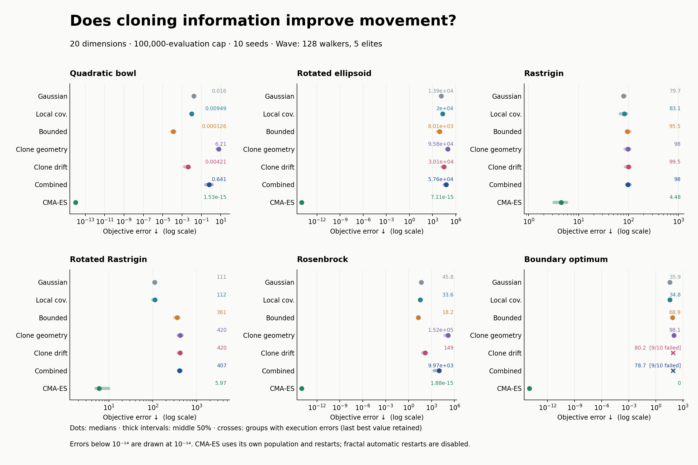

# Cloning-guided exploration: implementation and measured results

The new perturbation is available for Wave, Graph, FMC, Wave Jump, Euclidean Gas, and GAS. Geometry and directed drift are independently selectable and enabled by default. Minimum/maximum scales and drift strength can be tuned live. Euclidean Gas supports velocity kicks and direct position proposals. Existing perturbations remain available.

## Benchmark outcome

The combined strategy did not improve on bounded adaptive movement on any of the six tested problems at these settings. All 240 rerun baseline outcomes matched the previous engine exactly in best objective, evaluation count, and error status. This is an experimental variant, not a recommended replacement for the existing strategies.

420 freshly measured runs: six 20-dimensional problems, seven methods, ten seeds, and a 100,000-evaluation cap per run. Fractal methods used Wave, 128 walkers, five elites, no automatic restarts, and statistical scale bounds [0.0001, 0.2]. CMA-ES retained its own population and BIPOP schedule. Actual cost was 41,436,170 evaluations.

| Problem | Bounded adaptive median error | Cloning combined median error | Combined / bounded |
|---|---:|---:|---:|
| Quadratic bowl | 0.000126097 | 0.641172 | 5.08e+03× |
| Rotated ellipsoid | 8010.1 | 57569.3 | 7.19× |
| Rastrigin | 95.5156 | 98.003 | 1.03× |
| Rotated Rastrigin | 360.697 | 406.933 | 1.13× |
| Rosenbrock | 18.1796 | 9973.24 | 549× |
| Boundary optimum | 68.8694 | 78.7141 | 1.14× |

Lower error is better. Ratios above one mean worse performance; boundary-problem medians include last best values from failed runs and do not represent fully consumed budgets.

## Boundary failure and limits

The drift-only and combined variants each stopped with an all-invalid population on 9/10 boundary-optimum seeds: 18 errors total. All other groups completed without execution errors. The fitted drift can point outward near a constrained optimum. The existing outer session guard stops an all-invalid population before the Wave elite bank can restore valid walkers. This change preserves that existing behavior rather than altering baseline algorithms or adding an unplanned boundary correction.

The result separates implementation validation from optimization quality: deterministic mechanics and accounting tests pass, but this covariance/drift design is not reliably competitive at the tested settings. In particular, the selected cloud’s covariance is not automatically a useful local curvature estimate, and fitness differences include sampled diversity effects. Those are hypotheses for follow-up experiments, not explanations established by this ablation.

## Validation

- Native optimization, shared swarm, and distance-adapter suites passed (3/3). Tests cover expected mass, analytic drift direction, ancestry support, covariance rotation, periodic neighborhoods, sparse fallback, high-dimensional geometry, stochastic evaluation cost, six adapters, safe live updates, and Euclidean transitions.
- All 30 WebAssembly/recording tests passed, including native/WebAssembly comparisons for the new strategy and archive round trips.
- Chromium and Firefox passed the live-control, asynchronous-edit, running/paused, restart, archive, and Euclidean-control scenarios for both adaptive strategies. One Firefox timeout passed on an isolated rerun.
- Full benchmark fingerprints, budgets, population sizes, elite settings, seed coverage, and baseline outcomes were verified. Separate repeated cases are saved in reproducibility-checks.json.

[Full results and reproduction](report.md) · [CSV](results.csv) · [Validation](validation.json) · [Reproducibility checks](reproducibility-checks.json) · [PDF chart](comparison.pdf)
