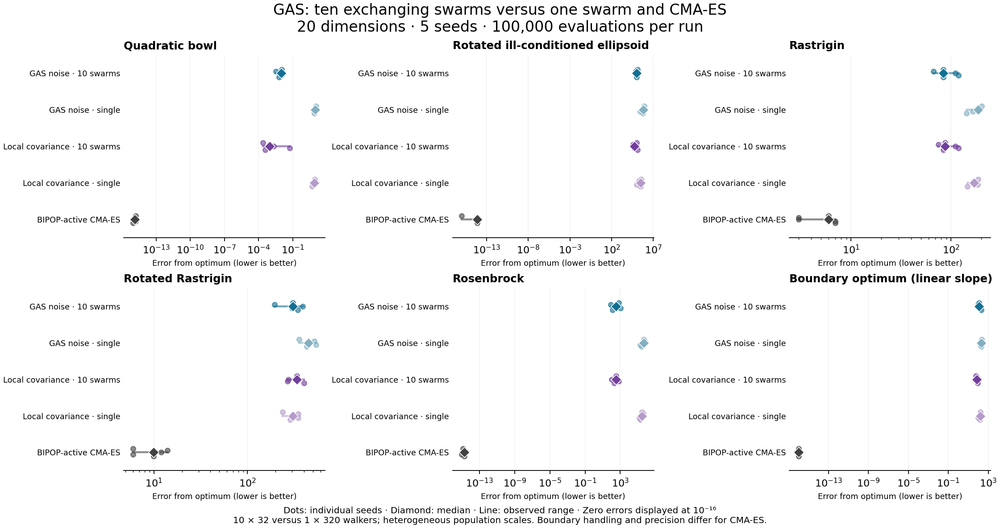

# GAS populations versus a single GAS and CMA-ES

20 dimensions; 5 seeds (0–4); 100,000 total evaluation cap per run. COCO instance 1.

Populations: ten concurrent 32-walker GAS instances, exporting five current best walkers and importing five foreign walkers every round. GAS does not protect historical elite slots; its algorithm is unchanged between exchanges. Replacement uses the same retention criterion as shrinking. All exchange counts, foreign provenance, disjoint import/export indices and fixed swarm sizes are verified.

Single GAS: 320 walkers, equal total population and budget. GAS-adaptive uses multiplier 1; local covariance uses standard deviation 0.2. Population GAS-adaptive multipliers: 0.1, 0.16681, 0.278256, 0.464159, 0.774264, 1.29155, 2.15443, 3.59381, 5.99484, 10. Population local covariance standard deviations (absolute units): 0.0001, 0.000232692, 0.000541455, 0.00125992, 0.00293173, 0.0068219, 0.015874, 0.0369375, 0.0859506, 0.2. No post-result tuning. Comparing multi-scale populations with these single-scale baselines does not isolate the effect of migration.

GAS-adaptive noise scales each coordinate by domain width × multiplier × 10^(-5 + 4φ), where φ is normalized objective. Local covariance learns covariance shape from accepted movement evidence, with fixed standard deviation per swarm. GAS tabu memory remains enabled and private to each swarm. Local search, automatic restarts and population/scale scheduling are disabled for both single and population GAS to isolate movement and exchange.

CMA-ES is freshly rerun BIPOP-active with its own default population and restart schedule. Nonperiodic GAS uses no boundary repair; CMA uses its bounded mapping. GAS coordinates are float32, CMA float64. Whole-operation budget admission may leave evaluations unused. Timings include benchmark overhead and concurrent contention; do not interpret as isolated speed rankings.

Median error from the known optimum; lower is better. † marks any runtime failure in a group.

| Problem | Population GAS gas_adaptive | Single GAS gas_adaptive | Population GAS local_covariance | Single GAS local_covariance | BIPOP-active CMA-ES |
|---|---:|---:|---:|---:|---:|
| Quadratic bowl | 0.00964902 | 9.61896 | 0.000949255 | 7.6512 | 1.29878e-15 |
| Rotated ill-conditioned ellipsoid | 102210 | 607949 | 55412 | 326499 | 7.10543e-15 |
| Rastrigin | 83.578 | 187.534 | 87.7349 | 169.985 | 5.96975 |
| Rotated Rastrigin | 305.084 | 449.314 | 337.635 | 306.094 | 9.94959 |
| Rosenbrock | 318.372 | 458774 | 326.367 | 291820 | 1.81329e-15 |
| Boundary optimum (linear slope) | 110.229 | 195.847 | 71.0264 | 155.388 | 0 |

| Problem | Method | Error min–max | Success ≤1e-6 | Evaluations min–max | Errors |
|---|---|---|---:|---|---:|
| Quadratic bowl | Population GAS gas_adaptive | 0.00343832–0.0138974 | 0/5 | 99840–99840 | 0 |
| Quadratic bowl | Single GAS gas_adaptive | 7.82703–11.1481 | 0/5 | 99840–99840 | 0 |
| Quadratic bowl | Population GAS local_covariance | 0.00024913–0.0535819 | 0/5 | 99840–99840 | 0 |
| Quadratic bowl | Single GAS local_covariance | 4.92385–9.881 | 0/5 | 99840–99840 | 0 |
| Quadratic bowl | BIPOP-active CMA-ES | 8.65116e-16–1.53398e-15 | 5/5 | 99833–99999 | 0 |
| Rotated ill-conditioned ellipsoid | Population GAS gas_adaptive | 80688.9–125596 | 0/5 | 99840–99840 | 0 |
| Rotated ill-conditioned ellipsoid | Single GAS gas_adaptive | 271455–959847 | 0/5 | 99840–99840 | 0 |
| Rotated ill-conditioned ellipsoid | Population GAS local_covariance | 38641.5–124292 | 0/5 | 99840–99840 | 0 |
| Rotated ill-conditioned ellipsoid | Single GAS local_covariance | 103406–445957 | 0/5 | 99840–99840 | 0 |
| Rotated ill-conditioned ellipsoid | BIPOP-active CMA-ES | 0–7.10543e-15 | 5/5 | 99953–99993 | 0 |
| Rastrigin | Population GAS gas_adaptive | 66.6627–119.396 | 0/5 | 99840–99840 | 0 |
| Rastrigin | Single GAS gas_adaptive | 143.304–202.191 | 0/5 | 99840–99840 | 0 |
| Rastrigin | Population GAS local_covariance | 74.7128–119.399 | 0/5 | 99840–99840 | 0 |
| Rastrigin | Single GAS local_covariance | 145.824–186.645 | 0/5 | 99840–99840 | 0 |
| Rastrigin | BIPOP-active CMA-ES | 2.98488–6.96471 | 0/5 | 99946–99991 | 0 |
| Rotated Rastrigin | Population GAS gas_adaptive | 194.384–387.669 | 0/5 | 99840–99840 | 0 |
| Rotated Rastrigin | Single GAS gas_adaptive | 356.168–538.603 | 0/5 | 99840–99840 | 0 |
| Rotated Rastrigin | Population GAS local_covariance | 266.656–400.199 | 0/5 | 99840–99840 | 0 |
| Rotated Rastrigin | Single GAS local_covariance | 236.43–350.117 | 0/5 | 99840–99840 | 0 |
| Rotated Rastrigin | BIPOP-active CMA-ES | 5.96975–13.9294 | 0/5 | 99925–99998 | 0 |
| Rosenbrock | Population GAS gas_adaptive | 85.17–1020.38 | 0/5 | 99840–99840 | 0 |
| Rosenbrock | Single GAS gas_adaptive | 188419–606576 | 0/5 | 99840–99840 | 0 |
| Rosenbrock | Population GAS local_covariance | 100.783–648.614 | 0/5 | 99840–99840 | 0 |
| Rosenbrock | Single GAS local_covariance | 150905–400024 | 0/5 | 99840–99840 | 0 |
| Rosenbrock | BIPOP-active CMA-ES | 9.48739e-16–3.02777e-15 | 5/5 | 99972–99990 | 0 |
| Boundary optimum (linear slope) | Population GAS gas_adaptive | 98.5916–184.987 | 0/5 | 99840–99840 | 0 |
| Boundary optimum (linear slope) | Single GAS gas_adaptive | 163.786–207.92 | 0/5 | 99840–99840 | 0 |
| Boundary optimum (linear slope) | Population GAS local_covariance | 51.2434–81.3278 | 0/5 | 99840–99840 | 0 |
| Boundary optimum (linear slope) | Single GAS local_covariance | 98.063–170.074 | 0/5 | 99840–99840 | 0 |
| Boundary optimum (linear slope) | BIPOP-active CMA-ES | 0–0 | 5/5 | 99835–99950 | 0 |

150 runs; 0 runtime errors. 933,000 foreign imports verified.

Full records: runs.jsonl; library and runner fingerprints: manifest.json.

Reproduce: `uv run python fractal-gas-web/tools/benchmark-gas-populations.py --output /tmp/gas-populations-comparison`.

[PDF plot](comparison.pdf). The plotted zero-error floor is display-only.
