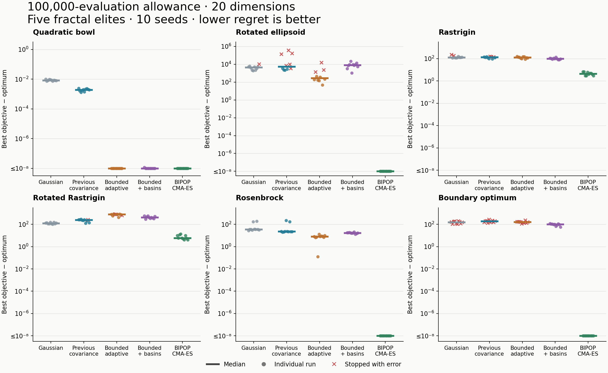

# Optimization comparison at 20 dimensions

**The current adaptive strategy is not consistently better than the previous perturbations at 20 dimensions.** It improves the quadratic bowl and Rosenbrock results, but CMA-ES remains substantially stronger on the difficult problems. On rotated Rastrigin, even the simpler Gaussian baseline outperforms both new variants with these settings.

The experiment contains **300 runs**: six problems, five methods, ten seeds (0–9), all at **20 dimensions**, with a **100,000-evaluation allowance per run**. Every fractal run uses **Wave with five elites**, eight initial walkers, maximum population 64, and nonperiodic boundaries. The adaptive scale range remains **[0.0001, 0.2]**; Gaussian and previous covariance use standard deviation 0.2. CMA-ES retains its own selection rule, default initial population, initial sigma of 20% of domain width, and nine large-population runs. Parameters were not retuned for 20D. COCO problems use instance 1.

The native engine is identical to the previous comparison. All initial and final effective settings confirm 20 dimensions and, for fractal methods, five elites. Twenty dimensions is now the default in the benchmark harness; no two-dimensional results are included here.

## Median final error

Error is the best evaluated objective minus the known optimum. Lower is better. † marks groups containing early-stop errors; their last best result is retained rather than discarded.

| Problem | Gaussian | Previous covariance | Bounded adaptive | Bounded + basins | BIPOP-active CMA-ES |
|---|---:|---:|---:|---:|---:|
| Quadratic bowl | 0.008394 | 0.001940 | 2.00e-9 | 3.62e-9 | 1.53e-15 |
| Rotated ellipsoid | 4616.57† | 5447.39† | 287.36† | 8243.93 | 7.11e-15 |
| Rastrigin | 130.81† | 136.19† | 130.84 | 99.00 | 4.48 |
| Rotated Rastrigin | 121.45 | 243.51† | 780.53† | 418.37 | 5.97 |
| Rosenbrock | 35.25 | 22.48 | 7.96 | 16.80 | 1.88e-15 |
| Boundary optimum | 154.82† | 186.15† | 160.06† | 99.19 | 0 |

## What the results establish

- **Smooth refinement remains a strength.** Bounded adaptive and bounded movement with basins reach error ≤ 1e-6 on the quadratic bowl in **10/10 seeds**, matching CMA-ES's success count. Neither previous perturbation reaches that threshold. Differences among the tiny errors of successful methods should not be interpreted as practical orders-of-magnitude superiority.
- **Rosenbrock improves over the previous perturbations.** Standalone bounded movement reduces median error from **22.48 to 7.96** relative to previous covariance, approximately **65% lower**. Restarting worsens it to **16.80**. CMA-ES reaches the reporting threshold in **10/10 seeds**; the fractal methods reach it in none.
- **Ordinary Rastrigin benefits modestly from restarts.** The controller lowers median error from **130.84 to 99.00**, about **24%**. Its residual error is still **22.1 times** CMA-ES's median. No method reaches error ≤ 1e-6 in any of the ten seeds, including CMA-ES.
- **Rotated Rastrigin exposes a substantial regression.** The controller's median error is **3.44 times the Gaussian baseline's** and **70.1 times CMA-ES's**. All three of these groups finish without errors, so this comparison is not explained by early termination. Standalone bounded movement is worse still and has three early-stop errors. No method reaches the reporting threshold on this problem.
- **The controller is not universally beneficial.** On the rotated ellipsoid, its median is **8243.93**, versus **287.36** for standalone bounded movement. Three standalone runs stop early, so that comparison is descriptive, not a clean full-budget comparison. CMA-ES reaches the threshold in all ten seeds.

## Reliability and actual budget use

There are **49 early-stop errors**: **13 Gaussian, 20 previous covariance, and 16 bounded-adaptive** runs. The basin-controller and CMA-ES groups have **zero reported errors**. All errors report an entirely invalid population. Thirty occur on the boundary-optimum problem; the other nineteen occur on the rotated ellipsoid and the two Rastrigin problems.

Five elites do not currently prevent this failure. Wave restores its saved elites at the start of its inner step, but the outer session guard can reject an invalid current population before that restoration happens. The controller can instead start a new round. This known integration defect was left unchanged during measurement to preserve the comparison. In particular, none of the three non-restarting fractal methods completes a boundary-optimum run without an error; their boundary scores are not a full-budget quality comparison.

Actual consumption is **25,734,563 evaluations**, below the nominal 30 million because of early failures and complete-operation admission. All 300 requested configurations are present exactly once. Evaluation counts and best-so-far are checked for monotonicity, no evaluation allowance is exceeded, and source/library fingerprints remain unchanged. Repeated bounded, controller, and CMA-ES runs reproduce their complete final states exactly.

These results concern the specified Wave configurations and one realized COCO instance, not every fractal algorithm or a tuned high-dimensional optimum. The eight-walker starting population and scale bounds were deliberately held fixed. Equal evaluation allowances do not make population schedules, initialization distributions, or movement scales identical. Gaussian and previous covariance are preserved baselines in the current engine, not separately rebuilt historical versions.

- [Full tables, variability, timing, and reproduction command](report.md)
- [Per-run results](results.csv)
- [Full configurations and final states](runs.jsonl)
- [Validation](validation.json)
- [Reproducibility checks](reproducibility-checks.json)
- [Plot as PDF](results-20d.pdf)

