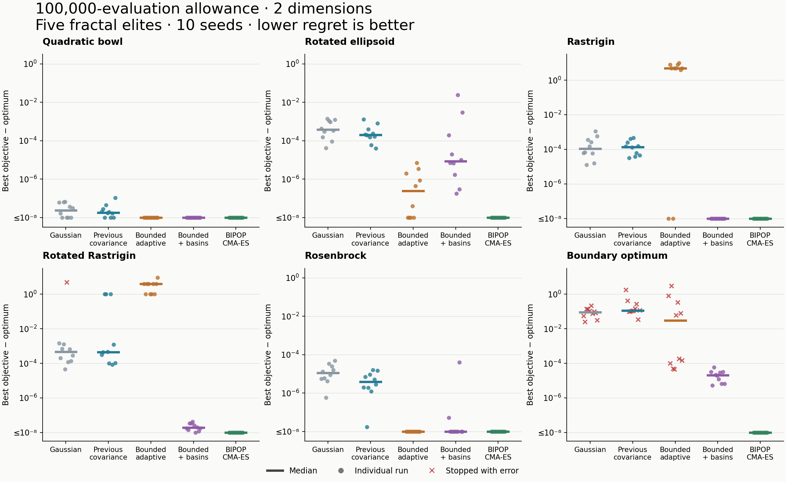
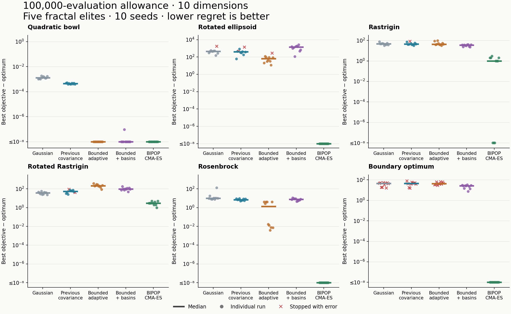

# Optimization comparison: 100,000 evaluations and five elites

The basin controller makes the new strategy effective on the two-dimensional multimodal problems, but the current configuration is not a general replacement for CMA-ES or the previous perturbations. CMA-ES remains substantially better on the ten-dimensional problems. Standalone bounded movement still gets trapped on Rastrigin.

This comparison contains **600 runs**: six problems, two dimensions (2 and 10), five methods, and ten seeds per case. Each run had a **100,000-evaluation allowance**. Every fractal run used **Wave with five elites**, eight initial walkers, a maximum population of 64, and nonperiodic boundaries. Bounded movement used the previously tested scale range **[0.0001, 0.2]**. The Gaussian and previous local-covariance baselines used standard deviation 0.2. CMA-ES retained its own selection rule and defaults, including an initial sigma of 20% of the domain width. These are comparisons of the configured methods; their movement scales and population schedules are not matched.

The native engine was not changed during the comparison. The earlier zero-elite experiment was stopped and superseded. Since the elite setting also changed, differences from the old 5,000-evaluation report cannot be attributed solely to the larger budget.

## What improved, and what did not

- **Two-dimensional Rastrigin:** bounded movement alone had median regret **4.97479** and reached regret ≤ 1e-6 in **2/10 seeds**. Adding basin restarts reduced the median to **2.41e-9**, with **10/10 successes**. The previous covariance baseline had median **1.38e-4** and no successes at that threshold. CMA-ES also succeeded in **10/10** seeds. Thus, the controller closes the practical accuracy gap here; standalone movement does not.
- **Two-dimensional rotated Rastrigin:** adding basin restarts reduced median regret from **3.97983** to **1.91e-8**. Success increased from **0/10 to 10/10**, matching CMA-ES's success count. Previous covariance had median regret **4.49e-4** and no successes.
- **Ten-dimensional quadratic bowl:** bounded movement and bounded movement with restarts both succeeded in **10/10 seeds**, as did CMA-ES. Gaussian and previous covariance succeeded in **0/10**. All methods solved the easier two-dimensional bowl at the reporting threshold.
- **Ten-dimensional Rosenbrock:** standalone bounded movement reduced median regret from **7.01977** with previous covariance to **1.33897**, an **80.9% reduction**. Restarts worsened it to **7.60953**. CMA-ES reached the target in every seed; neither fractal variant reached it in this dimension.
- **Ten-dimensional multimodal problems:** the controller's median Rastrigin regret was **34.326**, versus **0.994959** for CMA-ES, a **34.5-fold larger residual error**. On rotated Rastrigin, controller regret was **94.520**, versus **2.98488** for CMA-ES. CMA-ES was not universally successful either: it reached the target in **3/10** ordinary Rastrigin seeds and **0/10** rotated Rastrigin seeds.
- **Restarts can interrupt useful refinement:** on the ten-dimensional rotated ellipsoid, controller regret was **1415.53**, versus **63.9327** for standalone bounded movement. The standalone group includes one early-stop error, so this comparison is descriptive and affected by the recovery issue below.

## Ten-dimensional results

Median regret is best objective minus the known optimum; lower is better. Values marked † include runs that stopped with an error. The full report also includes Gaussian, per-seed ranges, interquartile ranges, success counts, evaluation counts, and timings.

| Problem | Previous covariance | Bounded adaptive | Bounded + basins | BIPOP-active CMA-ES |
|---|---:|---:|---:|---:|
| Quadratic bowl | 4.38e-4 | 2.87e-10 | 8.26e-10 | 8.32e-16 |
| Rotated ellipsoid | 404.19† | 63.93† | 1415.53 | 0 |
| Rastrigin | 43.54† | 42.29 | 34.33 | 0.995 |
| Rotated Rastrigin | 53.17† | 212.92 | 94.52 | 2.985 |
| Rosenbrock | 7.020 | 1.339 | 7.610 | 1.58e-15 |
| Boundary optimum | 45.22† | 41.98† | 26.65 | 0 |

Zero denotes the recorded numerical value, not a claim of exact mathematical optimality. Comparisons near numerical precision are better interpreted through the common 1e-6 success threshold.

## Early termination and elite recovery

There were **68 reported errors**: 22 Gaussian, 25 previous covariance, and 21 bounded-adaptive runs. **The basin-controller and CMA-ES groups had zero errors.** Sixty errors occurred on the boundary-optimum problem: all ten seeds of each of the three non-restarting fractal variants failed in both dimensions. The other eight errors occurred on rotated ellipsoid or Rastrigin cases.

These runs requested and retained five elites. The problem is an integration defect: Wave restores saved elites at the start of its next inner step, but the outer `Session::step()` guard rejects an entirely invalid current population before that restoration can happen. Consequently, saved valid elites do not always prevent an early stop. The controller handles an invalid population by beginning another round. This diagnosis follows the guard in `src/optimization/engine.cpp` and restoration in `src/fractal/wave.hpp`; it was not fixed during measurement.

Failed runs remain in the tables with their last best objective. In particular, the boundary rows are **not a clean full-budget comparison**. Actual total consumption was **53,620,443 evaluations**, below the nominal 60 million because of failures and complete-operation admission. Successful completion of the run loop does not mean that the target objective was reached.

## Verification and scope

The output contains exactly one result for each of the 600 configurations. All initial and final fractal settings specify five elites. The benchmark checks monotonic evaluation counts and best-so-far after each step; no run exceeded its allowance. The native library and source fingerprints remained unchanged. Separate repeats of bounded movement, basin restarts, and CMA-ES reproduced their complete final states exactly.

The previous perturbations are preserved baselines in the current engine, not separately rebuilt historical binaries. This experiment uses one realized COCO instance and ten optimizer seeds, and does not establish universal superiority. No benchmark-specific tuning or algorithm changes were made. The five-elite setting is now built into the long-budget harness for future fractal runs.

- [Full tables and reproduction command](report.md)
- [Per-run CSV](results.csv)
- [Full configurations and final states](runs.jsonl)
- [Validation checks](validation.json)
- [Reproducibility checks](reproducibility-checks.json)
- [Two-dimensional plot (PDF)](results-2d.pdf)
- [Ten-dimensional plot (PDF)](results-10d.pdf)

