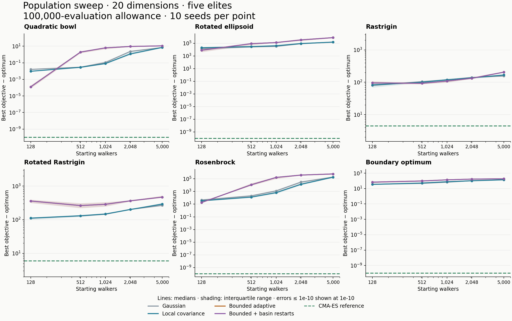

# Population sweep: 128 to 5,000 walkers

Increasing the population to 5,000 made median objective error worse on all six problems at the fixed 100,000-evaluation allowance. This held for Gaussian, local covariance, and bounded adaptive movement. Across all measured fractal variants, the lowest median for each problem occurred at 128 walkers. These are descriptive results for these settings, not a claim that 128 is universally optimal.

We ran 1,200 Wave experiments: five independent starting populations (128, 512, 1,024, 2,048, 5,000), six 20-dimensional problems, four variants, and ten seeds. Every fractal run used five elites. No optimizer code or movement settings were changed. BIPOP-active CMA-ES is an unchanged, fingerprint-verified reference from 60 previously measured runs, using its own default population and selection rule.

## Bounded adaptive results

Median best objective minus known optimum; lower is better. The controller-enabled variant produced exactly the same results because no restart occurred.

| Problem | 128 | 512 | 1,024 | 2,048 | 5,000 | CMA-ES reference |
|---|---:|---:|---:|---:|---:|---:|
| Quadratic bowl | 0.000126097 | 1.97139 | 6.38593 | 9.38041 | 11.0735 | 1.53123e-15 |
| Rotated ellipsoid | 8010.1 | 88487 | 129203 | 346085 | 784117 | 7.10543e-15 |
| Rastrigin | 95.5156 | 92.9896 | 109.147 | 133.165 | 205.572 | 4.47732 |
| Rotated Rastrigin | 360.697 | 263.962 | 287.715 | 365.699 | 469.627 | 5.96975 |
| Rosenbrock | 18.1796 | 11557.5 | 168479 | 392231 | 595187 | 1.879e-15 |
| Boundary optimum | 68.8694 | 96.8033 | 135.86 | 170.259 | 186.309 | 0 |

For bounded adaptation alone, 512 walkers improved standard Rastrigin median error by 2.6% and rotated Rastrigin by 26.8% relative to 128. The other four problems worsened, and 5,000 worsened all six. On standard Rastrigin, the best fractal median was Gaussian at 128 (79.6846), versus 4.47732 for CMA-ES: about 17.8 times larger error. On rotated Rastrigin, Gaussian at 128 achieved 110.802 versus CMA-ES 5.96975: about 18.6 times larger.

## Why larger populations struggled

At a fixed evaluation allowance, population breadth competes with the number of movement and adaptation steps. The observed step ranges were:

| Starting walkers | Movement steps | Actual evaluations |
|---:|---:|---:|
| 128 | 706–780 | 99,617–99,968 |
| 512 | 174–194 | 98,466–99,840 |
| 1,024 | 85–96 | 96,937–99,328 |
| 2,048 | 41–47 | 94,327–98,304 |
| 5,000 | 15–19 | 87,367–100,000 |

This supports insufficient sequential refinement as an explanation, but the sweep does not isolate every cause. The engine admits complete operations conservatively; especially for paired adaptive proposals, it can leave unused allowance. Runs were not padded or granted extra evaluations. Total measured cost was 117,087,014 objective evaluations.

The controller never restarted in any of its 300 runs. All 300 matched standalone bounded adaptation exactly in best objective, evaluation count, and iteration count. Its default round allowance is 50 × dimension × population; even at 128 this is 128,000, beyond this experiment budget. Its stagnation interval also exceeds the total budget from 512 walkers upward. These results provide no evidence for or against basin avoidance across rounds.

## Validation and limitations

All 1,200 runs completed without execution errors, preserved five elites, respected the evaluation cap, and retained their starting populations. None achieved error ≤ 1e-6. CMA-ES achieved that threshold on all ten seeds for the bowl, ellipsoid, Rosenbrock, and boundary problem; neither method solved either Rastrigin problem at that threshold.

Three repeated adaptive cases matched exactly, including full final diagnostics. Engine/library and runner fingerprints were checked. The absence of invalid-population errors here does not repair the previously identified elite-restoration ordering issue. This sweep covers Wave only; it does not establish performance for every fractal adapter.

[Full tables and reproduction command](report.md) · [CSV](results.csv) · [Validation](validation.json) · [Reproducibility checks](reproducibility-checks.json)
