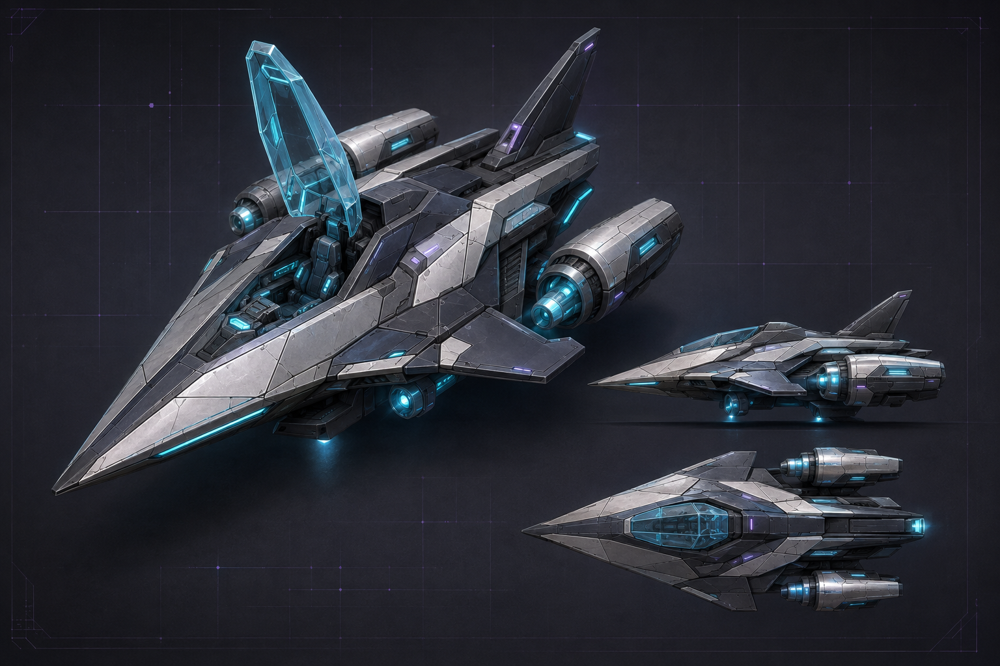
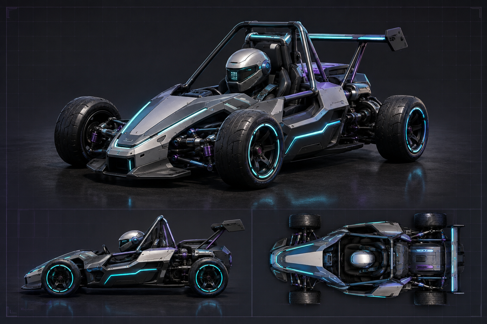
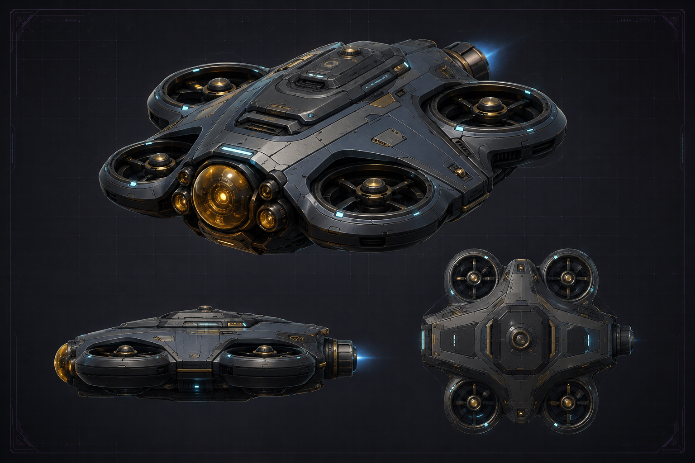
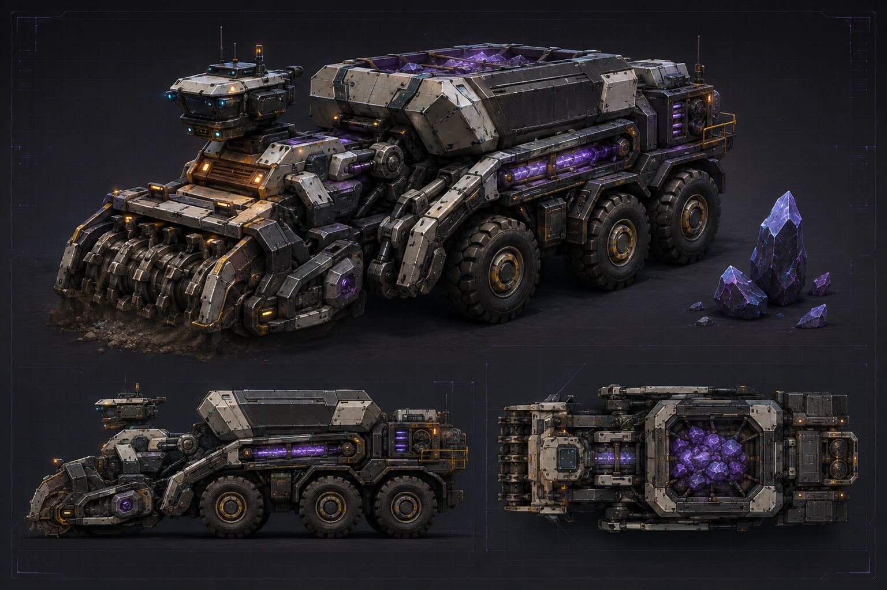
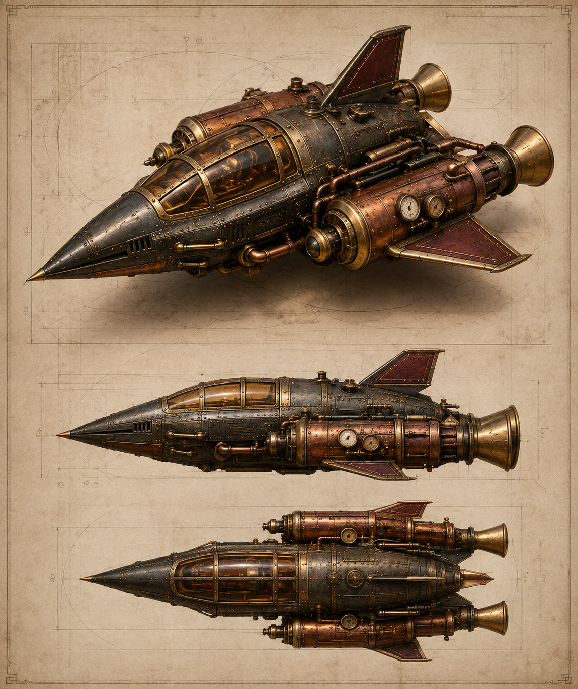
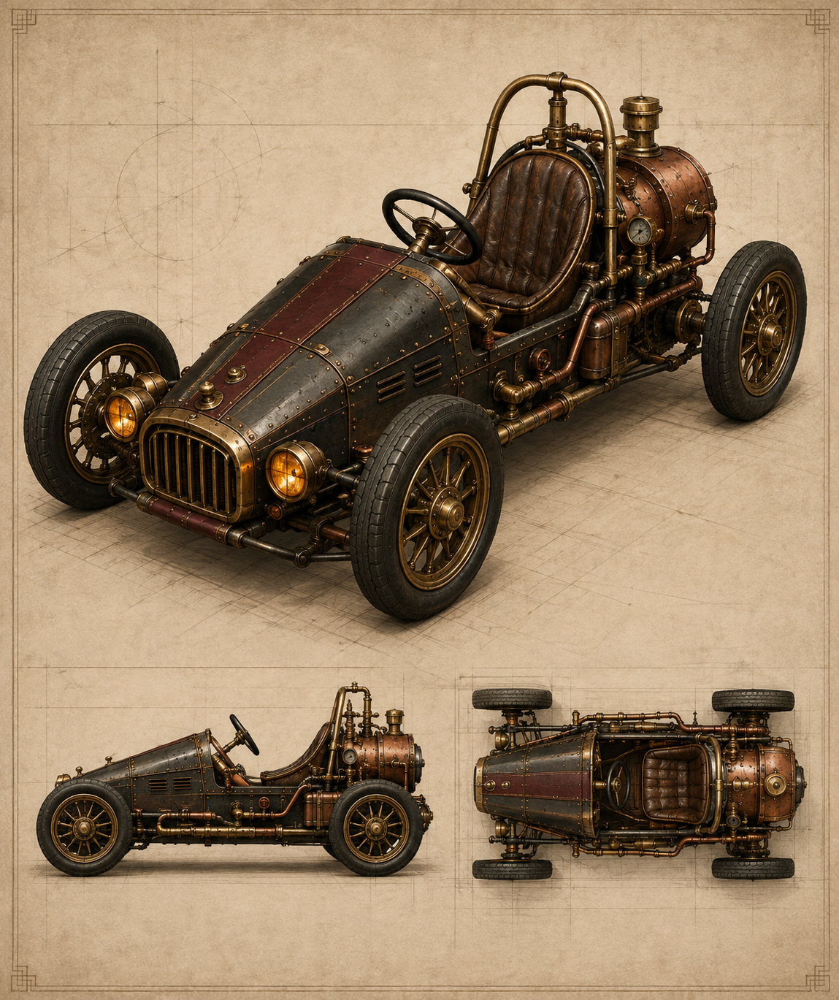
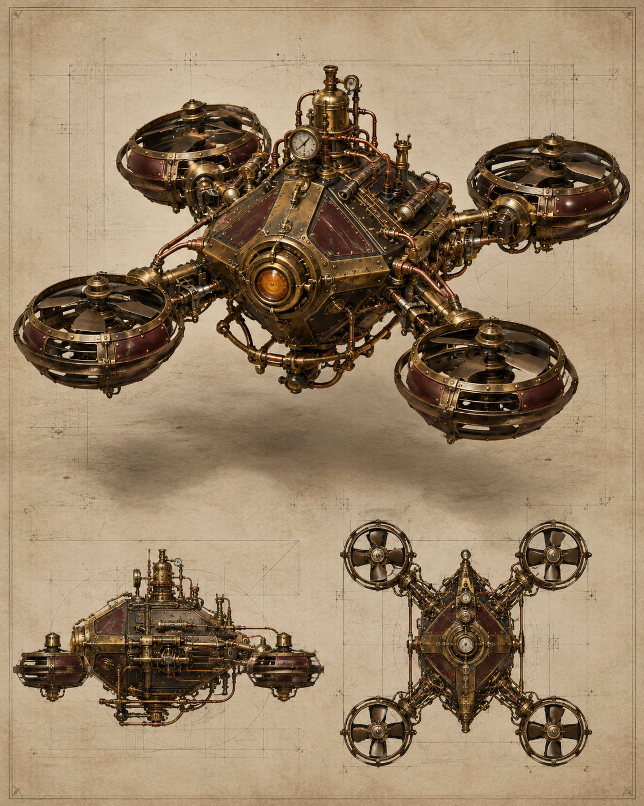
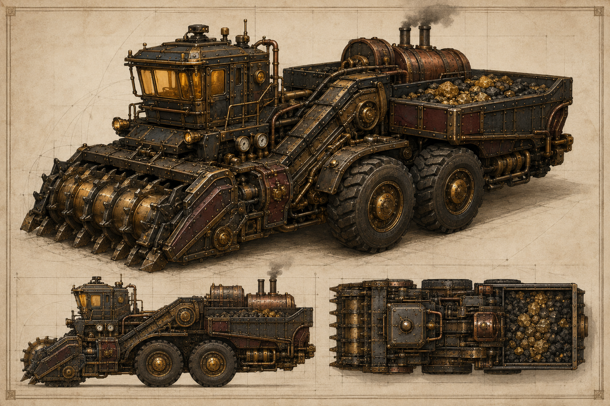

# Laboratory concept art

Browse the [visual concept library](./index.html) for sixteen additional world-asset
sheets, paired by style. Each includes variants, construction studies or effect
sequences used for Blender authoring. The original PNGs are preserved.
All eight world families now have [Blender-authored 3D assets](../asset-gallery.html):
42 types in each style, with the same visual envelopes and scene-defined collisions.
See the [world asset pipeline](../assets/README.md#world-collections) for downloads,
regeneration and the collision contract.

| World asset family | Futuristic | Steampunk |
| --- | --- | --- |
| Collectible drops | [Sheet](futuristic/world/collectible-drops.png) | [Sheet](steampunk/world/collectible-drops.png) |
| Towable ore rocks | [Sheet](futuristic/world/ore-rocks.png) | [Sheet](steampunk/world/ore-rocks.png) |
| Gravity well | [Sheet](futuristic/world/gravity-well.png) | [Sheet](steampunk/world/gravity-well.png) |
| Recovery dock | [Sheet](futuristic/world/recovery-dock.png) | [Sheet](steampunk/world/recovery-dock.png) |
| Checkpoints | [Sheet](futuristic/world/checkpoints.png) | [Sheet](steampunk/world/checkpoints.png) |
| Arena scenery | [Sheet](futuristic/world/arena-scenery.png) | [Sheet](steampunk/world/arena-scenery.png) |
| Racing scenery | [Sheet](futuristic/world/racing-scenery.png) | [Sheet](steampunk/world/racing-scenery.png) |
| Capture and motion | [Sheet](futuristic/world/capture-effects.png) | [Sheet](steampunk/world/capture-effects.png) |

The complete sixteen prompts are in [world-prompts.json](world-prompts.json).
They were generated with the built-in ImageGen tool on September 6, 2026. To
regenerate, submit each `images[].prompt` separately, preserve the original output,
and save the selected PNG as `{style}/world/{id}.png`. Generated labels and views
are design guidance, not exact engineering measurements. Pickups and effects do
not introduce new simulation mechanics.

## Vehicle concept art

Two complete design directions for the Fractal Gas laboratory. Each original PNG
contains a hero view and smaller reference views. Click a sheet to open the full image.

**3D models are available in the [Vehicle Workshop](../asset-gallery.html).**
Rotate each model alongside its concept sheet and download the GLB or editable
Blender source. In the lab, use the masthead's **Visual style** selector to switch
the entire scene between futuristic and steampunk. See the
[asset pipeline and runtime contract](../assets/README.md) for regeneration and LODs.

| Vehicle | Futuristic | Steampunk |
| --- | --- | --- |
| Kestrel rocket / thruster tug | [Rocket](futuristic/rocket.png) | [Rocket](steampunk/rocket.png) |
| Mite electric / racing kart | [Kart](futuristic/kart.png) | [Kart](steampunk/kart.png) |
| Wisp survey drone | [Drone](futuristic/drone.png) | [Drone](steampunk/drone.png) |
| Harvester resource truck | [Harvester](futuristic/harvester.png) | [Harvester](steampunk/harvester.png) |

## Futuristic collection

Graphite and alloy, cyan instrumentation and violet energy details.

## Steampunk collection

Brass, copper plumbing, riveted iron, burgundy enamel, amber glass and boilers.
The Harvester takes its broad industrial resource-collector role from the first
Command & Conquer and translates it into steam machinery.

## Use the Harvester in the lab

Run `npm --prefix fractal-gas-web run build:lab` after building the WebAssembly
engines. Open any preset, choose **Edit scene**, set the placement tool to
**Agent**, select **Harvester · steam ore collector**, and click an empty position
in the world. The catalog definition travels with exported scenes.

The Harvester uses throttle, steering and brake channels with heavier ground
vehicle parameters. Its steampunk model includes six wheels, a collecting drum,
hopper, amber cab, copper pressure vessel and exhaust stack. Wheel, front steering
and intake animation use the shared replay-aware model contract. Resource rewards
come from the scene's existing task; boiler pressure and hopper inventory are
concept details, not additional simulated state.

`build:lab` retains the authored Blender collections and also exports the legacy
`../assets/harvester.glb`. The PNGs are design references; they are not texture maps
or exact engineering orthographic drawings. The Blender models preserve their
characteristic forms with geometry optimized for the interactive laboratory.

## Provenance

Generated with the built-in ImageGen tool. Original PNGs are preserved without
resizing or recompression. The complete prompts are in
[futuristic/prompts.json](futuristic/prompts.json) and
[steampunk/prompts.json](steampunk/prompts.json). Vector and independent-thruster
rockets share the Kestrel design; the racing variant shares the Mite design.
