# The Linchpin: Rigorous Roadmap for Walker Density Convergence

**Document Status**: Strategic research roadmap (20-year program)

**Authors**: Claude Code Framework Team + Gemini 2.5 Pro Expert Review

**Date**: 2025-10-10

**Purpose**: This document provides an exhaustive, publication-ready roadmap for proving the CRITICAL linchpin result that unlocks the curvature unification conjecture: the convergence of walker empirical measure to a smooth quasi-stationary density.

---

## 0. Executive Summary

### 0.1. The Linchpin Theorem

**Central Goal**: Prove that the empirical measure of walkers in the Fragile Gas converges to a smooth density in the mean-field limit.

:::{prf:theorem} Empirical Measure Convergence to QSD Density (THE LINCHPIN)
:label: thm-linchpin-convergence

As $N \to \infty$, the empirical measure of walkers converges weakly to a smooth density:

$$
\mu_N := \frac{1}{N} \sum_{i=1}^N \delta_{(x_i, v_i)} \Longrightarrow \rho_\infty(x, v) \, dx \, dv
$$

where $\rho_\infty \in C^k$ (for some $k \geq 2$) is the density of the unique quasi-stationary distribution of the mean-field McKean-Vlasov equation.

**Stronger form**: Convergence in Wasserstein distance:

$$
W_2(\mu_N, \rho_\infty dx dv) \to 0 \quad \text{as } N \to \infty
$$
:::

### 0.2. Why This Is The Linchpin

This theorem is the **absolute prerequisite** for the curvature unification conjecture:

1. **Lemma A** (Spectral convergence $\Delta_0 \to \Delta_g$): Requires smooth walker density $\rho(x)$ to define the continuum limit
2. **Lemma B** (Deficit angle convergence $\delta_i/\text{Area} \to R(x_i)$): Requires empirical measure convergence for stochastic geometry arguments
3. **Curvature unification**: Cannot prove equivalence of four curvature measures without this result

**Without this theorem, the curvature unification program cannot proceed.**

### 0.3. Current Status

**What we have proven** (Documents 04, 10):
- ✅ Finite-N convergence to QSD with exponential rate
- ✅ Discrete-time LSI with explicit constant $C_{\text{LSI}}(N)$
- ✅ Foster-Lyapunov drift condition
- ✅ Hypocoercive structure with synergistic dissipation

**What remains to prove**:
- 🔴 N-uniform LSI: $\sup_N C_{\text{LSI}}(N) < \infty$
- 🔴 Convergence of empirical measure $\mu_N \to \rho_\infty$
- 🔴 Smoothness of limiting density $\rho_\infty$

### 0.4. Timeline & Difficulty Assessment

**Gemini's Honest Assessment**:
- **Difficulty**: 9/10 (frontier research problem)
- **Optimistic timeline**: 24 months for N-uniform LSI, 36 months for full theorem
- **Realistic timeline**: 3-5 years for complete proof
- **Success probability**: 50-60% for main approach (Vector B)
- **Fallback probability**: 80-90% for weaker results (rate estimates)

**Resource requirements**:
- 3-5 person team (postdocs + faculty)
- Expertise: Hypocoercivity, interacting particle systems, entropy methods
- Estimated effort: ~10-15 person-years total

---

## 1. Literature Review & Gap Analysis

### 1.1. Standard Propagation of Chaos Results

**Classical theory** (Sznitman 1991, Méléard 1996):

:::{prf:theorem} Classical Propagation of Chaos
:label: thm-classical-propagation

For a system of $N$ exchangeable particles with pairwise Lipschitz interactions:

$$
dX_i^N = b(X_i^N, \mu_N) \, dt + \sigma dW_i, \quad \mu_N = \frac{1}{N}\sum_{j=1}^N \delta_{X_j^N}
$$

If:
1. $b$ and $\sigma$ are Lipschitz continuous
2. Interaction kernel is bounded
3. No state-dependent killing or branching

Then: $\mu_N \Longrightarrow \rho_\infty$ where $\rho_\infty$ solves the McKean-Vlasov PDE.
:::

**Why classical results don't apply to Fragile Gas**:

| Assumption | Classical Theory | Fragile Gas | Gap |
|------------|-----------------|-------------|-----|
| **Particle type** | Exchangeable, fixed N | Cloning/killing (variable) | ❌ Branching not handled |
| **Interaction** | Lipschitz, bounded | Fitness potential $V[\mu_N]$ (nonlinear functional) | ❌ Double mean-field |
| **Dynamics** | Standard SDE | SDE + discrete jumps (cloning) | ❌ Hybrid dynamics |
| **Target** | Stationary distribution | Quasi-stationary distribution (QSD) | ❌ Conditioning on survival |
| **Drift** | Local interactions | Adaptive force $F(x, \mu_N)$ | ❌ Global mean-field |

**Conclusion**: Classical propagation of chaos theory is **insufficient**. We need machinery for **QSD-conditioned mean-field limits with branching**.

### 1.2. McKean-Vlasov with Killing (State-of-the-Art)

**Fleming-Viot processes** (Burdzy-Hołyst-March 2000):

:::{prf:definition} Fleming-Viot Process
:label: def-fleming-viot

A stochastic process on measures where:
1. Particles undergo diffusion
2. Particles die at rate $\lambda(x)$
3. Dead particles are instantly replaced by sampling from the current empirical measure

**QSD interpretation**: The invariant measure of the Fleming-Viot process is the QSD of the underlying killed diffusion.
:::

**Recent progress** (Champagnat-Villemonais 2017, Bansaye-Cloez-Gabriel 2020):
- Proved convergence $\mu_N \to \pi_{\text{QSD}}$ for Fleming-Viot with state-dependent killing
- Established exponential convergence rates
- Characterized QSD via non-linear martingale problem

**Gap for Fragile Gas**:

The Fragile Gas is **not a standard Fleming-Viot process** because:

1. **Selection is fitness-based**, not uniform:
   - Fleming-Viot: Dead particle replaced by uniform sample from $\mu_N$
   - Fragile Gas: Cloning probability $P_{\text{clone}}(V[\mu_N](z_i), V[\mu_N](z_j))$ depends on **entire measure** $\mu_N$

2. **Double nonlinearity**:
   - Fitness potential $V[\mu_N]$ is a nonlinear functional of the measure
   - Cloning probability depends on fitness, creating self-referential feedback

3. **Adaptive forces**:
   - Fleming-Viot: Drift is fixed $b(x)$
   - Fragile Gas: Drift includes mean-field adaptive force $F(x, \mu_N)$

**Required innovation**: Extend Fleming-Viot theory to **fitness-weighted selection with measure-dependent nonlocal jumps**.

### 1.3. Entropy Methods for Mean-Field Convergence

**Seminal framework** (Carrillo-McCann-Villani 2003, 2006):

:::{prf:theorem} Entropy-Wasserstein Convergence (Simplified)
:label: thm-entropy-wasserstein

If the mean-field PDE satisfies:
1. **Displacement convexity**: Entropy $H[\rho]$ is geodesically convex in Wasserstein space
2. **HWI inequality**: $H[\rho|\pi] \leq \frac{1}{2\kappa} I[\rho|\pi] + \frac{\kappa}{2} W_2^2(\rho, \pi)$

Then: $\rho_t \to \pi$ exponentially in relative entropy.
:::

**Connection to our framework**:

From [10_kl_convergence.md](../10_kl_convergence/10_kl_convergence.md):
- ✅ We have proven HWI inequality for the cloning operator (finite-N)
- ✅ We have displacement convexity for position contraction
- ✅ We have entropy-transport Lyapunov function

**The critical gap**: Making these constants **uniform in N**.

:::{important}
**THE CENTRAL OBSTACLE**: Proving that the LSI constant $C_{\text{LSI}}(N)$ from [10_kl_convergence.md](../10_kl_convergence/10_kl_convergence.md) satisfies:

$$
\sup_{N \geq 2} C_{\text{LSI}}(N) < \infty
$$

This is the **single most important technical result** for the entire program.
:::

### 1.4. LSI Propagation Through Mean-Field Limits

**Key results** (Cattiaux-Guillin-Malrieu 2008, Caputo-Posta 2019):

:::{prf:theorem} LSI Propagation (Informal)
:label: thm-lsi-propagation

If:
1. N-particle system satisfies LSI with constant $C_{\text{LSI}}$ **uniform in N**
2. Generator $L_N$ converges to $L_\infty$ in suitable sense
3. Invariant measures $\pi_N$ converge to $\pi_\infty$

Then: The limiting measure $\pi_\infty$ satisfies an LSI with the same constant $C_{\text{LSI}}$.
:::

**Implication**: If we prove N-uniform LSI, convergence follows almost immediately via:
1. Relative entropy controls Wasserstein distance (Talagrand inequality)
2. LSI implies exponential convergence in relative entropy
3. Uniform LSI implies limit is unique and smooth

**The roadmap reduces to**: Prove N-uniform LSI.

---

## 2. The Central Technical Obstacle

### 2.1. Why This Problem Is Exceptionally Hard

The Fragile Gas generator $L_N$ has a **double mean-field nonlinearity**:

$$
L_N = \underbrace{L_{\text{kin}}(x, v, \mu_N)}_{\text{Drift depends on } \mu_N} + \underbrace{L_{\text{clone}}(\mu_N)}_{\text{Jump rates depend on } \mu_N}
$$

**Feedback loop**:
1. Particles evolve via $L_N$, creating empirical measure $\mu_N$
2. Measure $\mu_N$ determines fitness potential $V[\mu_N]$
3. Fitness $V[\mu_N]$ modifies both drift (adaptive force) and jumps (cloning)
4. Modified dynamics reshape $\mu_N$ → feedback continues

**Stability question**: Does this feedback loop stabilize as $N \to \infty$?

Standard propagation of chaos assumes:
- Single mean-field effect (drift OR jumps, not both)
- Local interactions (pairwise coupling)
- Linear or weakly nonlinear dependence on measure

**Fragile Gas violates all three assumptions.**

### 2.2. The Critical Condition (N-Uniform LSI)

:::{prf:conjecture} N-Uniform Logarithmic Sobolev Inequality
:label: conj-n-uniform-lsi

Let $\pi_N$ be the quasi-stationary distribution of the N-particle Fragile Gas. There exists a constant $C_{\text{LSI}} > 0$, **independent of $N$**, such that for any probability measure $\mu$ on the N-particle state space:

$$
D_{\text{KL}}(\mu \| \pi_N) \leq C_{\text{LSI}} \cdot I(\mu \| \pi_N)
$$

where $I(\mu \| \pi_N)$ is the relative Fisher information.

**Explicit constant**: $C_{\text{LSI}} = O(1/(\gamma \kappa_{\text{conf}} \kappa_W \delta^2))$ where:
- $\gamma$: Friction coefficient
- $\kappa_{\text{conf}}$: Confining potential convexity
- $\kappa_W$: Wasserstein contraction rate
- $\delta^2$: Cloning noise variance
:::

**If this conjecture is true, the linchpin theorem follows via standard arguments.**

### 2.3. Three Attack Strategies

#### **Strategy A: Modified Bakry-Émery / $\Gamma_2$ Calculus** ⚠️ VERY HARD

**Idea**: Extend the Bakry-Émery criterion to generators with non-local jumps.

**Classical Bakry-Émery** (for diffusions):

$$
\Gamma_2(f, f) \geq \rho \Gamma(f, f)
$$

implies LSI with constant $C = 1/\rho$.

**Challenge**: Define $\Gamma_2$ for cloning operator:

$$
\Gamma(f, f) = \langle \nabla f, \Sigma \nabla f \rangle + \text{(jump part)}
$$

**Difficulty**: ⚠️ **VERY HARD** (9/10)
- No standard theory for measure-dependent jump processes
- $\Gamma_2$ calculation involves commutators of unbounded operators
- Requires new mathematical machinery

**Timeline**: 3-5 years

**Success probability**: Low (15-20%)

**Required expertise**:
- Functional inequalities (Frank, Lieb, Seiringer)
- Non-local operators (Caffarelli, Silvestre)
- Stochastic calculus for jump processes

**Recommendation**: 🔴 **DO NOT pursue as primary path** (too risky)

---

#### **Strategy B: Entropy-Dissipation Seesaw Argument** ✅ PRIMARY PATH

**Idea**: Extend the seesaw mechanism from [10_kl_convergence.md](../10_kl_convergence/10_kl_convergence.md) to show constants are N-uniform.

**From [10_kl_convergence.md](../10_kl_convergence/10_kl_convergence.md)**, we have:

$$
\frac{d}{dt} D_{\text{KL}}(\mu_t \| \pi_N) \leq -\alpha_{\text{kin}} I_{\text{kin}}(\mu_t) - \alpha_{\text{clone}} W_2^2(\mu_t, \pi_N) + C_N
$$

where $C_N$ depends on N.

**Goal**: Prove $\sup_N C_N < \infty$ and that $\alpha_{\text{kin}}, \alpha_{\text{clone}}$ don't degrade.

**Proof outline**:

1. **Hypocoercive dissipation (kinetic part)**:
   - Show the modified Dirichlet form $\mathcal{E}_{\text{hypo}}(f,f)$ has coercivity constant independent of N
   - Key: Poincaré inequality on position space with N-uniform constant
   - Technique: Use spectral gap of confining potential Laplacian

2. **HWI dissipation (cloning part)**:
   - Prove displacement convexity constant $\kappa_W$ is N-uniform
   - Key: Show Wasserstein contraction doesn't degrade as swarm size increases
   - Technique: Coupling argument on cloning transitions

3. **Seesaw balance**:
   - Show the entropy expansion from one operator is bounded by dissipation from the other
   - Key: The noise parameter $\delta^2$ must be chosen independently of N
   - Technique: Optimize the auxiliary metric parameter $\lambda$ from hypocoercivity theory

**Difficulty**: 🟡 **HARD** (7/10)

**Timeline**:
- Optimistic: 18 months
- Realistic: 24-30 months

**Success probability**: 🟢 **MODERATE TO HIGH** (55-65%)

**Required expertise**:
- Hypocoercivity (Villani, Dolbeault, Mouhot)
- Optimal transport (Otto, McCann, Villani)
- Entropy methods (Carrillo, Toscani)

**Recommendation**: ✅ **PRIMARY ATTACK PATH**

**Detailed proof sketch** (10 steps):

1. **Step 1**: Prove N-uniform moment bounds
   - Leverage Foster-Lyapunov from [04_convergence.md](../04_convergence.md)
   - Show $\sup_N \mathbb{E}_{\pi_N}[||x||^2 + ||v||^2] < \infty$

2. **Step 2**: Establish N-uniform Poincaré constant for position marginal
   - Use confining potential spectral gap: $\lambda_1(U) \geq \kappa_{\text{conf}} > 0$
   - Show this spectral gap is independent of N

3. **Step 3**: Prove N-uniform hypocoercive constant
   - Apply Villani's auxiliary metric construction
   - Show the optimal auxiliary parameter $\lambda^*$ is N-independent

4. **Step 4**: Analyze cloning kernel regularity
   - Prove Lipschitz continuity of $V[\mu_N]$ in Wasserstein metric
   - Get uniform Lipschitz constant in N

5. **Step 5**: Establish N-uniform Wasserstein contraction
   - Use HWI inequality from [10_kl_convergence.md](../10_kl_convergence/10_kl_convergence.md)
   - Show displacement convexity constant $\kappa_W$ doesn't depend on N

6. **Step 6**: Bound cross-terms
   - Analyze $\langle L_{\text{kin}}, L_{\text{clone}} \rangle$ interactions
   - Prove these terms are controlled by dissipation with N-uniform constants

7. **Step 7**: Optimize noise parameter $\delta^2$
   - Find the Goldilocks zone: large enough to regularize, small enough to preserve convergence
   - Show this optimal range is N-independent

8. **Step 8**: Assemble the modified LSI
   - Combine Steps 1-7 into a single functional inequality
   - Use Holley-Stroock perturbation lemma if needed

9. **Step 9**: Handle the QSD conditioning
   - Prove that conditioning on survival doesn't destroy the LSI
   - Use quasi-ergodicity estimates

10. **Step 10**: Extract the uniform constant
    - From the assembled inequality, read off $C_{\text{LSI}}$
    - Verify all components are N-independent

**Decision point**: If Step 5 (Wasserstein contraction) fails after 6 months, pivot to Strategy C.

---

#### **Strategy C: Quantitative Coupling Argument** 🔶 FALLBACK PATH

**Idea**: Construct an explicit coupling between N-particle system and mean-field limit.

**Classical coupling** (Sznitman 1991):
- Define N-system: $(X_1^N, \ldots, X_N^N)$
- Define (N+1)-system: $(X_1^{N+1}, \ldots, X_{N+1}^{N+1})$
- Couple them so first N particles are "close"
- Show marginal of $X_{N+1}^{N+1}$ is nearly independent of first N

**Challenge for Fragile Gas**: Cloning creates discrete jumps that break continuity.

**Modified coupling strategy**:

1. **Pre-cloning coupling**: Use standard Wasserstein optimal transport to couple particle positions
2. **Cloning coupling**: When particle $i$ clones from particle $j$ in N-system, couple the corresponding particles in (N+1)-system
3. **Post-cloning estimate**: Bound the expected distance between coupled particles

**Difficulty**: 🟡 **HARD** (7/10)

**Timeline**: 2-3 years

**Success probability**: 🟢 **MODERATE** (45-55%)

**Advantage**: Even if full convergence fails, this approach can give **explicit rate estimates**:

$$
W_2(\mu_N, \rho_\infty) \leq \frac{C}{\sqrt{N}}
$$

which is still a strong and useful result.

**Recommendation**: 🔶 **PARALLEL EFFORT** (20% of resources as backup plan)

---

### 2.4. Strategy Selection & Risk Management

**Primary path**: Strategy B (Entropy-Dissipation Seesaw)
- Best leverage of existing results
- Clear milestones and decision points
- Highest success probability for full theorem

**Fallback path**: Strategy C (Coupling for rate estimate)
- Provides publishable result even if full theorem fails
- Lower risk, but weaker conclusion
- Can run in parallel with reduced effort

**Abandoned path**: Strategy A (Bakry-Émery)
- Too speculative, requires entirely new mathematical theory
- Low probability of success in reasonable timeframe
- Reserve for long-term (5-10 year) follow-up work

---

## 3. The Roadmap: First 3 Years

### Phase 0: Foundations & Formalism (Months 0-6) 🟢 LOW RISK

#### **Milestone 0.1: Formalize the Mean-Field Generator**

**Timeline**: Months 0-2

**Prerequisites**: [05_mean_field.md](../05_mean_field.md) (if exists)

**Deliverable**:

:::{prf:definition} Mean-Field Generator
:label: def-mean-field-generator

The mean-field generator $L_\infty$ acting on functions $f: P(\mathcal{X} \times \mathcal{V}) \to \mathbb{R}$ is defined as:

$$
L_\infty f[\rho] = L_{\text{kin}}^\infty f[\rho] + L_{\text{clone}}^\infty f[\rho]
$$

where:

**Kinetic part** (Langevin evolution):
$$
L_{\text{kin}}^\infty f[\rho] = \int \left[ \langle v, \nabla_x \rangle + \langle F(x, \rho), \nabla_v \rangle - \gamma \langle v, \nabla_v \rangle + \frac{\sigma^2}{2} \Delta_v \right] \frac{\delta f}{\delta \rho(x,v)} \, \rho(x,v) \, dx \, dv
$$

**Cloning part** (measure-dependent jumps):
$$
L_{\text{clone}}^\infty f[\rho] = \iint P_{\text{clone}}(V[\rho](z), V[\rho](z')) \left[ f[\rho'] - f[\rho] \right] \rho(z) \, K(z' | z) \, dz \, dz'
$$

where $\rho'$ is the post-cloning measure and $K(z'|z)$ is the companion selection kernel.
:::

**Success criteria**:
- Generator is well-defined on a dense domain
- Components (kinetic + cloning) are rigorously specified
- Domain includes smooth test functions

**Risk**: 🟢 **LOW** (formal manipulation)

**Effort**: 1 person-month

**Fallback**: None needed (this is foundational)

---

#### **Milestone 0.2: Prove Well-Posedness of Mean-Field SDE**

**Timeline**: Months 2-6

**Prerequisites**: Milestone 0.1

**Deliverable**:

:::{prf:theorem} Existence & Uniqueness of Mean-Field Solution
:label: thm-mean-field-wellposed

For a given initial measure $\rho_0 \in P_2(\mathcal{X} \times \mathcal{V})$ (finite second moment), there exists a unique strong solution $\rho_t$ to the McKean-Vlasov equation:

$$
\partial_t \rho_t = -\nabla \cdot (b[\rho_t] \rho_t) + \frac{\sigma^2}{2} \Delta_v \rho_t + (\text{cloning jump term})
$$

**Proof method**: Fixed-point argument on path space $C([0,T], P_2)$ with Wasserstein metric.
:::

**Success criteria**:
- Unique solution exists for all $T > 0$
- Solution has continuous paths in Wasserstein space
- Depends continuously on initial condition

**Risk**: 🟡 **MEDIUM**
- The jump term is non-standard
- Measure-dependence creates nonlinearity

**Effort**: 3 person-months

**Fallback**: Prove existence of weak solution (martingale problem formulation) if strong solution fails

**Key references**:
- Sznitman (1991): "Topics in propagation of chaos"
- Méléard (1996): "Asymptotic behaviour of some interacting particle systems"
- Jabin-Wang (2016): "Quantitative estimates of propagation of chaos"

---

### Phase 1: Core Technical Machinery - N-Uniform LSI (Months 6-24) 🔴 CRITICAL

This phase is the **make-or-break period** for the entire program.

#### **Milestone 1.1: N-Uniform Hypocoercivity for Kinetic Part**

**Timeline**: Months 6-12

**Prerequisites**:
- Milestone 0.2
- [04_convergence.md](../04_convergence.md) (hypocoercive structure)

**Deliverable**:

:::{prf:theorem} N-Uniform Hypocoercive Dissipation
:label: thm-n-uniform-hypocoercivity

The hypocoercive constants from [04_convergence.md](../04_convergence.md) are uniform in $N$. Specifically, there exist constants $C_{\text{hypo}}, \kappa_{\text{hypo}} > 0$ independent of $N$ such that for the kinetic operator $\Psi_{\text{kin}}$:

$$
\mathcal{E}_{\text{hypo}}(f, f) \geq \kappa_{\text{hypo}} \text{Var}_{\pi_N}(f) - C_{\text{hypo}}
$$

where $\mathcal{E}_{\text{hypo}}$ is the modified Dirichlet form:

$$
\mathcal{E}_{\text{hypo}}(f, f) := \mathcal{E}_v(f, f) + \lambda \mathcal{E}_x(f, f) + 2\mu \langle \nabla_v f, \nabla_x f \rangle_{L^2(\pi_N)}
$$
:::

**Proof strategy**:

1. **Step 1**: Prove N-uniform Poincaré inequality for position marginal
   - Confining potential $U(x)$ gives spectral gap $\lambda_1(U) \geq \kappa_{\text{conf}}$
   - This spectral gap is independent of N (potential is fixed)
   - Implies: $\text{Var}_x(g) \leq (1/\kappa_{\text{conf}}) \int |\nabla_x g|^2 dx$

2. **Step 2**: Analyze velocity marginal
   - Friction term $-\gamma v$ provides dissipation
   - Poincaré constant for Gaussian: $\kappa_v = \gamma$
   - Independent of N

3. **Step 3**: Optimize auxiliary metric
   - Choose $\lambda, \mu$ to minimize the hypocoercive constant
   - Show optimal values don't depend on N
   - Use Villani's explicit formula (Theorem 31 in Villani 2009)

4. **Step 4**: Handle moment growth
   - Use Foster-Lyapunov bounds from [04_convergence.md](../04_convergence.md)
   - Show $\sup_N \mathbb{E}_{\pi_N}[||x||^2 + ||v||^2] < \infty$
   - This controls "escape to infinity"

**Success criteria**:
- Explicit constants $\kappa_{\text{hypo}}, C_{\text{hypo}}$ with no N-dependence
- Proof works for all N ≥ 2
- Constants are computable from physical parameters

**Risk**: 🟡 **MEDIUM**
- Step 3 requires careful optimization
- Cross-terms between position and velocity need precise bounds

**Effort**: 4 person-months

**Fallback**: Allow constants to grow slowly with N (e.g., $\log N$) and prove sublinear degradation

**Key references**:
- Villani (2009): "Hypocoercivity" (Memoirs AMS)
- Dolbeault-Mouhot-Schmeiser (2015): "Hypocoercivity for kinetic equations"

---

#### **Milestone 1.2: N-Uniform Displacement Convexity for Cloning** 🔴 CRITICAL

**Timeline**: Months 12-18

**Prerequisites**:
- Milestone 1.1
- [10_kl_convergence.md](../10_kl_convergence/10_kl_convergence.md) (HWI inequality)

**This is the HARDEST and most CRITICAL milestone.**

**Deliverable**:

:::{prf:theorem} N-Uniform Wasserstein Contraction
:label: thm-n-uniform-wasserstein

The cloning operator exhibits displacement convexity with constant $\kappa_W > 0$ independent of $N$:

$$
W_2^2(\Psi_{\text{clone}}(\mu), \Psi_{\text{clone}}(\nu)) \leq (1 - \kappa_W) W_2^2(\mu, \nu)
$$

for all probability measures $\mu, \nu$ on the N-particle space.

**Equivalently** (via HWI): The entropy dissipation satisfies:

$$
D_{\text{KL}}(\Psi_{\text{clone}}(\mu) \| \pi_N) \leq (1 - \alpha) D_{\text{KL}}(\mu \| \pi_N) + \beta W_2^2(\mu, \pi_N)
$$

with $\alpha, \beta > 0$ independent of $N$.
:::

**Proof strategy** (THE CORE BATTLEGROUND):

1. **Step 1**: Lipschitz continuity of fitness potential

   :::{prf:lemma} Fitness Potential Lipschitz Bound
   :label: lem-fitness-lipschitz-n-uniform

   There exists $L_V > 0$ independent of $N$ such that:
   $$
   |V[\mu](z) - V[\nu](z)| \leq L_V \cdot W_2(\mu, \nu)
   $$
   for all measures $\mu, \nu$ on N-particle space.
   :::

   **Proof of lemma**:
   - Fitness potential: $V[\mu](z) = \alpha R(z) + \beta D(z, \mu)$
   - Reward $R(z)$ is fixed (independent of $\mu$) → contributes 0
   - Diversity $D(z, \mu) = d_{\text{alg}}(z, c_{\text{pot}}(z))$ where $c_{\text{pot}} \sim \mathbb{C}_\epsilon(\mu, z)$
   - Show algorithmic distance expectation is Lipschitz in Wasserstein metric
   - Key: Use companion kernel bandwidth $\epsilon$ to control sensitivity

2. **Step 2**: Cloning probability regularity

   Show that the cloning probability $P_{\text{clone}}(V_i, V_j)$ is well-behaved:
   $$
   P_{\text{clone}}(v_1, v_2) = p_{\max} \cdot \max\left(0, \frac{v_2 - v_1}{v_1 + \varepsilon_{\text{clone}}}\right)
   $$

   - Uniformly Lipschitz in both arguments
   - Bounded between 0 and $p_{\max}$
   - Satisfies monotonicity: $v_2 > v_1 \implies P > 0$

3. **Step 3**: Coupling construction for cloning transition

   **This is the technical heart of the proof.**

   Given measures $\mu, \nu$ on N-particle space, construct a coupling $\pi \in \Pi(\mu, \nu)$ such that:
   - Before cloning: coupled particles $(z_i^\mu, z_i^\nu)$ are at distance $d(z_i^\mu, z_i^\nu)$
   - After cloning: coupled particles remain close

   **Challenge**: When $z_i^\mu$ clones from $z_j^\mu$ but $z_i^\nu$ clones from $z_k^\nu \neq z_j^\nu$, how do we bound the resulting distance?

   **Key insight**: Use the fitness Lipschitz bound (Step 1) to show:
   - If $V[\mu](z_j^\mu) \approx V[\nu](z_k^\nu)$, then cloning probabilities are similar
   - The probability of mismatched cloning (different partners) is controlled by $W_2(\mu, \nu)$
   - Expected post-cloning distance squared shrinks proportionally

4. **Step 4**: Extract the contraction constant

   From the coupling, compute:
   $$
   \begin{align}
   W_2^2(\Psi_{\text{clone}}(\mu), \Psi_{\text{clone}}(\nu))
   &= \inf_{\pi} \mathbb{E}_\pi[d(z', z'')^2] \\
   &\leq \mathbb{E}_{\pi^*}[d(z', z'')^2] \quad \text{(our coupling)} \\
   &\leq (1 - \kappa_W) \mathbb{E}_{\pi^*}[d(z, z'')^2] \quad \text{(by Step 3)} \\
   &\leq (1 - \kappa_W) W_2^2(\mu, \nu)
   \end{align}
   $$

   The constant $\kappa_W$ arises from:
   - Cloning noise: $\delta_x, \delta_v > 0$ (regularization)
   - Fitness sensitivity: Lipschitz constant $L_V$
   - Companion kernel bandwidth: $\epsilon$

   Show that $\kappa_W = f(\delta_x, \epsilon, \text{physical params})$ with **no N-dependence**.

5. **Step 5**: Handle the QSD conditioning

   The above analysis is for the cloning operator acting on the alive set. We must show:
   - Conditioning on survival (QSD) doesn't destroy the contraction
   - The "dead particles" don't create an N-dependent leak in the Wasserstein distance

   **Technique**: Use the "Safe Harbor" axiom from [03_cloning.md](../03_cloning.md) to show dead particles are exponentially rare in the QSD.

**Success criteria**:
- Explicit formula for $\kappa_W$ with no N-dependence
- Proof works for all N ≥ 2
- Contraction constant is strictly positive: $\kappa_W > 0$

**Risk**: 🔴 **CRITICAL (HIGHEST RISK IN ENTIRE PROGRAM)**
- Step 3 (coupling construction) is extremely delicate
- Measure-dependent cloning rates create non-standard coupling dynamics
- May require novel mathematical techniques

**Effort**: 6-8 person-months (concentrated effort)

**Decision point**:
- After 6 months: Evaluate feasibility
- If Step 3 appears intractable, immediately pivot to Strategy C (coupling for rate estimate)
- If partial progress, extend timeline by 3 months
- If no progress, abort and pursue weaker conjectures (Part 7)

**Fallback plans**:
1. **Weaken to rate estimate**: Prove $W_2(\mu, \nu)$ contracts at rate $1 - C/N$
2. **Add technical assumptions**: Assume $\epsilon \to 0$ with specific scaling
3. **Restrict to special cases**: Prove for linear fitness potential first

**Key references**:
- Otto-Villani (2000): "Generalization of an inequality by Talagrand and links with the logarithmic Sobolev inequality"
- Villani (2009): "Optimal Transport: Old and New" (Chapter 15: HWI inequalities)
- Carrillo-McCann-Villani (2006): "Contractions in the 2-Wasserstein length space and thermalization of granular media"
- Guillin-Liu-Wu (2019): "Uniform Poincaré and logarithmic Sobolev inequalities for mean field particle systems"

---

#### **Milestone 1.3: Assemble the N-Uniform LSI**

**Timeline**: Months 18-24

**Prerequisites**: Milestones 1.1 AND 1.2 (both must succeed)

**Deliverable**:

:::{prf:theorem} N-Uniform Logarithmic Sobolev Inequality (THE LINCHPIN LSI)
:label: thm-n-uniform-lsi-final

The N-particle Fragile Gas satisfies a logarithmic Sobolev inequality with constant independent of $N$:

$$
D_{\text{KL}}(\mu \| \pi_N) \leq C_{\text{LSI}} \cdot I(\mu \| \pi_N)
$$

where $C_{\text{LSI}} = O(1/(\gamma \kappa_{\text{conf}} \kappa_W \delta^2))$ depends only on physical parameters, not on $N$.

**Proof**: Combine the hypocoercive dissipation (Milestone 1.1) and the Wasserstein contraction (Milestone 1.2) using the entropy-transport Lyapunov function from [10_kl_convergence.md](../10_kl_convergence/10_kl_convergence.md).
:::

**Proof strategy**:

From [10_kl_convergence.md](../10_kl_convergence/10_kl_convergence.md), we have the seesaw mechanism:

$$
V_{\text{total}}(t) = D_{\text{KL}}(\mu_t \| \pi_N) + \theta W_2^2(\mu_t, \pi_N)
$$

with:

$$
\frac{d}{dt} V_{\text{total}} \leq -\alpha_{\text{kin}} I_{\text{kin}}(\mu_t) - \alpha_{\text{clone}} W_2^2(\mu_t, \pi_N) + C(N)
$$

**Key steps**:

1. **Step 1**: Show $C(N) = O(1)$ (N-uniform bound on error term)
   - Use Milestones 1.1, 1.2 to bound all cross-terms
   - Verify each component in the drift inequality is N-uniform

2. **Step 2**: Optimize the coupling parameter $\theta$
   - Choose $\theta$ to balance kinetic and cloning dissipation
   - Show optimal $\theta^*$ is N-independent

3. **Step 3**: Extract LSI from seesaw
   - The combined Lyapunov $V_{\text{total}}$ controls both entropy and Wasserstein
   - Use Talagrand inequality: $W_2^2 \leq 2 C_{\text{LSI}} D_{\text{KL}}$
   - Invert to get: $D_{\text{KL}} \leq C_{\text{LSI}} I$

4. **Step 4**: Verify QSD compatibility
   - Check that LSI holds for the QSD-conditioned dynamics
   - Use quasi-ergodicity estimates

**Success criteria**:
- Complete, rigorous proof with explicit constant
- All N-dependence has been eliminated
- Proof can be extended to Adaptive Gas (future work)

**Risk**: 🟡 **MEDIUM** (conditional on 1.1, 1.2 succeeding)
- If Milestones 1.1, 1.2 succeed, this step is mostly technical
- Main challenge: bookkeeping all the constants correctly

**Effort**: 3 person-months

**Fallback**: None (this is the final assembly step)

**Key references**:
- All references from Milestones 1.1, 1.2
- Holley-Stroock (1987): "Logarithmic Sobolev inequalities and stochastic Ising models"

---

### Phase 2: Main Convergence Theorem (Months 24-36) 🟢 MODERATE RISK

If Phase 1 succeeds, Phase 2 follows via standard arguments.

#### **Milestone 2.1: Prove Convergence of Relative Entropy**

**Timeline**: Months 24-30

**Prerequisites**: Milestone 1.3 (N-uniform LSI)

**Deliverable**:

:::{prf:theorem} Entropy Convergence
:label: thm-entropy-convergence

Let $X_1^N, \ldots, X_N^N$ be the N-particle system initialized from $\mu_0$. Let $\rho_\infty$ be the unique QSD of the mean-field equation. Then:

$$
D_{\text{KL}}\left(\frac{1}{N}\sum_{i=1}^N \delta_{X_i^N} \Big\| \rho_\infty \right) \to 0 \quad \text{as } N \to \infty
$$

**Proof method**: Use the N-uniform LSI to control entropy production, then apply Gronwall's inequality.
:::

**Proof strategy**:

1. **Step 1**: Entropy evolution inequality

   From the N-uniform LSI (Milestone 1.3):
   $$
   \frac{d}{dt} D_{\text{KL}}(\mu_t^N \| \rho_\infty) \leq -\frac{1}{C_{\text{LSI}}} D_{\text{KL}}(\mu_t^N \| \rho_\infty) + O(1/N)
   $$

   The $O(1/N)$ error comes from finite-N fluctuations.

2. **Step 2**: Integrate the inequality

   Apply Gronwall:
   $$
   D_{\text{KL}}(\mu_t^N \| \rho_\infty) \leq e^{-t/C_{\text{LSI}}} D_{\text{KL}}(\mu_0^N \| \rho_\infty) + O(1/N)
   $$

3. **Step 3**: Take $N \to \infty$ then $t \to \infty$

   - As $N \to \infty$: Error term vanishes
   - As $t \to \infty$: Exponential decay drives entropy to zero

4. **Step 4**: Handle initial condition

   Show that for reasonable initial conditions (e.g., i.i.d. sampling), $D_{\text{KL}}(\mu_0^N \| \rho_\infty) = O(1)$.

**Success criteria**:
- Quantitative convergence rate: $D_{\text{KL}} = O(e^{-t/C} + 1/N)$
- Proof works for broad class of initial conditions
- Constants are explicit and computable

**Risk**: 🟢 **LOW** (standard entropy method)

**Effort**: 2-3 person-months

**Fallback**: If finite-N error is larger than $O(1/N)$, get explicit rate (e.g., $O(1/\sqrt{N})$)

**Key references**:
- Cattiaux-Guillin-Malrieu (2008): "Probabilistic approach for granular media equations"
- Carrillo-McCann-Villani (2003): "Kinetic equilibration rates for granular media"

---

#### **Milestone 2.2: The Linchpin Theorem (Smooth Convergence)** ✅ FINAL GOAL

**Timeline**: Months 30-36

**Prerequisites**: Milestone 2.1

**Deliverable**:

:::{prf:theorem} Empirical Measure Convergence to Smooth Density (THE LINCHPIN)
:label: thm-linchpin-final

As $N \to \infty$, the empirical measure of the N-particle Fragile Gas converges weakly to a smooth density:

$$
\mu_N := \frac{1}{N}\sum_{i=1}^N \delta_{(x_i, v_i)} \Longrightarrow \rho_\infty(x, v) \, dx \, dv
$$

where $\rho_\infty \in C^k(\mathcal{X} \times \mathcal{V})$ for $k \geq 2$ is the unique quasi-stationary density.

**Moreover**: Convergence holds in Wasserstein-2 distance:

$$
W_2(\mu_N, \rho_\infty dx dv) \to 0 \quad \text{as } N \to \infty
$$
:::

**Proof strategy**:

1. **Step 1**: Entropy to Wasserstein (Talagrand inequality)

   From Milestone 2.1, we have entropy convergence. Convert to Wasserstein:
   $$
   W_2^2(\mu_N, \rho_\infty) \leq 2 C_{\text{LSI}} D_{\text{KL}}(\mu_N \| \rho_\infty) \to 0
   $$

2. **Step 2**: Smoothness of $\rho_\infty$ (hypoelliptic regularity)

   The mean-field generator $L_\infty$ is **hypoelliptic** (satisfies Hörmander's condition):
   - Position derivative: $v \cdot \nabla_x$
   - Velocity derivative: Diffusion $\Delta_v$
   - Commutator: $[v \cdot \nabla_x, \Delta_v] = \nabla_x$ (full rank)

   **Consequence**: The stationary solution $\rho_\infty$ is $C^\infty$ smooth, even though the generator is only degenerate elliptic.

   **References**:
   - Hörmander (1967): "Hypoelliptic second order differential equations"
   - Hérau-Nier (2004): "Isotropic hypoellipticity and trend to equilibrium"

3. **Step 3**: Regularity bootstrapping

   From Wasserstein convergence + smoothness of $\rho_\infty$:
   - $\mu_N$ is a sequence of empirical measures (discrete)
   - $\rho_\infty$ is smooth
   - Wasserstein convergence implies convergence of test function integrals:
   $$
   \langle f, \mu_N \rangle \to \langle f, \rho_\infty \rangle \quad \forall f \in C_b
   $$

   This is weak convergence, which is what we need for Lemma A and Lemma B.

4. **Step 4**: Verify $C^k$ regularity for specific $k$

   For curvature unification, we need $\rho_\infty \in C^2$ at minimum:
   - $C^2$ required: Deficit angle formula involves second derivatives
   - $C^4$ preferred: Ricci scalar involves fourth derivatives of $V_{\text{fit}}$

   Use hypoelliptic regularity theory to get $C^\infty$ (stronger than needed).

**Success criteria**:
- Complete proof of weak convergence
- Explicit smoothness class: $\rho_\infty \in C^\infty$
- Quantitative rate: $W_2(\mu_N, \rho_\infty) = O(1/\sqrt{N})$ or better

**Risk**: 🟢 **LOW** (if Milestone 2.1 succeeds)

**Effort**: 2-3 person-months

**Fallback**: If hypoelliptic regularity is insufficient, use Sobolev embedding

**Key references**:
- Talagrand (1996): "Transportation cost for Gaussian and other product measures"
- Hörmander (1967): "Hypoelliptic second order differential equations"
- Villani (2009): "Optimal Transport" (Chapter 22: Talagrand inequality)

---

### Phase 2 Summary: From N-Uniform LSI to Linchpin Theorem

**If Milestone 1.3 (N-uniform LSI) succeeds**, the rest follows via well-established theory:

```mermaid
graph LR
    A["N-Uniform LSI<br>(Milestone 1.3)"] --> B["Entropy Convergence<br>(Milestone 2.1)"]
    B --> C["Wasserstein Convergence<br>(Talagrand)"]
    C --> D["Weak Convergence<br>μ_N ⟹ ρ_∞"]
    E["Hypoelliptic Regularity<br>(Hörmander)"] --> F["Smoothness<br>ρ_∞ ∈ C^∞"]
    D --> G["Linchpin Theorem<br>(Milestone 2.2)"]
    F --> G

    style A fill:#f96,stroke:#333,stroke-width:4px
    style G fill:#6f9,stroke:#333,stroke-width:4px
```

**Total timeline**: 36 months (3 years) from start to complete proof

**Critical path**: Milestone 1.2 (N-uniform Wasserstein contraction) is the bottleneck

---

## 4. Required New Lemmas & Dependency Graph

### 4.1. Complete Lemma List

:::{prf:lemma} N-Uniform Moment Bounds
:label: lem-n-uniform-moments

For all $N \geq 2$:
$$
\sup_N \mathbb{E}_{\pi_N}\left[||x||^2 + ||v||^2\right] < \infty
$$

**Depends on**: [04_convergence.md](../04_convergence.md) (Foster-Lyapunov)

**Difficulty**: 🟢 **LOW** (2/10)

**Key technique**: Use existing Foster-Lyapunov drift bound, verify constants are N-independent

**References**: Meyn-Tweedie (2009) "Markov Chains and Stochastic Stability"

**Estimated effort**: 1 person-month
:::

:::{prf:lemma} Lipschitz Continuity of Mean-Field Fitness
:label: lem-fitness-lipschitz

There exists $L_V > 0$ independent of $N$ such that:
$$
|V[\mu](z) - V[\nu](z)| \leq L_V \cdot W_2(\mu, \nu)
$$

**Depends on**: Lemma {prf:ref}`lem-n-uniform-moments` (for finiteness)

**Difficulty**: 🟡 **MEDIUM** (5/10)

**Key technique**:
- Decompose $V = \alpha R + \beta D$
- Reward $R$ is measure-independent
- Diversity $D$ involves companion expectation: $\mathbb{E}_{c \sim \mathbb{C}_\epsilon}[d_{\text{alg}}(z, c)]$
- Use Kantorovich duality: $|\mathbb{E}_\mu[f] - \mathbb{E}_\nu[f]| \leq \text{Lip}(f) \cdot W_1(\mu, \nu) \leq \text{Lip}(f) \cdot W_2(\mu, \nu)$

**References**: Villani (2009) "Optimal Transport" (Chapter 6)

**Estimated effort**: 3 person-months
:::

:::{prf:lemma} N-Uniform Poincaré Constant for Position Marginal
:label: lem-n-uniform-poincare-position

Let $\rho_x^N$ be the position marginal of $\pi_N$. There exists $\lambda_{\min} > 0$ independent of $N$ such that:
$$
\text{Var}_{\rho_x^N}(g) \leq \frac{1}{\lambda_{\min}} \int |\nabla_x g|^2 \, \rho_x^N \, dx
$$

**Depends on**: Confining potential spectral gap (from [04_convergence.md](../04_convergence.md))

**Difficulty**: 🟢 **LOW** (3/10)

**Key technique**: Spectral theory for Schrödinger operators

**References**:
- Reed-Simon (1978) "Methods of Modern Mathematical Physics"
- Davies (1995) "Spectral Theory and Differential Operators"

**Estimated effort**: 2 person-months
:::

:::{prf:lemma} Hypoelliptic Regularity of Mean-Field Generator
:label: lem-hypoelliptic-regularity

The semigroup $e^{tL_\infty}$ generated by the mean-field operator $L_\infty$ is smoothing: for any initial measure $\mu_0 \in P_2$, the solution $\rho_t$ satisfies:
$$
\rho_t \in C^\infty(\mathcal{X} \times \mathcal{V}) \quad \forall t > 0
$$

**Depends on**: Milestone 0.2 (well-posedness)

**Difficulty**: 🔴 **HARD** (8/10)

**Key technique**: Hörmander's theorem for hypoelliptic operators

**References**:
- Hörmander (1967): "Hypoelliptic second order differential equations"
- Hérau-Nier (2004): "Isotropic hypoellipticity and trend to equilibrium"

**Estimated effort**: 6 person-months (requires deep PDE expertise)
:::

:::{prf:lemma} Cloning Coupling Lemma (CRITICAL)
:label: lem-cloning-coupling

Given measures $\mu, \nu$ on N-particle space with $W_2(\mu, \nu) \leq \delta$, there exists a coupling $\pi$ of the cloning operators $\Psi_{\text{clone}}(\mu)$ and $\Psi_{\text{clone}}(\nu)$ such that:
$$
\mathbb{E}_\pi[d(z', z'')^2] \leq (1 - \kappa_W) W_2^2(\mu, \nu)
$$
for some $\kappa_W > 0$ independent of $N$.

**Depends on**: Lemma {prf:ref}`lem-fitness-lipschitz`

**Difficulty**: 🔴 **VERY HARD** (9/10) - **THE HARDEST LEMMA**

**Key technique**:
- Synchronous coupling for nearby particles
- Maximal coupling for distant particles
- Careful analysis of mismatched cloning events

**References**:
- Lindvall (2002): "Lectures on the Coupling Method"
- Chen (2004): "Eigentime identity for Markov chains"
- Guillin-Liu-Wu (2019): "Uniform Poincaré and logarithmic Sobolev inequalities for mean field particle systems"

**Estimated effort**: 8-10 person-months (requires breakthrough insight)
:::

:::{prf:lemma} QSD Conditioning Preserves LSI
:label: lem-qsd-preserves-lsi

If the unconditioned N-particle system satisfies an LSI with constant $C$, then the QSD-conditioned system satisfies an LSI with constant $C' \leq 2C$.

**Depends on**: Milestone 1.3 (N-uniform LSI for unconditioned system)

**Difficulty**: 🟡 **MEDIUM** (6/10)

**Key technique**: Quasi-ergodicity and spectral gap estimates for killed processes

**References**:
- Champagnat-Villemonais (2017): "General criteria for the study of quasi-stationarity"
- Cattiaux-Collet-Lambert-Martínez-Méléard-San Martín (2009): "Quasi-stationary distributions and diffusion models"

**Estimated effort**: 4 person-months
:::

### 4.2. Dependency Graph

```mermaid
graph TD
    subgraph "Phase 0: Foundations"
        M0.1["M0.1: Formalize L_inf"]
        M0.2["M0.2: Mean-Field Well-Posedness"]
        M0.1 --> M0.2
    end

    subgraph "Preliminary Lemmas"
        L1["Lemma: N-Uniform Moments<br>(Effort: 1 pm)"]
        L2["Lemma: Fitness Lipschitz<br>(Effort: 3 pm)"]
        L3["Lemma: Poincaré Constant<br>(Effort: 2 pm)"]

        L1 --> L2
    end

    subgraph "Phase 1: N-Uniform LSI Core"
        M1.1["M1.1: N-Uniform<br>Hypocoercivity"]
        M1.2["M1.2: N-Uniform<br>Wasserstein Contraction<br>(CRITICAL)"]
        L5["Lemma: Cloning Coupling<br>(Effort: 10 pm)<br>HARDEST LEMMA"]
        M1.3["M1.3: Assemble<br>N-Uniform LSI"]
        L6["Lemma: QSD Preserves LSI<br>(Effort: 4 pm)"]

        L3 --> M1.1
        L2 --> L5
        L5 --> M1.2
        M1.1 --> M1.3
        M1.2 --> M1.3
        L6 --> M1.3
    end

    subgraph "Phase 2: Main Theorem"
        M2.1["M2.1: Entropy<br>Convergence"]
        L4["Lemma: Hypoelliptic<br>Regularity<br>(Effort: 6 pm)"]
        M2.2["M2.2: LINCHPIN<br>THEOREM"]

        M1.3 --> M2.1
        M0.2 --> L4
        M2.1 --> M2.2
        L4 --> M2.2
    end

    subgraph "Final Application"
        CURV["Curvature<br>Unification"]
        M2.2 --> CURV
    end

    style L5 fill:#f96,stroke:#333,stroke-width:4px
    style M1.2 fill:#f96,stroke:#333,stroke-width:4px
    style M1.3 fill:#fc6,stroke:#333,stroke-width:3px
    style M2.2 fill:#6f9,stroke:#333,stroke-width:4px
    style CURV fill:#6cf,stroke:#333,stroke-width:3px
```

**Legend**:
- 🔴 Red boxes: Critical path / highest risk
- 🟠 Orange boxes: Important milestones
- 🟢 Green boxes: Final deliverables
- pm = person-months

**Total estimated effort**:
- Preliminary lemmas: 6 pm
- Phase 1 (N-uniform LSI): 18-22 pm
- Phase 2 (Convergence): 10-12 pm
- **Total**: ~34-40 person-months ≈ **3.5 years for 1 person** or **14 months for 3-person team**

---

## 5. What Can We Prove RIGHT NOW?

Given **only** our existing rigorous results from [04_convergence.md](../04_convergence.md) and [10_kl_convergence.md](../10_kl_convergence/10_kl_convergence.md), we can prove several powerful results **immediately** (within 1-2 months).

### 5.1. Conditional Convergence Theorem (Provable Today)

:::{prf:theorem} Conditional Linchpin Theorem
:label: thm-conditional-linchpin

**Assume**: The LSI constant $C_{\text{LSI}}(N)$ from [10_kl_convergence.md](../10_kl_convergence/10_kl_convergence.md) is uniform in $N$:
$$
\sup_{N \geq 2} C_{\text{LSI}}(N) < \infty
$$

**Then**: As $N \to \infty$, the empirical measure converges in Wasserstein distance:
$$
W_2\left(\frac{1}{N}\sum_{i=1}^N \delta_{(x_i, v_i)}, \rho_\infty dx dv\right) \to 0
$$

where $\rho_\infty$ is the unique QSD density of the mean-field equation.

**Proof**: Follows from standard entropy method (Carrillo-McCann-Villani 2003).
:::

**Value**:
- ✅ **High scientific value**: Isolates the entire 3-year program to a single, well-defined conjecture
- ✅ **Immediate publication**: Can be published in a good journal (e.g., SIAM J. Math. Anal.)
- ✅ **Reduces uncertainty**: Makes explicit what needs to be proven

**Effort**: 2-3 weeks to write up cleanly

**Recommendation**: ✅ **PUBLISH THIS IMMEDIATELY** to secure priority

---

### 5.2. Subsequence Convergence (Provable Today)

:::{prf:theorem} Subsequence Convergence
:label: thm-subsequence-convergence

The sequence of empirical measures $\{\mu_N\}_{N=2}^\infty$ is tight. Therefore:
1. There exists a subsequence $\{N_k\}$ and a probability measure $\mu_\infty$ such that:
   $$
   \mu_{N_k} \Longrightarrow \mu_\infty \quad \text{weakly}
   $$

2. Any such limit point $\mu_\infty$ is a weak solution to the stationary mean-field equation:
   $$
   L_\infty^* \mu_\infty = 0
   $$

**Proof**:
- Tightness follows from uniform moment bounds (Foster-Lyapunov from [04_convergence.md](../04_convergence.md))
- Apply Prokhorov's theorem
- Limiting measure satisfies martingale problem for $L_\infty$
:::

**What's missing**: Uniqueness of the limit point (requires N-uniform LSI)

**Value**:
- ✅ **Existence result**: Guarantees a limiting measure exists
- ⚠️ **Incomplete**: Doesn't prove uniqueness or smoothness
- ✅ **Foundation for stronger results**: Can be extended once N-uniform LSI is proven

**Effort**: 1-2 weeks

**Recommendation**: ✅ **Include as a corollary** in conditional convergence paper

---

### 5.3. Special Cases (Provable in 3-6 Months)

#### **5.3.1. Linear Fitness Potential**

If the fitness potential has the special form:
$$
V[\mu](z) = \langle a(z), \int z' \, \mu(dz') \rangle
$$
(linear functional of the measure), then the coupling argument simplifies dramatically.

**Why it's easier**:
- Lipschitz constant is independent of measure
- Wasserstein contraction follows from standard results
- N-uniform LSI is straightforward

**Effort**: 3-4 months

**Value**: ⚠️ **Limited practical value** (our fitness is nonlinear), but **pedagogically useful**

---

#### **5.3.2. No Cloning (Pure Kinetic System)**

If we remove the cloning operator and consider only the kinetic evolution, the problem reduces to classical hypocoercivity theory.

:::{prf:theorem} Convergence Without Cloning
:label: thm-convergence-no-cloning

For the kinetic-only system (no cloning), the empirical measure converges to the limiting density with explicit rate:
$$
W_2(\mu_N, \rho_\infty) \leq C e^{-\lambda t} + O(1/\sqrt{N})
$$

**Proof**: Direct application of hypocoercivity theory (Villani 2009).
:::

**Effort**: 1-2 months

**Value**: ⚠️ **Not our main interest**, but useful for understanding the kinetic component in isolation

---

#### **5.3.3. Dimension d=1**

In one dimension, many technical difficulties simplify:
- Wasserstein distance has explicit formula
- Displacement convexity is easier to verify
- Coupling constructions are more transparent

**Effort**: 4-6 months for complete proof

**Value**: ✅ **Useful stepping stone** toward general case, but ⚠️ **curvature unification is less interesting in d=1**

---

## 6. The N-Uniform LSI Core (Most Critical Analysis)

This section provides the **most detailed analysis** of the central obstacle.

### 6.1. Precise Statement of What We Need

:::{important}
**THE CRITICAL CONJECTURE**

The LSI constant from [10_kl_convergence.md](../10_kl_convergence/10_kl_convergence.md) satisfies:

$$
C_{\text{LSI}}(N) = C_{\text{LSI}} + o(1) \quad \text{as } N \to \infty
$$

where $C_{\text{LSI}} = O(1/(\gamma \kappa_{\text{conf}} \kappa_W \delta^2))$ depends only on physical parameters.

**Equivalently**: For all $\epsilon > 0$, there exists $N_0$ such that for all $N \geq N_0$:

$$
C_{\text{LSI}}(N) < C_{\text{LSI}} + \epsilon
$$

**Strictly speaking**, we need the even stronger statement:

$$
\sup_{N \geq 2} C_{\text{LSI}}(N) < \infty
$$
:::

### 6.2. Why Standard Approaches Fail

#### **Failure 1: Tensorization**

**Classical tensorization** (Ledoux 1999):

If $(X_1, \ldots, X_N)$ are independent with individual LSI constant $C$, then the product has LSI constant $\max_i C_i$.

**Why it fails for us**:
- Our particles are **not independent** (cloning creates correlations)
- The fitness potential $V[\mu_N]$ couples all particles through the empirical measure
- No factorization: $\pi_N \neq \prod_{i=1}^N \pi_1$

---

#### **Failure 2: Standard Bakry-Émery**

**Classical Bakry-Émery criterion**:

$$
\Gamma_2(f, f) \geq \rho \Gamma(f, f) \implies \text{LSI with constant } C = 1/\rho
$$

**Why it fails for us**:
- $\Gamma_2$ is defined for diffusion operators via: $\Gamma_2(f,f) = \frac{1}{2}L\Gamma(f,f) - \langle \nabla Lf, \nabla f \rangle$
- Our operator includes **non-local jumps** (cloning)
- No standard definition of $\Gamma_2$ for jump processes with measure-dependent rates
- Would require extending Bakry-Émery theory to hybrid jump-diffusion operators

---

#### **Failure 3: Perturbation Theory**

**Holley-Stroock perturbation**:

If $L = L_0 + L_1$ where $L_0$ has LSI constant $C_0$ and $L_1$ is "small", then $L$ has LSI constant $C \approx C_0$.

**Why it fails for us**:
- The cloning operator $L_{\text{clone}}$ is **not small** relative to $L_{\text{kin}}$
- Both operators contribute O(1) to the dynamics
- Perturbation expansion would require $||L_{\text{clone}}|| \ll ||L_{\text{kin}}||$, which is false

---

### 6.3. Attack Vector B: Entropy-Dissipation Seesaw (DETAILED)

This is our **primary path**. We now provide a complete, step-by-step proof sketch.

#### **Step-by-Step Proof Outline**

**Setup**: From [10_kl_convergence.md](../10_kl_convergence/10_kl_convergence.md), we have the entropy-transport Lyapunov function:

$$
V_{\text{total}}(t) = D_{\text{KL}}(\mu_t \| \pi_N) + \theta W_2^2(\mu_t, \pi_N)
$$

with discrete-time drift:

$$
\mathbb{E}[V_{\text{total}}(t+1) | \mathcal{F}_t] - V_{\text{total}}(t) \leq -\alpha V_{\text{total}}(t) + C(N)
$$

**Goal**: Prove $\sup_N C(N) < \infty$ and $\inf_N \alpha > 0$.

---

**STEP 1: Decompose the Drift**

$$
\begin{align}
\Delta V &= \underbrace{\mathbb{E}[D_{\text{KL}}(\Psi_{\text{total}}(\mu) \| \pi_N)] - D_{\text{KL}}(\mu \| \pi_N)}_{\Delta_{\text{ent}}} \\
&\quad + \theta \underbrace{\left(W_2^2(\Psi_{\text{total}}(\mu), \pi_N) - W_2^2(\mu, \pi_N)\right)}_{\Delta_W}
\end{align}
$$

where $\Psi_{\text{total}} = \Psi_{\text{kin}} \circ \Psi_{\text{clone}}$.

---

**STEP 2: Bound the Kinetic Part ($\Psi_{\text{kin}}$)**

From hypocoercivity theory (Villani 2009, Theorem 31):

$$
\mathbb{E}[D_{\text{KL}}(\Psi_{\text{kin}}(\mu) \| \pi_N)] - D_{\text{KL}}(\mu \| \pi_N) \leq -\lambda_{\text{hypo}} I(\mu \| \pi_N) + C_{\text{kin}}(N)
$$

**Sub-goal**: Prove $C_{\text{kin}}(N) = O(1)$.

**Analysis**:
- The constant $C_{\text{kin}}$ arises from boundary terms and moment growth
- Foster-Lyapunov from [04_convergence.md](../04_convergence.md) gives: $\mathbb{E}[||x||^2 + ||v||^2] \leq M < \infty$ **uniformly in N**
- Hypocoercive auxiliary metric parameter $\lambda^*$ is determined by confining potential spectral gap $\lambda_1(U) \geq \kappa_{\text{conf}}$ → **N-independent**
- Error terms: $C_{\text{kin}} \sim \mathbb{E}[||v||^4] / \lambda_1(U) = O(1)$ by moment bounds

**Conclusion**: $C_{\text{kin}}(N) = O(1)$ ✅

---

**STEP 3: Bound the Cloning Part ($\Psi_{\text{clone}}$)**

From HWI inequality (Otto-Villani 2000):

$$
D_{\text{KL}}(\Psi_{\text{clone}}(\mu) \| \pi_N) - D_{\text{KL}}(\mu \| \pi_N) \leq -\kappa_W W_2^2(\mu, \pi_N) + C_{\text{clone}}(N)
$$

**Sub-goal**: Prove $C_{\text{clone}}(N) = O(1)$ and $\kappa_W > 0$ is N-independent.

**Analysis** (THIS IS THE HARD PART):

**Step 3a**: Fitness Lipschitz bound (Lemma {prf:ref}`lem-fitness-lipschitz`)

$$
|V[\mu](z) - V[\nu](z)| \leq L_V W_2(\mu, \nu)
$$

- Fitness: $V = \alpha R + \beta D$
- Reward $R$ is measure-independent → contributes 0
- Diversity: $D(z, \mu) = \mathbb{E}_{c \sim \mathbb{C}_\epsilon}[d_{\text{alg}}(z, c)]$
- By Kantorovich duality:
  $$
  |\mathbb{E}_\mu[d_{\text{alg}}(z, \cdot)] - \mathbb{E}_\nu[d_{\text{alg}}(z, \cdot)]| \leq \text{Lip}(d_{\text{alg}}) \cdot W_1(\mu, \nu) \leq \sqrt{1 + \lambda_v} \cdot W_2(\mu, \nu)
  $$
- Therefore: $L_V = \beta \sqrt{1 + \lambda_v}$ → **N-independent** ✅

**Step 3b**: Cloning coupling (Lemma {prf:ref}`lem-cloning-coupling`)

Given $\mu, \nu$ with $W_2(\mu, \nu) \leq \delta$, construct coupling $\pi$ such that:

$$
\mathbb{E}_\pi[d(z', z'')^2] \leq (1 - \kappa_W) W_2^2(\mu, \nu)
$$

**Coupling construction**:
1. **Synchronous coupling**: For "matched" particles $(z_i^\mu, z_i^\nu)$ that clone from the same companion $j$:
   - Both jump to neighborhood of $z_j$
   - Post-cloning distance: $d(z_i'^\mu, z_i'^\nu) \approx 0$ (collapsed to same point + small noise)

2. **Mismatched cloning events**: If $z_i^\mu$ clones from $j$ but $z_i^\nu$ clones from $k \neq j$:
   - Probability of mismatch: $O(W_2(\mu, \nu) \cdot L_V)$ (by fitness Lipschitz)
   - Post-cloning distance: Bounded by $\text{diam}(\mathcal{X})$
   - Contribution to expected distance squared: $O(W_2(\mu, \nu))$ (small probability × bounded distance)

3. **Noise regularization**: Cloning noise $\delta_x > 0$ ensures particles don't collapse exactly → provides $\kappa_W \sim \delta_x^2 / \text{diam}^2 > 0$

**Conclusion**: $\kappa_W = f(\delta_x, L_V, \epsilon) > 0$ with **no N-dependence** ✅

**Step 3c**: Control error term $C_{\text{clone}}(N)$

From HWI derivation:
$$
C_{\text{clone}} \sim \frac{\mathbb{E}[||V[\mu]||_\infty^2]}{\delta_x^2}
$$

- Fitness is bounded: $||V[\mu]||_\infty \leq V_{\max} < \infty$ (rescale floor $\eta$ + logistic squashing)
- Cloning noise $\delta_x > 0$ is fixed
- Therefore: $C_{\text{clone}} = O(1)$ ✅

---

**STEP 4: Combine Kinetic + Cloning**

From Steps 2-3:

$$
\begin{align}
\Delta_{\text{ent}} &\leq -\lambda_{\text{hypo}} I(\mu) - \kappa_W W_2^2(\mu, \pi_N) + O(1) \\
\Delta_W &\leq -\kappa_{\text{kin}} W_2^2(\mu, \pi_N) + C \lambda_{\text{hypo}} I(\mu) + O(1)
\end{align}
$$

where the second line comes from the kinetic part expanding the Wasserstein distance (diffusion increases spread).

**Combine**:

$$
\Delta V = \Delta_{\text{ent}} + \theta \Delta_W \leq -(1 - C\theta) \lambda_{\text{hypo}} I(\mu) - (\kappa_W + \theta \kappa_{\text{kin}}) W_2^2 + O(1)
$$

---

**STEP 5: Optimize $\theta$ and Extract LSI**

Choose $\theta = 1/(2C)$ so that $1 - C\theta = 1/2 > 0$.

Use Talagrand's inequality: $W_2^2(\mu, \pi) \leq 2 C_{\text{LSI}} D_{\text{KL}}(\mu \| \pi)$.

This gives:

$$
\Delta V \leq -\alpha V + O(1)
$$

where $\alpha = \min\{1/(2C_{\text{LSI}}), \kappa_W\} > 0$.

Iterate:

$$
V(t) \leq (1-\alpha)^t V(0) + O(1)/\alpha
$$

At equilibrium ($t \to \infty$): $V(\pi_N) = O(1)$.

**Extract LSI constant**:

From Talagrand + exponential convergence:

$$
D_{\text{KL}}(\mu \| \pi_N) \leq C_{\text{LSI}} I(\mu \| \pi_N)
$$

with $C_{\text{LSI}} = O(1/(\lambda_{\text{hypo}} \kappa_W \kappa_{\text{kin}}))$.

**All components** ($\lambda_{\text{hypo}}, \kappa_W, \kappa_{\text{kin}}$) are **N-independent** by Steps 2-3.

**Therefore**: $\sup_N C_{\text{LSI}}(N) < \infty$ ✅

---

#### **Technical Conditions Required**

For this proof to work, we need:

1. ✅ **Uniform moment bounds**: From [04_convergence.md](../04_convergence.md)
2. ✅ **Confining potential spectral gap**: $\lambda_1(U) \geq \kappa_{\text{conf}} > 0$ (by assumption)
3. ✅ **Cloning noise regularization**: $\delta_x, \delta_v > 0$ (algorithm parameter)
4. ⚠️ **Fitness Lipschitz bound**: Lemma {prf:ref}`lem-fitness-lipschitz` (TO BE PROVEN)
5. ⚠️ **Cloning coupling lemma**: Lemma {prf:ref}`lem-cloning-coupling` (TO BE PROVEN - HARDEST)

---

#### **Decision Tree for Vector B**

```mermaid
graph TD
    START["Start Vector B"] --> L1["Prove Lemma:<br>Fitness Lipschitz<br>(3 months)"]
    L1 --> |Success| L2["Prove Lemma:<br>Cloning Coupling<br>(6 months)"]
    L1 --> |Failure| FAIL1["PIVOT:<br>Weaken fitness assumption<br>or try Vector C"]

    L2 --> |Success| ASSEMBLE["Assemble N-Uniform LSI<br>(3 months)"]
    L2 --> |Partial| WEAK["Weaken result:<br>Allow slow N-growth<br>C_LSI = O(log N)"]
    L2 --> |Failure after 6mo| FAIL2["ABORT Vector B<br>Switch to Vector C"]

    ASSEMBLE --> SUCCESS["N-UNIFORM LSI<br>PROVEN ✅"]
    WEAK --> SUCCESS2["Weaker result:<br>Slower convergence<br>Still publishable"]

    style L2 fill:#f96,stroke:#333,stroke-width:4px
    style SUCCESS fill:#6f9,stroke:#333,stroke-width:4px
    style FAIL2 fill:#f66,stroke:#333,stroke-width:3px
```

---

### 6.4. Attack Vector C: Coupling for Rate Estimate (FALLBACK)

If Vector B fails at the cloning coupling lemma, we pivot to a **weaker but still valuable result**.

**Goal**: Prove an explicit convergence rate:

$$
W_2(\mu_N, \rho_\infty) \leq \frac{C}{\sqrt{N}}
$$

This does NOT require proving N-uniform LSI. Instead, we use a **direct coupling argument**.

---

#### **Proof Strategy**

**Step 1**: Define the coupled system
- N-particle system: $(X_1^N, \ldots, X_N^N)$ with law $\mu_N$
- Mean-field system: $(Y_1, \ldots, Y_N)$ where each $Y_i$ evolves independently according to the McKean-Vlasov SDE with measure $\rho_\infty$

**Step 2**: Couple the systems
- Use Wasserstein optimal transport to initially couple: $\mathbb{E}[d(X_i^N(0), Y_i(0))^2] = W_2^2(\mu_N(0), \rho_\infty)$
- Evolve coupled system, tracking $\mathbb{E}[\frac{1}{N}\sum_{i=1}^N d(X_i^N(t), Y_i(t))^2]$

**Step 3**: Bound the coupling error
- **Kinetic part**: Standard coupling for Langevin dynamics
  $$
  \mathbb{E}[d(X_i(t+\tau), Y_i(t+\tau))^2 | d(X_i(t), Y_i(t))] \leq (1 - \kappa \tau) d(X_i(t), Y_i(t))^2 + O(\tau)
  $$

- **Cloning part**: This is where the $1/\sqrt{N}$ comes from
  - In N-system: Particle $i$ clones from empirical measure $\mu_N$
  - In ∞-system: Particle $i$ clones from true measure $\rho_\infty$
  - Error: $|V[\mu_N](z) - V[\rho_\infty](z)| = O(1/\sqrt{N})$ by CLT
  - This error propagates through cloning probability

**Step 4**: Integrate the bound over time

Using Gronwall's inequality:

$$
\mathbb{E}\left[\frac{1}{N}\sum_{i=1}^N d(X_i^N(t), Y_i(t))^2\right] \leq e^{-\kappa t} W_2^2(\mu_N(0), \rho_\infty) + \frac{C}{N}
$$

At stationarity ($t \to \infty$):

$$
W_2^2(\mu_N, \rho_\infty) = \frac{C}{N}
$$

---

#### **Advantages of This Approach**

1. ✅ **Does not require N-uniform LSI** (circumvents the hardest lemma)
2. ✅ **Gives explicit rate**: $O(1/\sqrt{N})$ is optimal for CLT-type results
3. ✅ **Publishable even if weaker**: Rate estimates are valued in literature
4. ✅ **May be sufficient for applications**: For curvature unification, we mainly need convergence in expectation

#### **Disadvantages**

1. ⚠️ **Weaker result**: Doesn't prove smooth density (only measure convergence)
2. ⚠️ **Rate may be suboptimal**: True rate might be $O(1/N)$ but proof gives $O(1/\sqrt{N})$

---

#### **Recommendation for Vector C**

🔶 **Run in parallel with Vector B** using ~20% of team resources.

**Timeline**:
- Start: Month 12 (after Fitness Lipschitz lemma is done)
- Complete: Month 24-30 (independent of Vector B timeline)

**Decision point**:
- If Vector B succeeds by Month 18, abort Vector C and reallocate effort
- If Vector B fails by Month 18, shift full effort to Vector C to secure publishable result

---

## 7. Alternative Formulations (If Main Approach Fails)

If, after 24 months, we cannot prove N-uniform LSI (Vector B fails) and coupling rate estimate (Vector C) is also stuck, we have several **fallback options** that are still scientifically valuable.

### 7.1. Weaker Convergence Modes

#### **Option 7.1a: Convergence in Probability**

:::{prf:theorem} Convergence in Probability (Weaker)
:label: thm-convergence-in-probability

For any $\epsilon > 0$:
$$
\lim_{N \to \infty} \mathbb{P}\left(W_2(\mu_N, \rho_\infty) > \epsilon\right) = 0
$$
:::

**Why this is easier**:
- Does not require proving convergence for every sample path
- Only needs to control probability of large deviations
- Can use concentration inequalities instead of LSI

**Effort**: 6-8 months

**Value**: ⚠️ **Moderate** (still a positive result, but not as strong)

---

#### **Option 7.1b: Weak Convergence of Subsequences Only**

From Section 5.2, we can already prove:
- Tightness of $\{\mu_N\}$
- Subsequence convergence to weak solution
- What's missing: uniqueness of limit

**Fallback**: Prove uniqueness under additional assumptions (e.g., convex fitness landscape)

**Effort**: 4-6 months

**Value**: ⚠️ **Limited** (partial result, but incomplete)

---

### 7.2. Explicit N-Dependent Error Bounds

Instead of proving $N \to \infty$ limit, prove **quantitative estimates** that are useful for finite $N$.

:::{prf:theorem} Finite-N Error Bound
:label: thm-finite-n-error

There exist explicit constants $C, \alpha > 0$ such that:
$$
W_2(\mu_N, \rho_\infty) \leq C \left( e^{-\alpha t} + \frac{\log N}{\sqrt{N}} \right)
$$
:::

**Why this is valuable**:
- ✅ Tells us how large $N$ needs to be for good approximation
- ✅ Useful for numerical implementations
- ✅ Still publishable (explicit constants are rare)

**Effort**: 8-10 months (via coupling)

**Value**: ✅ **HIGH** (very useful for applications, even without limit theorem)

---

### 7.3. Conditional Results with Weakened Assumptions

**Option 7.3a**: Prove convergence under stronger assumptions on fitness:
- Linear fitness potential: $V[\mu](z) = \langle a(z), \int z' \mu(dz') \rangle$
- Convex fitness landscape
- Bounded interaction range (locality)

**Option 7.3b**: Prove convergence for simplified dynamics:
- No adaptive forces (only cloning)
- No cloning (only kinetic + adaptive forces)
- Discrete state space (finite walkers on finite graph)

**Effort**: 6-12 months depending on simplification

**Value**: ⚠️ **Moderate to Low** (less relevant to actual framework)

---

### 7.4. What Curvature Unification Really Needs

**Critical question**: Do we actually need FULL convergence $\mu_N \to \rho_\infty$?

**For Lemma A** (Spectral convergence):
- Need: Convergence of graph Laplacian Dirichlet forms
- Requires: Convergence of walker density **in expectation**: $\mathbb{E}[\mu_N] \to \rho_\infty$
- **Weaker than** almost-sure convergence

**For Lemma B** (Deficit angle):
- Need: $\mathbb{E}[\delta_i] / \text{Area} \to R(x_i)$
- Requires: Convergence of **expected** deficit angle
- **Weaker than** pointwise convergence

**Implication**: We might only need **weak convergence in expectation**, not full almost-sure convergence.

:::{prf:theorem} Expectation Convergence (Sufficient for Curvature)
:label: thm-expectation-convergence

$$
\lim_{N \to \infty} W_2(\mathbb{E}[\mu_N], \rho_\infty) = 0
$$

where $\mathbb{E}[\mu_N]$ is the expected empirical measure under the QSD.
:::

**This might be provable even if full convergence is not!**

**Effort**: 10-12 months (requires careful analysis of QSD structure)

**Value**: ✅ **VERY HIGH** (sufficient for curvature unification, easier to prove)

**Recommendation**: 🔶 **Investigate this seriously** if full convergence appears intractable

---

## 8. Resource Requirements

### 8.1. Expertise Needed

**Core skills** (at least 2 team members must have deep expertise):

1. **Hypocoercivity & Kinetic Theory**
   - Villani's hypocoercivity framework
   - Kinetic Fokker-Planck equations
   - Spectral theory for non-self-adjoint operators

   **World experts**: Cédric Villani, Jean Dolbeault, Clément Mouhot

2. **Optimal Transport & Wasserstein Geometry**
   - HWI inequalities
   - Displacement convexity
   - Coupling methods in Wasserstein space

   **World experts**: Felix Otto, Robert McCann, Luigi Ambrosio

3. **Interacting Particle Systems**
   - Propagation of chaos
   - McKean-Vlasov equations
   - Mean-field limits

   **World experts**: Alain-Sol Sznitman, Sylvie Méléard, Pierre-Emmanuel Jabin

**Supporting skills** (1 team member can specialize):

4. **Functional Inequalities**
   - Logarithmic Sobolev inequalities
   - Poincaré inequalities
   - Bakry-Émery theory

   **World experts**: Dominique Bakry, Patrick Cattiaux, Arnaud Guillin

5. **Quasi-Stationary Distributions**
   - QSD for diffusions with killing
   - Fleming-Viot processes
   - Quasi-ergodicity

   **World experts**: Nicolas Champagnat, Denis Villemonais, Jaime San Martín

### 8.2. Ideal Team Composition

**Option A: 3-Person Team (Realistic)**

- **Lead researcher** (postdoc/junior faculty, 3 years, 100% time)
  - Expertise: Hypocoercivity + Optimal Transport
  - Role: Lead Vector B attack, coordinate team

- **Researcher 2** (postdoc, 2 years, 100% time)
  - Expertise: Interacting particle systems
  - Role: Coupling arguments (Vector C fallback)

- **Researcher 3** (senior PhD student, 3 years, 50% time)
  - Expertise: Functional inequalities
  - Role: Preliminary lemmas, literature review

**Estimated cost**: ~$800K USD over 3 years (US academic salaries)

---

**Option B: 5-Person Team (Aggressive)**

Add:
- **Senior consultant** (faculty, 10% time, 3 years)
  - Role: Strategic guidance, critical junctures
- **Numerical analyst** (PhD student, 2 years, 50% time)
  - Role: Computational validation of N-uniform constants

**Estimated cost**: ~$1.2M USD over 3 years

---

### 8.3. Key Collaboration Targets

**Priority 1: Essential consultations** (seek 1-2 meetings)

1. **Cédric Villani** (Institut Henri Poincaré, France)
   - Expertise: Hypocoercivity, optimal transport
   - Why: Literally wrote the book on hypocoercivity

2. **Arnaud Guillin** (Université Clermont Auvergne, France)
   - Expertise: N-uniform LSI for mean-field systems
   - Why: Has published directly on this problem (Guillin-Liu-Wu 2019)

**Priority 2: Valuable feedback** (workshop/seminar presentations)

3. **Pierre-Emmanuel Jabin** (Penn State, USA)
   - Expertise: Quantitative propagation of chaos

4. **Nicolas Champagnat** (Université de Lorraine, France)
   - Expertise: QSD for diffusions, Fleming-Viot

5. **François Bolley** (Université Paris Dauphine, France)
   - Expertise: McKean-Vlasov equations, mean-field games

---

### 8.4. Computational Support Strategy

**Goal**: Use numerical experiments to **guide and validate** the theory.

**Experiment 1: Plot $C_{\text{LSI}}(N)$ vs $N$**

**Method**:
- Run finite-N simulations for $N = 10, 20, 50, 100, 200, 500, 1000$
- Estimate LSI constant via spectral gap of generator
- Plot $C_{\text{LSI}}(N)$ and check for saturation

**Interpretation**:
- If $C_{\text{LSI}}(N) \to C_\infty < \infty$: Strong evidence conjecture is true ✅
- If $C_{\text{LSI}}(N) \sim \log N$: Suggests slow divergence ⚠️
- If $C_{\text{LSI}}(N) \sim N^\alpha$ for $\alpha > 0$: Conjecture likely false 🔴

**Effort**: 2-3 months (PhD student project)

**Value**: ✅ **CRITICAL** for de-risking the 3-year program

---

**Experiment 2: Test Wasserstein contraction rate**

**Method**:
- Initialize two swarms $\mathcal{S}_1, \mathcal{S}_2$ with $W_2(\mathcal{S}_1, \mathcal{S}_2) = \delta_0$
- Evolve both with cloning operator
- Measure $W_2(\Psi_{\text{clone}}(\mathcal{S}_1), \Psi_{\text{clone}}(\mathcal{S}_2))$
- Repeat for different $N$

**Expected result** (if theory is correct):
$$
W_2(\Psi_{\text{clone}}(\mathcal{S}_1), \Psi_{\text{clone}}(\mathcal{S}_2)) \approx (1 - \kappa_W) \delta_0
$$
with $\kappa_W$ independent of $N$.

**Effort**: 1-2 months

**Value**: ✅ **HIGH** (directly tests Milestone 1.2)

---

**Experiment 3: Measure finite-N error**

**Method**:
- Run large-N simulation ($N = 10000$) to approximate $\rho_\infty$
- Run smaller-N simulations ($N = 10, 20, \ldots, 1000$)
- Compute $W_2(\mu_N, \mu_{10000})$ as proxy for $W_2(\mu_N, \rho_\infty)$
- Fit to $C/N^\alpha$ to estimate convergence rate exponent $\alpha$

**Expected result** (if theory is correct):
$$
W_2(\mu_N, \rho_\infty) \sim C / \sqrt{N} \quad (\alpha = 1/2)
$$

**Effort**: 2-3 months

**Value**: ✅ **HIGH** (validates Vector C rate estimate)

---

### 8.5. Required Software Infrastructure

**Simulation framework**:
- ✅ Already have: Fragile Gas implementation (Python + PyTorch)
- ⚠️ Need: High-performance version for $N > 1000$ (Julia or C++)
- ⚠️ Need: Wasserstein distance computation (use POT library or Gurobi)

**Analysis tools**:
- LSI constant estimation (spectral gap calculation)
- QSD approximation (long-time simulation + equilibrium detection)
- Coupling construction (optimal transport solvers)

**Estimated development effort**: 3-4 months (research software engineer)

---

## 9. Publication Strategy

### 9.1. Incremental Publications (Secure Progress)

**Paper 1: Conditional Linchpin Theorem** (Month 2-3)
- **Title**: "Convergence of Particle Systems to Quasi-Stationary Measures: A Conditional Approach"
- **Content**: Theorem {prf:ref}`thm-conditional-linchpin` + Subsequence convergence
- **Target journal**: SIAM Journal on Mathematical Analysis
- **Timeline**: Submit Month 3, accept Month 9-12
- **Value**: ✅ Secures priority, establishes framework

---

**Paper 2: N-Uniform Hypocoercivity** (Month 12-15)
- **Title**: "Uniform Hypocoercivity for Kinetic Langevin Dynamics"
- **Content**: Milestone 1.1 + Preliminary lemmas
- **Target journal**: Journal of Functional Analysis
- **Timeline**: Submit Month 15, accept Month 24
- **Value**: ✅ Major technical result, publishable on its own

---

**Paper 3a: Main Theorem** (Month 36-40) [IF Vector B succeeds]
- **Title**: "Mean-Field Limit for Quasi-Stationary Particle Systems with Measure-Dependent Selection"
- **Content**: Complete proof via N-uniform LSI
- **Target journal**: Annals of Mathematics OR Inventiones Mathematicae
- **Timeline**: Submit Month 40, accept Month 48-60 (2-year review cycle)
- **Value**: ✅✅✅ **LANDMARK RESULT**

---

**Paper 3b: Rate Estimate** (Month 30-36) [IF Vector B fails, Vector C succeeds]
- **Title**: "Quantitative Convergence Rates for Mean-Field Quasi-Stationary Distributions"
- **Content**: $O(1/\sqrt{N})$ rate via coupling
- **Target journal**: Communications in Mathematical Physics OR Duke Mathematical Journal
- **Timeline**: Submit Month 36, accept Month 42-48
- **Value**: ✅✅ **STRONG RESULT** (still high-impact, even if weaker)

---

### 9.2. Main Theorem Paper (Annals/Inventiones)

**What makes this a landmark result**:

1. **Theoretical innovation**:
   - First rigorous mean-field limit for QSD-conditioned systems with **measure-dependent branching**
   - Extends propagation of chaos to hybrid jump-diffusion with double mean-field nonlinearity
   - Novel entropy-dissipation seesaw argument for N-uniform LSI

2. **Technical difficulty**:
   - Resolves long-standing open problem in interacting particle systems
   - Requires synthesis of multiple advanced techniques (hypocoercivity, optimal transport, QSD theory)

3. **Broad impact**:
   - **Mathematics**: Advances mean-field theory, functional inequalities, kinetic theory
   - **Physics**: Rigorous foundation for emergent geometry in stochastic search algorithms
   - **Machine learning**: Theoretical basis for population-based optimization
   - **Biology**: Mathematical framework for adaptive evolution models

4. **Foundational for downstream work**:
   - Enables curvature unification (major physics result)
   - Opens path to gauge theory formulation
   - Provides tools for other QSD mean-field problems

**Target journals**:
- **Annals of Mathematics** (if proof is extremely elegant)
- **Inventiones Mathematicae** (solid choice for major results)
- **Acta Mathematica** (alternative top-tier)
- **Duke Mathematical Journal** (slightly lower bar, still excellent)

**Realistic timeline**: Submit Month 40, accept Month 48-60 (Annals has 2+ year review cycle)

---

## 10. Honest Assessment & Recommendation

### 10.1. Feasibility (Scale 1-10)

| Question | Rating | Justification |
|----------|--------|---------------|
| **Is this theorem provable with current techniques?** | 7/10 | Vector B (seesaw) builds on established methods, but cloning coupling is novel |
| **Is 24 months realistic for N-uniform LSI?** | 6/10 | For a world-class team: yes. For typical postdoc: no (36 months more realistic) |
| **Is 36 months enough for full theorem?** | 7/10 | If Milestone 1.2 succeeds by Month 18, yes. Otherwise need 48-60 months |
| **Success probability for Vector B?** | 55-60% | Cloning coupling is hard but appears tractable |
| **Success probability for Vector C?** | 75-80% | Rate estimates are more robust, less reliant on full LSI |
| **Overall success probability?** | 85-90% | At least one publishable result (conditional/rate estimate) is very likely |

---

### 10.2. The Brutal Truth

**Probability distribution over outcomes** (3-year timeline):

- **40-50% chance**: ✅ Full theorem proven (N-uniform LSI + smooth convergence)
- **25-30% chance**: ✅ Rate estimate proven ($O(1/\sqrt{N})$ convergence)
- **15-20% chance**: ⚠️ Partial results (N-uniform hypocoercivity + conditional theorems)
- **5-10% chance**: 🔴 Major technical barrier discovered, need to pivot to weaker conjecture

**What could go wrong**:

1. **Cloning coupling lemma fails** (Month 12-18)
   - The measure-dependent selection might be **fundamentally non-contractive**
   - Wasserstein distance might not be the right metric (need different geometry)
   - **Mitigation**: Pivot to Vector C (rate estimate)

2. **QSD conditioning destroys LSI** (Month 18-24)
   - Conditioning on survival might introduce N-dependent constants
   - Quasi-ergodicity might not be strong enough
   - **Mitigation**: Prove LSI for unconditioned system, then handle conditioning separately

3. **Mean-field limit is not unique** (fundamental issue)
   - Multiple limiting measures might exist (phase transitions in infinite-N limit)
   - This would invalidate the entire approach
   - **Probability**: Very low (<5%), but catastrophic if true
   - **Early warning**: Numerical experiments (Experiment 3) would show non-convergence

**Are there insurmountable barriers?**

Possibly. The double mean-field nonlinearity (drift + jumps, both measure-dependent) is at the **frontier of current mathematical understanding**. There may not yet exist the right machinery to handle this.

**However**: The seesaw mechanism from [10_kl_convergence.md](../10_kl_convergence/10_kl_convergence.md) is a **strong positive signal**. If it works for finite-N, there's good reason to believe it extends to the limit.

---

### 10.3. Your Recommendation

:::{important}
**Strategic Recommendation: PURSUE AGGRESSIVELY with STAGED DECISION POINTS**
:::

**Phase 0 (Months 0-6): Foundation**
- ✅ **Low risk, high value**: Formalize mean-field generator, prove well-posedness
- ✅ **Immediate publication**: Write up conditional theorem (Paper 1)
- ✅ **De-risk program**: Run numerical experiments (Experiments 1-3)

**Decision Point 1 (Month 6)**:
- If numerics show $C_{\text{LSI}}(N) \to \infty$: 🔴 **ABORT**, pivot to alternative formulations (Section 7)
- If numerics show saturation: ✅ **CONTINUE** to Phase 1

---

**Phase 1 (Months 6-18): N-Uniform LSI Core**
- Primary effort: Vector B (seesaw)
- Parallel effort (20%): Vector C (coupling for rate estimate)

**Decision Point 2 (Month 18)**:
- If Milestone 1.2 (Wasserstein contraction) succeeds: ✅ **FULL SPEED AHEAD** to Phase 2
- If partial progress: ⚠️ **EXTEND TIMELINE**, allocate 6 more months
- If no progress: 🔶 **SHIFT TO VECTOR C**, aim for rate estimate paper

---

**Phase 2 (Months 18-36): Main Convergence Theorem**
- If N-uniform LSI proven: Execute Phase 2 as planned
- Otherwise: Complete Vector C, publish rate estimate (Paper 3b)

---

**Recommended Team Structure**:

**Minimum viable**: 2 postdocs + 1 senior PhD student (3-person team, Option A)

**Optimal**: Add senior consultant + numerical analyst (5-person team, Option B)

---

**Financial Commitment**:

**Conservative** (3-person, 3 years): ~$800K USD
- Covers: Salaries, travel to workshops, computational resources
- Risk: Medium (may need extension to 4 years)

**Aggressive** (5-person, 3 years): ~$1.2M USD
- Covers: Above + senior consultant + HPC resources
- Risk: Low (high probability of significant result)

---

**Expected Outputs** (conservative estimate):

- **3-4 publications** in top journals (SIAM, JFA, CMP/Duke)
- **1 major theorem** (either full theorem or rate estimate)
- **Foundation for curvature unification** (enables Lemmas A & B)
- **Trained researchers** (2-3 early-career mathematicians gain expertise)

---

**My bottom-line recommendation**:

✅ **YES, pursue this aggressively.**

**Why**:
1. ✅ Problem is of fundamental importance (not incremental)
2. ✅ Strong existing foundation ([04_convergence.md](../04_convergence.md), [10_kl_convergence.md](../10_kl_convergence/10_kl_convergence.md))
3. ✅ Clear path forward (Vector B) with robust fallback (Vector C)
4. ✅ Decision points minimize risk of complete failure
5. ✅ Even partial success is publishable and valuable

**Caveats**:
- ⚠️ Team must include deep expertise (hypocoercivity + optimal transport)
- ⚠️ Numerical validation experiments are **essential** before full commitment
- ⚠️ Must be willing to pivot to weaker results if full theorem is intractable

**This is a high-risk, high-reward program, but the risk is managed through staged decision points and fallback options. The expected value is extremely high.**

---

## 11. Next Immediate Actions (Month 0-1)

To initiate this program **right now**:

### Week 1-2: Foundation
1. ✅ **Write up conditional theorem** (Section 5.1) → Draft Paper 1
2. ✅ **Formalize mean-field generator** (Milestone 0.1) → 1-page definition document
3. 🔶 **Set up numerical experiments** → Assign to PhD student or postdoc

### Week 3-4: Validation
4. ✅ **Run Experiment 1** ($C_{\text{LSI}}(N)$ vs $N$) → Make decision on feasibility
5. ⚠️ **Consult with expert** → Email Arnaud Guillin (or similar) with preliminary ideas
6. ✅ **Finalize Phase 0 plan** → Detailed timeline for Months 0-6

### Month 2-3: Secure Priority
7. ✅ **Submit Paper 1** (conditional theorem) → SIAM J. Math. Anal.
8. ✅ **Begin Milestone 0.2** (mean-field well-posedness) → Assign to postdoc
9. ✅ **Literature deep dive** → Master Guillin-Liu-Wu (2019), Otto-Villani (2000)

### Month 4-6: De-Risk
10. ✅ **Complete Experiments 2-3** → Validate Wasserstein contraction, measure error
11. ⚠️ **Decision Point 1** → GO/NO-GO based on numerical evidence
12. ✅ **Assemble full team** → Hire postdocs if GO decision

---

**END OF ROADMAP**

---

## Document Metadata

**Version**: 1.0
**Date**: 2025-10-10
**Authors**: Claude Code Framework Team, Gemini 2.5 Pro Expert Review
**Status**: Strategic Research Roadmap (20-year vision, 3-year primary focus)
**Classification**: Internal Planning Document → Publication-Ready Supplement

**Purpose**: Exhaustive, brutally honest, publication-quality roadmap for proving the linchpin theorem that enables curvature unification.

**License**: Internal use. May be adapted for grant proposals, research statements, or published as supplementary material.