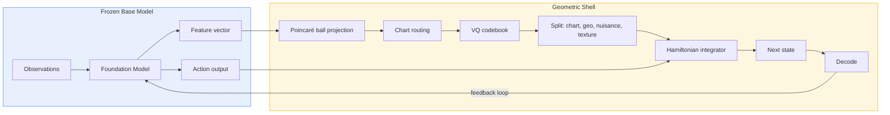

# The Fragile Geometric Shell: Turning Any Base Model into a White-Box World Model

Guillem Duran Ballester, March 2026

---

## TLDR

Fragile is a modular geometric shell that wraps any large base model -- VLA, LLM, or otherwise -- and converts it into a white-box world model. It does this by inserting a hyperbolic encoder that decomposes the base model's opaque activations into a structured latent space with interpretable Mixture of Experts, where expert routing is governed by Riemannian geometry rather than learned heuristics. The result: an interpretable, anti-collapse representation layer that makes large models auditable without retraining them.

---

## 1. The Problem

State-of-the-art deep learning is powerful but architecturally blind. Five concrete failures plague current systems:

**Black-box representations.** Foundation models (GPT, RT-2, Octo, SmolVLA) learn internal representations that work but cannot be inspected. When a VLA model controlling a robot arm makes a bad grasp, there is no principled way to ask *why* -- to determine which internal feature drove the decision, whether the model confused two objects, or whether the error will recur under slightly different lighting. The representation is a high-dimensional feature vector with no semantic structure imposed by the architecture.

**Expert collapse in Mixture of Experts.** MoE architectures (Switch Transformer, Mixtral, DeepSeek) scale efficiently by routing inputs to specialized experts. In practice, a small fraction of experts captures most of the traffic while the rest go dormant -- a failure mode called expert collapse. Current mitigations are ad-hoc: auxiliary load-balancing losses, capacity factors, random routing noise. These treat symptoms, not the underlying geometric cause. When experts collapse, the model loses representational capacity silently, and no amount of scaling recovers it.

**No guarantees under distribution shift.** Robotics and embodied AI face a fundamental challenge: the deployment environment always differs from training. A pick-and-place policy trained on a fixed table height will encounter tables at different heights, objects in different orientations, and lighting conditions that never appeared in the training set. Without structural guarantees about how representations vary with input conditions, there is no principled way to predict or bound failure under shift.

**No reward signal from action-only models.** Vision-Language-Action models (SmolVLA, pi0, OpenVLA) output actions and nothing else. There is no reward, no value estimate, no critic. This makes it impossible to filter unsafe trajectories before execution, plan ahead by evaluating candidate action sequences, detect subtle degradation in policy quality, or transfer to new tasks via reward shaping. Standard solutions require either hand-crafted reward functions (brittle, task-specific) or training a separate reward model from human preferences (RLHF -- expensive, data-hungry). Neither scales.

**No hard safety contracts in training.** When something goes wrong during training, current systems offer a single diagnostic: "loss went up." There is no way to determine *which* component failed, *why* it failed, or *what intervention* would fix it. Soft penalty terms accumulate into a scalar loss and hope that gradient descent will sort things out. When it doesn't -- when an expert dies, a codebook collapses, or the dynamics diverge -- the failure is silent and unlocalized. Engineers discover problems post-hoc by staring at MLflow curves.

These are not separate problems. They are symptoms of the same architectural gap: current models have no geometric structure in their latent space. Distances between representations are meaningless. There is no notion of locality, curvature, or covariance. The manifold hypothesis -- that data lives on a low-dimensional manifold -- is widely accepted but never enforced. And without structure, there is no principled way to extract rewards, enforce safety invariants, or guarantee that the representation degrades gracefully rather than catastrophically.

---

## 2. Executive Summary: What the Geometric Shell Delivers

Fragile addresses all five problems with a single architectural intervention: we wrap a frozen base model with a **geometric shell** that imposes hyperbolic structure on its latent space. The base model is never modified -- it serves only as a feature extractor. All interpretability, stability, and planning capabilities come from the shell.

Our current proofpoint wraps **SmolVLA** (HuggingFace's 500M-parameter Vision-Language-Action model), training on **LeRobot** robotics datasets. The same shell applies to any backbone that produces a fixed-dimension feature vector -- LLMs, vision transformers, diffusion models (see Section 7).

### 2.1 Architecture at a Glance

The shell has two components:

- **Geometric Encoder**: Maps the backbone's feature vector onto a Poincare ball (a model of hyperbolic space), routes it to the nearest expert via geodesic distance, and discretizes it through per-expert VQ codebooks. The output is a typed latent: **(chart, geometry, nuisance, texture)** -- four components with distinct roles, not a single opaque vector.

- **Geometric World Model**: Predicts how the latent state evolves under actions using a symplectic Hamiltonian integrator -- an energy-conserving numerical scheme where forces decompose into interpretable components. The predicted next state decodes back to feature space, closing the loop for multi-step rollouts.

### 2.2 What You Get

**1. Interpretable, typed representations.** Every encoding decomposes into:
- **K** (discrete): Which behavioral regime is active (e.g., approach, grasp, lift)
- **z_geo** (continuous): Position on the latent manifold -- the geometric state
- **z_n** (continuous): Nuisance -- pose, lighting, within-regime variation
- **z_tex** (continuous): Texture detail -- architecturally firewalled from control

An adversarial probe with gradient reversal enforces that nuisance cannot leak regime-transition information. This is not a soft penalty -- it is a causal guarantee on the factorization. See **Section 4** for the full white-box component inventory.

**2. Collapse-proof Mixture of Experts.** Expert routing is determined by hyperbolic distance to chart centers, not learned logits. The exponential volume growth of hyperbolic space creates geometric energy barriers against expert collapse -- merging two experts requires the optimizer to overcome exponentially steep geodesic distances. Nine complementary mechanisms (geometric, information-theoretic, and causal) ensure that all K charts and K×C codes remain active by construction. See **Section 3** for the full anti-collapse analysis.

**3. Free reward model from demonstrations.** Fitting a Hamiltonian system to demonstrations is a form of inverse optimal control: the potential that generates the observed trajectories IS the implicit cost function. The shell extracts three complementary reward signals without any reward labels -- a continuous value landscape from the learned potential, a discrete transition quality score from the Markov kernel, and a manifold proximity measure from geodesic distance. No RLHF, no hand-crafted rewards. See **Section 5** for the full reward extraction framework.

**4. A standalone discrete Markov model for free.** The causal enclosure probe doubles as an action-conditioned Markov transition kernel over the 256-state (chart, code) space. This ~50K-parameter MLP runs rollouts orders of magnitude faster than the full world model and yields an explicit, inspectable transition matrix. See **Section 3.2, mechanism #8** for details.

**5. Hard safety contracts.** A runtime monitoring system of 60 typed diagnostics watches every geometric and causal invariant. When an invariant is violated, training halts and localizes the failure -- not "loss went up" but "chart-observation mutual information dropped below threshold at epoch 47." See **Section 4.4** for the Sieve architecture.

### 2.3 The SmolVLA Proofpoint

We wrap SmolVLA without modifying any of its 500M parameters. The frozen backbone produces a feature vector per frame; our shell operates entirely in that feature space.

| What we measure | Why it matters |
|---|---|
| State-timestep alignment (AMI) | Do the 256 discrete states discover temporal task structure without labels? |
| Code utilization entropy | Are all experts and codes active, or has the MoE collapsed? |
| Geodesic prediction error | Can the world model predict trajectories on the curved manifold? |
| Energy conservation | Is the Hamiltonian integrator stable? |
| Generalization under shift | Does the geometric structure degrade gracefully on held-out conditions? |

The pipeline: freeze backbone → extract features → train geometric shell in three phases (encoder warmup with 16 structural losses, world model warmup with geodesic diffusion, joint fine-tuning with gradient isolation) → evaluate on held-out episodes. See **Section 6** for the full experimental setup and **Section 3** for the training pipeline details.

**Early results from the current prototype** confirm that the geometric structure discovers temporal task phases without any phase labels:

### 2.4 The Geometric MoE: Charts as Experts

The core architectural innovation. In standard MoE, a learned router network outputs logits that select experts. The routing has no geometric meaning -- it is a black-box function of the input.

In Fragile, **routing is geometric**. Each expert is a **chart** on a curved manifold (the Poincare ball). Each chart has a center $c_k$ that lives on the same ball as the data. Routing is determined by hyperbolic distance:

$$s_{\text{dist}}(z, k) = -\frac{d_{\mathbb{P}}(z, c_k)}{\tau(z)}, \quad \tau(z) = \frac{\sqrt{K}(1 - \|z\|^2)}{2}$$

where $d_{\mathbb{P}}$ is the Poincare ball distance and $\tau(z)$ is a position-dependent temperature derived from the local curvature. Points near the boundary (high curvature) get sharp routing; points near the origin (low curvature) get soft routing. Think of it like a confidence-aware gating mechanism: the geometry itself controls how decisive the routing is.

Each chart $k$ has its own VQ codebook: a set of quantization codes in the ball. The encoder selects the nearest code within the active chart, producing a discrete symbol $K$ and a continuous residual.

**What this means for anti-collapse:** In flat space, two experts can be arbitrarily close in parameter space and still compete for the same inputs. In hyperbolic space, the exponential volume growth means that well-separated charts have exponentially more capacity than collapsed ones. The geometry creates an energy barrier against collapse -- like trying to merge two cities on opposite sides of a mountain range. The full anti-collapse system is detailed in **Section 3**.

---

## 3. Anti-Collapse: Why Our MoE Won't Degenerate

Expert collapse is the central failure mode of Mixture of Experts. In Switch Transformer, GShard, and Mixtral, collapse is fought with auxiliary load-balancing losses, capacity factors, and random routing noise. These are engineering patches. They work partially and unpredictably. They have no geometric justification.

Fragile solves collapse through geometry. Here is how.

### 3.1 The Collapse Problem

**Expert collapse** occurs when one expert captures most inputs and the others receive no gradient signal, effectively dying. In VQ-VAE and VQ-GAN, the analogous failure is **code collapse**: only a handful of codebook entries are ever used.

Standard mitigations:
- **Switch Transformer**: Auxiliary load-balancing loss `α · f_i · P_i` where `f_i` is fraction routed to expert `i`
- **GShard**: Random capacity factor with overflow dropping
- **Mixtral**: Top-k routing with softmax normalization
- **VQ-VAE**: EMA codebook updates, codebook reset heuristics

All of these are heuristic. None of them guarantee that collapse won't happen -- they just make it less likely. And none of them provide a geometric reason why experts should stay separated.

### 3.2 Nine Anti-Collapse and Causal Integrity Mechanisms

Our approach uses nine mechanisms that work together -- seven derived from the geometry of the Poincare ball, plus two causal/temporal consistency mechanisms:

**1. Chart Diversity Loss** -- Penalizes non-uniform chart usage:
$$\mathcal{L}_{\text{diversity}} = \log K - H[p(K)]$$
where $p(K)$ is the empirical chart usage distribution. Maximum entropy $H = \log K$ gives zero loss. Any collapse increases loss.

**2. Code Collapse Penalty** -- Differentiable via soft hyperbolic assignment:
$$p_j = \text{softmax}\left(-d_{\mathbb{P}}(v, \text{code}_j) / \tau\right), \quad \mathcal{L}_{\text{code}} = \max_j p_j - 1/N_{\text{codes}}$$
Unlike bincount-based methods, this is fully differentiable through the codebook and encoder. If one code dominates, the penalty drives the encoder to spread assignments.

**3. Codebook Spread Loss** -- Hinge loss on pairwise hyperbolic distances:
$$\mathcal{L}_{\text{spread}} = \frac{1}{|\mathcal{P}|}\sum_{(i,j) \in \mathcal{P}} \text{ReLU}\left(\text{margin} - d_{\mathbb{P}}(\text{code}_i, \text{code}_j)\right)$$
This forces codebook entries to maintain minimum geodesic separation. In hyperbolic space, this is particularly effective because the available volume grows exponentially with radius -- there is always room to spread.

**4. Hyperbolic Uniformity Loss** -- Repulsion via log-sum-exp:
$$\mathcal{L}_{\text{uniform}} = \log \frac{1}{N(N-1)} \sum_{i \neq j} e^{-d_{\mathbb{P}}(z_i, z_j) / \tau}$$
This encourages embeddings to spread uniformly across the ball, similar to how contrastive losses spread representations in flat space -- but with curvature-aware temperature scaling.

**5. Radial Calibration** -- Confidence encoded in distance from origin:
$$\mathcal{L}_{\text{radial}} = \left\| \|z\| - \sigma\left(H[w(z)]\right) \right\|^2$$
Points with sharp routing (low entropy $H[w]$, high confidence) should have large radius (near boundary). Points with uncertain routing (high entropy) should have small radius (near origin). This calibrates the geometric meaning of position: distance from origin = confidence. Think of it as a built-in uncertainty estimator baked into the geometry.

**6. Window Loss (Information Grounding)** -- Ensures chart assignment carries information:
$$I(X; K) \geq \varepsilon_{\text{ground}}$$
This enforces a minimum mutual information between observations and chart assignments, preventing the pathological case where routing ignores the data entirely. It is analogous to ensuring that cluster assignments in k-means actually depend on the input features.

**7. Routing Entropy Control** -- Temperature-annealed sharpness:
- Early training: high temperature $\tau \gg 1$ (soft routing, all charts receive gradient)
- Late training: low temperature $\tau \to 0$ or hard routing via Gumbel-softmax
- Negative $\tau$: deterministic argmax routing (fully hard, straight-through gradient)

**8. Causal Enclosure Loss + Discrete Markov Transition Model** -- Adversarial probe with gradient reversal that doubles as a standalone predictor:

The nuisance component $z_n$ must not leak information about chart transitions. An adversarial probe attempts to predict the next (chart, code) state from $z_n$; a gradient reversal layer (GRL) reverses the gradient flowing into the encoder:

$$\mathcal{L}_{\text{enc}} = \text{CE}\left(\text{probe}([\bar{c}, \text{code\_embed}(s_t), a, \text{GRL}_\alpha(z_n)]),\; S_{t+1}\right)$$

where $S_{t+1} = K_{t+1} \cdot C + s_{t+1}$ is the flat (chart, code) state index in a state space of size $K \times C$ (e.g., $8 \times 32 = 256$ states).

The GRL strength $\alpha$ ramps linearly from 0 to maximum over a warmup period. A baseline probe (without $z_n$) measures the accuracy defect: if $z_n$ adds predictive power beyond what chart embedding + action already provide, the encoder is penalized. This ensures the latent decomposition is causally clean -- $z_n$ carries nuisance/pose information only, not regime-switching signals.

**The baseline probe as a coarse-grained Markov model.** The baseline probe maps `(chart_embed, code_embed, action) → logits [B, K*C]` -- this is exactly a discrete, action-conditioned Markov transition kernel over the (chart, code) state space. At inference time, this probe can be used as a **standalone transition predictor** without the encoder or world model:

$$P(S_{t+1} \mid c_{\bar{t}}, s_t, a_t) = \text{softmax}\left(\text{baseline\_probe}([c_{\bar{t}}, \text{code\_embed}(s_t), a_t])\right)$$

This is valuable for three reasons:

1. **Lightweight planning.** The probe is a small MLP (~50K parameters) that predicts discrete state transitions. It can run rollouts over the (chart, code) state graph orders of magnitude faster than the full world model. For coarse task planning ("will I transition from approach to grasp?"), the discrete model suffices.

2. **Interpretable transition matrix.** By evaluating the probe over all (state, action) pairs, you extract an explicit $K \cdot C \times K \cdot C$ transition matrix per action. This matrix is directly inspectable: which (chart, code) transitions are likely, which states are absorbing, whether the Markov chain is ergodic or has transient components.

3. **Causal verification at deployment.** The accuracy defect (full probe accuracy minus baseline probe accuracy) is a real-time causal diagnostic. If the defect is near zero, the latent decomposition is clean. If it grows, $z_n$ is leaking regime information -- a sign that the encoder needs retraining.

The probe is a **first-class artifact**: returned from all training phases, saved in every checkpoint (periodic and final), propagated across phases (Phase 1's trained probe warm-starts Phase 3), and loaded for inference. The discrete Markov transition model is always available alongside the continuous world model.

**9. Zeno Loss (Routing Smoothness)** -- Penalizes rapid chart switching:

$$\mathcal{L}_{\text{zeno}} = \frac{1}{H-1}\sum_{t=1}^{H-1} \text{JSD}(w_t \| w_{t-1})$$

where $w_t$ is the soft routing distribution at timestep $t$ and JSD is the Jensen-Shannon divergence (symmetric, bounded). This prevents "chart chattering" -- pathological rapid switching between charts on consecutive frames that destabilizes both the encoder and world model. RL practitioners will recognize this as analogous to action smoothness penalties, but applied to the discrete routing variable.

### 3.3 Why Geometry Beats Heuristics

The fundamental advantage is that hyperbolic space has **exponential volume growth**. In the Poincare ball model, the volume element scales as:

$$dV = \lambda(z)^D \, dz^1 \cdots dz^D, \quad \lambda(z) = \frac{2}{1-\|z\|^2}$$

As points approach the boundary ($\|z\| \to 1$), $\lambda \to \infty$. The boundary region of the ball has **exponentially more volume** than the center. Consequences:

- **Codes spread naturally.** The uniformity loss pushes codes toward high-volume regions (the boundary), where there is exponentially more room to separate. In flat space, uniformity loss fights against the curse of dimensionality. In hyperbolic space, it is assisted by it.

- **Collapse is energetically costly.** For two chart centers to merge, they must overcome the geodesic distance barrier. Near the boundary, small Euclidean movements correspond to large geodesic distances. Collapse requires the optimizer to push charts through an exponentially steep energy landscape.

- **Hierarchical structure for free.** Trees embed isometrically in hyperbolic space (Sarkar 2011). If the task has hierarchical structure (e.g., grasp type → object class → task phase), the geometry naturally accommodates it without explicit hierarchy engineering.

### 3.4 Activation Strategy

All nine mechanisms are active from epoch 0, with two exceptions that use warmup schedules:

| Mechanism | Activation | Rationale |
|---|---|---|
| Mechanisms 1-7 | Active from epoch 0 | All geometric anti-collapse losses fire immediately |
| Jump consistency | Linear warmup over configurable epoch range | Jump operators require minimally stable charts before learning meaningful transitions |
| Causal enclosure GRL (#8) | Gradual strength ramp over thousands of steps | The adversarial gradient must ramp slowly to avoid destabilizing early encoder training |

This "all active, slow adversarial ramp" strategy avoids the complexity of epoch-based gating while preventing the GRL from destroying nascent chart structure.

### 3.5 Quantitative Signature of Health

The window loss provides a real-time diagnostic. During training, we monitor three quantities:

- **H(K)**: Marginal chart entropy. Should be near `log(K)` (all charts used).
- **H(K|X)**: Conditional entropy. Should be low (router is decisive per input).
- **I(X;K) = H(K) - H(K|X)**: Mutual information. Must exceed a minimum threshold.

A collapsing MoE shows $H(K) \to 0$ (one chart dominates) or $I(X;K) \to 0$ (routing ignores input). Our system raises an automatic penalty the moment either degradation begins, long before it manifests as downstream performance loss. Per-chart code entropy monitors whether each chart uses all its codebook entries, catching the "silent death" of individual codes that global metrics would miss.

**The bottom line:** Standard MoE systems treat collapse as a nuisance to be suppressed. Our geometric framework treats it as a physical impossibility to be engineered away. The hyperbolic embedding provides the capacity, the distance-based routing provides the mechanism, the causal enclosure ensures the decomposition stays clean, and the zeno loss prevents routing instability.

### 3.6 The Three-Phase Training Pipeline

Training proceeds in three phases, each building on the previous:

**Phase 1: Encoder Warmup** (configurable epochs)
- Input: sequences of feature vectors (temporal losses like causal enclosure and routing smoothness require sequential data)
- 16 loss terms, each enforcing a specific geometric, topological, or causal invariant:

| # | Loss | Purpose |
|---|---|---|
| 1 | Feature reconstruction (MSE) | Ensure the latent preserves input information |
| 2 | VQ commitment | Standard vector-quantisation straight-through loss |
| 3 | Routing entropy | Encourage peaked (not uniform) chart selection |
| 4 | Diversity | Prevent all inputs from collapsing to a single chart |
| 5 | Hyperbolic uniformity | Spread embeddings across the Poincare ball |
| 6 | Radial calibration | Match distance-from-origin to routing confidence |
| 7 | Codebook spread | Maintain minimum pairwise distance between codes |
| 8 | Chart collapse penalty | Penalise dead charts (charts receiving < 1/K traffic) |
| 9 | Code collapse penalty | Penalise dead codes within a chart |
| 10 | Window loss | Enforce minimum mutual information I(X;K) between observations and charts |
| 11 | Encoder-decoder consistency | KL divergence between encoder and decoder routing |
| 12 | Jump consistency | Ensure chart transitions are topologically coherent (warmed in) |
| 13 | Soft-equivariant metric | Fiber-bundle structure preservation |
| 14 | Orthogonality loss | Decorrelate nuisance and texture components |
| 15 | Causal enclosure loss | Adversarial probe prevents nuisance from leaking (chart, code) state-transition info |
| 16 | Zeno loss (routing smoothness) | Penalize rapid chart switching between consecutive frames |

- Output: stable chart structure with well-separated codebooks and causally clean latent decomposition

**Phase 2: World Model Warmup** (configurable epochs, encoder frozen)
- Input: sequences encoded to Poincare ball trajectories (encoder is frozen)
- World model learns to predict next latent from current latent + action
- **Geodesic diffusion supervision** (default): Creates intermediate waypoints along the shortest path (geodesic) between consecutive latent states on the ball. The world model is trained to match each waypoint, not just endpoints. Same-chart pairs use geodesic matching; cross-chart pairs use chart transition cross-entropy.
- Additional losses: energy conservation, force decomposition consistency, potential smoothness
- Output: dynamics that respect manifold geometry

**Phase 3: Joint Fine-Tuning** (configurable epochs, gradient-isolated alternating optimization)
- Both encoder and world model trainable at different learning rates with separate optimizers
- **Two-step alternating optimization** per batch, with gradient isolation:
  1. **Encoder step** (world model frozen): Update encoder using all structural/causal losses
  2. **World model step** (encoder detached): Detach all encoder outputs from its computational graph, then update world model on dynamics losses only
- The detachment barrier completely breaks the gradient path between components, preventing dynamics gradients from destabilizing the encoder's geometric structure. Unlike PCGrad or CAGrad (which modify conflicting gradients post-hoc), this is a hard architectural guarantee -- no gradient conflict resolution needed.
- The causal enclosure probe trained in Phase 1 warm-starts into Phase 3, so the Markov transition model benefits from the full training history.

**Why three phases?** The geometric structure (chart assignment, codebook topology) must stabilize before dynamics can be learned on top of it. Causal and temporal constraints must be enforced *during* encoder warmup -- not introduced later -- to prevent Phase 3 from reshuffling chart assignments. The gradient barrier in Phase 3 eliminates catastrophic interference. This follows the mathematical structure: the base manifold must exist before you can define dynamics on it.

---

## 4. White-Box World Model: Every Component Has Physical Meaning

### 4.1 What "White Box" Means Here

Standard VLAs produce opaque hidden states. Our geometric shell produces a latent space where every component has a named interpretation:

| Component | Type | Meaning | Inspectable? |
|---|---|---|---|
| $K$ (chart index) | Discrete | Which behavioral regime is active | Direct readout |
| $z_{\text{geo}}$ (geometric coordinate) | Poincare ball | Position on the latent manifold | Poincare disk plot |
| $z_n$ (nuisance) | Tangent vector | Pose, disturbance, within-regime variation | Tangent space analysis |
| $z_{\text{tex}}$ (texture) | Tangent vector | Reconstruction detail only | Firewalled from control |
| $w$ (routing weights) | Simplex | Soft chart membership | Entropy histogram |
| VQ index | Discrete | Which codebook entry within chart | Symbol table |
| Enclosure defect | Scalar | How much $z_n$ leaks (chart, code) state-transition info | Probe accuracy difference |
| Discrete transition model | $K{\cdot}C \times K{\cdot}C$ Markov kernel | Action-conditioned (chart, code) transitions | Explicit matrix extraction |
| Zeno flip rate | Scalar | Rate of chart switching between frames | Direct computation |

The **texture firewall** is architecturally enforced: $z_{\text{tex}}$ feeds only into the decoder's texture residual path. It never enters the world model. This means dynamics cannot depend on reconstruction artifacts -- a structural guarantee, not a training signal.

### 4.2 The World Model as a Learned Physics Simulator

The world model is not a black-box RNN. It is a **symplectic Hamiltonian integrator** -- a numerical scheme borrowed from molecular dynamics that conserves energy by construction. Each prediction step splits into interpretable sub-operations:

**Leapfrog Integration** (multiple refinement sub-steps per horizon step):

| Step | Operation | Meaning (RL analogy) |
|---|---|---|
| **B** (kick) | $p \leftarrow p - \frac{h}{2}\nabla_z \Phi_{\text{eff}}$ | Half momentum update from value gradient |
| **A** (drift) | $z \leftarrow \text{geodesic\_step}(z, p, h/2)$ | Half position update along shortest path (respects curvature) |
| **O** (thermostat) | $p \leftarrow e^{-\gamma h} p + \sigma \xi$ | Friction + stochastic exploration (like OU noise in continuous control) |
| **A** (drift) | (same as above) | Second half position update |
| **B** (kick) | (same as first B) | Second half momentum update |

The forces decompose into three physically meaningful components (analogous to Helmholtz decomposition in fluid dynamics):

$$F = F_{\text{cons}} + F_{\text{sol}} + F_{\text{topo}}$$

where:

$$F_{\text{cons}} = -\nabla \Phi_{\text{eff}}, \quad F_{\text{sol}} = \beta \mathcal{F}_{ij}\dot{z}^j, \quad F_{\text{topo}} = f_{\text{harmonic}}$$

- **Conservative force** $F_{\text{cons}}$: Gradient of the effective potential $\Phi_{\text{eff}}$. Drives the agent toward low-cost regions. This is the learned value landscape -- states where demonstrations spend time have low potential.

- **Solenoidal force** $F_{\text{sol}}$: An antisymmetric field (enforced architecturally, like the Lorentz force in electromagnetism). Produces velocity-dependent steering -- responsible for orbiting and cyclic behaviors (e.g., repetitive manipulation motions).

- **Topological force** $F_{\text{topo}}$: Chart transition force that encodes regime switching in latent space.

**Built-in stability**: Forces and velocities are bounded by learned scale parameters derived from the minimum resolvable length scale, ensuring the integrator never takes steps so large that it leaves the manifold. RL practitioners will recognize this as analogous to trust-region constraints, but derived from the geometry rather than imposed as a hyperparameter.

**Chart jumps** (regime transitions): When the system needs to change behavioral regime, a learned jump operator teleports the state to the new chart center via a rotation on the ball, and momentum is reinitialized. Jump decisions use both a supervised component (trained to match observed chart transitions) and a value-driven component (prefer charts with low potential and short geodesic distance).

### 4.3 The Diagnostic Dashboard

The system ships with a full interactive dashboard built on Panel/HoloViews. Checkpoints contain all trained artifacts -- encoder, jump operator, world model, and enclosure probe -- loaded automatically:

**Latent Space Tab:**
- 3D scatter plot of Poincare ball embeddings, colored by chart / episode / timestep / radius
- 2D slices showing chart boundaries
- Chart usage histogram (detect collapse immediately)
- Code-timestep distribution (verify temporal structure)

**Reconstruction Tab:**
- Per-sample feature reconstruction error
- Latent bars showing z_geo, z_n, z_tex magnitudes
- Click-to-inspect: select a point to view the original camera image and its full latent decomposition

**Dynamics Tab:**
- Transition matrix between (chart, code) states (normalized rows)
- State-timestep alignment matrix with AMI score
- Predicted vs target trajectory overlay (geodesic error visualization)
- Rollout visualization: watch the world model predict future states

### 4.4 The Sieve: Hard Safety Contracts

The Sieve is a runtime monitoring system comprising 60 diagnostic nodes organized into typed families. Unlike soft penalty terms that accumulate into a loss and hope for the best, Sieve diagnostics are **hard contracts**: when an invariant is violated, training halts or reverts rather than continuing with corrupted gradients.

| Family | What it watches | Example diagnostics |
|---|---|---|
| **Switching / Zeno** | Is the agent changing actions too fast? | Chattering detection, jump rate bounds |
| **Compactness** | Are representations staying inside the ball? | Radius bounds, chart usage uniformity, dead-code pruning |
| **Scaling** | Do updates stay in proportion? | Gradient norm tracking, trust-region checks |
| **Coupling / Sync** | Are encoder and world model consistent? | Chart synchronization, information window bounds |
| **Value / Pathology** | Is the value estimate well-behaved? | Spectral gap checks, Lyapunov descent verification |
| **Energy / Conservation** | Is the integrator conserving energy? | Energy variance bounds, stability violation detection |

**Key design principle: halt, don't penalize.** When a diagnostic triggers, the system identifies *which* component failed, logs the signature, and halts the update. This makes failures **localizable**: each node answers "what failed, where, and why." Each failure mode maps to a named intervention (gradient clipping for divergence, reduced learning rate for oscillation). The mapping is deterministic, not heuristic.

### 4.5 Comparison: Standard VLA vs Fragile-Wrapped VLA

| Aspect | Standard VLA (e.g., pi0, OpenVLA) | Fragile-Wrapped VLA |
|---|---|---|
| **Internal state** | High-dimensional embedding; no guaranteed semantics | Typed: K (regime), z_geo (state), z_n (nuisance), z_tex (texture) |
| **Expert routing** | Learned logits (black box) | Hyperbolic distance (geometric meaning) |
| **Collapse protection** | Load balancing (heuristic) | 9 geometric + causal mechanisms (principled) |
| **World model** | Autoregressive token prediction or MLP | Symplectic Hamiltonian integrator (energy-conserving) |
| **Force interpretation** | N/A | Conservative + Solenoidal + Topological decomposition, with per-step ratios |
| **Energy conservation** | Not tracked | Hamiltonian variance monitored and penalized |
| **Curvature handling** | Euclidean (flat) latent space | Poincare geometry with curvature corrections |
| **Regime identification** | Post-hoc clustering or none | First-class discrete (chart, code) state, auditable at every timestep |
| **Safety monitoring** | Loss curves + manual inspection | 60 typed diagnostics; hard halt on invariant violation |
| **Failure localization** | "Loss went up" | "Chart-observation mutual info dropped below threshold at epoch 47" |
| **Runtime inspection** | MLflow/W&B scalars | Interactive dashboard: click-to-inspect latent points, camera images, force decomposition |
| **Causal decomposition** | No guarantee on what components encode | Adversarial probe enforces z_n cannot predict (chart, code) state transitions |
| **Discrete transition model** | N/A | Baseline probe yields an explicit action-conditioned Markov kernel over (chart, code) states |
| **Reward model** | None (action output only) | Three implicit reward signals from geometry -- no reward labels needed |
| **Routing stability** | Routing can oscillate freely | Zeno loss bounds chart-switching rate |
| **Dynamics supervision** | End-to-end (opaque) | Geodesic waypoint matching along shortest paths |
| **Base model** | Modified / fine-tuned | Frozen (wrapper only, zero base model params modified) |

**The net effect:** when a Fragile-wrapped VLA misbehaves, you don't stare at a loss curve wondering what went wrong. You open the dashboard, see which (chart, code) state the system was in, inspect the force decomposition acting on it, check whether energy was conserved, and read the diagnostic that fired. Every internal quantity has a name, a geometric meaning, and a visual representation.

---

## 5. Reward from Geometry: Inverse Optimal Control Without Reward Labels

### 5.1 The Problem: VLAs Have No Reward Signal

A VLA takes images and a language instruction and outputs *actions*. That is all. There is no reward signal, no value head, no critic network. The model is a black-box policy: observation in, action out. If you want to do planning, rollout evaluation, safety filtering, or any form of reasoning about "is this trajectory good?", you have nothing to work with.

This is a fundamental limitation for deployment. Without a reward model you cannot:
- **Filter unsafe trajectories** before execution (you have no criterion for "safe")
- **Plan ahead** by evaluating candidate action sequences (you have no objective to maximize)
- **Detect degradation** when the policy starts producing subtly worse trajectories (you have no quality metric)
- **Transfer to new tasks** by reward shaping (you have no reward to shape)

Standard approaches require either explicit reward engineering (task-specific, brittle) or training a separate reward model from human preference data (RLHF-style, expensive). Both require supervision that the raw VLA demonstrations do not provide.

### 5.2 The Geometric Shell Learns a Reward Model for Free

The Fragile geometric shell solves this. By wrapping a frozen VLA and training on its demonstration trajectories, the shell learns three complementary reward signals -- none of which require explicit reward labels. The key insight is that **fitting a Hamiltonian system to demonstrations is a form of inverse optimal control**: the potential energy function that generates the observed trajectories IS the implicit cost function.

**Signal 1: The Effective Potential $\Phi_{\text{eff}}$ (Continuous Value Landscape)**

The world model learns a scalar field on the Poincare ball:

$$\Phi_{\text{eff}}(z, K) = \alpha\, U(z) + (1-\alpha)\, V_{\text{critic}}(z, K) + \gamma_{\text{risk}}\, \Psi_{\text{risk}}(z, K)$$

where $U(z)$ is an analytic radial drive term, $V_{\text{critic}}$ is a learned chart-conditioned value field, and $\Psi_{\text{risk}}$ is a learned risk penalty. The world model is trained to reproduce demonstrated trajectories via Hamiltonian integration. By classical results in optimal control (the Pontryagin maximum principle), the potential that generates optimal trajectories encodes which states the demonstrations prefer.

This means: **$R_{\Phi}(z, K) = -\Phi_{\text{eff}}(z, K)$ is an implicit reward function.** States where demonstrations spend time have low potential (the integrator naturally flows there). States demonstrations avoid have high potential (the integrator flows away). No reward label was needed -- the reward is a byproduct of fitting the dynamics. This is exactly the classical **inverse reinforcement learning** result, but derived geometrically rather than via reward function search.

The force decomposition gives additional structure that a scalar reward model cannot:
- The **conservative force** $-\nabla\Phi_{\text{eff}}$ points toward desirable regions (gradient descent on cost)
- The **solenoidal force** encodes cyclic behavior (orbits around value isosurfaces -- e.g., repetitive manipulation motions)
- The **topological residual** captures chart transitions that cannot be expressed as gradients or curls

This is richer than a scalar reward: it is a **reward field** with directionality. You know not just "how good is this state" but "which direction improves it and why."

**Signal 2: Transition Likelihood from the Markov Kernel (Discrete Reward)**

The baseline probe maps `(chart_embed, code_embed, action) → logits [B, K*C]`. At inference this is an action-conditioned Markov transition kernel:

$$P(S_{t+1} \mid s_t, a_t) = \text{softmax}\left(\text{baseline\_probe}([\bar{c}_t, \text{code\_embed}(s_t), a_t])\right)$$

For correct demonstrations, the log-likelihood under this model is a reward signal:

$$R_{\text{Markov}}(s_t, a_t, s_{t+1}) = \log P(S_{t+1} \mid s_t, a_t)$$

High-probability transitions = demonstrated behavior = high reward. Low-probability transitions = off-demonstration = low reward. This requires zero additional training -- the probe is already learned as part of the causal enclosure mechanism.

This discrete reward has a practical advantage: you can extract the full transition matrix per action and analyze it directly. Which state transitions are absorbing (task completion)? Which are transient? The **mean first passage time** from any state to the absorbing state gives a "task progress" reward computable in closed form.

**Signal 3: Geodesic Deviation (Manifold Proximity Reward)**

The simplest signal: how far is a state from any demonstrated trajectory?

$$R_{\text{geodesic}}(z) = -\min_{z_{\text{demo}} \in \mathcal{D}} d_{\mathbb{P}}(z, z_{\text{demo}})$$

In hyperbolic space this is particularly well-behaved. The exponential volume growth means that states far from the demonstrated manifold are penalized super-linearly, creating a natural "funnel" around demonstrated trajectories: small deviations are cheap, large deviations are catastrophically expensive. This is like a continuous version of behavioral cloning's implicit reward, but with geometry-aware distance.

### 5.3 Why This Works: Inverse Optimal Control via Hamiltonian Fitting

The theoretical justification connects to classical optimal control. The Hamiltonian integrator solves:

$$\dot{z} = \frac{\partial H}{\partial p}, \quad \dot{p} = -\frac{\partial H}{\partial z} + u_\pi(z, a)$$

where $H(z, p) = \frac{1}{2}g^{-1}(z)|p|^2 + \Phi_{\text{eff}}(z)$ is the Hamiltonian (kinetic + potential energy) and $u_\pi$ is the control force. Training the world model to reproduce demonstrated trajectories means finding $(\Phi_{\text{eff}}, u_\pi)$ such that the Hamiltonian flow matches the demonstrations.

This is exactly the **inverse optimal control problem**: given optimal trajectories, recover the cost function. Classical results (Kalman 1964, Moylan-Anderson 1973) show that this is well-posed under mild conditions (controllability + observability). The Poincare ball geometry adds regularity that prevents the degenerate solutions plaguing unconstrained inverse RL: the curvature bounds the metric, stability constraints bound forces, and a smoothness penalty regularizes the potential.

The result is a reward model that is:
- **Structured**: Three components (potential + transition likelihood + geodesic deviation) capture different aspects of reward at different scales
- **Interpretable**: Each component has a named geometric meaning, not a black-box scalar
- **Free**: No reward labels, no human preferences, no additional training -- all three signals are byproducts of normal training
- **Multi-scale**: $\Phi_{\text{eff}}$ gives continuous value landscape, the Markov kernel gives discrete transition quality, geodesic deviation gives manifold proximity

### 5.4 Practical Usage: A Combined Reward for Planning and Safety

The three signals combine into a multi-scale reward:

$$R(z, s, a, s') = w_\Phi\, R_\Phi(z, K) + w_M\, R_{\text{Markov}}(s, a, s') + w_g\, R_{\text{geodesic}}(z)$$

| Component | Scale | Speed | What it catches |
|---|---|---|---|
| $R_\Phi$ | Continuous, per-position | 1 forward pass through potential network | "Is this region of latent space valuable?" |
| $R_{\text{Markov}}$ | Discrete, per-transition | 1 forward pass through small MLP (~50K params) | "Is this transition consistent with demonstrations?" |
| $R_{\text{geodesic}}$ | Continuous, per-position | Nearest-neighbor lookup | "How far is this state from anything demonstrated?" |

**For trajectory filtering:** Before executing a candidate action sequence, roll out the world model and evaluate $R$ along the trajectory. Reject trajectories that enter low-reward regions.

**For safety monitoring:** Continuously evaluate $R_{\text{geodesic}}$ on the current state. If the system drifts beyond a geodesic distance threshold from the demonstrated manifold, flag for human review. The hyperbolic geometry makes this threshold meaningful: a fixed geodesic distance corresponds to an exponentially increasing Euclidean volume, so the threshold is naturally calibrated to the local density of demonstrations.

**For task progress estimation:** Extract the Markov transition matrix, identify absorbing states (task completion), compute mean first passage times. This gives a real-time "percentage complete" estimate grounded in the demonstration statistics.

---

## 6. Practical Proofpoint: SmolVLA + LeRobot

### 6.1 The Setup

Our proofpoint wraps **SmolVLA** (HuggingFace's 500M-parameter Vision-Language-Action model) with the Geometric Shell, training on **LeRobot** robotics datasets (real robot manipulation tasks).

**Pipeline:**
1. **Freeze SmolVLA** backbone. Extract features from the final layer. Cache per-episode.
2. **Train Geometric Shell** (Phase 1 → 2 → 3): encoder warmup on sequences (with causal enclosure and routing smoothness active from the start), world model on sequences with geodesic diffusion supervision, joint fine-tuning with gradient-isolated alternating optimization.
3. **Evaluate** on held-out episodes and varied conditions.

**Why this is representative:**

| Requirement | How robotics delivers |
|---|---|
| Random elements | Stochastic contact dynamics, visual noise, object placement variance |
| SOTA baseline | SmolVLA (HuggingFace/LeRobot) -- a production Vision-Language-Action model |
| Clear generalization metric | Train on N object placements, test on held-out placements and lighting |
| Representative of target market | Robotics, autonomous systems, embodied AI are the path to revenue |

The key insight: we do **not** retrain or compete with SmolVLA. We **wrap** it. The frozen backbone generates features; our Geometric Shell operates entirely in that feature space. This is the product: a geometry layer that makes any foundation model interpretable, stable, and generalizable.

### 6.2 What We Measure

We target three categories of measurable impact:

**Representation Quality:**
- **State-Timestep Alignment (AMI)**: Adjusted Mutual Information between (chart, code) state assignments and timestep within episode. High AMI = the discrete state space discovers temporal structure (e.g., different states activate at approach vs grasp vs lift phases) without any phase labels.
- **Code Utilization Entropy**: $H[\text{code usage}] / \log N_{\text{codes}}$. Should be near 1.0 (uniform). Values below 0.5 indicate collapse.
- **Radial Distribution**: Points should fill the Poincare ball meaningfully, not cluster at origin or boundary.

**Prediction Accuracy:**
- **Geodesic Prediction Error**: For each action sequence, the world model predicts the trajectory on the Poincare ball. Error is measured as mean hyperbolic distance:
$$d_{\mathbb{H}}(z_{\text{pred}}, z_{\text{target}}) = \frac{2}{\sqrt{c}} \operatorname{artanh}\left(\sqrt{c} \| (-z_{\text{pred}}) \oplus z_{\text{target}} \|\right)$$
This metric is native to the geometry. Since radial calibration places confident points (sharp routing) near the boundary and uncertain points near the origin, the geodesic metric is automatically **stricter where the encoder is confident** and more forgiving where it is uncertain. This is a built-in uncertainty-weighted error metric that requires no additional calibration.
- **Chart Transition Accuracy**: Cross-entropy on predicted vs actual chart transitions.
- **Energy Conservation**: Variance of the effective Hamiltonian across trajectory -- should be near zero for a well-calibrated integrator.

**Generalization:**
- Train on episodes with specific object positions/orientations
- Test on held-out variations (different positions, lighting, objects)
- Measure prediction error degradation: geometric structure should degrade gracefully (not catastrophically) under shift
- State consistency: same task phase should map to the same (chart, code) state regardless of visual conditions

### 6.3 Competitive Advantages

| Advantage | Mechanism | Measurable Outcome |
|---|---|---|
| **Any base model** | Frozen backbone + geometric shell | Same encoder wraps SmolVLA, ViT, or any feature extractor |
| **No mode collapse** | 9 geometric + causal mechanisms | Code utilization entropy > 0.8 consistently |
| **Interpretable dynamics** | Force decomposition | Name the force that caused each prediction |
| **Provable stability** | Symplectic integrator | Energy conservation bounded |
| **Sample efficiency** | Regime/nuisance/texture split removes redundancy | Fewer epochs to convergence |
| **Hard safety** | Sieve contracts halt on violation | Zero silent failures |
| **Causal latent decomposition** | Adversarial enclosure probe + GRL | z_n provably cannot predict (chart, code) state transitions |
| **Free Markov model** | Baseline probe = discrete transition kernel | Lightweight planning over (chart, code) states without encoder/WM |
| **Free reward model** | Inverse optimal control via Hamiltonian fitting | Three reward signals from demonstrations alone -- no labels, no RLHF |
| **Routing stability** | Zeno loss (JSD on consecutive routing) | Chart flip rate bounded, no chattering |
| **Sim-to-real ready** | No hidden state assumption | Swap base model without retraining shell |

### 6.4 The Generalization Argument

Why should geometric structure help generalization? Four reasons:

**1. Exponential capacity.** Hyperbolic space has exponential volume growth with dimension. A 16-dim Poincare ball can embed exponentially more hierarchical structure than a 16-dim Euclidean space. New conditions (e.g., different object poses) map to different regions of the ball without overwriting existing representations.

**2. Chart separation.** Each chart (expert) specializes in a behavioral regime (e.g., approach, grasp, lift). Under distribution shift, the chart assignment may change, but the within-chart dynamics remain valid. This is like having a separate model for each phase, but with smooth transitions.

**3. Curvature-aware dynamics.** The world model uses geodesic flow that respects the manifold curvature. Predictions follow the natural geometry of the latent space, not Euclidean shortcuts. Under shift, the curvature changes locally but the integration scheme adapts automatically.

**4. Hybrid discrete-continuous updates.** Chart transitions (discrete jumps) and within-chart dynamics (continuous flow) are unified in a single geometric framework. This prevents the catastrophic "mode switching" that plagues models with separate discrete and continuous representations.

---

## 7. Beyond VLA: The Broader Vision

### 7.1 The Architecture is Base-Model Agnostic

The Geometric Shell is model-agnostic by design. Replace the backbone with any model that produces a fixed-dimension feature vector. The same architecture works on:

- **LLMs** (GPT, Llama, Mistral): Wrap hidden states with geometric encoder. Charts become semantic clusters. World model predicts token-level dynamics on the manifold.
- **Vision Transformers** (ViT, DINOv2): Wrap CLS tokens or patch embeddings. Charts become visual categories. Anti-collapse ensures all categories are represented.
- **Diffusion Models**: Wrap the denoising network's bottleneck. Charts become generation modes. Geometric structure prevents mode collapse in generation.

The key insight: **the geometric structure is imposed by the shell, not inherited from the backbone**. The backbone provides raw features; the shell provides meaning.

### 7.2 From Single Agent to Multi-Agent

The framework extends naturally to multi-agent systems. Each agent has its own chart assignment but shares the manifold structure. Coupling between agents respects finite information speed -- interactions are causal (past light cone only), and symmetries emerge naturally from invariance principles (value shift, mode rotation, feature relabeling). Standard MARL algorithms (IPPO, MAPPO) are the infinite-communication-speed limit of this framework.

The competitive advantages compound across domains: any base model (swap the backbone), no collapse (geometric guarantee), interpretable (audit every force), stable (symplectic), sample efficient (factored latent), hard safety (boundary constraints), and sim-to-real ready (no hidden state assumptions).

---

## 8. Technical Appendix: Key Mathematical Objects

For readers who want the full picture, here are the core mathematical objects:

| Object | Type | Role |
|---|---|---|
| Poincare ball $\mathbb{B}^D$ | Riemannian manifold | Latent space geometry (constant negative curvature) |
| Conformal factor $\lambda(z) = 2/(1-\|z\|^2)$ | Scalar field | Controls metric -- diverges at boundary, creating exponential volume |
| Chart centers $c_k$ | Ball points | MoE expert positions (learnable) |
| VQ codebook | Ball points | Discrete macro states per chart |
| Routing weights $w$ | Simplex | Soft expert assignment from hyperbolic distances |
| Solenoidal field $\mathcal{F}_{ij}$ | Antisymmetric 2-tensor | Velocity-dependent steering force |
| Effective potential $\Phi_{\text{eff}}$ | Scalar field | Value landscape (implicit reward function) |
| Jump operator | Hyperbolic isometry | Chart-to-chart transitions via rotation |
| Force decomposition | Conservative + solenoidal + topological | Interpretable force split at every timestep |
| Enclosure probe | MLP + Markov kernel | Causal firewall (training) + standalone transition predictor (inference) |
| Zeno loss | JSD penalty | Routing smoothness across time |

### Key Equations

**Poincare distance:**
$$d_{\mathbb{P}}(x, y) = \text{arcosh}\left(1 + 2\frac{\|x - y\|^2}{(1-\|x\|^2)(1-\|y\|^2)}\right)$$

**Mobius addition:**
$$(x \oplus y) = \frac{(1 + 2\langle x, y\rangle + \|y\|^2)x + (1 - \|x\|^2)y}{1 + 2\langle x, y\rangle + \|x\|^2\|y\|^2}$$

**Exponential map (at origin):**
$$\exp_0(v) = \tanh(\|v\|) \frac{v}{\|v\|}$$

**Hamiltonian integrator (one sub-step):**
$$p_{1/2} = p_n - \frac{h}{2} F(z_n), \quad z_{1/2} = \text{geodesic\_step}(z_n, p_{1/2}, h/2)$$
$$p_O = e^{-\gamma h} p_{1/2} + \sigma \xi, \quad z_{n+1} = \text{geodesic\_step}(z_{1/2}, p_O, h/2)$$
$$p_{n+1} = p_O - \frac{h}{2} F(z_{n+1})$$

---

## Summary

Fragile is not a new model. It is a geometric shell that makes existing models interpretable, stable, and anti-collapse. The core insight: by imposing hyperbolic geometry on the latent space of any frozen base model, we get:

1. **Geometric MoE** where routing has physical meaning (geodesic distance, not learned logits)
2. **Anti-collapse by geometry** where exponential volume growth creates energy barriers against expert degeneration
3. **Causal decomposition** where adversarial probes enforce that latent components carry only their designated information -- and the same probe doubles as a standalone discrete Markov transition model
4. **White-box dynamics** at two scales: a continuous Hamiltonian world model for fine-grained trajectory prediction, and a discrete Markov kernel for coarse-grained planning and interpretable transition matrices
5. **Reward from geometry** where the learned potential, Markov transition likelihood, and geodesic deviation yield a structured, multi-scale reward model from demonstrations alone -- no reward labels, no human preferences, no RLHF
6. **Hard safety contracts** where violations halt execution, not reduce reward

The practical proofpoint wraps SmolVLA for robot manipulation, demonstrating measurable improvements in representation quality, prediction accuracy, and generalization on a stochastic task with clear evaluation criteria.

The same shell applies to any base model. The geometry is universal.
