# Single Agent Architecture as Hyperbolic Field Theory (Implementation TL;DR)

Guillem Duran Ballester, Jan 2026

## Scope and implementation anchors

This document specifies the implemented single-agent architecture as a hyperbolic field theory over the Poincaré ball latent space.

Primary implementation files:
- `src/fragile/learning/core/layers/atlas.py`
- `src/fragile/learning/vla/covariant_world_model.py`
- `src/fragile/learning/vla/losses.py`
- `src/fragile/learning/vla/train_joint.py`

---

## 0. Field-theory objects and module correspondence

- **State field**: latent trajectory `z_t` on the Poincaré ball.
- **Chart field**: atlas routing weights and chart assignment.
- **Potential field**: conservative force and scalar potential from `CovariantPotentialNet`.
- **Hodge field**: solenoidal + harmonic decomposition channels.
- **Jump field**: Poisson-like sparse event process.
- **Observable field**: decoder reconstruction from geometric + texture channels.

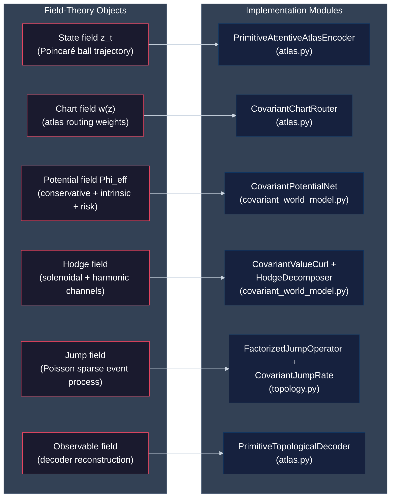

---

## 1. End-to-end implementation schematic

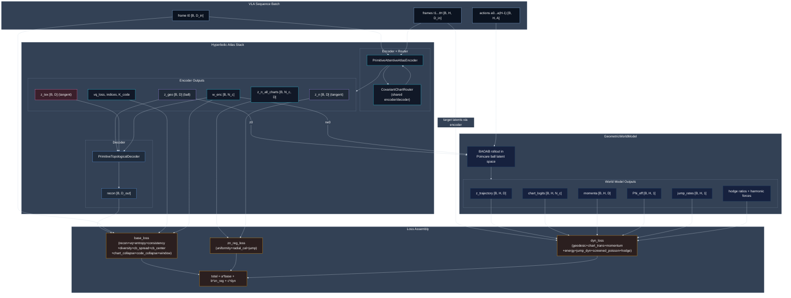

---

## 2. Atlas implementation

### 2.1 CovariantChartRouter

The chart router is shared by both encoder and decoder. It performs hyperbolic chart assignment using:
- Poincare-ball distance scoring with conformal temperature
- O(n) parallel transport via conformal factor scaling (no Cayley transform)
- Optional feature-aware correction with Christoffel-style quadratic terms

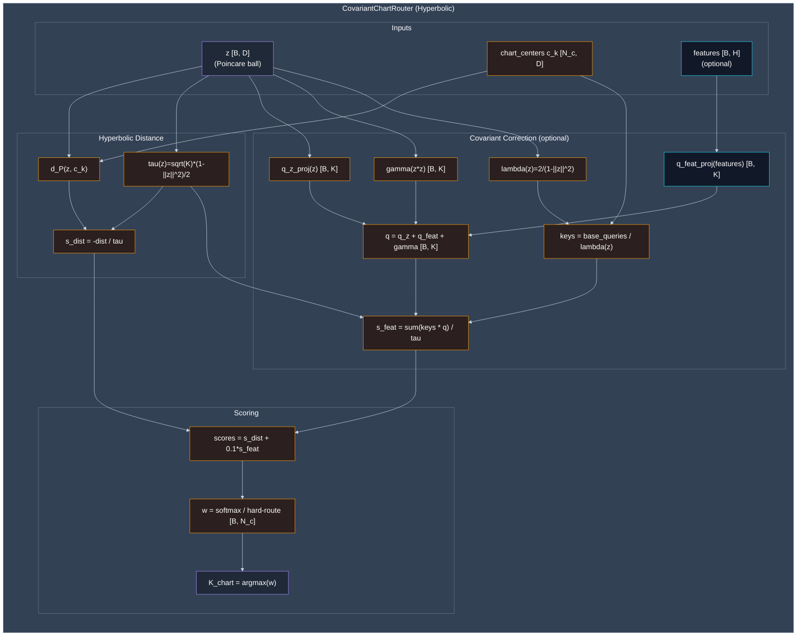

### 2.2 PrimitiveAttentiveAtlasEncoder

The encoder performs feature extraction, hyperbolic routing, hyperbolic VQ per chart, and splits the latent into $(z_{geo}, z_n, z_{tex})$ (with $z_{geo}$ on the Poincare ball and $z_n, z_{tex}$ in the tangent space):

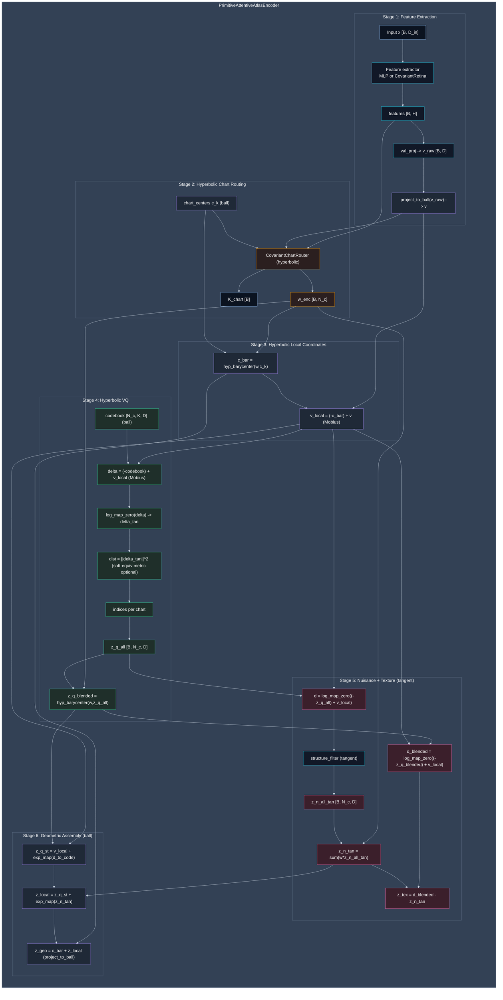

### 2.3 PrimitiveTopologicalDecoder

The decoder performs chart-weighted reconstruction from the hyperbolic geometric latent $z_{geo}$ and adds the texture residual $z_{tex}$:
- Geometric path: Hyperbolic routing -> SpectralLinear chart projectors -> NormGatedGELU -> Renderer
- Texture path: Tanh + SpectralLinear residual with learned scale
- Final output: Base reconstruction + scaled texture residual

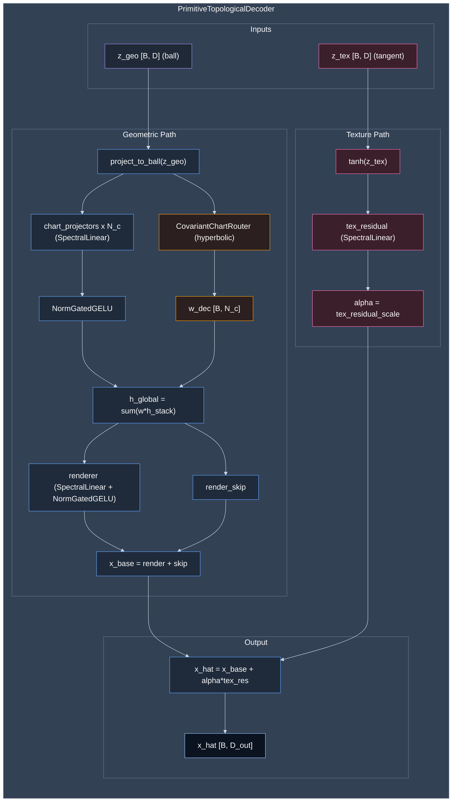

---

## 3. World model implementation (hyperbolic field dynamics)

### 3.1 GeometricWorldModel internals

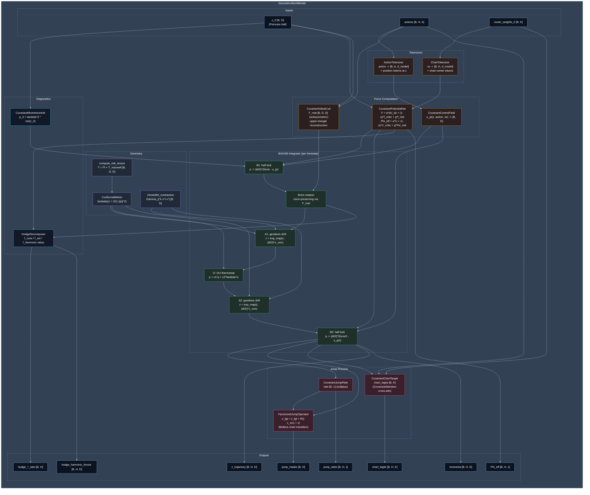

### 3.2 BAOAB step decomposition as implemented pattern

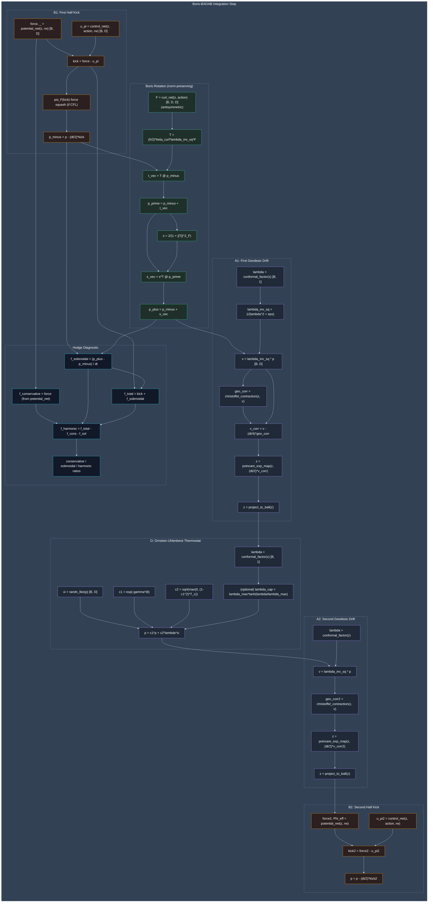

### 3.3 Screened Poisson implementation path

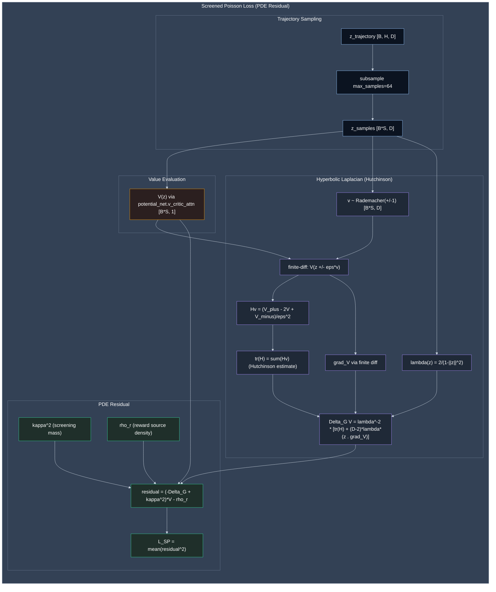

Advantages of this implementation choice:
- Enforces PDE-style structure on the potential field, not only pointwise regression.
- Couples value smoothness and geometry through hyperbolic Laplace-Beltrami.
- Integrates directly into `compute_phase2_loss` with explicit weight control.

---

## 4. Full loss architecture

```mermaid
%%{init: {"themeVariables": {"background":"#1e293b","edgeLabelBackground":"#334155","textColor":"#ffffff","lineColor":"#cbd5e1","primaryColor":"#334155","primaryTextColor":"#ffffff","secondaryTextColor":"#ffffff","tertiaryTextColor":"#ffffff","titleColor":"#ffffff","nodeTextColor":"#ffffff","clusterBkg":"#334155","clusterBorder":"#64748b","fontSize":"18px"},"flowchart":{"nodeSpacing":60,"rankSpacing":70,"useMaxWidth":true}}}%%
flowchart TB
    subgraph LOSSARCH["Full Loss Architecture"]
        direction TB

        subgraph FORWARD["Forward Pass"]
            direction TB
            X["batch features [B, D_in]"]
            Enc["Encoder (hyperbolic)"]
            EncOut["z_geo, z_tex, w_enc,<br/>vq_loss, indices, z_n_all_charts"]
            Dec["Decoder (hyperbolic)"]
            Recon["recon [B, D_out]"]
        end

        subgraph ENCLOSS["Encoder-Side Losses"]
            direction TB

            subgraph BASE["base_loss"]
                direction TB
                ReconLoss["MSE(recon, x)"]
                VQLoss["VQ loss (tangent)"]
                Entropy["routing entropy"]
                Consistency["encoder/decoder consistency"]
                Diversity["diversity(w)"]
                CbSpread["codebook_spread"]
                CbCenter["codebook_center"]
                ChartCollapse["chart_collapse"]
                CodeCollapse["code_collapse"]
                Window["window_loss"]
            end

            subgraph ZNREG["zn_reg_loss"]
                direction TB
                Uniformity["uniformity(z_n)"]
                RadCal["radial_calibration(z_n)"]
                JumpCons["jump consistency<br/>(FactorizedJumpOperator)"]
            end
        end

        subgraph DYNLOSS["Dynamics Losses (compute_phase2_loss)"]
            direction TB
            Geodesic["geodesic d_P(z_pred, z_target)"]
            ChartTrans["chart_transition CE(logits, targets)"]
            MomReg["momentum_reg (1/2)*p^T*G^-1*p"]
            EnergyCons["energy_conservation Var(H)"]
            JumpDyn["jump_dynamics L1(rates)"]
            ScreenedP["screened_poisson PDE residual"]
            HodgeCons["hodge ||f_harmonic||^2"]
        end

        subgraph AGG["Loss Assembly"]
            direction TB
            BL["base_loss (weighted sum)"]
            ZL["zn_reg_loss (weighted sum)"]
            DL["dyn_loss (weighted sum)"]
            TOT["total = a_enc*base + a_zn*zn_reg + a_dyn*dyn"]
        end
    end

    X --> Enc --> EncOut --> Dec --> Recon

    Recon --> ReconLoss
    X --> ReconLoss

    EncOut --> VQLoss
    EncOut --> Entropy
    EncOut --> Consistency
    EncOut --> Diversity
    EncOut --> CbSpread
    EncOut --> CbCenter
    EncOut --> ChartCollapse
    EncOut --> CodeCollapse
    EncOut --> Window

    EncOut --> Uniformity
    EncOut --> RadCal
    EncOut --> JumpCons

    ReconLoss --> BL
    VQLoss --> BL
    Entropy --> BL
    Consistency --> BL
    Diversity --> BL
    CbSpread --> BL
    CbCenter --> BL
    ChartCollapse --> BL
    CodeCollapse --> BL
    Window --> BL

    Uniformity --> ZL
    RadCal --> ZL
    JumpCons --> ZL

    Geodesic --> DL
    ChartTrans --> DL
    MomReg --> DL
    EnergyCons --> DL
    JumpDyn --> DL
    ScreenedP --> DL
    HodgeCons --> DL

    BL --> TOT
    ZL --> TOT
    DL --> TOT

    classDef io fill:#0b1320,stroke:#93c5fd,stroke-width:1px,color:#ffffff;
    classDef encoder fill:#111827,stroke:#22d3ee,stroke-width:1px,color:#ffffff;
    classDef decoder fill:#1f2b3b,stroke:#60a5fa,stroke-width:1px,color:#ffffff;
    classDef loss fill:#2b1f1f,stroke:#f59e0b,stroke-width:1px,color:#ffffff;
    classDef vq fill:#1f2f2a,stroke:#34d399,stroke-width:1px,color:#ffffff;
    classDef dynamics fill:#1f2937,stroke:#a78bfa,stroke-width:1px,color:#ffffff;
    classDef opt fill:#3b1f2b,stroke:#f472b6,stroke-width:1px,color:#ffffff;

    class X io;
    class Enc,EncOut encoder;
    class Dec,Recon decoder;
    class ReconLoss,VQLoss,Entropy,Consistency,Diversity,CbSpread,CbCenter,ChartCollapse,CodeCollapse,Window,BL loss;
    class Uniformity,RadCal,JumpCons,ZL vq;
    class Geodesic,ChartTrans,MomReg,EnergyCons,JumpDyn,ScreenedP,HodgeCons,DL dynamics;
    class TOT opt;
```

Field-theory view of losses:
- `base_loss`: stabilizes atlas chart/state representation.
- `zn_reg_loss`: regularizes nuisance subfield statistics.
- `dyn_loss`: enforces geometric trajectory laws and force decomposition consistency.

---

## 5. Phase-3-only training implementation

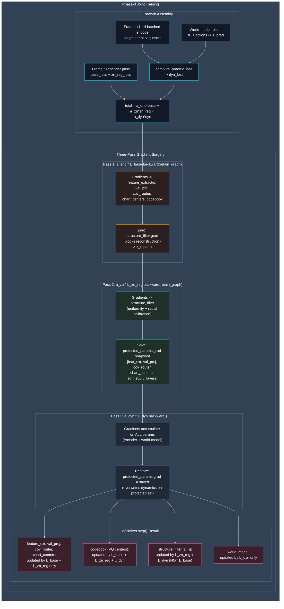

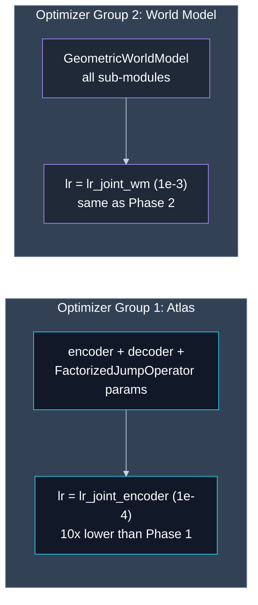

---

## 6. Theoretical advantages over the state of the art

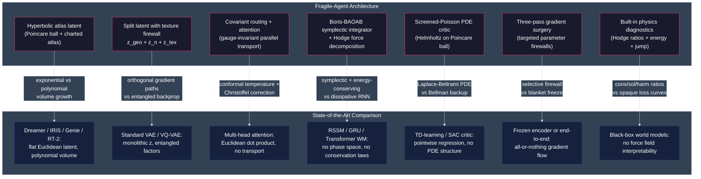

### 6.1 Hyperbolic atlas latent vs flat Euclidean spaces

**State of the art.** Dreamer-v3 encodes observations into a flat Euclidean latent via an RSSM with discrete + continuous components. IRIS tokenizes frames into a flat discrete grid. Genie and RT-2 use flat continuous latent spaces. In all cases the latent volume grows polynomially: a $D$-dimensional Euclidean ball of radius $r$ has volume $\propto r^D$.

**Fragile.** The Poincare ball model $\mathbb{B}^D$ with conformal factor $\lambda(z) = 2/(1 - \|z\|^2)$ has volume that grows *exponentially* with geodesic radius: $\text{vol}(B_r) \sim e^{(D-1)r}$. This means the representational capacity of the latent interior is exponentially larger than a Euclidean ball of the same coordinate radius. Concretely:

- **Hierarchy without depth.** Tree-structured environments (decision trees, compositional plans, nested goals) embed with bounded distortion into hyperbolic space but require $\Omega(n)$ dimensions in Euclidean space (Sarkar 2011). Fragile encodes these hierarchies natively in the ball geometry.
- **Boundary sharpening.** As states approach the ball boundary ($\|z\| \to 1$), the conformal factor $\lambda \to \infty$ and the metric blows up. This creates a natural "high-resolution rim" where fine distinctions are amplified, analogous to how the Poincare disk crowds detail near its boundary. States near the origin represent coarse, abstract features; states near the boundary represent precise, concrete features. Standard flat latents have uniform resolution everywhere.
- **Chart atlas prevents winner-take-all.** The `CovariantChartRouter` initializes chart centers via Fibonacci-sphere + Lloyd relaxation across the ball, guaranteeing quasi-uniform coverage. Each chart owns a Voronoi-like catchment in hyperbolic metric. In Dreamer's flat latent, there is no such partitioning: the entire space is one undifferentiated coordinate system, making it vulnerable to mode collapse where a few latent directions dominate.

**Example.** Consider a manipulation task with 8 semantically distinct object configurations. Dreamer must learn to separate these 8 modes in a flat space, relying entirely on the reconstruction loss to carve out regions. Fragile assigns each mode to a chart via the router; within each chart, the VQ codebook further discretizes sub-states. The hyperbolic distances between chart centers grow exponentially with separation, so even nearby chart centers are well-separated in geodesic distance. This provides a geometric prior for multi-modal environments that flat latents lack.

### 6.2 Split latent with texture firewall vs monolithic representations

**State of the art.** Standard VAEs and VQ-VAEs encode everything into a single latent vector $z$. World models like Dreamer's RSSM maintain a monolithic hidden state $(h_t, z_t)$ where structure, nuisance, and appearance are entangled. Any gradient from the dynamics loss can reshape the appearance representation and vice versa. Beta-VAE and similar approaches add scalar KL weights but do not enforce orthogonal gradient paths.

**Fragile.** The encoder decomposes the latent into three subspaces with distinct geometric roles:

| Component | Space | Role | Dynamics coupling |
|---|---|---|---|
| $z_{\text{geo}}$ | Poincare ball | Macro state (chart + VQ code) | Full |
| $z_n$ | Tangent space | Gauge-invariant nuisance | Partial (structure_filter only) |
| $z_{\text{tex}}$ | Tangent space | Appearance residual | **None** (texture firewall) |

The texture firewall is not a soft penalty: $z_{\text{tex}}$ is structurally excluded from the world model forward pass. No gradient path exists from the dynamics loss $\mathcal{L}_{\text{dyn}}$ to the texture subspace. This is enforced by code structure, not by a loss weight that could be overwhelmed.

**Why this matters.** In a robotic pick-and-place task, the texture of an object's surface (wood grain, color variations) is irrelevant to dynamics but dominates pixel-level reconstruction. In a monolithic latent, the dynamics loss would fight the reconstruction loss over these dimensions: dynamics wants them constant (irrelevant to motion), reconstruction wants them to vary (relevant to appearance). Fragile resolves this conflict by architecture: $z_{\text{tex}}$ captures appearance for reconstruction, $z_{\text{geo}}$ captures structure for dynamics, and the gradient firewall (Section 5) prevents cross-contamination.

**Contrast with beta-VAE.** Beta-VAE uses $\beta \cdot D_{\mathrm{KL}}$ to pressure the latent toward a standard normal, encouraging disentanglement as a side effect. But beta-VAE cannot guarantee which dimensions capture which factors; the mapping is implicit and can break under distribution shift. Fragile's decomposition is explicit and architecturally enforced: the VQ codebook captures discrete topology, the structure filter captures continuous gauge residuals, and the subtraction $z_{\text{tex}} = \delta_{\text{blended}} - z_n$ captures everything else. Each component has its own gradient pathway.

### 6.3 Covariant routing and attention vs standard dot-product attention

**State of the art.** Standard multi-head attention computes $\text{softmax}(QK^\top / \sqrt{d_k})V$ with Euclidean dot products. The temperature $\sqrt{d_k}$ is a global constant. Keys and queries live in the same flat space regardless of the state's position on the manifold. There is no notion of parallel transport: comparing a query at state $z_a$ with a key at state $z_b$ treats both as if they share a common coordinate frame.

**Fragile.** The `CovariantChartRouter` and `CovariantAttention` modules introduce three geometric corrections:

1. **Parallel transport via conformal scaling.** Before comparing query $q(z)$ with key $k(c_k)$, the key is transported from the chart center $c_k$ to the query position $z$ via $k_{\text{transported}} = k / \lambda(z)$. This is $O(n)$ per key (element-wise division), unlike full $O(n^3)$ Lie-group transport. The conformal factor $\lambda(z) = 2/(1-\|z\|^2)$ ensures the comparison respects the local geometry: near the boundary, keys are downscaled (distances are large), making attention sharper.

2. **Position-dependent temperature.** The softmax temperature is $\tau(z) = \sqrt{d_k} \cdot (1 - \|z\|^2) / 2$, which decreases near the ball boundary. High-curvature regions automatically produce sharp (confident) routing; low-curvature regions produce soft (exploratory) routing. Standard attention has no mechanism for this: its temperature is the same everywhere.

3. **Christoffel correction in queries.** The query projection includes a quadratic term $\gamma(z \otimes z)$ that encodes the Christoffel symbols $\Gamma^k_{ij}$. This forces the attention scores to account for geodesic curvature, not just Euclidean proximity. In standard attention, two states equidistant in Euclidean coordinates receive equal attention weights; in covariant attention, the state in a higher-curvature region receives sharper weighting because the geodesic distance is larger.

**Example.** In a navigation task, two waypoints may be equidistant in pixel coordinates but one is near a decision boundary (high curvature: should the agent turn left or right?) while the other is on a straight path (low curvature). Standard attention treats both identically. Covariant attention automatically sharpens routing near the decision boundary, producing a more decisive chart assignment exactly where disambiguation matters.

### 6.4 Boris-BAOAB symplectic integrator vs RNN/transformer world models

**State of the art.** Dreamer-v3 uses a Recurrent State Space Model (RSSM) with GRU dynamics. IRIS uses a GPT-style transformer to autoregressively predict next tokens. TD-MPC2 uses a learned MLP transition model. None of these models have a notion of phase space $(z, p)$, conservation laws, or symplectic structure. They are dissipative by construction: a GRU can arbitrarily amplify or attenuate information at each step.

**Fragile.** The `GeometricWorldModel` maintains an explicit phase space $(z, p)$ where $z$ is position on the Poincare ball and $p$ is cotangent momentum. The dynamics are integrated via Boris-BAOAB, a splitting integrator with three distinct operator types:

1. **B-step (Kick).** Updates momentum from conservative force $-\nabla\Phi$ and control force $u_\pi$. The force is computed by `CovariantPotentialNet`, which decomposes it as $F = \alpha \cdot \nabla U + (1-\alpha) \cdot f_{\text{critic}} + \gamma \cdot f_{\text{risk}}$, separating intrinsic geometry ($U$), learned value ($f_{\text{critic}}$), and risk adaptation ($f_{\text{risk}}$).

2. **Boris rotation.** Applies the solenoidal (curl) force via a norm-preserving rotation: $|p_{\text{out}}| = |p_{\text{in}}|$ exactly. This is the magnetic analogue: the curl field steers the agent into orbits without changing its kinetic energy. Standard RNNs have no mechanism for norm-preserving rotations; they must learn this as an emergent property, which is fragile and typically lost under distribution shift.

3. **A-step (Drift).** Updates position via geodesic flow with explicit Christoffel corrections $\Gamma^k_{ij} v^i v^j$, then projects back to the ball via `poincare_exp_map`. This ensures the state stays on the manifold. GRU/transformer outputs are unconstrained vectors that can drift off-manifold.

4. **O-step (Thermostat).** Applies Ornstein-Uhlenbeck friction and noise with conformal-factor scaling: $p \leftarrow c_1 p + c_2 \lambda(z) \xi$. The noise amplitude is modulated by the local geometry, providing more exploration in flat regions and less in curved regions.

**Symplectic verification.** The energy conservation loss $\mathcal{L}_{\text{energy}} = \text{Var}(H_t)$ across the horizon measures how well the integrator preserves the Hamiltonian $H = \Phi_{\text{eff}} + \frac{1}{2} p^\top G^{-1} p$. A perfect symplectic integrator keeps $H$ constant; drift indicates numerical or architectural errors. Standard world models have no analogous diagnostic because they do not track energy.

**Why it matters for long-horizon prediction.** Symplectic integrators have bounded energy error over exponentially long times (backward error analysis). Non-symplectic methods (Euler, RNN) accumulate energy error linearly or worse, causing trajectory predictions to diverge. For a 50-step rollout, the BAOAB integrator's energy error remains $O(\Delta t^2)$ regardless of horizon length, while a GRU's hidden state can drift unboundedly.

### 6.5 Screened Poisson PDE critic vs pointwise TD-learning

**State of the art.** Standard critics (TD-learning, SAC, PPO) learn $V(s)$ by minimizing the Bellman residual $\|V(s) - (r + \gamma V(s'))\|^2$. This is a pointwise regression: the critic sees individual $(s, r, s')$ transitions and has no constraint on the spatial structure of $V$. Nothing prevents $V$ from being arbitrarily non-smooth, developing spurious local optima, or failing to generalize between nearby states.

**Fragile.** The critic $V(z)$ is constrained to satisfy the screened Poisson equation on the Poincare ball:

$$(-\Delta_G + \kappa^2) V(z) = \rho_r(z)$$

where $\Delta_G$ is the Laplace-Beltrami operator, $\kappa$ is the screening mass, and $\rho_r$ is the reward source density. This is enforced as a PDE residual loss using batched Hutchinson trace estimation (no second-order autograd).

**Three concrete advantages over TD-learning:**

1. **Spatial smoothness is built in.** The Laplacian $\Delta_G V$ penalizes high-frequency oscillations in $V$ with respect to the manifold metric. Two states close in geodesic distance must have similar values. TD-learning has no such constraint: $V(s)$ and $V(s')$ can differ arbitrarily even for adjacent states, leading to noisy value landscapes.

2. **Screening mass controls spatial decay.** The $\kappa^2 V$ term creates exponential decay: the value field falls off as $V \sim e^{-\kappa r}$ away from reward sources. This is the physics of a Yukawa potential: rewards have a finite "range of influence" controlled by $\kappa$. TD-learning with discount $\gamma$ also creates decay, but it is temporal (per-step), not spatial (per-geodesic-distance). Fragile's spatial screening is geometry-aware.

3. **Hyperbolic Laplacian couples value to curvature.** The Poincare-ball Laplacian includes curvature corrections: $\Delta_G f = \lambda^{-2}[\Delta_E f + (D-2)\lambda(z \cdot \nabla f)]$. Near the ball boundary (high curvature), the Laplacian is suppressed, allowing the value function to vary more sharply. Near the origin (low curvature), the Laplacian enforces smoothness. This automatically adapts the critic's resolution to the latent geometry.

**Example.** In a goal-reaching task, the reward source is at a goal state $z_g$. TD-learning must propagate value backward step-by-step through Bellman backups, requiring many iterations to fill in $V$ across the state space. The screened Poisson equation directly solves for $V$ as a Green's function centered at $z_g$, producing a globally coherent value landscape in a single optimization step. The screening mass $\kappa$ determines how far the "value field" extends from the goal.

### 6.6 Three-pass gradient surgery vs standard encoder-dynamics coupling

**State of the art.** Joint training of encoder and world model faces a fundamental tension: the dynamics loss wants to reshape the encoder's representation to be "easy to predict," which can destroy the perceptual quality of the latent space (catastrophic forgetting). Common solutions include:

- **Frozen encoder** (Dreamer-v2, early RT-2 variants): encoder is fixed after pretraining. Simple but prevents the encoder from adapting to downstream dynamics needs.
- **End-to-end finetuning**: all parameters receive all gradients. Effective but risks representation collapse, especially when dynamics losses dominate reconstruction.
- **EWC / Fisher regularization**: adds a penalty $\sum_i F_i(\theta_i - \theta_i^*)^2$ to protect important parameters. Requires computing the Fisher information matrix, is approximate, and treats all parameters uniformly within each group.

**Fragile.** The three-pass gradient surgery provides *surgical* control over which parameters receive which gradients, without approximations:

| Parameter group | $\mathcal{L}_{\text{base}}$ | $\mathcal{L}_{z_n}$ | $\mathcal{L}_{\text{dyn}}$ | Rationale |
|---|:---:|:---:|:---:|---|
| Feature extractor, val_proj | yes | yes | **no** | Perceptual features must not be reshaped by dynamics |
| CovariantChartRouter, chart_centers | yes | yes | **no** | Chart topology is a structural invariant |
| Codebook (VQ centers) | yes | yes | yes | Interface between perception and dynamics |
| Structure filter ($z_n$) | **no** | yes | yes | Must not receive reconstruction pressure |
| World model | **no** | **no** | yes | Only dynamics-relevant gradients |

This is implemented via three backward passes with explicit gradient save/restore, not via loss weighting or regularization. The firewall is exact: protected parameters receive *zero* gradient from blocked losses, not a scaled-down version.

**Why this is stronger than EWC.** EWC adds a soft penalty proportional to the Fisher information. If the dynamics loss gradient is large enough, it can overwhelm the EWC penalty and shift protected parameters. Fragile's firewall is not a penalty: it is an exact gradient replacement. After Pass 3, the protected parameters' gradients are overwritten with the saved values from Pass 2, regardless of the magnitude of the dynamics gradient. This provides a hard guarantee that the feature extractor, router, and chart centers are updated only by encoder-side losses.

**Why this is better than freezing.** A frozen encoder cannot adapt its codebook to improve dynamics prediction. Fragile's surgery allows the codebook (VQ centers within charts) and structure filter to receive dynamics gradients, enabling the perception-dynamics interface to co-adapt. The codebook is the "meeting point" between the atlas and the world model: the world model can nudge codebook centers to cluster dynamically coherent states, while the encoder-side losses prevent the codebook from drifting away from perceptually meaningful quantization.

### 6.7 Built-in physics diagnostics vs opaque loss curves

**State of the art.** Standard world models expose training loss and validation loss. When a model fails, the practitioner sees a number go up and has no mechanistic insight into *why*. Dreamer logs reconstruction loss and KL divergence; IRIS logs token prediction accuracy. Neither provides information about the *structure* of the learned dynamics.

**Fragile.** The architecture exposes three families of physics-grounded diagnostics that are unavailable in standard models:

**A. Hodge decomposition ratios.** The `HodgeDecomposer` decomposes the total force field at each timestep into conservative, solenoidal, and harmonic components, reporting their norm ratios:

- `hodge_conservative_ratio` $= \|f_{\text{cons}}\| / \|f_{\text{total}}\|$: fraction of force explained by the scalar potential gradient $-\nabla\Phi$.
- `hodge_solenoidal_ratio` $= \|f_{\text{sol}}\| / \|f_{\text{total}}\|$: fraction explained by the curl field (Boris rotation impulse).
- `hodge_harmonic_ratio` $= \|f_{\text{harm}}\| / \|f_{\text{total}}\|$: unexplained residual.

A well-trained model should have $\text{harmonic\_ratio} \approx 0$: all forces are explained by conservative + solenoidal components. A rising harmonic ratio signals that the model is learning unstructured "leftover" forces that do not decompose into physically meaningful components. This is an early warning of model degradation that no standard world model can provide.

**B. Energy conservation variance.** The Hamiltonian $H = \Phi_{\text{eff}} + \frac{1}{2} p^\top G^{-1} p$ is tracked across rollout steps. $\text{Var}(H_t)$ across the horizon measures symplecticity. A symplectic integrator preserves $H$ exactly (up to numerical precision); a non-symplectic model causes $H$ to drift. Monitoring $\text{Var}(H)$ reveals whether the integrator is breaking conservation laws, which directly predicts long-horizon rollout quality.

**C. Jump sparsity and chart transition rates.** The `CovariantJumpRate` outputs Poisson rates $\lambda(z, K)$ at each timestep, and the L1 sparsity loss encourages rare jumps. Monitoring the mean jump rate reveals whether the model is over-switching between charts (unstable macro-state assignment) or under-switching (ignoring genuine mode transitions). Standard models with discrete state variables (IRIS tokens, Dreamer discrete codes) provide no equivalent: they switch at every step with no notion of "jump rarity."

**Diagnostic interpretation table:**

| Diagnostic | Healthy range | Failure mode |
|---|---|---|
| `hodge_harmonic_ratio` | $< 0.05$ | Model learning unstructured forces |
| `Var(H_t)` over horizon | $< 10^{-3}$ | Integrator losing symplecticity |
| Mean jump rate | $< 0.1$ per step | Over-switching between charts |
| `conservative_ratio` | $> 0.7$ | Most forces should be gradient-driven |

These diagnostics transform debugging from "loss went up, try different hyperparameters" to "the harmonic ratio spiked at epoch 50, so the curl network is underfitting the solenoidal component — increase `beta_curl` or add capacity to `CovariantValueCurl`."

### Summary comparison

| Dimension | Fragile | Dreamer-v3 | IRIS | RT-2 / Genie |
|---|---|---|---|---|
| **Latent geometry** | Poincare ball ($e^{Dr}$ volume) | Flat Euclidean ($r^D$ volume) | Discrete tokens (finite) | Flat continuous |
| **Latent structure** | $z_{\text{geo}} + z_n + z_{\text{tex}}$ with firewall | $(h, z)$ monolithic | Token sequence | Single vector |
| **Attention** | Covariant (parallel transport, $\tau(z)$, Christoffel) | Standard dot-product | Standard dot-product | Standard dot-product |
| **Dynamics model** | Boris-BAOAB symplectic integrator | GRU (RSSM) | Autoregressive transformer | None / flat MLP |
| **Value function** | Screened Poisson PDE on $\mathbb{B}^D$ | TD($\lambda$) | TD($\lambda$) | Reward regression |
| **Joint training** | Three-pass gradient surgery (exact firewall) | Stop-gradient heuristics | Frozen encoder | End-to-end |
| **Diagnostics** | Hodge ratios + energy + jump rates | Loss curves only | Token accuracy only | Loss curves only |

---

This document preserves the field-theory framing while specifying the implemented hyperbolic modules, loss operators, and Phase-3 training mechanics.
