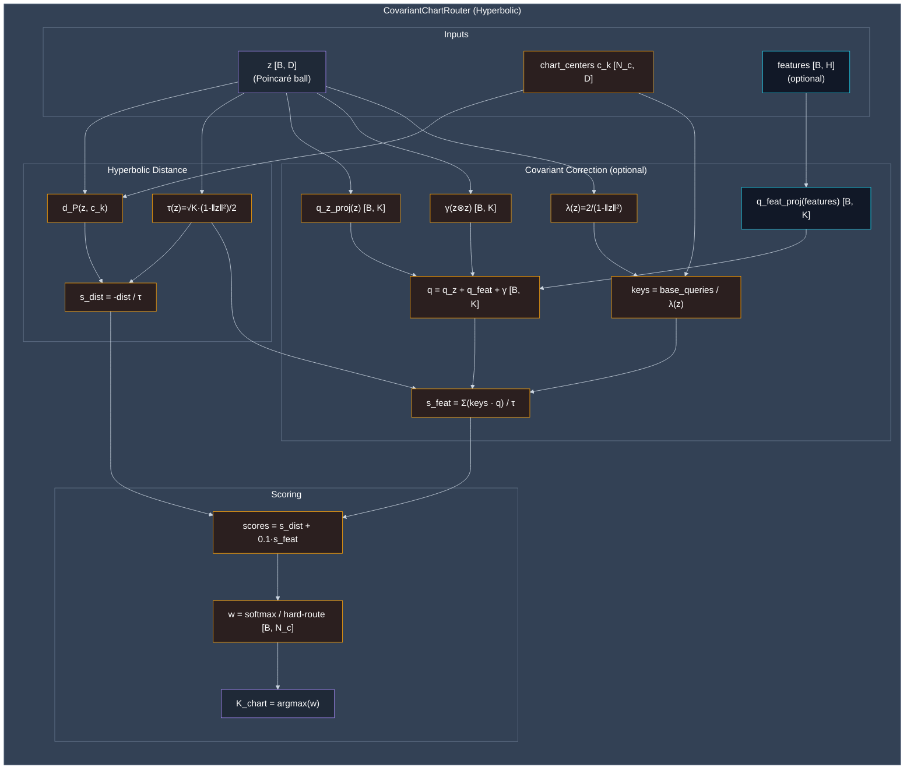
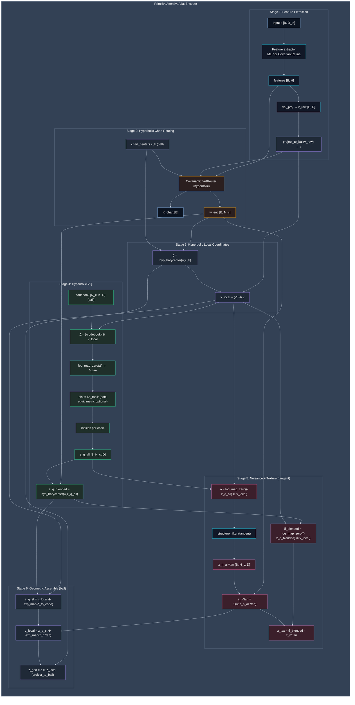
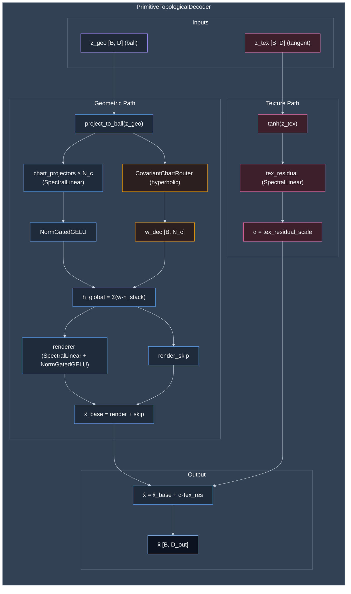
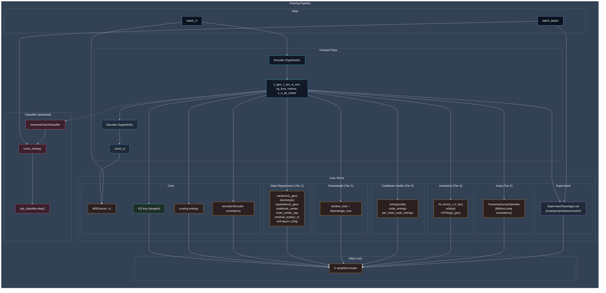

# Single Agent Architecture as Field Theory: Technical TLDR

Guillem Duran Ballester, Jan 2026

## 0. Architecture

The following diagrams illustrate the current implementation architecture of the TopoEncoder system, showing how observations are encoded into the split-latent space $(K, z_n, z_{tex})$ and decoded back to reconstructions. These diagrams mirror the code in `src/fragile/core/layers/atlas.py` and `src/experiments/topoencoder_2d.py`.

### 0.1 CovariantChartRouter

The chart router is shared by both encoder and decoder. It performs hyperbolic chart assignment using:
- Poincaré-ball distance scoring with conformal temperature
- O(n) parallel transport via conformal factor scaling (no Cayley transform)
- Optional feature-aware correction with Christoffel-style quadratic terms



### 0.2 Encoder (PrimitiveAttentiveAtlasEncoder)

The encoder performs feature extraction, hyperbolic routing, hyperbolic VQ per chart, and splits the latent into $(z_{geo}, z_n, z_{tex})$ (with $z_{geo}$ on the Poincaré ball and $z_n, z_{tex}$ in the tangent space):



### 0.3 Decoder (PrimitiveTopologicalDecoder)

The decoder performs chart-weighted reconstruction from the hyperbolic geometric latent $z_{geo}$ and adds the texture residual $z_{tex}$:
- Geometric path: Hyperbolic routing → SpectralLinear chart projectors → NormGatedGELU → Renderer
- Texture path: Tanh + SpectralLinear residual with learned scale
- Final output: Base reconstruction + scaled texture residual



### 0.4 Experiment Wiring (Training Losses)

Training components in `topoencoder_2d.py` (hyperbolic-aware):
- Core losses: reconstruction, VQ, routing entropy, encoder/decoder consistency
- Atlas regularizers: variance/diversity/separation, codebook centering, chart-center separation, residual scale, soft-equiv penalties
- Disentangle + window, code entropy, KL prior, orbit/VICReg, jump consistency
- SupervisedTopologyLoss (route/purity/balance/metric) and detached InvariantChartClassifier



## 1. Latent Space Decomposition

**Split-Latent Structure:**

- Total latent: $Z = (K, z_n, z_{\text{tex}})$ where each component has distinct geometric/physical role
- $K \in \{1,\ldots,N_c\}$: Discrete macro state (VQ codebook index) - chart assignment on topological atlas
- $z_n \in \mathbb{R}^{D_n}$: Continuous nuisance latent - local coordinates within chart (gauge-invariant position)
- $z_{\text{tex}} \in \mathbb{R}^{D_t}$: Texture residual - holographic boundary degrees of freedom
- Decomposition satisfies $z_e = z_q + z_n + z_{\text{tex}}$ where $z_e$ is raw encoder output, $z_q$ is VQ-quantized macro

**Encoder Architecture (AttentiveAtlasEncoder):**

- Feature extraction: Conv layers (64→128→256 channels) → hidden_dim projection
- Cross-attention routing: $w_k = \text{softmax}(\langle K_k, Q(x) \rangle / \sqrt{D})$ where $K_k$ are learnable chart queries
- Query projection: $Q(x) = \text{key\_proj}(\text{features}(x))$ with LayerNorm stabilization
- Chart assignment: $K = \arg\max_k w_k(x)$
- VQ per chart: $N_c$ independent codebooks, each with $K_c$ codes, vectorized quantization
- Nuisance extraction: Structure filter $z_n = f_{\text{struct}}(z_e - z_q)$ removes VQ-residual structure
- Texture: Holographic residual $z_{\text{tex}} = (z_e - z_q) - z_n$ orthogonal to both macro and nuisance.
- **Texture Firewall:** Dynamics depend on $z_{\text{macro}}$ and $z_n$, screening out only $z_{\text{tex}}$.

**Training Objectives for Coarse-Graining:**
To enforce this split-latent structure and ensure valid coarse-graining, we minimize:
$$ \mathcal{L}_{\text{latent}} = \mathcal{L}_{\text{VQ}} + \mathcal{L}_{\text{closure}} + \mathcal{L}_{\text{slowness}} + \mathcal{L}_{\text{disentangle}} $$

1.  **VQ Loss:** $\|z_e - z_q\|^2 + \beta \|z_q - \operatorname{sg}[z_e]\|^2$. Stabilizes the discrete macro state $K$.
2.  **Causal Enclosure:** $-\log p(K_{t+1} | K_t, a_t)$. Ensures macro dynamics are self-contained (predictable without micro details).
3.  **Slowness (Anti-Churn):** $\|e_{K_t} - e_{K_{t-1}}\|_G^2$. Penalizes rapid flickering of the macro state to ensure temporal stability.
4.  **Disentanglement:**
    *   *Nuisance KL:* $D_{\mathrm{KL}}(q(z_n|x) \| \mathcal{N}(0,I))$. Minimal sufficient nuisance.
    *   *Texture KL:* $D_{\mathrm{KL}}(q(z_{\text{tex}}|x) \| \mathcal{N}(0,I))$. Texture should contain no macro info.

**Geometric Regularization (Quality Control):**
To ensure the latent space is well-conditioned (high-fidelity, isometric charts), we add:
$$ \mathcal{L}_{\text{reg}} = \mathcal{L}_{\text{VICReg}} + \mathcal{L}_{\text{ortho}} $$

5.  **VICReg (Self-Supervision):** Prevents collapse without negative pairs.

    *   *Invariance:* $\|z - z'\|_G^2$. Robustness to view augmentation.
    *   *Variance:* $\max(0, \gamma - \sqrt{\text{Var}(z)})$. Forces code utilization.
    *   *Covariance:* $C(z) \approx I$. Decorrelates latent dimensions (whitening).
6.  **Orthogonality (Chart Isometry):** $\|W^T W - I\|_F^2$ on encoder weights. Ensures the mapping from observation to latent space is locally isometric (preserves distances), crucial for meaningful geodesic calculations.

## 2. The Reward Field & Hodge Decomposition

**Physical Context:** We model the agent as a particle with **Position and Momentum** performing a **Geodesic Random Walk** on the latent manifold. Because utility is harvested via trajectory traversal, the Reward is naturally defined as a differential **1-form** coupled to velocity, rather than a static scalar field.

**Constraint:** Reward is not a scalar $r(z)$, but a **1-form** $\mathcal{R}$ that depends on direction ($\mathcal{R}_i \dot{z}^i$). This requires a field-theoretic treatment of value.

**Hodge Decomposition:** The reward 1-form uniquely decomposes into three orthogonal components:
$$ \mathcal{R} = \underbrace{d\Phi}_{\text{Gradient}} + \underbrace{\delta\Psi}_{\text{Solenoidal}} + \underbrace{\eta}_{\text{Harmonic}} $$

-   **Gradient ($\Phi$):** Optimizable scalar potential (Conservative Value).
-   **Solenoidal ($\Psi$):** Vector potential generating the **Value Curl** (Magnetic Field) $\mathcal{F} = d\mathcal{R} = d\delta\Psi$.
    -   *Physics:* Just as a magnetic field $B$ exerts a **Lorentz Force** $v \times B$, the Value Curl $\mathcal{F}$ exerts a velocity-dependent force $\mathcal{F}_{ij}\dot{z}^j$ that steers the agent to **orbit** value cycles rather than converge.
-   **Harmonic ($\eta$):** Topological cycles (manifold holes).

**The Screened Poisson Equation (Conservative Case):**
When the **Value Curl** vanishes ($\mathcal{F} = 0$), the scalar value function $V(z)$ satisfies the **Helmholtz Equation** on the manifold:
$$ (-\Delta_G + \kappa^2)V(z) = \rho_r(z) $$
where $\Delta_G$ is the Laplace-Beltrami operator, $\kappa$ is the screening mass, and $\rho_r$ is the reward source density.

**The Composite Navigation Potential (Runtime):**
The agent navigates a **Composite Potential** $\Phi_{\text{eff}}$ constructed at runtime by summing learned and intrinsic signals:
$$ \Phi_{\text{eff}}(z) = \underbrace{V(z)}_{\text{Learned}} + \underbrace{U(z)}_{\text{Intrinsic}} + \underbrace{\mathcal{B}_{\text{safety}}(z)}_{\text{Fixed}} $$

1.  **Control ($V$):** **Learned** scalar value. Drives the agent towards high-reward regions.
    *   *Loss:* Helmholtz Residual (see below).
2.  **Generation ($U$):** **Intrinsic** entropy potential (e.g., Hyperbolic expansion $-\log \text{vol}(z)$). Drives exploration away from the origin.
    *   *Loss:* None (Fixed geometric prior).
3.  **Safety ($\mathcal{B}_{\text{safety}}$):** **Fixed** safety barrier. Hard constraints (e.g., capacity limits) modeled as high-energy walls.
    *   *Loss:* None (Fixed constraint).

**Neural Hodge Decomposition (Implementation):**
We approximate the Hodge components using a **Multi-Head Network** sharing a common feature backbone:

1.  **Scalar Head ($\Phi$):** Outputs scalar $V(z)$.
    *   *Loss:* Helmholtz Residual on the symmetric part of the reward.
    *   $\mathcal{L}_{\Phi} = \|V(z) - (r_{\text{sym}} + \gamma V(z'))\|^2$.
2.  **Solenoidal Head ($\Psi$):** Outputs vector potential $A(z) \in \mathbb{R}^D$ (where $\mathcal{F} = dA$).
    *   *Loss:* Residual reconstruction on the antisymmetric part.
    *   $\mathcal{L}_{\Psi} = \| \langle \mathcal{R}, v \rangle - (\langle \nabla\Phi, v \rangle + \langle \nabla \times A, v \rangle) \|^2$. The curl absorbs the non-integrable reward residual.
3.  **Harmonic Head ($\eta$):** A set of **learnable constant 1-forms** $\eta_k$ per chart $k$.
    *   *Mechanism:* Captures global topological currents (net flux through manifold holes) that are locally constant.
    *   *Loss:* Projected residual after removing Gradient and Curl components.

**Value Function Objectives:**
To define the value field $V(z)$ as the solution to the Screened Poisson Equation, we minimize:
$$ \mathcal{L}_{\text{critic}} = \underbrace{\|V(z) - (r + \gamma V(z'))\|^2}_{\text{Helmholtz Residual (TD)}} + \lambda_{\text{geo}} \underbrace{\|\nabla_G V\|^2}_{\text{Smoothness}} $$

1.  **Helmholtz Residual:** Enforces the PDE source term (approx. Bellman error).
2.  **Geometric Regularization:** Enforces field smoothness with respect to the manifold metric ($\|\nabla_G V\|^2 = G^{ij}\partial_i V \partial_j V$).

## 3. The Policy Network (Latent Action)

The Policy acts as an **External Force Field** $u_\pi(z)$ pushing the agent through the latent manifold. It operates in a **Latent Action Space** (the Tangent Bundle $T\mathcal{Z}$), decoupling low-level motor commands from high-level intent.

**A. The Policy Model ($\pi_\phi$):**

-   **Role:** Symmetry-breaking control field. Converts potential energy into kinetic motion.
-   **Input:** Latent State $z_t \in \mathcal{Z}$ (Position).
-   **Output:** Latent Force/Action $u_t \in T_{z_t}\mathcal{Z}$ (Tangent Vector).
    -   *Note:* This latent force is subsequently decoded into boundary motor torques action $a_t$ by the Motor/Action Decoder (Neumann Condition).
-   **Latent Action Space:** The Tangent Bundle $T\mathcal{Z}$. Actions are vectors "pushing" the state along geodesics.

**B. Training Losses (Tier 1):**

1.  **Task Loss ($\mathcal{L}_{\text{task}}$):** Standard Policy Gradient / Reinforce objective to maximize expected returns.
2.  **Entropy Bonus (Ergodicity):** $\mathcal{L}_{\text{ent}} = -H(\pi)$. Penalizes low entropy distributions to prevent premature mode collapse and ensure thermodynamic equilibrium.
3.  **Zeno Penalty (Temporal Smoothness):** $\mathcal{L}_{\text{zeno}} = D_{\mathrm{KL}}(\pi_t \| \pi_{t-1})$. Penalizes infinite-frequency oscillations (Zeno behavior) to ensure physically realizable trajectories.

## 4. The World Model (Covariant Integrator)

We define the World Model not as a generic RNN, but as a **Neural Integrator** that approximates the **Lorentz-Langevin SDE**:

$$ dz^k = \underbrace{\left( -G^{kj}\partial_j \Phi + u_\pi^k \right) ds}_{\text{Gradient + Policy}} + \underbrace{\beta G^{km} \mathcal{F}_{mj} \dot{z}^j ds}_{\text{Lorentz Force}} - \underbrace{\Gamma^k_{ij}\dot{z}^i \dot{z}^j ds}_{\text{Geodesic Drift}} + \underbrace{\sqrt{2T_c} (G^{-1/2})^{jk} dW^j}_{\text{Thermal Noise}} $$

This equation unifies:

1.  **Gradient Descent** (on the Value Landscape)
2.  **Magnetic Steering** (from Value Curl)
3.  **Geodesic Motion** (on the curved Manifold)
4.  **Stochastic Exploration** (Langevin Dynamics)

The integration step is modeled as a **Covariant Cross-Attention** layer (Multi-Head Transformer).

**A. Architecture: Covariant Cross-Attention**

-   **Mechanism:** Attention heads act as **Wilson Lines** (Parallel Transport operators), comparing queries and keys only after transporting them to a common reference frame (Gauge Invariance).
-   **Metric-Temperature:** The softmax temperature is position-dependent: $\tau(z) \propto 1/\lambda(z)$. High-curvature regions (large metric $\lambda$) force low temperature (sharp attention), while flat regions allow high temperature (broad exploration).
-   **Geodesic Correction:** Christoffel symbols are encoded via linear and quadratic terms in the Query projection.

**B. Inputs & Outputs (Integration Step):**

-   **Input:**
    -   Current State $z_t$ (Query position).
    -   Action $u_t$ (Latent Force/Momentum).
    -   Memory Context (Keys/Values from past trajectory).
-   **Output:**
    -   Next State $z_{t+1}$ (Integrated position after Kick-Drift-Kick).

**C. Training Losses:**

1.  **Geodesic Distance Loss:** $\mathcal{L}_{\text{geo}} \approx (z_{\text{pred}} - z_{\text{true}})^T G(z_t) (z_{\text{pred}} - z_{\text{true}})$. Minimizes local Riemannian distance. Using the diagonal approximation (Section 5), this becomes a **Weighted MSE**: $\sum_i G_{ii} (z_{\text{pred}}^{(i)} - z_{\text{true}}^{(i)})^2$. High-risk dimensions (large $G_{ii}$) are penalized more heavily.
2.  **Thermodynamic Consistency:** $\mathcal{L}_{\text{NLL}} = -\log p(z_{t+1} | z_t, u_t)$. Ensures the model captures the stochastic thermal noise term ($\sqrt{2T_c} dW$) correctly.

**D. Structural Inductive Bias (Why it acts as an Integrator):**
We do not simply train a generic MLP to output $z_{t+1}$. Instead, we bake the **Boris-BAOAB** integration scheme directly into the attention mechanism, ensuring the model cannot violate the symplectic structure:

1.  **Metric as Temperature:** The attention temperature $\tau(z) \propto \sqrt{d_k} / \lambda(z)$ forces the update step size to scale inversely with curvature (conformal factor). High-curvature regions (large metric) automatically induce small, cautious steps (sharp attention).
2.  **Geodesic Query Terms:** We explicitly feed geometric terms ($z, z \otimes z$) into the Query projection $Q(z)$. This forces the attention scores to learn the **Christoffel Symbols** $\Gamma^k_{ij}$ needed to correct for manifold curvature, rather than making up arbitrary dynamics.
3.  **Operator Splitting:** We use **multiple attention heads** to implement the split operators of the BAOAB scheme:
    *   *Kick Head (B):* Updates momentum using force (Gradient + Curl).
    *   *Drift Head (A):* Updates position using momentum (Geodesic flow).
    *   *Thermostat Head (O):* Applies friction and noise (OU process).
    *   *Result:* The network is forced to learn a decomposable, reversible integrator rather than a "black box" transition.

## 5. Efficient Metric Computation (Adam-Style)

Computing the full Riemannian metric $G_{ij}$ ($D \times D$ tensor) is expensive ($O(D^3)$ inversion). We use the same engineering tricks as the **Adam Optimizer** to approximate it efficiently ($O(D)$).

**A. The "Adam" Isomorphism:**

-   **Adam Optimizer:** Maintains a diagonal approximation of the Hessian (via squared gradients) to precondition updates.
    -   $v_t = \beta_2 v_{t-1} + (1-\beta_2) g_t^2$ (Second Moment Estimate).
    -   Preconditioner: $P = \text{diag}(1/\sqrt{v_t})$.
-   **Fragile Agent:** Maintains a diagonal approximation of the Metric Tensor (via Risk Tensor) to curve the space.
    -   $\text{Metric}_t = \beta \text{Metric}_{t-1} + (1-\beta) \text{Risk}_t$ (Metric Evolution).
    -   Geometry: $G_{ij} \approx \text{diag}(\text{Metric}_t)$.

**B. Implementation Details:**

1.  **Diagonal Approximation:** We assume $G_{ij}$ is diagonal (independent curvature per dimension). This reduces storage from $O(D^2)$ to $O(D)$ and inversion to element-wise division.
2.  **Risk as Squared Gradient:** The Risk Tensor $T_{ij}$ is dominated by the gradient of the potential: $T_{ij} \approx \partial_i \Phi \partial_j \Phi$. Its diagonal is simply $(\nabla \Phi)^2$.
3.  **Low-Rank Updates (EMA):** We do not solve the Einstein Field Equations at every step. Instead, we update the metric using an **Exponential Moving Average (EMA)** of the Risk Tensor.
    -   *Update Rule:* `metric_diag.lerp_(risk_diag, 1 - momentum)`
    -   *Interpretation:* The geometry "flows" slowly towards the high-risk regions, smoothing out transient noise just like Adam smooths gradient variance.

**Result:** We get Riemannian Manifold Hamiltonian Monte Carlo (RMHMC) benefits for the cost of standard SGD+Momentum.

## 6. Three-Phase Training Pipeline

The system trains in three sequential phases, progressively coupling the encoder and world model while preventing catastrophic forgetting of the atlas representation.

**Phase 1 — Atlas Encoder** (Section 0.4):
- **Trains:** Encoder + FactorizedJumpOperator.
- **Data:** Single-frame features.
- **Losses:** All 13 encoder terms (reconstruction MSE, VQ, routing entropy, diversity, uniformity, radial calibration, codebook spread, chart/code collapse, window, consistency, jump).
- **Optimizer:** Adam, $\text{lr} = 10^{-3}$.

**Phase 2 — World Model** (encoder frozen):
- **Trains:** GeometricWorldModel only; encoder frozen via `requires_grad_(False)`.
- **Data:** Sequence pairs (features $[B, H, D]$, actions $[B, H, A]$). Encoder encodes all frames under `torch.no_grad()` to produce target latent trajectories.
- **Rollout:** World model integrates from $z_0$ using actions$[0{:}H{-}1]$ to predict $z[1{:}H]$.
- **Optimizer:** Adam, $\text{lr} = 10^{-3}$.

**Dynamics Losses (Phase 2):**

1.  **Geodesic Loss:** $d_{\mathbb{P}}(z_{\text{pred}}, z_{\text{target}})$. Mean hyperbolic distance across batch and horizon (not Euclidean MSE).
2.  **Chart Transition:** Cross-entropy on chart logits $\ell_k$ versus encoder-assigned chart targets.
3.  **Momentum Regularization:** Metric-aware kinetic energy $\frac{1}{2} p^T G^{-1} p$. Prevents unbounded momentum.
4.  **Energy Conservation:** Variance of the Hamiltonian $H = \Phi_{\text{eff}} + \frac{1}{2} p^T G^{-1} p$ across the horizon. A perfectly symplectic integrator keeps $H$ constant.
5.  **Jump Dynamics:** L1 sparsity on Poisson rates $\lambda(z, K)$. Chart jumps should be rare events.
6.  **Screened Poisson (PDE residual):** $\|(-\Delta_G + \kappa^2) V - \rho_r\|^2$. Enforces the critic $V$ as a solution to the Helmholtz equation on the Poincaré ball. Uses batched finite-difference Hutchinson trace estimation (no second-order graphs).
7.  **Hodge Consistency:** $\|f_{\text{harmonic}}\|^2$. Penalizes the harmonic residual; a well-structured model should explain all forces through conservative + solenoidal components.

### 6.1 Phase 3: Joint Fine-Tuning with Gradient Surgery

Phase 3 unfreezes the encoder and trains both encoder and world model jointly. The central challenge is preventing the encoder from drifting to produce representations that are "easy to predict" for the world model but lose atlas quality (catastrophic forgetting). This is solved through **three-pass gradient surgery** that enforces strict gradient firewalls between parameter groups.

**Optimizer:** Two parameter groups with asymmetric learning rates:
- Encoder + JumpOperator: $\text{lr} = 10^{-4}$ (10$\times$ lower than Phase 1).
- World model: $\text{lr} = 10^{-3}$ (same as Phase 2).

**Loss Assembly:**
$$ \mathcal{L}_{\text{P3}} = \underbrace{\alpha_{\text{enc}} \cdot \mathcal{L}_{\text{base}}}_{\text{Atlas quality}} + \underbrace{\alpha_{z_n} \cdot \mathcal{L}_{z_n\text{-reg}}}_{\text{Nuisance calibration}} + \underbrace{\alpha_{\text{dyn}} \cdot \mathcal{L}_{\text{dyn}}}_{\text{Dynamics}} $$
where $\alpha_{\text{enc}} = 0.1$, $\alpha_{z_n} = 0.1$, $\alpha_{\text{dyn}} = 1.0$. Dynamics dominates; the encoder loss acts as a regularizer to prevent drift.

**Gradient Firewall Rules:**

| Parameter Group | $\mathcal{L}_{\text{base}}$ (encoder) | $\mathcal{L}_{z_n\text{-reg}}$ | $\mathcal{L}_{\text{dyn}}$ (world model) |
|---|:---:|:---:|:---:|
| Feature extractor, val\_proj | $\checkmark$ | $\checkmark$ | $\times$ |
| CovariantChartRouter | $\checkmark$ | $\checkmark$ | $\times$ |
| Chart centers $c_k$ (routing) | $\checkmark$ | $\checkmark$ | $\times$ |
| Soft-equiv layers | $\checkmark$ | $\checkmark$ | $\times$ |
| **Codebook** (VQ centers within charts) | $\checkmark$ | $\checkmark$ | $\checkmark$ |
| **Structure filter** ($z_n$ pathway) | $\times$ | $\checkmark$ | $\checkmark$ |
| World model (all sub-modules) | $\times$ | $\times$ | $\checkmark$ |

**Key Invariants:**

-   **World model gradients flow only to codebook centers and $z_n$:** The dynamics loss $\mathcal{L}_{\text{dyn}}$ reaches only the VQ codebook entries (within charts) and the structure filter that produces $z_n$. The prerouter encoder (feature extractor, val\_proj, chart router, chart centers) is shielded — the world model cannot reshape the upstream feature representation.
-   **Decider gradients stay out of $z_n$:** The base encoder loss $\mathcal{L}_{\text{base}}$ (reconstruction, VQ, routing, diversity) does not propagate through the structure filter. This prevents reconstruction pressure from collapsing the nuisance subspace.
-   **$z_n$ regularization has its own path:** Uniformity and radial calibration losses flow through $z_n$ independently, ensuring the nuisance latent remains well-calibrated regardless of the other gradient streams.
-   **Texture remains screened:** $z_{\text{tex}}$ never enters the world model forward pass (texture firewall, Section 1). No gradient path exists from $\mathcal{L}_{\text{dyn}}$ to the texture subspace.

**Three-Pass Backward (Implementation):**

```
PASS 1: α_enc · L_base.backward(retain_graph=True)
  → Gradients to: feature_extractor, val_proj, cov_router,
                   chart_centers, codebook
  → Zero: structure_filter.grad
          (blocks reconstruction → z_n path)

PASS 2: α_zn · L_zn_reg.backward(retain_graph=True)
  → Gradients to: structure_filter
          (uniformity + radial calibration for z_n)
  → Save: protected_params.grad
          (snapshot of encoder-only gradients)

  protected_params = { feature_extractor, val_proj,
                       cov_router, chart_centers,
                       soft_equiv_layers }

PASS 3: α_dyn · L_dyn.backward()
  → Gradients accumulate on ALL parameters (encoder + WM)
  → Restore: protected_params.grad = saved
          (overwrites dynamics contribution on protected set)

RESULT after optimizer.step():
  feature_extractor, val_proj, cov_router, chart_centers:
      → updated by L_base + L_zn_reg only
  codebook (VQ centers within charts):
      → updated by L_base + L_zn_reg + L_dyn
  structure_filter (z_n):
      → updated by L_zn_reg + L_dyn (NOT L_base)
  world_model:
      → updated by L_dyn only
```

**Why This Architecture:**

1.  **Prevents representation drift.** The prerouter encoder cannot be reshaped by the world model. The atlas structure (chart assignment, feature extraction) remains anchored to the Phase 1 objective.
2.  **Allows world model to refine codebook.** The VQ codebook entries are the interface between perception and dynamics. The world model can nudge codebook centers to improve predictability without corrupting the upstream encoding.
3.  **Calibrates $z_n$ for dynamics.** The structure filter learns to produce nuisance latents that are both (a) regularized (uniform, radially calibrated) and (b) dynamically useful — the world model's gradient signal refines what "nuisance" means in the context of prediction.
4.  **Texture remains uncontaminated.** The texture firewall (Section 1) ensures $z_{\text{tex}}$ captures appearance-only variation with zero dynamics leakage.
