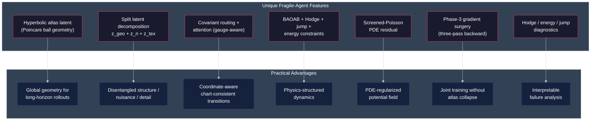

# Single Agent Architecture as Hyperbolic Field Theory (Implementation TL;DR)

Guillem Duran Ballester, Jan 2026

## Scope and implementation anchors

This document specifies the implemented single-agent architecture as a hyperbolic field theory over the Poincaré ball latent space.

Primary implementation files:
- `src/fragile/learning/core/layers/atlas.py`
- `src/fragile/learning/vla/covariant_world_model.py`
- `src/fragile/learning/vla/losses.py`
- `src/fragile/learning/vla/train_joint.py`

---

## 0. Field-theory objects and module correspondence

- **State field**: latent trajectory `z_t` on the Poincaré ball.
- **Chart field**: atlas routing weights and chart assignment.
- **Potential field**: conservative force and scalar potential from `CovariantPotentialNet`.
- **Hodge field**: solenoidal + harmonic decomposition channels.
- **Jump field**: Poisson-like sparse event process.
- **Observable field**: decoder reconstruction from geometric + texture channels.

---

## 1. End-to-end implementation schematic

---

## 2. Atlas implementation

### 2.1 CovariantChartRouter

The chart router is shared by both encoder and decoder. It performs hyperbolic chart assignment using:
- Poincare-ball distance scoring with conformal temperature
- O(n) parallel transport via conformal factor scaling (no Cayley transform)
- Optional feature-aware correction with Christoffel-style quadratic terms

### 2.2 PrimitiveAttentiveAtlasEncoder

The encoder performs feature extraction, hyperbolic routing, hyperbolic VQ per chart, and splits the latent into $(z_{geo}, z_n, z_{tex})$ (with $z_{geo}$ on the Poincare ball and $z_n, z_{tex}$ in the tangent space):

### 2.3 PrimitiveTopologicalDecoder

The decoder performs chart-weighted reconstruction from the hyperbolic geometric latent $z_{geo}$ and adds the texture residual $z_{tex}$:
- Geometric path: Hyperbolic routing -> SpectralLinear chart projectors -> NormGatedGELU -> Renderer
- Texture path: Tanh + SpectralLinear residual with learned scale
- Final output: Base reconstruction + scaled texture residual

---

## 3. World model implementation (hyperbolic field dynamics)

### 3.1 GeometricWorldModel internals

### 3.2 BAOAB step decomposition as implemented pattern

### 3.3 Screened Poisson implementation path

Advantages of this implementation choice:
- Enforces PDE-style structure on the potential field, not only pointwise regression.
- Couples value smoothness and geometry through hyperbolic Laplace-Beltrami.
- Integrates directly into `compute_phase2_loss` with explicit weight control.

---

## 4. Full loss architecture

Field-theory view of losses:
- `base_loss`: stabilizes atlas chart/state representation.
- `zn_reg_loss`: regularizes nuisance subfield statistics.
- `dyn_loss`: enforces geometric trajectory laws and force decomposition consistency.

---

## 5. Phase-3-only training implementation

---

## 6. Unique Fragile-agent features and advantages

Distinctive practical benefits:
- Combines hyperbolic geometry and charted representation, rather than a single flat latent.
- Combines continuous drift dynamics and sparse jump dynamics in one rollout engine.
- Couples reconstruction and dynamics with explicit gradient firewalls.
- Exposes physically meaningful diagnostics for debugging and control.

---

This document preserves the field-theory framing while specifying the implemented hyperbolic modules, loss operators, and Phase-3 training mechanics.
