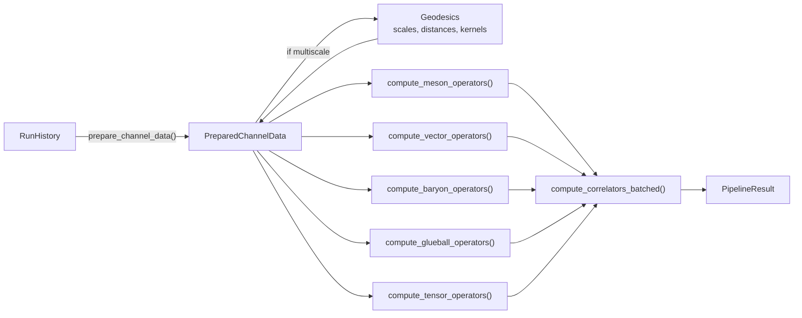
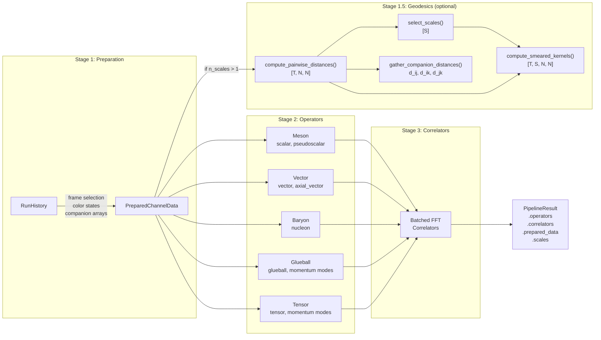
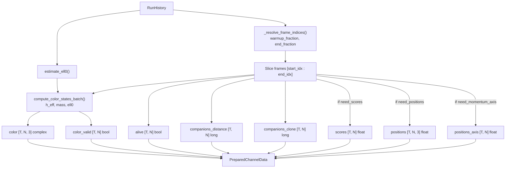
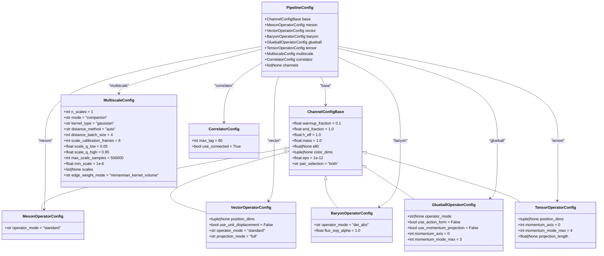
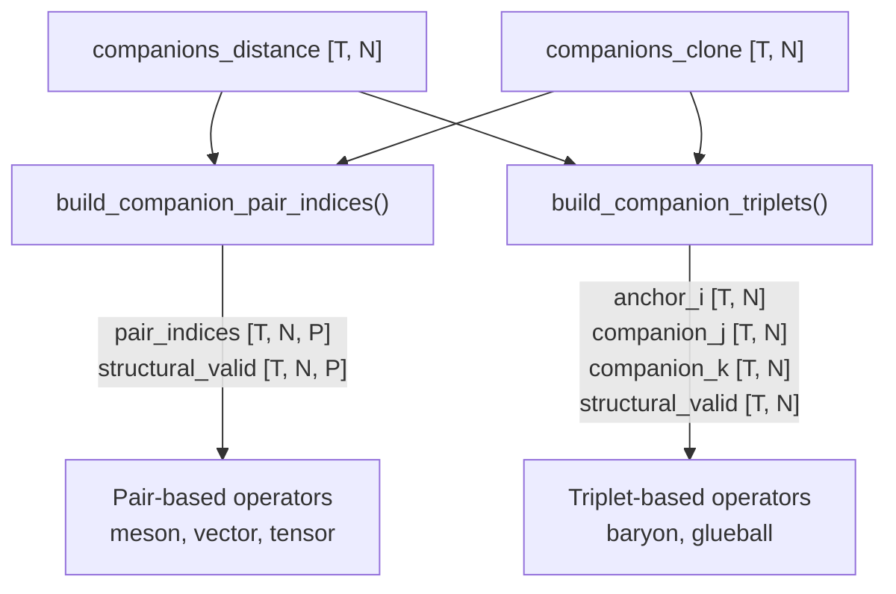
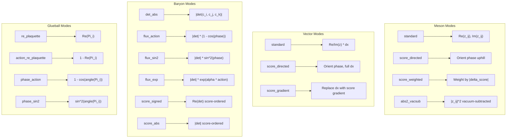
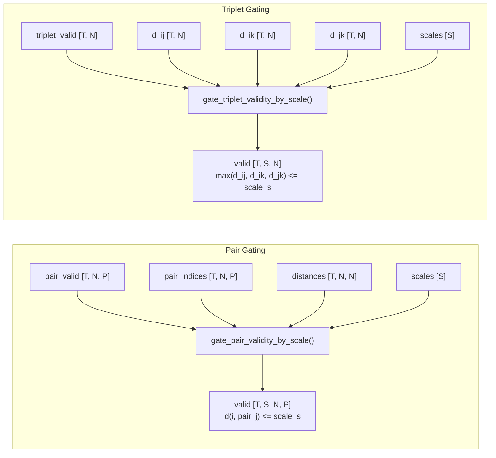
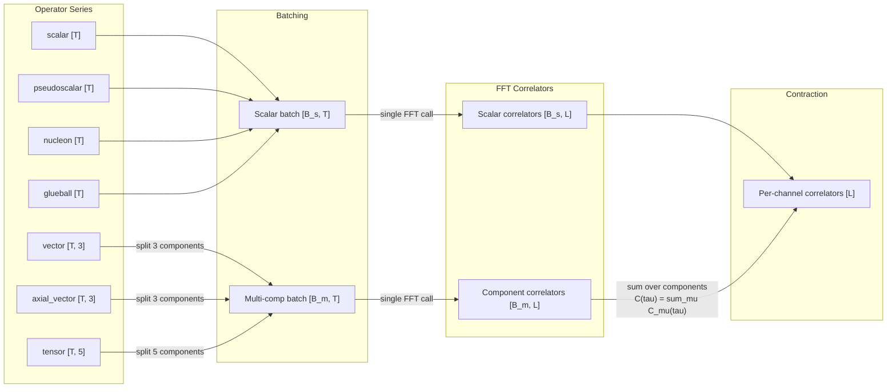

# Strong-Force Companion-Channel Operators: Architecture

## Overview

The `physics/operators/` package provides a deduplicated implementation of the
five strong-force companion-channel operator families, their temporal correlators,
and an optional multiscale geodesic analysis layer. Each operator module receives
a single shared data structure (`PreparedChannelData`) instead of accessing
`RunHistory` directly, eliminating duplicated frame-extraction, color-state
computation, and companion-index resolution per channel.



---

## Module Map

```
physics/operators/
  __init__.py            Public API re-exports (30 names)
  config.py              Configuration dataclasses (base + per-channel + multiscale)
  preparation.py         RunHistory -> PreparedChannelData extraction
  meson_operators.py     J=0 scalar / pseudoscalar operators
  vector_operators.py    J=1 vector / axial-vector operators
  baryon_operators.py    Nucleon (determinant-based) operators
  glueball_operators.py  Color-plaquette glueball operators
  tensor_operators.py    Spin-2 traceless tensor operators
  correlators.py         Batched FFT temporal correlators
  geodesics.py           Pairwise distances, scale selection, smeared kernels
  multiscale.py          Scale-gated validity masks and per-scale averaging
  pipeline.py            Top-level orchestrator
```

---

## Data Flow

### Full Pipeline

The orchestrator (`pipeline.py`) drives the computation in four stages:



### Preparation Detail

`prepare_channel_data()` extracts everything operator modules need from `RunHistory`
in a single pass. Downstream modules never import or reference `RunHistory`.



### PreparedChannelData Fields

```python
@dataclass
class PreparedChannelData:
    # Core (always computed)
    color: Tensor              # [T, N, 3] complex color states
    color_valid: Tensor        # [T, N] bool validity mask
    companions_distance: Tensor  # [T, N] long indices (j)
    companions_clone: Tensor   # [T, N] long indices (k)
    frame_indices: list[int]   # Selected frame indices
    device: torch.device
    eps: float                 # Validity threshold

    # Optional (only when requested by pipeline)
    scores: Tensor | None          # [T, N] float
    positions: Tensor | None       # [T, N, 3] float
    positions_axis: Tensor | None  # [T, N] float (momentum projection axis)
    projection_length: float | None  # Box size for Fourier modes

    # Multiscale (only when n_scales > 1)
    scales: Tensor | None           # [S] float scale thresholds
    pairwise_distances: Tensor | None  # [T, N, N] geodesic distances
    kernels: Tensor | None          # [T, S, N, N] smeared kernels
    companion_d_ij: Tensor | None   # [T, N] distance i to j
    companion_d_ik: Tensor | None   # [T, N] distance i to k
    companion_d_jk: Tensor | None   # [T, N] distance j to k
```

---

## Configuration Hierarchy

All config dataclasses live in `config.py`. Channel-specific configs inherit from
`ChannelConfigBase`, which holds the shared physics and frame-selection parameters.



---

## Operator Channels

### Uniform Interface

Every operator module exports a single public function with the same signature:

```python
def compute_X_operators(
    data: PreparedChannelData,
    config: XOperatorConfig,
) -> dict[str, Tensor]:
    ...
```

The returned dictionary maps channel names to time-series tensors. At single scale,
scalar channels produce `[T]` tensors and vector/tensor channels produce `[T, 3]`
or `[T, 5]` tensors. With multiscale enabled (`n_scales > 1`), shapes become
`[S, T]`, `[S, T, 3]`, or `[S, T, 5]`.

### Channel Summary

| Module | Function | Output Keys | Shape | Multiscale Shape | Physics |
|--------|----------|-------------|-------|------------------|---------|
| `meson_operators` | `compute_meson_operators` | `"scalar"`, `"pseudoscalar"` | `[T]` | `[S, T]` | `Re(z_ij)`, `Im(z_ij)` |
| `vector_operators` | `compute_vector_operators` | `"vector"`, `"axial_vector"` | `[T, 3]` | `[S, T, 3]` | `Re(z_ij) * dx`, `Im(z_ij) * dx` |
| `baryon_operators` | `compute_baryon_operators` | `"nucleon"` | `[T]` | `[S, T]` | `\|det(c_i, c_j, c_k)\|` |
| `glueball_operators` | `compute_glueball_operators` | `"glueball"`, `"glueball_momentum_cos_n"`, `"glueball_momentum_sin_n"` | `[T]` | `[S, T]` | `Re(Pi_i)` or `1 - Re(Pi_i)` |
| `tensor_operators` | `compute_tensor_operators` | `"tensor"`, `"tensor_momentum_cos_n"`, `"tensor_momentum_sin_n"` | `[T, 5]` | `[S, T, 5]` | `Re(z_ij) * Q^{ab}(dx)` |

### Companion Topology

All operators are built from companion relationships between walkers. Two shared
index-construction functions (imported from `qft_utils.companions`) underpin everything:



**Pairs** (used by meson, vector, tensor): Each walker `i` has up to 2 companion
partners -- the distance companion `j = companions_distance[i]` and the clone
companion `k = companions_clone[i]`. The `pair_selection` parameter controls which
partners to use (`"distance"`, `"clone"`, or `"both"`).

**Triplets** (used by baryon, glueball): Each walker `i` forms a triplet
`(i, j, k)` where `j` is the distance companion and `k` is the clone companion.
The triplet must have all three indices distinct and in-range.

### Operator Modes

Each channel supports multiple physics modes via its `operator_mode` field:



---

## Geodesics & Scale Selection

The `geodesics.py` module computes pairwise geodesic distances on the Delaunay
graph and derives multiscale analysis quantities from them.

### Distance Computation

```python
def compute_pairwise_distances(
    history: RunHistory,
    frame_indices: list[int],
    method: str = "auto",       # "auto" | "floyd-warshall" | "tropical"
    edge_weight_mode: str = "riemannian_kernel_volume",
    batch_size: int = 4,
) -> Tensor:  # [T, N, N]
```

**Edge weight modes** control how Delaunay edges are weighted before shortest-path
computation:

| Mode | Description |
|------|-------------|
| `"uniform"` | All edges weight 1 |
| `"inverse_distance"` | 1 / Euclidean distance |
| `"inverse_volume"` | 1 / Voronoi volume |
| `"inverse_riemannian_distance"` | 1 / (kernel-weighted distance) |
| `"inverse_riemannian_volume"` | 1 / (kernel-weighted volume) |
| `"kernel"` | Raw kernel weight |
| `"riemannian_kernel"` | Kernel / Euclidean distance |
| `"riemannian_kernel_volume"` | Kernel / (distance * volume) |

### Scale Selection

```python
def select_scales(
    distances: Tensor,   # [T, N, N]
    n_scales: int,
    q_low: float = 0.05,
    q_high: float = 0.95,
    max_samples: int = 500_000,
    min_scale: float = 1e-6,
) -> Tensor:  # [S]
```

Samples finite positive distances from a subset of frames, computes linearly
spaced quantiles in `[q_low, q_high]`, and ensures strictly increasing scales.

### Smeared Kernels

```python
def compute_smeared_kernels(
    distances: Tensor,   # [T, N, N]
    scales: Tensor,      # [S]
    kernel_type: str = "gaussian",  # "gaussian" | "exponential" | "tophat" | "shell"
    normalize_rows: bool = True,
    eps: float = 1e-12,
) -> Tensor:  # [T, S, N, N]
```

### Companion Distance Extraction

```python
def gather_companion_distances(
    distances: Tensor,           # [T, N, N]
    companions_distance: Tensor, # [T, N]
    companions_clone: Tensor,    # [T, N]
) -> tuple[Tensor, Tensor, Tensor]:
    # Returns: d_ij [T, N], d_ik [T, N], d_jk [T, N]
```

---

## Multiscale Processing

The `multiscale.py` module provides scale-gated validity masks and per-scale
frame averaging, allowing each operator to produce `[S, T]` or `[S, T, C]`
output instead of `[T]` or `[T, C]`.

### Validity Gating



- **Pair gating**: valid if base validity holds AND `d(i, pair_j) <= scale_s`
- **Triplet gating**: valid if base validity holds AND `max(d_ij, d_ik, d_jk) <= scale_s`

### Per-Scale Averaging

```python
def per_frame_series_multiscale(
    values: Tensor,  # [T, N] or [T, N, P]
    valid: Tensor,   # [T, S, N] or [T, S, N, P]
) -> Tensor:         # [S, T]

def per_frame_vector_series_multiscale(
    values: Tensor,  # [T, N, P, C]
    valid: Tensor,   # [T, S, N, P]
) -> Tensor:         # [S, T, C]
```

Computes masked means per frame per scale, transposing the scale dimension to
the leading axis for batched correlator computation.

---

## Correlator Engine

`compute_correlators_batched()` processes all operator time-series in a single
pass through `_fft_correlator_batched` (imported from `fragile.physics.qft_utils.fft`).

```python
def compute_correlators_batched(
    operators: dict[str, Tensor],
    max_lag: int,
    use_connected: bool = True,
    n_scales: int = 1,
) -> dict[str, Tensor]:
```

### Single-Scale Mode (`n_scales=1`)



### Multiscale Mode (`n_scales>1`)

- Scalar `[S, T]` -> FFT with S as batch dim -> `[S, max_lag+1]`
- Vector `[S, T, 3]` -> reshape `[S*3, T]`, FFT -> `[S*3, max_lag+1]`, reshape & sum -> `[S, max_lag+1]`
- Tensor `[S, T, 5]` -> reshape `[S*5, T]`, FFT -> `[S*5, max_lag+1]`, reshape & sum -> `[S, max_lag+1]`

### Correlator Properties

- **Scalar channels** (`[T]` or `[S, T]`): stacked into one batch, one FFT call, results indexed back.
- **Multi-component channels** (`[T, C]` or `[S, T, C]`): each component is a separate series in the
  FFT batch. After computing per-component correlators, they are summed
  (dot-product contraction): `C(tau) = sum_mu <O_mu(t) O_mu(t+tau)>`.
- **Connected correlators**: when `use_connected=True`, the mean is subtracted before
  the FFT, yielding the connected two-point function.

---

## Pipeline Output

```python
@dataclass
class PipelineResult:
    operators: dict[str, Tensor]      # channel_name -> operator series
    correlators: dict[str, Tensor]    # channel_name -> correlator [max_lag+1] or [S, max_lag+1]
    prepared_data: PreparedChannelData | None
    scales: Tensor | None             # [S] scale thresholds (if multiscale)
```

---

## Internal Dependencies

```mermaid
flowchart TD
    INIT["__init__.py"] --> CONFIG["config.py"]
    INIT --> PREP["preparation.py"]
    INIT --> MESON["meson_operators.py"]
    INIT --> VECTOR["vector_operators.py"]
    INIT --> BARYON["baryon_operators.py"]
    INIT --> GLUEBALL["glueball_operators.py"]
    INIT --> TENSOR["tensor_operators.py"]
    INIT --> CORR["correlators.py"]
    INIT --> GEO["geodesics.py"]
    INIT --> MULTI["multiscale.py"]
    INIT --> PIPE["pipeline.py"]

    PREP --> CONFIG
    MESON --> CONFIG
    VECTOR --> CONFIG
    BARYON --> CONFIG
    GLUEBALL --> CONFIG
    TENSOR --> CONFIG

    PIPE --> CONFIG
    PIPE --> PREP
    PIPE --> CORR
    PIPE --> GEO
    PIPE --> MULTI
    PIPE -.->|"lazy import"| MESON
    PIPE -.->|"lazy import"| VECTOR
    PIPE -.->|"lazy import"| BARYON
    PIPE -.->|"lazy import"| GLUEBALL
    PIPE -.->|"lazy import"| TENSOR

    subgraph External["External Imports"]
        QFT_COLOR["fragile.physics.qft_utils.color_states\ncompute_color_states_batch\nestimate_ell0"]
        QFT_COMP["fragile.physics.qft_utils.companions\nbuild_companion_pair_indices\nbuild_companion_triplets"]
        QFT_HELP["fragile.physics.qft_utils.helpers\nsafe_gather_2d, safe_gather_3d\nsafe_gather_pairs_2d, safe_gather_pairs_3d"]
        QFT_FFT["fragile.physics.qft_utils.fft\n_fft_correlator_batched"]
        NEIGHBORS["fragile.physics.geometry.neighbors\nDelaunay graph, edge weights"]
        HIST["fragile.physics.fractal_gas.history\nRunHistory"]
    end

    PREP --> QFT_COLOR
    PREP --> QFT_COMP
    PREP --> QFT_HELP
    PREP --> HIST
    MESON --> QFT_COMP
    MESON --> QFT_HELP
    BARYON --> QFT_COMP
    BARYON --> QFT_HELP
    GLUEBALL --> QFT_HELP
    TENSOR --> QFT_HELP
    VECTOR --> QFT_HELP
    CORR --> QFT_FFT
    GEO --> NEIGHBORS
    GEO --> HIST
    PIPE --> HIST
```



Dashed arrows indicate lazy imports (only resolved when the code path is actually
executed), used to avoid circular dependencies and to keep imports fast when only
a subset of channels is needed.

---

## Shared Utilities

Helper functions are defined in `qft_utils` and reused across operator modules:

| Function | Defined in | Used by |
|----------|-----------|---------|
| `safe_gather_2d` | `qft_utils.helpers` | `meson_operators`, `baryon_operators`, `glueball_operators`, `tensor_operators` |
| `safe_gather_3d` | `qft_utils.helpers` | `meson_operators`, `baryon_operators`, `glueball_operators`, `tensor_operators` |
| `safe_gather_pairs_2d` | `qft_utils.helpers` | `vector_operators`, `tensor_operators` |
| `safe_gather_pairs_3d` | `qft_utils.helpers` | `vector_operators`, `tensor_operators` |
| `build_companion_pair_indices` | `qft_utils.companions` | `meson_operators`, `vector_operators`, `tensor_operators`, `pipeline` |
| `build_companion_triplets` | `qft_utils.companions` | `baryon_operators`, `glueball_operators`, `pipeline` |
| `_resolve_frame_indices` | `preparation.py` | `prepare_channel_data` |
| `_resolve_3d_dims` | `preparation.py` | `prepare_channel_data` |
| `_det3` | `baryon_operators.py` | `baryon_operators` internal |

---

## Momentum Projection

Glueball and tensor channels support Fourier momentum projection along a spatial axis.
For each mode `n = 0, 1, ..., n_max`:

```
k_n = 2 * pi * n / L

O_cos_n(t) = <O_i(t) * cos(k_n * x_i)>_i
O_sin_n(t) = <O_i(t) * sin(k_n * x_i)>_i
```

where `L` is the projection length (box size along the momentum axis or the
observed span), and the average is over valid walkers weighted by their validity masks.

These projected series are returned as additional dictionary entries
(`"glueball_momentum_cos_0"`, `"tensor_momentum_sin_2"`, etc.) and flow
into the correlator engine like any other operator series.
