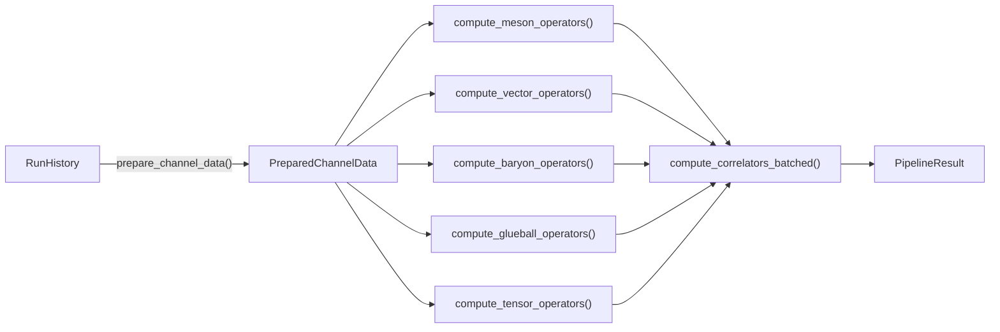
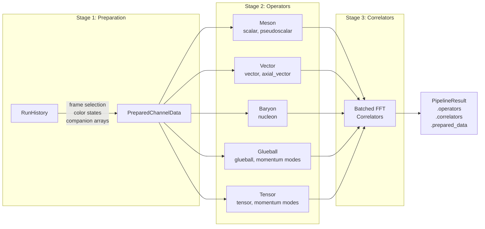
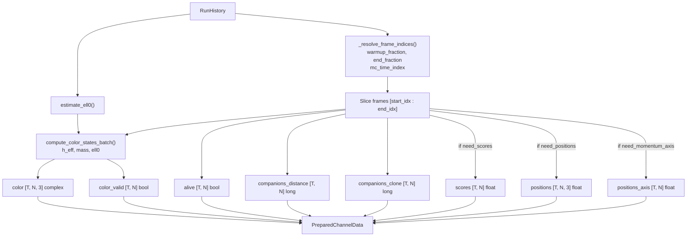
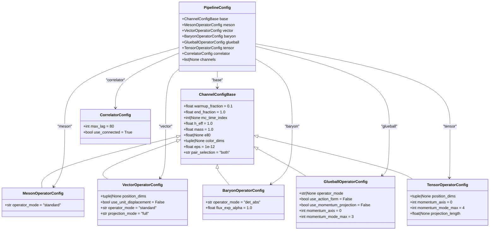
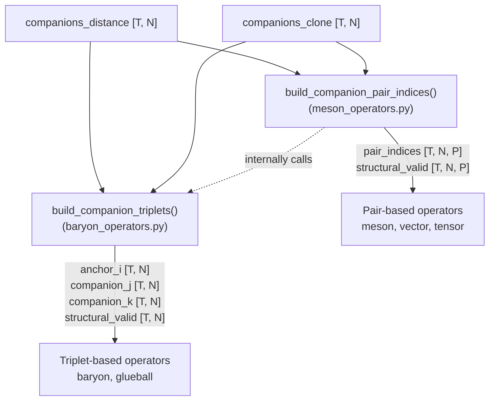
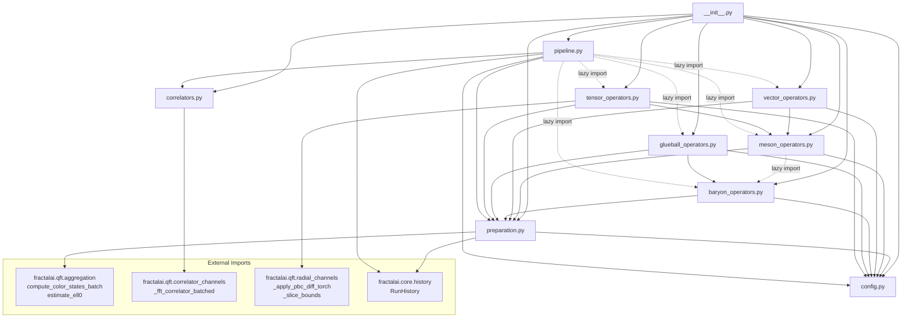

# Strong-Force Companion-Channel Kernels: Architecture

## Overview

The `physics/kernels/` package provides a clean, deduplicated implementation of the
five strong-force companion-channel operator families and their temporal correlators.
Each operator module receives a single shared data structure (`PreparedChannelData`)
instead of accessing `RunHistory` directly, eliminating ~50 lines of duplicated
frame-extraction, color-state computation, and companion-index resolution per channel.



---

## Module Map

```
physics/kernels/
  __init__.py            Public API re-exports
  config.py              Configuration dataclasses (base + per-channel)
  preparation.py         RunHistory -> PreparedChannelData extraction
  meson_operators.py     J=0 scalar / pseudoscalar operators
  vector_operators.py    J=1 vector / axial-vector operators
  baryon_operators.py    Nucleon (determinant-based) operators
  glueball_operators.py  Color-plaquette glueball operators
  tensor_operators.py    Spin-2 traceless tensor operators
  correlators.py         Batched FFT temporal correlators
  pipeline.py            Top-level orchestrator
```

---

## Data Flow

### Full Pipeline

The orchestrator (`pipeline.py`) drives the entire computation in three stages:



### Preparation Detail

`prepare_channel_data()` extracts everything operator modules need from `RunHistory`
in a single pass. Downstream modules never import or reference `RunHistory`.



---

## Configuration Hierarchy

All config dataclasses live in `config.py`. Channel-specific configs inherit from
`ChannelConfigBase`, which holds the shared physics and frame-selection parameters.



---

## Operator Channels

### Uniform Interface

Every operator module exports a single public function with the same signature:

```python
def compute_X_operators(
    data: PreparedChannelData,
    config: XOperatorConfig,
) -> dict[str, Tensor]:
    ...
```

The returned dictionary maps channel names to time-series tensors. Scalar channels
produce `[T]` tensors; vector/tensor channels produce `[T, 3]` or `[T, 5]` tensors.

### Channel Summary

| Module | Function | Output Keys | Shape | Physics |
|--------|----------|-------------|-------|---------|
| `meson_operators` | `compute_meson_operators` | `"scalar"`, `"pseudoscalar"` | `[T]` | `Re(z_ij)`, `Im(z_ij)` |
| `vector_operators` | `compute_vector_operators` | `"vector"`, `"axial_vector"` | `[T, 3]` | `Re(z_ij) * dx`, `Im(z_ij) * dx` |
| `baryon_operators` | `compute_baryon_operators` | `"nucleon"` | `[T]` | `|det(c_i, c_j, c_k)|` |
| `glueball_operators` | `compute_glueball_operators` | `"glueball"`, `"glueball_momentum_cos_n"`, `"glueball_momentum_sin_n"` | `[T]` | `Re(Pi_i)` or `1 - Re(Pi_i)` |
| `tensor_operators` | `compute_tensor_operators` | `"tensor"`, `"tensor_momentum_cos_n"`, `"tensor_momentum_sin_n"` | `[T, 5]` | `Re(z_ij) * Q^{ab}(dx)` |

### Companion Topology

All operators are built from companion relationships between walkers. Two shared
index-construction functions underpin everything:



**Pairs** (used by meson, vector, tensor): Each walker `i` has up to 2 companion
partners -- the distance companion `j = companions_distance[i]` and the clone
companion `k = companions_clone[i]`. The `pair_selection` parameter controls which
partners to use (`"distance"`, `"clone"`, or `"both"`).

**Triplets** (used by baryon, glueball): Each walker `i` forms a triplet
`(i, j, k)` where `j` is the distance companion and `k` is the clone companion.
The triplet must have all three indices distinct and in-range.

### Operator Modes

Each channel supports multiple physics modes via its `operator_mode` field:


---

## Correlator Engine

`compute_correlators_batched()` processes all operator time-series in a single
pass through `_fft_correlator_batched` (imported from `fractalai.qft`).


- **Scalar channels** (`[T]`): stacked into one batch, one FFT call, results indexed back.
- **Multi-component channels** (`[T, C]`): each component is a separate series in the
  FFT batch. After computing per-component correlators, they are summed
  (dot-product contraction): `C(tau) = sum_mu <O_mu(t) O_mu(t+tau)>`.
- **Connected correlators**: when `use_connected=True`, the mean is subtracted before
  the FFT, yielding the connected two-point function.

---

## Internal Dependencies



Dashed arrows indicate lazy imports (only resolved when the code path is actually
executed), used to avoid circular dependencies and to keep imports fast when only
a subset of channels is needed.

---

## Shared Utilities

Several helper functions are defined once and reused across modules:

| Function | Defined in | Used by |
|----------|-----------|---------|
| `_safe_gather_2d` | `preparation.py` | `meson_operators`, `baryon_operators`, `glueball_operators`, `tensor_operators` |
| `_safe_gather_3d` | `preparation.py` | `meson_operators`, `baryon_operators`, `glueball_operators`, `tensor_operators` |
| `_safe_gather_pairs_2d` | `meson_operators.py` | `vector_operators`, `tensor_operators` |
| `_safe_gather_pairs_3d` | `meson_operators.py` | `vector_operators`, `tensor_operators` |
| `build_companion_pair_indices` | `meson_operators.py` | `vector_operators`, `tensor_operators`, `pipeline` |
| `build_companion_triplets` | `baryon_operators.py` | `meson_operators` (lazy), `glueball_operators`, `pipeline` |
| `_resolve_frame_indices` | `preparation.py` | `prepare_channel_data` |
| `_resolve_3d_dims` | `preparation.py` | `prepare_channel_data` |
| `_det3` | `baryon_operators.py` | `baryon_operators` internal |

---

## Momentum Projection

Glueball and tensor channels support Fourier momentum projection along a spatial axis.
For each mode `n = 0, 1, ..., n_max`:

```
k_n = 2 * pi * n / L

O_cos_n(t) = <O_i(t) * cos(k_n * x_i)>_i
O_sin_n(t) = <O_i(t) * sin(k_n * x_i)>_i
```

where `L` is the projection length (box size along the momentum axis or the
observed span), and the average is over valid walkers weighted by their validity masks.

These projected series are returned as additional dictionary entries
(`"glueball_momentum_cos_0"`, `"tensor_momentum_sin_2"`, etc.) and flow
into the correlator engine like any other operator series.

---

## Relation to Legacy Code

This package is a clean re-implementation of logic previously scattered across:

| Legacy module | Kernels equivalent |
|--------------|-------------------|
| `physics/operators/meson_phase_channels.py` | `meson_operators.py` |
| `physics/operators/vector_meson_channels.py` | `vector_operators.py` |
| `physics/operators/baryon_triplet_channels.py` | `baryon_operators.py` + `preparation.py` utilities |
| `physics/operators/glueball_color_channels.py` | `glueball_operators.py` |
| `physics/operators/tensor_momentum_channels.py` | `tensor_operators.py` |
| `physics/operators/aggregation.py` | Referenced, not copied (imported from `fractalai.qft`) |
| `fractalai/qft/correlator_channels.py` | `correlators.py` (wraps `_fft_correlator_batched`) |

The legacy modules remain intact. No existing code was deleted or modified.

**Key differences from legacy:**

1. **No duplicated frame extraction.** Each legacy module independently sliced
   `RunHistory` arrays and computed color states. Now done once in `preparation.py`.
2. **No per-module correlator loops.** Each legacy module had its own temporal-lag
   loop computing correlators. Now all series go through a single batched FFT in
   `correlators.py`.
3. **Uniform interface.** All operator modules accept `PreparedChannelData` and
   return `dict[str, Tensor]`, making them interchangeable and composable.
4. **Single entry point.** `compute_strong_force_pipeline()` runs the full analysis
   with one function call and one config object.
