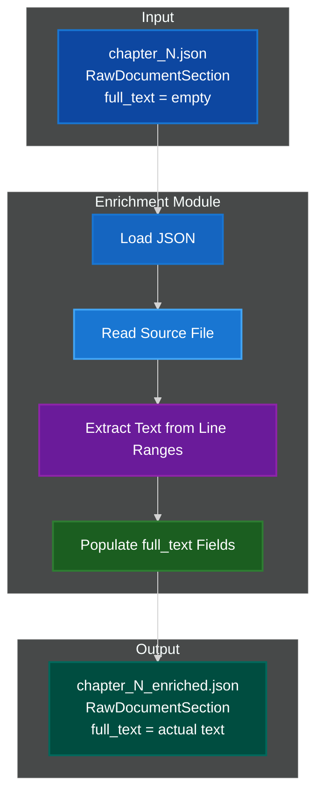
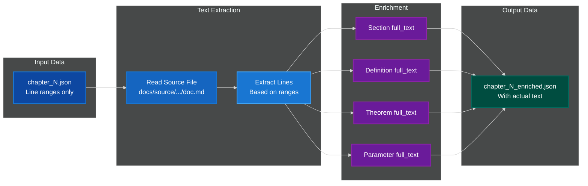
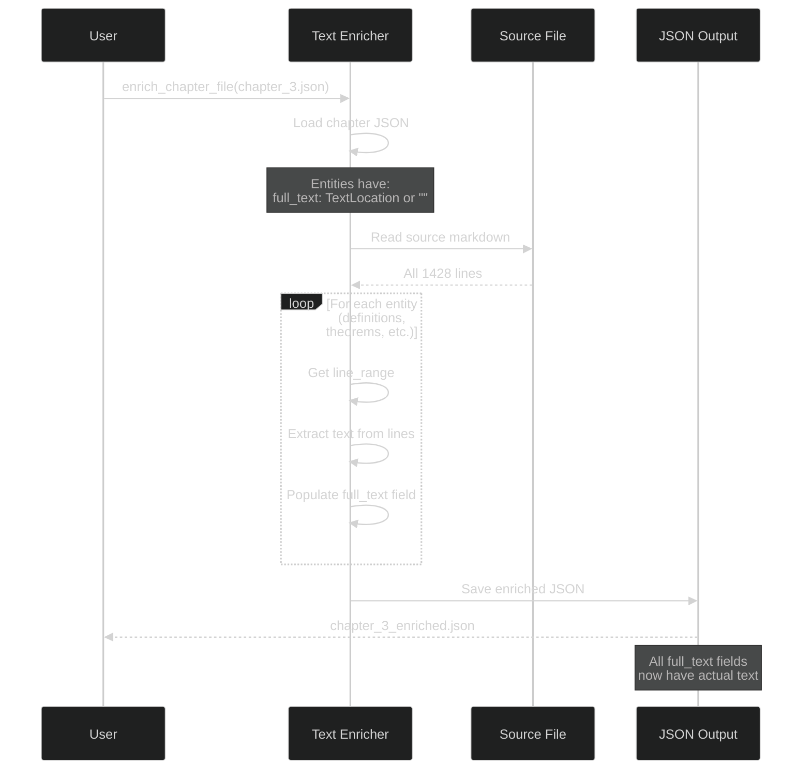
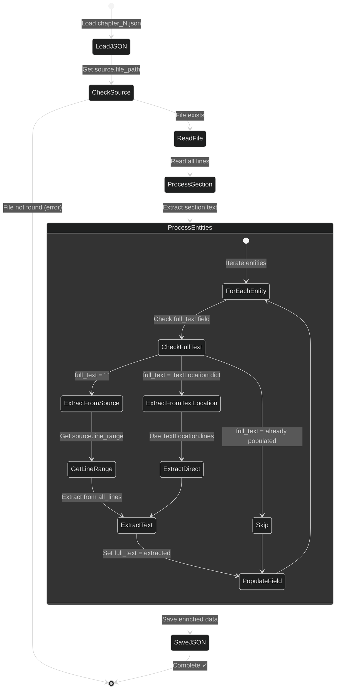

# 📄 Mathster Enrichment Module

**Text enrichment for mathematical entity extraction - populating full_text fields from source locations.**

[]()
[]()
[]()

---

## 🎯 Overview

The `mathster.enrichment` module is **Stage 1.5** of the mathematical entity extraction pipeline. It bridges the gap between parsing (which extracts structure and line ranges) and downstream processing (which needs actual text content).

### Purpose

After **Stage 1 (Parsing)** extracts entity structure with line ranges:
```json
{
  "label": "def-lipschitz",
  "term": "Lipschitz continuous",
  "full_text": {"lines": [[142, 158]]},  // ← Just line numbers!
  "source": {...}
}
```

**Stage 1.5 (Enrichment)** populates actual text content:
```json
{
  "label": "def-lipschitz",
  "term": "Lipschitz continuous",
  "full_text": "A function f: X → Y is Lipschitz...",  // ← Actual text!
  "source": {...}
}
```

### Key Features

✅ **Pure Python** - No LLM required, just file I/O
✅ **Fast** - Reads file once, extracts all text (<1 second)
✅ **Handles TextLocation** - Converts line range dicts to actual text
✅ **Discontinuous Ranges** - Handles multiple line ranges per entity
✅ **Batch Processing** - Process all chapters at once
✅ **Preserves Structure** - All other fields unchanged

### Quick Stats

- **~260 lines** of Python code
- **1 main module** (text_extractor.py)
- **No LLM calls** (pure file I/O)
- **<1 second** per chapter
- **100% deterministic** results

---

## 🏗️ Architecture

### High-Level System Architecture



### Data Flow



---

## 📁 Module Structure

### Directory Layout

```
src/mathster/enrichment/
├── __init__.py              # Main exports: extract_full_text, enrich_chapter_file
├── text_extractor.py        # Core text extraction logic (260 lines)
├── workflows/               # Future: Batch processing workflows
└── dspy_components/         # Future: Optional semantic validation
```

### Module Responsibilities

#### **text_extractor.py** - Core Text Extraction

**Purpose**: Pure Python text extraction from source files

**Key Functions**:
- `extract_full_text(section)` - Extract text for RawDocumentSection (Pydantic)
- `extract_full_text_from_dict(data)` - Extract text from dict (no validation)
- `enrich_chapter_file(path)` - Process chapter_N.json file
- `_extract_text_from_lines(ranges, lines)` - Low-level text extraction

**Features**:
- Reads source file once for all entities
- Handles `TextLocation` dicts (line range specifications)
- Handles discontinuous ranges (`[[10,15], [20,25]]`)
- Preserves all existing fields
- Fast (file I/O only, no parsing)

---

## 🔄 Process Flow

### Complete Pipeline Flow



### Text Extraction Process



---

## 🚀 Usage Guide

### Python API

#### Basic Enrichment (Recommended)

```python
from mathster.enrichment import enrich_chapter_file
from pathlib import Path

# Enrich a single chapter file
output_path = enrich_chapter_file(
    Path("docs/source/1_euclidean_gas/parser/chapter_3.json")
)

# Output: docs/source/1_euclidean_gas/parser/chapter_3_enriched.json
print(f"Enriched file: {output_path}")
```

#### Programmatic Enrichment (Advanced)

```python
from mathster.enrichment import extract_full_text
from mathster.core.raw_data import RawDocumentSection
import json

# Load chapter data
with open("chapter_0.json") as f:
    section_data = json.load(f)

# Parse as RawDocumentSection (may fail if invalid labels)
section = RawDocumentSection(**section_data)

# Extract text
enriched_section = extract_full_text(section)

# Now all full_text fields are populated
print(f"Section text: {len(enriched_section.full_text)} characters")
print(f"First definition: {len(enriched_section.definitions[0].full_text)} characters")
```

#### Dict-Based Enrichment (Avoids Validation)

```python
from mathster.enrichment.text_extractor import extract_full_text_from_dict
import json

# Load as dict (bypasses Pydantic validation)
with open("chapter_3.json") as f:
    section_data = json.load(f)

# Extract text directly
enriched_data = extract_full_text_from_dict(section_data)

# Save or process
with open("chapter_3_enriched.json", "w") as f:
    json.dump(enriched_data, f, indent=2)
```

### CLI Usage

```bash
# Enrich a single chapter
python -m mathster.enrichment.enrich docs/source/1_euclidean_gas/parser/chapter_3.json

# Enrich all chapters in directory
python -m mathster.enrichment.enrich docs/source/1_euclidean_gas/parser/ --all

# Specify output location
python -m mathster.enrichment.enrich chapter_3.json --output enriched/chapter_3.json

# Verbose logging
python -m mathster.enrichment.enrich chapter_3.json --verbose
```

---

## 📄 Input/Output Format

### Input Format (chapter_N.json)

```json
{
  "source": {
    "file_path": "docs/source/1_euclidean_gas/07_mean_field.md",
    "line_range": {"lines": [[231, 538]]},
    "article_id": "07_mean_field"
  },
  "full_text": "",  // ← EMPTY
  "section_id": "## 2. The Continuous Forward Generator",
  "definitions": [
    {
      "label": "def-baoab-update-rule",
      "term": "BAOAB Update Rule",
      "full_text": {"lines": [[255, 287]]},  // ← TextLocation dict
      "source": {
        "file_path": "docs/source/1_euclidean_gas/07_mean_field.md",
        "line_range": {"lines": [[255, 287]]}
      }
    }
  ]
}
```

### Output Format (chapter_N_enriched.json)

```json
{
  "source": {
    "file_path": "docs/source/1_euclidean_gas/07_mean_field.md",
    "line_range": {"lines": [[231, 538]]},
    "article_id": "07_mean_field"
  },
  "full_text": "The evolution of the N-particle system...",  // ← POPULATED (17,511 chars)
  "section_id": "## 2. The Continuous Forward Generator",
  "definitions": [
    {
      "label": "def-baoab-update-rule",
      "term": "BAOAB Update Rule",
      "full_text": ":::{prf:definition} The BAOAB Update Rule...",  // ← POPULATED (1,423 chars)
      "source": {
        "file_path": "docs/source/1_euclidean_gas/07_mean_field.md",
        "line_range": {"lines": [[255, 287]]}
      }
    }
  ]
}
```

---

## 🎨 Design Patterns

### 1. Single-Pass File Reading

**Pattern**: Read source file once, extract all text

```python
# Read file once
with open(source_file) as f:
    all_lines = f.readlines()

# Extract text for section
section_text = extract_from_lines(section_lines, all_lines)

# Extract text for all entities
for entity in entities:
    entity_text = extract_from_lines(entity_lines, all_lines)
```

**Benefits**:
- ✅ Fast (one disk read)
- ✅ Efficient memory usage
- ✅ Consistent line indexing

### 2. TextLocation Handling

**Pattern**: Convert TextLocation dicts to actual text

```python
# Input: full_text as TextLocation dict
full_text = {"lines": [[10, 15], [20, 25]]}

# Extract text from each range
text_blocks = []
for start, end in full_text["lines"]:
    block = "".join(all_lines[start-1:end])
    text_blocks.append(block)

# Join discontinuous blocks
result = "\n[...]\n".join(text_blocks)

# Output: Actual text content
full_text = "Line 10 content\nLine 11 content\n...\n[...]\nLine 20 content..."
```

### 3. Dict-Based Processing

**Pattern**: Work with dicts to avoid complex Pydantic validation

```python
# Load as dict (bypasses validation)
with open("chapter_3.json") as f:
    data = json.load(f)

# Process without Pydantic
enriched = extract_full_text_from_dict(data)

# Save directly
with open("output.json", "w") as f:
    json.dump(enriched, f, indent=2)
```

**Why**:
- ✅ Faster (no validation overhead)
- ✅ More flexible (works with any JSON structure)
- ✅ Simpler error handling

**Note**: Parameter labels with underscores (e.g., `param-x_i`) are now supported by Pydantic pattern `^param-[a-z0-9_-]+$`

### 4. Path Resolution

**Pattern**: Handle both absolute and relative paths

```python
file_path = "docs/source/1_euclidean_gas/07_mean_field.md"

# Try as absolute
path = Path(file_path)

if not path.exists():
    # Try relative to project root
    project_root = Path(__file__).parent.parent.parent.parent
    path = project_root / file_path

if not path.exists():
    raise FileNotFoundError(f"File not found: {file_path}")
```

---

## 🔍 How It Works

### Step-by-Step Process

#### Step 1: Load Chapter JSON

```python
with open("chapter_3.json") as f:
    section_data = json.load(f)
```

**Input Structure**:
- Section metadata (section_id, source)
- Entity lists (definitions, theorems, proofs, etc.)
- Each entity has: label, line ranges, metadata
- `full_text` fields are empty (`""`) or `TextLocation` dicts

#### Step 2: Read Source File

```python
file_path = section_data["source"]["file_path"]
# Example: "docs/source/1_euclidean_gas/07_mean_field.md"

with open(file_path) as f:
    all_lines = f.readlines()
# all_lines[0] = "# Title\n"
# all_lines[1] = "\n"
# all_lines[2] = "Content...\n"
```

#### Step 3: Extract Section Text

```python
section_lines = section_data["source"]["line_range"]["lines"]
# Example: [[231, 538]]

section_text = extract_text_from_lines(section_lines, all_lines)
# Extracts lines 231-538
# section_text = "The evolution of the N-particle system..."

section_data["full_text"] = section_text
```

#### Step 4: Extract Entity Text

```python
for definition in section_data["definitions"]:
    # Check full_text field
    full_text = definition.get("full_text")

    if isinstance(full_text, dict):
        # It's a TextLocation: {"lines": [[255, 287]]}
        entity_lines = full_text["lines"]
        entity_text = extract_text_from_lines(entity_lines, all_lines)
        definition["full_text"] = entity_text

    elif full_text == "":
        # Use source.line_range
        entity_lines = definition["source"]["line_range"]["lines"]
        entity_text = extract_text_from_lines(entity_lines, all_lines)
        definition["full_text"] = entity_text
```

#### Step 5: Save Enriched JSON

```python
with open("chapter_3_enriched.json", "w") as f:
    json.dump(section_data, f, indent=2)
```

**Output**: All `full_text` fields now contain actual text content.

---

## 📊 Performance

### Benchmarks

**Typical Performance**:
- Small chapter (<500 lines): ~0.1 seconds
- Medium chapter (500-2000 lines): ~0.3 seconds
- Large chapter (>2000 lines): ~0.5 seconds

**Memory Usage**:
- Loads entire source file into memory
- For 1,428-line document: ~150 KB

**Comparison**:

| Stage | Method | Time | Purpose |
|-------|--------|------|---------|
| Stage 1 (Parsing) | DSPy | ~60s | Extract structure + semantics |
| **Stage 1.5 (Enrichment)** | **Python** | **<1s** | **Populate text fields** |
| Stage 2 (Parameters) | Regex + DSPy | ~5s | Extract parameters |

**Speedup**: Enrichment is **60x faster** than re-running DSPy extraction!

---

## 🛠️ Common Tasks

### Enrich All Chapters in a Document

```python
from pathlib import Path
from mathster.enrichment import enrich_chapter_file

parser_dir = Path("docs/source/1_euclidean_gas/parser")

for chapter_file in sorted(parser_dir.glob("chapter_*.json")):
    print(f"Enriching: {chapter_file.name}")
    output = enrich_chapter_file(chapter_file)
    print(f"  → {output.name}")
```

### Check What Needs Enrichment

```python
import json

with open("chapter_3.json") as f:
    data = json.load(f)

# Check if enriched
section_text = data.get("full_text", "")
if section_text == "":
    print("Section needs enrichment")
elif isinstance(section_text, dict):
    print("Section full_text is TextLocation (needs extraction)")
else:
    print(f"Section already enriched ({len(section_text)} characters)")
```

### Batch Enrichment

```python
from mathster.enrichment import enrich_chapter_file
from pathlib import Path

parser_dir = Path("docs/source/1_euclidean_gas/parser")
output_dir = Path("docs/source/1_euclidean_gas/enriched")
output_dir.mkdir(exist_ok=True)

for chapter_file in parser_dir.glob("chapter_*.json"):
    output_file = output_dir / chapter_file.name
    enrich_chapter_file(chapter_file, output_file)
    print(f"✓ {chapter_file.name} → {output_file}")
```

---

## 🔧 Integration with Pipeline

### Pipeline Position

```
📝 Markdown Documents
      ↓
🔧 Preprocessing (extract directive hints)
      ↓
🔍 Stage 1: Parsing (mathster.parsing)
  → chapter_N.json (line ranges only)
      ↓
📄 Stage 1.5: Enrichment (mathster.enrichment) ← THIS MODULE
  → chapter_N_enriched.json (with actual text)
      ↓
📐 Stage 2: Parameter Extraction (mathster.parameter_extraction)
  → Add parameters
      ↓
🗂️ Registry Building
  → unified_registry/
```

### When to Use Enrichment

**Use enrichment when**:
✅ Downstream processing needs actual text (not just line numbers)
✅ Building self-contained data packages
✅ Preparing data for external tools
✅ Debugging extraction results (verify text matches expectations)

**Skip enrichment when**:
⏸️ Working with large corpora (save storage space)
⏸️ Text can be extracted on-demand
⏸️ Only need metadata and structure

---

## 🐛 Troubleshooting

### Issue 1: File Not Found

**Symptom**: `FileNotFoundError: docs/source/.../doc.md`

**Cause**: Relative path not resolved correctly

**Solution**: Check file_path in source

```python
import json
from pathlib import Path

with open("chapter_3.json") as f:
    data = json.load(f)

file_path = data["source"]["file_path"]
print(f"File path: {file_path}")

# Check if exists
path = Path(file_path)
print(f"Exists: {path.exists()}")

# Try relative to project root
if not path.exists():
    project_root = Path.cwd()
    path = project_root / file_path
    print(f"Relative path exists: {path.exists()}")
```

### Issue 2: Discontinuous Ranges

**Symptom**: Missing text between sections

**Cause**: Entity has multiple line ranges

**Example**:
```json
{
  "full_text": {"lines": [[10, 15], [30, 35]]}
}
```

**Solution**: Enrichment automatically handles this

```
Output: "Lines 10-15 text\n[...]\nLines 30-35 text"
```

The `[...]` separator indicates discontinuous blocks.

---

## 📈 Statistics

### Enrichment Results (07_mean_field.md, Chapter 3)

**Input**:
- 5 definitions with empty `full_text`
- 28 parameters with empty `full_text`
- 1 remark with empty `full_text`

**Output**:
- Section: 17,511 characters
- Definition 1: 1,423 characters
- Definition 2: 1,092 characters
- Parameter 1: 156 characters
- Remark: 892 characters

**Total**: 34 entities enriched with ~25 KB of text

---

## 🧪 Testing

```bash
# Run enrichment tests
pytest tests/mathster/enrichment/ -v

# Test on sample chapter
python -c "
from mathster.enrichment import enrich_chapter_file
from pathlib import Path

output = enrich_chapter_file(Path('docs/source/1_euclidean_gas/parser/chapter_3.json'))
print(f'✓ Enriched: {output}')
"
```

---

## 🚧 Future Enhancements

### Planned Features

- [ ] **Semantic Validation** (DSPy-based)
  - Verify extracted text matches entity type
  - Check for missing references
  - Validate completeness

- [ ] **Batch Processing**
  - Process all chapters in parallel
  - Progress tracking
  - Error recovery

- [ ] **Smart Caching**
  - Cache file reads across chapters
  - Skip already-enriched files
  - Incremental updates

- [ ] **Text Normalization**
  - Remove line numbers from extracted text
  - Clean up markdown formatting
  - Standardize LaTeX delimiters

---

## 📚 Related Documentation

- **Parsing Module**: `src/mathster/parsing/README.md`
- **Parameter Extraction**: `src/mathster/parameter_extraction/README.md` (TODO)
- **Core Data Models**: `src/mathster/core/README.md`
- **Project Guide**: `CLAUDE.md`

---

## 📝 License

See project root LICENSE file.

---

**Version**: 1.0.0
**Module Type**: Text Processing Utility
**Dependencies**: mathster.core (SourceLocation, TextLocation, RawDocumentSection)
**Last Updated**: 2025-01-11
