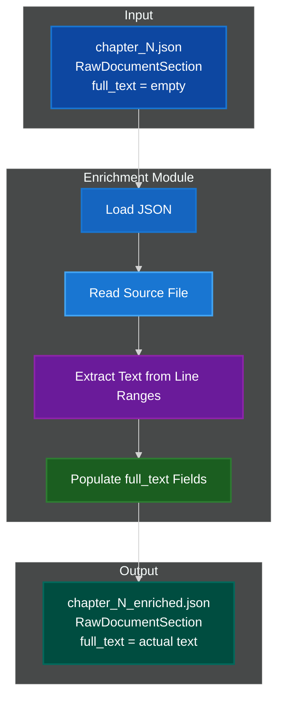
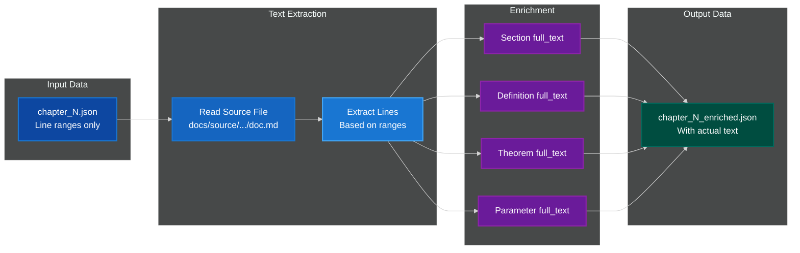
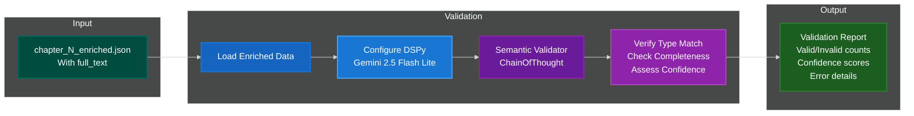
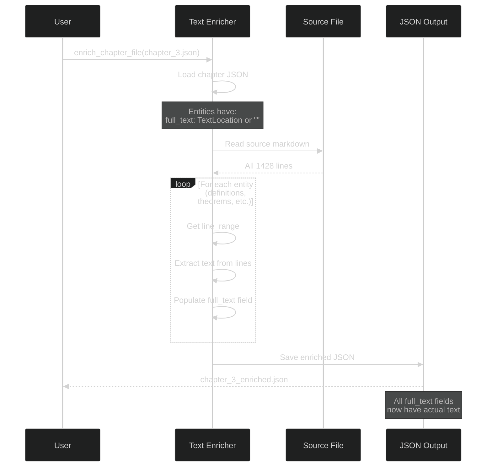
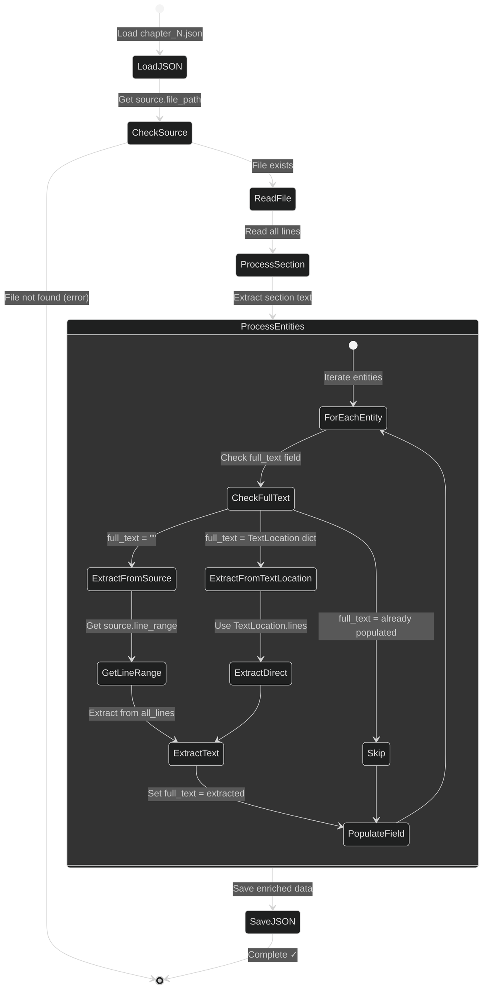

# 📄 Mathster Enrichment Module

**Text enrichment and semantic validation for mathematical entity extraction - populating full_text fields from source locations and verifying correctness.**

[]()
[]()
[]()

---

## 🎯 Overview

The `mathster.enrichment` module is **Stage 1.5** of the mathematical entity extraction pipeline. It bridges the gap between parsing (which extracts structure and line ranges) and downstream processing (which needs actual text content). The module provides both fast text extraction and optional semantic validation using DSPy agents.

### Purpose

After **Stage 1 (Parsing)** extracts entity structure with line ranges:
```json
{
  "label": "def-lipschitz",
  "term": "Lipschitz continuous",
  "full_text": {"lines": [[142, 158]]},  // ← Just line numbers!
  "source": {...}
}
```

**Stage 1.5 (Enrichment)** populates actual text content:
```json
{
  "label": "def-lipschitz",
  "term": "Lipschitz continuous",
  "full_text": "A function f: X → Y is Lipschitz...",  // ← Actual text!
  "source": {...}
}
```

### Key Features

✅ **Pure Python Text Extraction** - Fast file I/O, no LLM required for extraction
✅ **Fast** - Reads file once, extracts all text (<1 second)
✅ **Handles TextLocation** - Converts line range dicts to actual text
✅ **Discontinuous Ranges** - Handles multiple line ranges per entity
✅ **Batch Processing** - Process all chapters at once
✅ **Preserves Structure** - All other fields unchanged
✅ **Optional Semantic Validation** - DSPy-based verification of extracted content
✅ **Confidence Scoring** - High/medium/low confidence ratings with detailed errors

### Quick Stats

- **~670 lines** of Python code across 7 modules
- **3 main modules** (text_extractor.py, workflows, dspy_components)
- **Optional LLM validation** (DSPy-based semantic checking)
- **<1 second** per chapter (text extraction only)
- **100% deterministic** text extraction (validation uses LLM)

---

## 🏗️ Architecture

### High-Level System Architecture



### Data Flow



### Validation Workflow (Optional)



---

## 📁 Data Storage Structure

### Per-Document Enriched Folders

Enrichment now saves data to **per-document folders** following the same pattern as `raw_data/` and `unified_registry/`:

```
docs/source/{chapter}/
├── parser/                                    # Chapter-level parser output
│   ├── chapter_0.json                         # Parsed entities (line ranges)
│   ├── chapter_1.json
│   ├── chapter_N.json
│   ├── chapter_N_enriched.json                # ← Backward compatibility
│   └── enrichment_metadata.json               # ← Per-chapter statistics
│
├── {document_id}/                             # Per-document folders
│   ├── enriched/                              # ← NEW: Enriched data
│   │   ├── chapter_0.json                     # Enriched entities (full text)
│   │   ├── chapter_1.json
│   │   └── chapter_N.json
│   ├── raw_data/                              # Manual entity files
│   │   ├── definitions/
│   │   ├── theorems/
│   │   └── ...
│   └── unified_registry/                      # Merged data for dashboard
│       ├── definitions.json                   # Contains: parsed, enriched, raw_data
│       ├── theorems.json
│       └── registry_metadata.json             # Statistics by source
│
└── {document_id}.md                           # Source markdown
```

### Storage Locations

**Backward Compatibility (OLD)**:
- `parser/chapter_N_enriched.json` - Kept for existing code

**Per-Document Structure (NEW)**:
- `{document}/enriched/chapter_N.json` - Per-document enriched data
- Enables independent visualization and debugging of pipeline stages

**Metadata**:
- `parser/enrichment_metadata.json` - Per-chapter statistics
  - Total entities enriched
  - Entities with/without text
  - Breakdown by entity type
  - Error tracking

### Unified Registry Integration

The unified registry now stores **parsed, enriched, and raw_data separately** instead of merging them:

```json
{
  "parsed": [
    {"label": "def-lipschitz", "full_text": "", "_source_type": "parser"}
  ],
  "enriched": [
    {"label": "def-lipschitz", "full_text": "A function f...", "_source_type": "enriched"}
  ],
  "raw_data": [
    {"label": "def-custom", "full_text": "Manual entry...", "_source_type": "raw_data"}
  ]
}
```

**Benefits**:
- ✅ Independent debugging of each pipeline stage
- ✅ Easy visualization of data evolution
- ✅ Compare parsed vs enriched vs manual data
- ✅ Track where each entity came from

---

## 📁 Module Structure

### Directory Layout

```
src/mathster/enrichment/
├── __init__.py              # Main exports: extract_full_text, enrich_chapter_file, save_enrichment_metadata
├── text_extractor.py        # Core text extraction + per-document saving (350 lines)
├── workflows/               # Validation workflows (176 lines)
│   ├── __init__.py
│   └── validate.py          # Semantic validation using DSPy
└── dspy_components/         # DSPy agents for validation (163 lines)
    ├── __init__.py
    ├── signatures.py        # DSPy signature definitions
    └── validators.py        # Semantic validator agents
```

### Registry Integration

```
src/mathster/tools/
├── enriched_data_loader.py         # NEW: Load from enriched/ folders
├── build_unified_registry.py       # UPDATED: Load from 3 sources
└── registry_builders_common.py     # Shared registry building logic
```

### Module Responsibilities

#### **text_extractor.py** - Core Text Extraction

**Purpose**: Pure Python text extraction from source files

**Key Functions**:
- `extract_full_text(section)` - Extract text for RawDocumentSection (Pydantic)
- `extract_full_text_from_dict(data)` - Extract text from dict (no validation)
- `enrich_chapter_file(path)` - Process chapter_N.json file
- `_extract_text_from_lines(ranges, lines)` - Low-level text extraction

**Features**:
- Reads source file once for all entities
- Handles `TextLocation` dicts (line range specifications)
- Handles discontinuous ranges (`[[10,15], [20,25]]`)
- Preserves all existing fields
- Fast (file I/O only, no parsing)

#### **workflows/validate.py** - Semantic Validation

**Purpose**: DSPy-based validation to verify extracted text matches entity types

**Key Functions**:
- `validate_enriched_chapter(enriched_file)` - Validate all entities in a chapter
- Supports entity type filtering (e.g., only validate parameters)
- Confidence scoring: high/medium/low
- Detailed error reporting with suggestions

**Features**:
- Uses DSPy with Gemini 2.5 Flash Lite (fast and cheap)
- Especially important for parameters (lack directive markers)
- Optional validation step (not required for pipeline)
- Returns comprehensive validation report with statistics

#### **dspy_components/** - DSPy Validation Agents

**Purpose**: DSPy signatures and agents for semantic validation

**Components**:
- `signatures.py` - `ValidateEntityText` signature definition
- `validators.py` - `SemanticValidator` agent with ChainOfThought reasoning

**Validation Checks**:
- Type correctness: Text matches stated entity type
- Content accuracy: Text matches entity metadata
- Completeness: Line ranges capture full entity
- Precision: No extra unrelated text included

**Use Cases**:
- Validate parameters (which lack structural markers)
- Verify line ranges are correct
- Quality assurance for extraction pipeline
- Debugging extraction issues

---

## 🔄 Process Flow

### Complete Pipeline Flow



### Text Extraction Process



---

## 🚀 Usage Guide

### Python API

#### Basic Enrichment (Recommended)

```python
from mathster.enrichment import enrich_chapter_file
from pathlib import Path

# Enrich a single chapter file
# Returns tuple: (backward_compat_path, per_document_path)
compat_path, enriched_path = enrich_chapter_file(
    Path("docs/source/1_euclidean_gas/parser/chapter_3.json")
)

# Output 1 (backward compat): docs/source/1_euclidean_gas/parser/chapter_3_enriched.json
print(f"Backward compat: {compat_path}")

# Output 2 (per-document): docs/source/1_euclidean_gas/07_mean_field/enriched/chapter_3.json
print(f"Per-document: {enriched_path}")
```

#### Programmatic Enrichment (Advanced)

```python
from mathster.enrichment import extract_full_text
from mathster.core.raw_data import RawDocumentSection
import json

# Load chapter data
with open("chapter_0.json") as f:
    section_data = json.load(f)

# Parse as RawDocumentSection (may fail if invalid labels)
section = RawDocumentSection(**section_data)

# Extract text
enriched_section = extract_full_text(section)

# Now all full_text fields are populated
print(f"Section text: {len(enriched_section.full_text)} characters")
print(f"First definition: {len(enriched_section.definitions[0].full_text)} characters")
```

#### Dict-Based Enrichment (Avoids Validation)

```python
from mathster.enrichment.text_extractor import extract_full_text_from_dict
import json

# Load as dict (bypasses Pydantic validation)
with open("chapter_3.json") as f:
    section_data = json.load(f)

# Extract text directly
enriched_data = extract_full_text_from_dict(section_data)

# Save or process
with open("chapter_3_enriched.json", "w") as f:
    json.dump(enriched_data, f, indent=2)
```

#### Semantic Validation (Optional)

```python
from mathster.enrichment import enrich_chapter_file, validate_chapter
from pathlib import Path

# Step 1: Enrich chapter
enriched_file = enrich_chapter_file(
    Path("docs/source/1_euclidean_gas/parser/chapter_3.json")
)

# Step 2: Validate enriched entities (optional)
report = validate_chapter(
    enriched_file,
    entity_types=["parameters"],  # Focus on parameters (lack directive markers)
    confidence_threshold="medium",
    max_entities=10  # Limit for testing
)

# Check results
print(f"Validated: {report['total_validated']}")
print(f"Valid: {report['valid']}, Invalid: {report['invalid']}")
print(f"Low confidence: {report['low_confidence']}")

# Review errors
for error in report['errors']:
    print(f"\n{error['label']} ({error['type']}):")
    print(f"  Errors: {error['errors']}")
    if 'suggestions' in error:
        print(f"  Suggestions: {error['suggestions']}")
```

#### Validation-Only Workflow

```python
from mathster.enrichment.workflows import validate_enriched_chapter

# Validate already-enriched file
report = validate_enriched_chapter(
    "docs/source/1_euclidean_gas/parser/chapter_3_enriched.json",
    entity_types=["definitions", "theorems", "parameters"],
    confidence_threshold="high"
)

# Statistics by entity type
for entity_type, stats in report['by_type'].items():
    print(f"{entity_type}: {stats['valid']} valid, {stats['invalid']} invalid")
```

#### Metadata Generation

```python
from mathster.enrichment import save_enrichment_metadata, enrich_chapter_file
from pathlib import Path
import json

parser_dir = Path("docs/source/1_euclidean_gas/parser")

# Enrich all chapters
enriched_chapters = []
for chapter_file in sorted(parser_dir.glob("chapter_*.json")):
    compat_path, enriched_path = enrich_chapter_file(chapter_file)

    # Load enriched data for metadata
    with open(compat_path) as f:
        enriched_data = json.load(f)

    enriched_chapters.append((chapter_file, enriched_data))

# Generate metadata
metadata_path = save_enrichment_metadata(
    parser_dir=parser_dir,
    enriched_chapters=enriched_chapters,
    errors=[]  # Add any errors encountered
)

print(f"Metadata saved: {metadata_path}")

# Read and display statistics
with open(metadata_path) as f:
    metadata = json.load(f)

print(f"Document: {metadata['document_id']}")
print(f"Chapters enriched: {metadata['statistics']['chapters_enriched']}")
print(f"Total entities: {metadata['statistics']['total_entities']}")
print(f"With text: {metadata['statistics']['entities_with_text']}")
print(f"Empty: {metadata['statistics']['entities_empty']}")
```

---

## 📄 Input/Output Format

### Input Format (chapter_N.json)

```json
{
  "source": {
    "file_path": "docs/source/1_euclidean_gas/07_mean_field.md",
    "line_range": {"lines": [[231, 538]]},
    "article_id": "07_mean_field"
  },
  "full_text": "",  // ← EMPTY
  "section_id": "## 2. The Continuous Forward Generator",
  "definitions": [
    {
      "label": "def-baoab-update-rule",
      "term": "BAOAB Update Rule",
      "full_text": {"lines": [[255, 287]]},  // ← TextLocation dict
      "source": {
        "file_path": "docs/source/1_euclidean_gas/07_mean_field.md",
        "line_range": {"lines": [[255, 287]]}
      }
    }
  ]
}
```

### Output Format (chapter_N_enriched.json)

```json
{
  "source": {
    "file_path": "docs/source/1_euclidean_gas/07_mean_field.md",
    "line_range": {"lines": [[231, 538]]},
    "article_id": "07_mean_field"
  },
  "full_text": "The evolution of the N-particle system...",  // ← POPULATED (17,511 chars)
  "section_id": "## 2. The Continuous Forward Generator",
  "definitions": [
    {
      "label": "def-baoab-update-rule",
      "term": "BAOAB Update Rule",
      "full_text": ":::{prf:definition} The BAOAB Update Rule...",  // ← POPULATED (1,423 chars)
      "source": {
        "file_path": "docs/source/1_euclidean_gas/07_mean_field.md",
        "line_range": {"lines": [[255, 287]]}
      }
    }
  ]
}
```

---

## 🎨 Design Patterns

### 1. Single-Pass File Reading

**Pattern**: Read source file once, extract all text

```python
# Read file once
with open(source_file) as f:
    all_lines = f.readlines()

# Extract text for section
section_text = extract_from_lines(section_lines, all_lines)

# Extract text for all entities
for entity in entities:
    entity_text = extract_from_lines(entity_lines, all_lines)
```

**Benefits**:
- ✅ Fast (one disk read)
- ✅ Efficient memory usage
- ✅ Consistent line indexing

### 2. TextLocation Handling

**Pattern**: Convert TextLocation dicts to actual text

```python
# Input: full_text as TextLocation dict
full_text = {"lines": [[10, 15], [20, 25]]}

# Extract text from each range
text_blocks = []
for start, end in full_text["lines"]:
    block = "".join(all_lines[start-1:end])
    text_blocks.append(block)

# Join discontinuous blocks
result = "\n[...]\n".join(text_blocks)

# Output: Actual text content
full_text = "Line 10 content\nLine 11 content\n...\n[...]\nLine 20 content..."
```

### 3. Dict-Based Processing

**Pattern**: Work with dicts to avoid complex Pydantic validation

```python
# Load as dict (bypasses validation)
with open("chapter_3.json") as f:
    data = json.load(f)

# Process without Pydantic
enriched = extract_full_text_from_dict(data)

# Save directly
with open("output.json", "w") as f:
    json.dump(enriched, f, indent=2)
```

**Why**:
- ✅ Faster (no validation overhead)
- ✅ More flexible (works with any JSON structure)
- ✅ Simpler error handling

**Note**: Parameter labels with underscores (e.g., `param-x_i`) are now supported by Pydantic pattern `^param-[a-z0-9_-]+$`

### 4. Path Resolution

**Pattern**: Handle both absolute and relative paths

```python
file_path = "docs/source/1_euclidean_gas/07_mean_field.md"

# Try as absolute
path = Path(file_path)

if not path.exists():
    # Try relative to project root
    project_root = Path(__file__).parent.parent.parent.parent
    path = project_root / file_path

if not path.exists():
    raise FileNotFoundError(f"File not found: {file_path}")
```

---

## 🔍 How It Works

### Step-by-Step Process

#### Step 1: Load Chapter JSON

```python
with open("chapter_3.json") as f:
    section_data = json.load(f)
```

**Input Structure**:
- Section metadata (section_id, source)
- Entity lists (definitions, theorems, proofs, etc.)
- Each entity has: label, line ranges, metadata
- `full_text` fields are empty (`""`) or `TextLocation` dicts

#### Step 2: Read Source File

```python
file_path = section_data["source"]["file_path"]
# Example: "docs/source/1_euclidean_gas/07_mean_field.md"

with open(file_path) as f:
    all_lines = f.readlines()
# all_lines[0] = "# Title\n"
# all_lines[1] = "\n"
# all_lines[2] = "Content...\n"
```

#### Step 3: Extract Section Text

```python
section_lines = section_data["source"]["line_range"]["lines"]
# Example: [[231, 538]]

section_text = extract_text_from_lines(section_lines, all_lines)
# Extracts lines 231-538
# section_text = "The evolution of the N-particle system..."

section_data["full_text"] = section_text
```

#### Step 4: Extract Entity Text

```python
for definition in section_data["definitions"]:
    # Check full_text field
    full_text = definition.get("full_text")

    if isinstance(full_text, dict):
        # It's a TextLocation: {"lines": [[255, 287]]}
        entity_lines = full_text["lines"]
        entity_text = extract_text_from_lines(entity_lines, all_lines)
        definition["full_text"] = entity_text

    elif full_text == "":
        # Use source.line_range
        entity_lines = definition["source"]["line_range"]["lines"]
        entity_text = extract_text_from_lines(entity_lines, all_lines)
        definition["full_text"] = entity_text
```

#### Step 5: Save Enriched JSON

```python
with open("chapter_3_enriched.json", "w") as f:
    json.dump(section_data, f, indent=2)
```

**Output**: All `full_text` fields now contain actual text content.

---

## 📊 Performance

### Benchmarks

**Typical Performance**:
- Small chapter (<500 lines): ~0.1 seconds
- Medium chapter (500-2000 lines): ~0.3 seconds
- Large chapter (>2000 lines): ~0.5 seconds

**Memory Usage**:
- Loads entire source file into memory
- For 1,428-line document: ~150 KB

**Comparison**:

| Stage | Method | Time | Purpose |
|-------|--------|------|---------|
| Stage 1 (Parsing) | DSPy | ~60s | Extract structure + semantics |
| **Stage 1.5 (Enrichment)** | **Python** | **<1s** | **Populate text fields** |
| Stage 2 (Parameters) | Regex + DSPy | ~5s | Extract parameters |

**Speedup**: Enrichment is **60x faster** than re-running DSPy extraction!

---

## 🛠️ Common Tasks

### Enrich All Chapters in a Document

```python
from pathlib import Path
from mathster.enrichment import enrich_chapter_file, save_enrichment_metadata
import json

parser_dir = Path("docs/source/1_euclidean_gas/parser")

# Track enriched chapters for metadata
enriched_chapters = []

for chapter_file in sorted(parser_dir.glob("chapter_*.json")):
    print(f"Enriching: {chapter_file.name}")
    compat_path, enriched_path = enrich_chapter_file(chapter_file)
    print(f"  → Backward compat: {compat_path.name}")
    print(f"  → Per-document: {enriched_path}")

    # Load for metadata generation
    with open(compat_path) as f:
        enriched_data = json.load(f)
    enriched_chapters.append((chapter_file, enriched_data))

# Generate metadata summary
metadata_path = save_enrichment_metadata(parser_dir, enriched_chapters)
print(f"\n✓ Metadata: {metadata_path}")
```

### Check What Needs Enrichment

```python
import json

with open("chapter_3.json") as f:
    data = json.load(f)

# Check if enriched
section_text = data.get("full_text", "")
if section_text == "":
    print("Section needs enrichment")
elif isinstance(section_text, dict):
    print("Section full_text is TextLocation (needs extraction)")
else:
    print(f"Section already enriched ({len(section_text)} characters)")
```

### Batch Enrichment

```python
from mathster.enrichment import enrich_chapter_file
from pathlib import Path

parser_dir = Path("docs/source/1_euclidean_gas/parser")
output_dir = Path("docs/source/1_euclidean_gas/enriched")
output_dir.mkdir(exist_ok=True)

for chapter_file in parser_dir.glob("chapter_*.json"):
    output_file = output_dir / chapter_file.name
    enrich_chapter_file(chapter_file, output_file)
    print(f"✓ {chapter_file.name} → {output_file}")
```

### Batch Enrichment with Validation

```python
from mathster.enrichment import enrich_chapter_file, validate_chapter
from pathlib import Path

parser_dir = Path("docs/source/1_euclidean_gas/parser")

for chapter_file in sorted(parser_dir.glob("chapter_*.json")):
    # Enrich
    enriched = enrich_chapter_file(chapter_file)
    print(f"✓ Enriched: {chapter_file.name}")

    # Validate (optional - focus on parameters)
    report = validate_chapter(
        enriched,
        entity_types=["parameters"],
        max_entities=None  # Validate all
    )

    print(f"  Valid: {report['valid']}, Invalid: {report['invalid']}, "
          f"Low confidence: {report['low_confidence']}")

    # Report issues
    if report['errors']:
        print(f"  ⚠️ {len(report['errors'])} issues found")
```

---

## 🔧 Integration with Pipeline

### Pipeline Position

```
📝 Markdown Documents
      ↓
🔧 Preprocessing (extract directive hints)
      ↓
🔍 Stage 1: Parsing (mathster.parsing)
  → chapter_N.json (line ranges only)
      ↓
📄 Stage 1.5: Enrichment (mathster.enrichment) ← THIS MODULE
  → chapter_N_enriched.json (with actual text)
  → [Optional] Semantic validation with DSPy
      ↓
📐 Stage 2: Parameter Extraction (mathster.parameter_extraction)
  → Add parameters
      ↓
🗂️ Registry Building
  → unified_registry/
```

### When to Use Enrichment

**Use text enrichment when**:
✅ Downstream processing needs actual text (not just line numbers)
✅ Building self-contained data packages
✅ Preparing data for external tools
✅ Debugging extraction results (verify text matches expectations)

**Use semantic validation when**:
✅ Verifying parameters (which lack directive markers)
✅ Quality assurance for extraction pipeline
✅ Identifying incorrect line ranges
✅ Debugging entity type mismatches

**Skip enrichment when**:
⏸️ Working with large corpora (save storage space)
⏸️ Text can be extracted on-demand
⏸️ Only need metadata and structure

**Skip validation when**:
⏸️ High confidence in extraction (e.g., definitions with directive markers)
⏸️ Minimizing LLM costs
⏸️ Processing speed is critical

---

## 🐛 Troubleshooting

### Issue 1: File Not Found

**Symptom**: `FileNotFoundError: docs/source/.../doc.md`

**Cause**: Relative path not resolved correctly

**Solution**: Check file_path in source

```python
import json
from pathlib import Path

with open("chapter_3.json") as f:
    data = json.load(f)

file_path = data["source"]["file_path"]
print(f"File path: {file_path}")

# Check if exists
path = Path(file_path)
print(f"Exists: {path.exists()}")

# Try relative to project root
if not path.exists():
    project_root = Path.cwd()
    path = project_root / file_path
    print(f"Relative path exists: {path.exists()}")
```

### Issue 2: Discontinuous Ranges

**Symptom**: Missing text between sections

**Cause**: Entity has multiple line ranges

**Example**:
```json
{
  "full_text": {"lines": [[10, 15], [30, 35]]}
}
```

**Solution**: Enrichment automatically handles this

```
Output: "Lines 10-15 text\n[...]\nLines 30-35 text"
```

The `[...]` separator indicates discontinuous blocks.

### Issue 3: Validation Low Confidence

**Symptom**: Many entities marked as "low confidence" during validation

**Cause**: Extracted text may be incomplete or incorrect line ranges

**Solution**: Review the suggestions in validation report

```python
report = validate_chapter(enriched_file, entity_types=["parameters"])

# Check low confidence entities
for error in report['errors']:
    if error.get('confidence') == 'low':
        print(f"{error['label']}: {error['errors']}")
        print(f"Suggestions: {error.get('suggestions', 'None')}")
```

### Issue 4: DSPy Configuration Error

**Symptom**: `ValueError: Model not configured` or API key errors

**Cause**: DSPy not configured with valid API keys

**Solution**: Set up environment variables for DSPy

```bash
# Set Gemini API key (for validation)
export GEMINI_API_KEY="your-api-key"

# Or configure in code before validation
from mathster.dspy_integration import configure_dspy
configure_dspy(model="gemini/gemini-2.5-flash-lite")
```

### Issue 5: Validation Takes Too Long

**Symptom**: Validation is slow for large chapters

**Cause**: Validating all entities with LLM calls

**Solution**: Limit validation to specific entity types or use max_entities

```python
# Only validate parameters (most error-prone)
report = validate_chapter(
    enriched_file,
    entity_types=["parameters"],
    max_entities=10  # Test with small batch first
)
```

---

## 📈 Statistics

### Enrichment Results (07_mean_field.md, Chapter 3)

**Input**:
- 5 definitions with empty `full_text`
- 28 parameters with empty `full_text`
- 1 remark with empty `full_text`

**Output**:
- Section: 17,511 characters
- Definition 1: 1,423 characters
- Definition 2: 1,092 characters
- Parameter 1: 156 characters
- Remark: 892 characters

**Total**: 34 entities enriched with ~25 KB of text

---

## 🧪 Testing

```bash
# Run all enrichment tests
pytest tests/mathster/enrichment/ -v

# Test text extraction only
python -c "
from mathster.enrichment import enrich_chapter_file
from pathlib import Path

output = enrich_chapter_file(Path('docs/source/1_euclidean_gas/parser/chapter_3.json'))
print(f'✓ Enriched: {output}')
"

# Test enrichment + validation
python -c "
from mathster.enrichment import enrich_chapter_file, validate_chapter
from pathlib import Path

# Enrich
enriched = enrich_chapter_file(Path('docs/source/1_euclidean_gas/parser/chapter_3.json'))
print(f'✓ Enriched: {enriched}')

# Validate
report = validate_chapter(enriched, entity_types=['parameters'], max_entities=5)
print(f'✓ Validated: {report[\"total_validated\"]} entities')
print(f'  Valid: {report[\"valid\"]}, Invalid: {report[\"invalid\"]}')
"
```

---

## 🚧 Future Enhancements

### Implemented Features

- [x] **Semantic Validation** (DSPy-based) ✅
  - Verify extracted text matches entity type
  - Check for missing references
  - Validate completeness
  - Confidence scoring and detailed error reporting

### Planned Features

- [ ] **CLI Interface**
  - Command-line tool for enrichment and validation
  - Batch processing from command line
  - Progress bars and verbose logging

- [ ] **Parallel Batch Processing**
  - Process all chapters in parallel
  - Progress tracking
  - Error recovery and retry logic

- [ ] **Smart Caching**
  - Cache file reads across chapters
  - Skip already-enriched files
  - Incremental updates based on file modification time

- [ ] **Text Normalization**
  - Remove line numbers from extracted text
  - Clean up markdown formatting
  - Standardize LaTeX delimiters

- [ ] **Advanced Validation**
  - Cross-reference validation (check referenced entities exist)
  - LaTeX syntax validation
  - Structural consistency checks

---

## 📚 Related Documentation

- **Parsing Module**: `src/mathster/parsing/README.md`
- **Parameter Extraction**: `src/mathster/parameter_extraction/README.md` (TODO)
- **Core Data Models**: `src/mathster/core/README.md`
- **Project Guide**: `CLAUDE.md`

---

## 📝 License

See project root LICENSE file.

---

**Version**: 1.1.0
**Module Type**: Text Processing & Semantic Validation
**Dependencies**:
- mathster.core (SourceLocation, TextLocation, RawDocumentSection)
- mathster.dspy_integration (DSPy configuration)
- dspy (semantic validation agents)
**Last Updated**: 2025-11-06
