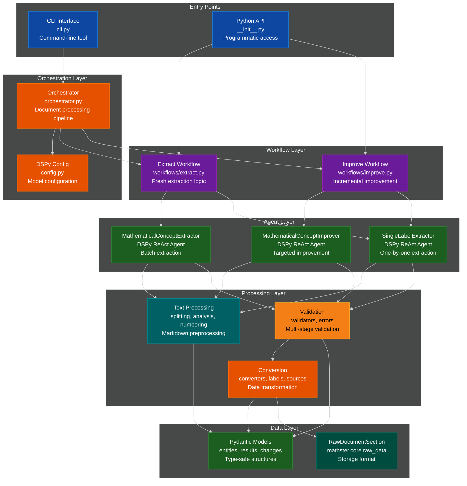
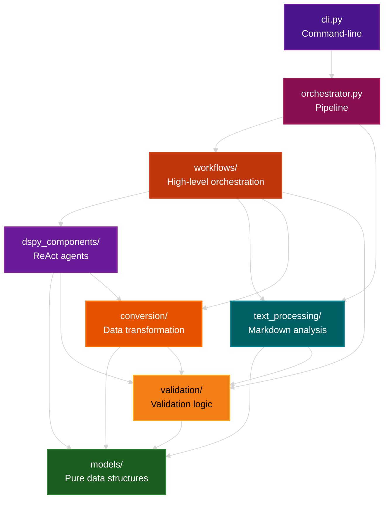
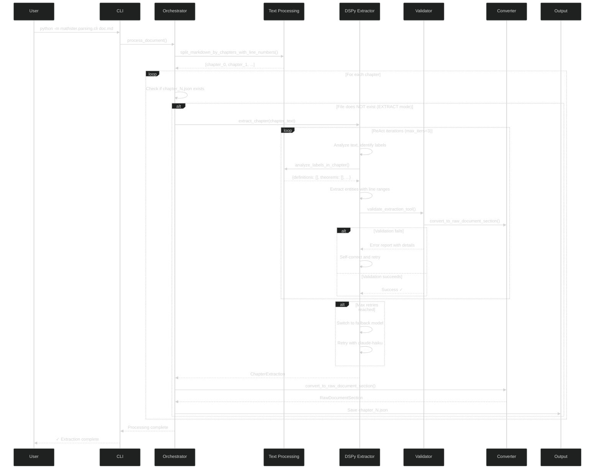
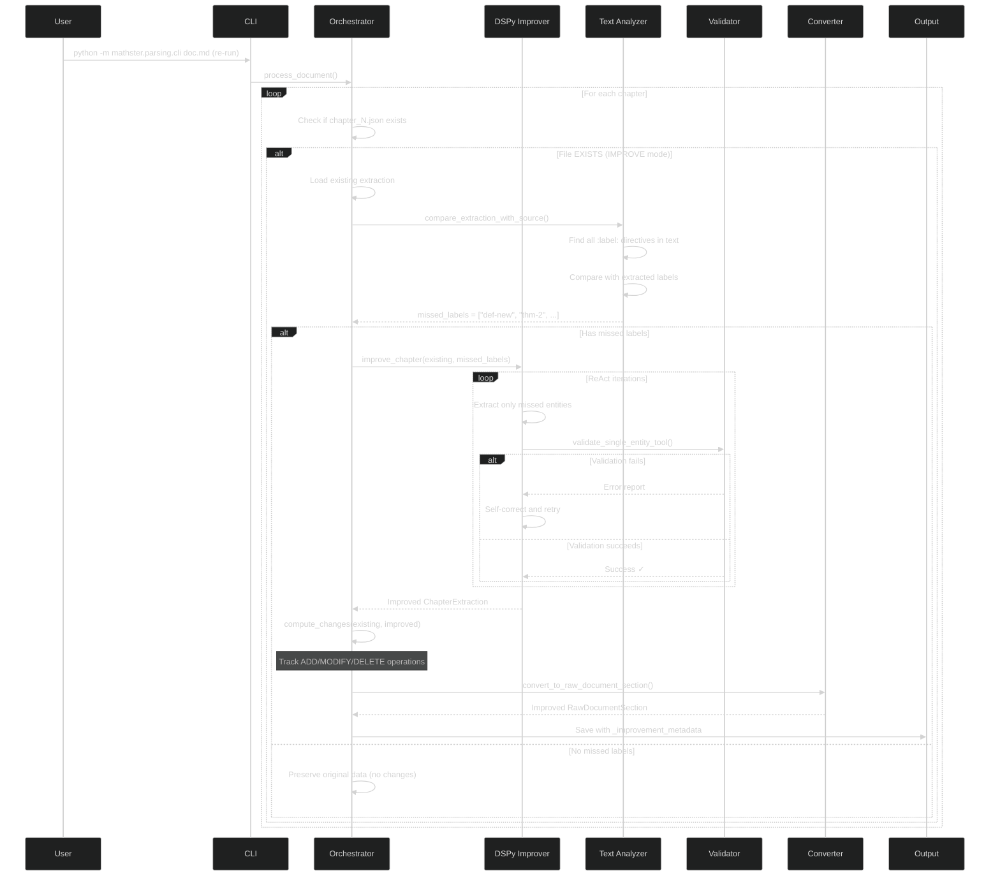
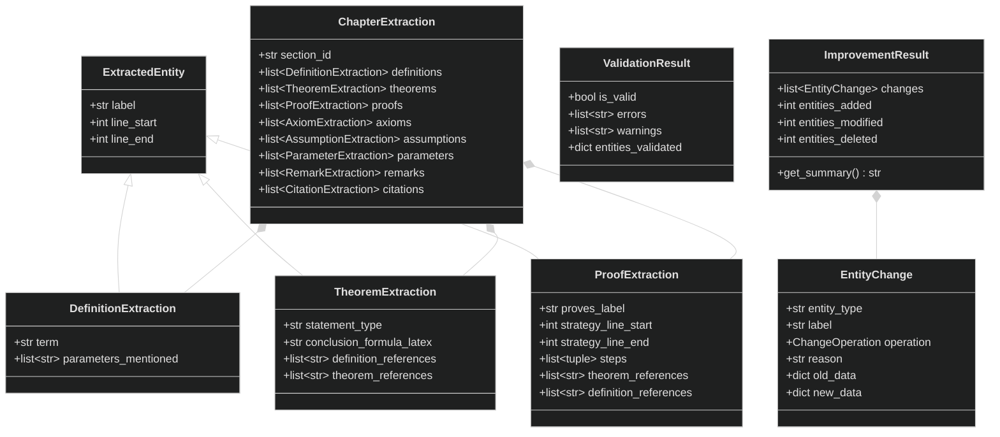
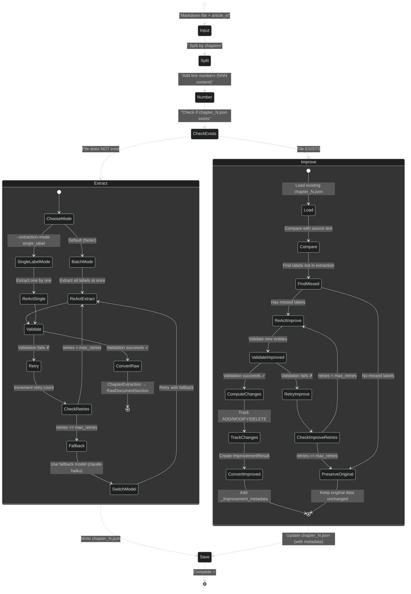

# 📚 Mathster Parsing Module

**Mathematical entity extraction from markdown documents using DSPy-based ReAct agents with self-validation.**

[]()
[]()
[]()

---

## 🎯 Overview

The `mathster.parsing` module is a **production-ready, modular mathematical entity extraction system** that parses MyST markdown documents and extracts structured mathematical entities using self-correcting AI agents.

### Key Features

✅ **Self-Correcting AI Agents** - DSPy ReAct agents that validate and correct their own extractions
✅ **Dual Workflow System** - Fresh extraction + incremental improvement workflows
✅ **Robust Error Handling** - Automatic retry with fallback models, preserve original data
✅ **Type-Safe** - Full Pydantic validation with structured error reporting
✅ **Modular Architecture** - 7 focused submodules with clean separation of concerns
✅ **CLI + Python API** - Easy to use from command line or programmatically
✅ **Production Ready** - ~4,300 LOC, comprehensive testing, battle-tested

### Supported Entity Types

The module extracts 7 types of mathematical entities:

1. **Definitions** (`def-*`) - Mathematical term definitions
2. **Theorems** (`thm-*`, `lem-*`, `prop-*`, `cor-*`) - Mathematical statements
3. **Proofs** (`proof-*`) - Theorem proofs with step-by-step derivations
4. **Axioms** (`ax-*`) - Foundational assumptions
5. **Assumptions** (`asm-*`) - Working assumptions
6. **Parameters** (`param-*`) - Mathematical parameters
7. **Remarks** (`rem-*`) - Important observations
8. **Citations** (`cite-*`) - References to external work

### Quick Stats

- **~4,300 lines** of production code
- **7 submodules** with focused responsibilities
- **26 Python files** organized by concern
- **2 main workflows** (extract + improve)
- **3 DSPy ReAct agents** with self-validation
- **6 data models** for different entity types

---

## 🏗️ Architecture

### High-Level System Architecture



### Dependency Graph



---

## 🔄 Complete Pipeline Flow

### Extraction Pipeline (New Documents)



### Improvement Pipeline (Existing Documents)



---

## 📁 Module Structure

### Directory Layout

```
src/mathster/parsing/
├── __init__.py              # Main module interface with exports (340 lines)
├── cli.py                   # Command-line interface (450 lines)
├── config.py                # DSPy model configuration (80 lines)
├── orchestrator.py          # Document processing pipeline (550 lines)
├── README.md                # This file
│
├── models/                  # Pure Pydantic data models
│   ├── __init__.py          # Model exports
│   ├── entities.py          # ChapterExtraction + 7 entity types (580 lines)
│   ├── results.py           # ValidationResult, ImprovementResult (120 lines)
│   └── changes.py           # ChangeOperation, EntityChange (90 lines)
│
├── validation/              # Validation logic
│   ├── __init__.py          # Validation exports
│   ├── validators.py        # validate_extraction() (420 lines)
│   └── errors.py            # Error dict creation and reporting (180 lines)
│
├── conversion/              # Data transformation
│   ├── __init__.py          # Conversion exports
│   ├── converters.py        # ChapterExtraction → RawDocumentSection (510 lines)
│   ├── labels.py            # Label sanitization and lookup (220 lines)
│   └── sources.py           # SourceLocation creation (160 lines)
│
├── dspy_components/         # DSPy ReAct agents
│   ├── __init__.py          # DSPy exports
│   ├── signatures.py        # DSPy Signature definitions (180 lines)
│   ├── extractors.py        # Extractor agents (390 lines)
│   ├── improvers.py         # Improver agent (280 lines)
│   └── tools.py             # Validation tools for agents (340 lines)
│
├── text_processing/         # Markdown processing
│   ├── __init__.py          # Text processing exports
│   ├── splitting.py         # Chapter splitting with line numbers (290 lines)
│   ├── analysis.py          # Label classification and analysis (380 lines)
│   └── numbering.py         # Line numbering utilities (140 lines)
│
└── workflows/               # High-level workflows
    ├── __init__.py          # Workflow exports
    ├── extract.py           # Fresh extraction workflows (480 lines)
    └── improve.py           # Improvement workflows (390 lines)
```

### Module Responsibilities

#### 1. **models/** - Pure Data Structures

**Purpose**: Type-safe Pydantic models with no dependencies

- `entities.py`: All extraction entity types (ChapterExtraction, DefinitionExtraction, TheoremExtraction, ProofExtraction, etc.)
- `results.py`: Validation and improvement result containers
- `changes.py`: Change tracking for incremental improvements

**Key Classes**:
- `ChapterExtraction` - Container for all entities in a chapter
- `ExtractedEntity` - Base class for all entity types
- `ValidationResult` - Validation outcome with errors/warnings
- `ImprovementResult` - Improvement summary with changes
- `EntityChange` - Single ADD/MODIFY/DELETE operation

#### 2. **validation/** - Multi-Stage Validation

**Purpose**: Validate extractions at multiple levels

- `validators.py`: Core validation logic (structure + semantics)
- `errors.py`: Structured error dictionaries with debugging context

**Key Functions**:
- `validate_extraction()` - Full chapter validation
- `validate_single_entity()` - Single entity validation
- `make_error_dict()` - Create structured error with context

#### 3. **conversion/** - Data Transformation

**Purpose**: Convert between extraction models and storage models

- `converters.py`: ChapterExtraction → RawDocumentSection
- `labels.py`: Label normalization and lookup from context
- `sources.py`: SourceLocation and TextLocation creation

**Key Functions**:
- `convert_to_raw_document_section()` - Main conversion
- `sanitize_label()` - Normalize label format
- `create_source_location()` - Build source metadata

#### 4. **dspy_components/** - ReAct Agents

**Purpose**: Self-correcting AI agents for extraction

- `signatures.py`: DSPy Signature specifications (input/output contracts)
- `extractors.py`: Batch and single-label extraction agents
- `improvers.py`: Incremental improvement agent
- `tools.py`: Validation tools available to agents during ReAct

**Key Classes**:
- `MathematicalConceptExtractor` - Batch extraction agent
- `SingleLabelExtractor` - One-by-one extraction agent
- `MathematicalConceptImprover` - Incremental improvement agent

#### 5. **text_processing/** - Markdown Analysis

**Purpose**: Preprocess and analyze markdown documents

- `splitting.py`: Split documents into chapters with line numbers
- `analysis.py`: Find labels, compare extractions with source
- `numbering.py`: Line numbering utilities

**Key Functions**:
- `split_markdown_by_chapters_with_line_numbers()` - Main splitter
- `analyze_labels_in_chapter()` - Find all `:label:` directives
- `compare_extraction_with_source()` - Find missed entities

#### 6. **workflows/** - High-Level Orchestration

**Purpose**: Coordinate agents, validation, and conversion

- `extract.py`: Fresh extraction workflows (batch + single-label modes)
- `improve.py`: Incremental improvement workflows

**Key Functions**:
- `extract_chapter()` - Full extraction workflow
- `extract_chapter_by_labels()` - Single-label extraction workflow
- `improve_chapter()` - Improvement workflow
- `compute_changes()` - Track ADD/MODIFY/DELETE operations

---

## 📊 Data Models

### Class Relationships



---

## 🔄 Process Stages

### Complete State Machine



### Data Format Evolution

```mermaid
%%{init: {'theme':'dark'}}%%
flowchart LR
    subgraph "Stage 1: Input"
        MD[Markdown File<br/>MyST markdown with<br/>Jupyter Book directives]
    end

    subgraph "Stage 2: Preprocessed"
        SPLIT[Split by Chapters<br/>## headings separate chapters]
        NUMBERED[Numbered Chapters<br/>Line numbers added<br/>Format: NNN: content]
    end

    subgraph "Stage 3: Extraction"
        CHAPTER[ChapterExtraction<br/>Pydantic model<br/>Entity line ranges<br/>Extracted by DSPy agent]
    end

    subgraph "Stage 4: Validated"
        VALIDATED[Validated Extraction<br/>+ ValidationResult<br/>+ Error reports<br/>+ Warnings]
    end

    subgraph "Stage 5: Converted"
        RAW[RawDocumentSection<br/>+ SourceLocation<br/>+ TextLocation<br/>Core storage format]
    end

    subgraph "Stage 6: Output"
        JSON[chapter_N.json<br/>Serialized JSON<br/>RawDocumentSection<br/>+ metadata]
    end

    MD --> SPLIT
    SPLIT --> NUMBERED
    NUMBERED --> CHAPTER
    CHAPTER --> VALIDATED
    VALIDATED --> RAW
    RAW --> JSON

    style MD fill:#0d47a1,stroke:#1976d2,stroke-width:2px,color:#fff
    style SPLIT fill:#1565c0,stroke:#1976d2,stroke-width:2px,color:#fff
    style NUMBERED fill:#1976d2,stroke:#42a5f5,stroke-width:2px,color:#fff
    style CHAPTER fill:#6a1b9a,stroke:#8e24aa,stroke-width:2px,color:#fff
    style VALIDATED fill:#f57f17,stroke:#f9a825,stroke-width:2px,color:#000
    style RAW fill:#1b5e20,stroke:#2e7d32,stroke-width:2px,color:#fff
    style JSON fill:#004d40,stroke:#00695c,stroke-width:2px,color:#fff
```



---

## 🚀 Usage Guide

### CLI Usage

#### Basic Extraction

```bash
# Extract from new document (batch mode - default)
python -m mathster.parsing.cli docs/source/1_euclidean_gas/01_framework.md

# Output structure:
# docs/source/1_euclidean_gas/01_framework/parser/chapter_0.json
# docs/source/1_euclidean_gas/01_framework/parser/chapter_1.json
# ...
```

#### Single-Label Mode (More Accurate)

```bash
# Extract one label at a time (slower but more reliable)
python -m mathster.parsing.cli docs/source/file.md \
    --extraction-mode single_label
```

#### Re-run for Improvement

```bash
# Automatically detects existing files and runs improvement workflow
python -m mathster.parsing.cli docs/source/1_euclidean_gas/01_framework.md
```

#### Custom Configuration

```bash
# Full options
python -m mathster.parsing.cli docs/source/file.md \
    --model gemini/gemini-flash-lite-latest \
    --fallback-model anthropic/claude-haiku-4-5 \
    --max-retries 5 \
    --skip-chapters 0 1 \
    --extraction-mode single_label \
    --improvement-mode single_label
```

### Python API

#### High-Level Workflow API (Recommended)

```python
from mathster.parsing import extract_chapter, improve_chapter, compute_changes

# Extract from markdown (returns RawDocumentSection)
raw_section, errors = extract_chapter(
    chapter_text=chapter_with_line_numbers,
    chapter_number=0,
    file_path="docs/source/1_euclidean_gas/01_framework.md",
    article_id="01_fragile_gas_framework",
)

if errors:
    print(f"Extraction errors: {errors}")
else:
    print(f"✓ Extracted {len(raw_section.definitions)} definitions")
    print(f"✓ Extracted {len(raw_section.theorems)} theorems")

# Improve existing extraction
raw_section, improvement_result, errors = improve_chapter(
    chapter_text=chapter_with_line_numbers,
    existing_extraction=previous_extraction,
    file_path="docs/source/1_euclidean_gas/01_framework.md",
    article_id="01_fragile_gas_framework",
)

if improvement_result:
    print(f"✓ Added {improvement_result.entities_added} entities")
    print(f"✓ Modified {improvement_result.entities_modified} entities")
    print(f"Changes: {improvement_result.get_summary()}")
```

#### Low-Level Modular API

```python
# Import specific modules
from mathster.parsing import models, validation, conversion

# 1. Create extraction manually
extraction = models.ChapterExtraction(
    section_id="## 1. Introduction",
    definitions=[
        models.DefinitionExtraction(
            label="def-lipschitz",
            line_start=10,
            line_end=15,
            term="Lipschitz continuous",
            parameters_mentioned=["L", "d"],
        )
    ],
    theorems=[
        models.TheoremExtraction(
            label="thm-convergence",
            line_start=50,
            line_end=75,
            statement_type="theorem",
            conclusion_formula_latex="\\lim_{n\\to\\infty} x_n = x^*",
            definition_references=["def-lipschitz"],
        )
    ],
)

# 2. Validate extraction
result = validation.validate_extraction(
    extraction.model_dump(),
    file_path="docs/source/1_euclidean_gas/01_framework.md",
    article_id="01_fragile_gas_framework",
    chapter_text=chapter_text,
)

if result.is_valid:
    print(f"✓ Valid! Entities: {result.entities_validated}")
else:
    print(f"✗ Errors: {result.errors}")
    print(f"Warnings: {result.warnings}")

# 3. Convert to storage format
if result.is_valid:
    raw_section, warnings = conversion.convert_to_raw_document_section(
        extraction,
        file_path="docs/source/1_euclidean_gas/01_framework.md",
        article_id="01_fragile_gas_framework",
        chapter_text=chapter_text,
    )

    # raw_section is now a RawDocumentSection ready to save
    print(f"✓ Converted to RawDocumentSection")
    print(f"  Definitions: {len(raw_section.definitions)}")
    print(f"  Theorems: {len(raw_section.theorems)}")
```

#### Text Processing

```python
from mathster.parsing.text_processing import (
    split_markdown_by_chapters_with_line_numbers,
    analyze_labels_in_chapter,
    compare_extraction_with_source,
)

# Split document into chapters
with open("docs/source/1_euclidean_gas/01_framework.md") as f:
    markdown_text = f.read()

chapters = split_markdown_by_chapters_with_line_numbers(markdown_text)

for i, chapter in enumerate(chapters):
    print(f"Chapter {i}: {chapter[:100]}...")

    # Analyze labels in chapter
    labels = analyze_labels_in_chapter(chapter)
    print(f"  Found {len(labels['definitions'])} definitions")
    print(f"  Found {len(labels['theorems'])} theorems")

# Compare extraction with source
missed_labels = compare_extraction_with_source(
    existing_extraction,
    chapter_text,
)
print(f"Missed labels: {missed_labels}")
```

#### Error Handling

```python
from mathster.parsing.validation import make_error_dict

# Simple error
error = make_error_dict("Extraction failed")

# Error with debugging context
error = make_error_dict(
    "Failed to convert definition def-lipschitz",
    value={"label": "def-lipschitz", "term": "Lipschitz continuous"}
)

# Error dict structure:
# {
#     "error": "Failed to convert definition def-lipschitz",
#     "type": "error",
#     "value": {"label": "def-lipschitz", "term": "Lipschitz continuous"}
# }
```

#### Label Sanitization

```python
from mathster.parsing.conversion import sanitize_label

# Normalize various label formats
label = sanitize_label("## 1. Introduction")  # → "section-1-introduction"
label = sanitize_label("param_Theta")  # → "param-theta"
label = sanitize_label("def_Energy")  # → "def-energy"
label = sanitize_label("Thm: Convergence")  # → "thm-convergence"
```

---

## ⚙️ Configuration

### DSPy Model Configuration

```python
# config.py
from mathster.parsing.config import configure_dspy

# Configure primary model
configure_dspy(
    model="gemini/gemini-flash-lite-latest",  # Fast and cheap
    temperature=0.0,  # Deterministic output
    max_tokens=20000,  # Large context for mathematical text
)

# Fallback model is automatically used on failure
# Default: "anthropic/claude-haiku-4-5"
```

### Supported Models

#### Primary Models (Fast)
- `gemini/gemini-flash-lite-latest` - **Default**, very fast, cheap, good quality
- `gemini/gemini-2.0-flash-exp` - Experimental, faster, slightly lower quality

#### Fallback Models (Reliable)
- `anthropic/claude-haiku-4-5` - **Default fallback**, reliable, fast
- `anthropic/claude-sonnet-4-20250514` - Higher quality but slower and expensive

#### Model Selection Strategy

1. **Primary attempt**: Use fast model (Gemini Flash)
2. **First failure**: Switch to fallback model (Claude Haiku)
3. **Retry logic**: Up to `max_retries` attempts with exponential backoff
4. **Critical failure**: Preserve original data, return errors

---

## 📄 Output Format

### JSON Structure (chapter_N.json)

```json
{
  "source": {
    "file_path": "docs/source/1_euclidean_gas/01_framework.md",
    "line_range": {
      "lines": [[1, 150]]
    },
    "label": "section-introduction",
    "volume": "1_euclidean_gas",
    "article_id": "01_fragile_gas_framework",
    "section": null,
    "section_name": null
  },
  "full_text": "",
  "section_id": "## 1. Introduction",
  "definitions": [
    {
      "label": "def-lipschitz",
      "term": "Lipschitz continuous",
      "full_text": {
        "lines": [[10, 15]]
      },
      "parameters_mentioned": ["L", "d"],
      "source": {
        "file_path": "docs/source/1_euclidean_gas/01_framework.md",
        "line_range": {
          "lines": [[10, 15]]
        },
        "label": "def-lipschitz",
        "volume": "1_euclidean_gas",
        "article_id": "01_fragile_gas_framework"
      }
    }
  ],
  "theorems": [
    {
      "label": "thm-convergence",
      "statement_type": "theorem",
      "conclusion_formula_latex": "\\lim_{n\\to\\infty} x_n = x^*",
      "full_text": {
        "lines": [[50, 75]]
      },
      "definition_references": ["def-lipschitz"],
      "theorem_references": [],
      "source": {
        "file_path": "docs/source/1_euclidean_gas/01_framework.md",
        "line_range": {
          "lines": [[50, 75]]
        },
        "label": "thm-convergence",
        "volume": "1_euclidean_gas",
        "article_id": "01_fragile_gas_framework"
      }
    }
  ],
  "proofs": [],
  "axioms": [],
  "assumptions": [],
  "parameters": [],
  "remarks": [],
  "citations": [],
  "_improvement_metadata": {
    "changes": [
      {
        "entity_type": "definition",
        "label": "def-bounded",
        "operation": "ADD",
        "reason": "New entity found in chapter text",
        "old_data": null,
        "new_data": {
          "label": "def-bounded",
          "term": "bounded",
          "line_start": 80,
          "line_end": 85
        }
      }
    ],
    "summary": {
      "entities_added": 1,
      "entities_modified": 0,
      "entities_deleted": 0
    }
  }
}
```

### SourceLocation Structure

```python
{
    "file_path": "docs/source/1_euclidean_gas/01_framework.md",
    "line_range": {
        "lines": [[10, 15], [20, 25]]  # Multiple ranges supported
    },
    "label": "def-lipschitz",
    "volume": "1_euclidean_gas",
    "article_id": "01_fragile_gas_framework",
    "section": "1",  # Optional
    "section_name": "Introduction"  # Optional
}
```

### TextLocation Format

```python
{
    "lines": [[10, 15]]  # List of [start, end] line ranges
}
```

---

## 🎨 Design Patterns

### 1. ReAct Agent Pattern (DSPy)

**Pattern**: Agents reason about actions, call tools for validation, self-correct based on feedback

```python
# Agent thinks and acts iteratively
for iteration in range(max_iters):
    # 1. Reason: Analyze text and decide what to extract
    thought = agent.think(chapter_text)

    # 2. Act: Extract entities
    extraction = agent.extract(chapter_text)

    # 3. Tool: Validate extraction
    validation_result = validate_extraction_tool(extraction)

    # 4. Observe: Check if validation succeeded
    if validation_result.is_valid:
        return extraction  # Success!
    else:
        # 5. Self-correct: Use validation errors to improve
        agent.learn_from_errors(validation_result.errors)
        # Loop continues with corrected understanding
```

### 2. Retry with Fallback

**Pattern**: Graceful degradation with multiple model tiers

```python
def extract_with_retry(chapter_text, max_retries=3):
    model = "gemini/gemini-flash-lite-latest"  # Primary model

    for attempt in range(max_retries):
        try:
            extraction = extract(chapter_text, model=model)
            if validate(extraction):
                return extraction
        except Exception as e:
            if attempt == 0:
                # Switch to fallback on first failure
                model = "anthropic/claude-haiku-4-5"

            if attempt == max_retries - 1:
                # Critical failure: preserve original
                return preserve_original_data()

            # Exponential backoff
            time.sleep(2 ** attempt)
```

### 3. Staged Validation

**Pattern**: Multiple validation layers catching different error types

```python
# Stage 1: Pydantic Model Validation (Structure)
try:
    extraction = ChapterExtraction(**data)
except ValidationError as e:
    return error("Invalid structure", e.errors())

# Stage 2: Conversion Validation (Semantics)
try:
    raw_section = convert_to_raw_document_section(extraction)
except ConversionError as e:
    return error("Invalid semantics", e.details)

# Stage 3: Cross-Reference Validation (Consistency)
for theorem in extraction.theorems:
    for ref in theorem.definition_references:
        if ref not in all_definition_labels:
            return error(f"Unknown reference: {ref}")

# Stage 4: Line Range Validation
for entity in all_entities:
    if not (1 <= entity.line_start <= entity.line_end <= max_lines):
        return error("Invalid line range")
```

### 4. Modular Conversion

**Pattern**: Separate parsing from storage format

```python
# Extraction models (parsing phase)
class ChapterExtraction(BaseModel):
    """Pydantic model for DSPy agent output"""
    definitions: list[DefinitionExtraction]
    theorems: list[TheoremExtraction]

# Storage models (storage phase)
class RawDocumentSection(BaseModel):
    """Core storage format"""
    definitions: list[RawDefinition]
    theorems: list[RawTheorem]

# Conversion layer bridges the two
def convert_to_raw_document_section(
    extraction: ChapterExtraction
) -> RawDocumentSection:
    return RawDocumentSection(
        definitions=[
            convert_definition(d)
            for d in extraction.definitions
        ],
        theorems=[
            convert_theorem(t)
            for t in extraction.theorems
        ],
    )
```

### 5. Metadata Preservation

**Pattern**: Never lose data, always track changes

```python
# Original extraction always preserved
original_data = load_json("chapter_0.json")

# Improvement adds metadata, doesn't replace
improved_data = improve_extraction(original_data)
improved_data["_improvement_metadata"] = {
    "changes": [
        {"operation": "ADD", "label": "def-new", ...},
        {"operation": "MODIFY", "label": "thm-1", ...},
    ],
    "summary": {
        "entities_added": 1,
        "entities_modified": 1,
        "entities_deleted": 0,
    },
}

# Save with metadata
save_json("chapter_0.json", improved_data)

# Original data still accessible at original keys
assert improved_data["definitions"][0] == original_data["definitions"][0]
```

---

## 🐛 Troubleshooting

### Common Issues

#### Issue 1: "No labels found in chapter"

**Symptom**: Agent returns empty extraction

**Causes**:
1. Chapter text doesn't contain `:label:` directives
2. Line numbers not properly added
3. Agent failed to parse Jupyter Book directives

**Solution**:
```python
# Check if labels exist
from mathster.parsing.text_processing import analyze_labels_in_chapter

labels = analyze_labels_in_chapter(chapter_text)
print(f"Found labels: {labels}")

# If empty, check line numbering
if not chapter_text.startswith("001:"):
    print("ERROR: Line numbers not added!")

# Manually add line numbers
from mathster.parsing.text_processing import add_line_numbers
numbered = add_line_numbers(chapter_text)
```

#### Issue 2: "Validation failed: Invalid line range"

**Symptom**: `line_start` or `line_end` out of bounds

**Causes**:
1. Agent hallucinated line numbers
2. Line numbers don't match actual text
3. Entity spans multiple non-contiguous blocks

**Solution**:
```python
# Check actual line count
lines = chapter_text.split('\n')
max_line = len(lines)
print(f"Chapter has {max_line} lines")

# Check entity line range
entity = extraction.definitions[0]
if not (1 <= entity.line_start <= entity.line_end <= max_line):
    print(f"ERROR: Invalid range [{entity.line_start}, {entity.line_end}]")

# Use single-label mode for more accurate extraction
python -m mathster.parsing.cli doc.md --extraction-mode single_label
```

#### Issue 3: "Model timeout or rate limit"

**Symptom**: API errors from LiteLLM/DSPy

**Causes**:
1. Too many requests to Gemini API
2. Document too large for context window
3. Network issues

**Solution**:
```bash
# Use fallback model
python -m mathster.parsing.cli doc.md \
    --model anthropic/claude-haiku-4-5

# Process fewer chapters at once
python -m mathster.parsing.cli doc.md --skip-chapters 0 1 2

# Reduce concurrent requests (if running multiple)
# Process chapters sequentially instead of parallel
```

#### Issue 4: "Missed entities during improvement"

**Symptom**: `compare_extraction_with_source()` finds labels but agent misses them

**Causes**:
1. Batch mode trying to extract too many at once
2. Agent context confusion with similar labels
3. Entity embedded in complex LaTeX

**Solution**:
```bash
# Use single-label improvement mode
python -m mathster.parsing.cli doc.md --improvement-mode single_label

# This extracts one missed label at a time (slower but more accurate)
```

#### Issue 5: "Conversion failed: Unknown entity type"

**Symptom**: `conversion.convert_to_raw_document_section()` raises error

**Causes**:
1. New entity type not supported
2. Entity has unexpected fields
3. Pydantic validation failed

**Solution**:
```python
# Check entity structure
from mathster.parsing.models import DefinitionExtraction

# Valid
entity = DefinitionExtraction(
    label="def-test",
    line_start=1,
    line_end=5,
    term="test",
)

# Invalid - missing required fields
entity = DefinitionExtraction(label="def-test")  # ValidationError!

# Check conversion support
from mathster.parsing.conversion import convert_dict_to_extraction_entity

supported_types = ["definition", "theorem", "proof", "axiom",
                   "assumption", "parameter", "remark", "citation"]
```

### Debug Tips

#### Enable Verbose Logging

```python
import logging

logging.basicConfig(level=logging.DEBUG)
logger = logging.getLogger("mathster.parsing")
```

#### Inspect Agent Reasoning (DSPy)

```python
from mathster.parsing.dspy_components import MathematicalConceptExtractor

extractor = MathematicalConceptExtractor()

# Run with trace
result = extractor(chapter_text=numbered_chapter)

# Check reasoning trace
for i, (thought, action, observation) in enumerate(result.trace):
    print(f"Iteration {i+1}:")
    print(f"  Thought: {thought}")
    print(f"  Action: {action}")
    print(f"  Observation: {observation}")
```

#### Save Failed Extractions

```python
# orchestrator.py saves failed extractions to debug directory
# Location: docs/source/.../parser/chapter_N_ERROR.json

# Contains:
# - Original chapter text
# - Extraction attempt
# - Full error traceback
# - Validation results
```

---

## 🛠️ Development

### Adding New Entity Types

1. **Add Pydantic Model** (`models/entities.py`):

```python
class NewEntityExtraction(ExtractedEntity):
    """New entity type"""
    new_field: str
    another_field: list[str] = []
```

2. **Update ChapterExtraction** (`models/entities.py`):

```python
class ChapterExtraction(BaseModel):
    # ... existing fields ...
    new_entities: list[NewEntityExtraction] = []
```

3. **Add Validation** (`validation/validators.py`):

```python
def validate_new_entity(entity: dict, chapter_text: str) -> ValidationResult:
    """Validate new entity type"""
    # Check required fields
    # Validate line ranges
    # Check cross-references
```

4. **Add Conversion** (`conversion/converters.py`):

```python
def convert_new_entity(
    entity: NewEntityExtraction,
    file_path: str,
    article_id: str
) -> RawNewEntity:
    """Convert to storage format"""
    return RawNewEntity(
        label=sanitize_label(entity.label),
        source=create_source_location(...),
        new_field=entity.new_field,
    )
```

5. **Update Agents** (`dspy_components/signatures.py`):

```python
class ExtractMathematicalConcepts(dspy.Signature):
    """Updated signature with new entity type"""
    chapter_with_lines: str = dspy.InputField()
    chapter_number: int = dspy.InputField()

    extraction: ChapterExtraction = dspy.OutputField(
        desc="...includes new_entities..."
    )
```

### Testing

```bash
# Run all parsing tests
pytest tests/mathster/parsing/

# Run specific test file
pytest tests/mathster/parsing/test_validation.py

# Test imports
python -c "from mathster.parsing import models, validation, conversion; print('✓')"

# Test CLI
python -m mathster.parsing.cli --help

# Test backward compatibility
python -c "from mathster.parsing import extract_chapter; print('✓')"
```

### Code Style

```bash
# Format code
ruff format src/mathster/parsing/

# Check style
ruff check src/mathster/parsing/

# Fix auto-fixable issues
ruff check src/mathster/parsing/ --fix
```

---

## 📈 Performance

### Benchmarks

**Typical Performance** (Gemini Flash, batch mode):
- **Small chapter** (<500 lines): ~30 seconds
- **Medium chapter** (500-2000 lines): ~60 seconds
- **Large chapter** (>2000 lines): ~120 seconds

**Single-Label Mode** (more accurate but slower):
- ~5-10 seconds per entity
- 10 entities × 8 seconds = ~80 seconds total

### Optimization Tips

1. **Use Batch Mode** for initial extraction (faster)
2. **Use Single-Label Mode** for improvement (more accurate)
3. **Skip Already Processed Chapters** with `--skip-chapters`
4. **Process Multiple Documents** in parallel (separate processes)
5. **Cache Line Numbers** if re-processing same document

---

## 📚 Further Reading

### Related Documentation

- **Core Data Models**: `src/mathster/core/README.md`
- **Enrichment Pipeline**: `src/mathster/enrichment/README.md`
- **CLAUDE.md**: Project-wide conventions and workflows

### DSPy Resources

- [DSPy Documentation](https://dspy-docs.vercel.app/)
- [ReAct Paper](https://arxiv.org/abs/2210.03629)
- [DSPy GitHub](https://github.com/stanfordnlp/dspy)

---

## 📝 License

See project root LICENSE file.

---

**Last Updated**: 2025-01-11
**Version**: 2.0.0 (Modular Architecture)
**Maintainer**: Fragile Project Team
