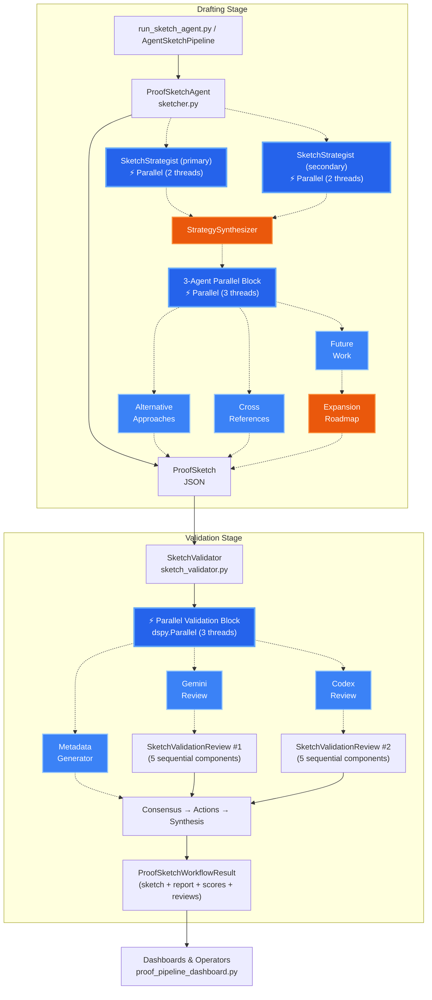

## Proof Sketcher Pipeline

This package automates the full life cycle for Fragile proof sketches. It drafts a structured sketch from theorem metadata, orchestrates a dual-review validation, and returns an action plan operators can trust.

### What the Pipeline Does
- `sketch_pipeline.ProofSketcherAgent` is the top-level orchestrator used by the CLI. It receives theorem context (label, statement, origin doc, status) and coordinates drafting plus validation with a single call.
- Drafting happens inside `sketcher.ProofSketchAgent`, which assembles a `ProofSketch` object. It leans on `SketchStrategist` helpers to retrieve label data, map dependencies, produce alternative strategies, and expand the roadmap/checklist sections required by `agent_schemas/sketch.json`.
- Validation is handled by `sketch_validator.SketchValidator`. It spins up two independent `SketchRefereeAgent` reviewers (Gemini + Codex personas from `sketch_referee_analysis.py`) that audit completeness, logical flow, dependency hygiene, and technical deep dives.
- The validator aggregates reviewer JSON into a `SketchValidationReport` plus numeric `Scores`. The report contains metadata, embedded reviews, a consensus analysis, and a prioritized action plan so operators know whether to promote the sketch to expansion.
- CLI entry points such as `run_sketch_agent.py`, `run_sketch_validator.py`, and `run_sketch_agent --pipeline` invoke these modules, while dashboards (for example `proof_pipeline_dashboard.py`) read the resulting report artifacts.

### Module Interaction Diagram

Use this diagram as a map when wiring new tools into the pipeline: add drafting logic by extending `ProofSketchAgent`, plug additional referee agents into `SketchValidator`, or surface new metrics by enriching the `Scores` model that the dashboards consume.

### DSPy Module Workflow Diagram

The data pipeline below decomposes every `dspy.Module` participating in the workflow. Read it left-to-right to see how orchestrators call sub-agents, how each component produces structured artifacts, and how the validator fuses dual referee reviews into a publishable report with quantitative scores.

```mermaid
flowchart TB
    CLI["CLI Entrypoints<br/>(run_sketch_agent.py, run_sketch_validator.py, mathster CLI)"] --> PSW["AgentSketchPipeline<br/>(dspy.Module orchestrator)"]

    subgraph Drafting["Drafting Stage — ProofSketchAgent (dspy.Module) — 12 Steps with 2 Parallel Blocks"]
        direction TB
        PSW --> PSA["ProofSketchAgent<br/>(sketcher.py)"]

        PSA -->|"Step 1"| Statement["ProofStatementAgent<br/>(dspy.ChainOfThought)"]

        Statement -->|"Steps 2-3"| Parallel1["⚡ dspy.Parallel(num_threads=2)"]

        subgraph ParallelStrat["Parallel Strategy Generation"]
            direction LR
            Strat1["SketchStrategist (primary)<br/>Classical techniques focus"]
            Strat2["SketchStrategist (secondary)<br/>Fragile Gas theory focus"]
        end

        Parallel1 -.-> ParallelStrat
        ParallelStrat -.-> Synth["StrategySynthesizer<br/>(dspy.ChainOfThought)<br/>Step 4"]

        Synth -->|"Step 5"| Deps["DependencyLedgerAgent<br/>(dspy.ReAct + 4 tools)"]
        Deps -->|"Step 6"| Proof["DetailedProofAgent<br/>(dspy.ChainOfThought)"]
        Proof -->|"Step 7"| DeepDive["TechnicalDeepDiveAgent<br/>(dspy.ChainOfThought)"]
        DeepDive -->|"Step 8"| Checklist["ValidationChecklistAgent<br/>(dspy.Predict)"]

        Checklist -->|"Steps 9-11"| Parallel3["⚡ dspy.Parallel(num_threads=3)"]

        subgraph ParallelFinal["Parallel Final Agents"]
            direction LR
            Alt["AlternativeApproachesAgent<br/>(dspy.ChainOfThought)"]
            Future["FutureWorkAgent<br/>(dspy.ChainOfThought)"]
            Cross["CrossReferencesAgent<br/>(dspy.ChainOfThought)"]
        end

        Parallel3 -.-> ParallelFinal
        ParallelFinal -.-> Roadmap["ExpansionRoadmapAgent<br/>(dspy.ChainOfThought)<br/>Step 12"]

        Alt -.-> Assembler["ProofSketch Assembly"]
        Future -.-> Roadmap
        Cross -.-> Assembler
        Roadmap --> Assembler

        Assembler --> Sketch["ProofSketch<br/>(dict with 13 components)"]

        style Parallel1 fill:#2563eb,stroke:#60a5fa,stroke-width:3px,color:#fff
        style ParallelStrat fill:#2563eb,stroke:#60a5fa,stroke-width:2px,color:#fff
        style Strat1 fill:#3b82f6,stroke:#93c5fd,stroke-width:2px,color:#fff
        style Strat2 fill:#3b82f6,stroke:#93c5fd,stroke-width:2px,color:#fff
        style Parallel3 fill:#2563eb,stroke:#60a5fa,stroke-width:3px,color:#fff
        style ParallelFinal fill:#2563eb,stroke:#60a5fa,stroke-width:2px,color:#fff
        style Alt fill:#3b82f6,stroke:#93c5fd,stroke-width:2px,color:#fff
        style Future fill:#3b82f6,stroke:#93c5fd,stroke-width:2px,color:#fff
        style Cross fill:#3b82f6,stroke:#93c5fd,stroke-width:2px,color:#fff
    end

    Sketch --> Validator["SketchValidator<br/>(dspy.Module)"]

    subgraph Validation["Validation Stage — SketchValidator (dspy.Module)"]
        direction TB

        Validator --> Parallel2["⚡ dspy.Parallel(num_threads=3)"]

        subgraph ParallelValidation["Parallel Validation: Metadata + 2 Reviews (run in parallel)"]
            direction LR
            Metadata["Metadata Generator<br/>(dspy.Predict)"]
            GeminiReview["Gemini Review Pipeline<br/>(5 sequential agents)"]
            CodexReview["Codex Review Pipeline<br/>(5 sequential agents)"]
        end

        Parallel2 -.-> ParallelValidation

        subgraph Gemini["Gemini Review — Sequential Components (run within parallel thread)"]
            direction TB
            GeminiReview --> CompG["1. CompletenessCorrectnessAgent<br/>(dspy.Predict + BaseAgent)"]
            CompG --> FlowG["2. AgentLogicalFlowValidation<br/>(dspy.ChainOfThought + BaseAgent)"]
            FlowG --> DepG["3. AgentDependencyValidation<br/>(dspy.ChainOfThought + BaseAgent)"]
            DepG --> TechG["4. AgentTechnicalDeepDiveValidation<br/>(dspy.Predict + BaseAgent)"]
            TechG --> OverallG["5. AgentOverallAssessment<br/>(dspy.Predict + BaseAgent)"]
            OverallG --> ReviewG["SketchValidationReview #1"]
        end

        subgraph Codex["Codex Review — Sequential Components (run within parallel thread)"]
            direction TB
            CodexReview --> CompC["1. CompletenessCorrectnessAgent<br/>(dspy.Predict + BaseAgent)"]
            CompC --> FlowC["2. AgentLogicalFlowValidation<br/>(dspy.ChainOfThought + BaseAgent)"]
            FlowC --> DepC["3. AgentDependencyValidation<br/>(dspy.ChainOfThought + BaseAgent)"]
            DepC --> TechC["4. AgentTechnicalDeepDiveValidation<br/>(dspy.Predict + BaseAgent)"]
            TechC --> OverallC["5. AgentOverallAssessment<br/>(dspy.Predict + BaseAgent)"]
            OverallC --> ReviewC["SketchValidationReview #2"]
        end

        ReviewG --> Consensus["Consensus Analysis<br/>(dspy.ChainOfThought)"]
        ReviewC --> Consensus
        Consensus --> Actions["Actionable Items<br/>(dspy.ChainOfThought)"]
        Actions --> Synthesis["Synthesis & Action Plan<br/>(dspy.ChainOfThought)"]

        Metadata -.-> ReportBuilder["Report Assembly<br/>(dspy.Predict)"]
        Synthesis --> ReportBuilder
        ReportBuilder --> Report["SketchValidationReport"]

        ReviewG --> ScoreExtract["Score Extraction"]
        ReviewC --> ScoreExtract
        Report --> ScoreExtract
        ScoreExtract --> Scores["Scores<br/>(41+ metrics)"]

        style Parallel2 fill:#2563eb,stroke:#60a5fa,stroke-width:3px,color:#fff
        style ParallelValidation fill:#2563eb,stroke:#60a5fa,stroke-width:2px,color:#fff
        style Metadata fill:#3b82f6,stroke:#93c5fd,stroke-width:2px,color:#fff
        style GeminiReview fill:#3b82f6,stroke:#93c5fd,stroke-width:2px,color:#fff
        style CodexReview fill:#3b82f6,stroke:#93c5fd,stroke-width:2px,color:#fff
        style Gemini fill:#059669,stroke:#10b981,stroke-width:2px,color:#fff
        style Codex fill:#7c3aed,stroke:#8b5cf6,stroke-width:2px,color:#fff
    end

    Report --> Result["ProofSketchWorkflowResult<br/>(sketch + report + scores + reviews)"]
    Scores --> Result
    Sketch -.-> Result

    Result --> Dashboard["Dashboards & Operators<br/>(proof_pipeline_dashboard.py, report viewers)"]
```

This workflow diagram doubles as a dependency checklist: when instrumenting new DSPy agents, add them near the relevant cluster (drafting, referee analysis, consensus, or synthesis) so downstream dashboards automatically benefit from their outputs.
