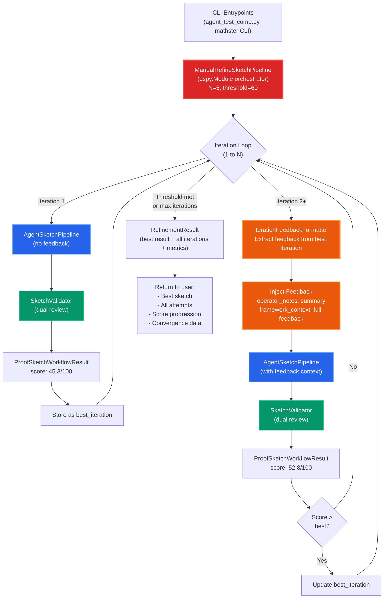
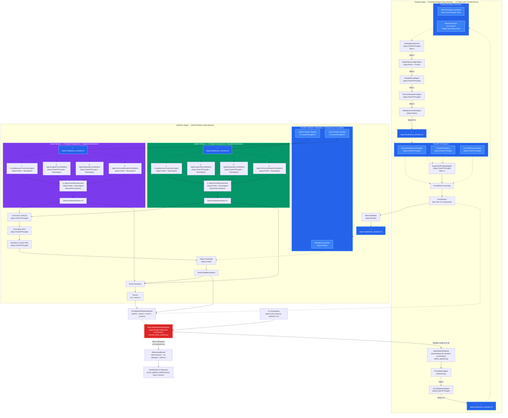

## Proof Sketcher Pipeline

This package automates the full life cycle for Fragile proof sketches with **iterative refinement**. It drafts structured sketches from theorem metadata, orchestrates dual-review validation, and **automatically improves sketches based on feedback** from previous iterations.

### What the Pipeline Does
- `manual_refine_pipeline.ManualRefineSketchPipeline` is the top-level orchestrator that runs up to N iterations, injecting feedback from the best previous attempt to progressively improve sketch quality.
- Each iteration uses `sketch_pipeline.AgentSketchPipeline` to generate a sketch and validate it with dual reviews.
- Drafting happens inside `sketcher.ProofSketchAgent`, which assembles a `ProofSketch` object by coordinating 12 sub-agents across 2 parallel blocks, leveraging `SketchStrategist` helpers to retrieve label data, map dependencies, and produce alternative strategies.
- Validation is handled by `sketch_validator.SketchValidator`, which runs two independent `SketchRefereeAgent` reviewers (Gemini + Codex from `sketch_referee_analysis.py`) in parallel to audit completeness, logical flow, dependency hygiene, and technical deep dives.
- After validation, `feedback_formatter.IterationFeedbackFormatter` extracts actionable feedback (scores, errors, gaps, specific fix suggestions) and injects it into the next iteration's context.
- The validator aggregates reviews into a `SketchValidationReport` plus numeric `Scores`, enabling the refinement loop to track progress and decide when to stop (threshold met or max iterations).
- CLI entry points such as `agent_test_comp.py` and dashboards (e.g., `proof_pipeline_dashboard.py`) invoke these modules and read the resulting refinement artifacts.

### Refinement Loop Architecture

The proof sketcher uses an iterative refinement loop that learns from previous attempts:



**Key Features:**
- **Iteration 1**: Baseline sketch with no prior feedback
- **Iteration 2+**: Receives detailed feedback from best previous attempt
- **Feedback Content**: Score breakdowns, action items, errors, gaps, specific fix suggestions
- **Injection Points**: Brief summary → `operator_notes`, full feedback → `framework_context`
- **Stopping Conditions**: Score ≥ threshold OR max iterations reached
- **Result**: Best sketch + full iteration history + convergence metrics

### Module Interaction Diagram

```mermaid
graph TD
    CLI["CLI Entrypoints<br/>(agent_test_comp.py, mathster CLI)"] --> MRP["ManualRefineSketchPipeline<br/>(refinement orchestrator)<br/>manual_refine_pipeline.py"]

    MRP --> IterLoop{{"Iteration Loop<br/>(up to N iterations)"}}

    IterLoop -->|"Each Iteration"| CheckFeedback{{"Has Best<br/>Iteration?"}}

    CheckFeedback -->|"No (Iteration 1)"| ASP["AgentSketchPipeline<br/>(per-iteration pipeline)<br/>sketch_pipeline.py"]
    CheckFeedback -->|"Yes (Iteration 2+)"| FeedbackExt["IterationFeedbackFormatter<br/>feedback_formatter.py"]

    FeedbackExt -->|"Extract & Format"| FeedbackInject["Inject Feedback<br/>operator_notes: summary<br/>framework_context: full feedback"]
    FeedbackInject --> ASP

    subgraph "Drafting Stage (within AgentSketchPipeline)"
        ASP --> PSA["ProofSketchAgent<br/>sketcher.py"]
        PSA --> Sketch["ProofSketch<br/>JSON"]
        PSA -.-> D1["SketchStrategist (primary)<br/>⚡ Parallel (2 threads)"]
        PSA -.-> D2["SketchStrategist (secondary)<br/>⚡ Parallel (2 threads)"]
        D1 -.-> D3["StrategySynthesizer"]
        D2 -.-> D3
        D3 -.-> D4["3-Agent Parallel Block<br/>⚡ Parallel (3 threads)"]
        D4 -.-> D5["Alternative<br/>Approaches"]
        D4 -.-> D6["Future<br/>Work"]
        D4 -.-> D7["Cross<br/>References"]
        D5 -.-> Sketch
        D6 -.-> D8["Expansion<br/>Roadmap"]
        D7 -.-> Sketch
        D8 -.-> Sketch

        style D1 fill:#2563eb,stroke:#60a5fa,stroke-width:3px,color:#fff
        style D2 fill:#2563eb,stroke:#60a5fa,stroke-width:3px,color:#fff
        style D3 fill:#ea580c,stroke:#fb923c,stroke-width:2px,color:#fff
        style D4 fill:#2563eb,stroke:#60a5fa,stroke-width:3px,color:#fff
        style D5 fill:#3b82f6,stroke:#93c5fd,stroke-width:2px,color:#fff
        style D6 fill:#3b82f6,stroke:#93c5fd,stroke-width:2px,color:#fff
        style D7 fill:#3b82f6,stroke:#93c5fd,stroke-width:2px,color:#fff
        style D8 fill:#ea580c,stroke:#fb923c,stroke-width:2px,color:#fff
    end

    subgraph "Validation Stage (within AgentSketchPipeline)"
        Sketch --> Val["SketchValidator<br/>sketch_validator.py"]
        Val --> VP["⚡ Parallel Validation Block<br/>dspy.Parallel (3 threads)"]

        VP -.-> M["Metadata<br/>Generator"]
        VP -.-> F1["Gemini<br/>Review"]
        VP -.-> F2["Codex<br/>Review"]

        M -.-> Consensus
        F1 -.-> G["SketchValidationReview #1<br/>(5 sequential components)"]
        F2 -.-> H["SketchValidationReview #2<br/>(5 sequential components)"]
        G --> Consensus["Consensus → Actions → Synthesis"]
        H --> Consensus
        Consensus --> Result["ProofSketchWorkflowResult<br/>(sketch + report + scores + reviews)"]

        style VP fill:#2563eb,stroke:#60a5fa,stroke-width:3px,color:#fff
        style M fill:#3b82f6,stroke:#93c5fd,stroke-width:2px,color:#fff
        style F1 fill:#3b82f6,stroke:#93c5fd,stroke-width:2px,color:#fff
        style F2 fill:#3b82f6,stroke:#93c5fd,stroke-width:2px,color:#fff
    end

    Result --> ScoreCheck{{"Score ≥ Best<br/>OR Threshold?"}}
    ScoreCheck -->|"Continue"| IterLoop
    ScoreCheck -->|"Done"| FinalResult["RefinementResult<br/>(best iteration + all attempts + metrics)"]

    FinalResult --> Dashboard["Dashboards & Operators<br/>proof_pipeline_dashboard.py"]

    style MRP fill:#dc2626,stroke:#ef4444,stroke-width:3px,color:#fff
    style FeedbackExt fill:#ea580c,stroke:#fb923c,stroke-width:3px,color:#fff
    style FeedbackInject fill:#ea580c,stroke:#fb923c,stroke-width:2px,color:#fff
    style ASP fill:#2563eb,stroke:#60a5fa,stroke-width:3px,color:#fff
```



Use this diagram as a map when wiring new tools into the pipeline: add drafting logic by extending `ProofSketchAgent`, plug additional referee agents into `SketchValidator`, inject feedback by enriching `IterationFeedbackFormatter`, or surface new metrics by extending the `Scores` model that the dashboards consume.

### DSPy Module Workflow Diagram

The data pipeline below decomposes every `dspy.Module` participating in the workflow. Read it left-to-right to see how orchestrators call sub-agents, how each component produces structured artifacts, and how the validator fuses dual referee reviews into a publishable report with quantitative scores.



This workflow diagram doubles as a dependency checklist: when instrumenting new DSPy agents, add them near the relevant cluster (drafting, referee analysis, consensus, or synthesis) so downstream dashboards automatically benefit from their outputs. The `ManualRefineSketchPipeline` orchestrates the refinement loop, injecting feedback from the best previous iteration to progressively improve sketch quality.

### Iteration Feedback Mechanism

The proof sketcher includes an **automatic iterative improvement system** that learns from previous validation results:

#### How It Works

1. **Iteration 1** (Baseline): Generates initial sketch with no prior feedback
2. **Iteration 2+** (Learning): Receives detailed feedback from the **best previous attempt**
3. **Feedback Extraction**: `IterationFeedbackFormatter` extracts actionable insights from validation reports:
   - Overall score breakdown (0-100 scale with 41+ metrics)
   - Gemini & Codex reviewer assessments
   - Prioritized action items (Critical → High → Medium → Low)
   - Mathematical errors, logical gaps, dependency issues
   - Reviewer consensus (agreements + disagreements)
   - Specific fix suggestions with problem/solution/reference structure
4. **Feedback Injection**: Injects feedback into LLM context at two levels:
   - **`operator_notes`**: Brief summary (2-3 sentences) with critical issues and guidance
   - **`framework_context`**: Full detailed feedback (500-1000 words) with specific fix suggestions
5. **Score Tracking**: Maintains best iteration across refinement loop, enabling continuous improvement

#### Key Features

- **Enabled by default**: Automatic learning without configuration
- **Best iteration feedback**: Uses highest-scoring attempt (not last) to avoid degradation
- **Dual-format feedback**: Detailed analysis + specific fix suggestions
- **Configurable**: Optional `FeedbackConfig` for customizing content (filters, limits, priorities)
- **Backward compatible**: Can disable with `enable_iteration_feedback=False`

#### Example Usage

```python
from mathster.proof_sketcher.manual_refine_pipeline import ManualRefineSketchPipeline
from mathster.proof_sketcher.sketch_pipeline import AgentSketchPipeline

# Default: Iteration feedback ENABLED
agent = ManualRefineSketchPipeline(
    pipeline=AgentSketchPipeline(),
    N=5,
    threshold=60,
)

result = agent(
    title_hint="KL Convergence",
    theorem_label="thm-kl-conv",
    theorem_statement="...",
    # ... other parameters
)

# Each iteration after the first receives feedback from best previous attempt
print(f"Total iterations: {result.total_iterations}")
print(f"Best score: {result.best_score:.2f}/100")
print(f"Score progression: {result.scores}")
```

See `docs/iteration_feedback_implementation.md` for complete documentation, configuration options, and sample feedback outputs.

---

## Summary

The proof sketcher pipeline provides a complete solution for automated mathematical proof generation with iterative refinement:

- **Orchestration**: `ManualRefineSketchPipeline` coordinates up to N refinement iterations with automatic feedback injection
- **Drafting**: `ProofSketchAgent` generates structured proof sketches through 12-step workflow with 2 parallel blocks
- **Validation**: `SketchValidator` performs dual-review validation (Gemini + Codex) with 41+ quantitative metrics
- **Learning**: `IterationFeedbackFormatter` extracts actionable feedback from validation reports and injects into next iteration
- **Tracking**: Complete iteration history, score progression, and convergence analysis

The iterative feedback mechanism enables continuous improvement: each iteration learns from the best previous attempt, progressively addressing errors, gaps, and logical issues identified by dual reviewers. This produces higher-quality proof sketches with less manual intervention, while maintaining full transparency through comprehensive logging and result tracking.
