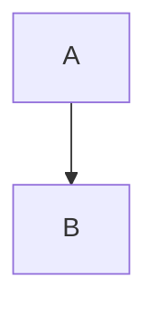

# Markdown Processing Tools

This directory contains scripts for processing and formatting mathematical documentation in the Fragile project.

## Available Tools

### `convert_mermaid_blocks.py`

Converts GitHub-flavored markdown mermaid blocks (````mermaid`) to Jupyter Book MyST directive format (`:::mermaid`).

**Usage:**
```bash
# Convert a single file
python convert_mermaid_blocks.py input.md output.md

# Process a directory in-place (modifies original files)
python convert_mermaid_blocks.py docs/source --in-place
```

**Automatic Execution:**
- This script runs automatically during `make build-docs`
- Allows editing with GitHub-flavored markdown syntax in VSCode
- Converts to Jupyter Book format only at build time

**Example Conversion:**
```markdown
# Input (GitHub-flavored markdown)


# Output (Jupyter Book MyST)
:::mermaid
graph TD
    A --> B
:::
```

### `convert_unicode_math.py`

Converts Unicode mathematical symbols to LaTeX equivalents.

### `convert_backticks_to_math.py`

Converts backtick-enclosed math expressions to dollar sign format.

### `fix_math_formatting.py`

Ensures proper spacing around LaTeX display math blocks (`$$`).

### `format_math_blocks.py`

Comprehensive formatting fixes for mathematical notation in markdown.

### `fix_complex_subscripts.py`

Handles complex subscript notation in mathematical expressions.

## Integration with Documentation Build

The mermaid conversion is integrated into the Jupyter Book build process:

1. `make build-docs` triggers the hatch docs environment
2. The build script runs `convert_mermaid_blocks.py` on `docs/source/`
3. Jupyter Book then processes the converted files
4. Documentation is generated with properly rendered mermaid diagrams

This workflow allows you to:
- Edit markdown files with standard ````mermaid` syntax (works in VSCode preview)
- Have diagrams automatically converted to Jupyter Book format at build time
- Keep source files in a format compatible with GitHub and other markdown viewers
